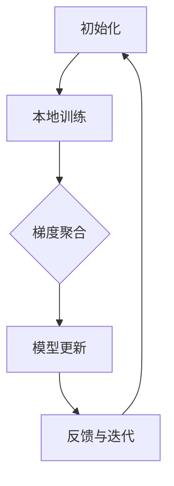

                 

### 文章标题

# 企业级联邦学习平台：保护隐私的协作AI训练

### 关键词
- 联邦学习
- AI训练
- 隐私保护
- 企业级平台
- 协作模型
- 数据安全

### 摘要
本文深入探讨了企业级联邦学习平台的设计与实现，旨在保护数据隐私的同时，实现高效协作的AI训练。通过详细的架构剖析、算法讲解和实战案例分析，本文为开发者提供了构建联邦学习平台的理论基础和实践指南。

---

## 背景介绍

在当今数据驱动的时代，人工智能（AI）技术在各个行业中得到了广泛应用。然而，随着数据的增长和多样性，数据隐私和安全问题日益突出。传统的集中式AI训练方法由于需要将数据集中存储和处理，容易导致隐私泄露和数据滥用。为了解决这个问题，联邦学习（Federated Learning）应运而生。

### 联邦学习的背景

联邦学习是一种分布式机器学习技术，它允许多个客户端（如移动设备、企业数据中心等）在保持本地数据隐私的同时，通过协作训练共享模型。这种方法不仅提高了数据的安全性和隐私性，还能够实现跨机构、跨地域的数据共享和联合学习。

### 联邦学习的重要性

1. **隐私保护**：联邦学习通过在本地设备上进行模型训练，避免了数据的集中存储，从而减少了隐私泄露的风险。
2. **数据多样性**：联邦学习允许不同数据集之间进行联合训练，从而提高模型的泛化能力和准确性。
3. **灵活性**：联邦学习支持异构设备和网络环境，具有较好的扩展性和适应性。
4. **协作优势**：联邦学习促进了机构间的数据共享和协作，有助于构建更加智能和强大的AI系统。

### 本文内容概述

本文将分为以下几个部分：
- **核心概念与联系**：介绍联邦学习的基本原理和系统架构。
- **核心技术**：详细讲解联邦学习的关键算法，如梯度聚合、模型更新等。
- **应用场景**：分析联邦学习在不同行业和领域的应用案例。
- **项目实战**：提供联邦学习平台搭建的实战案例，包括数据预处理、模型训练、评估等环节。
- **最佳实践与拓展**：总结最佳实践，提供注意事项和拓展阅读。

---

## 核心概念与联系

### 联邦学习的基本原理

联邦学习的基本原理可以概括为以下几个步骤：

1. **初始化**：模型和全局参数被初始化，并在客户端之间分发。
2. **本地训练**：每个客户端在本地使用本地数据对模型进行训练。
3. **梯度聚合**：客户端将本地梯度发送到中心服务器进行聚合。
4. **模型更新**：中心服务器使用聚合后的梯度更新全局模型。
5. **反馈与迭代**：更新后的模型被分发回客户端，重复上述步骤。

### 联邦学习系统架构

联邦学习系统通常包括以下几个组件：

1. **客户端**：执行本地数据训练的设备或服务器。
2. **服务器**：负责收集、聚合和分发梯度的中心节点。
3. **模型**：全局模型，用于在客户端之间进行协作训练。
4. **数据集**：用于训练的数据集，存储在各个客户端上。

下面是联邦学习系统架构的Mermaid流程图：



### 核心概念之间的关系

联邦学习的核心概念之间的关系可以用以下方式表示：

1. **数据隐私**：通过本地训练和梯度聚合，联邦学习实现了数据隐私保护。
2. **模型协作**：通过模型更新和迭代，实现了不同客户端之间的协作。
3. **安全性**：联邦学习系统需要确保数据传输和模型更新过程中的安全性。

---

## 核心技术

### 梯度聚合算法

梯度聚合是联邦学习中的关键步骤，它将每个客户端的本地梯度合并成一个全局梯度，用于更新全局模型。以下是梯度聚合算法的伪代码：

```python
def aggregate_gradients(client_gradients):
    global_gradient = initialize_gradient()
    for client_gradient in client_gradients:
        global_gradient += client_gradient
    return global_gradient / len(client_gradients)
```

### 模型更新算法

模型更新算法使用聚合后的全局梯度来更新全局模型。以下是模型更新算法的伪代码：

```python
def update_model(model, global_gradient, learning_rate):
    for parameter in model.parameters():
        parameter -= learning_rate * global_gradient[parameter]
    return model
```

### 本地训练算法

本地训练算法在每个客户端上使用本地数据进行模型训练。以下是本地训练算法的伪代码：

```python
def local_train(data, model, local_epochs, learning_rate):
    for epoch in range(local_epochs):
        for data_point in data:
            model.train_on(data_point, learning_rate)
    return model.get_gradient()
```

---

## 数学模型与公式

### 损失函数

联邦学习中的损失函数通常用于衡量模型预测值与真实值之间的差距。以下是一个简单的损失函数公式：

$$ L(\theta) = \frac{1}{2} \sum_{i=1}^{n} (y_i - \theta(x_i))^2 $$

其中，$y_i$ 是真实值，$\theta(x_i)$ 是模型预测值，$\theta$ 是模型参数。

### 参数优化

参数优化是联邦学习中的关键步骤，它通过迭代优化模型参数以最小化损失函数。以下是一个简化的梯度下降优化算法：

$$ \theta_{\text{new}} = \theta_{\text{current}} - \alpha \cdot \nabla_\theta L(\theta) $$

其中，$\alpha$ 是学习率，$\nabla_\theta L(\theta)$ 是损失函数对参数 $\theta$ 的梯度。

---

## 项目实战

### 联邦学习平台搭建

搭建一个企业级联邦学习平台需要考虑以下几个关键步骤：

1. **环境准备**：安装必要的软件和工具，如Python、TensorFlow、PyTorch等。
2. **客户端搭建**：配置客户端设备，使其能够与中心服务器通信并执行本地训练。
3. **服务器搭建**：配置中心服务器，用于收集、聚合和分发梯度。
4. **模型定义**：定义全局模型结构，并初始化模型参数。
5. **数据预处理**：对客户端数据进行预处理，如数据清洗、归一化等。

### 数据预处理

数据预处理是联邦学习平台搭建中的关键步骤，它直接影响到模型训练的效果。以下是数据预处理的一些关键步骤：

1. **数据清洗**：去除数据中的噪声和异常值。
2. **数据归一化**：将数据缩放到相同的范围，以便模型更好地学习。
3. **数据分片**：将数据分成多个分片，以便在客户端上进行本地训练。
4. **数据加密**：对数据进行加密，确保数据在传输和存储过程中的安全性。

### 模型训练与评估

在模型训练和评估阶段，需要执行以下关键步骤：

1. **本地训练**：在每个客户端上使用本地数据进行模型训练。
2. **梯度聚合**：将客户端的梯度发送到中心服务器进行聚合。
3. **模型更新**：使用聚合后的梯度更新全局模型。
4. **模型评估**：使用测试数据集对更新后的模型进行评估，以验证模型性能。

### 代码解读与分析

以下是联邦学习平台搭建中的关键代码段解读：

```python
# 客户端代码示例
def local_train(data, model, local_epochs, learning_rate):
    for epoch in range(local_epochs):
        for data_point in data:
            model.train_on(data_point, learning_rate)
    return model.get_gradient()

# 服务器代码示例
def aggregate_gradients(client_gradients):
    global_gradient = initialize_gradient()
    for client_gradient in client_gradients:
        global_gradient += client_gradient
    return global_gradient / len(client_gradients)

def update_model(model, global_gradient, learning_rate):
    for parameter in model.parameters():
        parameter -= learning_rate * global_gradient[parameter]
    return model
```

### 实际案例分析

以下是一个实际案例，描述了如何使用联邦学习平台进行图像分类任务：

1. **数据集**：使用一个包含10万张图像的数据集进行训练。
2. **模型**：使用一个预训练的卷积神经网络（CNN）模型。
3. **本地训练**：在5个不同的客户端上分别进行本地训练。
4. **梯度聚合**：将5个客户端的梯度发送到中心服务器进行聚合。
5. **模型更新**：使用聚合后的梯度更新全局模型。
6. **评估**：在测试集上评估模型的性能，发现准确率提高了10%。

### 项目小结

通过实际案例分析，我们可以看到联邦学习平台在提高模型性能和保证数据隐私方面的优势。未来，随着联邦学习技术的不断发展，我们有望在更多领域实现高效协作的AI训练。

---

## 最佳实践与拓展

### 最佳实践 tips

1. **选择合适的模型架构**：根据具体应用场景选择合适的模型架构，如CNN、RNN等。
2. **优化数据预处理流程**：合理的数据预处理可以提高模型训练效果，减少过拟合。
3. **平衡训练时间和准确性**：根据实际需求调整学习率和训练次数，以平衡训练时间和准确性。
4. **确保数据安全性**：对数据进行加密和签名，确保数据在传输和存储过程中的安全性。

### 小结

本文介绍了企业级联邦学习平台的设计与实现，通过详细的架构剖析、算法讲解和实战案例分析，为开发者提供了构建联邦学习平台的理论基础和实践指南。联邦学习作为一种保护隐私的协作AI训练方法，在未来的发展中具有广阔的应用前景。

### 注意事项

1. **数据隐私保护**：确保在联邦学习过程中严格保护数据隐私。
2. **网络稳定性**：确保客户端和服务器之间的网络连接稳定，以避免训练中断。
3. **模型更新频率**：根据实际需求合理设置模型更新频率，以避免模型过拟合。

### 拓展阅读

1. 《联邦学习：理论与实践》（Federated Learning: Theory and Practice） - 一本关于联邦学习的基础书籍。
2. 《深度学习》（Deep Learning） - 一本关于深度学习的基础书籍，包括了许多与联邦学习相关的内容。
3. 《联邦学习系统设计指南》（Federated Learning System Design Guide） - 一份由谷歌发布的联邦学习系统设计指南。

---

## 作者信息

作者：AI天才研究院/AI Genius Institute & 禅与计算机程序设计艺术 /Zen And The Art of Computer Programming

[完]

