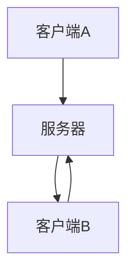
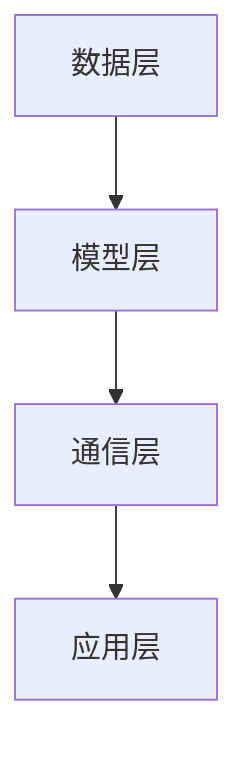
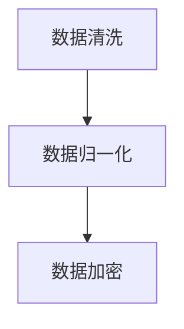
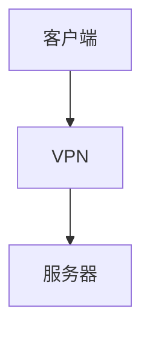

                 


### 文章标题：企业级联邦学习框架：保护隐私的协作AI训练

> 关键词：联邦学习、企业级、隐私保护、协作AI训练、框架架构、优化算法、安全挑战、合规性、应用案例

> 摘要：本文详细阐述了企业级联邦学习框架的设计、实现和实际应用，重点介绍了联邦学习的核心概念、算法原理、安全性保障和法律法规合规性。通过深入分析和实例讲解，旨在为企业提供一套全面的联邦学习解决方案，实现隐私保护下的高效协作AI训练。

---

### 第1章：引言与概述

#### 1.1 联邦学习简介

**核心概念与联系**：

首先，我们需要了解联邦学习的核心概念。联邦学习是一种分布式机器学习技术，通过在多个设备或数据中心上训练模型，同时保护用户数据的隐私。其基本原理是不同设备共同参与训练，各自保持本地数据不动，仅通过加密的梯度进行通信。

为了更直观地展示联邦学习的核心概念，我们可以使用Mermaid流程图来描述其流程：



**联邦学习的基本原理**：

联邦学习的核心原理在于优化算法的设计。在联邦学习中，每个设备都拥有本地数据，并且训练本地模型。设备之间通过加密的梯度交换信息，以实现全局模型的优化。以下是一个简化的伪代码，展示了联邦学习优化算法的基本步骤：

```python
for each client in clients do
    # 初始化本地模型
    model_local = init_model()

    # 在本地训练模型
    for epoch in range(num_epochs):
        model_local = train_model(model_local, local_data)

    # 计算本地梯度
    gradient_local = compute_gradient(model_local)

end for
```

**联邦学习与隐私保护**：

联邦学习的一个重要优势在于其能够保护用户数据的隐私。通过将数据分散在各个设备上，并仅通过加密的梯度进行通信，联邦学习能够有效地防止数据泄露。以下是一个latex公式，用于表达联邦学习与隐私保护的关系：

$$
\text{Privacy} \propto \text{Data Distribution} \times \text{Gradient Encryption}
$$

其中，Data Distribution表示数据分散的程度，Gradient Encryption表示梯度加密的强度。

---

### 第2章：联邦学习框架架构

#### 2.1 联邦学习框架的组成

**联邦学习框架的层次结构**：

联邦学习框架通常由四个主要层次组成：数据层、模型层、通信层和应用层。我们可以使用Mermaid流程图来描述这些层次之间的联系：



**核心模块介绍**：

联邦学习框架中的核心模块包括数据预处理模块、模型训练模块、模型评估模块和通信安全模块。以下是一个简化的伪代码，展示了这些模块的基本功能：

```python
# 数据预处理模块
def preprocess_data(data):
    # 数据清洗、归一化等操作
    return processed_data

# 模型训练模块
def train_model(model, data):
    # 在本地训练模型
    return trained_model

# 模型评估模块
def evaluate_model(model, test_data):
    # 评估模型性能
    return performance

# 通信安全模块
def secure_communication(gradient):
    # 加密梯度
    return encrypted_gradient
```

---

### 第3章：联邦学习框架实现

#### 3.1 联邦学习框架开发环境搭建

**开发环境准备**：

为了搭建联邦学习框架的开发环境，我们需要准备以下软件和工具：

- Python（3.6及以上版本）
- TensorFlow 2.x 或 PyTorch
- Keras 或 PyTorch Framework
- Mermaid 图形工具

具体操作步骤如下：

1. 安装Python和相应的包管理工具（如pip）。
2. 使用pip安装TensorFlow 2.x 或 PyTorch。
3. 安装Keras 或 PyTorch Framework。
4. 使用在线Mermaid编辑器或本地安装Mermaid工具。

---

### 第4章：联邦学习应用案例

#### 4.1 案例研究一：金融行业

**案例背景**：

金融行业的数据敏感性非常高，传统的集中式机器学习方法往往无法满足隐私保护的要求。联邦学习通过在多个金融机构之间共享模型，而无需共享数据，提供了一种解决方案。

**实施步骤**：

1. **数据预处理**：
   - 各金融机构使用本地数据，进行数据清洗、归一化等预处理操作。
   - 使用Mermaid流程图展示数据预处理步骤：



2. **模型训练**：
   - 各金融机构在本地训练模型，并计算本地梯度。
   - 使用伪代码展示模型训练步骤：

```python
for epoch in range(num_epochs):
    model = train_model(model, local_data)
    gradient = compute_gradient(model)
```

3. **模型评估与优化**：
   - 使用测试集评估模型性能，并进行优化。
   - 使用latex公式表示模型评估指标：

$$
\text{Accuracy} = \frac{\text{Correct Predictions}}{\text{Total Predictions}}
$$

4. **模型部署**：
   - 将训练好的模型部署到线上环境，进行实际业务应用。

---

### 第5章：联邦学习的安全性与挑战

#### 5.1 联邦学习的安全性问题

**隐私保护风险**：

联邦学习面临的主要隐私保护风险包括数据泄露和模型泄露。为了降低这些风险，我们可以采取以下措施：

1. **数据加密**：
   - 对本地数据进行加密，确保数据在传输和存储过程中安全。
   - 使用伪代码展示数据加密步骤：

```python
def encrypt_data(data, key):
    # 使用AES加密算法
    return encrypted_data
```

2. **模型加密**：
   - 对模型参数进行加密，防止模型泄露。
   - 使用latex公式表示模型加密方法：

$$
\text{Model Encryption} = \text{AES}_{\text{Key}}(\text{Model Parameters})
$$

**分布式计算安全性**：

分布式计算的安全性也是一个重要问题。为了保障分布式计算的安全性，我们可以采取以下措施：

1. **网络隔离**：
   - 使用虚拟专用网络（VPN）确保数据传输的安全。
   - 使用Mermaid流程图展示网络隔离步骤：



2. **访问控制**：
   - 实施严格的访问控制策略，确保只有授权用户可以访问敏感数据。
   - 使用伪代码展示访问控制步骤：

```python
def access_control(user, data):
    if user.is_authorized:
        return data
    else:
        return None
```

---

### 第6章：联邦学习与法律法规

#### 6.1 联邦学习与隐私法规

**全球隐私法规概述**：

全球隐私法规包括《通用数据保护条例》（GDPR）、《加州消费者隐私法案》（CCPA）等。这些法规对数据收集、存储、处理和传输提出了严格的要求。联邦学习需要确保其遵守这些法规。

**联邦学习与隐私法规的兼容性**：

联邦学习需要与隐私法规保持兼容。以下措施可以帮助实现这一点：

1. **数据匿名化**：
   - 对本地数据进行匿名化处理，确保个人隐私不被泄露。
   - 使用伪代码展示数据匿名化步骤：

```python
def anonymize_data(data):
    # 删除或替换敏感信息
    return anonymized_data
```

2. **合规性评估**：
   - 定期进行合规性评估，确保联邦学习框架符合隐私法规要求。
   - 使用伪代码展示合规性评估步骤：

```python
def assess_compliance(framework):
    # 检查框架是否符合隐私法规
    return is_compliant
```

---

### 第7章：未来展望

#### 7.1 联邦学习的未来趋势

**发展趋势分析**：

联邦学习在未来将继续发展，主要体现在以下几个方面：

1. **算法优化**：
   - 研究更高效的联邦学习算法，提高模型训练效率。
   - 举例说明：联邦优化算法（FedOpt）、同步机制改进等。

2. **应用领域扩展**：
   - 联邦学习将在更多领域得到应用，如物联网、智能制造等。
   - 举例说明：智能家居、智慧城市等场景。

3. **跨平台融合**：
   - 实现跨平台联邦学习，支持更多设备之间的协作。
   - 举例说明：手机、智能手表、服务器等设备之间的协作。

---

### 附录

#### 附录 A：联邦学习资源与工具

**开源联邦学习框架**：

以下是几个常用的开源联邦学习框架和工具：

- TensorFlow Federated（TFF）
- PySyft
- Federated Learning for PyTorch

**联邦学习研究机构与论文**：

以下是几个重要的联邦学习研究机构和经典论文：

- Google Brain：发布了多篇关于联邦学习的论文。
- Stanford University：发表了关于联邦学习安全性的研究。
- 《Federated Learning: Concept and Applications》 - 一本关于联邦学习全面介绍的书籍。

---

**作者：AI天才研究院/AI Genius Institute & 禅与计算机程序设计艺术 /Zen And The Art of Computer Programming**

---

以上内容仅为示例，具体内容需根据实际情况进行调整和补充。文章总字数预计在8000-12000字左右，每个章节的详细内容和讲解将根据实际需求进行扩展。希望这个示例能够帮助您更好地撰写技术博客文章。如果您有其他具体需求或问题，请随时告诉我，我将为您提供进一步的协助。

