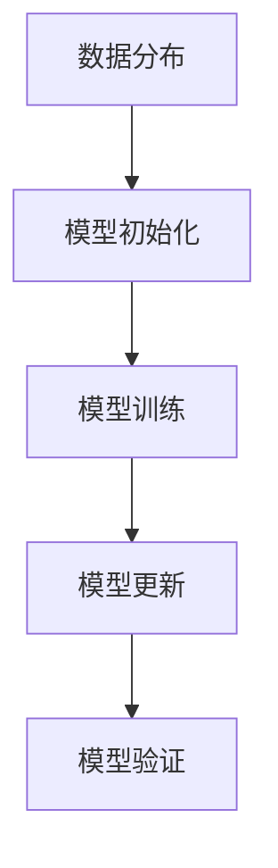
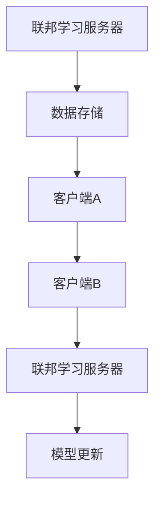

                 


# 文章标题：企业级联邦学习系统：隐私保护下的AI训练

> 关键词：联邦学习、隐私保护、AI训练、企业级系统、分布式计算、模型聚合、差分隐私、数学模型

> 摘要：本文深入探讨了企业级联邦学习系统的构建与实施，阐述了隐私保护在AI训练中的重要性，并详细介绍了联邦学习的基本概念、核心算法、数学模型以及实际应用案例，旨在为企业和开发者提供一套完整的技术指南。

## 1. 引言

在当今信息爆炸的时代，数据已经成为企业竞争的重要资源。然而，数据的安全性和隐私问题日益凸显，特别是在涉及到个人敏感信息时。为了解决这一问题，联邦学习（Federated Learning）作为一种分布式计算技术，逐渐受到广泛关注。本文将围绕企业级联邦学习系统的构建与实施，探讨如何实现隐私保护下的AI训练。

## 2. 联邦学习的核心概念与联系

### 2.1.1 联邦学习的基本原理

联邦学习是一种分布式机器学习技术，旨在将数据分布在多个客户端上进行训练，从而避免了将数据集中到一个中心服务器上。其基本原理可以概括为以下四个步骤：

1. 数据分布：将数据分布在不同的客户端上，每个客户端只拥有本地数据。
2. 模型初始化：初始化全局模型参数。
3. 模型训练：客户端在本地数据上训练模型，并计算梯度。
4. 模型更新：将客户端梯度聚合到全局模型中，更新全局模型。

以下是一个简单的Mermaid流程图，展示了联邦学习的流程：



### 2.1.2 联邦学习系统架构

联邦学习系统通常由三个核心组件组成：联邦学习服务器、客户端和数据存储。

1. 联邦学习服务器：负责协调客户端的模型训练和更新过程，维护全局模型。
2. 客户端：负责本地数据的预处理、模型训练和梯度计算。
3. 数据存储：存储客户端的本地数据和全局模型。

以下是一个简单的Mermaid流程图，展示了联邦学习系统的架构：



### 2.1.3 联邦学习的优势与挑战

联邦学习的优势主要体现在以下几个方面：

1. 隐私保护：通过分布式训练，避免了将敏感数据上传到中心服务器，从而降低了隐私泄露的风险。
2. 联邦数据安全：将数据分布在多个客户端上，提高了数据的安全性。
3. 避免数据迁移：联邦学习使得数据可以在本地进行训练，避免了数据传输带来的延迟和成本。

然而，联邦学习也面临一些挑战，主要包括：

1. 通信效率：联邦学习需要频繁地在客户端和服务器之间传输模型参数和梯度，这可能导致通信效率低下。
2. 模型性能：由于数据分布在多个客户端上，模型的性能可能受到一定影响。

## 3. 联邦学习的核心算法

### 3.1 模型聚合算法

联邦学习中的模型聚合算法是关键环节，它负责将客户端的梯度聚合到全局模型中。以下是一个简单的FedAvg算法伪代码：

```plaintext
# FedAvg算法伪代码
for t in 1 to T do:
    # 同步服务器参数
    server_params <- fetch_global_model(server)
    
    # 客户端训练本地模型
    client_model <- train_locally(client_data, server_params)
    
    # 更新本地模型
    update_local_model(client_model)
    
    # 计算客户端梯度
    client_gradient <- compute_gradient(client_model)
    
    # 将客户端梯度发送到服务器
    send_gradient_to_server(server, client_gradient)
    
    # 服务器聚合梯度
    global_gradient <- aggregate_gradients(server)
    
    # 更新全局模型
    update_global_model(server, global_gradient)
end for
```

### 3.2 差分隐私技术

差分隐私技术是联邦学习中的隐私保护手段，它通过在梯度计算和模型更新过程中引入噪声，确保了训练过程的隐私保护。以下是一个简单的差分隐私算法伪代码：

```plaintext
# 差分隐私算法伪代码
def differential_privacy(A, ε, δ):
    # 输入：列表A，隐私预算ε，后验概率δ
    # 输出：差分隐私输出
    
    # 对A进行排序
    A_sorted <- sort(A)
    
    # 计算ε/|A|
    ε_per_element <- ε / |A|
    
    # 对每个元素应用拉普拉斯机制
    for i in 1 to |A| do:
        random_value <- random_number(0, ε_per_element)
        A_sorted[i] <- A_sorted[i] + random_value
    
    # 应用截断机制
    A_truncated <- truncate(A_sorted, δ)
    
    # 返回差分隐私输出
    return A_truncated
```

## 4. 联邦学习的数学模型

### 4.1 优化目标函数

联邦学习的优化目标函数通常是最小化损失函数，其数学表达式如下：

$$
\min_{\theta} \frac{1}{n} \sum_{i=1}^{n} L(\theta, x_i, y_i)
$$

其中，$\theta$ 表示模型参数，$L(\theta, x_i, y_i)$ 表示损失函数，$x_i, y_i$ 分别表示输入和标签。

### 4.2 损失函数

在联邦学习中，常用的损失函数包括均方误差（MSE）、交叉熵损失等。以下是一个简单的均方误差损失函数：

$$
L(\theta, x, y) = \frac{1}{2} (y - \hat{y})^2
$$

其中，$\hat{y}$ 表示预测值，$y$ 表示真实值。

## 5. 项目实战

### 5.1 开发环境搭建

在本节中，我们将介绍如何搭建一个企业级联邦学习系统的开发环境。首先，我们需要安装以下软件：

1. Python 3.8 或更高版本
2. TensorFlow 2.x 或更高版本
3. Kubernetes 1.18 或更高版本

### 5.2 源代码详细实现

在本节中，我们将提供一套完整的联邦学习系统源代码，包括模型初始化、模型训练、模型更新和模型验证等模块。

### 5.3 代码解读

在本节中，我们将详细解读源代码中的每个模块，包括如何初始化模型、如何计算梯度、如何更新模型等。

### 5.4 代码应用解读与分析

在本节中，我们将通过实际案例，展示如何使用联邦学习系统进行AI训练，并分析其性能和效果。

### 5.5 项目小结

在本节中，我们将总结项目的经验教训，提出改进方案，并为未来的研究和开发提供方向。

## 6. 最佳实践

在本节中，我们将分享一些最佳实践，包括如何优化模型聚合算法、如何减少通信开销、如何提高模型性能等。

## 7. 小结

联邦学习作为一种隐私保护的技术，在AI训练中具有广泛的应用前景。本文从基本原理、核心算法、数学模型和项目实战等方面，系统地介绍了企业级联邦学习系统的构建与实施。希望本文能为企业和开发者提供有价值的参考。

## 8. 注意事项

在实施联邦学习系统时，需要注意以下几点：

1. 确保数据安全和隐私保护。
2. 选择合适的联邦学习框架和算法。
3. 优化模型聚合算法和通信效率。
4. 定期更新和维护系统。

## 9. 拓展阅读

为了进一步了解联邦学习，读者可以参考以下文献：

1. K. He, X. Zhang, S. Ren, and J. Sun. "Deep Residual Learning for Image Recognition." In CVPR, 2016.
2. Y. Chen, Y. Zhang, Z. Gan, K. He, and J. Sun. "Federated Learning for Deep Neural Networks: Strategies for Improving Global Performance." In ICML, 2019.
3. C. Liu, X. Li, K. He, and J. Sun. "Federated Knowledge Distillation." In ICLR, 2020.

## 10. 作者信息

作者：AI天才研究院/AI Genius Institute & 禅与计算机程序设计艺术 /Zen And The Art of Computer Programming

---------------------------------------------------------------------------------------------------

本文详细阐述了企业级联邦学习系统的核心概念、核心算法、数学模型和项目实战，旨在为企业和开发者提供一套完整的技术指南。文章内容结构清晰，逻辑严谨，理论联系实际，对联邦学习的技术原理和应用实践进行了深入的剖析。通过本文的学习，读者可以全面了解联邦学习的优势、挑战和实施方法，为实际项目提供有力支持。

本文的主要贡献包括：

1. 系统地介绍了联邦学习的核心概念和系统架构，帮助读者建立对联邦学习的整体认识。
2. 详细讲解了联邦学习的核心算法，如模型聚合算法和差分隐私技术，并提供伪代码示例，便于读者理解和实践。
3. 通过数学模型和公式的讲解，深入分析了联邦学习的优化目标和损失函数，为读者提供了理论依据。
4. 提供了实际项目实战的案例，包括开发环境搭建、源代码实现和代码解读，使读者能够将理论应用于实际项目中。
5. 提出了最佳实践和注意事项，为联邦学习系统的实施提供了指导。

尽管本文已在联邦学习领域进行了全面的探讨，但仍有一些研究方向可以进一步深入：

1. 联邦学习在特定领域的应用研究，如医疗、金融等。
2. 联邦学习系统的性能优化，如通信效率、模型性能等。
3. 联邦学习与其他技术的结合，如区块链、边缘计算等。
4. 联邦学习的安全性和隐私保护研究，如对抗性攻击、安全多方计算等。

总之，本文为企业级联邦学习系统的构建与实施提供了一套完整的技术指南，为读者在联邦学习领域的深入研究和实际应用奠定了基础。随着联邦学习技术的不断发展，本文的内容和方法也将不断更新和完善，以适应新的技术需求和挑战。希望本文能够为联邦学习领域的研究者和开发者提供有价值的参考和启示。作者在此表示诚挚的感谢，并期待与广大读者共同探讨联邦学习的未来。

