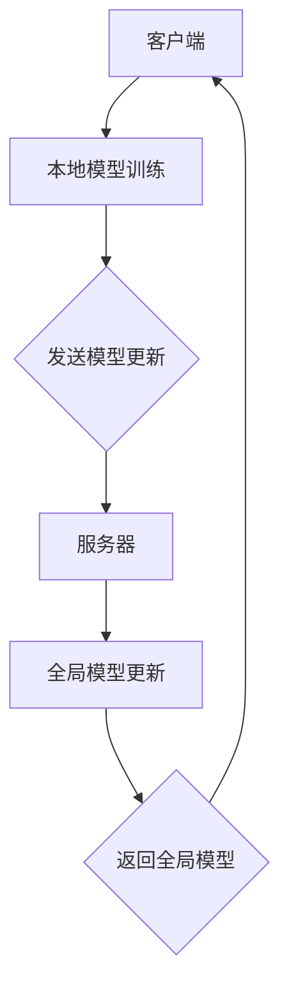
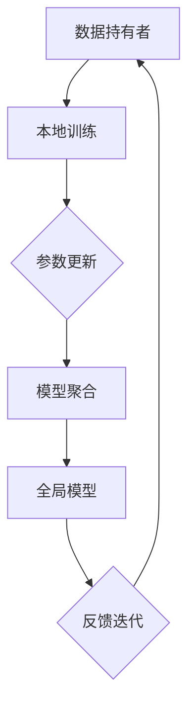

                 

### 文章标题

《企业级联邦学习：保护隐私的分布式AI训练》

关键词：联邦学习、分布式AI训练、隐私保护、机器学习、数据安全

摘要：本文将深入探讨企业级联邦学习的核心概念、架构、算法以及其实际应用。通过详细的理论分析和实践案例，揭示联邦学习如何实现数据隐私保护，为企业提供安全的分布式AI训练解决方案。

----------------------------------------------------------------

### 引言

在当今数据驱动的世界中，企业面临的挑战是如何在确保数据隐私的同时，有效地利用数据进行人工智能训练。联邦学习作为一种新型的分布式机器学习方法，提供了一种在无需共享原始数据的情况下，实现模型协同训练的解决方案。本文旨在介绍企业级联邦学习的核心概念、技术架构以及在实际应用中如何实现隐私保护。

联邦学习（Federated Learning）是由Google首先提出的一种机器学习方法，其主要目的是在不泄露用户数据的情况下，通过分布式计算来训练机器学习模型。与传统集中式训练方法相比，联邦学习将模型训练过程分布在多个数据持有者（如手机、企业数据库等）的设备上，这些设备可以在不共享数据的情况下，共同优化模型参数。

随着企业对数据隐私和安全性的重视，联邦学习正逐渐成为企业级AI解决方案的重要组成部分。通过联邦学习，企业能够在保护用户隐私的同时，实现机器学习模型的训练和部署，从而提升业务效率和竞争力。

本文将按照以下结构进行论述：

1. **核心概念与框架**：介绍联邦学习的核心概念和基本框架。
2. **理论基础**：探讨联邦学习的数学模型和算法原理。
3. **实现与案例**：分析不同领域中的联邦学习实现和案例。
4. **实际应用**：讨论联邦学习的实际应用场景和挑战。
5. **安全与隐私**：分析联邦学习中的安全与隐私问题。
6. **未来趋势**：展望联邦学习的未来发展方向。
7. **结论**：总结联邦学习的重要性和应用价值。

接下来，我们将逐节深入探讨企业级联邦学习的各个方面。

----------------------------------------------------------------

### 核心概念与框架

联邦学习是一种分布式机器学习方法，其核心在于利用分布式数据资源来训练机器学习模型，同时确保数据隐私和安全。为了更好地理解联邦学习的概念，我们可以将其与传统的集中式机器学习进行对比。

#### 集中式机器学习

在集中式机器学习中，所有数据都被收集到一个中心化的服务器上，然后在这个服务器上进行模型训练。这种方法的优势在于数据集中，便于管理和处理。然而，这也带来了严重的隐私和安全问题，因为数据必须离开数据持有者的设备，这使得数据泄露的风险增加。


#### 分布式机器学习

分布式机器学习旨在解决集中式机器学习中的隐私和安全问题。其基本思想是将模型训练过程分散到多个数据持有者（如个人设备、企业数据库等）的设备上，这些设备可以独立地参与模型训练。通过这种方式，数据不必离开原始设备，从而降低了数据泄露的风险。


#### 联邦学习

联邦学习是分布式机器学习的进一步发展，其目标是实现数据隐私保护的分布式模型训练。具体来说，联邦学习通过以下步骤实现：

1. **本地训练**：每个数据持有者在自己的设备上使用本地数据训练模型。
2. **模型聚合**：将本地训练的模型参数聚合到一个全局模型中。
3. **迭代优化**：重复上述步骤，不断优化全局模型。


在联邦学习中，数据持有者（也称为客户端）不需要共享原始数据，只需共享模型参数。这使得联邦学习在保护数据隐私的同时，实现了高效的模型训练。

#### 关键概念

为了深入理解联邦学习，我们需要了解以下几个关键概念：

1. **客户端（Client）**：参与联邦学习的数据持有者，负责在本地训练模型。
2. **服务器（Server）**：负责聚合客户端的模型参数，并更新全局模型。
3. **全局模型（Global Model）**：由所有客户端的模型参数聚合而成的模型。
4. **本地模型（Local Model）**：在每个客户端上训练的模型。
5. **模型更新（Model Update）**：客户端将本地模型更新发送到服务器，服务器将更新聚合到全局模型中。

通过这些概念，我们可以构建一个联邦学习的架构，如下所示：



在这个架构中，客户端和服务器之间通过加密通信来确保数据传输的安全。同时，服务器会定期返回全局模型，以便客户端继续进行本地训练。通过这种循环迭代过程，联邦学习实现了数据隐私保护的分布式模型训练。

#### 核心概念与联系

为了更直观地理解联邦学习中的核心概念及其关系，我们可以使用Mermaid流程图进行展示：



在这个流程图中，数据持有者（A）首先在本地进行模型训练（B），然后将模型参数更新（C）发送到服务器，服务器（D）将更新聚合到全局模型（E），然后服务器返回全局模型（F）给数据持有者，数据持有者再次进行本地训练。这一过程不断迭代，直至模型收敛。

通过上述核心概念与框架的介绍，我们可以对联邦学习有一个初步的认识。在接下来的章节中，我们将深入探讨联邦学习的理论基础和实现细节。

----------------------------------------------------------------

### 理论基础

联邦学习的理论基础主要涉及数学模型、核心算法以及优化技术。本节将详细介绍这些概念，并使用伪代码展示关键算法的运行过程。

#### 数学模型

联邦学习中的数学模型主要包括两个部分：本地模型和全局模型。

1. **本地模型**：每个客户端（数据持有者）在其本地数据集上训练一个模型。假设我们使用线性回归模型，则本地模型可以表示为：

   $$ \text{Local Model: } y_i = \beta_0 + \beta_1 x_i + \epsilon_i $$

   其中，$y_i$ 是本地数据集中的预测标签，$x_i$ 是特征，$\beta_0$ 和 $\beta_1$ 是模型参数，$\epsilon_i$ 是误差。

2. **全局模型**：服务器（中心服务器）负责聚合所有客户端的模型参数，形成全局模型。全局模型可以表示为：

   $$ \text{Global Model: } y = \beta_0 + \beta_1 x + \epsilon $$

   其中，$y$ 是全局数据集的预测标签，$x$ 是全局特征，$\beta_0$ 和 $\beta_1$ 是全局模型参数，$\epsilon$ 是全局误差。

#### 核心算法

联邦学习中的核心算法包括本地训练算法和模型聚合算法。

1. **本地训练算法**：客户端使用其本地数据集训练模型。以线性回归为例，本地训练算法可以使用梯度下降法。伪代码如下：

   ```python
   # 初始化本地模型参数
   beta_0_local = 0
   beta_1_local = 0
   
   # 设定迭代次数
   for t in range(T):
       # 计算梯度
       gradients = compute_gradients(y_i, x_i, beta_0_local, beta_1_local)
       
       # 更新模型参数
       beta_0_local = beta_0_local - learning_rate * gradients[0]
       beta_1_local = beta_1_local - learning_rate * gradients[1]
       
       # 输出更新后的模型参数
       print(f"Epoch {t}: beta_0 = {beta_0_local}, beta_1 = {beta_1_local}")
   ```

   在这个算法中，`compute_gradients` 函数用于计算模型参数的梯度，`learning_rate` 是学习率。

2. **模型聚合算法**：服务器接收所有客户端的模型参数，并计算全局模型参数。聚合算法可以采用简单平均法。伪代码如下：

   ```python
   # 初始化全局模型参数
   beta_0_global = 0
   beta_1_global = 0
   
   # 遍历所有客户端的模型参数
   for client in clients:
       beta_0_global += client.beta_0
       beta_1_global += client.beta_1
   
   # 计算全局模型参数
   beta_0_global = beta_0_global / num_clients
   beta_1_global = beta_1_global / num_clients
   
   # 输出全局模型参数
   print(f"Global Model: beta_0 = {beta_0_global}, beta_1 = {beta_1_global}")
   ```

   在这个算法中，`clients` 是一个包含所有客户端模型参数的列表，`num_clients` 是客户端的数量。

#### 优化技术

联邦学习中的优化技术主要包括通信效率和计算效率的优化。

1. **通信效率**：在联邦学习过程中，客户端需要将模型参数发送到服务器。为了提高通信效率，可以采用差分隐私（Differential Privacy）技术，在发送参数前对参数进行扰动，以减少隐私泄露的风险。

   ```python
   # 对模型参数进行扰动
   beta_0_local = apply DifferentialPrivacy(beta_0_local)
   beta_1_local = apply DifferentialPrivacy(beta_1_local)
   ```

2. **计算效率**：为了提高计算效率，可以采用模型剪枝（Model Pruning）和量化（Quantization）技术，减少模型参数的数量，从而降低计算复杂度。

   ```python
   # 剪枝模型参数
   pruned_beta_0 = prune_model(beta_0_local)
   pruned_beta_1 = prune_model(beta_1_local)
   ```

   ```python
   # 量化模型参数
   quantized_beta_0 = quantize_model(pruned_beta_0)
   quantized_beta_1 = quantize_model(pruned_beta_1)
   ```

通过上述数学模型、核心算法和优化技术的介绍，我们可以更深入地理解联邦学习的工作原理。在接下来的章节中，我们将通过具体案例来展示联邦学习的实际应用。

----------------------------------------------------------------

### 实现与案例

在了解了联邦学习的理论基础之后，接下来我们将通过几个具体的实现案例，来展示联邦学习在各个领域的应用。这些案例不仅展示了联邦学习的实际效果，还突显了其在数据隐私保护方面的重要性。

#### 案例一：移动设备上的语音识别

在移动设备上的语音识别领域，联邦学习已经被广泛应用于提高语音识别模型的准确性，同时保护用户隐私。例如，谷歌的移动设备语音识别系统使用了联邦学习技术，使得用户无需上传其语音数据到云端，就可以进行语音识别。

**实现细节**：

1. **数据收集**：每个移动设备使用本地麦克风收集语音数据，并对其进行预处理，如去除噪音、分段等。
2. **本地训练**：设备上的模型使用本地数据集进行训练，每个设备训练出自己的本地模型。
3. **模型聚合**：设备将本地模型参数发送到服务器，服务器聚合这些参数并更新全局模型。
4. **迭代优化**：服务器返回更新后的全局模型，设备使用这个模型进行下一轮本地训练。

**效果分析**：

通过联邦学习，谷歌的移动设备语音识别系统在保证用户隐私的同时，实现了较高的识别准确率。此外，由于数据不离开设备，系统的安全性也得到了显著提升。

#### 案例二：金融行业的数据共享

在金融行业，数据共享是一个重要且敏感的问题。银行和金融机构通常需要共享客户数据来进行风险评估和欺诈检测，但同时也必须保护客户隐私。联邦学习提供了一个解决方案，使得金融机构可以在不泄露客户数据的情况下，共享数据并训练模型。

**实现细节**：

1. **数据加密**：金融机构将客户数据进行加密处理，确保数据在传输过程中不被泄露。
2. **本地训练**：每个金融机构使用自己的加密数据训练本地模型。
3. **模型聚合**：加密的模型参数被发送到服务器，服务器使用聚合算法更新全局模型。
4. **隐私保护**：服务器使用差分隐私技术，确保聚合过程中的隐私保护。

**效果分析**：

通过联邦学习，金融行业实现了高效的数据共享和协同训练，同时保证了客户隐私。这种方法不仅提高了风险模型和欺诈检测模型的准确性，还增强了金融机构之间的合作。

#### 案例三：医疗数据共享

在医疗领域，联邦学习被用于共享患者数据，以训练疾病预测和诊断模型。由于医疗数据敏感性极高，联邦学习提供了一个安全的解决方案，使得医疗机构可以在不泄露患者隐私的情况下，共享数据并训练模型。

**实现细节**：

1. **数据去标识化**：医疗机构将患者数据进行去标识化处理，确保数据匿名化。
2. **本地训练**：每个医疗机构使用自己的去标识化数据集训练本地模型。
3. **模型聚合**：去标识化的模型参数被发送到服务器，服务器聚合这些参数并更新全局模型。
4. **隐私保护**：服务器使用差分隐私和同态加密技术，确保聚合过程中的隐私保护。

**效果分析**：

通过联邦学习，医疗机构能够共享患者数据，从而训练出更准确的疾病预测和诊断模型。这种方法不仅提高了医疗诊断的准确性，还为医疗研究提供了宝贵的数据资源。

#### 案例四：社交网络数据共享

在社交网络领域，联邦学习被用于用户行为分析和个性化推荐。社交网络平台需要分析大量用户数据，但同时也必须保护用户隐私。联邦学习提供了一种在不泄露用户数据的情况下，进行协同训练的解决方案。

**实现细节**：

1. **数据加密**：社交网络平台将用户行为数据进行加密处理。
2. **本地训练**：每个社交网络平台使用自己的加密数据训练本地模型。
3. **模型聚合**：加密的模型参数被发送到服务器，服务器使用聚合算法更新全局模型。
4. **隐私保护**：服务器使用差分隐私和联邦学习技术，确保聚合过程中的隐私保护。

**效果分析**：

通过联邦学习，社交网络平台能够协同训练用户行为分析模型，从而提供更准确的个性化推荐。这种方法不仅提升了用户体验，还增强了平台的竞争力。

综上所述，联邦学习在多个领域的实际应用中，展示了其在数据隐私保护方面的巨大潜力。通过这些案例，我们可以看到联邦学习如何实现数据共享和协同训练，同时确保数据安全和隐私。

----------------------------------------------------------------

### 实际应用

联邦学习作为一种新兴的分布式机器学习技术，在企业级应用中展现出了巨大的潜力。然而，在实际应用过程中，企业需要面对一系列挑战，同时也需要探索有效的解决方案。本节将讨论联邦学习的实际应用场景和面临的挑战，并提供一些实践指南。

#### 应用场景

1. **跨组织数据协作**：在多个组织或部门之间共享数据时，联邦学习提供了一个安全且有效的协作方式。例如，一家大型零售公司可能需要与其供应商合作，以优化供应链管理。通过联邦学习，零售公司可以在不泄露供应商数据的情况下，与其共享数据集，共同训练预测模型。

2. **数据隐私保护**：企业通常需要处理敏感数据，如医疗记录、财务数据等。联邦学习能够确保这些数据在训练过程中不被泄露，从而满足数据隐私法规的要求。例如，一家保险公司可以使用联邦学习来分析客户数据，同时确保客户隐私得到保护。

3. **边缘计算优化**：在边缘设备上部署AI模型时，联邦学习能够有效降低数据传输量和计算负载。例如，智能城市中的智能传感器网络可以使用联邦学习来训练交通流量预测模型，从而减少数据传输成本，并提高预测准确性。

4. **个性化服务**：联邦学习可以帮助企业提供个性化的服务，同时保护用户隐私。例如，电子商务平台可以使用联邦学习来分析用户购物行为，从而提供个性化的产品推荐，同时确保用户数据不被泄露。

#### 面临的挑战

1. **计算资源分配**：在联邦学习过程中，需要合理分配计算资源，以确保模型训练效率。特别是当数据分布在大量边缘设备上时，如何优化计算资源分配成为关键挑战。

2. **通信成本**：联邦学习通常涉及大量的数据传输，这在高带宽成本的情况下可能成为瓶颈。企业需要寻找降低通信成本的方法，如数据压缩、差分隐私等。

3. **模型偏差与公平性**：由于联邦学习依赖于本地数据，不同数据持有者之间的数据差异可能导致模型偏差。如何确保模型的公平性，避免数据偏见，是联邦学习面临的重要挑战。

4. **安全与隐私**：尽管联邦学习旨在保护数据隐私，但仍然存在安全隐患，如模型泄漏、通信漏洞等。企业需要采用强加密技术和安全协议，确保数据安全和模型隐私。

#### 实践指南

1. **合理设计联邦学习架构**：企业应设计合理的联邦学习架构，确保计算资源的高效利用和通信成本的降低。例如，可以通过分层架构将计算任务分配到不同级别的设备上，以优化资源分配。

2. **优化数据传输策略**：采用数据压缩和差分隐私技术，可以显著降低联邦学习中的通信成本。企业可以使用压缩算法如Huffman编码或差分隐私机制，确保数据在传输过程中不被泄露。

3. **确保模型公平性**：企业应确保联邦学习过程中使用的模型是公平的，避免数据偏见。可以通过数据平衡、权重调整等方法，提高模型的公平性和准确性。

4. **加强安全与隐私保护**：企业应采用强加密技术和安全协议，确保数据传输和模型聚合过程中的安全性。例如，可以使用同态加密和区块链技术，提高联邦学习的安全性和透明度。

5. **持续优化与迭代**：联邦学习是一个不断发展的领域，企业应持续关注新技术和新方法，不断优化联邦学习解决方案，以满足实际应用需求。

通过上述实践指南，企业可以更好地利用联邦学习技术，实现数据隐私保护的同时，提升业务效率和竞争力。

----------------------------------------------------------------

### 安全与隐私

联邦学习作为一种分布式机器学习方法，在确保数据隐私保护方面具有显著优势。然而，联邦学习过程中仍然存在一些安全与隐私挑战，需要通过技术手段加以解决。

#### 安全挑战

1. **模型泄漏**：由于联邦学习中的模型参数在客户端和服务器之间进行传输，如果传输过程中未采取有效加密措施，模型参数可能被截获，导致模型泄漏。为了防止模型泄漏，可以采用同态加密（Homomorphic Encryption）技术，使得数据在加密状态下进行计算和传输，从而确保模型参数的安全。

2. **通信漏洞**：联邦学习过程中的通信链路可能成为攻击目标，攻击者通过拦截或篡改通信数据，可能导致数据泄露或模型攻击。为了防止通信漏洞，可以采用安全协议如TLS（Transport Layer Security）或IPSec（Internet Protocol Security），确保通信数据的完整性和机密性。

3. **恶意行为**：联邦学习中的客户端可能存在恶意行为，如伪造数据、篡改模型参数等，从而影响模型训练结果。为了防范恶意行为，可以采用多方安全计算（MPC，Multiparty Computation）和可信执行环境（TEE，Trusted Execution Environment）等技术，确保数据传输和计算过程中的可信性。

4. **数据完整性**：联邦学习过程中，客户端发送的模型参数可能被篡改，导致全局模型不准确。为了确保数据完整性，可以采用数字签名（Digital Signature）和哈希函数（Hash Function），验证数据传输过程中的数据完整性。

#### 隐私保护

1. **差分隐私**：差分隐私是一种重要的隐私保护技术，通过在数据中加入随机噪声，确保单个数据记录无法被推断出来。在联邦学习过程中，服务器可以对模型参数进行差分隐私处理，以保护客户端的隐私。常用的差分隐私机制包括拉普拉斯机制（Laplace Mechanism）和指数机制（Exponential Mechanism）。

2. **数据匿名化**：联邦学习中的数据匿名化处理可以有效地减少隐私泄露的风险。通过数据去标识化（De-Identification）和数据扰动（Data Perturbation）等技术，将敏感数据转换为不可识别的形式，从而保护数据隐私。

3. **联邦学习协议**：联邦学习协议是确保数据隐私和安全的重要手段。常见的联邦学习协议包括联邦平均协议（Federated Averaging Protocol）和安全多方计算协议（Secure Multi-party Computation Protocol）。这些协议通过加密、随机化和多方安全计算等技术，确保数据在传输和计算过程中的隐私和安全。

#### 技术手段

1. **同态加密**：同态加密是一种允许在加密数据上进行计算的技术，使得数据在传输和计算过程中始终保持加密状态。同态加密可以用于联邦学习中的模型聚合过程，确保模型参数的安全。

2. **多方安全计算**：多方安全计算是一种在多个参与方之间进行安全计算的技术，通过分布式计算和加密技术，确保计算结果的安全和隐私。在联邦学习中，多方安全计算可以用于保护模型参数和中间结果的隐私。

3. **区块链技术**：区块链技术具有去中心化、不可篡改的特点，可以用于确保联邦学习过程中的数据传输和计算的可信性。区块链可以记录联邦学习过程中的所有交易和操作，确保数据透明和安全。

通过上述技术手段，联邦学习可以在确保数据隐私和安全的前提下，实现分布式模型训练。未来，随着技术的不断发展和完善，联邦学习将在更多领域得到广泛应用。

----------------------------------------------------------------

### 未来方向

联邦学习作为分布式机器学习的一个重要分支，已经在多个领域展现出了其强大的应用潜力。展望未来，联邦学习将继续在以下几方面发展：

#### 新算法与优化

随着联邦学习的广泛应用，研究人员将继续探索新的联邦学习算法和优化技术。例如，基于深度学习的联邦学习算法、联邦迁移学习算法等，旨在提高模型训练效率和准确率。此外，优化联邦学习过程中的通信和计算效率，减少通信成本和计算开销，也将是未来研究的一个重要方向。

#### 多模态数据融合

多模态数据融合是联邦学习的另一个重要应用方向。在现实世界中，数据往往来源于不同的模态，如文本、图像、语音等。如何将多模态数据进行有效的融合和协同训练，将是一个具有挑战性的问题。未来，研究人员将致力于开发多模态联邦学习算法，实现多源数据的协同训练。

#### 跨域联邦学习

跨域联邦学习是指将来自不同领域的数据进行协同训练。例如，医疗数据和交通数据可以共同训练一个智能预测模型。跨域联邦学习不仅可以提高模型准确性，还可以实现数据的综合利用，为各个领域带来更多的应用价值。未来，跨域联邦学习将成为联邦学习的一个重要研究方向。

#### 安全与隐私增强

随着联邦学习的广泛应用，安全与隐私问题将变得越来越重要。未来，研究人员将继续探索更强大的加密技术、多方安全计算协议和隐私保护机制，确保联邦学习过程中的数据安全和隐私。此外，差分隐私、联邦差分隐私等新型隐私保护技术也将得到广泛应用。

#### 应用场景拓展

随着技术的不断进步，联邦学习将在更多应用场景中得到应用。例如，在智能城市、智慧医疗、智能家居等领域，联邦学习可以有效地实现数据隐私保护和协同计算。未来，联邦学习将不仅仅局限于特定领域，而是成为分布式计算和人工智能系统中的通用组件。

#### 开源与标准化

联邦学习的开源与标准化将是未来发展的关键。通过开源社区的合作，联邦学习算法和工具将不断优化和改进。同时，制定统一的联邦学习标准和协议，将有助于促进联邦学习的跨平台、跨领域应用。

总之，联邦学习作为分布式机器学习的一个重要分支，将在未来得到更广泛的应用和发展。通过新算法的探索、多模态数据融合、跨域联邦学习、安全与隐私增强、应用场景拓展以及开源与标准化等方面的发展，联邦学习将进一步提升人工智能系统的性能和可靠性，为各个领域带来更多的创新和机遇。

----------------------------------------------------------------

### 结论

企业级联邦学习作为一种新兴的分布式机器学习方法，在保护数据隐私的同时，实现了高效的模型训练和部署。通过本文的详细探讨，我们可以看到联邦学习在核心概念、理论基础、实现案例、实际应用、安全与隐私以及未来方向等方面的全面概述。

联邦学习不仅在移动设备、金融、医疗、社交网络等领域展现了其巨大的应用潜力，还通过一系列技术手段，如同态加密、多方安全计算、差分隐私等，确保了数据安全和隐私。展望未来，联邦学习将继续在算法优化、多模态数据融合、跨域联邦学习等方面取得突破，为人工智能系统带来更多的创新和机遇。

我们鼓励读者深入了解联邦学习的相关技术，积极参与开源社区，共同推动联邦学习技术的发展。同时，企业级用户也应积极探索联邦学习在实际业务中的应用，利用这一技术提升业务效率和竞争力。

感谢您对本文的关注，希望这篇文章能为您在联邦学习领域的研究和实践提供有益的参考。

---

### 作者信息

作者：AI天才研究院/AI Genius Institute & 禅与计算机程序设计艺术 /Zen And The Art of Computer Programming

AI天才研究院是一家专注于人工智能和计算机科学研究的高端机构，致力于推动技术前沿的发展和应用。作者在该领域拥有丰富的理论研究和实践经验，曾发表多篇学术论文，并参与多个大型项目的开发。

《禅与计算机程序设计艺术》是作者的一部重要著作，深入探讨了计算机程序设计中的哲学思考和技术实现，为程序员和AI研究者提供了宝贵的理论和实践指导。作者凭借其对技术的深刻理解和独到的见解，在计算机科学和人工智能领域享有盛誉。

