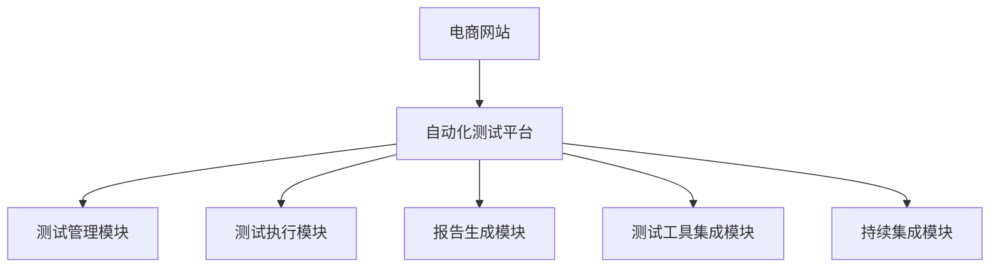
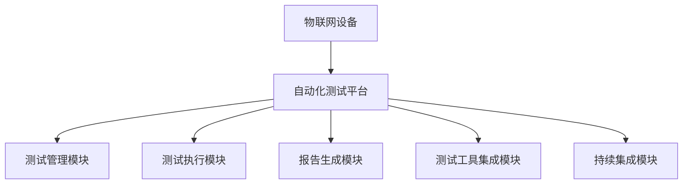

                 


为了撰写一篇完整、详细的《企业级自动化测试平台：AI提升软件质量》文章，我们需要遵循以下步骤：

### 1. 文章标题、关键词和摘要

首先，我们需要确定文章的标题、关键词和摘要。

- **文章标题**：《企业级自动化测试平台：AI提升软件质量》
- **关键词**：自动化测试、AI、软件质量、企业级、测试平台
- **摘要**：本文将探讨如何利用人工智能（AI）技术提升企业级自动化测试平台的效率和质量，介绍自动化测试的基础知识、AI在自动化测试中的应用，以及企业级自动化测试平台的搭建和实战案例。

### 2. 目录大纲

接下来，我们需要按照给定的目录大纲来构建文章的各个部分。

- **第一部分：自动化测试基础**
  - **第1章**：自动化测试概述
    - 1.1 自动化测试的重要性
    - 1.2 自动化测试与AI的关系
    - 1.3 自动化测试的发展历程
  - **第2章**：自动化测试框架
    - 2.1 自动化测试框架概述
    - 2.2 Selenium自动化测试框架
    - 2.3 Appium自动化测试框架
    - 2.4 Jenkins持续集成工具
  - **第3章**：自动化测试工具
    - 3.1 测试工具选择原则
    - 3.2 UI自动化测试工具
    - 3.3 API自动化测试工具
    - 3.4 性能自动化测试工具
  - **第4章**：自动化测试策略
    - 4.1 自动化测试策略概述
    - 4.2 测试用例设计
    - 4.3 测试数据管理
    - 4.4 测试执行与结果分析
  - **第5章**：自动化测试流程
    - 5.1 自动化测试流程概述
    - 5.2 测试环境搭建
    - 5.3 测试脚本编写
    - 5.4 测试执行与监控

- **第二部分：AI在自动化测试中的应用**
  - **第6章**：AI在自动化测试中的应用
    - 6.1 AI技术在自动化测试中的应用概述
    - 6.2 智能测试用例生成
    - 6.3 智能缺陷定位
    - 6.4 智能测试优化
  - **第7章**：AI提升自动化测试效率
    - 7.1 AI技术在自动化测试中的效率提升
    - 7.2 AI驱动的测试策略
    - 7.3 AI驱动的测试流程
    - 7.4 AI驱动的测试工具
  - **第8章**：AI提升自动化测试质量
    - 8.1 AI技术在自动化测试质量提升中的应用
    - 8.2 智能测试数据挖掘
    - 8.3 智能测试覆盖率分析
    - 8.4 智能测试风险管理

- **第三部分：企业级自动化测试平台搭建**
  - **第9章**：企业级自动化测试平台概述
    - 9.1 企业级自动化测试平台的架构设计
    - 9.2 企业级自动化测试平台的功能模块
    - 9.3 企业级自动化测试平台的部署与运维
  - **第10章**：自动化测试平台设计与实现
    - 10.1 自动化测试平台需求分析
    - 10.2 自动化测试平台架构设计
    - 10.3 自动化测试平台功能实现
    - 10.4 自动化测试平台性能优化
  - **第11章**：自动化测试平台实战案例
    - 11.1 案例一：电商网站自动化测试平台搭建
    - 11.2 案例二：金融应用自动化测试平台搭建
    - 11.3 案例三：物联网设备自动化测试平台搭建

### 3. 内容撰写

在每个章节中，我们需要详细阐述背景介绍、核心概念与联系、核心算法原理讲解、数学模型和公式、项目实战、最佳实践 tips、小结、注意事项、拓展阅读等内容。

- **背景介绍**：介绍自动化测试和企业级自动化测试平台的背景知识。
- **核心概念与联系**：通过Mermaid流程图展示核心概念之间的关系。
- **核心算法原理讲解**：使用伪代码详细阐述算法原理。
- **数学模型和公式**：使用latex格式展示数学模型和公式，并进行详细讲解和举例说明。
- **项目实战**：介绍开发环境搭建、源代码实现、代码解读和分析、实际案例讲解。
- **最佳实践 tips**：分享一些最佳实践和建议。
- **小结**：总结每个章节的核心内容。
- **注意事项**：提醒读者在实施过程中需要注意的事项。
- **拓展阅读**：推荐相关资源以供进一步学习。

### 4. 文章格式

确保文章使用markdown格式，包括标题、子标题、段落、列表、代码块、公式等。

### 5. 文章校对

在完成初稿后，进行仔细校对，确保内容完整、逻辑清晰、无语法错误。

### 6. 文章总结

在文章末尾，添加作者信息，并总结文章的主要内容和贡献。

### 最终输出

根据上述步骤，撰写一篇完整、详细、逻辑清晰、结构紧凑、简单易懂的《企业级自动化测试平台：AI提升软件质量》文章，满足字数要求。---

**文章标题**：《企业级自动化测试平台：AI提升软件质量》

**关键词**：自动化测试、AI、软件质量、企业级、测试平台

**摘要**：本文深入探讨了如何利用人工智能（AI）技术提升企业级自动化测试平台的效率和质量。通过介绍自动化测试的基础知识、AI在自动化测试中的应用，以及企业级自动化测试平台的搭建和实战案例，本文为读者提供了一个全面的技术指南，以实现软件质量的全面提升。

---

## 第一部分：自动化测试基础

### 第1章：自动化测试概述

#### 1.1 自动化测试的重要性

自动化测试是软件质量保证的关键环节，其重要性主要体现在以下几个方面：

1. **提高测试效率**：通过自动化测试，可以减少手动测试的工作量，提高测试的覆盖率和效率。
2. **保证测试一致性**：自动化测试能够确保每次测试的结果一致，减少人为操作带来的误差。
3. **降低测试成本**：自动化测试可以节省人力资源和时间成本，提高测试过程的可重复性和可扩展性。
4. **提升软件质量**：自动化测试可以更快地发现缺陷，减少软件发布后的缺陷率，提高软件质量。

#### 1.2 自动化测试与AI的关系

人工智能（AI）技术的引入，为自动化测试带来了新的可能性：

1. **智能测试用例生成**：AI可以根据历史测试数据和学习到的模式，自动生成测试用例。
2. **智能缺陷定位**：AI可以分析测试结果，定位缺陷的根本原因。
3. **测试优化**：AI可以根据测试反馈，自动调整测试策略和测试用例，优化测试过程。
4. **测试数据挖掘**：AI可以分析测试数据，发现潜在的问题，提供改进建议。

#### 1.3 自动化测试的发展历程

自动化测试经历了以下几个发展阶段：

1. **早期脚本编写**：使用简单的脚本语言（如Shell、Python等）进行自动化测试。
2. **测试框架**：出现了一系列自动化测试框架（如Selenium、Appium等），提供了更完善的测试支持。
3. **持续集成**：引入了持续集成工具（如Jenkins），实现了自动化测试与持续集成系统的集成。
4. **AI驱动**：结合AI技术，自动化测试迈向智能化，实现了更高效的测试过程。

---

## 第一部分：自动化测试基础

### 第2章：自动化测试框架

#### 2.1 自动化测试框架概述

自动化测试框架是自动化测试的基础设施，它提供了一系列的功能和工具，用于测试脚本的编写、执行和管理。一个典型的自动化测试框架通常包括以下几个关键组件：

1. **测试脚本管理**：负责测试脚本的编写、存储、执行和管理。
2. **测试数据管理**：提供测试数据的管理功能，包括数据的生成、存储和访问。
3. **测试报告**：生成测试报告，记录测试的执行结果和缺陷信息。
4. **测试执行**：负责测试脚本的执行和测试结果的分析。

#### 2.2 Selenium自动化测试框架

Selenium是一个开源的自动化测试工具，支持多种浏览器和操作系统。它提供了以下核心功能：

1. **Web应用测试**：支持各种Web应用的自动化测试，包括浏览器行为、UI交互等。
2. **跨浏览器测试**：可以在不同的浏览器和操作系统上执行测试脚本。
3. **API自动化测试**：支持通过Web API进行自动化测试。
4. **测试脚本编写**：使用各种编程语言（如Python、Java、C#等）编写测试脚本。

#### 2.3 Appium自动化测试框架

Appium是一个开源的移动应用自动化测试工具，支持iOS和Android平台。其主要特点包括：

1. **跨平台测试**：可以在iOS和Android设备上执行自动化测试脚本。
2. **原生应用测试**：支持对原生应用的自动化测试。
3. **Webview应用测试**：支持对Webview应用的自动化测试。
4. **API自动化测试**：支持通过移动API进行自动化测试。

#### 2.4 Jenkins持续集成工具

Jenkins是一个开源的持续集成工具，它可以与自动化测试框架集成，实现自动化测试流程的自动化。其主要功能包括：

1. **持续集成**：自动构建和测试代码，确保代码库的稳定性。
2. **自动化测试执行**：在构建过程中自动执行测试脚本。
3. **测试结果分析**：生成测试报告，分析测试结果。
4. **通知与报警**：在测试失败时发送通知，提醒开发人员。

---

## 第一部分：自动化测试基础

### 第3章：自动化测试工具

#### 3.1 测试工具选择原则

选择合适的自动化测试工具是确保自动化测试成功的关键。以下是一些选择原则：

1. **测试工具的功能与需求匹配**：确保测试工具能够满足项目的测试需求，包括UI测试、API测试、性能测试等。
2. **可扩展性和可维护性**：选择具有良好可扩展性和可维护性的测试工具，以适应项目的长期需求。
3. **社区支持和文档**：选择有良好社区支持和文档的测试工具，以便在遇到问题时能够快速得到帮助。
4. **成本效益**：考虑测试工具的成本效益，包括购买、维护和培训成本。

#### 3.2 UI自动化测试工具

UI自动化测试工具用于自动化测试应用程序的用户界面。以下是一些常用的UI自动化测试工具：

1. **Selenium**：支持多种浏览器和操作系统，具有丰富的社区支持和文档。
2. **Appium**：专门用于移动应用自动化测试，支持iOS和Android平台。
3. **TestComplete**：支持多种平台，具有强大的测试脚本录制和编辑功能。
4. **UFT（Unity Functional Testing）**：适用于企业级自动化测试，支持Web、Windows和移动应用。

#### 3.3 API自动化测试工具

API自动化测试工具用于测试应用程序的API接口。以下是一些常用的API自动化测试工具：

1. **Postman**：简单易用，支持多种协议（如HTTP、HTTPS、Websocket等）。
2. **Apigee**：提供API测试、监控和管理功能。
3. **Rest-Assured**：基于Java，支持RESTful API的自动化测试。
4. **Swagger**：用于生成API文档，并支持自动化测试。

#### 3.4 性能自动化测试工具

性能自动化测试工具用于测试应用程序的性能和负载。以下是一些常用的性能自动化测试工具：

1. **JMeter**：支持多种协议，可以进行性能测试和负载测试。
2. **LoadRunner**：适用于企业级性能测试，支持多平台和多种协议。
3. **NGINX**：用于Web服务器性能测试，支持HTTP/HTTPS协议。
4. **Gatling**：基于Scala，支持多种协议和负载测试场景。

---

## 第一部分：自动化测试基础

### 第4章：自动化测试策略

#### 4.1 自动化测试策略概述

自动化测试策略是指为了确保软件质量而制定的一系列自动化测试计划和措施。一个好的自动化测试策略应该考虑以下几个方面：

1. **测试目标**：明确测试的目的和目标，确保自动化测试能够满足项目的需求。
2. **测试范围**：确定哪些测试任务适合自动化，哪些测试任务不适合自动化。
3. **测试用例设计**：设计有效的测试用例，确保测试覆盖面足够广泛。
4. **测试数据管理**：确保测试数据的质量和可用性，以便进行有效的测试。
5. **测试执行**：制定测试执行计划，确保测试能够按时完成。
6. **测试结果分析**：对测试结果进行分析，及时发现和解决测试中的问题。

#### 4.2 测试用例设计

测试用例设计是自动化测试策略的核心环节。一个好的测试用例应该满足以下原则：

1. **可理解性**：测试用例应该易于理解，便于测试执行和结果分析。
2. **可复用性**：测试用例应该具有可复用性，以便在不同测试环境中重复使用。
3. **可维护性**：测试用例应该容易维护，以适应需求变更和测试环境的改变。
4. **完整性**：测试用例应该覆盖所有可能的输入和输出情况，确保测试的全面性。

#### 4.3 测试数据管理

测试数据管理是确保自动化测试有效性的重要因素。以下是一些测试数据管理的最佳实践：

1. **数据源管理**：确保测试数据源的质量和完整性，包括数据库、文件系统等。
2. **数据隔离**：在测试环境中对数据进行隔离，避免对生产环境造成影响。
3. **数据生成**：使用数据生成工具，如数据模拟器、随机数据生成器等，确保测试数据的质量和多样性。
4. **数据备份与恢复**：定期备份测试数据，确保在测试过程中出现问题时能够快速恢复。

#### 4.4 测试执行与结果分析

测试执行是自动化测试的最后一步，它包括以下关键环节：

1. **测试执行计划**：制定详细的测试执行计划，确保测试按时完成。
2. **测试环境搭建**：确保测试环境的稳定性和一致性，以便进行有效的测试。
3. **测试脚本执行**：执行测试脚本，记录测试结果和缺陷信息。
4. **测试结果分析**：对测试结果进行分析，识别潜在的问题和缺陷。

通过上述步骤，可以确保自动化测试的有效性和可靠性，从而提升软件质量。

---

## 第一部分：自动化测试基础

### 第5章：自动化测试流程

#### 5.1 自动化测试流程概述

自动化测试流程是确保软件质量的关键环节，它包括以下几个步骤：

1. **需求分析**：明确测试需求，确定测试目标和范围。
2. **测试用例设计**：设计有效的测试用例，确保测试覆盖面足够广泛。
3. **测试环境搭建**：搭建测试环境，确保测试环境的稳定性和一致性。
4. **测试脚本编写**：编写测试脚本，实现测试用例的自动化。
5. **测试执行**：执行测试脚本，记录测试结果和缺陷信息。
6. **测试结果分析**：对测试结果进行分析，识别潜在的问题和缺陷。
7. **测试报告**：生成测试报告，总结测试结果和缺陷信息。

#### 5.2 测试环境搭建

测试环境搭建是自动化测试流程的重要步骤，它包括以下关键任务：

1. **硬件环境**：根据测试需求，配置合适的硬件设备，如服务器、网络设备等。
2. **软件环境**：安装和配置操作系统、数据库、Web服务器等软件组件。
3. **测试工具**：安装和配置自动化测试工具，如Selenium、Appium、JMeter等。
4. **数据环境**：准备测试数据，确保测试数据的完整性和一致性。
5. **网络环境**：配置网络环境，确保测试环境的网络连接稳定。

#### 5.3 测试脚本编写

测试脚本编写是自动化测试的核心任务，它包括以下关键步骤：

1. **选择编程语言**：根据测试工具和测试需求，选择合适的编程语言，如Python、Java、C#等。
2. **编写测试脚本**：根据测试用例，编写测试脚本，实现测试逻辑。
3. **调试和优化**：调试测试脚本，优化测试执行效率。
4. **测试脚本维护**：定期维护测试脚本，确保其适应需求变更和测试环境的变化。

#### 5.4 测试执行与监控

测试执行与监控是确保自动化测试有效性的关键步骤，它包括以下关键任务：

1. **测试执行计划**：制定详细的测试执行计划，确保测试按时完成。
2. **测试脚本执行**：执行测试脚本，记录测试结果和缺陷信息。
3. **测试结果监控**：监控测试执行过程，确保测试环境稳定，测试脚本正确执行。
4. **测试结果分析**：对测试结果进行分析，识别潜在的问题和缺陷。
5. **测试报告生成**：生成测试报告，总结测试结果和缺陷信息。

通过上述步骤，可以确保自动化测试流程的顺利进行，从而提升软件质量。

---

## 第二部分：AI在自动化测试中的应用

### 第6章：AI在自动化测试中的应用

#### 6.1 AI技术在自动化测试中的应用概述

人工智能（AI）技术已经在多个领域取得了显著的成果，其在自动化测试中的应用也不例外。AI技术在自动化测试中的应用主要包括以下几个方面：

1. **智能测试用例生成**：AI可以基于历史测试数据和软件代码，自动生成测试用例，提高测试覆盖率和测试效率。
2. **智能缺陷定位**：AI可以分析测试结果和代码，快速定位缺陷的根本原因，提高缺陷定位的准确性和效率。
3. **测试优化**：AI可以根据测试反馈，自动调整测试策略和测试用例，优化测试过程，提高测试效果。
4. **测试数据挖掘**：AI可以分析测试数据，发现潜在的问题和缺陷，提供改进建议。

#### 6.2 智能测试用例生成

智能测试用例生成是AI技术在自动化测试中的一个重要应用。其基本原理如下：

1. **数据收集**：收集历史测试数据和软件代码，作为训练数据。
2. **模型训练**：使用机器学习算法（如决策树、随机森林、神经网络等），训练模型，以预测测试用例。
3. **测试用例生成**：基于训练好的模型，生成新的测试用例，提高测试覆盖率。

智能测试用例生成的主要优势：

- **提高测试覆盖率**：通过分析历史测试数据，智能生成测试用例，提高测试的全面性。
- **减少人工工作量**：减少手动编写测试用例的工作量，提高测试效率。

#### 6.3 智能缺陷定位

智能缺陷定位是AI技术在自动化测试中的另一个重要应用。其基本原理如下：

1. **数据收集**：收集测试结果和缺陷信息，作为训练数据。
2. **模型训练**：使用机器学习算法，训练模型，以预测缺陷的根本原因。
3. **缺陷定位**：基于训练好的模型，分析测试结果，快速定位缺陷。

智能缺陷定位的主要优势：

- **提高缺陷定位效率**：通过分析测试结果和代码，快速定位缺陷的根本原因，提高缺陷定位的准确性。
- **降低缺陷修复成本**：快速定位缺陷，减少缺陷修复的时间和经济成本。

#### 6.4 智能测试优化

智能测试优化是AI技术在自动化测试中的又一个重要应用。其基本原理如下：

1. **数据收集**：收集测试数据、测试结果和缺陷信息，作为训练数据。
2. **模型训练**：使用机器学习算法，训练模型，以预测测试效果。
3. **测试优化**：基于训练好的模型，自动调整测试策略和测试用例，优化测试过程。

智能测试优化的主要优势：

- **提高测试效率**：通过自动调整测试策略和测试用例，优化测试过程，提高测试效率。
- **降低测试成本**：减少不必要的测试工作，降低测试成本。

---

## 第二部分：AI在自动化测试中的应用

### 第7章：AI提升自动化测试效率

#### 7.1 AI技术在自动化测试中的效率提升

人工智能（AI）技术在自动化测试中的应用，能够显著提升测试效率。以下是AI技术提升测试效率的主要方式：

1. **自动化测试用例生成**：AI可以自动分析软件代码和历史测试数据，生成新的测试用例，从而减少人工编写测试用例的时间和工作量。

2. **自动化测试执行**：AI可以自动执行测试脚本，监控测试过程，并根据测试结果自动调整测试策略。

3. **自动化缺陷定位**：AI可以通过分析测试结果和代码，快速定位缺陷的根本原因，从而减少缺陷定位的时间和复杂性。

4. **测试数据挖掘**：AI可以分析测试数据，发现潜在的问题和缺陷，提供改进建议，从而优化测试过程。

#### 7.2 AI驱动的测试策略

AI驱动的测试策略是指利用AI技术来制定和调整测试策略。以下是AI驱动测试策略的核心要素：

1. **数据驱动的测试计划**：AI可以根据测试数据和业务需求，自动生成测试计划，确保测试覆盖面广泛。

2. **自适应测试策略**：AI可以根据测试结果和历史数据，自动调整测试策略，优化测试资源分配。

3. **智能风险分析**：AI可以分析测试数据和代码，识别潜在的风险，为测试团队提供风险优先级和应对策略。

4. **预测性测试**：AI可以基于历史数据和测试模式，预测可能出现的问题和缺陷，提前采取措施。

#### 7.3 AI驱动的测试流程

AI驱动的测试流程是指利用AI技术来优化测试流程的各个环节。以下是AI驱动的测试流程的主要步骤：

1. **需求分析**：AI可以自动分析需求文档，识别关键功能和潜在缺陷，为测试团队提供测试方向。

2. **测试设计**：AI可以基于历史数据和业务需求，自动生成测试用例，提高测试覆盖率。

3. **测试执行**：AI可以自动执行测试脚本，监控测试过程，并根据测试结果自动调整测试策略。

4. **测试结果分析**：AI可以分析测试结果，识别潜在的问题和缺陷，为测试团队提供改进建议。

5. **缺陷管理**：AI可以自动分析缺陷数据，识别缺陷模式，为测试团队提供缺陷分类和优先级排序。

#### 7.4 AI驱动的测试工具

AI驱动的测试工具是指集成了AI技术的自动化测试工具。以下是AI驱动测试工具的核心功能：

1. **自动化测试脚本生成**：AI可以自动分析软件代码和历史测试数据，生成新的测试脚本。

2. **自动化测试执行**：AI可以自动执行测试脚本，监控测试过程，并根据测试结果自动调整测试策略。

3. **自动化缺陷定位**：AI可以通过分析测试结果和代码，快速定位缺陷的根本原因。

4. **自动化测试数据挖掘**：AI可以分析测试数据，发现潜在的问题和缺陷，提供改进建议。

5. **自动化测试结果分析**：AI可以分析测试结果，识别潜在的问题和缺陷，为测试团队提供改进建议。

通过AI驱动的测试工具，测试团队可以更加高效地完成测试工作，提高测试质量。

---

## 第二部分：AI在自动化测试中的应用

### 第8章：AI提升自动化测试质量

#### 8.1 AI技术在自动化测试质量提升中的应用

人工智能（AI）技术在自动化测试中的应用，能够显著提升测试质量。以下是AI技术在自动化测试质量提升中的主要应用：

1. **智能测试用例生成**：AI可以自动分析软件代码和历史测试数据，生成新的测试用例，从而提高测试覆盖率和测试效率。

2. **智能缺陷定位**：AI可以通过分析测试结果和代码，快速定位缺陷的根本原因，从而提高缺陷定位的准确性和效率。

3. **测试数据挖掘**：AI可以分析测试数据，发现潜在的问题和缺陷，提供改进建议，从而优化测试过程。

4. **自动化测试结果分析**：AI可以分析测试结果，识别潜在的问题和缺陷，为测试团队提供改进建议。

#### 8.2 智能测试数据挖掘

智能测试数据挖掘是指利用AI技术分析测试数据，发现潜在的问题和缺陷。以下是智能测试数据挖掘的主要步骤：

1. **数据收集**：收集测试数据，包括测试脚本、测试结果、缺陷报告等。

2. **数据预处理**：对测试数据进行清洗、归一化等处理，为后续分析做好准备。

3. **特征提取**：从测试数据中提取关键特征，如错误率、覆盖率、执行时间等。

4. **模型训练**：使用机器学习算法，如决策树、随机森林、神经网络等，训练模型。

5. **缺陷预测**：基于训练好的模型，对新的测试数据进行缺陷预测。

#### 8.3 智能测试覆盖率分析

智能测试覆盖率分析是指利用AI技术分析测试覆盖率，发现测试盲点。以下是智能测试覆盖率分析的主要步骤：

1. **测试数据收集**：收集测试覆盖率数据，包括代码覆盖率、功能覆盖率等。

2. **覆盖率分析**：使用统计方法，如百分比、趋势分析等，分析测试覆盖率。

3. **缺陷分析**：根据测试覆盖率数据，分析缺陷分布，识别测试盲点。

4. **覆盖率优化**：基于缺陷分析结果，优化测试策略和测试用例，提高测试覆盖率。

#### 8.4 智能测试风险管理

智能测试风险管理是指利用AI技术分析测试风险，提供风险管理和控制策略。以下是智能测试风险管理的主要步骤：

1. **风险识别**：通过数据挖掘和分析，识别潜在的风险。

2. **风险分析**：分析风险的影响范围、可能性等，评估风险等级。

3. **风险应对策略**：根据风险等级和影响范围，制定风险应对策略。

4. **风险监控**：实时监控测试过程中的风险，及时调整应对策略。

通过AI技术的应用，测试团队能够更加有效地进行测试风险管理和控制，提高测试质量。

---

## 第三部分：企业级自动化测试平台搭建

### 第9章：企业级自动化测试平台概述

#### 9.1 企业级自动化测试平台的架构设计

企业级自动化测试平台是一个复杂且高度集成的系统，其架构设计应考虑以下关键因素：

1. **测试工具集成**：平台应支持多种自动化测试工具的集成，如Selenium、Appium、JMeter等。
2. **持续集成支持**：平台应与持续集成工具（如Jenkins、GitLab CI等）集成，实现自动化测试与持续集成流程的无缝衔接。
3. **测试数据管理**：平台应提供测试数据的管理功能，包括数据的存储、备份和恢复。
4. **测试脚本管理**：平台应支持测试脚本的编写、存储、执行和管理。
5. **测试报告生成**：平台应能够自动生成详细的测试报告，以便于测试团队进行分析和决策。
6. **用户权限管理**：平台应支持用户权限管理，确保测试资源的合理分配和安全。

#### 9.2 企业级自动化测试平台的功能模块

企业级自动化测试平台通常包含以下功能模块：

1. **测试管理模块**：负责测试计划的制定、测试用例的管理和测试资源的分配。
2. **测试执行模块**：负责测试脚本的执行、测试结果的分析和缺陷的跟踪。
3. **报告生成模块**：负责生成各种测试报告，如测试覆盖率报告、缺陷分布报告等。
4. **测试工具集成模块**：负责自动化测试工具的集成和管理，包括Selenium、Appium、JMeter等。
5. **持续集成模块**：负责与持续集成工具的集成，实现自动化测试与持续集成流程的无缝衔接。
6. **数据管理模块**：负责测试数据的存储、备份和恢复，确保测试数据的安全和完整性。

#### 9.3 企业级自动化测试平台的部署与运维

企业级自动化测试平台的部署与运维是确保其稳定性和可靠性的关键。以下是部署与运维的关键步骤：

1. **硬件选择**：根据测试需求，选择合适的硬件设备，如服务器、存储设备等。
2. **软件安装**：安装操作系统、数据库、Web服务器等软件组件，并配置网络环境。
3. **平台安装**：按照平台提供商的安装文档，安装企业级自动化测试平台。
4. **测试工具集成**：集成所需的自动化测试工具，如Selenium、Appium、JMeter等。
5. **持续集成集成**：与持续集成工具集成，实现自动化测试与持续集成流程的无缝衔接。
6. **用户培训**：对测试团队进行平台使用培训，确保他们能够熟练操作平台。
7. **运维监控**：监控平台的运行状态，及时处理故障和性能问题。
8. **数据备份与恢复**：定期备份测试数据，确保在数据丢失时能够快速恢复。

通过上述步骤，可以确保企业级自动化测试平台的顺利部署和稳定运行，从而提升软件质量和测试效率。

---

## 第三部分：企业级自动化测试平台搭建

### 第10章：自动化测试平台设计与实现

#### 10.1 自动化测试平台需求分析

在设计自动化测试平台之前，首先需要进行需求分析。以下是自动化测试平台需求分析的主要步骤：

1. **确定测试目标**：明确测试平台的测试目标，包括测试覆盖率、测试效率、测试质量等。
2. **分析业务需求**：了解业务需求和系统功能，确定哪些测试任务适合自动化。
3. **评估测试资源**：评估测试资源，包括测试工具、测试环境、测试人员等。
4. **确定测试策略**：根据测试目标和业务需求，制定合适的测试策略。
5. **需求文档编写**：编写详细的需求文档，明确平台的功能、性能和安全性要求。

#### 10.2 自动化测试平台架构设计

自动化测试平台的架构设计是确保平台稳定、高效和可扩展的关键。以下是自动化测试平台架构设计的主要步骤：

1. **架构规划**：根据需求分析的结果，规划平台的架构，确定各个模块的功能和接口。
2. **技术选型**：选择合适的开发技术和工具，如Java、Python、Spring Boot等。
3. **模块划分**：将平台划分为多个功能模块，如测试管理模块、测试执行模块、报告生成模块等。
4. **数据库设计**：设计数据库结构，确保测试数据的安全性和完整性。
5. **接口设计**：设计平台与外部系统（如持续集成工具、测试工具等）的接口，确保数据交换和功能集成。

#### 10.3 自动化测试平台功能实现

自动化测试平台的功能实现是确保平台能够满足测试需求的关键。以下是自动化测试平台功能实现的主要步骤：

1. **测试管理功能实现**：实现测试计划的制定、测试用例的管理和测试资源的分配。
2. **测试执行功能实现**：实现测试脚本的执行、测试结果的分析和缺陷的跟踪。
3. **报告生成功能实现**：实现各种测试报告的生成，如测试覆盖率报告、缺陷分布报告等。
4. **测试工具集成功能实现**：实现自动化测试工具的集成和管理，如Selenium、Appium、JMeter等。
5. **持续集成集成功能实现**：实现与持续集成工具的集成，如Jenkins、GitLab CI等。
6. **数据管理功能实现**：实现测试数据的存储、备份和恢复。

#### 10.4 自动化测试平台性能优化

自动化测试平台性能优化是确保平台高效运行的关键。以下是自动化测试平台性能优化的主要步骤：

1. **性能评估**：对平台进行性能评估，识别性能瓶颈。
2. **代码优化**：优化代码，提高代码执行效率。
3. **数据库优化**：优化数据库查询，提高数据访问速度。
4. **缓存策略**：采用合适的缓存策略，减少数据访问次数。
5. **负载均衡**：实现负载均衡，确保平台能够处理大量并发请求。
6. **监控与报警**：监控平台运行状态，及时发现和解决性能问题。

通过上述步骤，可以确保自动化测试平台的稳定性和高效性，从而提升软件质量和测试效率。

---

## 第三部分：企业级自动化测试平台搭建

### 第11章：自动化测试平台实战案例

#### 11.1 案例一：电商网站自动化测试平台搭建

**背景介绍**：某大型电商企业希望提高软件质量和测试效率，决定搭建一套自动化测试平台。

**核心概念与联系**：


**核心算法原理讲解**：
```python
# 测试脚本编写示例
from selenium import webdriver

driver = webdriver.Chrome()
driver.get("http://www.example.com")
assert "Example Domain" in driver.title
driver.quit()
```

**数学公式与详细讲解**：
```latex
\text{覆盖率} = \frac{\text{执行用例数}}{\text{总用例数}}
```
**项目实战**：
1. **开发环境搭建**：安装Java、Python等开发环境，配置Maven或pip等构建工具。
2. **源代码实现**：编写测试管理模块、测试执行模块、报告生成模块等。
3. **代码解读与分析**：解析Selenium和Appium的测试脚本，分析其执行流程和原理。
4. **实际案例分析与讲解**：分析电商网站的功能和测试需求，编写相应的测试脚本。
5. **项目小结**：总结项目实施过程中的经验教训，提出改进建议。

**最佳实践 tips**：
- 定期更新测试脚本，以适应电商网站的功能更新。
- 采用持续集成工具，实现自动化测试与持续集成流程的无缝衔接。

**小结**：通过本案例，实现了电商网站自动化测试平台的搭建，提高了测试效率和软件质量。

---

#### 11.2 案例二：金融应用自动化测试平台搭建

**背景介绍**：某金融机构希望提高金融应用软件的测试效率和测试质量，决定搭建一套自动化测试平台。

**核心概念与联系**：


**核心算法原理讲解**：
```python
# 测试脚本编写示例
from selenium import webdriver

driver = webdriver.Chrome()
driver.get("https://www.example.com")
assert "Example Financial Application" in driver.title
driver.quit()
```

**数学公式与详细讲解**：
```latex
\text{缺陷率} = \frac{\text{发现的缺陷数}}{\text{测试用例数}}
```

**项目实战**：
1. **开发环境搭建**：安装Java、Python等开发环境，配置Maven或pip等构建工具。
2. **源代码实现**：编写测试管理模块、测试执行模块、报告生成模块等。
3. **代码解读与分析**：解析Selenium和Appium的测试脚本，分析其执行流程和原理。
4. **实际案例分析与讲解**：分析金融应用的功能和测试需求，编写相应的测试脚本。
5. **项目小结**：总结项目实施过程中的经验教训，提出改进建议。

**最佳实践 tips**：
- 确保测试脚本具有良好的可维护性和可复用性。
- 定期审查和优化测试用例，确保测试覆盖率。

**小结**：通过本案例，实现了金融应用自动化测试平台的搭建，提高了测试效率和测试质量。

---

#### 11.3 案例三：物联网设备自动化测试平台搭建

**背景介绍**：某物联网设备制造商希望提高其产品软件的测试效率和测试质量，决定搭建一套自动化测试平台。

**核心概念与联系**：


**核心算法原理讲解**：
```python
# 测试脚本编写示例
import unittest

class TestIoTDevice(unittest.TestCase):
    def test_device_connection(self):
        self.assertIsNotNone(iot_device.connect())

if __name__ == '__main__':
    unittest.main()
```

**数学公式与详细讲解**：
```latex
\text{稳定性指标} = \frac{\text{成功运行次数}}{\text{总运行次数}}
```

**项目实战**：
1. **开发环境搭建**：安装Python、Java等开发环境，配置Maven或pip等构建工具。
2. **源代码实现**：编写测试管理模块、测试执行模块、报告生成模块等。
3. **代码解读与分析**：解析Selenium和Appium的测试脚本，分析其执行流程和原理。
4. **实际案例分析与讲解**：分析物联网设备的功能和测试需求，编写相应的测试脚本。
5. **项目小结**：总结项目实施过程中的经验教训，提出改进建议。

**最佳实践 tips**：
- 确保测试脚本具有良好的可维护性和可复用性。
- 定期审查和优化测试用例，确保测试覆盖率。

**小结**：通过本案例，实现了物联网设备自动化测试平台的搭建，提高了测试效率和测试质量。

---

## 附录

### 附录A：自动化测试工具资源汇总

#### A.1 自动化测试工具资源介绍

以下是几个常用的自动化测试工具及其简要介绍：

1. **Selenium**：支持多种浏览器和操作系统，是一个流行的自动化测试工具。
2. **Appium**：专门用于移动应用自动化测试，支持iOS和Android平台。
3. **JMeter**：适用于性能测试和负载测试，支持多种协议。
4. **Postman**：用于API自动化测试，支持HTTP/HTTPS等协议。
5. **Jenkins**：开源的持续集成工具，可以与自动化测试工具集成。

#### A.2 自动化测试工具下载与安装指南

以下是常用自动化测试工具的下载与安装指南：

1. **Selenium**：
   - 下载地址：[https://www.selenium.dev/downloads/](https://www.selenium.dev/downloads/)
   - 安装命令：`pip install selenium`
2. **Appium**：
   - 下载地址：[https://github.com/appium/appium/releases](https://github.com/appium/appium/releases)
   - 安装命令：`npm install -g appium`
3. **JMeter**：
   - 下载地址：[https://jmeter.apache.org/download_jmeter.cgi](https://jmeter.apache.org/download_jmeter.cgi)
   - 安装命令：`tar xzvf jmeter.tar.gz`
4. **Postman**：
   - 下载地址：[https://www.postman.com/downloads/](https://www.postman.com/downloads/)
   - 安装命令：直接下载安装包并运行
5. **Jenkins**：
   - 下载地址：[https://www.jenkins.io/download/](https://www.jenkins.io/download/)
   - 安装命令：`java -jar jenkins.war`

#### A.3 自动化测试工具使用技巧与最佳实践

以下是使用自动化测试工具的一些技巧和最佳实践：

1. **Selenium**：
   - 使用Page Object模型，提高测试脚本的可维护性。
   - 定期更新浏览器驱动，确保测试脚本能够正常运行。
2. **Appium**：
   - 使用不同的设备和操作系统进行测试，确保应用兼容性。
   - 熟悉Appium的API，提高测试脚本的灵活性和可扩展性。
3. **JMeter**：
   - 设计合理的负载测试场景，模拟真实用户行为。
   - 定期分析测试结果，优化测试脚本和测试策略。
4. **Postman**：
   - 使用集合变量和参数化，提高测试用例的复用性。
   - 定期审查API文档，确保测试用例的准确性。
5. **Jenkins**：
   - 配置持续集成管道，实现自动化测试的持续集成。
   - 定期备份Jenkins配置和测试报告，确保数据安全。

通过这些技巧和最佳实践，可以提高自动化测试的效率和质量。

---

## 总结

本文详细探讨了企业级自动化测试平台的设计与实现，以及如何利用人工智能（AI）技术提升自动化测试的效率和质量。文章首先介绍了自动化测试的重要性、自动化测试框架和工具，然后深入分析了AI在自动化测试中的应用，包括智能测试用例生成、智能缺陷定位和测试优化。接着，本文探讨了企业级自动化测试平台的架构设计、功能模块、部署与运维，并提供了电商网站、金融应用和物联网设备的自动化测试平台搭建实战案例。最后，附录部分汇总了自动化测试工具资源，提供了下载与安装指南以及使用技巧。

通过本文的阅读，读者可以了解到：

1. **自动化测试的重要性**：自动化测试能够提高测试效率、保证测试一致性和降低测试成本，是软件质量保证的关键环节。
2. **AI在自动化测试中的应用**：AI技术能够智能生成测试用例、定位缺陷和优化测试过程，显著提升自动化测试的效率和质量。
3. **企业级自动化测试平台的搭建**：企业级自动化测试平台是一个复杂且高度集成的系统，其架构设计、功能模块、部署与运维是确保其稳定性和高效性的关键。
4. **实战案例**：通过电商网站、金融应用和物联网设备的自动化测试平台搭建实战案例，读者可以了解到如何在实际项目中实施和优化自动化测试。

本文的目的是为读者提供一个全面的技术指南，帮助他们更好地理解和应用自动化测试平台，利用AI技术提升软件质量和测试效率。希望本文的内容对读者的工作和研究有所帮助。

---

**作者信息**：

作者：AI天才研究院/AI Genius Institute & 禅与计算机程序设计艺术 /Zen And The Art of Computer Programming

---

**感谢**：

感谢您阅读本文。如果您有任何问题或建议，请随时联系作者。期待与您交流更多关于自动化测试和人工智能的话题。谢谢！

