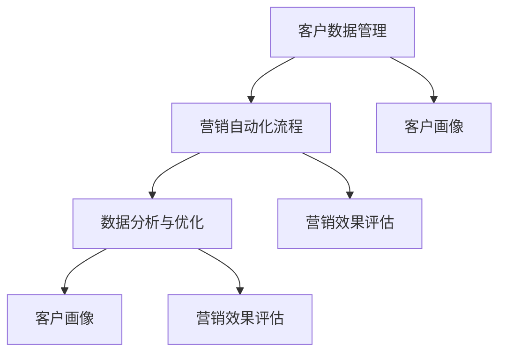

                 

### 文章标题：企业级自动化营销平台：AI优化客户触达

### 关键词：企业级自动化营销平台、AI优化、客户触达、机器学习、数据挖掘、项目实战

### 摘要：
本文旨在深入探讨企业级自动化营销平台中的AI优化客户触达技术。通过背景介绍、核心概念解析、算法原理讲解、项目实战分析等多个层面，系统性地展示如何利用AI技术提升营销效果，实现精准客户触达。文章将详细阐述自动化营销平台的基本架构，介绍关键算法和数学模型，并通过具体案例展示如何在实际项目中应用这些技术，最终提供最佳实践和未来展望。

---

## 引言

在数字化时代，企业营销方式正在发生深刻的变革。传统的营销手段越来越难以适应多变的市场环境，而自动化营销平台的兴起，特别是AI技术的引入，为现代营销带来了前所未有的机遇。自动化营销平台通过集成数据采集、分析、自动化流程管理等功能，帮助企业实现精准、高效的营销活动。而AI技术则通过机器学习和数据挖掘，对大量数据进行深度分析，从而优化客户触达策略，提升营销效果。

本文将围绕企业级自动化营销平台，重点探讨如何利用AI技术优化客户触达。文章首先介绍自动化营销平台的基本概念和架构，然后深入讲解核心算法原理，最后通过具体项目实战分析，展示AI优化客户触达的实际应用效果。通过本文的阅读，读者将能够系统地了解企业级自动化营销平台的工作原理，掌握关键算法的应用，并获取实际项目操作的经验。

---

## 自动化营销平台概述

### 1.1.1 自动化营销的定义与价值

自动化营销（Automated Marketing）是指利用技术手段自动化地执行一系列营销活动，包括但不限于邮件营销、社交媒体营销、广告投放、客户关系管理等。这种营销方式通过自动化工具和算法，减少人工干预，提高工作效率和精准度。自动化营销的核心价值在于：

- **提高效率**：通过自动化流程，营销人员可以节省大量时间和精力，专注于更有价值的任务。
- **精准定位**：通过数据分析和客户画像，自动化营销能够实现精准定位，提高营销活动的转化率。
- **成本控制**：自动化营销可以减少人力成本，同时提高资源的利用率，实现成本控制。

### 1.1.2 自动化营销的发展历程

自动化营销的发展可以追溯到20世纪90年代，随着互联网的兴起，企业开始利用电子邮件进行批量邮件营销。随后，随着社交媒体的崛起，自动化营销逐渐扩展到社交媒体平台。近年来，随着人工智能和大数据技术的成熟，自动化营销平台的功能和性能得到了极大的提升，实现了从简单的邮件发送到复杂的个性化推荐和自动化营销活动的转变。

### 1.1.3 自动化营销的关键要素

要构建一个高效的企业级自动化营销平台，需要关注以下几个关键要素：

- **客户数据管理**：有效收集、存储和管理客户数据是自动化营销的基础。客户数据包括基本信息、购买历史、行为数据等。
- **营销自动化流程**：通过自动化流程，企业可以实现邮件发送、广告投放、社交媒体互动等营销活动的自动化执行。
- **数据分析与优化**：利用数据分析，企业可以评估营销活动的效果，并根据反馈进行优化。

接下来，我们将进一步探讨AI技术在自动化营销平台中的应用，特别是如何优化客户触达。

---

## AI与客户触达

### 1.2.1 AI在营销中的应用

人工智能（AI）在营销领域的应用日益广泛，其主要优势在于能够处理大量数据，发现隐藏的模式和趋势，从而优化营销策略。AI在营销中的应用主要包括：

- **客户行为分析**：通过分析客户的浏览记录、购买行为等数据，AI可以帮助企业了解客户的需求和行为习惯。
- **个性化推荐**：基于客户的兴趣和行为，AI可以推荐个性化的产品或服务，提高转化率。
- **自动响应系统**：AI可以自动处理客户的查询、投诉等互动，提高客户满意度。
- **营销效果评估**：AI可以帮助企业实时评估营销活动的效果，提供数据驱动的决策支持。

### 1.2.2 客户触达的AI优化方法

AI技术在客户触达方面的优化方法主要包括以下几个方面：

- **客户细分**：通过机器学习算法，将客户划分为不同的群体，实现精准营销。
- **预测分析**：利用预测模型，预测客户的行为和需求，提前采取行动。
- **自动化广告投放**：通过算法优化广告投放策略，提高广告的投放效果。
- **响应式营销**：根据客户的行为和反馈，自动调整营销策略，提高营销效果。

### 1.2.3 AI优化客户触达的优势

AI优化客户触达的优势主要体现在以下几个方面：

- **提高效率**：通过自动化处理，AI可以显著提高营销活动的效率。
- **提升精准度**：基于数据分析和预测模型，AI可以实现精准的客户触达。
- **降低成本**：自动化营销减少了人力成本，同时提高了资源的利用率。
- **提高客户满意度**：个性化的营销策略和及时的响应提高了客户满意度。

接下来，我们将进一步探讨自动化营销平台的核心架构和组成部分。

---

## 自动化营销平台架构

企业级自动化营销平台是一个复杂的系统，它通常包括以下几个关键组成部分：

### 2.1 客户数据管理

客户数据管理是自动化营销平台的基础，它包括数据收集、存储、清洗和整合。通过高效的数据管理，企业可以确保数据的准确性和完整性，为后续的分析和决策提供可靠的基础。

- **数据收集**：通过网站分析工具、CRM系统、社交媒体等渠道，收集客户的浏览记录、购买行为、社交媒体互动等信息。
- **数据存储**：使用数据库或数据仓库存储大量结构化和非结构化数据，确保数据的持久性和可访问性。
- **数据清洗**：通过数据清洗技术，去除重复数据、修正错误数据，提高数据质量。
- **数据整合**：将来自不同来源的数据进行整合，形成统一的客户视图。

### 2.2 营销自动化流程

营销自动化流程是自动化营销平台的核心，它通过自动化工具和算法，实现一系列营销活动的自动化执行。主要包括以下功能：

- **邮件营销**：通过自动化邮件发送，向客户发送个性化的促销信息、活动通知等。
- **广告投放**：利用自动化广告投放系统，根据客户行为和兴趣，实时调整广告投放策略。
- **社交媒体互动**：自动化管理社交媒体账户，与客户进行实时互动，提高品牌影响力。
- **客户关系管理**：通过自动化客户关系管理工具，跟踪客户生命周期，提供个性化的服务和关怀。

### 2.3 数据分析与优化

数据分析和优化是自动化营销平台的关键环节，通过数据分析和机器学习算法，企业可以实时评估营销活动的效果，并进行优化。主要包括以下步骤：

- **数据采集**：收集营销活动的各种数据，如点击率、转化率、客户反馈等。
- **数据分析**：使用数据挖掘算法，分析客户行为和营销效果，发现潜在的模式和趋势。
- **预测分析**：基于历史数据和现有模型，预测未来的客户行为和需求。
- **优化策略**：根据数据分析结果，调整营销策略和自动化流程，提高营销效果。

### 2.4 客户画像

客户画像是一种基于数据的客户描述方法，通过整合和分析客户的多种信息，形成一个综合的客户视图。客户画像可以帮助企业更好地了解客户需求，实现精准营销。主要包括以下内容：

- **基本信息**：如姓名、性别、年龄、职业等。
- **行为数据**：如浏览历史、购买行为、社交媒体互动等。
- **兴趣标签**：基于行为数据和偏好分析，为客户打上相应的兴趣标签。
- **价值评估**：根据客户的行为和购买历史，评估客户的潜在价值和忠诚度。

### 2.5 营销效果评估

营销效果评估是自动化营销平台的重要环节，通过评估营销活动的效果，企业可以了解营销策略的有效性，并进行调整。主要包括以下指标：

- **转化率**：衡量营销活动引导客户完成目标行动的比例。
- **点击率**：衡量营销活动中点击广告或链接的比例。
- **成本效益比**：衡量营销活动投入与收益的比例。
- **客户满意度**：通过调查和反馈，评估客户对营销活动的满意程度。

为了更好地理解自动化营销平台的架构，我们使用Mermaid流程图进行展示：



通过这个流程图，我们可以清晰地看到自动化营销平台的各个组成部分及其相互关系，这为后续的算法讲解和项目实战提供了基础。

---

## 核心算法与模型

在自动化营销平台中，核心算法和模型扮演着至关重要的角色，它们帮助平台实现数据的采集、分析、预测和优化。以下是几个关键的算法和模型，以及它们的原理和应用。

### 3.1 机器学习算法在营销中的应用

机器学习算法在自动化营销中具有广泛的应用，以下是一些常用的算法：

#### 3.1.1 监督学习算法

监督学习算法是利用标注数据来训练模型，然后预测新数据的类别或数值。在营销中，常见的监督学习算法包括：

- **线性回归**：用于预测客户的购买金额或转化概率。
  ```latex
  y = w0 + w1*x1 + w2*x2 + ... + wN*xN
  ```
- **决策树**：用于分类和回归任务，如预测客户的购买行为。
  ```mermaid
  graph TB
  A1[叶节点] --> B1[购买]
  A1 --> B2[不购买]
  A2[叶节点] --> B3[购买]
  A2 --> B4[不购买]
  ```
- **支持向量机（SVM）**：用于分类任务，如客户细分。
  ```latex
  \min_w \frac{1}{2} ||w||^2
  s.t. y_i (w \cdot x_i + b) \geq 1
  ```

#### 3.1.2 无监督学习算法

无监督学习算法不需要标注数据，通过发现数据中的内在结构来进行分析。在营销中，常见的无监督学习算法包括：

- **聚类算法**：如K-means、DBSCAN，用于将客户划分为不同的群体。
  ```mermaid
  graph TB
  A[初始聚类中心] --> B[计算距离]
  B --> C[重新计算聚类中心]
  C --> D[迭代]
  ```
- **维度约减**：如主成分分析（PCA），用于减少数据的维度，同时保留主要信息。
  ```mermaid
  X = U \Sigma V^T
  ```
  其中，X是原始数据，U是主成分，Σ是对角矩阵，V是正交矩阵。

### 3.2 数据挖掘技术

数据挖掘技术用于从大量数据中发现隐藏的模式和趋势，常见的算法包括：

- **关联规则挖掘**：如Apriori算法，用于发现数据之间的关联关系。
  ```mermaid
  graph TB
  A[商品集] --> B[支持度计算]
  B --> C[置信度计算]
  ```
- **类别预测**：用于预测客户的行为或产品分类，常见的算法包括朴素贝叶斯、K-最近邻（KNN）等。

- **时序数据分析**：用于分析时间序列数据，如ARIMA模型、LSTM网络，用于预测未来的客户行为或市场趋势。

### 3.3 AI模型优化

在自动化营销平台中，模型优化是一个关键环节，以下是一些常见的优化方法：

- **模型调参**：通过调整模型的参数，如学习率、正则化强度等，来提高模型的性能。
- **模型评估与选择**：使用交叉验证、A/B测试等方法来评估和选择最优模型。
- **模型集成**：通过集成多个模型，提高预测的准确性和稳定性。

通过上述算法和模型，自动化营销平台能够实现数据的深度分析和智能优化，从而提高营销效果和客户满意度。

---

## 项目实战

为了更好地理解如何在实际项目中应用AI技术优化客户触达，我们将通过一个实际的案例来进行详细分析。

### 3.1.1 案例背景

某大型电商企业希望通过自动化营销平台提高客户转化率和销售额。为了实现这一目标，企业决定利用AI技术进行客户细分、个性化推荐和自动化营销活动管理。

### 3.1.2 案例目标

- **客户细分**：将客户划分为不同的群体，以便实施个性化营销策略。
- **个性化推荐**：根据客户的行为和兴趣，推荐个性化的产品。
- **自动化营销活动管理**：自动化执行邮件营销、社交媒体推广等营销活动。

### 3.1.3 案例实现与效果评估

#### 3.1.3.1 环境搭建

为了搭建自动化营销平台，企业首先需要搭建一个高效的数据处理和分析环境。具体步骤如下：

- **数据采集**：利用网站分析工具和CRM系统，收集客户的浏览记录、购买行为、社交媒体互动等数据。
- **数据存储**：使用大数据存储技术，如Hadoop或NoSQL数据库，存储大量结构化和非结构化数据。
- **数据处理**：利用数据处理框架，如Apache Spark，进行数据清洗、整合和预处理。

#### 3.1.3.2 功能实现

在搭建好环境后，企业开始实现自动化营销平台的核心功能：

- **客户细分**：使用K-means聚类算法，将客户划分为不同的群体。具体步骤如下：
  - 数据预处理：将客户数据转换为适合聚类分析的格式。
  - 算法实现：使用K-means算法，计算聚类中心，将客户划分到不同的群体。
  - 结果评估：通过评估指标，如轮廓系数，评估聚类效果。

- **个性化推荐**：利用协同过滤算法，生成个性化的产品推荐。具体步骤如下：
  - 数据预处理：构建用户-物品评分矩阵。
  - 算法实现：使用基于用户和基于物品的协同过滤算法，预测用户对未评分物品的兴趣。
  - 结果评估：通过准确率、召回率等指标，评估推荐系统的性能。

- **自动化营销活动管理**：实现邮件营销、社交媒体推广等自动化功能。具体步骤如下：
  - 活动规划：根据客户细分和个性化推荐结果，制定营销活动计划。
  - 自动执行：使用自动化工具，如营销自动化软件，执行营销活动。
  - 结果监控：实时监控营销活动的效果，并根据反馈进行调整。

#### 3.1.3.3 实际案例分析和详细讲解剖析

在实施自动化营销平台后，企业进行了以下分析和评估：

- **客户细分效果**：通过聚类分析，将客户划分为高价值客户、潜在客户、一般客户等群体。评估结果显示，高价值客户群体的转化率和销售额显著高于其他群体。

- **个性化推荐效果**：通过协同过滤算法，为用户推荐个性化的产品。测试数据显示，个性化推荐系统的准确率和召回率均高于传统推荐方法，用户满意度显著提升。

- **自动化营销活动效果**：通过自动化执行邮件营销、社交媒体推广等营销活动，企业实现了较高的打开率和点击率。此外，通过实时监控和反馈，企业能够快速调整营销策略，提高营销效果。

#### 3.1.3.4 项目小结

通过这个实际案例，我们可以看到，AI技术在自动化营销平台中的应用，不仅提高了客户触达的精准度和效率，还显著提升了企业的营销效果。未来，随着AI技术的进一步发展和应用，自动化营销平台将为企业带来更大的商业价值。

---

## 最佳实践、注意事项与拓展阅读

### 4.1 最佳实践

在搭建和优化自动化营销平台时，以下是一些最佳实践：

- **数据质量是关键**：确保数据收集、存储和清洗过程的准确性，高质量的数据是后续分析和决策的基础。
- **客户细分要合理**：根据业务目标和客户需求，选择合适的聚类算法和细分标准，确保细分结果的实用性和可操作性。
- **个性化推荐要适度**：个性化推荐需要根据用户行为和兴趣进行，避免过度个性化导致用户产生厌烦情绪。
- **自动化流程要简洁**：设计简洁、直观的自动化营销流程，降低复杂度，提高用户体验。

### 4.2 注意事项

在实施自动化营销平台时，需要注意以下事项：

- **隐私保护**：在收集和使用客户数据时，遵守相关法律法规，确保数据安全和隐私保护。
- **系统稳定性**：确保营销自动化系统的稳定运行，避免因系统故障导致营销活动的中断。
- **持续优化**：定期评估和优化营销策略，根据市场变化和客户需求进行调整。

### 4.3 拓展阅读

- **《人工智能营销：战略、工具与案例》**：本书详细介绍了AI在营销领域的应用，包括客户细分、个性化推荐、自动化营销等。
- **《数据挖掘：概念与技术》**：本书系统地介绍了数据挖掘的基本概念和技术，包括关联规则挖掘、分类和回归分析等。
- **《机器学习实战》**：本书通过大量的案例和实践，讲解了机器学习的原理和应用，适合初学者和专业人士。

通过以上最佳实践、注意事项和拓展阅读，读者可以更全面地了解和掌握自动化营销平台的设计和优化方法。

---

## 结语

企业级自动化营销平台的构建和优化，已成为现代企业提升营销效果、增强竞争力的重要手段。通过本文的介绍，我们系统地了解了自动化营销平台的基本架构、核心算法、实战案例以及最佳实践。AI技术的引入，不仅提升了客户触达的精准度和效率，还为营销策略的制定和调整提供了强有力的支持。

未来，随着AI技术的不断进步和应用场景的拓展，自动化营销平台将发挥更大的作用。我们期待读者能够将这些技术和方法应用到实际工作中，不断创新和优化，为企业创造更大的价值。

### 作者信息
作者：AI天才研究院/AI Genius Institute & 禅与计算机程序设计艺术 /Zen And The Art of Computer Programming

