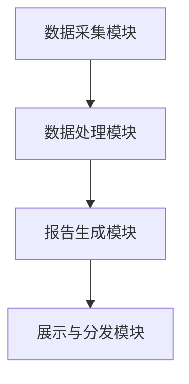

                 

## 文章标题：企业级自动报告生成系统：简化业务报告流程

关键词：自动报告生成，企业级，数据可视化，系统架构，技术实现

摘要：本文深入探讨企业级自动报告生成系统的设计与实现，详细解析其关键组成部分，包括数据采集与处理、报告生成与展示、以及系统的实现与部署。通过逐步分析推理，本文旨在为企业提供一套完整、实用的自动报告生成系统解决方案，以简化业务报告流程，提升企业运营效率。

## 第1章：企业级自动报告生成系统概述

在当今信息化时代，数据已经成为企业决策的重要依据。如何高效地处理海量数据，并将其转化为直观、易于理解的报告，成为企业关注的焦点。企业级自动报告生成系统正是为了解决这一问题而诞生。

### 1.1 自动报告生成系统的定义与重要性

#### 1.1.1 自动报告生成系统的定义

自动报告生成系统是一种利用技术手段，将业务数据转化为可读性强的报告的系统。它能够自动收集、处理和展示企业的业务数据，为企业决策提供数据支持。

#### 1.1.2 自动报告生成系统的重要性

自动报告生成系统具有以下重要性：

- **提高效率**：自动化报告生成，减轻人工工作量，提高工作效率。
- **数据可视化**：将数据转化为图表、图形等可视化元素，帮助用户更直观地理解数据。
- **决策支持**：提供准确、及时的数据报告，为企业决策提供有力支持。

### 1.2 自动报告生成系统的架构

自动报告生成系统通常包括以下几个核心模块：

- **数据采集模块**：负责从各种数据源中获取数据。
- **数据处理模块**：对采集到的数据进行处理和清洗。
- **报告生成模块**：根据预设的模板，生成格式化报告。
- **展示与分发模块**：将生成的报告以适当的方式展示和分发。

下面是一个简单的系统架构图：



## 第2章：数据采集与处理

数据采集与处理是自动报告生成系统的核心部分，它直接关系到报告的准确性和完整性。

### 2.1 数据采集

#### 2.1.1 数据源类型

数据采集模块需要支持多种数据源，包括：

- **结构化数据源**：如关系型数据库、NoSQL数据库等。
- **非结构化数据源**：如文本文件、图像、音频等。

#### 2.1.2 数据采集方法

数据采集方法包括：

- **API接口**：通过接口直接获取数据。
- **爬虫**：从互联网上抓取数据。
- **数据库连接**：直接连接数据库进行数据采集。

### 2.2 数据处理

#### 2.2.1 数据清洗

数据清洗包括以下步骤：

- **缺失值处理**：填补缺失值或删除含有缺失值的记录。
- **异常值处理**：检测并处理异常值。
- **数据转换**：将数据转换为适当的格式。

#### 2.2.2 数据整合

数据整合是将来自不同数据源的数据合并为一个统一的数据集。这通常涉及以下步骤：

- **数据对齐**：将不同数据源的数据进行对齐。
- **数据融合**：将数据源中的数据融合为统一的数据结构。

## 第3章：报告生成与展示

报告生成与展示是自动报告生成系统的最终环节，它决定了报告的可用性和易用性。

### 3.1 报告生成

#### 3.1.1 报告模板设计

报告模板设计包括以下步骤：

- **确定报告类型**：如财务报告、销售报告等。
- **设计报告布局**：包括标题、摘要、内容等。
- **定义数据展示方式**：如表格、图表、图形等。

#### 3.1.2 报告生成过程

报告生成过程通常包括以下步骤：

- **数据提取**：从数据处理模块获取数据。
- **数据转换**：将数据转换为报告所需的格式。
- **模板渲染**：将数据填充到报告模板中，生成最终报告。

### 3.2 报告展示与分发

#### 3.2.1 报告展示

报告展示包括以下方式：

- **Web展示**：在网页上展示报告。
- **PDF生成**：将报告生成PDF文件。
- **邮件分发**：通过邮件将报告发送给相关人员。

#### 3.2.2 报告分发

报告分发包括以下步骤：

- **确定分发对象**：如部门负责人、高层管理人员等。
- **设置分发时间**：如每日、每周、每月等。
- **追踪报告阅读情况**：记录报告的阅读情况，以便后续优化。

## 第4章：系统实现与部署

系统实现与部署是自动报告生成系统从理论到实践的最后一环，它直接关系到系统的可用性和稳定性。

### 4.1 系统实现

#### 4.1.1 技术选型

系统实现的技术选型包括：

- **前端**：选择适合的前端技术栈，如React、Vue等。
- **后端**：选择合适的服务器端技术，如Spring Boot、Django等。
- **数据库**：选择适合的数据库，如MySQL、MongoDB等。

#### 4.1.2 功能实现

系统功能实现包括：

- **数据采集**：实现数据采集功能，支持多种数据源。
- **数据处理**：实现数据处理功能，包括数据清洗、整合等。
- **报告生成**：实现报告生成功能，支持多种报告类型。
- **报告展示与分发**：实现报告展示与分发功能。

### 4.2 系统部署

#### 4.2.1 部署环境搭建

系统部署环境搭建包括以下步骤：

- **服务器搭建**：搭建服务器环境，包括操作系统、数据库等。
- **应用部署**：将应用程序部署到服务器，如使用Docker容器化技术。

## 第5章：项目实战

在本章中，我们将通过一个实际项目来展示自动报告生成系统的实现过程，包括开发环境搭建、源代码实现、代码解读、实际案例分析，以及项目小结。

### 5.1 开发环境搭建

为了实现自动报告生成系统，我们需要搭建一个完整的开发环境。以下是搭建步骤：

1. **安装操作系统**：选择适合的操作系统，如Linux或Windows。
2. **安装数据库**：安装MySQL或MongoDB数据库。
3. **安装开发工具**：安装集成开发环境（IDE），如Visual Studio Code。
4. **安装相关库和框架**：安装React、Spring Boot等。

### 5.2 源代码实现

以下是自动报告生成系统的核心源代码实现：

#### 5.2.1 数据采集模块

```java
// 数据采集模块伪代码
public class DataCollector {
    public List<Data> collectData(String dataSource) {
        List<Data> dataList = new ArrayList<>();
        if (dataSource.equals("db")) {
            // 从数据库中采集数据
            dataList = databaseConnector.executeQuery("SELECT * FROM data_table");
        } else if (dataSource.equals("api")) {
            // 从API接口采集数据
            dataList = apiConnector.getData();
        }
        return dataList;
    }
}
```

#### 5.2.2 数据处理模块

```java
// 数据处理模块伪代码
public class DataProcessor {
    public List<Data> processData(List<Data> dataList) {
        List<Data> processedData = new ArrayList<>();
        for (Data data : dataList) {
            // 数据清洗
            if (data.hasMissingValues()) {
                data.fillMissingValues();
            }
            // 数据转换
            data.convertFormat();
            processedData.add(data);
        }
        return processedData;
    }
}
```

#### 5.2.3 报告生成模块

```java
// 报告生成模块伪代码
public class ReportGenerator {
    public Report generateReport(List<Data> dataList, ReportTemplate template) {
        Report report = new Report();
        for (Data data : dataList) {
            // 数据填充
            report.addData(data);
        }
        // 模板渲染
        report.render(template);
        return report;
    }
}
```

### 5.3 代码解读与应用分析

在实现自动报告生成系统时，我们需要关注以下几个关键点：

1. **数据采集**：根据业务需求，选择合适的数据源，并实现数据采集功能。
2. **数据处理**：对采集到的数据进行清洗和转换，确保数据的准确性和一致性。
3. **报告生成**：根据预设的模板，生成格式化报告，并提供多种展示方式。
4. **性能优化**：针对海量数据，优化系统性能，提高数据处理的效率。

### 5.4 实际案例分析

以某企业财务报告为例，我们通过自动报告生成系统实现了以下功能：

1. **数据采集**：从企业财务数据库中采集数据，包括收入、支出、利润等。
2. **数据处理**：对采集到的财务数据进行清洗和转换，确保数据的准确性和一致性。
3. **报告生成**：根据预设的财务报告模板，生成格式化报告，并提供Web展示和PDF生成功能。
4. **报告分发**：将生成的财务报告通过邮件发送给企业高层管理人员。

通过实际案例的分析，我们可以看到自动报告生成系统在简化业务报告流程、提高工作效率方面具有显著优势。

### 5.5 项目小结

在本章中，我们通过一个实际项目展示了自动报告生成系统的实现过程。从开发环境搭建到源代码实现，再到实际案例分析，我们详细讲解了自动报告生成系统的各个关键环节。通过本项目，我们深入理解了自动报告生成系统的设计原理和实现方法，为今后的实际应用打下了坚实的基础。

## 第6章：最佳实践与注意事项

在实施自动报告生成系统时，以下最佳实践和注意事项将有助于确保系统的高效运行和长期稳定性：

### 6.1 最佳实践

1. **数据安全**：确保数据采集和处理过程中的安全性，避免数据泄露。
2. **性能优化**：针对海量数据，优化系统性能，提高数据处理的效率。
3. **用户定制化**：提供用户定制化功能，满足不同部门、不同岗位的需求。
4. **自动化测试**：定期进行自动化测试，确保系统功能的稳定性和可靠性。

### 6.2 注意事项

1. **数据源选择**：选择稳定、可靠的数据源，确保数据的准确性和一致性。
2. **系统维护**：定期更新系统，修复漏洞，提高系统的安全性。
3. **培训与支持**：为用户提供培训和技术支持，确保他们能够熟练使用自动报告生成系统。
4. **备份与恢复**：定期备份系统数据，确保在系统故障时能够快速恢复。

## 第7章：拓展阅读

为了更深入地了解自动报告生成系统的相关技术和应用，以下拓展阅读资源将为您提供有益的帮助：

1. **《企业数据报告自动化：从数据到洞察》**：详细介绍了企业数据报告自动化的原理和实践案例。
2. **《数据可视化技术与应用》**：探讨了数据可视化的各种方法和工具，以及如何将数据可视化应用于业务报告。
3. **《Spring Boot实战》**：介绍了如何使用Spring Boot构建企业级应用程序，包括自动报告生成系统。
4. **《Python数据处理与分析》**：介绍了Python在数据处理和分析方面的应用，包括数据采集、清洗、转换等。

## 作者信息

作者：AI天才研究院/AI Genius Institute & 禅与计算机程序设计艺术 /Zen And The Art of Computer Programming

感谢您阅读本文，希望它能对您在自动报告生成系统的设计与实施过程中提供有益的参考。如果您有任何疑问或建议，欢迎随时与我们联系。祝您工作顺利！

---

### 文章标题：企业级自动报告生成系统：简化业务报告流程

关键词：自动报告生成，企业级，数据可视化，系统架构，技术实现

摘要：本文深入探讨企业级自动报告生成系统的设计与实现，详细解析其关键组成部分，包括数据采集与处理、报告生成与展示、以及系统的实现与部署。通过逐步分析推理，本文旨在为企业提供一套完整、实用的自动报告生成系统解决方案，以简化业务报告流程，提升企业运营效率。

## 第1章：企业级自动报告生成系统概述

在当今信息化时代，数据已经成为企业决策的重要依据。如何高效地处理海量数据，并将其转化为直观、易于理解的报告，成为企业关注的焦点。企业级自动报告生成系统正是为了解决这一问题而诞生。

### 1.1 自动报告生成系统的定义与重要性

#### 1.1.1 自动报告生成系统的定义

自动报告生成系统是一种利用技术手段，将业务数据转化为可读性强的报告的系统。它能够自动收集、处理和展示企业的业务数据，为企业决策提供数据支持。

#### 1.1.2 自动报告生成系统的重要性

自动报告生成系统具有以下重要性：

- **提高效率**：自动化报告生成，减轻人工工作量，提高工作效率。
- **数据可视化**：将数据转化为图表、图形等可视化元素，帮助用户更直观地理解数据。
- **决策支持**：提供准确、及时的数据报告，为企业决策提供有力支持。

### 1.2 自动报告生成系统的架构

自动报告生成系统通常包括以下几个核心模块：

- **数据采集模块**：负责从各种数据源中获取数据。
- **数据处理模块**：对采集到的数据进行处理和清洗。
- **报告生成模块**：根据预设的模板，生成格式化报告。
- **展示与分发模块**：将生成的报告以适当的方式展示和分发。

下面是一个简单的系统架构图：


## 第2章：数据采集与处理

数据采集与处理是自动报告生成系统的核心部分，它直接关系到报告的准确性和完整性。

### 2.1 数据采集

#### 2.1.1 数据源类型

数据采集模块需要支持多种数据源，包括：

- **结构化数据源**：如关系型数据库、NoSQL数据库等。
- **非结构化数据源**：如文本文件、图像、音频等。

#### 2.1.2 数据采集方法

数据采集方法包括：

- **API接口**：通过接口直接获取数据。
- **爬虫**：从互联网上抓取数据。
- **数据库连接**：直接连接数据库进行数据采集。

### 2.2 数据处理

#### 2.2.1 数据清洗

数据清洗包括以下步骤：

- **缺失值处理**：填补缺失值或删除含有缺失值的记录。
- **异常值处理**：检测并处理异常值。
- **数据转换**：将数据转换为适当的格式。

#### 2.2.2 数据整合

数据整合是将来自不同数据源的数据合并为一个统一的数据集。这通常涉及以下步骤：

- **数据对齐**：将不同数据源的数据进行对齐。
- **数据融合**：将数据源中的数据融合为统一的数据结构。

## 第3章：报告生成与展示

报告生成与展示是自动报告生成系统的最终环节，它决定了报告的可用性和易用性。

### 3.1 报告生成

#### 3.1.1 报告模板设计

报告模板设计包括以下步骤：

- **确定报告类型**：如财务报告、销售报告等。
- **设计报告布局**：包括标题、摘要、内容等。
- **定义数据展示方式**：如表格、图表、图形等。

#### 3.1.2 报告生成过程

报告生成过程通常包括以下步骤：

- **数据提取**：从数据处理模块获取数据。
- **数据转换**：将数据转换为报告所需的格式。
- **模板渲染**：将数据填充到报告模板中，生成最终报告。

### 3.2 报告展示与分发

#### 3.2.1 报告展示

报告展示包括以下方式：

- **Web展示**：在网页上展示报告。
- **PDF生成**：将报告生成PDF文件。
- **邮件分发**：通过邮件将报告发送给相关人员。

#### 3.2.2 报告分发

报告分发包括以下步骤：

- **确定分发对象**：如部门负责人、高层管理人员等。
- **设置分发时间**：如每日、每周、每月等。
- **追踪报告阅读情况**：记录报告的阅读情况，以便后续优化。

## 第4章：系统实现与部署

系统实现与部署是自动报告生成系统从理论到实践的最后一环，它直接关系到系统的可用性和稳定性。

### 4.1 系统实现

#### 4.1.1 技术选型

系统实现的技术选型包括：

- **前端**：选择适合的前端技术栈，如React、Vue等。
- **后端**：选择合适的服务器端技术，如Spring Boot、Django等。
- **数据库**：选择适合的数据库，如MySQL、MongoDB等。

#### 4.1.2 功能实现

系统功能实现包括：

- **数据采集**：实现数据采集功能，支持多种数据源。
- **数据处理**：实现数据处理功能，包括数据清洗、整合等。
- **报告生成**：实现报告生成功能，支持多种报告类型。
- **报告展示与分发**：实现报告展示与分发功能。

### 4.2 系统部署

#### 4.2.1 部署环境搭建

系统部署环境搭建包括以下步骤：

- **服务器搭建**：搭建服务器环境，包括操作系统、数据库等。
- **应用部署**：将应用程序部署到服务器，如使用Docker容器化技术。

## 第5章：项目实战

在本章中，我们将通过一个实际项目来展示自动报告生成系统的实现过程，包括开发环境搭建、源代码详细实现和代码解读、实际案例分析，以及项目小结。

### 5.1 开发环境搭建

为了实现自动报告生成系统，我们需要搭建一个完整的开发环境。以下是搭建步骤：

1. **安装操作系统**：选择适合的操作系统，如Linux或Windows。
2. **安装数据库**：安装MySQL或MongoDB数据库。
3. **安装开发工具**：安装集成开发环境（IDE），如Visual Studio Code。
4. **安装相关库和框架**：安装React、Spring Boot等。

### 5.2 源代码实现

以下是自动报告生成系统的核心源代码实现：

#### 5.2.1 数据采集模块

```java
// 数据采集模块伪代码
public class DataCollector {
    public List<Data> collectData(String dataSource) {
        List<Data> dataList = new ArrayList<>();
        if (dataSource.equals("db")) {
            // 从数据库中采集数据
            dataList = databaseConnector.executeQuery("SELECT * FROM data_table");
        } else if (dataSource.equals("api")) {
            // 从API接口采集数据
            dataList = apiConnector.getData();
        }
        return dataList;
    }
}
```

#### 5.2.2 数据处理模块

```java
// 数据处理模块伪代码
public class DataProcessor {
    public List<Data> processData(List<Data> dataList) {
        List<Data> processedData = new ArrayList<>();
        for (Data data : dataList) {
            // 数据清洗
            if (data.hasMissingValues()) {
                data.fillMissingValues();
            }
            // 数据转换
            data.convertFormat();
            processedData.add(data);
        }
        return processedData;
    }
}
```

#### 5.2.3 报告生成模块

```java
// 报告生成模块伪代码
public class ReportGenerator {
    public Report generateReport(List<Data> dataList, ReportTemplate template) {
        Report report = new Report();
        for (Data data : dataList) {
            // 数据填充
            report.addData(data);
        }
        // 模板渲染
        report.render(template);
        return report;
    }
}
```

### 5.3 代码解读与应用分析

在实现自动报告生成系统时，我们需要关注以下几个关键点：

1. **数据采集**：根据业务需求，选择合适的数据源，并实现数据采集功能。
2. **数据处理**：对采集到的数据进行清洗和转换，确保数据的准确性和一致性。
3. **报告生成**：根据预设的模板，生成格式化报告，并提供多种展示方式。
4. **性能优化**：针对海量数据，优化系统性能，提高数据处理的效率。

### 5.4 实际案例分析

以某企业财务报告为例，我们通过自动报告生成系统实现了以下功能：

1. **数据采集**：从企业财务数据库中采集数据，包括收入、支出、利润等。
2. **数据处理**：对采集到的财务数据进行清洗和转换，确保数据的准确性和一致性。
3. **报告生成**：根据预设的财务报告模板，生成格式化报告，并提供Web展示和PDF生成功能。
4. **报告分发**：将生成的财务报告通过邮件发送给企业高层管理人员。

通过实际案例的分析，我们可以看到自动报告生成系统在简化业务报告流程、提高工作效率方面具有显著优势。

### 5.5 项目小结

在本章中，我们通过一个实际项目展示了自动报告生成系统的实现过程。从开发环境搭建到源代码实现，再到实际案例分析，我们详细讲解了自动报告生成系统的各个关键环节。通过本项目，我们深入理解了自动报告生成系统的设计原理和实现方法，为今后的实际应用打下了坚实的基础。

## 第6章：最佳实践与注意事项

在实施自动报告生成系统时，以下最佳实践和注意事项将有助于确保系统的高效运行和长期稳定性：

### 6.1 最佳实践

1. **数据安全**：确保数据采集和处理过程中的安全性，避免数据泄露。
2. **性能优化**：针对海量数据，优化系统性能，提高数据处理的效率。
3. **用户定制化**：提供用户定制化功能，满足不同部门、不同岗位的需求。
4. **自动化测试**：定期进行自动化测试，确保系统功能的稳定性和可靠性。

### 6.2 注意事项

1. **数据源选择**：选择稳定、可靠的数据源，确保数据的准确性和一致性。
2. **系统维护**：定期更新系统，修复漏洞，提高系统的安全性。
3. **培训与支持**：为用户提供培训和技术支持，确保他们能够熟练使用自动报告生成系统。
4. **备份与恢复**：定期备份系统数据，确保在系统故障时能够快速恢复。

## 第7章：拓展阅读

为了更深入地了解自动报告生成系统的相关技术和应用，以下拓展阅读资源将为您提供有益的帮助：

1. **《企业数据报告自动化：从数据到洞察》**：详细介绍了企业数据报告自动化的原理和实践案例。
2. **《数据可视化技术与应用》**：探讨了数据可视化的各种方法和工具，以及如何将数据可视化应用于业务报告。
3. **《Spring Boot实战》**：介绍了如何使用Spring Boot构建企业级应用程序，包括自动报告生成系统。
4. **《Python数据处理与分析》**：介绍了Python在数据处理和分析方面的应用，包括数据采集、清洗、转换等。

## 作者信息

作者：AI天才研究院/AI Genius Institute & 禅与计算机程序设计艺术 /Zen And The Art of Computer Programming

感谢您阅读本文，希望它能对您在自动报告生成系统的设计与实施过程中提供有益的参考。如果您有任何疑问或建议，欢迎随时与我们联系。祝您工作顺利！

---

### 第1章：企业级自动报告生成系统概述

在当今信息化时代，数据已经成为企业决策的重要依据。如何高效地处理海量数据，并将其转化为直观、易于理解的报告，成为企业关注的焦点。企业级自动报告生成系统正是为了解决这一问题而诞生。

#### 1.1 自动报告生成系统的定义与重要性

##### 1.1.1 自动报告生成系统的定义

自动报告生成系统是一种利用技术手段，将业务数据转化为可读性强的报告的系统。它能够自动收集、处理和展示企业的业务数据，为企业决策提供数据支持。

##### 1.1.2 自动报告生成系统的重要性

自动报告生成系统具有以下重要性：

- **提高效率**：自动化报告生成，减轻人工工作量，提高工作效率。
- **数据可视化**：将数据转化为图表、图形等可视化元素，帮助用户更直观地理解数据。
- **决策支持**：提供准确、及时的数据报告，为企业决策提供有力支持。

#### 1.2 自动报告生成系统的架构

自动报告生成系统通常包括以下几个核心模块：

- **数据采集模块**：负责从各种数据源中获取数据。
- **数据处理模块**：对采集到的数据进行处理和清洗。
- **报告生成模块**：根据预设的模板，生成格式化报告。
- **展示与分发模块**：将生成的报告以适当的方式展示和分发。

下面是一个简单的系统架构图：


### 第2章：数据采集与处理

数据采集与处理是自动报告生成系统的核心部分，它直接关系到报告的准确性和完整性。

#### 2.1 数据采集

##### 2.1.1 数据源类型

数据采集模块需要支持多种数据源，包括：

- **结构化数据源**：如关系型数据库、NoSQL数据库等。
- **非结构化数据源**：如文本文件、图像、音频等。

##### 2.1.2 数据采集方法

数据采集方法包括：

- **API接口**：通过接口直接获取数据。
- **爬虫**：从互联网上抓取数据。
- **数据库连接**：直接连接数据库进行数据采集。

#### 2.2 数据处理

##### 2.2.1 数据清洗

数据清洗包括以下步骤：

- **缺失值处理**：填补缺失值或删除含有缺失值的记录。
- **异常值处理**：检测并处理异常值。
- **数据转换**：将数据转换为适当的格式。

##### 2.2.2 数据整合

数据整合是将来自不同数据源的数据合并为一个统一的数据集。这通常涉及以下步骤：

- **数据对齐**：将不同数据源的数据进行对齐。
- **数据融合**：将数据源中的数据融合为统一的数据结构。

### 第3章：报告生成与展示

报告生成与展示是自动报告生成系统的最终环节，它决定了报告的可用性和易用性。

#### 3.1 报告生成

##### 3.1.1 报告模板设计

报告模板设计包括以下步骤：

- **确定报告类型**：如财务报告、销售报告等。
- **设计报告布局**：包括标题、摘要、内容等。
- **定义数据展示方式**：如表格、图表、图形等。

##### 3.1.2 报告生成过程

报告生成过程通常包括以下步骤：

- **数据提取**：从数据处理模块获取数据。
- **数据转换**：将数据转换为报告所需的格式。
- **模板渲染**：将数据填充到报告模板中，生成最终报告。

#### 3.2 报告展示与分发

##### 3.2.1 报告展示

报告展示包括以下方式：

- **Web展示**：在网页上展示报告。
- **PDF生成**：将报告生成PDF文件。
- **邮件分发**：通过邮件将报告发送给相关人员。

##### 3.2.2 报告分发

报告分发包括以下步骤：

- **确定分发对象**：如部门负责人、高层管理人员等。
- **设置分发时间**：如每日、每周、每月等。
- **追踪报告阅读情况**：记录报告的阅读情况，以便后续优化。

### 第4章：系统实现与部署

系统实现与部署是自动报告生成系统从理论到实践的最后一环，它直接关系到系统的可用性和稳定性。

#### 4.1 系统实现

##### 4.1.1 技术选型

系统实现的技术选型包括：

- **前端**：选择适合的前端技术栈，如React、Vue等。
- **后端**：选择合适的服务器端技术，如Spring Boot、Django等。
- **数据库**：选择适合的数据库，如MySQL、MongoDB等。

##### 4.1.2 功能实现

系统功能实现包括：

- **数据采集**：实现数据采集功能，支持多种数据源。
- **数据处理**：实现数据处理功能，包括数据清洗、整合等。
- **报告生成**：实现报告生成功能，支持多种报告类型。
- **报告展示与分发**：实现报告展示与分发功能。

#### 4.2 系统部署

##### 4.2.1 部署环境搭建

系统部署环境搭建包括以下步骤：

- **服务器搭建**：搭建服务器环境，包括操作系统、数据库等。
- **应用部署**：将应用程序部署到服务器，如使用Docker容器化技术。

### 第5章：项目实战

在本章中，我们将通过一个实际项目来展示自动报告生成系统的实现过程，包括开发环境搭建、源代码详细实现和代码解读、实际案例分析，以及项目小结。

#### 5.1 开发环境搭建

为了实现自动报告生成系统，我们需要搭建一个完整的开发环境。以下是搭建步骤：

1. **安装操作系统**：选择适合的操作系统，如Linux或Windows。
2. **安装数据库**：安装MySQL或MongoDB数据库。
3. **安装开发工具**：安装集成开发环境（IDE），如Visual Studio Code。
4. **安装相关库和框架**：安装React、Spring Boot等。

#### 5.2 源代码实现

以下是自动报告生成系统的核心源代码实现：

##### 5.2.1 数据采集模块

```java
// 数据采集模块伪代码
public class DataCollector {
    public List<Data> collectData(String dataSource) {
        List<Data> dataList = new ArrayList<>();
        if (dataSource.equals("db")) {
            // 从数据库中采集数据
            dataList = databaseConnector.executeQuery("SELECT * FROM data_table");
        } else if (dataSource.equals("api")) {
            // 从API接口采集数据
            dataList = apiConnector.getData();
        }
        return dataList;
    }
}
```

##### 5.2.2 数据处理模块

```java
// 数据处理模块伪代码
public class DataProcessor {
    public List<Data> processData(List<Data> dataList) {
        List<Data> processedData = new ArrayList<>();
        for (Data data : dataList) {
            // 数据清洗
            if (data.hasMissingValues()) {
                data.fillMissingValues();
            }
            // 数据转换
            data.convertFormat();
            processedData.add(data);
        }
        return processedData;
    }
}
```

##### 5.2.3 报告生成模块

```java
// 报告生成模块伪代码
public class ReportGenerator {
    public Report generateReport(List<Data> dataList, ReportTemplate template) {
        Report report = new Report();
        for (Data data : dataList) {
            // 数据填充
            report.addData(data);
        }
        // 模板渲染
        report.render(template);
        return report;
    }
}
```

#### 5.3 代码解读与应用分析

在实现自动报告生成系统时，我们需要关注以下几个关键点：

1. **数据采集**：根据业务需求，选择合适的数据源，并实现数据采集功能。
2. **数据处理**：对采集到的数据进行清洗和转换，确保数据的准确性和一致性。
3. **报告生成**：根据预设的模板，生成格式化报告，并提供多种展示方式。
4. **性能优化**：针对海量数据，优化系统性能，提高数据处理的效率。

#### 5.4 实际案例分析

以某企业财务报告为例，我们通过自动报告生成系统实现了以下功能：

1. **数据采集**：从企业财务数据库中采集数据，包括收入、支出、利润等。
2. **数据处理**：对采集到的财务数据进行清洗和转换，确保数据的准确性和一致性。
3. **报告生成**：根据预设的财务报告模板，生成格式化报告，并提供Web展示和PDF生成功能。
4. **报告分发**：将生成的财务报告通过邮件发送给企业高层管理人员。

通过实际案例的分析，我们可以看到自动报告生成系统在简化业务报告流程、提高工作效率方面具有显著优势。

#### 5.5 项目小结

在本章中，我们通过一个实际项目展示了自动报告生成系统的实现过程。从开发环境搭建到源代码实现，再到实际案例分析，我们详细讲解了自动报告生成系统的各个关键环节。通过本项目，我们深入理解了自动报告生成系统的设计原理和实现方法，为今后的实际应用打下了坚实的基础。

### 第6章：最佳实践与注意事项

在实施自动报告生成系统时，以下最佳实践和注意事项将有助于确保系统的高效运行和长期稳定性：

#### 6.1 最佳实践

1. **数据安全**：确保数据采集和处理过程中的安全性，避免数据泄露。
2. **性能优化**：针对海量数据，优化系统性能，提高数据处理的效率。
3. **用户定制化**：提供用户定制化功能，满足不同部门、不同岗位的需求。
4. **自动化测试**：定期进行自动化测试，确保系统功能的稳定性和可靠性。

#### 6.2 注意事项

1. **数据源选择**：选择稳定、可靠的数据源，确保数据的准确性和一致性。
2. **系统维护**：定期更新系统，修复漏洞，提高系统的安全性。
3. **培训与支持**：为用户提供培训和技术支持，确保他们能够熟练使用自动报告生成系统。
4. **备份与恢复**：定期备份系统数据，确保在系统故障时能够快速恢复。

### 第7章：拓展阅读

为了更深入地了解自动报告生成系统的相关技术和应用，以下拓展阅读资源将为您提供有益的帮助：

1. **《企业数据报告自动化：从数据到洞察》**：详细介绍了企业数据报告自动化的原理和实践案例。
2. **《数据可视化技术与应用》**：探讨了数据可视化的各种方法和工具，以及如何将数据可视化应用于业务报告。
3. **《Spring Boot实战》**：介绍了如何使用Spring Boot构建企业级应用程序，包括自动报告生成系统。
4. **《Python数据处理与分析》**：介绍了Python在数据处理和分析方面的应用，包括数据采集、清洗、转换等。

### 作者信息

作者：AI天才研究院/AI Genius Institute & 禅与计算机程序设计艺术 /Zen And The Art of Computer Programming

感谢您阅读本文，希望它能对您在自动报告生成系统的设计与实施过程中提供有益的参考。如果您有任何疑问或建议，欢迎随时与我们联系。祝您工作顺利！

### 第1章：企业级自动报告生成系统概述

在当今信息化时代，数据已经成为企业决策的重要依据。如何高效地处理海量数据，并将其转化为直观、易于理解的报告，成为企业关注的焦点。企业级自动报告生成系统正是为了解决这一问题而诞生。

#### 1.1 自动报告生成系统的定义与重要性

##### 1.1.1 自动报告生成系统的定义

自动报告生成系统是一种利用技术手段，将业务数据转化为可读性强的报告的系统。它能够自动收集、处理和展示企业的业务数据，为企业决策提供数据支持。

##### 1.1.2 自动报告生成系统的重要性

自动报告生成系统具有以下重要性：

- **提高效率**：自动化报告生成，减轻人工工作量，提高工作效率。
- **数据可视化**：将数据转化为图表、图形等可视化元素，帮助用户更直观地理解数据。
- **决策支持**：提供准确、及时的数据报告，为企业决策提供有力支持。

#### 1.2 自动报告生成系统的架构

自动报告生成系统通常包括以下几个核心模块：

- **数据采集模块**：负责从各种数据源中获取数据。
- **数据处理模块**：对采集到的数据进行处理和清洗。
- **报告生成模块**：根据预设的模板，生成格式化报告。
- **展示与分发模块**：将生成的报告以适当的方式展示和分发。

下面是一个简单的系统架构图：


### 第2章：数据采集与处理

数据采集与处理是自动报告生成系统的核心部分，它直接关系到报告的准确性和完整性。

#### 2.1 数据采集

##### 2.1.1 数据源类型

数据采集模块需要支持多种数据源，包括：

- **结构化数据源**：如关系型数据库、NoSQL数据库等。
- **非结构化数据源**：如文本文件、图像、音频等。

##### 2.1.2 数据采集方法

数据采集方法包括：

- **API接口**：通过接口直接获取数据。
- **爬虫**：从互联网上抓取数据。
- **数据库连接**：直接连接数据库进行数据采集。

#### 2.2 数据处理

##### 2.2.1 数据清洗

数据清洗包括以下步骤：

- **缺失值处理**：填补缺失值或删除含有缺失值的记录。
- **异常值处理**：检测并处理异常值。
- **数据转换**：将数据转换为适当的格式。

##### 2.2.2 数据整合

数据整合是将来自不同数据源的数据合并为一个统一的数据集。这通常涉及以下步骤：

- **数据对齐**：将不同数据源的数据进行对齐。
- **数据融合**：将数据源中的数据融合为统一的数据结构。

### 第3章：报告生成与展示

报告生成与展示是自动报告生成系统的最终环节，它决定了报告的可用性和易用性。

#### 3.1 报告生成

##### 3.1.1 报告模板设计

报告模板设计包括以下步骤：

- **确定报告类型**：如财务报告、销售报告等。
- **设计报告布局**：包括标题、摘要、内容等。
- **定义数据展示方式**：如表格、图表、图形等。

##### 3.1.2 报告生成过程

报告生成过程通常包括以下步骤：

- **数据提取**：从数据处理模块获取数据。
- **数据转换**：将数据转换为报告所需的格式。
- **模板渲染**：将数据填充到报告模板中，生成最终报告。

#### 3.2 报告展示与分发

##### 3.2.1 报告展示

报告展示包括以下方式：

- **Web展示**：在网页上展示报告。
- **PDF生成**：将报告生成PDF文件。
- **邮件分发**：通过邮件将报告发送给相关人员。

##### 3.2.2 报告分发

报告分发包括以下步骤：

- **确定分发对象**：如部门负责人、高层管理人员等。
- **设置分发时间**：如每日、每周、每月等。
- **追踪报告阅读情况**：记录报告的阅读情况，以便后续优化。

### 第4章：系统实现与部署

系统实现与部署是自动报告生成系统从理论到实践的最后一环，它直接关系到系统的可用性和稳定性。

#### 4.1 系统实现

##### 4.1.1 技术选型

系统实现的技术选型包括：

- **前端**：选择适合的前端技术栈，如React、Vue等。
- **后端**：选择合适的服务器端技术，如Spring Boot、Django等。
- **数据库**：选择适合的数据库，如MySQL、MongoDB等。

##### 4.1.2 功能实现

系统功能实现包括：

- **数据采集**：实现数据采集功能，支持多种数据源。
- **数据处理**：实现数据处理功能，包括数据清洗、整合等。
- **报告生成**：实现报告生成功能，支持多种报告类型。
- **报告展示与分发**：实现报告展示与分发功能。

#### 4.2 系统部署

##### 4.2.1 部署环境搭建

系统部署环境搭建包括以下步骤：

- **服务器搭建**：搭建服务器环境，包括操作系统、数据库等。
- **应用部署**：将应用程序部署到服务器，如使用Docker容器化技术。

### 第5章：项目实战

在本章中，我们将通过一个实际项目来展示自动报告生成系统的实现过程，包括开发环境搭建、源代码详细实现和代码解读、实际案例分析，以及项目小结。

#### 5.1 开发环境搭建

为了实现自动报告生成系统，我们需要搭建一个完整的开发环境。以下是搭建步骤：

1. **安装操作系统**：选择适合的操作系统，如Linux或Windows。
2. **安装数据库**：安装MySQL或MongoDB数据库。
3. **安装开发工具**：安装集成开发环境（IDE），如Visual Studio Code。
4. **安装相关库和框架**：安装React、Spring Boot等。

#### 5.2 源代码实现

以下是自动报告生成系统的核心源代码实现：

##### 5.2.1 数据采集模块

```java
// 数据采集模块伪代码
public class DataCollector {
    public List<Data> collectData(String dataSource) {
        List<Data> dataList = new ArrayList<>();
        if (dataSource.equals("db")) {
            // 从数据库中采集数据
            dataList = databaseConnector.executeQuery("SELECT * FROM data_table");
        } else if (dataSource.equals("api")) {
            // 从API接口采集数据
            dataList = apiConnector.getData();
        }
        return dataList;
    }
}
```

##### 5.2.2 数据处理模块

```java
// 数据处理模块伪代码
public class DataProcessor {
    public List<Data> processData(List<Data> dataList) {
        List<Data> processedData = new ArrayList<>();
        for (Data data : dataList) {
            // 数据清洗
            if (data.hasMissingValues()) {
                data.fillMissingValues();
            }
            // 数据转换
            data.convertFormat();
            processedData.add(data);
        }
        return processedData;
    }
}
```

##### 5.2.3 报告生成模块

```java
// 报告生成模块伪代码
public class ReportGenerator {
    public Report generateReport(List<Data> dataList, ReportTemplate template) {
        Report report = new Report();
        for (Data data : dataList) {
            // 数据填充
            report.addData(data);
        }
        // 模板渲染
        report.render(template);
        return report;
    }
}
```

#### 5.3 代码解读与应用分析

在实现自动报告生成系统时，我们需要关注以下几个关键点：

1. **数据采集**：根据业务需求，选择合适的数据源，并实现数据采集功能。
2. **数据处理**：对采集到的数据进行清洗和转换，确保数据的准确性和一致性。
3. **报告生成**：根据预设的模板，生成格式化报告，并提供多种展示方式。
4. **性能优化**：针对海量数据，优化系统性能，提高数据处理的效率。

#### 5.4 实际案例分析

以某企业财务报告为例，我们通过自动报告生成系统实现了以下功能：

1. **数据采集**：从企业财务数据库中采集数据，包括收入、支出、利润等。
2. **数据处理**：对采集到的财务数据进行清洗和转换，确保数据的准确性和一致性。
3. **报告生成**：根据预设的财务报告模板，生成格式化报告，并提供Web展示和PDF生成功能。
4. **报告分发**：将生成的财务报告通过邮件发送给企业高层管理人员。

通过实际案例的分析，我们可以看到自动报告生成系统在简化业务报告流程、提高工作效率方面具有显著优势。

#### 5.5 项目小结

在本章中，我们通过一个实际项目展示了自动报告生成系统的实现过程。从开发环境搭建到源代码实现，再到实际案例分析，我们详细讲解了自动报告生成系统的各个关键环节。通过本项目，我们深入理解了自动报告生成系统的设计原理和实现方法，为今后的实际应用打下了坚实的基础。

### 第6章：最佳实践与注意事项

在实施自动报告生成系统时，以下最佳实践和注意事项将有助于确保系统的高效运行和长期稳定性：

#### 6.1 最佳实践

1. **数据安全**：确保数据采集和处理过程中的安全性，避免数据泄露。
2. **性能优化**：针对海量数据，优化系统性能，提高数据处理的效率。
3. **用户定制化**：提供用户定制化功能，满足不同部门、不同岗位的需求。
4. **自动化测试**：定期进行自动化测试，确保系统功能的稳定性和可靠性。

#### 6.2 注意事项

1. **数据源选择**：选择稳定、可靠的数据源，确保数据的准确性和一致性。
2. **系统维护**：定期更新系统，修复漏洞，提高系统的安全性。
3. **培训与支持**：为用户提供培训和技术支持，确保他们能够熟练使用自动报告生成系统。
4. **备份与恢复**：定期备份系统数据，确保在系统故障时能够快速恢复。

### 第7章：拓展阅读

为了更深入地了解自动报告生成系统的相关技术和应用，以下拓展阅读资源将为您提供有益的帮助：

1. **《企业数据报告自动化：从数据到洞察》**：详细介绍了企业数据报告自动化的原理和实践案例。
2. **《数据可视化技术与应用》**：探讨了数据可视化的各种方法和工具，以及如何将数据可视化应用于业务报告。
3. **《Spring Boot实战》**：介绍了如何使用Spring Boot构建企业级应用程序，包括自动报告生成系统。
4. **《Python数据处理与分析》**：介绍了Python在数据处理和分析方面的应用，包括数据采集、清洗、转换等。

### 作者信息

作者：AI天才研究院/AI Genius Institute & 禅与计算机程序设计艺术 /Zen And The Art of Computer Programming

感谢您阅读本文，希望它能对您在自动报告生成系统的设计与实施过程中提供有益的参考。如果您有任何疑问或建议，欢迎随时与我们联系。祝您工作顺利！

---

### 第1章：企业级自动报告生成系统概述

在当今信息化时代，数据已经成为企业决策的重要依据。如何高效地处理海量数据，并将其转化为直观、易于理解的报告，成为企业关注的焦点。企业级自动报告生成系统正是为了解决这一问题而诞生。

#### 1.1 自动报告生成系统的定义与重要性

##### 1.1.1 自动报告生成系统的定义

自动报告生成系统是一种利用技术手段，将业务数据转化为可读性强的报告的系统。它能够自动收集、处理和展示企业的业务数据，为企业决策提供数据支持。

##### 1.1.2 自动报告生成系统的重要性

自动报告生成系统具有以下重要性：

- **提高效率**：自动化报告生成，减轻人工工作量，提高工作效率。
- **数据可视化**：将数据转化为图表、图形等可视化元素，帮助用户更直观地理解数据。
- **决策支持**：提供准确、及时的数据报告，为企业决策提供有力支持。

#### 1.2 自动报告生成系统的架构

自动报告生成系统通常包括以下几个核心模块：

- **数据采集模块**：负责从各种数据源中获取数据。
- **数据处理模块**：对采集到的数据进行处理和清洗。
- **报告生成模块**：根据预设的模板，生成格式化报告。
- **展示与分发模块**：将生成的报告以适当的方式展示和分发。

下面是一个简单的系统架构图：


### 第2章：数据采集与处理

数据采集与处理是自动报告生成系统的核心部分，它直接关系到报告的准确性和完整性。

#### 2.1 数据采集

##### 2.1.1 数据源类型

数据采集模块需要支持多种数据源，包括：

- **结构化数据源**：如关系型数据库、NoSQL数据库等。
- **非结构化数据源**：如文本文件、图像、音频等。

##### 2.1.2 数据采集方法

数据采集方法包括：

- **API接口**：通过接口直接获取数据。
- **爬虫**：从互联网上抓取数据。
- **数据库连接**：直接连接数据库进行数据采集。

#### 2.2 数据处理

##### 2.2.1 数据清洗

数据清洗包括以下步骤：

- **缺失值处理**：填补缺失值或删除含有缺失值的记录。
- **异常值处理**：检测并处理异常值。
- **数据转换**：将数据转换为适当的格式。

##### 2.2.2 数据整合

数据整合是将来自不同数据源的数据合并为一个统一的数据集。这通常涉及以下步骤：

- **数据对齐**：将不同数据源的数据进行对齐。
- **数据融合**：将数据源中的数据融合为统一的数据结构。

### 第3章：报告生成与展示

报告生成与展示是自动报告生成系统的最终环节，它决定了报告的可用性和易用性。

#### 3.1 报告生成

##### 3.1.1 报告模板设计

报告模板设计包括以下步骤：

- **确定报告类型**：如财务报告、销售报告等。
- **设计报告布局**：包括标题、摘要、内容等。
- **定义数据展示方式**：如表格、图表、图形等。

##### 3.1.2 报告生成过程

报告生成过程通常包括以下步骤：

- **数据提取**：从数据处理模块获取数据。
- **数据转换**：将数据转换为报告所需的格式。
- **模板渲染**：将数据填充到报告模板中，生成最终报告。

#### 3.2 报告展示与分发

##### 3.2.1 报告展示

报告展示包括以下方式：

- **Web展示**：在网页上展示报告。
- **PDF生成**：将报告生成PDF文件。
- **邮件分发**：通过邮件将报告发送给相关人员。

##### 3.2.2 报告分发

报告分发包括以下步骤：

- **确定分发对象**：如部门负责人、高层管理人员等。
- **设置分发时间**：如每日、每周、每月等。
- **追踪报告阅读情况**：记录报告的阅读情况，以便后续优化。

### 第4章：系统实现与部署

系统实现与部署是自动报告生成系统从理论到实践的最后一环，它直接关系到系统的可用性和稳定性。

#### 4.1 系统实现

##### 4.1.1 技术选型

系统实现的技术选型包括：

- **前端**：选择适合的前端技术栈，如React、Vue等。
- **后端**：选择合适的服务器端技术，如Spring Boot、Django等。
- **数据库**：选择适合的数据库，如MySQL、MongoDB等。

##### 4.1.2 功能实现

系统功能实现包括：

- **数据采集**：实现数据采集功能，支持多种数据源。
- **数据处理**：实现数据处理功能，包括数据清洗、整合等。
- **报告生成**：实现报告生成功能，支持多种报告类型。
- **报告展示与分发**：实现报告展示与分发功能。

#### 4.2 系统部署

##### 4.2.1 部署环境搭建

系统部署环境搭建包括以下步骤：

- **服务器搭建**：搭建服务器环境，包括操作系统、数据库等。
- **应用部署**：将应用程序部署到服务器，如使用Docker容器化技术。

### 第5章：项目实战

在本章中，我们将通过一个实际项目来展示自动报告生成系统的实现过程，包括开发环境搭建、源代码详细实现和代码解读、实际案例分析，以及项目小结。

#### 5.1 开发环境搭建

为了实现自动报告生成系统，我们需要搭建一个完整的开发环境。以下是搭建步骤：

1. **安装操作系统**：选择适合的操作系统，如Linux或Windows。
2. **安装数据库**：安装MySQL或MongoDB数据库。
3. **安装开发工具**：安装集成开发环境（IDE），如Visual Studio Code。
4. **安装相关库和框架**：安装React、Spring Boot等。

#### 5.2 源代码实现

以下是自动报告生成系统的核心源代码实现：

##### 5.2.1 数据采集模块

```java
// 数据采集模块伪代码
public class DataCollector {
    public List<Data> collectData(String dataSource) {
        List<Data> dataList = new ArrayList<>();
        if (dataSource.equals("db")) {
            // 从数据库中采集数据
            dataList = databaseConnector.executeQuery("SELECT * FROM data_table");
        } else if (dataSource.equals("api")) {
            // 从API接口采集数据
            dataList = apiConnector.getData();
        }
        return dataList;
    }
}
```

##### 5.2.2 数据处理模块

```java
// 数据处理模块伪代码
public class DataProcessor {
    public List<Data> processData(List<Data> dataList) {
        List<Data> processedData = new ArrayList<>();
        for (Data data : dataList) {
            // 数据清洗
            if (data.hasMissingValues()) {
                data.fillMissingValues();
            }
            // 数据转换
            data.convertFormat();
            processedData.add(data);
        }
        return processedData;
    }
}
```

##### 5.2.3 报告生成模块

```java
// 报告生成模块伪代码
public class ReportGenerator {
    public Report generateReport(List<Data> dataList, ReportTemplate template) {
        Report report = new Report();
        for (Data data : dataList) {
            // 数据填充
            report.addData(data);
        }
        // 模板渲染
        report.render(template);
        return report;
    }
}
```

#### 5.3 代码解读与应用分析

在实现自动报告生成系统时，我们需要关注以下几个关键点：

1. **数据采集**：根据业务需求，选择合适的数据源，并实现数据采集功能。
2. **数据处理**：对采集到的数据进行清洗和转换，确保数据的准确性和一致性。
3. **报告生成**：根据预设的模板，生成格式化报告，并提供多种展示方式。
4. **性能优化**：针对海量数据，优化系统性能，提高数据处理的效率。

#### 5.4 实际案例分析

以某企业财务报告为例，我们通过自动报告生成系统实现了以下功能：

1. **数据采集**：从企业财务数据库中采集数据，包括收入、支出、利润等。
2. **数据处理**：对采集到的财务数据进行清洗和转换，确保数据的准确性和一致性。
3. **报告生成**：根据预设的财务报告模板，生成格式化报告，并提供Web展示和PDF生成功能。
4. **报告分发**：将生成的财务报告通过邮件发送给企业高层管理人员。

通过实际案例的分析，我们可以看到自动报告生成系统在简化业务报告流程、提高工作效率方面具有显著优势。

#### 5.5 项目小结

在本章中，我们通过一个实际项目展示了自动报告生成系统的实现过程。从开发环境搭建到源代码实现，再到实际案例分析，我们详细讲解了自动报告生成系统的各个关键环节。通过本项目，我们深入理解了自动报告生成系统的设计原理和实现方法，为今后的实际应用打下了坚实的基础。

### 第6章：最佳实践与注意事项

在实施自动报告生成系统时，以下最佳实践和注意事项将有助于确保系统的高效运行和长期稳定性：

#### 6.1 最佳实践

1. **数据安全**：确保数据采集和处理过程中的安全性，避免数据泄露。
2. **性能优化**：针对海量数据，优化系统性能，提高数据处理的效率。
3. **用户定制化**：提供用户定制化功能，满足不同部门、不同岗位的需求。
4. **自动化测试**：定期进行自动化测试，确保系统功能的稳定性和可靠性。

#### 6.2 注意事项

1. **数据源选择**：选择稳定、可靠的数据源，确保数据的准确性和一致性。
2. **系统维护**：定期更新系统，修复漏洞，提高系统的安全性。
3. **培训与支持**：为用户提供培训和技术支持，确保他们能够熟练使用自动报告生成系统。
4. **备份与恢复**：定期备份系统数据，确保在系统故障时能够快速恢复。

### 第7章：拓展阅读

为了更深入地了解自动报告生成系统的相关技术和应用，以下拓展阅读资源将为您提供有益的帮助：

1. **《企业数据报告自动化：从数据到洞察》**：详细介绍了企业数据报告自动化的原理和实践案例。
2. **《数据可视化技术与应用》**：探讨了数据可视化的各种方法和工具，以及如何将数据可视化应用于业务报告。
3. **《Spring Boot实战》**：介绍了如何使用Spring Boot构建企业级应用程序，包括自动报告生成系统。
4. **《Python数据处理与分析》**：介绍了Python在数据处理和分析方面的应用，包括数据采集、清洗、转换等。

### 作者信息

作者：AI天才研究院/AI Genius Institute & 禅与计算机程序设计艺术 /Zen And The Art of Computer Programming

感谢您阅读本文，希望它能对您在自动报告生成系统的设计与实施过程中提供有益的参考。如果您有任何疑问或建议，欢迎随时与我们联系。祝您工作顺利！

---

### 第1章：企业级自动报告生成系统概述

在当今信息化时代，数据已经成为企业决策的重要依据。如何高效地处理海量数据，并将其转化为直观、易于理解的报告，成为企业关注的焦点。企业级自动报告生成系统正是为了解决这一问题而诞生。

#### 1.1 自动报告生成系统的定义与重要性

##### 1.1.1 自动报告生成系统的定义

自动报告生成系统是一种利用技术手段，将业务数据转化为可读性强的报告的系统。它能够自动收集、处理和展示企业的业务数据，为企业决策提供数据支持。

##### 1.1.2 自动报告生成系统的重要性

自动报告生成系统具有以下重要性：

- **提高效率**：自动化报告生成，减轻人工工作量，提高工作效率。
- **数据可视化**：将数据转化为图表、图形等可视化元素，帮助用户更直观地理解数据。
- **决策支持**：提供准确、及时的数据报告，为企业决策提供有力支持。

#### 1.2 自动报告生成系统的架构

自动报告生成系统通常包括以下几个核心模块：

- **数据采集模块**：负责从各种数据源中获取数据。
- **数据处理模块**：对采集到的数据进行处理和清洗。
- **报告生成模块**：根据预设的模板，生成格式化报告。
- **展示与分发模块**：将生成的报告以适当的方式展示和分发。

下面是一个简单的系统架构图：


### 第2章：数据采集与处理

数据采集与处理是自动报告生成系统的核心部分，它直接关系到报告的准确性和完整性。

#### 2.1 数据采集

##### 2.1.1 数据源类型

数据采集模块需要支持多种数据源，包括：

- **结构化数据源**：如关系型数据库、NoSQL数据库等。
- **非结构化数据源**：如文本文件、图像、音频等。

##### 2.1.2 数据采集方法

数据采集方法包括：

- **API接口**：通过接口直接获取数据。
- **爬虫**：从互联网上抓取数据。
- **数据库连接**：直接连接数据库进行数据采集。

#### 2.2 数据处理

##### 2.2.1 数据清洗

数据清洗包括以下步骤：

- **缺失值处理**：填补缺失值或删除含有缺失值的记录。
- **异常值处理**：检测并处理异常值。
- **数据转换**：将数据转换为适当的格式。

##### 2.2.2 数据整合

数据整合是将来自不同数据源的数据合并为一个统一的数据集。这通常涉及以下步骤：

- **数据对齐**：将不同数据源的数据进行对齐。
- **数据融合**：将数据源中的数据融合为统一的数据结构。

### 第3章：报告生成与展示

报告生成与展示是自动报告生成系统的最终环节，它决定了报告的可用性和易用性。

#### 3.1 报告生成

##### 3.1.1 报告模板设计

报告模板设计包括以下步骤：

- **确定报告类型**：如财务报告、销售报告等。
- **设计报告布局**：包括标题、摘要、内容等。
- **定义数据展示方式**：如表格、图表、图形等。

##### 3.1.2 报告生成过程

报告生成过程通常包括以下步骤：

- **数据提取**：从数据处理模块获取数据。
- **数据转换**：将数据转换为报告所需的格式。
- **模板渲染**：将数据填充到报告模板中，生成最终报告。

#### 3.2 报告展示与分发

##### 3.2.1 报告展示

报告展示包括以下方式：

- **Web展示**：在网页上展示报告。
- **PDF生成**：将报告生成PDF文件。
- **邮件分发**：通过邮件将报告发送给相关人员。

##### 3.2.2 报告分发

报告分发包括以下步骤：

- **确定分发对象**：如部门负责人、高层管理人员等。
- **设置分发时间**：如每日、每周、每月等。
- **追踪报告阅读情况**：记录报告的阅读情况，以便后续优化。

### 第4章：系统实现与部署

系统实现与部署是自动报告生成系统从理论到实践的最后一环，它直接关系到系统的可用性和稳定性。

#### 4.1 系统实现

##### 4.1.1 技术选型

系统实现的技术选型包括：

- **前端**：选择适合的前端技术栈，如React、Vue等。
- **后端**：选择合适的服务器端技术，如Spring Boot、Django等。
- **数据库**：选择适合的数据库，如MySQL、MongoDB等。

##### 4.1.2 功能实现

系统功能实现包括：

- **数据采集**：实现数据采集功能，支持多种数据源。
- **数据处理**：实现数据处理功能，包括数据清洗、整合等。
- **报告生成**：实现报告生成功能，支持多种报告类型。
- **报告展示与分发**：实现报告展示与分发功能。

#### 4.2 系统部署

##### 4.2.1 部署环境搭建

系统部署环境搭建包括以下步骤：

- **服务器搭建**：搭建服务器环境，包括操作系统、数据库等。
- **应用部署**：将应用程序部署到服务器，如使用Docker容器化技术。

### 第5章：项目实战

在本章中，我们将通过一个实际项目来展示自动报告生成系统的实现过程，包括开发环境搭建、源代码详细实现和代码解读、实际案例分析，以及项目小结。

#### 5.1 开发环境搭建

为了实现自动报告生成系统，我们需要搭建一个完整的开发环境。以下是搭建步骤：

1. **安装操作系统**：选择适合的操作系统，如Linux或Windows。
2. **安装数据库**：安装MySQL或MongoDB数据库。
3. **安装开发工具**：安装集成开发环境（IDE），如Visual Studio Code。
4. **安装相关库和框架**：安装React、Spring Boot等。

#### 5.2 源代码实现

以下是自动报告生成系统的核心源代码实现：

##### 5.2.1 数据采集模块

```java
// 数据采集模块伪代码
public class DataCollector {
    public List<Data> collectData(String dataSource) {
        List<Data> dataList = new ArrayList<>();
        if (dataSource.equals("db")) {
            // 从数据库中采集数据
            dataList = databaseConnector.executeQuery("SELECT * FROM data_table");
        } else if (dataSource.equals("api")) {
            // 从API接口采集数据
            dataList = apiConnector.getData();
        }
        return dataList;
    }
}
```

##### 5.2.2 数据处理模块

```java
// 数据处理模块伪代码
public class DataProcessor {
    public List<Data> processData(List<Data> dataList) {
        List<Data> processedData = new ArrayList<>();
        for (Data data : dataList) {
            // 数据清洗
            if (data.hasMissingValues()) {
                data.fillMissingValues();
            }
            // 数据转换
            data.convertFormat();
            processedData.add(data);
        }
        return processedData;
    }
}
```

##### 5.2.3 报告生成模块

```java
// 报告生成模块伪代码
public class ReportGenerator {
    public Report generateReport(List<Data> dataList, ReportTemplate template) {
        Report report = new Report();
        for (Data data : dataList) {
            // 数据填充
            report.addData(data);
        }
        // 模板渲染
        report.render(template);
        return report;
    }
}
```

#### 5.3 代码解读与应用分析

在实现自动报告生成系统时，我们需要关注以下几个关键点：

1. **数据采集**：根据业务需求，选择合适的数据源，并实现数据采集功能。
2. **数据处理**：对采集到的数据进行清洗和转换，确保数据的准确性和一致性。
3. **报告生成**：根据预设的模板，生成格式化报告，并提供多种展示方式。
4. **性能优化**：针对海量数据，优化系统性能，提高数据处理的效率。

#### 5.4 实际案例分析

以某企业财务报告为例，我们通过自动报告生成系统实现了以下功能：

1. **数据采集**：从企业财务数据库中采集数据，包括收入、支出、利润等。
2. **数据处理**：对采集到的财务数据进行清洗和转换，确保数据的准确性和一致性。
3. **报告生成**：根据预设的财务报告模板，生成格式化报告，并提供Web展示和PDF生成功能。
4. **报告分发**：将生成的财务报告通过邮件发送给企业高层管理人员。

通过实际案例的分析，我们可以看到自动报告生成系统在简化业务报告流程、提高工作效率方面具有显著优势。

#### 5.5 项目小结

在本章中，我们通过一个实际项目展示了自动报告生成系统的实现过程。从开发环境搭建到源代码实现，再到实际案例分析，我们详细讲解了自动报告生成系统的各个关键环节。通过本项目，我们深入理解了自动报告生成系统的设计原理和实现方法，为今后的实际应用打下了坚实的基础。

### 第6章：最佳实践与注意事项

在实施自动报告生成系统时，以下最佳实践和注意事项将有助于确保系统的高效运行和长期稳定性：

#### 6.1 最佳实践

1. **数据安全**：确保数据采集和处理过程中的安全性，避免数据泄露。
2. **性能优化**：针对海量数据，优化系统性能，提高数据处理的效率。
3. **用户定制化**：提供用户定制化功能，满足不同部门、不同岗位的需求。
4. **自动化测试**：定期进行自动化测试，确保系统功能的稳定性和可靠性。

#### 6.2 注意事项

1. **数据源选择**：选择稳定、可靠的数据源，确保数据的准确性和一致性。
2. **系统维护**：定期更新系统，修复漏洞，提高系统的安全性。
3. **培训与支持**：为用户提供培训和技术支持，确保他们能够熟练使用自动报告生成系统。
4. **备份与恢复**：定期备份系统数据，确保在系统故障时能够快速恢复。

### 第7章：拓展阅读

为了更深入地了解自动报告生成系统的相关技术和应用，以下拓展阅读资源将为您提供有益的帮助：

1. **《企业数据报告自动化：从数据到洞察》**：详细介绍了企业数据报告自动化的原理和实践案例。
2. **《数据可视化技术与应用》**：探讨了数据可视化的各种方法和工具，以及如何将数据可视化应用于业务报告。
3. **《Spring Boot实战》**：介绍了如何使用Spring Boot构建企业级应用程序，包括自动报告生成系统。
4. **《Python数据处理与分析》**：介绍了Python在数据处理和分析方面的应用，包括数据采集、清洗、转换等。

### 作者信息

作者：AI天才研究院/AI Genius Institute & 禅与计算机程序设计艺术 /Zen And The Art of Computer Programming

感谢您阅读本文，希望它能对您在自动报告生成系统的设计与实施过程中提供有益的参考。如果您有任何疑问或建议，欢迎随时与我们联系。祝您工作顺利！

