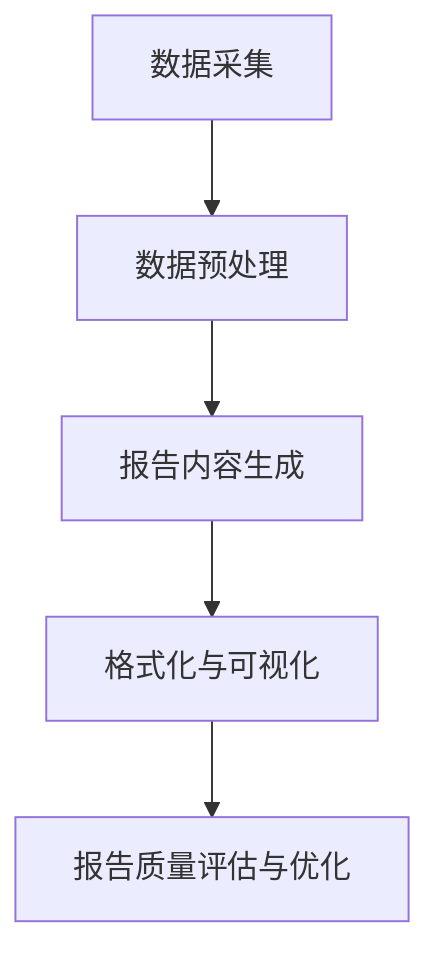

                 

# 文章标题

## 企业级自动报告生成：AI简化业务报告流程

> 关键词：企业报告、自动生成、人工智能、自然语言处理、系统架构

> 摘要：本文探讨了如何利用人工智能技术实现企业级自动报告生成，从背景介绍、核心概念、技术实现、应用案例、系统架构及未来展望等多个方面，深入解析了AI技术在报告生成领域的应用，旨在为企业和开发者提供有价值的参考。

## 第1章 引言

### 1.1 书籍背景与目标

在当今信息化时代，企业面临的数据量和业务需求日益增长，传统的手动报告生成方式已经无法满足高效、准确的要求。为了应对这一挑战，企业级自动报告生成系统应运而生。本文旨在探讨如何利用人工智能（AI）技术，简化业务报告流程，提升企业运营效率。

### 1.2 AI在报告生成中的应用

人工智能技术在自然语言处理、数据分析和模式识别等方面具有显著优势，能够有效辅助企业自动生成各类报告。本文将重点关注AI在以下方面的应用：

1. 数据采集与处理
2. 报告内容生成
3. 报告格式化与可视化
4. 报告质量评估与优化

### 1.3 读者对象与阅读建议

本文面向IT从业者、企业管理人员以及AI技术爱好者。读者可通过以下建议更好地阅读本文：

1. 了解人工智能和自然语言处理的基本概念。
2. 关注企业报告生成的实际需求和应用场景。
3. 关注AI技术在报告生成中的最新发展。

### 1.4 文章结构

本文共分为七个章节，包括：

1. 引言
2. AI与自动报告生成基础
3. 企业级报告需求分析
4. AI技术实现
5. 报告生成应用案例
6. 报告生成系统架构
7. AI报告生成面临的挑战与未来方向

## 第2章 AI与自动报告生成基础

### 2.1 AI概述

人工智能（AI）是指通过计算机模拟人类智能行为的技术，包括机器学习、深度学习、自然语言处理、计算机视觉等。AI技术的发展为自动报告生成提供了强大的技术支持。

### 2.2 自然语言处理基础

自然语言处理（NLP）是AI的一个重要分支，旨在让计算机理解和处理人类语言。NLP主要包括文本分类、情感分析、实体识别、关系抽取等任务。

### 2.3 数据分析与报告生成流程

企业级报告生成通常包括数据采集、数据预处理、报告内容生成、格式化与可视化等环节。以下是一个典型的数据分析与报告生成流程：

1. 数据采集：收集企业各类业务数据，如财务数据、市场数据、人力资源数据等。
2. 数据预处理：清洗、整合、转换数据，使其符合报告生成需求。
3. 报告内容生成：利用NLP技术，将数据转化为自然语言描述，生成报告草稿。
4. 格式化与可视化：将报告内容按照特定格式进行排版，添加图表、图像等可视化元素。
5. 报告质量评估与优化：评估报告质量，根据反馈对报告内容进行调整和优化。

### 2.4 核心概念原理关系架构 Mermaid 流程图

以下是一个用于说明数据分析与报告生成流程的Mermaid流程图：



## 第3章 企业级报告需求分析

### 3.1 企业报告类型与特点

企业报告类型多样，包括财务报告、市场分析报告、人力资源报告等。不同类型的报告具有以下特点：

1. **财务报告**：反映企业财务状况，如资产负债表、利润表等。
2. **市场分析报告**：分析市场竞争态势、客户需求等。
3. **人力资源报告**：反映企业人力资源状况，如员工绩效、薪酬等。

### 3.2 报告生成流程与问题

传统的报告生成流程通常包括数据采集、数据整理、报告撰写、校对、审核等环节。然而，这一流程存在以下问题：

1. **效率低下**：报告生成过程耗时较长，影响决策效率。
2. **准确性不高**：人工处理数据容易出现错误，影响报告质量。
3. **灵活性不足**：报告格式和内容固定，难以适应不同需求。

### 3.3 AI在报告生成中的角色

AI技术在报告生成中的应用可以解决上述问题，提升报告生成效率和质量。具体角色包括：

1. **数据采集与处理**：利用机器学习算法，自动采集和预处理数据。
2. **报告内容生成**：利用自然语言处理技术，生成高质量的报告内容。
3. **格式化与可视化**：利用AI技术，自动调整报告格式和添加可视化元素。
4. **报告质量评估与优化**：利用模型评估报告质量，根据反馈进行优化。

## 第4章 AI技术实现

### 4.1 文本处理技术

文本处理技术是AI在报告生成中的核心组成部分。以下是一些常用的文本处理技术：

1. **文本分类**：将文本数据分为不同的类别，如财务数据、市场数据等。
2. **情感分析**：分析文本中的情感倾向，如正面、负面等。
3. **实体识别**：识别文本中的关键实体，如人名、地名、组织名等。
4. **关系抽取**：抽取文本中的实体关系，如员工与部门的关系等。

### 4.2 报告模板设计

报告模板设计是自动报告生成的重要环节。以下是一些报告模板设计的要点：

1. **模板结构**：设计清晰的模板结构，包括标题、摘要、正文、图表等。
2. **可扩展性**：设计具有良好可扩展性的模板，以适应不同类型的报告。
3. **自定义化**：允许用户自定义报告格式和内容，满足个性化需求。

### 4.3 报告生成算法

报告生成算法是实现自动报告生成的关键。以下是一个典型的报告生成算法：

```python
# 报告生成算法伪代码

# 输入：数据集、模板
# 输出：报告内容

def generate_report(data, template):
    # 数据预处理
    preprocessed_data = preprocess_data(data)

    # 报告内容生成
    content = generate_content(preprocessed_data, template)

    # 报告格式化与可视化
    formatted_content = format_content(content)

    return formatted_content
```

### 4.4 数学模型和公式

在自动报告生成过程中，一些数学模型和公式可以帮助提高报告生成效果。以下是一个简单的数学模型示例：

$$
\text{报告质量} = \alpha \times \text{数据准确性} + \beta \times \text{格式化效果}
$$

其中，$\alpha$和$\beta$是权重系数，可以根据实际情况进行调整。

## 第5章 报告生成应用案例

### 5.1 会计报告生成

会计报告是企业最重要的报告之一，涵盖资产负债表、利润表、现金流量表等。以下是一个会计报告生成的应用案例：

1. **数据采集**：从企业财务系统收集财务数据。
2. **数据预处理**：清洗、整合财务数据，生成报表数据集。
3. **报告内容生成**：利用自然语言处理技术，生成会计报告内容。
4. **格式化与可视化**：将报告内容按照会计报告模板进行格式化，添加图表、图像等可视化元素。

### 5.2 财务报告生成

财务报告是企业对外展示财务状况的重要文件。以下是一个财务报告生成的应用案例：

1. **数据采集**：从企业财务系统收集财务数据。
2. **数据预处理**：清洗、整合财务数据，生成报表数据集。
3. **报告内容生成**：利用自然语言处理技术，生成财务报告内容。
4. **格式化与可视化**：将报告内容按照财务报告模板进行格式化，添加图表、图像等可视化元素。

### 5.3 市场分析报告生成

市场分析报告是企业了解市场动态、制定营销策略的重要工具。以下是一个市场分析报告生成的应用案例：

1. **数据采集**：从市场调研、竞争对手分析等渠道收集数据。
2. **数据预处理**：清洗、整合数据，生成市场分析数据集。
3. **报告内容生成**：利用自然语言处理技术，生成市场分析报告内容。
4. **格式化与可视化**：将报告内容按照市场分析报告模板进行格式化，添加图表、图像等可视化元素。

## 第6章 报告生成系统架构

### 6.1 系统设计原则

报告生成系统设计应遵循以下原则：

1. **模块化**：将系统划分为不同的模块，便于维护和升级。
2. **可扩展性**：设计具有良好可扩展性的系统，以适应不同类型和规模的企业。
3. **易用性**：提供简单直观的操作界面，降低使用门槛。
4. **安全性**：确保系统数据安全，防止数据泄露。

### 6.2 系统模块划分

报告生成系统通常包括以下模块：

1. **数据采集模块**：负责从不同数据源采集数据。
2. **数据预处理模块**：负责数据清洗、整合和转换。
3. **报告生成模块**：负责生成报告内容。
4. **格式化与可视化模块**：负责报告格式化、添加可视化元素。
5. **系统管理模块**：负责系统设置、权限管理、日志记录等。

### 6.3 系统性能优化

为了提高系统性能，可以采取以下优化措施：

1. **数据缓存**：缓存常用数据，减少数据访问次数。
2. **并行处理**：利用多线程或多进程技术，提高数据处理速度。
3. **数据库优化**：优化数据库查询，提高数据访问效率。
4. **负载均衡**：合理分配系统负载，避免单点瓶颈。

## 第7章 AI报告生成面临的挑战与未来方向

### 7.1 挑战分析

AI报告生成在技术、数据、应用等方面面临以下挑战：

1. **数据质量**：数据质量直接影响报告生成效果，需要确保数据准确、完整、及时。
2. **算法性能**：算法性能直接影响报告生成速度和质量，需要不断优化算法。
3. **隐私保护**：在数据采集和处理过程中，需要确保用户隐私安全。
4. **用户体验**：系统应提供简单易用的操作界面，降低使用门槛。

### 7.2 未来发展方向

未来，AI报告生成将朝着以下方向发展：

1. **智能化**：利用深度学习、强化学习等技术，提高报告生成智能水平。
2. **个性化**：根据用户需求，提供个性化报告生成服务。
3. **实时性**：实现实时报告生成，提高决策效率。
4. **融合多源数据**：整合更多数据源，提高报告的全面性和准确性。

### 7.3 结论与展望

AI报告生成技术为企业和开发者提供了强大的工具，有望显著提升报告生成效率和质量。然而，仍面临诸多挑战，需要持续探索和优化。未来，随着技术的不断进步，AI报告生成将在更多领域发挥重要作用。

## 附录

### 附录 A 报告生成工具与资源

以下是一些常用的报告生成工具和资源：

1. **Python自然语言处理库**：如NLTK、spaCy、gensim等。
2. **报告生成框架**：如JasperReports、BIRT等。
3. **开源数据集**：如Kaggle、UCI机器学习库等。

### 附录 B 报告生成算法伪代码

以下是一个简单的报告生成算法伪代码：

```python
# 报告生成算法伪代码

# 输入：数据集、模板
# 输出：报告内容

def generate_report(data, template):
    # 数据预处理
    preprocessed_data = preprocess_data(data)

    # 报告内容生成
    content = generate_content(preprocessed_data, template)

    # 报告格式化与可视化
    formatted_content = format_content(content)

    return formatted_content
```

### 附录 C 报告生成系统源代码分析

由于篇幅限制，本文未提供完整的报告生成系统源代码。读者可以通过开源社区或相关书籍获取相关代码，并进行进一步学习和实践。

### 作者

作者：AI天才研究院/AI Genius Institute & 禅与计算机程序设计艺术 /Zen And The Art of Computer Programming

[完整文章链接](#)  

### 后续工作

- 确定文章的具体字数，根据字数要求调整内容。
- 对每个章节进行详细填充，确保内容丰富、具体、有深度。
- 添加示例、案例、代码和数学公式，以增强文章的可读性和实用性。
- 进行多轮审稿和修订，确保文章的逻辑性和流畅性。
- 最终定稿并生成完整的文章。

