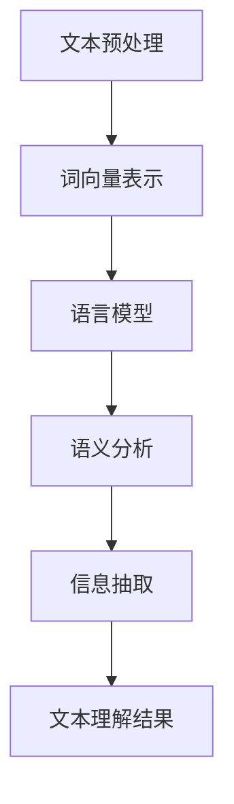

                 

### 文章标题

《企业级自然语言处理平台：深化AI文本理解能力》

### 关键词

- 自然语言处理
- 企业级平台
- 文本理解
- AI技术
- 算法原理
- 数学模型
- 项目实战

### 摘要

本文深入探讨企业级自然语言处理（NLP）平台的建设，重点在于提升AI文本理解能力。我们将从核心概念、算法原理、数学模型到项目实战进行详细分析，旨在为读者提供一份全面的技术指南。通过这篇文章，您将了解如何构建高效的企业级NLP平台，并掌握关键的技术要点和实践技巧。

---

## 第1章 核心概念与联系

### 1.1 自然语言处理基本概念

自然语言处理（Natural Language Processing，NLP）是人工智能（AI）的重要分支，主要研究如何使计算机能够理解、生成和处理人类自然语言。文本理解（Text Understanding）是NLP的核心任务之一，它涉及到对文本中的词汇、句子和段落进行深入分析和解释。

#### 1.1.1 自然语言处理定义

自然语言处理可以简单定义为将人类语言转化为计算机可以处理的形式，并使计算机能够理解和生成自然语言。这通常包括以下几个步骤：

1. **文本预处理**：包括去除停用词、标点符号、分词、词性标注等。
2. **语言模型**：使用统计方法或深度学习方法生成概率分布，用于预测下一个词。
3. **语义分析**：通过词向量、句法分析和语义角色标注等方法，理解句子和段落的含义。
4. **信息抽取**：从文本中提取出结构化的信息，如命名实体识别、关系抽取等。

#### 1.1.2 文本理解能力的重要性

文本理解能力对于现代企业和应用程序至关重要。以下是几个关键原因：

1. **用户交互**：文本理解使得计算机能够更好地与人类进行交互，提供更自然的用户体验。
2. **信息提取**：从大量非结构化数据中提取有价值的信息，如客户评论分析、法律文档摘要等。
3. **内容生成**：智能助手、聊天机器人等应用需要理解用户的意图和需求，以生成合适的响应。
4. **智能推荐**：基于文本理解，可以为用户推荐相关的内容、产品或服务。

#### 1.1.3 NLP流程Mermaid图展示

为了更直观地理解NLP的流程，我们可以使用Mermaid图来展示。以下是NLP流程的基本步骤：

### 1.2 企业级自然语言处理平台构建

构建企业级自然语言处理平台需要考虑多个方面，包括平台的总体架构、数据处理模块、算法实现模块等。

#### 1.2.1 平台总体架构

企业级NLP平台的总体架构可以分为以下几个层次：

1. **数据层**：存储和管理原始数据和预处理后的数据。
2. **计算层**：执行文本预处理、语言模型训练、语义分析和信息抽取等任务。
3. **应用层**：提供API接口供外部系统调用，如文本分类、情感分析、命名实体识别等。
4. **展示层**：展示分析结果，可以是图形界面或Web界面。

#### 1.2.2 数据处理模块

数据处理模块是NLP平台的核心之一，主要包括以下几个步骤：

1. **数据采集**：从各种数据源（如网站、数据库、社交媒体等）收集文本数据。
2. **数据预处理**：进行分词、词性标注、去除停用词等操作，将文本转换为计算机可以处理的形式。
3. **数据存储**：将预处理后的数据存储到数据库或数据湖中，以便后续处理和查询。

#### 1.2.3 算法实现模块

算法实现模块负责实现各种NLP算法，包括词向量模型、序列模型、注意力机制等。以下是这些算法的基本概念：

1. **词向量模型**：将词汇表示为向量，用于文本表示和学习。
2. **序列模型**：用于处理序列数据，如RNN、LSTM等。
3. **注意力机制**：用于提高模型对重要信息的学习能力。

通过以上构建，企业级NLP平台可以为各种应用提供强大的文本理解能力。

---

### 第2章 核心算法原理讲解

#### 2.1 词向量模型

词向量模型是将词汇映射到高维空间中的向量表示，使得计算机能够处理和比较文本。以下介绍两种常见的词向量模型：Word2Vec和GloVe。

#### 2.1.1 Word2Vec算法原理

Word2Vec算法基于分布式表示的思想，通过训练大量文本数据来学习词向量。其核心思想是将每个词表示为一个向量，使得相似的词在向量空间中更接近。Word2Vec算法主要有两种训练方法：CBOW（Continuous Bag of Words）和Skip-Gram。

**CBOW算法**：

给定一个中心词，CBOW算法通过上下文词的平均向量来预测中心词。其目标是最小化损失函数：

$$
\text{Loss} = \frac{1}{N}\sum_{i=1}^{N}\text{log}(\text{softmax}(\text{W}\text{v}_{\text{context}}))
$$

其中，$\text{W}$为权重矩阵，$\text{v}_{\text{context}}$为上下文词的向量表示。

**Skip-Gram算法**：

与CBOW算法相反，Skip-Gram算法通过中心词预测上下文词。其目标是最小化损失函数：

$$
\text{Loss} = \frac{1}{N}\sum_{i=1}^{N}\text{log}(\text{softmax}(\text{W}\text{v}_{\text{target}}))
$$

#### 2.1.2 GloVe算法原理

GloVe（Global Vectors for Word Representation）算法通过考虑词的共现信息来学习词向量。其核心思想是计算两个词的共现次数，并使用矩阵分解的方法学习词向量。

给定一个词汇表$V$，共现矩阵$C$表示词汇表中每对词的共现次数。GloVe算法的目标是最小化损失函数：

$$
\text{Loss} = \frac{1}{N}\sum_{(i,j)\in V\times V}\text{log}\left(\frac{\exp(\text{v}_i^T\text{v}_j)}{\alpha + \text{v}_i^T\text{v}_j}\right)
$$

其中，$\text{v}_i$和$\text{v}_j$为词$i$和词$j$的向量表示，$\alpha$为调节参数。

#### 2.2 序列模型

序列模型用于处理序列数据，如文本、语音等。以下介绍几种常见的序列模型：RNN、LSTM和GRU。

#### 2.2.1 RNN算法原理

循环神经网络（Recurrent Neural Network，RNN）是一种能够处理序列数据的神经网络。RNN的基本思想是利用上一个时间步的输出作为当前时间步的输入，通过循环结构来处理序列数据。

给定一个输入序列$\{x_1, x_2, ..., x_T\}$，RNN的输出序列$\{y_1, y_2, ..., y_T\}$可以通过以下递归关系计算：

$$
\text{h}_t = \text{sigmoid}(\text{W}_h\text{x}_t + \text{U}_h\text{h}_{t-1} + \text{b}_h)
$$

$$
\text{y}_t = \text{softmax}(\text{V}_h\text{h}_t + \text{b}_y)
$$

其中，$\text{h}_t$为隐藏状态，$\text{U}_h$为输入权重矩阵，$\text{V}_h$为输出权重矩阵。

然而，传统的RNN在处理长序列时容易出现梯度消失或爆炸的问题。

#### 2.2.2 LSTM算法原理

长短时记忆网络（Long Short-Term Memory，LSTM）是RNN的一种改进，能够更好地处理长序列数据。LSTM的核心是引入了三个门结构：遗忘门、输入门和输出门。

1. **遗忘门**：用于决定之前隐藏状态中的哪些信息需要遗忘。

$$
\text{f}_t = \text{sigmoid}(\text{W}_f\text{x}_t + \text{U}_f\text{h}_{t-1} + \text{b}_f)
$$

2. **输入门**：用于决定新的隐藏状态中哪些信息需要更新。

$$
\text{i}_t = \text{sigmoid}(\text{W}_i\text{x}_t + \text{U}_i\text{h}_{t-1} + \text{b}_i)
$$

3. **输出门**：用于决定当前隐藏状态中哪些信息需要输出。

$$
\text{o}_t = \text{sigmoid}(\text{W}_o\text{x}_t + \text{U}_o\text{h}_{t-1} + \text{b}_o)
$$

LSTM的隐藏状态更新公式为：

$$
\text{c}_t = \text{f}_t\odot\text{c}_{t-1} + \text{i}_t\odot\text{sigmoid}(\text{W}_c\text{x}_t + \text{U}_c\text{h}_{t-1} + \text{b}_c)
$$

$$
\text{h}_t = \text{o}_t\odot\text{sigmoid}(\text{c}_t)
$$

其中，$\text{c}_t$为细胞状态。

#### 2.2.3 GRU算法原理

门控循环单元（Gated Recurrent Unit，GRU）是LSTM的简化版本，保留了LSTM的核心思想，但结构更为简洁。GRU只有一个更新门结构，即重置门和更新门。

1. **重置门**：用于决定之前隐藏状态中的哪些信息需要保留或更新。

$$
\text{z}_t = \text{sigmoid}(\text{W}_z\text{x}_t + \text{U}_z\text{h}_{t-1} + \text{b}_z)
$$

2. **更新门**：用于决定当前隐藏状态中哪些信息需要更新。

$$
\text{r}_t = \text{sigmoid}(\text{W}_r\text{x}_t + \text{U}_r\text{h}_{t-1} + \text{b}_r)
$$

GRU的隐藏状态更新公式为：

$$
\text{h}_t = (1 - \text{z}_t)\odot\text{h}_{t-1} + \text{r}_t\odot\text{sigmoid}(\text{W}_h\text{x}_t + (\text{U}_h + \text{W}_h^*)\text{h}_{t-1} + \text{b}_h)
$$

#### 2.3 注意力机制

注意力机制（Attention Mechanism）是一种用于提高模型对重要信息学习能力的机制，广泛应用于机器翻译、文本摘要等领域。

**基本思想**：注意力机制通过动态调整每个输入词的权重，使得模型能够关注到重要信息。

给定一个输入序列$\{x_1, x_2, ..., x_T\}$和输出序列$\{y_1, y_2, ..., y_T\}$，注意力机制的输出可以通过以下公式计算：

$$
\text{a}_t = \text{softmax}(\text{Tanh}(\text{W}_a[\text{h}_t, \text{h}_{t-1}, ..., \text{h}_1]))
$$

$$
\text{c}_t = \sum_{i=1}^{T}\text{a}_i\odot\text{x}_i
$$

$$
\text{h}_t = \text{softmax}(\text{W}_h[\text{c}_t, \text{h}_{t-1}]) + \text{b}_h
$$

其中，$\text{h}_t$为当前隐藏状态，$\text{a}_t$为注意力权重。

---

### 第3章 数学模型和数学公式

#### 3.1 循环神经网络（RNN）

循环神经网络（RNN）是一种用于处理序列数据的神经网络，其基本数学模型如下：

1. **隐藏状态更新**：

$$
\text{h}_t = \text{sigmoid}(\text{W}_h\text{x}_t + \text{U}_h\text{h}_{t-1} + \text{b}_h)
$$

2. **输出计算**：

$$
\text{y}_t = \text{softmax}(\text{V}_h\text{h}_t + \text{b}_y)
$$

其中，$\text{h}_t$为隐藏状态，$\text{x}_t$为输入，$\text{y}_t$为输出，$\text{W}_h$、$\text{U}_h$和$\text{V}_h$分别为权重矩阵，$\text{b}_h$和$\text{b}_y$分别为偏置向量。

#### 3.2 长短时记忆网络（LSTM）

长短时记忆网络（LSTM）是一种改进的循环神经网络，其核心是引入了三个门结构：遗忘门、输入门和输出门。以下是LSTM的数学模型：

1. **遗忘门**：

$$
\text{f}_t = \text{sigmoid}(\text{W}_f\text{x}_t + \text{U}_f\text{h}_{t-1} + \text{b}_f)
$$

2. **输入门**：

$$
\text{i}_t = \text{sigmoid}(\text{W}_i\text{x}_t + \text{U}_i\text{h}_{t-1} + \text{b}_i)
$$

3. **输出门**：

$$
\text{o}_t = \text{sigmoid}(\text{W}_o\text{x}_t + \text{U}_o\text{h}_{t-1} + \text{b}_o)
$$

4. **隐藏状态更新**：

$$
\text{c}_t = \text{f}_t\odot\text{c}_{t-1} + \text{i}_t\odot\text{sigmoid}(\text{W}_c\text{x}_t + \text{U}_c\text{h}_{t-1} + \text{b}_c)
$$

$$
\text{h}_t = \text{o}_t\odot\text{sigmoid}(\text{c}_t)
$$

其中，$\text{c}_t$为细胞状态。

#### 3.3 注意力机制

注意力机制是一种用于提高模型对重要信息学习能力的机制，其基本数学模型如下：

1. **注意力权重**：

$$
\text{a}_t = \text{softmax}(\text{Tanh}(\text{W}_a[\text{h}_t, \text{h}_{t-1}, ..., \text{h}_1]))
$$

2. **上下文向量**：

$$
\text{c}_t = \sum_{i=1}^{T}\text{a}_i\odot\text{x}_i
$$

3. **隐藏状态**：

$$
\text{h}_t = \text{softmax}(\text{W}_h[\text{c}_t, \text{h}_{t-1}]) + \text{b}_h
$$

其中，$\text{h}_t$为当前隐藏状态，$\text{a}_t$为注意力权重，$\text{c}_t$为上下文向量。

---

### 第4章 项目实战

#### 4.1 文本分类项目

文本分类是一种常见的自然语言处理任务，旨在将文本数据自动分类到预定义的类别中。以下是一个基于LSTM的文本分类项目的实战过程。

#### 4.1.1 项目背景

假设我们有一个新闻数据集，包含多个类别，如体育、政治、科技等。我们的目标是使用自然语言处理技术自动将新

