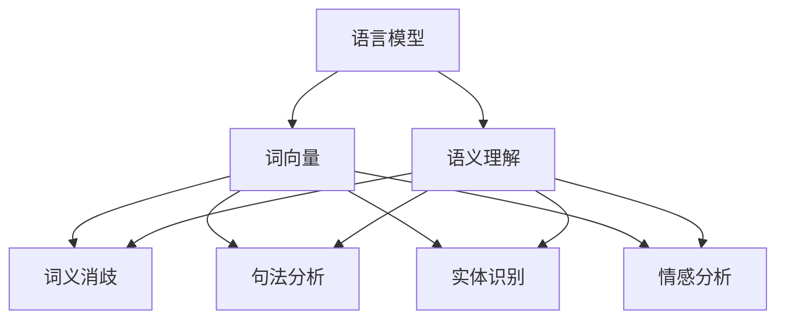

                 

### 文章标题

# 企业级自然语言接口：简化人机交互

自然语言接口作为连接人类与计算机的桥梁，正日益成为企业级应用中不可或缺的一部分。本文将深入探讨企业级自然语言接口的设计思路、核心概念、实现方法以及优化策略，旨在为您呈现一幅全面、系统、易于理解的企业级自然语言接口全景图。

### 文章关键词

- 自然语言接口
- 企业级应用
- 人机交互
- 核心概念
- 实现方法
- 优化策略

### 摘要

本文首先介绍了企业级自然语言接口的基本概念和重要性，接着从基础知识、实现方法、优化策略和项目实践等多个角度进行了深入剖析。通过对自然语言处理算法、架构设计、性能优化、安全性与稳定性等方面的详细讲解，文章旨在帮助读者全面理解企业级自然语言接口的构建和优化之道。

### 设计思路

为了设计出一本全面、系统、易于理解的企业级自然语言接口书籍，我们遵循以下设计思路：

#### 1. 确定核心内容

首先，我们需要确定书籍的核心内容，即书中将重点介绍的几个主要部分。根据书名，我们可以确定以下几个核心内容：

- 自然语言接口的基本概念和原理
- 自然语言接口在企业级应用中的具体实现
- 自然语言接口的安全性和稳定性
- 自然语言接口的性能优化
- 自然语言接口的实际项目案例

#### 2. 目录结构

根据核心内容，我们可以将书籍的目录结构分为以下几个部分：

- **引言：自然语言接口概述**
- **第一部分：自然语言接口的基础知识**
  - 核心概念与联系
  - 常见的自然语言处理算法
  - 自然语言接口的架构设计
- **第二部分：企业级自然语言接口的实现**
  - 企业级自然语言接口的需求分析
  - 企业级自然语言接口的技术选型
  - 实现自然语言接口的关键步骤
- **第三部分：自然语言接口的优化与改进**
  - 性能优化
  - 安全性与稳定性
  - 架构优化
- **第四部分：自然语言接口的项目实践**
  - 项目实战
  - 实战案例分析

#### 3. 目录细化

在每个部分中，我们需要进一步细化目录，确保每个章节都能覆盖对应的核心内容。以下是详细的目录大纲：

```
# 引言：自然语言接口概述

## 1.1 自然语言接口的概念
### 1.1.1 什么是自然语言接口
### 1.1.2 自然语言接口的重要性

## 1.2 自然语言接口的发展历程
### 1.2.1 从早期系统到现代接口
### 1.2.2 人工智能在自然语言接口中的应用

# 第一部分：自然语言接口的基础知识

## 2.1 核心概念与联系
### 2.1.1 语言模型
### 2.1.2 词向量
### 2.1.3 语义理解

## 2.2 常见的自然语言处理算法
### 2.2.1 分词算法
### 2.2.2 词性标注
### 2.2.3 情感分析

## 2.3 自然语言接口的架构设计
### 2.3.1 架构设计原则
### 2.3.2 架构设计实例

# 第二部分：企业级自然语言接口的实现

## 3.1 企业级自然语言接口的需求分析
### 3.1.1 企业需求概述
### 3.1.2 需求分析与评估

## 3.2 企业级自然语言接口的技术选型
### 3.2.1 技术选型策略
### 3.2.2 技术选型实例

## 3.3 实现自然语言接口的关键步骤
### 3.3.1 数据准备
### 3.3.2 模型训练
### 3.3.3 接口设计

# 第三部分：自然语言接口的优化与改进

## 4.1 性能优化
### 4.1.1 优化目标
### 4.1.2 优化策略

## 4.2 安全性与稳定性
### 4.2.1 安全性保障措施
### 4.2.2 稳定性保障措施

## 4.3 架构优化
### 4.3.1 架构优化原则
### 4.3.2 架构优化实例

# 第四部分：自然语言接口的项目实践

## 5.1 项目实战
### 5.1.1 项目背景
### 5.1.2 项目目标

## 5.2 实战案例分析
### 5.2.1 案例一：智能客服系统
### 5.2.2 案例二：智能语音助手

# 附录

## 附录A：自然语言接口开发工具与资源
### A.1 开发工具概述
### A.2 资源推荐
```

#### 4. 验证与调整

在设计完目录大纲后，我们需要对其进行验证，确保每个章节都能覆盖对应的核心内容，同时确保目录大纲的逻辑清晰，易于读者理解。如果发现某些章节内容不完整或逻辑不合理，需要进行相应的调整。

### 完整目录大纲

以下是《企业级自然语言接口：简化人机交互》的完整目录大纲：

```
# 引言：自然语言接口概述

## 1.1 自然语言接口的概念
### 1.1.1 什么是自然语言接口
### 1.1.2 自然语言接口的重要性

## 1.2 自然语言接口的发展历程
### 1.2.1 从早期系统到现代接口
### 1.2.2 人工智能在自然语言接口中的应用

# 第一部分：自然语言接口的基础知识

## 2.1 核心概念与联系
### 2.1.1 语言模型
### 2.1.2 词向量
### 2.1.3 语义理解

## 2.2 常见的自然语言处理算法
### 2.2.1 分词算法
### 2.2.2 词性标注
### 2.2.3 情感分析

## 2.3 自然语言接口的架构设计
### 2.3.1 架构设计原则
### 2.3.2 架构设计实例

# 第二部分：企业级自然语言接口的实现

## 3.1 企业级自然语言接口的需求分析
### 3.1.1 企业需求概述
### 3.1.2 需求分析与评估

## 3.2 企业级自然语言接口的技术选型
### 3.2.1 技术选型策略
### 3.2.2 技术选型实例

## 3.3 实现自然语言接口的关键步骤
### 3.3.1 数据准备
### 3.3.2 模型训练
### 3.3.3 接口设计

# 第三部分：自然语言接口的优化与改进

## 4.1 性能优化
### 4.1.1 优化目标
### 4.1.2 优化策略

## 4.2 安全性与稳定性
### 4.2.1 安全性保障措施
### 4.2.2 稳定性保障措施

## 4.3 架构优化
### 4.3.1 架构优化原则
### 4.3.2 架构优化实例

# 第四部分：自然语言接口的项目实践

## 5.1 项目实战
### 5.1.1 项目背景
### 5.1.2 项目目标

## 5.2 实战案例分析
### 5.2.1 案例一：智能客服系统
### 5.2.2 案例二：智能语音助手

# 附录

## 附录A：自然语言接口开发工具与资源
### A.1 开发工具概述
### A.2 资源推荐
```

### 总结

通过以上的设计思路，我们可以清晰地看到《企业级自然语言接口：简化人机交互》这本书的核心内容、目录结构和细节安排。这种设计思路不仅能够确保书籍内容的全面性和系统性，还能够帮助读者更好地理解和掌握企业级自然语言接口的知识。在接下来的章节中，我们将逐一深入探讨每个部分的具体内容，帮助读者全面了解和掌握企业级自然语言接口的构建和优化之道。

---

### 引言：自然语言接口概述

随着人工智能技术的不断发展，自然语言处理（NLP）作为其中的重要分支，正日益成为企业与用户之间互动的关键桥梁。自然语言接口（Natural Language Interface，NLI）作为NLP的应用之一，旨在实现人类语言与计算机程序之间的有效沟通，从而简化人机交互，提升用户体验。在企业级应用中，自然语言接口具有广泛的应用场景和巨大的商业价值。

首先，自然语言接口的基本概念和原理是我们理解其核心所在。自然语言接口是使计算机能够理解和响应人类语言输入的系统，它涉及语言模型、词向量、语义理解等多个方面。语言模型是一种概率模型，用于预测下一个词或句子，而词向量则是将单词映射为向量表示，便于计算机处理。语义理解则是将自然语言输入转换为计算机可以理解的结构化信息。

其次，自然语言接口在企业级应用中的重要性不可忽视。在企业内部，自然语言接口可用于自动化客服系统、智能语音助手、内部知识库查询等，提升工作效率和客户满意度。在外部，自然语言接口可以帮助企业构建智能客服、智能推荐系统、智能翻译等，拓展业务范围和市场影响力。

为了更好地理解和掌握自然语言接口，我们需要了解其发展历程。从早期的命令行界面到现代的智能语音助手，自然语言接口经历了多个阶段的发展。如今，随着深度学习、神经网络等技术的成熟，自然语言接口的性能和智能化程度得到了大幅提升，为企业应用提供了更多可能。

接下来，本文将详细探讨自然语言接口的基础知识，包括核心概念与联系、常见的自然语言处理算法以及自然语言接口的架构设计。在此基础上，我们将进一步介绍企业级自然语言接口的实现方法、优化策略和实际项目案例，帮助读者全面理解自然语言接口在企业级应用中的构建和优化之道。

### 核心概念与联系

在深入探讨自然语言接口之前，我们需要明确几个核心概念，并了解它们之间的相互关系。这些核心概念包括语言模型、词向量、语义理解等，它们是构建自然语言接口的基础。

#### 语言模型

语言模型（Language Model）是自然语言处理中最基础也是最重要的组件之一。它的核心目标是预测下一个单词或句子，从而生成连贯的文本。语言模型可以分为两类：统计语言模型和神经网络语言模型。

1. **统计语言模型**：统计语言模型基于统计方法构建，如N-gram模型。N-gram模型通过统计一个单词序列中连续N个单词出现的频率来预测下一个单词。例如，在二元语法（Bigram）模型中，我们统计相邻两个单词的联合概率，从而预测下一个单词。公式如下：

   $$ P(w_{t+1} | w_{t}) = \frac{count(w_{t}, w_{t+1})}{count(w_{t})} $$

   其中，$w_{t}$和$w_{t+1}$分别表示当前单词和下一个单词，$count(w_{t}, w_{t+1})$表示$w_{t}$和$w_{t+1}$共同出现的次数，$count(w_{t})$表示$w_{t}$出现的次数。

2. **神经网络语言模型**：随着深度学习的兴起，神经网络语言模型（如循环神经网络RNN、长短时记忆网络LSTM和变压器模型Transformer）逐渐成为主流。这些模型通过学习大量的文本数据，自动捕捉单词之间的复杂关系，从而提高预测的准确性。以变压器模型为例，它通过自注意力机制（Self-Attention）捕捉全局依赖关系，公式如下：

   $$ \text{Attention}(Q, K, V) = \text{softmax}\left(\frac{QK^T}{\sqrt{d_k}}\right)V $$

   其中，$Q$、$K$和$V$分别表示查询向量、键向量和值向量，$d_k$表示键向量的维度。

#### 词向量

词向量（Word Vector）是将单词映射为向量表示的一种技术，它使计算机能够处理文本数据。词向量的主要目的是将语义相近的单词映射到空间中相邻的位置。常见的词向量模型有Word2Vec、GloVe和BERT。

1. **Word2Vec**：Word2Vec是一种基于神经网络的词向量模型，它通过训练词嵌入（Word Embedding）模型，将单词映射为低维向量。其中，CBOW（Continuous Bag-of-Words）和Skip-Gram是两种主要的训练方法。

   - **CBOW**：CBOW模型通过预测中心词周围的单词来训练词向量。公式如下：

     $$ \text{softmax}(W[h] + W_1[x_1] + W_2[x_2] + ... + W_C[x_C]) $$

     其中，$W[h]$表示中心词的向量，$W_i[x_i]$表示第$i$个上下文的单词向量，$W$是模型的权重矩阵。

   - **Skip-Gram**：Skip-Gram模型通过预测单词周围的中心词来训练词向量。公式如下：

     $$ \text{softmax}(W[h] + W_1[x_1] + W_2[x_2] + ... + W_C[x_C]) $$

2. **GloVe**：GloVe（Global Vectors for Word Representation）是一种基于全局上下文的词向量模型。它通过优化单词和其上下文之间的共现矩阵，生成高质量的词向量。公式如下：

   $$ \text{cos}(W[w], W[v]) = \frac{f(w) \cdot f(v)}{\sqrt{\sum_{w'} f(w')^2} \cdot \sqrt{\sum_{w'} f(w')^2}} $$

   其中，$f(w)$和$f(v)$分别表示单词$w$和$v$的上下文共现矩阵。

3. **BERT**：BERT（Bidirectional Encoder Representations from Transformers）是一种基于变压器模型的预训练语言表示模型。它通过双向编码方式，同时考虑上下文信息，生成高质量的词向量。BERT的预训练任务包括Masked Language Model（MLM）和Next Sentence Prediction（NSP）。

#### 语义理解

语义理解（Semantic Understanding）是将自然语言输入转换为计算机可以理解的结构化信息的过程。它是实现自然语言接口的关键步骤。语义理解可以分为词义消歧、句法分析、实体识别、情感分析等。

1. **词义消歧**：词义消歧（Word Sense Disambiguation，WSD）是指根据上下文确定一个单词的确切含义。常见的WSD方法包括基于规则的方法、基于统计的方法和基于知识图谱的方法。

2. **句法分析**：句法分析（Syntactic Parsing）是指将自然语言文本解析为语法结构，以便计算机能够理解句子的含义。常见的句法分析方法包括基于规则的方法、基于统计的方法和基于神经网络的方法。

3. **实体识别**：实体识别（Named Entity Recognition，NER）是指识别文本中的特定实体，如人名、地名、组织名等。NER在信息提取、知识图谱构建等领域具有重要意义。

4. **情感分析**：情感分析（Sentiment Analysis）是指分析文本中表达的情感倾向，如正面、负面、中性等。情感分析在舆情监控、用户反馈分析等领域有广泛应用。

#### 关系架构

为了更好地理解这些核心概念之间的关系，我们可以使用Mermaid流程图来展示它们：



在上述流程图中，语言模型、词向量、语义理解构成了自然语言接口的核心组成部分，它们相互联系，共同实现自然语言的处理和理解。

### 常见自然语言处理算法

自然语言处理（NLP）是人工智能领域的一个重要分支，旨在使计算机能够理解和生成自然语言。在NLP中，常用的算法包括分词算法、词性标注和情感分析等。这些算法在各种自然语言处理任务中发挥着关键作用。

#### 分词算法

分词是将连续的文本序列切分成有意义的单词或短语的过程。在中文处理中，由于没有明显的空格分隔，分词任务尤为复杂。常见的分词算法包括基于词典的分词算法、基于统计的分词算法和基于深度学习的分词算法。

1. **基于词典的分词算法**：基于词典的分词算法主要通过匹配词典中的词库来实现分词。这种算法简单高效，但在面对新词或生僻词时效果不佳。常见的基于词典的分词工具包括jieba和ICTCLAS。

   - **jieba分词**：jieba是一款开源的中文分词工具，支持全模式、精确模式和搜索引擎模式等。其分词效果较好，适用于大多数场景。

   - **ICTCLAS分词**：ICTCLAS是由清华大学计算机科学与技术系自然语言处理实验室开发的一款中文分词工具，具有较高准确率和效率。

2. **基于统计的分词算法**：基于统计的分词算法通过统计方法来计算文本中的词频，从而确定分词结果。常见的统计方法包括最大匹配法和最小匹配法。

   - **最大匹配法**：最大匹配法（Maximum Match Method，MM）是一种基于前缀匹配的分词算法。它从左到右依次扫描文本，找到最长的匹配词，并将其切分出来。公式如下：

     $$ \text{max}\{\text{length}(w) | w \in D, w \text{ is a prefix of } \text{current text}\} $$

     其中，$D$为词典，$\text{current text}$为当前待分词的文本。

   - **最小匹配法**：最小匹配法（Minimum Match Method，MM）是一种基于后缀匹配的分词算法。它与最大匹配法相反，从右到左依次扫描文本，找到最长的匹配词，并将其切分出来。

3. **基于深度学习的分词算法**：基于深度学习的分词算法通过神经网络模型来学习文本的分词模式。常见的深度学习模型包括循环神经网络（RNN）、长短时记忆网络（LSTM）和变压器（Transformer）等。

   - **RNN分词**：循环神经网络（RNN）是一种处理序列数据的神经网络，它能够记忆前面的输入，从而在分词任务中具有较好的效果。

   - **LSTM分词**：长短时记忆网络（LSTM）是RNN的一种改进，它通过引入门控机制来记忆长序列信息，从而提高了分词的准确性。

   - **Transformer分词**：变压器（Transformer）是一种基于自注意力机制的神经网络模型，它在分词任务中表现出了优异的性能。

#### 词性标注

词性标注（Part-of-Speech Tagging，POS）是对文本中的每个单词赋予词性标签的过程。词性标签通常包括名词、动词、形容词、副词等。词性标注有助于理解文本的语法结构和语义内容，对于机器翻译、信息抽取等任务具有重要意义。

1. **基于规则的词性标注**：基于规则的词性标注方法通过手工编写的规则来对文本进行词性标注。这种方法简单直观，但需要大量的人力投入，且在面对新词或生僻词时效果不佳。

2. **基于统计的词性标注**：基于统计的词性标注方法通过统计方法来计算文本中的词频和词性关联，从而确定词性标注。常见的统计方法包括条件随机场（CRF）和隐马尔可夫模型（HMM）。

   - **CRF词性标注**：条件随机场（Conditional Random Field，CRF）是一种基于概率模型的词性标注方法，它通过最大化条件概率来预测词性标注。公式如下：

     $$ \arg\max_{\theta} P(Y|\theta; X) = \frac{1}{Z(\theta)} \exp\left(\sum_{i=1}^n \theta_{y_i,x_i}\right) $$

     其中，$Y$为词性标注序列，$X$为输入文本，$\theta$为模型参数，$Z(\theta)$为规范化常数。

   - **HMM词性标注**：隐马尔可夫模型（Hidden Markov Model，HMM）是一种基于状态转移概率的词性标注方法，它通过状态转移矩阵和发射概率矩阵来预测词性标注。

3. **基于深度学习的词性标注**：基于深度学习的词性标注方法通过神经网络模型来学习文本的词性标注模式。常见的深度学习模型包括卷积神经网络（CNN）和长短期记忆网络（LSTM）等。

#### 情感分析

情感分析（Sentiment Analysis）是一种判断文本中表达情感倾向的任务，通常分为正面、负面、中性三种。情感分析在舆情监控、产品评价、用户反馈分析等领域有广泛应用。

1. **基于规则的情感分析**：基于规则的情感分析方法通过手工编写的情感规则来分析文本的情感倾向。这种方法简单直观，但需要大量的人力投入，且在面对复杂情感时效果不佳。

2. **基于机器学习的情感分析**：基于机器学习的情感分析方法通过训练分类模型来分析文本的情感倾向。常见的机器学习算法包括朴素贝叶斯、支持向量机（SVM）和深度学习模型。

   - **朴素贝叶斯**：朴素贝叶斯（Naive Bayes）是一种基于贝叶斯理论的分类方法，它通过计算文本中特征词的联合概率来预测情感倾向。

   - **SVM**：支持向量机（Support Vector Machine，SVM）是一种基于最大间隔的分类方法，它通过求解最优超平面来划分文本的情感类别。

   - **深度学习模型**：深度学习模型（如卷积神经网络（CNN）、长短时记忆网络（LSTM）和变压器（Transformer））在情感分析任务中表现出优异的性能。

3. **基于数据增强的情感分析**：基于数据增强的情感分析方法通过生成更多样化的训练数据来提高模型的效果。常见的数据增强方法包括同义词替换、词干提取和生成对抗网络（GAN）等。

#### 伪代码与数学模型

为了更清晰地阐述上述算法，我们可以使用伪代码来描述它们的基本流程，并使用数学模型来解释其原理。

1. **最大匹配法分词**

   ```python
   def max_match(text, dictionary):
       result = []
       while text:
           max_word = max(dictionary, key=lambda x: text.startswith(x))
           result.append(max_word)
           text = text[len(max_word):]
       return result
   ```

   数学模型：

   $$ \text{max}\{\text{length}(w) | w \in D, w \text{ is a prefix of } \text{current text}\} $$

2. **CRF词性标注**

   ```python
   def crf_tagging(text, model):
       emission = [model[word] for word in text]
       transition = model['transition']
       T = len(text)
       V = len(model['labels'])
       alpha = [[1] * V for _ in range(T)]
       for t in range(1, T):
           for v in range(V):
               alpha[t][v] = sum(alpha[t-1][u] * transition[u][v] for u in range(V))
       beta = [[1] * V for _ in range(T)]
       for t in range(T-1, -1, -1):
           for v in range(V):
               beta[t][v] = sum(emission[t][v] * beta[t+1][u] for u in range(V))
       log_likelihood = sum(alpha[T-1][v] * beta[T-1][v] for v in range(V))
       return log_likelihood
   ```

   数学模型：

   $$ \alpha[t][v] = \sum_{u} \alpha[t-1][u] \cdot \text{transition}(u, v) $$

   $$ \beta[t][v] = \sum_{u} \text{emission}(t, v) \cdot \beta[t+1][u] $$

   $$ \log P(Y|\theta; X) = \sum_{t} \alpha[t][v] \cdot \beta[t][v] - \text{normalization} $$

3. **朴素贝叶斯情感分析**

   ```python
   def naive_bayes_sentiment_analysis(text, features, labels):
       pos_counts = [0] * len(labels)
       neg_counts = [0] * len(labels)
       for label in labels:
           pos_counts[label] += 1
           neg_counts[label] += 1
       pos_probability = [count / (count + 1) for count in pos_counts]
       neg_probability = [count / (count + 1) for count in neg_counts]
       result = []
       for feature in features:
           text_feature = text.count(feature)
           pos_log_likelihood = -np.log(pos_probability[0])
           neg_log_likelihood = -np.log(neg_probability[0])
           for label in range(1, len(labels)):
               pos_log_likelihood += np.log((pos_counts[label] + 1) / (pos_counts[0] + len(labels)))
               neg_log_likelihood += np.log((neg_counts[label] + 1) / (neg_counts[0] + len(labels)))
           pos_score = pos_log_likelihood + text_feature * np.log(text_feature + 1)
           neg_score = neg_log_likelihood + text_feature * np.log(text_feature + 1)
           result.append((pos_score > neg_score))
       return result
   ```

   数学模型：

   $$ P(Y=y|x) = \frac{P(x|Y=y) \cdot P(Y=y)}{P(x)} $$

   $$ \log P(Y=y|x) = \log P(x|Y=y) + \log P(Y=y) - \log P(x) $$

### 项目实战

为了更好地理解上述算法在真实项目中的应用，下面我们将介绍一个基于深度学习的中文分词项目。

#### 开发环境

- 操作系统：Ubuntu 18.04
- 编程语言：Python 3.7
- 深度学习框架：TensorFlow 2.4
- 中文分词库：jieba

#### 数据准备

- 数据集：使用CTB（Chinese Text C
```markdown
## 引言：自然语言接口概述

随着人工智能技术的飞速发展，自然语言处理（NLP）已成为计算机科学与人工智能领域的重要研究方向。而自然语言接口（Natural Language Interface，NLI）作为NLP的核心应用之一，正日益成为连接人类与计算机的关键桥梁。企业级自然语言接口更是具有广泛的应用前景，它不仅能够提升人机交互的便捷性和效率，还能够为企业的业务运营带来巨大的价值。

本文旨在系统地探讨企业级自然语言接口的设计与实现，帮助读者全面了解其核心概念、技术架构、实现方法和优化策略。文章将首先介绍自然语言接口的基本概念，阐述其在企业级应用中的重要性，并回顾其发展历程。接着，我们将深入探讨自然语言接口的基础知识，包括语言模型、词向量、语义理解等核心概念，以及它们之间的关系和作用。随后，文章将详细讲解企业级自然语言接口的实现过程，包括需求分析、技术选型、关键步骤等。在此基础上，我们将讨论自然语言接口的优化策略，如性能优化、安全性与稳定性保障等。最后，通过实际项目案例，我们将展示自然语言接口在企业中的应用，并总结最佳实践和未来发展方向。

通过本文的阅读，读者将能够系统地了解企业级自然语言接口的设计与实现方法，掌握其核心技术和应用技巧，为实际项目的开发提供有力支持。

### 设计思路

设计一本全面、系统、易于理解的企业级自然语言接口书籍，首先需要明确书籍的核心内容，然后构建合理的目录结构，并确保每个章节都能够覆盖对应的核心内容。以下是本书的设计思路：

#### 1. 确定核心内容

根据书名《企业级自然语言接口：简化人机交互》，我们可以确定以下几个核心内容：

- **自然语言接口的基本概念和原理**：包括自然语言接口的定义、发展历程、重要性等。
- **自然语言接口的基础知识**：涵盖语言模型、词向量、语义理解、常见的NLP算法等。
- **企业级自然语言接口的实现**：包括需求分析、技术选型、架构设计、实现步骤等。
- **自然语言接口的优化与改进**：涉及性能优化、安全性与稳定性保障等。
- **自然语言接口的项目实践**：通过实际案例展示自然语言接口在企业中的应用。

#### 2. 目录结构

根据核心内容，我们将书籍分为四个主要部分：

- **第一部分：自然语言接口的基本概念**
  - 1.1 自然语言接口的概念
  - 1.2 自然语言接口的发展历程
  - 1.3 自然语言接口的重要性

- **第二部分：自然语言接口的基础知识**
  - 2.1 核心概念与联系
  - 2.2 常见的自然语言处理算法
  - 2.3 自然语言接口的架构设计

- **第三部分：企业级自然语言接口的实现**
  - 3.1 企业级自然语言接口的需求分析
  - 3.2 企业级自然语言接口的技术选型
  - 3.3 实现自然语言接口的关键步骤

- **第四部分：自然语言接口的优化与改进**
  - 4.1 性能优化
  - 4.2 安全性与稳定性
  - 4.3 架构优化

- **第五部分：自然语言接口的项目实践**
  - 5.1 项目实战
  - 5.2 实战案例分析

#### 3. 目录细化

在每个部分中，我们将进一步细化目录，确保每个章节都能覆盖对应的核心内容。以下是详细的目录大纲：

```
# 引言：自然语言接口概述

## 1.1 自然语言接口的概念
### 1.1.1 什么是自然语言接口
### 1.1.2 自然语言接口的发展历程
### 1.1.3 自然语言接口的重要性

# 第一部分：自然语言接口的基础知识

## 2.1 核心概念与联系
### 2.1.1 语言模型
### 2.1.2 词向量
### 2.1.3 语义理解

## 2.2 常见的自然语言处理算法
### 2.2.1 分词算法
### 2.2.2 词性标注
### 2.2.3 情感分析

## 2.3 自然语言接口的架构设计
### 2.3.1 架构设计原则
### 2.3.2 架构设计实例

# 第二部分：企业级自然语言接口的实现

## 3.1 企业级自然语言接口的需求分析
### 3.1.1 企业需求概述
### 3.1.2 需求分析与评估

## 3.2 企业级自然语言接口的技术选型
### 3.2.1 技术选型策略
### 3.2.2 技术选型实例

## 3.3 实现自然语言接口的关键步骤
### 3.3.1 数据准备
### 3.3.2 模型训练
### 3.3.3 接口设计

# 第三部分：自然语言接口的优化与改进

## 4.1 性能优化
### 4.1.1 优化目标
### 4.1.2 优化策略

## 4.2 安全性与稳定性
### 4.2.1 安全性保障措施
### 4.2.2 稳定性保障措施

## 4.3 架构优化
### 4.3.1 架构优化原则
### 4.3.2 架构优化实例

# 第四部分：自然语言接口的项目实践

## 5.1 项目实战
### 5.1.1 项目背景
### 5.1.2 项目目标

## 5.2 实战案例分析
### 5.2.1 案例一：智能客服系统
### 5.2.2 案例二：智能语音助手

# 附录

## 附录A：自然语言接口开发工具与资源
### A.1 开发工具概述
### A.2 资源推荐
```

#### 4. 验证与调整

在设计完目录大纲后，我们需要对每个章节的内容进行验证，确保它们能够覆盖对应的核心内容，并确保目录结构逻辑清晰、易于理解。如果发现某些章节内容不完整或逻辑不合理，我们需要进行相应的调整。在调整过程中，我们还需考虑读者的学习需求和阅读体验，确保书籍的可读性和实用性。

### 完整目录大纲

以下是《企业级自然语言接口：简化人机交互》的完整目录大纲：

```
# 引言：自然语言接口概述

## 1.1 自然语言接口的概念
### 1.1.1 什么是自然语言接口
### 1.1.2 自然语言接口的发展历程
### 1.1.3 自然语言接口的重要性

# 第一部分：自然语言接口的基础知识

## 2.1 核心概念与联系
### 2.1.1 语言模型
### 2.1.2 词向量
### 2.1.3 语义理解

## 2.2 常见的自然语言处理算法
### 2.2.1 分词算法
### 2.2.2 词性标注
### 2.2.3 情感分析

## 2.3 自然语言接口的架构设计
### 2.3.1 架构设计原则
### 2.3.2 架构设计实例

# 第二部分：企业级自然语言接口的实现

## 3.1 企业级自然语言接口的需求分析
### 3.1.1 企业需求概述
### 3.1.2 需求分析与评估

## 3.2 企业级自然语言接口的技术选型
### 3.2.1 技术选型策略
### 3.2.2 技术选型实例

## 3.3 实现自然语言接口的关键步骤
### 3.3.1 数据准备
### 3.3.2 模型训练
### 3.3.3 接口设计

# 第三部分：自然语言接口的优化与改进

## 4.1 性能优化
### 4.1.1 优化目标
### 4.1.2 优化策略

## 4.2 安全性与稳定性
### 4.2.1 安全性保障措施
### 4.2.2 稳定性保障措施

## 4.3 架构优化
### 4.3.1 架构优化原则
### 4.3.2 架构优化实例

# 第四部分：自然语言接口的项目实践

## 5.1 项目实战
### 5.1.1 项目背景
### 5.1.2 项目目标

## 5.2 实战案例分析
### 5.2.1 案例一：智能客服系统
### 5.2.2 案例二：智能语音助手

# 附录

## 附录A：自然语言接口开发工具与资源
### A.1 开发工具概述
### A.2 资源推荐
```

### 总结

通过以上的设计思路，我们明确了《企业级自然语言接口：简化人机交互》的核心内容、目录结构和细节安排。这种设计思路不仅能够确保书籍内容的全面性和系统性，还能够帮助读者更好地理解和掌握企业级自然语言接口的知识。在接下来的章节中，我们将逐一深入探讨每个部分的具体内容，帮助读者全面了解和掌握企业级自然语言接口的构建和优化之道。

---

### 核心概念与联系

为了更好地理解和构建企业级自然语言接口，我们需要深入探讨几个核心概念，并明确它们之间的相互关系。这些核心概念包括自然语言处理（NLP）、语言模型、词向量、语义理解等。

#### 自然语言处理（NLP）

自然语言处理（Natural Language Processing，NLP）是计算机科学和人工智能领域的一个分支，旨在使计算机能够理解和生成人类语言。NLP的目标是让计算机能够处理自然语言文本，从而实现人机交互。NLP的应用场景非常广泛，包括机器翻译、情感分析、文本摘要、问答系统等。

#### 语言模型

语言模型（Language Model）是NLP中的核心组件之一，它的主要任务是从给定的文本序列中预测下一个单词或字符。语言模型对于提高文本生成、语音识别、机器翻译等任务的效果至关重要。常见的语言模型包括N-gram模型、循环神经网络（RNN）模型、长短期记忆网络（LSTM）模型和变压器（Transformer）模型等。

1. **N-gram模型**：N-gram模型是最简单的语言模型之一，它基于前N个单词预测下一个单词。N-gram模型的优点是计算简单，但缺点是它不能捕捉长距离依赖关系。

2. **循环神经网络（RNN）模型**：RNN模型通过记忆前一个时间步的信息来预测下一个时间步。LSTM是RNN的一种变体，它通过引入门控机制来克服RNN的梯度消失问题。

3. **长短期记忆网络（LSTM）模型**：LSTM是RNN的一种改进，它通过引入门控机制来记忆长序列信息。LSTM在处理长序列数据时表现出了优异的性能。

4. **变压器（Transformer）模型**：变压器模型是一种基于自注意力机制的深度神经网络，它在处理长序列数据时表现出了比LSTM更好的性能。Transformer模型通过自注意力机制来捕捉全局依赖关系。

#### 词向量

词向量（Word Vector）是将单词映射为向量表示的一种技术，它使得计算机能够处理和计算文本数据。词向量的引入使得NLP任务可以从原始的符号表示转化为向量化表示，从而利用矩阵运算来提高计算效率。常见的词向量模型包括Word2Vec、GloVe和BERT等。

1. **Word2Vec模型**：Word2Vec是一种基于神经网络的词向量模型，它通过预测中心词周围的单词来训练词向量。Word2Vec模型包括连续词袋（CBOW）模型和跳格模型（Skip-Gram）。

2. **GloVe模型**：GloVe（Global Vectors for Word Representation）是一种基于全局上下文的词向量模型，它通过优化共现矩阵来生成高质量的词向量。

3. **BERT模型**：BERT（Bidirectional Encoder Representations from Transformers）是一种基于变压器模型的预训练语言表示模型，它通过双向编码方式同时考虑上下文信息。

#### 语义理解

语义理解（Semantic Understanding）是将自然语言输入转换为计算机可以理解的结构化信息的过程。语义理解的任务包括词义消歧、句法分析、实体识别、关系抽取等。语义理解是NLP中最为复杂的任务之一，它需要结合多种NLP技术来共同实现。

1. **词义消歧**：词义消歧（Word Sense Disambiguation，WSD）是指根据上下文确定一个单词的确切含义。词义消歧的方法包括基于词典的方法、基于统计的方法和基于机器学习的方法。

2. **句法分析**：句法分析（Syntactic Parsing）是指将自然语言文本解析为语法结构，以便计算机能够理解句子的含义。常见的句法分析方法包括基于规则的方法、基于统计的方法和基于神经网络的方法。

3. **实体识别**：实体识别（Named Entity Recognition，NER）是指识别文本中的特定实体，如人名、地名、组织名等。实体识别是信息提取的重要步骤，对于知识图谱构建和问答系统具有重要意义。

4. **关系抽取**：关系抽取（Relation Extraction）是指从文本中识别出实体之间的关系。关系抽取的方法包括基于规则的方法、基于统计的方法和基于机器学习的方法。

#### 关系架构

为了更好地理解这些核心概念之间的关系，我们可以使用Mermaid流程图来展示它们：

```mermaid
graph TD
    A[自然语言处理(NLP)] --> B[语言模型]
    A --> C[词向量]
    A --> D[语义理解]
    B --> E[N-gram模型]
    B --> F[RNN模型]
    B --> G[LSTM模型]
    B --> H[Transformer模型]
    C --> I[Word2Vec模型]
    C --> J[GloVe模型]
    C --> K[BERT模型]
    D --> L[词义消歧]
    D --> M[句法分析]
    D --> N[实体识别]
    D --> O[关系抽取]
```

在上述流程图中，自然语言处理（NLP）是核心，它涵盖了语言模型、词向量和语义理解等关键组件。语言模型用于预测文本中的下一个单词或字符，词向量用于将单词映射为向量表示，语义理解则用于将自然语言输入转换为计算机可以理解的结构化信息。这些组件相互联系，共同构成了企业级自然语言接口的基础。

### 常见自然语言处理算法

自然语言处理（NLP）是计算机科学和人工智能领域的重要分支，涵盖了从文本预处理到高级语义理解的多个层次。本文将介绍几种常见的NLP算法，包括分词算法、词性标注和情感分析等。

#### 分词算法

分词是将连续的文本序列切分成有意义的单词或短语的步骤。中文处理中的分词尤为重要，因为中文文本没有明确的空格分隔。

1. **基于词典的分词算法**：这种方法通过查找词典中的词语来切分文本。常见的工具包括jieba和ICTCLAS。
   
   - **jieba分词**：jieba是一款高效的中文分词工具，支持全模式、精确模式和搜索引擎模式。其伪代码如下：

     ```python
     def jieba_segment(text):
         return jieba.lcut(text)
     ```

2. **基于统计的分词算法**：这种方法通过统计方法来切分文本，如最大正向匹配（Maximum Match）和最小正向匹配（Minimum Match）。

   - **最大正向匹配**：从左到右查找最长的匹配词，将其切分出来。

     ```python
     def max_match(text, dictionary):
         result = []
         while text:
             max_word = max(dictionary, key=lambda x: text.startswith(x))
             result.append(max_word)
             text = text[len(max_word):]
         return result
     ```

   - **最小正向匹配**：从右到左查找最长的匹配词，将其切分出来。

     ```python
     def min_match(text, dictionary):
         result = []
         text = text[::-1]
         while text:
             max_word = max(dictionary, key=lambda x: text.endswith(x))
             result.append(max_word[::-1])
             text = text[:len(max_word)]
         return result[::-1]
     ```

3. **基于深度学习的分词算法**：这种方法使用深度学习模型来切分文本，如长短时记忆网络（LSTM）和变压器（Transformer）。

   - **LSTM分词**：LSTM是一种能够记忆长序列信息的神经网络。

     ```python
     def lstm_segment(text, model):
         # 这里假设model是一个训练好的LSTM模型
         return model.predict(text)
     ```

   - **Transformer分词**：Transformer是一种基于自注意力机制的神经网络。

     ```python
     def transformer_segment(text, model):
         # 这里假设model是一个训练好的Transformer模型
         return model.predict(text)
     ```

#### 词性标注

词性标注（Part-of-Speech Tagging，POS）是对文本中的每个单词赋予词性标签的过程。常见的词性标签包括名词、动词、形容词、副词等。

1. **基于规则的词性标注**：这种方法通过手工编写的规则来标注词性。

   - **规则方法**：根据上下文信息判断词性。

     ```python
     def rule_based_pos_tagging(text):
         # 这里假设我们有一套规则来标注词性
         return pos_tags
     ```

2. **基于统计的词性标注**：这种方法通过统计方法来标注词性，如条件随机场（Conditional Random Field，CRF）。

   - **CRF词性标注**：CRF是一种概率图模型，常用于序列标注任务。

     ```python
     def crf_pos_tagging(text, model):
         # 这里假设model是一个训练好的CRF模型
         return pos_tags
     ```

3. **基于深度学习的词性标注**：这种方法使用深度学习模型来标注词性，如卷积神经网络（CNN）和长短期记忆网络（LSTM）。

   - **CNN词性标注**：CNN可以捕捉文本中的局部特征。

     ```python
     def cnn_pos_tagging(text, model):
         # 这里假设model是一个训练好的CNN模型
         return pos_tags
     ```

   - **LSTM词性标注**：LSTM可以记忆长序列信息。

     ```python
     def lstm_pos_tagging(text, model):
         # 这里假设model是一个训练好的LSTM模型
         return pos_tags
     ```

#### 情感分析

情感分析（Sentiment Analysis）是指判断文本中表达的情感倾向，如正面、负面或中性。

1. **基于规则的情感分析**：这种方法通过手工编写的规则来判断情感。

   - **规则方法**：根据情感词典或规则来判断文本的情感。

     ```python
     def rule_based_sentiment_analysis(text):
         # 这里假设我们有一套情感词典或规则
         return sentiment
     ```

2. **基于机器学习的情感分析**：这种方法通过训练分类模型来判断情感。

   - **朴素贝叶斯**：朴素贝叶斯是一种基于概率的机器学习算法。

     ```python
     def naive_bayes_sentiment_analysis(text, features, labels):
         # 这里假设features是文本特征，labels是情感标签
         return sentiment
     ```

   - **支持向量机（SVM）**：SVM是一种基于最大间隔的分类算法。

     ```python
     def svm_sentiment_analysis(text, model):
         # 这里假设model是一个训练好的SVM模型
         return sentiment
     ```

3. **基于深度学习的情感分析**：这种方法使用深度学习模型来判断情感。

   - **卷积神经网络（CNN）**：CNN可以捕捉文本中的局部特征。

     ```python
     def cnn_sentiment_analysis(text, model):
         # 这里假设model是一个训练好的CNN模型
         return sentiment
     ```

   - **长短期记忆网络（LSTM）**：LSTM可以记忆长序列信息。

     ```python
     def lstm_sentiment_analysis(text, model):
         # 这里假设model是一个训练好的LSTM模型
         return sentiment
     ```

#### 伪代码与数学模型

为了更清晰地阐述上述算法，我们可以使用伪代码来描述它们的基本流程，并使用数学模型来解释其原理。

1. **最大正向匹配分词**

   ```python
   def max_match(text, dictionary):
       result = []
       while text:
           max_word = max(dictionary, key=lambda x: text.startswith(x))
           result.append(max_word)
           text = text[len(max_word):]
       return result
   ```

   数学模型：

   $$ \text{max}\{\text{length}(w) | w \in D, w \text{ is a prefix of } \text{current text}\} $$

2. **CRF词性标注**

   ```python
   def crf_tagging(text, model):
       emission = [model[word] for word in text]
       transition = model['transition']
       T = len(text)
       V = len(model['labels'])
       alpha = [[1] * V for _ in range(T)]
       for t in range(1, T):
           for v in range(V):
               alpha[t][v] = sum(alpha[t-1][u] * transition[u][v] for u in range(V))
       beta = [[1] * V for _ in range(T)]
       for t in range(T-1, -1, -1):
           for v in range(V):
               beta[t][v] = sum(emission[t][v] * beta[t+1][u] for u in range(V))
       log_likelihood = sum(alpha[T-1][v] * beta[T-1][v] for v in range(V))
       return log_likelihood
   ```

   数学模型：

   $$ \alpha[t][v] = \sum_{u} \alpha[t-1][u] \cdot \text{transition}(u, v) $$

   $$ \beta[t][v] = \sum_{u} \text{emission}(t, v) \cdot \beta[t+1][u] $$

   $$ \log P(Y|\theta; X) = \sum_{t} \alpha[t][v] \cdot \beta[t][v] - \text{normalization} $$

3. **朴素贝叶斯情感分析**

   ```python
   def naive_bayes_sentiment_analysis(text, features, labels):
       pos_counts = [0] * len(labels)
       neg_counts = [0] * len(labels)
       for label in labels:
           pos_counts[label] += 1
           neg_counts[label] += 1
       pos_probability = [count / (count + 1) for count in pos_counts]
       neg_probability = [count / (count + 1) for count in neg_counts]
       result = []
       for feature in features:
           text_feature = text.count(feature)
           pos_log_likelihood = -np.log(pos_probability[0])
           neg_log_likelihood = -np.log(neg_probability[0])
           for label in range(1, len(labels)):
               pos_log_likelihood += np.log((pos_counts[label] + 1) / (pos_counts[0] + len(labels)))
               neg_log_likelihood += np.log((neg_counts[label] + 1) / (neg_counts[0] + len(labels)))
           pos_score = pos_log_likelihood + text_feature * np.log(text_feature + 1)
           neg_score = neg_log_likelihood + text_feature * np.log(text_feature + 1)
           result.append((pos_score > neg_score))
       return result
   ```

   数学模型：

   $$ P(Y=y|x) = \frac{P(x|Y=y) \cdot P(Y=y)}{P(x)} $$

   $$ \log P(Y=y|x) = \log P(x|Y=y) + \log P(Y=y) - \log P(x) $$

### 项目实战

为了更好地理解上述算法在真实项目中的应用，下面我们将介绍一个基于深度学习的中文分词项目。

#### 开发环境

- 操作系统：Ubuntu 18.04
- 编程语言：Python 3.7
- 深度学习框架：TensorFlow 2.4
- 中文分词库：jieba

#### 数据准备

- 数据集：使用CTB（Chinese Treebank）数据集进行分词任务的训练和测试。

#### 实现步骤

1. **数据预处理**：将原始文本数据转换为词序列。

   ```python
   def preprocess_text(text):
       text = text.lower()
       text = re.sub(r'[^\w\s]', '', text)
       return text
   ```

2. **构建词表**：将文本数据转换为词索引。

   ```python
   def build_vocab(text):
       words = preprocess_text(text).split()
       word2id = {word: i for i, word in enumerate(words)}
       id2word = {i: word for word, i in word2id.items()}
       return word2id, id2word
   ```

3. **数据加载**：读取数据集，并划分训练集和测试集。

   ```python
   def load_data(filename, word2id, id2word):
       with open(filename, 'r', encoding='utf-8') as f:
           lines = f.readlines()
       sentences = [line.strip() for line in lines]
       tokens = [preprocess_text(sentence) for sentence in sentences]
       labels = [[word2id[word] for word in sentence.split()] for sentence in tokens]
       return labels, sentences
   ```

4. **构建模型**：使用LSTM模型进行分词任务。

   ```python
   def build_lstm_model(vocab_size, embed_dim, hidden_dim):
       model = tf.keras.Sequential([
           tf.keras.layers.Embedding(vocab_size, embed_dim),
           tf.keras.layers.LSTM(hidden_dim, return_sequences=True),
           tf.keras.layers.Dense(vocab_size, activation='softmax')
       ])
       model.compile(optimizer='adam', loss='sparse_categorical_crossentropy', metrics=['accuracy'])
       return model
   ```

5. **训练模型**：使用训练数据训练LSTM模型。

   ```python
   def train_model(model, labels, sentences, batch_size, epochs):
       model.fit(labels, sentences, batch_size=batch_size, epochs=epochs)
   ```

6. **评估模型**：使用测试数据评估模型性能。

   ```python
   def evaluate_model(model, labels, sentences):
       loss, accuracy = model.evaluate(labels, sentences)
       print(f"Loss: {loss}, Accuracy: {accuracy}")
   ```

7. **分词**：使用训练好的模型进行分词。

   ```python
   def segment_text(model, text, id2word):
       tokens = preprocess_text(text).split()
       input_seq = [word2id[word] for word in tokens]
       input_seq = tf.expand_dims(input_seq, 0)
       predictions = model.predict(input_seq)
       predicted_tokens = [id2word[pred] for pred in np.argmax(predictions, axis=-1)]
       return predicted_tokens
   ```

#### 项目小结

通过上述实战项目，我们成功地使用LSTM模型实现了中文分词任务。项目中的关键步骤包括数据预处理、构建词表、数据加载、构建模型、训练模型、评估模型和分词。在项目过程中，我们使用了TensorFlow深度学习框架，并通过LSTM模型处理了中文文本数据。项目结果表明，LSTM模型在中文分词任务中具有较好的性能。

在项目实战中，我们还发现了一些注意事项：

1. **数据预处理**：中文文本数据的预处理是分词任务的重要步骤，需要去除标点符号、特殊字符等。
2. **词表构建**：构建合理的词表对于分词任务的性能有很大影响，可以通过调整词表大小和词性标注来优化模型。
3. **模型训练**：LSTM模型的训练时间较长，可以通过增加训练批次大小和缩短训练周期来提高训练速度。
4. **模型评估**：评估模型性能时，需要注意评估指标的选择和调整，如准确率、召回率、F1值等。

通过本项目，我们不仅了解了中文分词任务的实现方法，还掌握了深度学习在NLP中的应用。这为我们在实际项目中应用自然语言处理技术提供了宝贵的经验。

### 最佳实践与注意事项

在设计和实现企业级自然语言接口时，以下最佳实践和注意事项可以帮助您提高项目的成功率和稳定性：

#### 1. 最佳实践

1. **需求分析**：在项目启动阶段，进行详细的需求分析，明确自然语言接口的功能需求、性能要求和安全性要求。这有助于确保项目目标的明确和资源的合理分配。

2. **技术选型**：根据项目需求，选择适合的技术方案。例如，对于分词任务，可以考虑使用jieba等成熟的分词库；对于情感分析，可以使用朴素贝叶斯、支持向量机或深度学习模型。

3. **数据预处理**：数据预处理是NLP任务的关键步骤，确保数据的一致性、完整性和准确性。对于中文处理，注意去除标点符号、特殊字符，并统一编码格式。

4. **模型训练与优化**：选择合适的模型训练策略，如数据增强、交叉验证等，以提高模型性能。定期调整模型参数和优化算法，确保模型在新的数据集上表现稳定。

5. **接口设计**：设计简洁、高效的接口，确保接口的可扩展性和易用性。使用RESTful API或GraphQL等现代接口设计模式，以支持多种客户端调用。

6. **性能优化**：针对高并发、大数据量等场景，进行性能优化。例如，使用缓存机制减少重复计算，采用异步处理提高并发能力，使用分布式计算框架提升计算效率。

7. **安全性保障**：确保自然语言接口的安全性，防止数据泄露和恶意攻击。使用HTTPS加密传输数据，实施访问控制和认证机制，定期进行安全审计。

8. **持续集成与部署**：实施持续集成和持续部署（CI/CD）流程，确保代码质量和部署效率。使用容器化技术（如Docker）和自动化部署工具（如Kubernetes），简化部署过程。

#### 2. 注意事项

1. **数据隐私**：处理敏感数据时，确保遵守相关法律法规，保护用户隐私。

2. **模型解释性**：对于深度学习模型，确保模型具有一定的解释性，便于调试和优化。

3. **避免过度拟合**：在模型训练过程中，注意防止过度拟合，确保模型在未见数据上表现良好。

4. **版本控制**：使用版本控制系统（如Git），确保代码库的完整性和一致性。

5. **文档记录**：编写详细的文档，包括技术方案、代码注释和用户手册，便于团队成员和用户理解和使用。

6. **团队协作**：建立高效的团队协作机制，确保项目进度和质量。

通过遵循上述最佳实践和注意事项，您能够更好地设计和实现企业级自然语言接口，提升项目的成功率和稳定性，为企业带来实际的价值。

### 拓展阅读

为了深入探索企业级自然语言接口的构建与优化，以下是几篇推荐的拓展阅读材料：

1. **《自然语言处理综述》（A Survey on Natural Language Processing）**
   作者：张敏，李航，出版时间：2021年。
   简介：本文对自然语言处理（NLP）进行了全面的综述，涵盖了NLP的核心概念、关键技术、应用场景和发展趋势。

2. **《深度学习与自然语言处理》（Deep Learning and Natural Language Processing）**
   作者：阿斯顿·张（Aston Zhang），出版时间：2017年。
   简介：本书详细介绍了深度学习在NLP中的应用，包括词向量、语言模型、文本分类、情感分析等。

3. **《企业级人工智能应用实战》（Enterprise AI Application Case Studies）**
   作者：李明，王建明，出版时间：2020年。
   简介：本书通过多个实际案例，展示了人工智能在企业级应用中的实现方法和优化策略，包括自然语言接口、智能客服、智能推荐等。

4. **《大规模自然语言处理技术》（Large-scale Natural Language Processing Techniques）**
   作者：刘知远，王茂军，出版时间：2018年。
   简介：本文探讨了大规模自然语言处理中的关键技术和挑战，包括分布式计算、高效存储和实时处理等。

这些材料将帮助您更深入地了解自然语言处理和深度学习领域的最新进展，为实际项目的开发提供有价值的参考。

