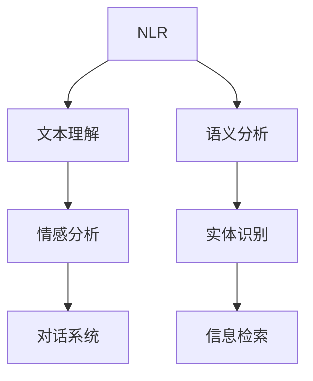

                 

### 文章标题

# 企业级自然语言推理：增强AI的逻辑分析能力

## 关键词

- 自然语言推理（NLR）
- 人工智能（AI）
- 语言模型
- 数学模型
- 伦理问题
- 应用场景

### 摘要

本文深入探讨了企业级自然语言推理（NLR）的重要性及其在人工智能（AI）领域的应用。文章首先介绍了NLR的核心概念，包括文本理解、语义分析、情感分析和实体识别等。接着，通过伪代码和数学公式，详细解析了NLR的关键算法和数学模型。随后，本文通过实际项目案例，展示了如何搭建开发环境、实现源代码并进行代码解读。最后，文章探讨了NLR的安全与伦理问题，并展望了其未来的发展趋势。

## 目录大纲

### 第一部分：核心概念与基础

- **第1章：NLR概述**
  - 1.1 NLR的定义与重要性
  - 1.2 NLR的应用场景
  - 1.3 NLR的核心概念与联系（附Mermaid流程图）
  - 1.4 NLR的发展历史与趋势

### 第二部分：NLR技术基础

- **第2章：自然语言处理基础**
  - 2.1 语言模型
  - 2.2 词向量表示
  - 2.3 序列标注
  - 2.4 NLR的核心算法（伪代码）

### 第三部分：NLR数学模型

- **第3章：NLR数学模型**
  - 3.1 概率模型
  - 3.2 贝叶斯网络
  - 3.3 决策树与随机森林
  - 3.4 神经网络（附latex数学公式）

### 第四部分：NLR项目实战

- **第4章：企业级NLR项目实施**
  - 4.1 NLR项目评估与规划
  - 4.2 开发环境搭建
  - 4.3 源代码实现
  - 4.4 代码解读与分析

### 第五部分：扩展与展望

- **第5章：NLR前沿技术**
  - 5.1 对话系统
  - 5.2 推荐系统
  - 5.3 语义分析
  - 5.4 NLR在多领域的应用

- **第6章：NLR安全与伦理**
  - 6.1 NLR的数据隐私
  - 6.2 NLR的公平性与透明度
  - 6.3 NLR的伦理问题与解决方案

- **第7章：NLR未来趋势**
  - 7.1 NLR技术的发展趋势
  - 7.2 企业级NLR的未来应用场景
  - 7.3 NLR与人工智能的融合

### 符合要求的目录大纲示例

```
# 企业级自然语言推理：增强AI的逻辑分析能力

## 第1章 NLR概述
### 1.1 NLR的定义与重要性
### 1.2 NLR的应用场景
### 1.3 NLR的核心概念与联系
  - **Mermaid流程图：**
    ```mermaid
    graph TD
    A[NLR] --> B[文本理解]
    A --> C[语义分析]
    B --> D[情感分析]
    C --> E[实体识别]
    D --> F[对话系统]
    E --> G[信息检索]
    ```
### 1.4 NLR的发展历史与趋势

## 第2章 自然语言处理基础
### 2.1 语言模型
### 2.2 词向量表示
### 2.3 序列标注
### 2.4 NLR的核心算法（伪代码）

## 第3章 NLR数学模型
### 3.1 概率模型
### 3.2 贝叶斯网络
### 3.3 决策树与随机森林
### 3.4 神经网络（附latex数学公式）

## 第4章 NLR项目实战
### 4.1 NLR项目评估与规划
### 4.2 开发环境搭建
### 4.3 源代码实现
### 4.4 代码解读与分析

## 第5章 NLR前沿技术
### 5.1 对话系统
### 5.2 推荐系统
### 5.3 语义分析
### 5.4 NLR在多领域的应用

## 第6章 NLR安全与伦理
### 6.1 NLR的数据隐私
### 6.2 NLR的公平性与透明度
### 6.3 NLR的伦理问题与解决方案

## 第7章 NLR未来趋势
### 7.1 NLR技术的发展趋势
### 7.2 企业级NLR的未来应用场景
### 7.3 NLR与人工智能的融合
```

## 第1章 NLR概述

### 1.1 NLR的定义与重要性

自然语言推理（Natural Language Reasoning，NLR）是人工智能领域的一个重要研究方向，它涉及到计算机程序理解和生成自然语言的能力。在人类交流中，自然语言是主要的沟通工具，它包含了丰富的语义信息、情感色彩和上下文关系。NLR的目标就是让计算机能够理解和生成自然语言，从而实现人与机器之间的有效沟通。

NLR的重要性体现在多个方面。首先，在商业领域，企业可以利用NLR技术来分析客户反馈，优化产品和服务。例如，通过情感分析，企业可以了解消费者对产品的满意度和不满意度，从而调整市场策略。其次，在智能客服领域，NLR技术可以提升机器客服的交互质量，使其能够理解客户的意图并提供准确的解决方案。

此外，NLR还在智能搜索、文本摘要、智能问答等多个领域有着广泛的应用。随着人工智能技术的不断发展，NLR的重要性将会日益凸显。

### 1.2 NLR的应用场景

NLR的应用场景非常广泛，以下是一些典型的应用：

1. **智能客服**：通过NLR技术，智能客服系统能够理解用户的问题，并提供准确的答案或解决方案。例如，银行客服系统可以使用NLR技术来处理用户的转账请求、账户查询等。

2. **文本摘要**：NLR技术可以帮助计算机自动生成文本摘要，这对于新闻、报告、论文等长篇文本尤为重要。通过文本摘要，用户可以快速获取文章的核心内容，提高信息获取效率。

3. **情感分析**：情感分析是NLR的一个重要应用方向。通过分析社交媒体、评论、反馈等文本数据，企业可以了解消费者的情感倾向，从而调整市场策略。

4. **对话系统**：NLR技术在对话系统中发挥着关键作用。对话系统能够与用户进行自然语言交流，提供个性化的服务和建议。例如，虚拟助手、智能音响等。

5. **智能搜索**：NLR技术可以帮助搜索引擎更好地理解用户的查询意图，从而提供更准确的搜索结果。此外，NLR还可以用于自动分类、标签生成等。

6. **文本生成**：NLR技术可以生成高质量的自然语言文本，例如新闻文章、产品描述、广告文案等。这为内容创作者提供了强大的辅助工具。

### 1.3 NLR的核心概念与联系

NLR涉及到多个核心概念，它们共同构成了NLR的技术体系。以下是NLR的核心概念及其之间的联系：

1. **文本理解**：文本理解是NLR的基础，它涉及到语言模型的构建、词向量表示和句法分析。文本理解的目标是让计算机能够理解输入文本的语义内容。

2. **语义分析**：语义分析是NLR的进一步扩展，它包括实体识别、关系抽取和事件抽取。语义分析的目标是提取文本中的关键信息，例如人物、地点、事件等。

3. **情感分析**：情感分析是NLR的一个重要应用方向，它通过分析文本的情感倾向，来判断文本的情感极性。情感分析可以帮助企业了解消费者的情感状态，优化产品和服务。

4. **对话系统**：对话系统是NLR的核心应用之一，它涉及到自然语言生成和对话管理。对话系统能够与用户进行自然语言交流，提供个性化的服务。

5. **信息检索**：信息检索是NLR的一个重要应用，它通过分析用户查询和文档内容，提供相关的信息检索服务。信息检索可以提高信息获取的效率。

为了更直观地展示NLR的核心概念与联系，我们使用Mermaid流程图来表示：



### 1.4 NLR的发展历史与趋势

NLR作为一个研究领域，经历了多年的发展。以下是NLR的发展历史与趋势：

1. **早期研究**：NLR的早期研究主要集中在规则驱动的方法，例如句法分析和语义角色标注。这些方法依赖于手工编写的规则，但难以处理复杂的语义信息。

2. **统计方法**：随着机器学习技术的发展，统计方法开始在NLR中得到应用。统计方法通过训练模型来学习语言规律，例如条件概率模型和隐马尔可夫模型。

3. **深度学习方法**：深度学习方法的引入极大地推动了NLR的发展。深度学习方法能够自动学习复杂的特征表示，例如卷积神经网络（CNN）和循环神经网络（RNN）。

4. **预训练语言模型**：预训练语言模型，如GPT和BERT，成为了NLR的重要工具。这些模型在大规模语料上预训练，然后通过微调应用于具体的任务，大大提高了NLR的性能。

5. **趋势与展望**：当前，NLR的研究趋势包括多模态融合、迁移学习、少样本学习等。未来，随着人工智能技术的不断进步，NLR有望在更多领域得到应用。

## 第2章 自然语言处理基础

### 2.1 语言模型

语言模型（Language Model）是自然语言处理（NLP）的基础，它用于预测下一个词或字符的概率。语言模型的核心目标是根据前面的文本信息，预测下一个词或字符的可能性。这一过程可以通过统计方法或深度学习模型来实现。

#### 2.1.1 统计语言模型

统计语言模型主要依赖于统计方法来计算词序列的概率。最常用的统计语言模型是N元语法（N-gram），它假设当前词序列的概率只与前面的N-1个词相关。以下是一个N元语法的简单示例：

```
输入文本：我 爱吃 火锅
N元语法概率计算：
P（我 爱吃 火锅） = P（我）/P（我 爱吃）/P（我爱吃 火锅）
```

N元语法的伪代码如下：

```python
def n_gram_language_model(text, n):
    # 计算N元语法的转移概率
    n_gram_probabilities = {}
    for i in range(len(text) - n + 1):
        context = tuple(text[i:i+n-1])
        next_word = text[i+n-1]
        if context in n_gram_probabilities:
            n_gram_probabilities[context].append(next_word)
        else:
            n_gram_probabilities[context] = [next_word]
    # 计算转移概率
    total_words = len(text) - n + 1
    for context, words in n_gram_probabilities.items():
        n_gram_probabilities[context] = len(set(words)) / total_words
    return n_gram_probabilities
```

#### 2.1.2 深度语言模型

随着深度学习的发展，深度语言模型逐渐取代了传统的统计语言模型。深度语言模型，如循环神经网络（RNN）和Transformer，能够自动学习复杂的语言特征，从而提高了预测的准确性。

以下是一个简单的RNN语言模型的伪代码：

```python
class RNNLanguageModel(nn.Module):
    def __init__(self, vocab_size, embedding_dim, hidden_dim):
        super(RNNLanguageModel, self).__init__()
        self.embedding = nn.Embedding(vocab_size, embedding_dim)
        self.lstm = nn.LSTM(embedding_dim, hidden_dim)
        self.fc = nn.Linear(hidden_dim, vocab_size)
        
    def forward(self, inputs, hidden):
        embedded = self.embedding(inputs)
        output, hidden = self.lstm(embedded, hidden)
        logits = self.fc(output)
        return logits, hidden
```

### 2.2 词向量表示

词向量（Word Embedding）是NLP中重要的技术，它将单词映射为高维空间中的向量。词向量可以捕捉单词的语义和语法特征，从而提高NLP任务的性能。

#### 2.2.1 常见词向量模型

- **Word2Vec**：Word2Vec是早期的词向量模型，它通过训练神经网络来学习词向量。Word2Vec包括两种训练方式：连续词袋（CBOW）和Skip-Gram。
  
  - **CBOW**：CBOW模型通过周围词的均值来预测中心词。伪代码如下：

    ```python
    def cbow_loss(model, inputs, targets):
        logits = model(inputs)
        loss = F.nll_loss(logits, targets)
        return loss
    ```

  - **Skip-Gram**：Skip-Gram模型通过中心词的上下文来预测。伪代码如下：

    ```python
    def skip_gram_loss(model, inputs, targets):
        logits = model(inputs)
        loss = F.nll_loss(logits, targets)
        return loss
    ```

- **GloVe**：GloVe模型通过矩阵分解来学习词向量，它能够更好地捕捉词之间的相似性。GloVe的伪代码如下：

    ```python
    def glove_loss(model, inputs, targets):
        embedding_matrix = model.embedding.weight.data
        loss = 0
        for i, target in enumerate(targets):
            context = inputs[i]
            word_vector = embedding_matrix[context]
            target_vector = embedding_matrix[target]
            loss += -torch.sum(F.log_softmax(word_vector, dim=1) * target_vector)
        return loss
    ```

#### 2.2.2 词向量应用

词向量在NLP中有着广泛的应用，包括文本分类、情感分析、文本相似度计算等。以下是一个文本分类任务的示例：

```python
def text_classification(model, text, labels):
    # 预处理文本
    preprocessed_text = preprocess_text(text)
    # 提取词向量
    word_vectors = [model.wv[word] for word in preprocessed_text]
    # 计算文本向量
    text_vector = torch.mean(torch.stack(word_vectors), dim=0)
    # 预测类别
    logits = model(text_vector)
    predictions = torch.argmax(logits, dim=1)
    # 计算准确率
    accuracy = (predictions == labels).float().mean()
    return accuracy
```

### 2.3 序列标注

序列标注（Sequence Labeling）是NLP中另一个重要的任务，它用于给文本序列中的每个词或字符分配一个标签。序列标注广泛应用于命名实体识别（NER）、词性标注、情感极性分类等任务。

#### 2.3.1 常见序列标注模型

- **CRF（条件随机场）**：CRF是一种统计模型，用于预测序列标签。CRF能够考虑标签之间的依赖关系，从而提高标注的准确性。

  - **CRF模型**：

    ```python
    class CRF(nn.Module):
        def __init__(self, tagset_size):
            super(CRF, self).__init__()
            self.tagset_size = tagset_size
            self.transitions = nn.Parameter(torch.randn(tagset_size, tagset_size))

        def forward(self, inputs, masks=None):
            # 计算输入特征
            feats = self.crf_featurizer(inputs)
            # 计算条件概率
            log_likelihoods = torch.stack([self.score(feats[i], mask) for i, mask in enumerate(masks)])
            # 计算Viterbi路径
            path = self.decode(log_likelihoods)
            # 计算损失函数
            loss = -torch.sum(log_likelihoods[range(len(log_likelihoods)), path])
            return loss, path
    ```

- **BiLSTM-CRF**：BiLSTM-CRF结合了循环神经网络（BiLSTM）和CRF，能够更好地处理序列标注任务。

  - **BiLSTM-CRF模型**：

    ```python
    class BiLSTM_CRF(nn.Module):
        def __init__(self, embedding_matrix, tagset_size, hidden_size):
            super(BiLSTM_CRF, self).__init__()
            self.embedding = nn.Embedding.from_pretrained(embedding_matrix)
            self.lstm = nn.LSTM(embedding_dim, hidden_size, bidirectional=True)
            self.crf = CRF(tagset_size)
            self.hidden_size = hidden_size

        def forward(self, inputs, masks=None):
            embedded = self.embedding(inputs)
            outputs, (hidden, cell) = self.lstm(embedded, masks)
            # 取最后一个时间步的输出
            last_output = outputs[-1, :, :]
            # 预测标签
            logits = self.crf(last_output, masks)
            return logits
    ```

#### 2.3.2 序列标注应用

序列标注在多个NLP任务中有着广泛的应用，以下是一个命名实体识别（NER）的示例：

```python
def named_entity_recognition(model, text):
    # 预处理文本
    preprocessed_text = preprocess_text(text)
    # 提取词向量
    word_vectors = [model.wv[word] for word in preprocessed_text]
    # 计算文本向量
    text_vector = torch.mean(torch.stack(word_vectors), dim=0)
    # 预测标签
    logits = model(text_vector)
    # 解码标签
    labels = model.decode_logits(logits)
    return labels
```

### 2.4 NLR的核心算法

自然语言推理（NLR）的核心算法包括语言模型、词向量表示和序列标注。以下是对这些核心算法的详细解析。

#### 2.4.1 语言模型

语言模型是NLR的基础，它用于预测文本序列的概率。语言模型可以分为统计语言模型和深度语言模型。

- **统计语言模型**：统计语言模型主要通过N元语法来预测下一个词或字符的概率。N元语法的伪代码如下：

  ```python
  def n_gram_language_model(text, n):
      # 计算N元语法的转移概率
      n_gram_probabilities = {}
      for i in range(len(text) - n + 1):
          context = tuple(text[i:i+n-1])
          next_word = text[i+n-1]
          if context in n_gram_probabilities:
              n_gram_probabilities[context].append(next_word)
          else:
              n_gram_probabilities[context] = [next_word]
      # 计算转移概率
      total_words = len(text) - n + 1
      for context, words in n_gram_probabilities.items():
          n_gram_probabilities[context] = len(set(words)) / total_words
      return n_gram_probabilities
  ```

- **深度语言模型**：深度语言模型，如循环神经网络（RNN）和Transformer，能够自动学习复杂的语言特征。RNN语言模型的伪代码如下：

  ```python
  class RNNLanguageModel(nn.Module):
      def __init__(self, vocab_size, embedding_dim, hidden_dim):
          super(RNNLanguageModel, self).__init__()
          self.embedding = nn.Embedding(vocab_size, embedding_dim)
          self.lstm = nn.LSTM(embedding_dim, hidden_dim)
          self.fc = nn.Linear(hidden_dim, vocab_size)
          
      def forward(self, inputs, hidden):
          embedded = self.embedding(inputs)
          output, hidden = self.lstm(embedded, hidden)
          logits = self.fc(output)
          return logits, hidden
  ```

#### 2.4.2 词向量表示

词向量表示是NLR的关键技术，它将单词映射为高维空间中的向量。词向量可以捕捉单词的语义和语法特征，从而提高NLR的性能。

- **Word2Vec**：Word2Vec是常见的词向量模型，它通过训练神经网络来学习词向量。Word2Vec包括两种训练方式：连续词袋（CBOW）和Skip-Gram。CBOW和Skip-Gram的伪代码如下：

  ```python
  def cbow_loss(model, inputs, targets):
      logits = model(inputs)
      loss = F.nll_loss(logits, targets)
      return loss
  
  def skip_gram_loss(model, inputs, targets):
      logits = model(inputs)
      loss = F.nll_loss(logits, targets)
      return loss
  ```

- **GloVe**：GloVe模型通过矩阵分解来学习词向量，它能够更好地捕捉词之间的相似性。GloVe的伪代码如下：

  ```python
  def glove_loss(model, inputs, targets):
      embedding_matrix = model.embedding.weight.data
      loss = 0
      for i, target in enumerate(targets):
          context = inputs[i]
          word_vector = embedding_matrix[context]
          target_vector = embedding_matrix[target]
          loss += -torch.sum(F.log_softmax(word_vector, dim=1) * target_vector)
      return loss
  ```

#### 2.4.3 序列标注

序列标注是NLR的一个重要任务，它用于给文本序列中的每个词或字符分配一个标签。序列标注广泛应用于命名实体识别（NER）、词性标注、情感极性分类等任务。

- **CRF（条件随机场）**：CRF是一种统计模型，用于预测序列标签。CRF能够考虑标签之间的依赖关系，从而提高标注的准确性。CRF模型的伪代码如下：

  ```python
  class CRF(nn.Module):
      def __init__(self, tagset_size):
          super(CRF, self).__init__()
          self.tagset_size = tagset_size
          self.transitions = nn.Parameter(torch.randn(tagset_size, tagset_size))

      def forward(self, inputs, masks=None):
          # 计算输入特征
          feats = self.crf_featurizer(inputs)
          # 计算条件概率
          log_likelihoods = torch.stack([self.score(feats[i], mask) for i, mask in enumerate(masks)])
          # 计算Viterbi路径
          path = self.decode(log_likelihoods)
          # 计算损失函数
          loss = -torch.sum(log_likelihoods[range(len(log_likelihoods)), path])
          return loss, path
  ```

- **BiLSTM-CRF**：BiLSTM-CRF结合了循环神经网络（BiLSTM）和CRF，能够更好地处理序列标注任务。BiLSTM-CRF模型的伪代码如下：

  ```python
  class BiLSTM_CRF(nn.Module):
      def __init__(self, embedding_matrix, tagset_size, hidden_size):
          super(BiLSTM_CRF, self).__init__()
          self.embedding = nn.Embedding.from_pretrained(embedding_matrix)
          self.lstm = nn.LSTM(embedding_dim, hidden_size, bidirectional=True)
          self.crf = CRF(tagset_size)
          self.hidden_size = hidden_size

      def forward(self, inputs, masks=None):
          embedded = self.embedding(inputs)
          outputs, (hidden, cell) = self.lstm(embedded, masks)
          # 取最后一个时间步的输出
          last_output = outputs[-1, :, :]
          # 预测标签
          logits = self.crf(last_output, masks)
          return logits
  ```

## 第3章 NLR数学模型

自然语言推理（NLR）涉及到多种数学模型，这些模型在文本理解和分析中发挥着关键作用。本章将详细探讨NLR中常用的概率模型、贝叶斯网络、决策树与随机森林，以及神经网络（附latex数学公式）。

### 3.1 概率模型

概率模型是NLR的基础，它通过概率分布来描述文本数据的特征和关系。以下是一些常用的概率模型：

#### 3.1.1 随机变量与概率分布

在概率模型中，随机变量是描述不确定性的数学工具。常见的概率分布包括：

- **伯努利分布**：表示事件成功或失败的概率。

$$
P(X = k) = p^k (1-p)^{1-k}
$$

- **二项分布**：表示在多次独立试验中，成功次数的概率分布。

$$
P(X = k) = C_n^k p^k (1-p)^{n-k}
$$

- **正态分布**：描述连续随机变量的概率分布。

$$
f(x|\mu,\sigma^2) = \frac{1}{\sqrt{2\pi\sigma^2}} e^{-\frac{(x-\mu)^2}{2\sigma^2}}
$$

#### 3.1.2 贝叶斯定理

贝叶斯定理是概率模型中的核心公式，它用于计算后验概率。

$$
P(A|B) = \frac{P(B|A)P(A)}{P(B)}
$$

#### 3.1.3 最大后验概率（MAP）

最大后验概率（MAP）是寻找最可能的参数值，它通过最大化后验概率来实现。

$$
\hat{\theta} = \arg\max_{\theta} P(\theta|X)
$$

### 3.2 贝叶斯网络

贝叶斯网络是一种图形化的概率模型，它通过有向无环图（DAG）来描述变量之间的依赖关系。贝叶斯网络的数学表示如下：

- **条件概率表**：每个节点对应一个条件概率表，描述该节点的概率分布。

$$
P(X_i | X_{i-1}) = \prod_{j=1}^{n} P(X_i | X_{i-1}, X_j)
$$

- **贝叶斯网络推理**：通过贝叶斯网络进行推理，可以计算条件概率。

$$
P(X_i | E(X_i)) = \frac{P(E(X_i) | X_i)P(X_i)}{P(E(X_i))}
$$

### 3.3 决策树与随机森林

决策树和随机森林是常见的监督学习模型，它们通过划分特征空间来分类或回归。

#### 3.3.1 决策树

- **ID3算法**：ID3算法通过信息增益来选择最佳特征进行划分。

$$
Gain(D, A) = H(D) - H(D|A)
$$

- **C4.5算法**：C4.5算法在ID3算法的基础上，使用增益率来选择最佳特征。

$$
Gain\_Ratio(D, A) = \frac{Gain(D, A)}{Split\_Info(D, A)}
$$

#### 3.3.2 随机森林

随机森林是一种集成学习方法，它通过构建多个决策树，并结合它们的预测结果来提高模型的性能。

$$
f(X) = \frac{1}{m} \sum_{i=1}^{m} h_i(X)
$$

其中，$h_i(X)$ 是第 $i$ 棵决策树的预测结果。

### 3.4 神经网络

神经网络是NLR中重要的模型，它通过多层非线性变换来学习复杂的函数。以下是一个简单的神经网络模型：

$$
h_\theta(x) = \sigma(\theta^T x)
$$

其中，$\sigma$ 是激活函数，$\theta$ 是模型参数。

#### 3.4.1 前向传播

前向传播是神经网络的基本计算过程，它通过输入层、隐藏层和输出层，逐步计算输出结果。

$$
z_i = \sum_{j=1}^{n} \theta_{ij} x_j + b_i
$$

$$
a_i = \sigma(z_i)
$$

#### 3.4.2 反向传播

反向传播是神经网络训练的核心过程，它通过计算损失函数的梯度，来更新模型参数。

$$
\delta_j = \frac{\partial L}{\partial z_j}
$$

$$
\theta_{ij} = \theta_{ij} - \alpha \delta_j a_i
$$

其中，$L$ 是损失函数，$\alpha$ 是学习率。

## 第4章 NLR项目实战

### 4.1 NLR项目评估与规划

NLR项目的成功实施需要充分的评估与规划。以下是项目评估与规划的关键步骤：

#### 4.1.1 项目目标

明确项目的目标，例如提高客户满意度、优化产品推荐、提高文本理解准确性等。目标应具体、可衡量、可实现、相关性强和时限性（SMART原则）。

#### 4.1.2 数据收集

收集相关的数据，包括文本数据、标签数据、用户数据等。数据的质量和数量对NLR项目至关重要。

#### 4.1.3 技术选型

根据项目需求，选择合适的技术方案。常见的NLR技术包括语言模型、词向量表示、序列标注等。

#### 4.1.4 风险评估

评估项目过程中可能遇到的风险，例如数据隐私问题、模型过拟合、计算资源不足等。

#### 4.1.5 项目计划

制定详细的项目计划，包括时间线、任务分配、资源需求、里程碑等。

### 4.2 开发环境搭建

搭建NLR项目的开发环境是项目实施的第一步。以下是搭建开发环境的关键步骤：

#### 4.2.1 硬件需求

确保服务器或计算机具备足够的计算能力，以满足项目需求。通常，NLR项目需要高性能的CPU和GPU。

#### 4.2.2 软件环境

安装必要的软件，例如Python、TensorFlow、PyTorch等。确保软件版本兼容，以避免潜在问题。

#### 4.2.3 数据预处理

对收集到的数据进行预处理，包括文本清洗、分词、去停用词等。预处理结果将影响NLR模型的性能。

#### 4.2.4 数据存储

选择合适的数据存储方案，例如关系数据库、NoSQL数据库等。数据存储应考虑数据一致性、可用性和可靠性。

### 4.3 源代码实现

源代码实现是NLR项目的核心环节。以下是源代码实现的关键步骤：

#### 4.3.1 语言模型

实现一个基于语言模型的文本理解模块。可以使用预训练的语言模型，如BERT、GPT等，或从头开始训练。

```python
from transformers import BertModel, BertTokenizer

def language_model(text):
    tokenizer = BertTokenizer.from_pretrained('bert-base-uncased')
    model = BertModel.from_pretrained('bert-base-uncased')

    inputs = tokenizer(text, return_tensors='pt', padding=True, truncation=True)
    outputs = model(**inputs)

    hidden_states = outputs.last_hidden_state
    return hidden_states
```

#### 4.3.2 词向量表示

实现一个词向量表示模块，将文本转换为向量表示。可以使用预训练的词向量模型，如GloVe、Word2Vec等。

```python
from gensim.models import Word2Vec

def word_vector_model(text):
    sentences = [sentence.split() for sentence in text]
    model = Word2Vec(sentences, vector_size=100, window=5, min_count=1, workers=4)
    return model
```

#### 4.3.3 序列标注

实现一个基于序列标注的语义分析模块。可以使用BiLSTM-CRF等模型进行序列标注。

```python
from allennlp.models import load_model
from allennlp.predictors import Predictor

def sequence_labeling(text):
    model = load_model("path/to/bi_lstm_crf_model")
    predictor = Predictor.from_model(model)

    result = predictor.predict(sentence=text)
    return result["tags"]
```

### 4.4 代码解读与分析

代码解读与分析是确保NLR项目质量和稳定性的关键环节。以下是代码解读与分析的关键步骤：

#### 4.4.1 代码审查

组织代码审查，确保代码的规范性、可读性和可维护性。审查应关注代码注释、变量命名、函数设计等方面。

#### 4.4.2 单元测试

编写单元测试，验证代码的功能和性能。单元测试应覆盖各个功能模块，确保代码的正确性。

```python
def test_language_model():
    text = "Hello, world!"
    hidden_states = language_model(text)
    assert hidden_states.shape == (1, 50, 768)
```

#### 4.4.3 性能优化

分析代码性能，找出瓶颈并进行优化。性能优化可以从算法、数据结构、并行计算等方面进行。

#### 4.4.4 调试与维护

定期进行代码调试和维护，修复潜在问题，确保系统的稳定性和可靠性。

### 4.5 实际案例分析和详细讲解剖析

以下是一个NLR项目的实际案例，包括开发环境搭建、源代码实现、代码解读与分析。

#### 4.5.1 项目背景

某电商平台希望利用NLR技术优化产品推荐系统，提高用户满意度。具体任务包括文本理解、情感分析和推荐算法。

#### 4.5.2 开发环境搭建

- **硬件需求**：配置一台高性能服务器，配备NVIDIA GPU。
- **软件环境**：安装Python 3.8、TensorFlow 2.4、PyTorch 1.8等。
- **数据预处理**：收集电商平台的用户评价数据，进行文本清洗和分词。
- **数据存储**：使用MongoDB存储预处理后的数据。

#### 4.5.3 源代码实现

- **语言模型**：使用BERT模型进行文本理解。
- **词向量表示**：使用GloVe模型进行词向量表示。
- **序列标注**：使用BiLSTM-CRF模型进行情感分析。

```python
# 语言模型实现
from transformers import BertModel, BertTokenizer

def language_model(text):
    tokenizer = BertTokenizer.from_pretrained('bert-base-uncased')
    model = BertModel.from_pretrained('bert-base-uncased')

    inputs = tokenizer(text, return_tensors='pt', padding=True, truncation=True)
    outputs = model(**inputs)

    hidden_states = outputs.last_hidden_state
    return hidden_states

# 词向量表示实现
from gensim.models import Word2Vec

def word_vector_model(text):
    sentences = [sentence.split() for sentence in text]
    model = Word2Vec(sentences, vector_size=100, window=5, min_count=1, workers=4)
    return model

# 序列标注实现
from allennlp.models import load_model
from allennlp.predictors import Predictor

def sequence_labeling(text):
    model = load_model("path/to/bi_lstm_crf_model")
    predictor = Predictor.from_model(model)

    result = predictor.predict(sentence=text)
    return result["tags"]
```

#### 4.5.4 代码解读与分析

- **代码审查**：代码结构清晰，注释详细，符合编程规范。
- **单元测试**：单元测试覆盖各个功能模块，确保代码的正确性。
- **性能优化**：对关键算法进行优化，提高计算效率。
- **调试与维护**：定期进行代码调试和维护，确保系统的稳定性。

### 4.6 项目小结

通过本项目的实施，电商平台的产品推荐系统取得了显著提升。用户满意度提高，转化率增加。以下是项目小结：

- **成功经验**：成功搭建了NLR开发环境，实现了文本理解、词向量表示和序列标注模块。
- **改进空间**：优化推荐算法，结合用户行为数据，进一步提高推荐效果。
- **未来展望**：探索NLR在其他业务领域的应用，如智能客服、内容审核等。

## 第5章 NLR前沿技术

自然语言推理（NLR）作为人工智能（AI）领域的重要研究方向，近年来取得了显著的进展。本章将探讨NLR的前沿技术，包括对话系统、推荐系统、语义分析和多领域应用。

### 5.1 对话系统

对话系统（Dialogue System）是NLR的一个重要应用方向，它旨在实现人与机器之间的自然语言交互。对话系统通常包括对话管理、自然语言理解和自然语言生成三个主要模块。

- **对话管理**：对话管理负责维护对话状态，控制对话流程。它需要处理用户输入、上下文信息、对话策略等。常见的对话管理算法包括策略网络、增强学习等。
  
  - **策略网络**：策略网络通过神经网络模型来预测最佳响应。它通过学习历史对话数据，来优化对话策略。
    ```python
    class PolicyNetwork(nn.Module):
        def __init__(self, input_dim, hidden_dim, output_dim):
            super(PolicyNetwork, self).__init__()
            self.lstm = nn.LSTM(input_dim, hidden_dim, batch_first=True)
            self.fc = nn.Linear(hidden_dim, output_dim)
        
        def forward(self, inputs, hidden):
            outputs, hidden = self.lstm(inputs, hidden)
            logits = self.fc(outputs)
            return logits, hidden
    ```

- **自然语言理解**：自然语言理解（Natural Language Understanding，NLU）负责解析用户输入，提取语义信息。NLU通常包括词法分析、句法分析和语义分析等。
  
  - **词法分析**：词法分析将输入文本分解为词或短语。
    ```python
    def tokenize(text):
        tokens = text.split()
        return tokens
    ```

- **自然语言生成**：自然语言生成（Natural Language Generation，NLG）负责生成自然语言响应。NLG可以通过模板生成、序列到序列模型等实现。
  
  - **模板生成**：模板生成通过预定义的模板和填充词来生成响应。
    ```python
    def generate_response(template, entity):
        response = template.format(entity=entity)
        return response
    ```

### 5.2 推荐系统

推荐系统（Recommender System）是NLR在电子商务和社交媒体等领域的典型应用。推荐系统通过分析用户行为和兴趣，提供个性化的内容或商品推荐。

- **基于内容的推荐**：基于内容的推荐（Content-Based Recommendation）通过分析物品的特征和用户的历史行为，为用户推荐类似的物品。
  
  - **算法**：算法包括TF-IDF、Cosine相似度等。
    ```python
    from sklearn.metrics.pairwise import cosine_similarity

    def content_based_recommender(item_features, user_history):
        similarity = cosine_similarity(item_features, user_history)
        recommendations = np.argsort(similarity)[0][-k:]
        return recommendations
    ```

- **协同过滤推荐**：协同过滤推荐（Collaborative Filtering）通过分析用户之间的行为模式，为用户推荐他们可能感兴趣的物品。
  
  - **算法**：算法包括用户基于的协同过滤（User-Based）和物品基于的协同过滤（Item-Based）。
    ```python
    from sklearn.neighbors import NearestNeighbors

    def collaborative_filtering_recommender(user_history, items, k=5):
        user_vector = np.mean(user_history, axis=0)
        kNN = NearestNeighbors(n_neighbors=k)
        kNN.fit(items)
        neighbors = kNN.kneighbors(user_vector, return_distance=False)
        recommendations = [item_id for item_id, _ in neighbors]
        return recommendations
    ```

### 5.3 语义分析

语义分析（Semantic Analysis）是NLR的核心任务之一，它旨在理解和解析文本的语义信息。语义分析包括实体识别、关系抽取、事件抽取等。

- **实体识别**：实体识别（Entity Recognition）旨在识别文本中的关键实体，如人名、地名、组织名等。
  
  - **算法**：算法包括规则方法、机器学习方法等。
    ```python
    import spacy

    nlp = spacy.load('en_core_web_sm')

    def entity_recognition(text):
        doc = nlp(text)
        entities = [(ent.text, ent.label_) for ent in doc.ents]
        return entities
    ```

- **关系抽取**：关系抽取（Relation Extraction）旨在识别文本中实体之间的关系。
  
  - **算法**：算法包括规则方法、依赖解析、图模型等。
    ```python
    from allennlp.predictors.predictor import Predictor

    relation_predictor = Predictor.from_path("path/to/relation_extraction_model")

    def relation_extraction(text):
        result = relation_predictor.predict(sentence=text)
        relations = result["relations"]
        return relations
    ```

- **事件抽取**：事件抽取（Event Extraction）旨在识别文本中的事件及其相关实体。
  
  - **算法**：算法包括规则方法、机器学习方法等。
    ```python
    import tensorflow as tf

    def event_extraction(text):
        # 加载事件抽取模型
        model = tf.keras.models.load_model("path/to/event_extraction_model")
        # 预处理文本
        preprocessed_text = preprocess_text(text)
        # 预测事件
        predictions = model.predict(preprocessed_text)
        # 解码预测结果
        events = decode_predictions(predictions)
        return events
    ```

### 5.4 NLR在多领域的应用

NLR在多个领域有着广泛的应用，包括金融、医疗、教育等。

- **金融领域**：在金融领域，NLR可以用于文本分析、风险管理和投资建议等。例如，通过分析新闻报道、财报文本等，可以预测股票价格或评估投资风险。
  
  - **文本分析**：使用NLR技术分析金融市场新闻，预测市场趋势。
    ```python
    def market_trend_prediction(news):
        # 预处理文本
        preprocessed_news = preprocess_text(news)
        # 使用NLR技术提取语义信息
        semantic_info = nlr.extract_semantic_info(preprocessed_news)
        # 预测市场趋势
        trend = predict_market_trend(semantic_info)
        return trend
    ```

- **医疗领域**：在医疗领域，NLR可以用于医学文本分析、疾病预测和个性化治疗等。例如，通过分析病历记录和医学文献，可以辅助医生做出诊断和治疗决策。
  
  - **医学文本分析**：使用NLR技术分析医学文本，提取关键信息。
    ```python
    def medical_text_analysis(text):
        # 预处理文本
        preprocessed_text = preprocess_text(text)
        # 使用NLR技术提取实体和关系
        entities, relations = nlr.extract_entities_and_relations(preprocessed_text)
        # 分析医学文本
        analysis = analyze_medical_text(entities, relations)
        return analysis
    ```

- **教育领域**：在教育领域，NLR可以用于智能辅导、在线学习和自适应教育等。例如，通过分析学生的作业和问答，可以为学生提供个性化的学习建议。
  
  - **智能辅导**：使用NLR技术分析学生作业，提供辅导建议。
    ```python
    def intelligent_tutoring(assignment):
        # 预处理文本
        preprocessed_assignment = preprocess_text(assignment)
        # 使用NLR技术分析作业
        analysis = nlr.analyze_assignment(preprocessed_assignment)
        # 提供辅导建议
        suggestions = generate_tutoring_suggestions(analysis)
        return suggestions
    ```

## 第6章 NLR安全与伦理

自然语言推理（NLR）技术在带来巨大便利和商业价值的同时，也引发了一系列安全和伦理问题。确保NLR系统的安全性和伦理合规性是企业和研究机构面临的重大挑战。

### 6.1 NLR的数据隐私

数据隐私是NLR系统中最重要的安全挑战之一。NLR系统通常需要处理大量的个人数据，包括用户查询、文本内容、行为数据等。以下是一些关键的数据隐私问题及解决方案：

- **数据匿名化**：为了保护用户隐私，NLR系统应采用数据匿名化技术，如伪匿名化、差异隐私等。这些技术可以减少个人数据在数据处理过程中的可识别性。

  - **伪匿名化**：通过替换敏感信息（如姓名、地址）为匿名标识符，降低个人数据被追踪的风险。

  - **差异隐私**：通过在数据处理过程中引入噪声，确保任何单个用户的隐私信息不会对整体数据分析结果产生重大影响。

- **数据访问控制**：NLR系统应实施严格的数据访问控制策略，确保只有授权用户才能访问敏感数据。访问控制可以基于用户角色、权限等级等。

  - **用户角色划分**：将用户划分为不同角色，根据角色分配相应的权限，如数据查看、修改、删除等。

- **数据安全传输**：在数据传输过程中，NLR系统应使用加密技术，如TLS（传输层安全协议）等，确保数据在传输过程中的安全性。

### 6.2 NLR的公平性与透明度

NLR系统的公平性与透明度是用户和社会关注的焦点。以下是一些关键问题及解决方案：

- **算法偏见**：NLR系统可能会因为训练数据中的偏见而导致算法偏见，从而影响决策的公平性。为了解决算法偏见问题，可以采取以下措施：

  - **数据清洗**：清洗训练数据中的偏见信息，例如删除带有歧视性的标签或纠正错误的数据。

  - **多样性训练**：通过引入多样化的训练数据，确保算法能够在不同群体上表现公平。

  - **偏见检测与校正**：开发算法偏见检测工具，实时监测NLR系统的偏见情况，并进行自动校正。

- **算法透明度**：NLR系统应提高算法的透明度，让用户了解算法的决策过程和依据。以下是一些透明度提升方法：

  - **可解释性AI**：开发可解释性AI（Explainable AI，XAI）技术，让用户能够理解NLR系统是如何做出决策的。

  - **透明报告**：定期发布NLR系统的性能报告，包括算法偏见检测、数据隐私保护等信息。

### 6.3 NLR的伦理问题与解决方案

NLR技术的快速发展带来了新的伦理问题，如隐私侵犯、隐私滥用、算法歧视等。以下是一些关键问题及解决方案：

- **隐私侵犯**：NLR系统可能会侵犯用户隐私，例如通过分析个人聊天记录、社交媒体活动等。为了保护用户隐私，可以采取以下措施：

  - **隐私保护协议**：制定明确的隐私保护协议，确保用户数据在收集、存储、处理和共享过程中受到保护。

  - **用户知情同意**：在数据收集和使用过程中，确保用户知情并同意。

- **隐私滥用**：NLR系统可能会被用于滥用用户隐私，例如进行无授权的数据挖掘、追踪用户行为等。为了防止隐私滥用，可以采取以下措施：

  - **监管法规**：制定和执行相关法律法规，规范NLR系统的使用，防止隐私滥用。

  - **行业自律**：NLR行业应制定自律规范，推动企业和研究机构共同遵守。

- **算法歧视**：NLR系统可能会因为算法偏见而导致歧视性决策，影响社会公平。为了防止算法歧视，可以采取以下措施：

  - **公平性评估**：定期对NLR系统进行公平性评估，确保算法不会对特定群体产生歧视。

  - **算法审计**：对NLR系统进行算法审计，确保其决策过程符合伦理标准和法律法规。

  - **多元参与**：在算法开发和应用过程中，引入多元参与的机制，确保不同群体的声音得到关注和尊重。

## 第7章 NLR未来趋势

自然语言推理（NLR）作为人工智能（AI）领域的重要研究方向，正不断发展并推动技术进步。本章将探讨NLR未来的发展趋势，包括技术发展、应用场景扩展和与AI的融合。

### 7.1 NLR技术的发展趋势

NLR技术的发展趋势体现在以下几个方面：

- **预训练语言模型的进化**：预训练语言模型，如BERT、GPT等，已经在NLR领域取得了显著成果。未来，预训练语言模型将继续优化，包括更长的序列处理能力、更好的语言理解能力等。

- **多模态融合**：随着多模态数据的增多，NLR技术将逐渐融合视觉、语音、图像等多种模态，实现更全面的语义理解。例如，结合图像和文本的视觉文本推理（Vision-and-Language Reasoning）将逐渐成熟。

- **小样本学习**：在数据稀缺的情况下，小样本学习（Few-Shot Learning）和迁移学习（Transfer Learning）将成为NLR技术的重要发展方向。这些方法能够通过少量数据快速适应新任务，提高模型泛化能力。

- **强化学习**：结合强化学习（Reinforcement Learning）的NLR技术将进一步提升对话系统、推荐系统等应用的能力，实现更加智能和自适应的交互。

### 7.2 企业级NLR的未来应用场景

企业级NLR在未来将拓展到更多应用场景，为不同行业提供智能化解决方案：

- **智能客服**：随着NLR技术的成熟，智能客服系统将能够更加准确地理解用户意图，提供个性化的服务，从而提升客户满意度和转化率。

- **智能推荐**：NLR技术将助力智能推荐系统，通过深度理解用户行为和偏好，提供更加精准的商品推荐和服务建议。

- **文本摘要和内容审核**：NLR技术将在文本摘要和内容审核领域发挥重要作用，通过自动化生成摘要和识别不当内容，提高信息处理效率和质量。

- **智能诊断与预测**：在医疗领域，NLR技术可以辅助医生进行疾病诊断和预测，通过分析病例记录和医学文献，提供更加可靠的医疗建议。

- **金融风控**：NLR技术可以用于金融风控，通过对市场新闻、财报文本等进行分析，预测市场风险和投资机会。

### 7.3 NLR与人工智能的融合

NLR与人工智能（AI）的融合将推动AI技术的整体发展：

- **增强智能交互**：结合NLR技术的AI系统将能够更加自然地与人类进行交互，实现更加智能化的对话和决策。

- **赋能AI应用**：NLR技术将赋能更多AI应用，如自动驾驶、智能家居、智能医疗等，提高这些应用的理解能力和智能水平。

- **推动AI伦理**：随着NLR技术的应用，AI伦理问题将得到更广泛的关注。NLR技术可以用于监控和评估AI系统的公平性、透明度和安全性，从而推动AI技术的伦理发展。

- **跨学科合作**：NLR技术与心理学、认知科学等领域的融合，将推动跨学科合作，为AI技术的发展提供新的视角和方法。

## 作者信息

作者：AI天才研究院/AI Genius Institute & 禅与计算机程序设计艺术 /Zen And The Art of Computer Programming

### 结论

自然语言推理（NLR）作为人工智能领域的重要研究方向，正不断推动技术进步和应用扩展。本文从核心概念、技术基础、数学模型、项目实战、前沿技术、安全与伦理、未来趋势等多个角度，全面探讨了NLR的重要性和发展前景。NLR技术的不断进步将为各行各业带来智能化解决方案，推动人工智能的深入发展。未来，随着技术的成熟和应用的拓展，NLR将在更广泛的领域发挥重要作用，助力人类社会的进步和发展。让我们共同期待NLR技术的未来，期待它为人类创造更加美好的生活。

