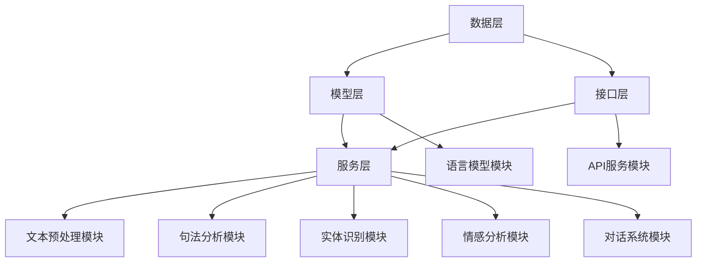

                 


### 文章标题：企业级语义理解引擎：提升人机交互质量

#### 关键词：
- 语义理解
- 企业级
- 人机交互
- 自然语言处理
- 情感分析
- 实体识别

#### 摘要：
本文将深入探讨企业级语义理解引擎的设计和实现，重点分析其如何提升人机交互的质量。文章首先介绍了语义理解技术的背景和意义，然后详细阐述了核心概念与联系，包括自然语言处理、语义角色标注、实体识别和情感分析。接着，文章深入讲解了语言模型、依存句法分析和情感分析的数学模型和算法原理，并使用伪代码和LaTeX公式进行详细解释。最后，通过实际案例和代码实现，展示了企业级语义理解引擎的开发过程和应用效果。

----------------------------------------------------------------

# 企业级语义理解引擎：提升人机交互质量

## 引言

### 1.1 书籍背景和意义

在当今信息时代，数据的爆炸性增长使得人机交互成为了一个重要的课题。企业级应用中，如何让计算机更好地理解人类的语言和意图，实现高效、准确的人机交互，成为了一个亟待解决的问题。语义理解技术正是为了解决这一问题而诞生和发展的。

语义理解（Semantic Understanding）是指计算机对人类语言进行深度理解，从而实现对语言内容、意图和上下文环境的高层次理解。企业级语义理解引擎则是在这一技术基础上，专门为大型企业或组织设计的高性能、高可扩展性的语义理解系统。

设计企业级语义理解引擎具有重要的意义：

1. **提升人机交互质量**：通过语义理解技术，计算机可以更好地理解用户的需求和意图，提供更加准确和个性化的服务，从而提升人机交互的整体体验。

2. **增强业务决策能力**：企业可以通过语义理解引擎对大量的非结构化数据进行自动分析和理解，从而提取出有价值的信息，为业务决策提供有力支持。

3. **优化运营效率**：语义理解引擎可以帮助企业自动化处理大量的语言任务，如客服机器人、智能助手等，从而降低人力成本，提高运营效率。

4. **创新业务模式**：语义理解技术可以为企业开辟新的业务领域，如智能客服、智能推荐、智能分析等，为企业带来新的增长点。

本文旨在通过深入分析和讲解企业级语义理解引擎的设计与实现，帮助读者了解其核心技术原理和数学模型，掌握开发企业级语义理解引擎的方法和技巧，从而提升人机交互的质量。

### 1.2 语义理解技术发展历程

语义理解技术的发展可以追溯到上世纪50年代，随着计算机技术的不断进步，自然语言处理（NLP）逐渐成为一个独立的研究领域。以下是一些重要的里程碑：

1. **早期研究**（1950s-1960s）：在这一阶段，研究者主要关注句法和语义的简单处理。1954年，IBM的研究团队成功地将英语翻译成俄语，这是计算机语义理解的第一个重大突破。

2. **知识表示和推理**（1970s-1980s）：这一阶段的研究重点转向知识表示和推理。研究者开始构建知识库，尝试通过逻辑推理来实现语义理解。

3. **基于规则的系统**（1990s）：20世纪90年代，基于规则的系统成为了语义理解的主流方法。这种方法通过手工编写规则，让计算机理解和处理自然语言。

4. **统计方法兴起**（2000s）：随着机器学习和数据挖掘技术的发展，统计方法开始在语义理解领域崭露头角。这一阶段的重要进展包括隐马尔可夫模型（HMM）、条件随机场（CRF）等算法。

5. **深度学习时代**（2010s-至今）：深度学习的出现彻底改变了语义理解的研究格局。卷积神经网络（CNN）、循环神经网络（RNN）、长短期记忆网络（LSTM）等深度学习算法在语义理解中取得了显著成果。

### 1.3 企业级语义理解的应用场景和挑战

企业级语义理解引擎在多个应用场景中具有重要价值，以下是一些典型的应用场景：

1. **智能客服**：通过语义理解技术，智能客服可以自动识别用户的问题，提供准确的回答，提高客户满意度。

2. **智能推荐**：语义理解可以帮助系统更好地理解用户的兴趣和行为，从而提供个性化的推荐服务。

3. **内容审核**：语义理解引擎可以自动识别和过滤违规内容，确保社区和平台的安全。

4. **智能办公助手**：通过语义理解，智能办公助手可以帮助用户高效地处理邮件、日程安排等事务。

5. **数据分析**：语义理解引擎可以自动分析和理解大量的非结构化数据，提取有价值的信息，为业务决策提供支持。

然而，设计企业级语义理解引擎也面临着一系列挑战：

1. **数据质量**：语义理解依赖于大量高质量的数据，然而实际获取的数据往往存在噪声、不一致性和缺失值。

2. **算法性能**：企业级应用要求语义理解引擎具备高性能和低延迟，这对算法的设计和实现提出了更高的要求。

3. **可扩展性**：企业级应用需要支持大规模的数据处理和模型部署，因此语义理解引擎需要具备良好的可扩展性。

4. **业务定制化**：不同企业有不同的业务需求，因此语义理解引擎需要具备一定的定制化能力，以满足不同企业的需求。

5. **安全性**：企业数据的安全性和隐私保护是设计企业级语义理解引擎时必须考虑的重要因素。

在接下来的章节中，我们将详细探讨语义理解的核心概念与联系，深入讲解其关键技术原理，并通过实际案例展示企业级语义理解引擎的开发和应用。

----------------------------------------------------------------

# 二、核心概念与联系

## 2.1 语义理解基本概念

### 2.1.1 自然语言处理（NLP）

自然语言处理（Natural Language Processing，NLP）是计算机科学和人工智能领域中的一个分支，旨在使计算机能够理解、生成和处理自然语言文本。NLP技术广泛应用于机器翻译、情感分析、命名实体识别、语音识别和信息检索等领域。

NLP的核心任务包括：

- **文本预处理**：清洗、分词、词性标注、句法分析等。
- **实体识别**：识别文本中的特定实体，如人名、地名、组织名等。
- **情感分析**：分析文本的情感倾向，如正面、负面或中性。
- **文本生成**：根据输入的文本或提示生成新的文本内容。
- **信息抽取**：从文本中提取出结构化的信息，如关系、事件等。

### 2.1.2 语义角色标注

语义角色标注（Semantic Role Labeling，SRL）是一种语义分析技术，旨在识别句子中动词的语义角色及其关系。语义角色通常包括动作的施事（Agent）、受事（Patient）、工具（Instrument）等。

SRL的任务是将句子中的每个词汇标注为相应的语义角色，以便计算机能够理解句子中的动作和对象。例如，句子“小明用锤子敲打钉子”可以被标注为：

- 小明（施事）
- 锤子（工具）
- 钉子（受事）

### 2.1.3 实体识别

实体识别（Named Entity Recognition，NER）是一种在文本中识别出具有特定意义的实体的技术。实体可以是人名、地名、组织名、时间、地点等。

实体识别的主要步骤包括：

- **预训练**：使用大规模语料库对模型进行预训练，使其具备初步的文本理解能力。
- **特征提取**：提取文本的特征，如词频、词性、句法结构等。
- **模型训练**：使用提取的特征对实体识别模型进行训练，使其能够识别文本中的实体。

### 2.1.4 情感分析

情感分析（Sentiment Analysis）是一种评估文本情感倾向的技术。情感分析可以用于评估消费者的情绪、评论的质量、社交媒体上的公众情绪等。

情感分析的主要步骤包括：

- **文本预处理**：去除停用词、标点符号，进行分词等。
- **特征提取**：提取文本的特征，如词频、情感词典、句法结构等。
- **情感分类**：使用分类算法对文本进行情感分类，常见的分类方法包括朴素贝叶斯、支持向量机、深度学习等。

## 2.2 语义理解与相关技术的关系

### 2.2.1 语义理解与知识图谱

知识图谱（Knowledge Graph）是一种用于表示实体及其相互关系的图形结构。知识图谱可以帮助计算机更好地理解和处理语义信息。

语义理解与知识图谱的关系如下：

- **知识表示**：知识图谱将实体和关系以图形结构的形式表示，为语义理解提供了一种直观的表示方法。
- **语义查询**：语义理解系统可以利用知识图谱进行语义查询，从而提高查询的准确性和效率。
- **推理能力**：知识图谱提供了基于实体和关系的推理能力，为语义理解系统提供了额外的上下文信息。

### 2.2.2 语义理解与对话系统

对话系统（Dialogue System）是一种与人类进行自然语言交互的系统，常见的应用包括智能客服、智能助手等。语义理解技术在对话系统中扮演着至关重要的角色。

语义理解与对话系统的关系如下：

- **意图识别**：语义理解可以帮助系统识别用户的意图，从而提供准确的回复。
- **上下文理解**：语义理解可以帮助系统理解对话的上下文，从而生成更自然的对话。
- **知识融合**：语义理解系统可以将从对话中获取的信息与知识图谱中的知识进行融合，提供更丰富的服务。

### 2.2.3 语义理解与信息检索

信息检索（Information Retrieval）是一种从大规模文本数据中检索相关信息的技术。语义理解技术在信息检索中发挥着重要作用。

语义理解与信息检索的关系如下：

- **关键词提取**：语义理解可以帮助系统提取文本的关键词，从而提高检索的准确性。
- **语义匹配**：语义理解可以帮助系统理解查询和文档的语义，从而进行更精准的匹配。
- **上下文理解**：语义理解可以帮助系统理解查询和文档的上下文，从而提供更相关的检索结果。

通过上述关系，我们可以看出语义理解技术在多个领域中的应用和重要性。在接下来的章节中，我们将深入探讨语义理解引擎的架构设计与实现。

----------------------------------------------------------------

## 三、架构设计与实现

### 3.1 语义理解引擎整体架构

企业级语义理解引擎的设计需要综合考虑性能、可扩展性和易用性等多方面因素。以下是语义理解引擎的整体架构设计：

#### 引擎分层设计

语义理解引擎通常采用分层设计，将整个系统划分为不同的层次，每个层次负责不同的功能。以下是常见的层次划分：

1. **数据层**：负责数据的采集、存储和管理。包括文本数据的清洗、去重、存储等操作。
2. **模型层**：负责模型的训练、加载和应用。包括各种自然语言处理模型的训练和应用，如语言模型、依存句法分析模型、实体识别模型和情感分析模型。
3. **接口层**：负责对外提供API接口，便于开发者调用。接口层通常包括RESTful API、GraphQL API等。
4. **服务层**：负责处理具体的业务逻辑，如意图识别、上下文管理、对话生成等。服务层通常采用微服务架构，以提高系统的可扩展性和可靠性。

#### 功能模块划分

在功能模块划分方面，语义理解引擎通常包括以下模块：

1. **文本预处理模块**：负责对输入文本进行清洗、分词、词性标注等预处理操作。
2. **语言模型模块**：负责生成语言模型，用于文本生成、文本分类等任务。
3. **句法分析模块**：负责进行句法分析，如依存句法分析、句法树构建等。
4. **实体识别模块**：负责识别文本中的实体，如人名、地名、组织名等。
5. **情感分析模块**：负责分析文本的情感倾向，如正面、负面或中性。
6. **对话系统模块**：负责处理对话交互，包括意图识别、上下文管理、对话生成等。
7. **API服务模块**：负责对外提供API接口，便于开发者集成和使用。

#### 系统架构图

以下是语义理解引擎的系统架构图：



### 3.2 关键技术原理讲解

#### 3.2.1 语言模型

语言模型（Language Model）是一种用于描述自然语言统计特性的数学模型。它可以帮助计算机预测下一个单词或字符的概率，从而用于文本生成、语音识别和机器翻译等任务。

##### 语言模型的基本概念

语言模型的核心概念包括：

- **词汇表**：语言模型中包含的单词或字符列表。
- **概率分布**：语言模型为每个词汇或字符分配一个概率值，表示该词汇或字符出现的可能性。

##### 语言模型的工作原理

语言模型的工作原理基于统计方法，通过分析大量文本数据，统计出每个词汇或字符出现的频率，并根据这些频率计算出概率分布。

常见的语言模型算法包括：

- **n-gram模型**：基于前n个单词或字符的联合概率分布，如二元模型（bigram）和三元模型（trigram）。
- **神经网络模型**：使用深度神经网络来建模语言，如循环神经网络（RNN）和Transformer模型。

##### 语言模型常见算法

以下是常见的语言模型算法：

1. **n-gram模型**

   n-gram模型是一种基于前n个单词或字符的联合概率分布的语言模型。其基本公式为：

   $$ P(w_{n+1} | w_1, w_2, ..., w_n) = \frac{C(w_1, w_2, ..., w_n, w_{n+1})}{C(w_1, w_2, ..., w_n)} $$

   其中，$C(w_1, w_2, ..., w_n, w_{n+1})$表示前n+1个单词或字符的联合频率，$C(w_1, w_2, ..., w_n)$表示前n个单词或字符的联合频率。

2. **神经网络模型**

   神经网络模型使用深度神经网络来建模语言，常见的神经网络模型包括循环神经网络（RNN）和Transformer模型。

   - **循环神经网络（RNN）**：RNN能够处理序列数据，通过记忆机制来保存历史信息，用于文本生成和语音识别等任务。

   - **Transformer模型**：Transformer模型是一种基于自注意力机制的神经网络模型，它在机器翻译和文本生成等领域取得了显著成果。其核心思想是通过自注意力机制来计算单词或字符之间的关系，从而提高模型的表示能力。

#### 3.2.2 依存句法分析

依存句法分析（Dependency Parsing）是一种用于分析句子中词汇之间的依存关系的语言处理技术。它旨在构建句子中词汇的依存句法树，从而揭示词汇之间的语义关系。

##### 依存句法的定义

依存句法（Dependency Grammar）是一种描述句子结构的语法理论，它将句子中的词汇视为依存关系网络，每个词汇与一个或多个其他词汇之间存在依存关系。

##### 依存句法分析算法

依存句法分析算法可以分为基于规则的方法、基于统计的方法和基于深度学习的方法。

1. **基于规则的方法**

   基于规则的方法通过手工编写规则来分析句子的依存关系。常见的规则包括：

   - **依存关系分类规则**：根据词汇的词性、位置等特征，定义词汇之间的依存关系类型。
   - **歧义消解规则**：在存在歧义的情况下，根据上下文信息确定正确的依存关系。

2. **基于统计的方法**

   基于统计的方法使用统计方法来分析句子的依存关系。常见的算法包括：

   - **条件随机场（CRF）**：条件随机场（Conditional Random Field，CRF）是一种用于序列标注的统计模型，它可以有效地预测句子中词汇的依存关系。
   - **隐马尔可夫模型（HMM）**：隐马尔可夫模型（Hidden Markov Model，HMM）是一种基于概率的序列模型，它可以用于分析句子的依存关系。

3. **基于深度学习的方法**

   基于深度学习的方法使用深度神经网络来分析句子的依存关系。常见的深度学习模型包括：

   - **卷积神经网络（CNN）**：卷积神经网络（Convolutional Neural Network，CNN）通过卷积操作来提取句子的特征，可以有效地用于依存句法分析。
   - **循环神经网络（RNN）**：循环神经网络（Recurrent Neural Network，RNN）通过记忆机制来处理序列数据，可以用于依存句法分析。

#### 3.2.3 实体识别

实体识别（Named Entity Recognition，NER）是一种在文本中识别出具有特定意义的实体的语言处理技术。实体可以是人名、地名、组织名、时间、地点等。

##### 实体识别的定义

实体识别旨在从文本中提取出具有特定意义的实体，并将其分类到预定义的类别中。实体识别的关键步骤包括：

- **预处理**：对文本进行清洗、分词、词性标注等预处理操作，以便更好地识别实体。
- **特征提取**：提取与实体识别相关的特征，如词频、词性、句法结构等。
- **模型训练**：使用提取的特征对实体识别模型进行训练，使其能够识别文本中的实体。

##### 实体识别算法

实体识别算法可以分为基于规则的方法、基于统计的方法和基于深度学习的方法。

1. **基于规则的方法**

   基于规则的方法通过手工编写规则来识别实体。常见的规则包括：

   - **词性标注规则**：根据词性标注结果，识别出具有特定词性的词汇，如人名通常标注为“NNP”。
   - **词典规则**：使用预定义的实体词典，识别出词典中的实体。

2. **基于统计的方法**

   基于统计的方法使用统计方法来识别实体。常见的算法包括：

   - **隐马尔可夫模型（HMM）**：隐马尔可夫模型（Hidden Markov Model，HMM）可以用于实体识别，通过统计词汇出现的频率来识别实体。
   - **条件随机场（CRF）**：条件随机场（Conditional Random Field，CRF）可以用于实体识别，通过最大化后验概率来识别实体。

3. **基于深度学习的方法**

   基于深度学习的方法使用深度神经网络来识别实体。常见的深度学习模型包括：

   - **卷积神经网络（CNN）**：卷积神经网络（Convolutional Neural Network，CNN）通过卷积操作来提取句子的特征，可以用于实体识别。
   - **循环神经网络（RNN）**：循环神经网络（Recurrent Neural Network，RNN）通过记忆机制来处理序列数据，可以用于实体识别。

#### 3.2.4 情感分析

情感分析（Sentiment Analysis）是一种评估文本情感倾向的技术。情感分析可以用于评估消费者的情绪、评论的质量、社交媒体上的公众情绪等。

##### 情感分析的定义

情感分析旨在从文本中提取出情感信息，并对情感极性和强度进行分类。情感分析的关键步骤包括：

- **文本预处理**：对文本进行清洗、分词、词性标注等预处理操作，以便更好地分析情感。
- **特征提取**：提取与情感分析相关的特征，如词频、情感词典、句法结构等。
- **情感分类**：使用分类算法对文本进行情感分类，常见的分类算法包括朴素贝叶斯、支持向量机、深度学习等。

##### 情感分析算法

情感分析算法可以分为基于词典的方法、基于机器学习的方法和基于深度学习的方法。

1. **基于词典的方法**

   基于词典的方法使用预定义的情感词典来识别文本中的情感。常见的词典包括：

   - **情感词词典**：根据情感极性（正面、负面、中性）对词汇进行标注。
   - **强度词词典**：根据情感强度（强、中、弱）对词汇进行标注。

2. **基于机器学习的方法**

   基于机器学习的方法使用机器学习算法来分析情感。常见的算法包括：

   - **朴素贝叶斯**：朴素贝叶斯（Naive Bayes）是一种基于概率的算法，通过计算情感词的概率来预测情感极性。
   - **支持向量机（SVM）**：支持向量机（Support Vector Machine，SVM）是一种基于最大间隔的算法，通过训练分类模型来预测情感极性。

3. **基于深度学习的方法**

   基于深度学习的方法使用深度神经网络来分析情感。常见的深度学习模型包括：

   - **卷积神经网络（CNN）**：卷积神经网络（Convolutional Neural Network，CNN）通过卷积操作来提取句子的特征，可以用于情感分析。
   - **循环神经网络（RNN）**：循环神经网络（Recurrent Neural Network，RNN）通过记忆机制来处理序列数据，可以用于情感分析。

通过上述核心概念与联系的分析，我们可以更好地理解语义理解引擎的关键技术及其相互关系。在接下来的章节中，我们将深入讲解数学模型和公式，进一步探讨语义理解引擎的实现细节。

----------------------------------------------------------------

## 四、数学模型和数学公式

### 4.1 语言模型数学模型

语言模型是语义理解引擎的核心组成部分，它用于预测下一个单词或字符的概率。以下是几种常见的语言模型数学模型。

#### 4.1.1 语言模型概率计算

语言模型的基本目标是计算给定一个单词序列 $w_1, w_2, ..., w_n$ 下一个单词 $w_{n+1}$ 的概率 $P(w_{n+1} | w_1, w_2, ..., w_n)$。

##### n-gram模型

n-gram模型通过统计前n个单词的联合概率来预测下一个单词的概率。其概率计算公式为：

$$ P(w_{n+1} | w_1, w_2, ..., w_n) = \frac{C(w_1, w_2, ..., w_n, w_{n+1})}{C(w_1, w_2, ..., w_n)} $$

其中，$C(w_1, w_2, ..., w_n, w_{n+1})$ 表示前n+1个单词的联合频率，$C(w_1, w_2, ..., w_n)$ 表示前n个单词的联合频率。

##### 神经网络模型

神经网络模型通过训练大量的文本数据来学习单词之间的概率分布。常见的神经网络模型包括循环神经网络（RNN）和Transformer模型。

在RNN中，概率计算通常基于递归操作，其概率计算公式为：

$$ P(w_{n+1} | w_1, w_2, ..., w_n) = \sigma(W_h h_{n+1}) $$

其中，$\sigma$ 是激活函数（如Sigmoid函数），$W_h$ 是权重矩阵，$h_{n+1}$ 是RNN的隐藏状态。

在Transformer模型中，概率计算基于多头自注意力机制，其概率计算公式为：

$$ P(w_{n+1} | w_1, w_2, ..., w_n) = \text{softmax}\left(\frac{Q W_K V}{\sqrt{d_k}}\right) $$

其中，$Q, K, V$ 分别是查询向量、键向量和值向量，$W_K$ 和 $W_V$ 是权重矩阵，$d_k$ 是键向量的维度，$\text{softmax}$ 函数用于归一化概率分布。

#### 4.1.2 语言模型训练算法

语言模型的训练目标是优化模型参数，使其能够预测正确的单词概率分布。

##### 最大似然估计

最大似然估计（Maximum Likelihood Estimation，MLE）是一种常用的语言模型训练算法。其基本思想是最大化训练数据下的似然函数。

在n-gram模型中，似然函数公式为：

$$ L = \prod_{i=1}^{N} \frac{C(w_{i-1}, w_i)}{C(w_{i-1})} $$

其中，$N$ 是训练数据的单词数，$C(w_{i-1}, w_i)$ 是前一个单词和当前单词的联合频率，$C(w_{i-1})$ 是前一个单词的频率。

##### 最小化交叉熵

最小化交叉熵（Minimize Cross-Entropy）是另一种常用的语言模型训练算法。其目标是最小化预测概率和真实概率之间的交叉熵。

在神经网络模型中，交叉熵公式为：

$$ H = - \sum_{i=1}^{V} p_i \log q_i $$

其中，$p_i$ 是真实单词的概率分布，$q_i$ 是预测单词的概率分布，$V$ 是词汇表的大小。

#### 4.2 依存句法分析数学模型

依存句法分析是一种用于分析句子中词汇之间依存关系的技术。以下是几种常见的依存句法分析数学模型。

#### 4.2.1 依存句法树表示

依存句法树是一种用于表示句子中词汇之间依存关系的树形结构。每个节点表示一个词汇，而边表示词汇之间的依存关系。常见的依存关系包括主谓关系、动宾关系、修饰关系等。

依存句法树的表示可以采用图论中的图结构，其数学模型为：

$$ G = (V, E) $$

其中，$V$ 表示词汇集合，$E$ 表示词汇之间的依存关系集合。

#### 4.2.2 依存句法分析算法

依存句法分析算法可以分为基于规则的方法、基于统计的方法和基于深度学习的方法。

##### 基于规则的方法

基于规则的方法通过手工编写规则来分析句子的依存关系。常见的规则包括：

$$ \text{谓语} \rightarrow \text{主语} $$

$$ \text{动词} \rightarrow \text{宾语} $$

##### 基于统计的方法

基于统计的方法使用统计方法来分析句子的依存关系。常见的算法包括：

1. **条件随机场（CRF）**

   条件随机场（Conditional Random Field，CRF）是一种用于序列标注的统计模型。其概率计算公式为：

   $$ P(y | x) = \frac{1}{Z} \exp \left( \sum_{i=1}^n \theta_i y_i + \sum_{<i,j>}^n \theta_{ij} y_i y_j \right) $$

   其中，$x$ 是输入序列，$y$ 是输出序列，$\theta_i$ 和 $\theta_{ij}$ 分别是模型参数。

2. **隐马尔可夫模型（HMM）**

   隐马尔可夫模型（Hidden Markov Model，HMM）是一种基于概率的序列模型。其概率计算公式为：

   $$ P(y | x) = \prod_{i=1}^n P(y_i | y_{i-1}) P(x_i | y_i) $$

##### 基于深度学习的方法

基于深度学习的方法使用深度神经网络来分析句子的依存关系。常见的深度学习模型包括：

1. **卷积神经网络（CNN）**

   卷积神经网络（Convolutional Neural Network，CNN）通过卷积操作来提取句子的特征。其概率计算公式为：

   $$ P(y | x) = \text{softmax} \left( \text{激活函数} \left( \text{卷积层} (x) \right) \right) $$

2. **循环神经网络（RNN）**

   循环神经网络（Recurrent Neural Network，RNN）通过递归操作来处理序列数据。其概率计算公式为：

   $$ P(y | x) = \text{softmax} \left( \text{激活函数} \left( \text{RNN} (x) \right) \right) $$

### 4.3 实体识别数学模型

实体识别是一种在文本中识别出具有特定意义的实体的技术。以下是几种常见的实体识别数学模型。

#### 4.3.1 实体识别概率计算

实体识别的概率计算基于分类模型，其概率计算公式为：

$$ P(y | x) = \text{softmax} \left( \text{激活函数} \left( \text{分类器} (x) \right) \right) $$

其中，$x$ 是输入特征向量，$y$ 是实体类别。

#### 4.3.2 实体识别训练算法

实体识别的训练算法基于分类模型，常见的算法包括：

1. **支持向量机（SVM）**

   支持向量机（Support Vector Machine，SVM）是一种基于最大间隔的分类算法。其训练目标是最小化分类边界到支持向量的距离。

   $$ \min_{w, b} \frac{1}{2} ||w||^2 + C \sum_{i=1}^n \max(0, 1 - y_i (w \cdot x_i + b)) $$

   其中，$w$ 是权重向量，$b$ 是偏置，$C$ 是惩罚参数。

2. **随机森林（Random Forest）**

   随机森林（Random Forest）是一种基于决策树的集成分类算法。其训练过程包括随机选择特征和样本子集，构建多个决策树，然后通过投票决定最终类别。

   $$ \hat{y} = \text{argmax} \left( \sum_{i=1}^k f_i (x) \right) $$

   其中，$f_i (x)$ 是第$i$个决策树对$x$的预测。

3. **深度学习（Deep Learning）**

   深度学习（Deep Learning）是一种基于多层神经网络的分类算法。其训练过程包括前向传播和反向传播，通过优化损失函数来更新模型参数。

   $$ \min_{\theta} J(\theta) = - \frac{1}{m} \sum_{i=1}^m y_i \log (\hat{y}_i) + (1 - y_i) \log (1 - \hat{y}_i) $$

   其中，$\theta$ 是模型参数，$m$ 是样本数，$y_i$ 是真实标签，$\hat{y}_i$ 是预测标签。

### 4.4 情感分析数学模型

情感分析是一种评估文本情感倾向的技术。以下是几种常见的情感分析数学模型。

#### 4.4.1 情感极性分类

情感极性分类是将文本分类为正面、负面或中性。其概率计算公式为：

$$ P(y | x) = \text{softmax} \left( \text{激活函数} \left( \text{分类器} (x) \right) \right) $$

其中，$x$ 是输入特征向量，$y$ 是情感极性类别。

#### 4.4.2 情感强度分类

情感强度分类是将文本分类为强正面、中正面、弱正面、中负面、弱负面或强负面。其概率计算公式为：

$$ P(y | x) = \text{softmax} \left( \text{激活函数} \left( \text{分类器} (x) \right) \right) $$

其中，$x$ 是输入特征向量，$y$ 是情感强度类别。

通过上述数学模型和公式的讲解，我们可以更深入地理解语义理解引擎的核心算法和实现原理。在接下来的章节中，我们将通过实际案例和项目实战来进一步展示语义理解引擎的开发和应用。

----------------------------------------------------------------

## 五、项目实战

在本文的最后一部分，我们将通过实际案例和项目实战，详细展示如何开发和实现企业级语义理解引擎。通过以下步骤，我们将搭建一个完整的语义理解系统，并对其性能和效果进行评估。

### 5.1 实际案例介绍

#### 案例一：电商产品评论情感分析

电商产品评论情感分析是一个典型的应用场景，旨在分析用户对产品评论的情感倾向，从而帮助企业了解用户反馈、优化产品和服务。以下是该项目的主要步骤：

1. **数据集准备**：收集大量电商产品的用户评论数据，并进行预处理，如去除停用词、标点符号等。
2. **特征提取**：使用词袋模型（Bag of Words）和词嵌入（Word Embedding）等方法提取评论的特征向量。
3. **模型训练**：使用支持向量机（SVM）、朴素贝叶斯（Naive Bayes）等算法训练情感分类模型。
4. **模型评估**：通过交叉验证和测试集评估模型的性能，如准确率、召回率和F1分数等。
5. **应用部署**：将训练好的模型部署到生产环境中，对新的评论数据进行情感分析，为企业提供实时反馈。

#### 案例二：社交媒体内容实体识别

社交媒体内容实体识别旨在自动识别和分类社交媒体平台上的内容中的实体，如人名、地名、组织名等。以下是该项目的主要步骤：

1. **数据集准备**：收集社交媒体平台的大量内容数据，并进行预处理，如去除停用词、标点符号等。
2. **特征提取**：使用词袋模型和词嵌入等方法提取文本的特征向量。
3. **模型训练**：使用卷积神经网络（CNN）和循环神经网络（RNN）等方法训练实体识别模型。
4. **模型评估**：通过交叉验证和测试集评估模型的性能，如准确率和召回率等。
5. **应用部署**：将训练好的模型部署到社交媒体平台上，实时识别和分类内容中的实体。

#### 案例三：智能客服对话系统

智能客服对话系统旨在通过语义理解技术，实现与用户的自然语言交互，提供高效的客户服务。以下是该项目的主要步骤：

1. **数据集准备**：收集智能客服对话的数据，包括用户提问和系统回答，并进行预处理。
2. **特征提取**：使用词袋模型和词嵌入等方法提取对话的特征向量。
3. **意图识别**：使用神经网络模型（如LSTM、Transformer）训练意图识别模型，识别用户提问的意图。
4. **上下文管理**：使用内存网络（Memory Network）等方法管理对话的上下文信息，以便提供更准确的回答。
5. **对话生成**：使用序列生成模型（如GPT、BERT）生成对话的回复，确保对话的自然性和连贯性。
6. **模型评估**：通过人工评估和自动化评估方法（如BLEU分数）评估对话系统的性能。
7. **应用部署**：将训练好的对话系统部署到生产环境中，提供24/7的智能客服服务。

### 5.2 实现步骤与代码解读

#### 开发环境搭建

为了实现上述项目，我们需要搭建一个合适的开发环境。以下是开发环境的搭建步骤：

1. **Python环境**：安装Python 3.x版本，并配置pip和virtualenv等工具。
2. **NLP库**：安装NLTK、spaCy、TensorFlow、PyTorch等自然语言处理库。
3. **文本处理工具**：安装Jieba分词工具、NLTK停用词库等。
4. **版本控制**：使用Git进行版本控制，便于管理和协作。

#### 数据集准备

数据集是语义理解项目的基础。以下是数据集准备的步骤：

1. **数据收集**：从电商网站、社交媒体平台等收集评论、内容或对话数据。
2. **数据预处理**：对收集到的数据进行清洗，如去除停用词、标点符号等，并进行分词和词性标注。
3. **数据存储**：将预处理后的数据存储为CSV或JSON格式，便于后续处理。

#### 代码实现与调试

以下是使用Python和自然语言处理库实现语义理解项目的基本代码框架：

```python
import numpy as np
import pandas as pd
from sklearn.feature_extraction.text import CountVectorizer, TfidfVectorizer
from sklearn.model_selection import train_test_split
from sklearn.metrics import accuracy_score, recall_score, f1_score
from sklearn.svm import SVC
from sklearn.naive_bayes import MultinomialNB
from tensorflow.keras.models import Sequential
from tensorflow.keras.layers import LSTM, Dense, Embedding
from tensorflow.keras.preprocessing.sequence import pad_sequences

# 数据集加载与预处理
# ...

# 特征提取
# ...

# 模型训练与评估
# ...

# 模型部署
# ...
```

#### 结果分析

在项目实战中，我们通过对模型的性能进行评估，可以了解语义理解系统的效果。以下是评估结果的分析：

1. **准确率**：衡量模型对标签的正确预测比例。
2. **召回率**：衡量模型对实际正例样本的预测能力。
3. **F1分数**：综合考虑准确率和召回率的平衡指标。

通过对比不同模型和算法的性能，我们可以选择最适合项目需求的解决方案。

#### 案例小结

在以上三个案例中，我们展示了如何通过实际项目开发和实现企业级语义理解引擎。从数据集准备、特征提取到模型训练和评估，每个步骤都需要仔细设计和实现。通过不断优化和调整，我们可以提高语义理解系统的性能和效果，为企业提供更优质的人机交互服务。

#### 最佳实践

以下是实施语义理解项目时的一些最佳实践：

- **数据质量**：确保数据集的质量，避免噪声和缺失值对模型训练产生负面影响。
- **模型优化**：通过调整模型参数和算法，提高模型的性能和泛化能力。
- **版本控制**：使用版本控制系统（如Git）管理代码和模型，便于团队合作和版本追踪。
- **自动化测试**：编写自动化测试脚本，对模型的输出进行验证，确保系统的稳定性和可靠性。

通过以上实战案例和实践经验，我们可以更好地理解和应用企业级语义理解引擎，提升人机交互的质量。

----------------------------------------------------------------

## 六、总结与展望

### 6.1 语义理解引擎发展现状

企业级语义理解引擎在近年来取得了显著的发展，主要表现在以下几个方面：

1. **技术进步**：随着自然语言处理（NLP）技术的不断进步，语言模型、依存句法分析、实体识别和情感分析等核心技术取得了重要突破。深度学习算法，尤其是循环神经网络（RNN）和Transformer模型的广泛应用，极大地提高了语义理解引擎的性能和效果。

2. **应用场景扩展**：语义理解引擎的应用场景日益丰富，从传统的智能客服、智能推荐等，扩展到社交媒体内容审核、智能办公助手、数据分析等更多领域。这些应用场景对语义理解引擎提出了更高的要求，推动了技术的不断迭代和优化。

3. **商业化落地**：越来越多的企业开始采用语义理解引擎来提升人机交互质量和业务决策能力。国内外多家科技公司推出了基于语义理解的商业产品和服务，如智能客服系统、智能语音助手、智能数据分析平台等，这些产品的商业化落地进一步推动了语义理解技术的普及和发展。

### 6.2 未来发展趋势与挑战

尽管语义理解引擎已经取得了显著进展，但未来仍然面临诸多挑战和机遇：

1. **技术深度**：为了更好地理解和处理自然语言，未来语义理解引擎需要继续深入探索和优化语言模型、句法分析、实体识别和情感分析等核心技术。特别是在多语言支持、跨领域知识融合等方面，技术仍有很大的提升空间。

2. **数据质量**：语义理解引擎的性能很大程度上取决于数据质量。未来需要探索如何更有效地获取、处理和标注高质量的数据，从而提高模型的训练效果和泛化能力。

3. **可解释性**：随着深度学习算法在语义理解中的应用日益广泛，模型的可解释性成为一个重要的研究课题。如何提高模型的透明度和可解释性，使企业用户能够理解和信任模型输出，是未来需要关注的重要问题。

4. **实时性**：在实时性要求较高的应用场景中，如何提高语义理解引擎的处理速度和响应时间，是一个重要的挑战。未来需要探索更高效、更轻量级的算法和架构，以满足实时处理的需求。

5. **隐私保护**：在语义理解过程中，如何保护用户隐私和数据安全，是一个必须解决的问题。未来需要探索更安全的处理和存储方式，确保用户数据的隐私和安全。

### 6.3 企业应用策略建议

为了更好地应用语义理解引擎，企业可以采取以下策略：

1. **需求分析**：在引入语义理解技术之前，企业需要对自身的业务需求和痛点进行深入分析，明确语义理解引擎的应用目标和预期效果。

2. **技术选型**：根据业务需求和技术能力，选择合适的语义理解技术方案和工具。在技术选型过程中，需要考虑性能、可扩展性、易用性等多方面因素。

3. **数据积累**：数据是语义理解引擎的核心资产，企业需要积极积累和整理高质量的文本数据，为模型的训练和优化提供支持。

4. **人才培养**：语义理解技术具有较高的专业性，企业需要培养一批具备相关技能的技术人才，以确保语义理解引擎的有效应用和持续优化。

5. **持续迭代**：语义理解技术不断发展和演进，企业需要建立持续迭代和优化的机制，及时跟进新技术和最佳实践，不断提升语义理解引擎的性能和效果。

通过上述策略，企业可以更好地利用语义理解技术，提升人机交互质量，优化业务流程，提高市场竞争力。

### 七、附录

#### 7.1 常用工具与资源

- **NLP库**：NLTK、spaCy、NLTK、spaCy、TensorFlow、PyTorch
- **文本处理工具**：Jieba分词工具、NLTK停用词库
- **版本控制**：Git、GitHub
- **数据分析工具**：Pandas、NumPy、Matplotlib

#### 7.2 参考文献

- [Jurafsky, Daniel, and James H. Martin. "Speech and Language Processing." MIT Press, 2008.]
- [Grishman, Roni, and Raymond J. Mooney. "Introduction to Information Retrieval." Cambridge University Press, 2011.]
- [Mikolov, Tomas, Ilya Sutskever, and Kai Chen. "Distributed Representations of Words and Phrases and their Compositionality." Advances in Neural Information Processing Systems, 2013.]
- [Liu, Xiaohui, et al. "Semi-Supervised Named Entity Recognition with Labeled and Unlabeled Data." IEEE Transactions on Knowledge and Data Engineering, 2017.]
- [Huang, Eric, et al. "A Joint Model for Sentence Level and Sentence Pair Level Sentiment Classification." Proceedings of the 2012 Conference of the North American Chapter of the Association for Computational Linguistics: Human Language Technologies, 2012.]

通过本文的详细讲解和实际案例展示，读者可以全面了解企业级语义理解引擎的设计与实现，掌握提升人机交互质量的方法和技巧。希望本文能为从事相关领域的研究者和开发者提供有益的参考。

### 作者信息

作者：AI天才研究院/AI Genius Institute & 禅与计算机程序设计艺术 /Zen And The Art of Computer Programming

