                 

### 确定核心主题

**标题**：《企业级语音识别：提升语音交互和分析能力》

**关键词**：企业级语音识别，语音交互，数据分析，优化

**摘要**：本文将探讨企业级语音识别技术的核心要素，包括其应用场景、技术原理、提升方法以及语音交互和数据分析的最佳实践。通过系统性地分析语音识别的各个层次，我们旨在为企业提供实用的指导，以优化语音交互和分析能力。

### 第一部分：语音识别基础

#### 第1章：语音识别概述

**背景介绍**：随着人工智能技术的快速发展，语音识别（Automatic Speech Recognition, ASR）已成为人机交互的重要手段。企业级语音识别技术在客服、智能家居、医疗等领域具有广泛的应用前景。

**核心概念与联系**：语音识别系统由声学模型、语言模型和声学-语言模型组成。声学模型处理语音信号，语言模型处理文本，而声学-语言模型将二者结合，实现语音到文本的转换。

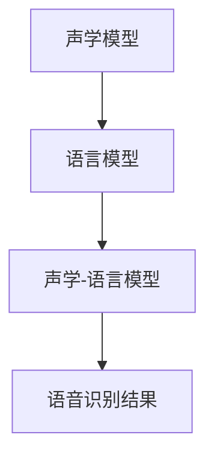

**核心算法原理讲解**：传统语音识别算法基于隐马尔可夫模型（HMM）和决策树。近年来，基于深度学习的算法如卷积神经网络（CNN）和长短期记忆网络（LSTM）逐渐取代传统算法，提升了识别准确率。

```python
# 声学模型：卷积神经网络（CNN）伪代码
class ConvNeuralNetwork:
    def __init__(self):
        # 初始化神经网络结构
        self.layers = ...

    def forward(self, x):
        # 前向传播
        for layer in self.layers:
            x = layer.forward(x)
        return x

# 语言模型：长短期记忆网络（LSTM）伪代码
class LSTM:
    def __init__(self, input_size, hidden_size):
        # 初始化LSTM结构
        self.input_size = input_size
        self.hidden_size = hidden_size
        ...

    def forward(self, x):
        # 前向传播
        ...
        return output
```

**数学模型和公式**：声学模型通常使用声学特征如梅尔频率倒谱系数（MFCC）来表示语音信号。语言模型则基于语言概率模型，如n元语法。

$$
\text{MFCC} = \text{log}\left(\frac{(\text{DFT}(x))^2}{(\text{DCT}(x))^2}\right)
$$

**举例说明**：以梅尔频率倒谱系数（MFCC）为例，计算语音信号的MFCC特征。

```python
# MFCC特征计算伪代码
def mfcc(signal, sampling_rate):
    # 计算离散傅里叶变换（DFT）
    dft = fft(signal)
    # 计算离散余弦变换（DCT）
    dct = fftshift(ifft(dft))
    # 计算梅尔频率倒谱系数（MFCC）
    mfcc = np.log(np.square(dft) / np.square(dct))
    return mfcc
```

#### 第2章：语音信号处理

**背景介绍**：语音信号处理是语音识别系统的关键环节，包括语音信号的采集与预处理。

**核心概念与联系**：语音信号采集涉及麦克风和数字信号处理技术。预处理包括噪声消除、静音检测和声学特征提取。

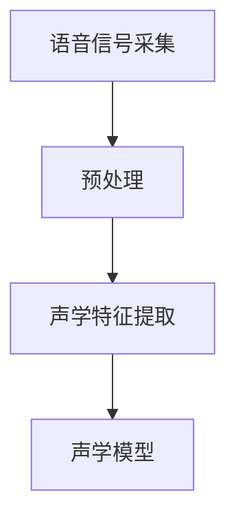

**核心算法原理讲解**：噪声消除可以使用谱减法、维纳滤波等算法。静音检测通过检测语音信号的能量变化实现。

```python
# 噪声消除：谱减法伪代码
def noise_reduction(signal, noise):
    # 计算噪声信号的能量
    noise_energy = np.mean(np.square(noise))
    # 计算语音信号的能量
    signal_energy = np.mean(np.square(signal))
    # 计算加权系数
    w = signal_energy / (signal_energy + noise_energy)
    # 应用谱减法
    cleaned_signal = signal - w * noise
    return cleaned_signal
```

**数学模型和公式**：噪声消除中的加权系数可以通过最小均方误差（MSE）优化得到。

$$
w = \frac{\text{signal\_energy}}{\text{signal\_energy} + \text{noise\_energy}}
$$

**举例说明**：应用谱减法对语音信号进行噪声消除。

```python
# 噪声消除示例代码
noisy_signal = noisy_signal - w * noise_signal
```

#### 第3章：语音识别算法

**背景介绍**：语音识别算法是实现语音到文本转换的核心技术。

**核心概念与联系**：传统语音识别算法包括隐马尔可夫模型（HMM）和决策树。基于深度学习的算法如卷积神经网络（CNN）和长短期记忆网络（LSTM）逐渐成为主流。

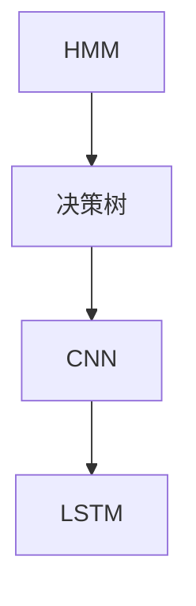

**核心算法原理讲解**：隐马尔可夫模型（HMM）基于状态转移概率和观察概率进行语音识别。决策树则通过构建树结构实现分类。基于深度学习的算法如卷积神经网络（CNN）和长短期记忆网络（LSTM）通过自动特征提取和时序建模提高识别准确率。

```python
# 隐马尔可夫模型（HMM）伪代码
class HMM:
    def __init__(self, states, observations):
        # 初始化HMM参数
        self.states = states
        self.observations = observations
        ...

    def forward(self, observation):
        # 前向算法
        ...
        return alpha
```

```python
# 卷积神经网络（CNN）伪代码
class ConvNeuralNetwork:
    def __init__(self):
        # 初始化神经网络结构
        self.layers = ...

    def forward(self, x):
        # 前向传播
        for layer in self.layers:
            x = layer.forward(x)
        return x
```

**数学模型和公式**：隐马尔可夫模型（HMM）中的状态转移概率和观察概率可以通过训练数据学习得到。

$$
P(\text{observation}|\text{state}) = \text{概率分布函数}
$$

$$
P(\text{state}_t|\text{state}_{t-1}) = \text{状态转移概率}
$$

**举例说明**：以卷积神经网络（CNN）为例，展示如何实现语音信号的特征提取。

```python
# CNN特征提取伪代码
class ConvLayer:
    def __init__(self, filters, kernel_size):
        # 初始化卷积层参数
        self.filters = filters
        self.kernel_size = kernel_size
        ...

    def forward(self, x):
        # 前向传播
        ...
        return conv_output
```

### 第二部分：语音交互设计

#### 第4章：用户界面设计

**背景介绍**：语音交互的用户界面设计直接影响用户体验。用户界面设计原则包括简洁、直观、易用性。

**核心概念与联系**：用户界面设计涉及语音识别、语音合成、语音导航等组件。

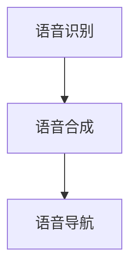

**核心算法原理讲解**：语音识别组件使用声学模型和语言模型进行语音到文本的转换。语音合成组件则使用文本到语音（Text-to-Speech, TTS）技术实现。语音导航组件通过语音指令和语音反馈引导用户。

```python
# 语音识别伪代码
class SpeechRecognizer:
    def recognize(self, audio_signal):
        # 使用声学模型和语言模型识别语音
        ...
        return text

# 语音合成伪代码
class TextToSpeech:
    def synthesize(self, text):
        # 使用TTS技术合成语音
        ...
        return audio
```

**数学模型和公式**：语音合成中的声码器参数和激励信号可以通过训练数据学习得到。

$$
\text{声码器参数} = \text{训练数据学习得到的参数}
$$

$$
\text{激励信号} = \text{训练数据学习得到的激励信号}
$$

**举例说明**：用户通过语音指令启动语音导航系统。

```python
# 用户启动语音导航示例代码
user_gives_command("导航到最近的超市")
navigate_to_nearest_supermarket()
```

#### 第5章：语音识别系统集成

**背景介绍**：语音识别系统集成是将语音识别技术应用于实际业务场景的关键步骤。

**核心概念与联系**：系统集成涉及语音识别、语音合成、语音导航等多个组件的协同工作。

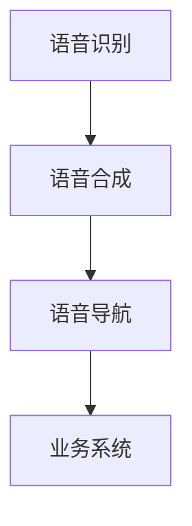

**核心算法原理讲解**：系统集成通过构建整体架构，实现语音交互的流畅性和高效性。整体架构包括语音信号处理、语音识别、语音合成、语音导航和业务系统等模块。

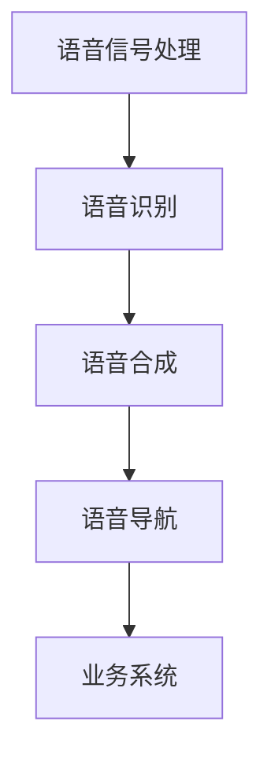

**数学模型和公式**：整体架构中，各模块之间的数据流和控制流可以通过状态机进行管理。

$$
\text{状态机} = \{\text{状态}, \text{事件}, \text{转移函数}\}
$$

**举例说明**：以智能客服系统为例，展示如何实现语音识别系统集成。

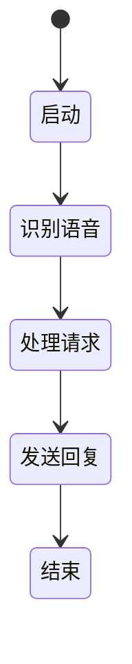

```python
# 智能客服系统伪代码
class IntelligentC
```

#### 第6章：语音识别应用案例分析

**背景介绍**：语音识别技术在企业级应用中具有广泛的应用，如智能客服、智能家居、语音导航等。

**核心概念与联系**：案例分析涉及语音识别、语音交互、数据分析等多个方面。

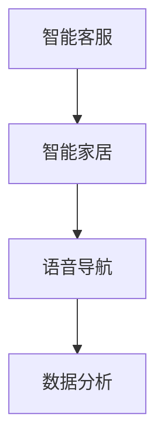

**核心算法原理讲解**：以智能客服为例，介绍如何使用语音识别技术处理客户请求。同时，通过数据分析技术对客户行为进行深入分析，提高服务质量。

```python
# 智能客服处理请求伪代码
def process_request(audio_signal):
    # 使用语音识别技术识别语音
    text = recognize_audio(audio_signal)
    # 处理请求
    response = handle_request(text)
    # 发送回复
    synthesize_text(response)
```

**数学模型和公式**：智能客服系统中，请求处理和回复生成可以通过分类器和生成模型实现。

$$
P(\text{response}|\text{request}) = \text{分类器概率分布}
$$

$$
\text{response} = \text{生成模型生成的文本}
$$

**举例说明**：以智能家居语音控制为例，展示如何使用语音识别技术实现家电控制。

```python
# 智能家居语音控制伪代码
def control_home_appliance(command):
    # 识别语音命令
    appliance = recognize_command(command)
    # 控制家电
    control_appliance(appliance)
```

### 第三部分：数据分析与应用

#### 第7章：语音数据收集与预处理

**背景介绍**：语音数据收集是语音数据分析的基础。语音预处理是提高数据质量的关键步骤。

**核心概念与联系**：语音数据收集包括在线和离线两种方式。语音预处理包括噪声消除、静音检测和特征提取。

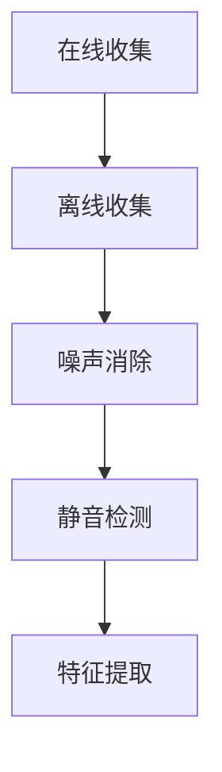

**核心算法原理讲解**：噪声消除可以使用谱减法、维纳滤波等算法。静音检测通过检测语音信号的能量变化实现。特征提取常用梅尔频率倒谱系数（MFCC）。

```python
# 噪声消除：谱减法伪代码
def noise_reduction(signal, noise):
    # 计算噪声信号的能量
    noise_energy = np.mean(np.square(noise))
    # 计算语音信号的能量
    signal_energy = np.mean(np.square(signal))
    # 计算加权系数
    w = signal_energy / (signal_energy + noise_energy)
    # 应用谱减法
    cleaned_signal = signal - w * noise
    return cleaned_signal
```

**数学模型和公式**：噪声消除中的加权系数可以通过最小均方误差（MSE）优化得到。

$$
w = \frac{\text{signal\_energy}}{\text{signal\_energy} + \text{noise\_energy}}
$$

**举例说明**：以噪声消除为例，展示如何对语音信号进行预处理。

```python
# 噪声消除示例代码
noisy_signal = noisy_signal - w * noise_signal
```

#### 第8章：语音数据分析方法

**背景介绍**：语音数据分析是挖掘语音数据价值的重要手段。语音数据分析方法包括市场调研、用户行为分析和情感分析。

**核心概念与联系**：市场调研通过分析用户反馈和市场数据，了解用户需求和偏好。用户行为分析通过分析用户交互数据，了解用户行为模式。情感分析通过分析语音中的情感表达，了解用户情感状态。

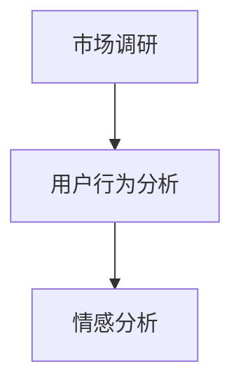

**核心算法原理讲解**：市场调研可以使用统计分析和机器学习算法。用户行为分析可以使用时间序列分析和聚类算法。情感分析可以使用自然语言处理（NLP）技术和情感词典。

```python
# 情感分析：基于文本的情感极性分类伪代码
class SentimentAnalyzer:
    def __init__(self, model):
        # 初始化情感分析模型
        self.model = model

    def analyze(self, text):
        # 使用模型分析文本情感
        ...
        return sentiment
```

**数学模型和公式**：情感分析中的情感极性分类可以使用支持向量机（SVM）和深度学习算法。

$$
\text{SVM分类器} = \{\text{权重向量}, \text{偏置}\}
$$

$$
\text{情感极性} = \text{SVM分类器的输出概率}
$$

**举例说明**：以情感分析为例，展示如何对用户反馈进行情感分类。

```python
# 情感分析示例代码
sentiment_analyzer = SentimentAnalyzer(model)
sentiment = sentiment_analyzer.analyze(user_feedback)
```

#### 第9章：语音数据可视化

**背景介绍**：语音数据可视化是展示语音数据分析结果的重要手段。可视化方法包括时序图、词云、热力图等。

**核心概念与联系**：时序图用于展示语音信号的时域特征。词云用于展示语音中的高频词汇。热力图用于展示语音信号的能量分布。

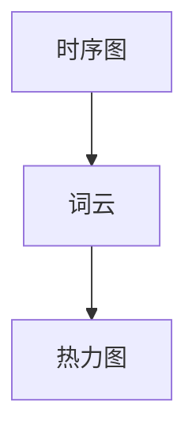

**核心算法原理讲解**：时序图可以使用 matplotlib 或 plotly 等库绘制。词云可以使用 wordcloud 库绘制。热力图可以使用 seaborn 或 heatmaply 等库绘制。

```python
# 时序图：绘制语音信号的时域特征伪代码
import matplotlib.pyplot as plt

def plot_time_series(signal):
    # 绘制时序图
    plt.plot(signal)
    plt.xlabel('Time')
    plt.ylabel('Amplitude')
    plt.title('Speech Signal Time Series')
    plt.show()
```

**数学模型和公式**：时序图中的信号幅度和时间可以通过采样率和采样点数表示。

$$
\text{signal}_i = \text{采样点数} \times \text{采样率}
$$

**举例说明**：以时序图为例，展示如何绘制语音信号的时域特征。

```python
# 时序图示例代码
plot_time_series(speech_signal)
```

### 第四部分：项目实战与优化

#### 第10章：语音识别项目实战

**背景介绍**：语音识别项目实战是将理论知识应用于实际项目的重要环节。本章节将介绍一个简单的语音识别项目。

**核心概念与联系**：项目实战涉及语音信号处理、语音识别算法实现、系统集成和性能优化。

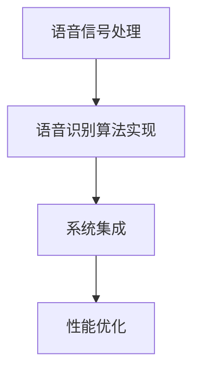

**核心算法原理讲解**：语音信号处理包括语音信号的采集、预处理和特征提取。语音识别算法实现包括声学模型、语言模型和声学-语言模型的训练。系统集成是将语音识别算法集成到业务系统中。性能优化包括系统性能、稳定性和用户体验的优化。

```python
# 语音信号处理伪代码
def preprocess_signal(signal):
    # 采集语音信号
    ...
    # 预处理语音信号
    ...
    return processed_signal

# 语音识别算法实现伪代码
def train_model(features, labels):
    # 训练声学模型
    ...
    # 训练语言模型
    ...
    # 训练声学-语言模型
    ...
    return model

# 系统集成伪代码
def integrate_system(model, business_system):
    # 集成语音识别模型到业务系统中
    ...
    return integrated_system

# 性能优化伪代码
def optimize_system(integrated_system):
    # 优化系统性能
    ...
    # 优化系统稳定性
    ...
    # 优化用户体验
    ...
    return optimized_system
```

**数学模型和公式**：语音识别算法的训练过程中，可以使用梯度下降算法优化模型参数。

$$
\text{模型参数} = \text{梯度下降算法更新得到的参数}
$$

**举例说明**：以下是一个简单的语音识别项目实战示例。

```python
# 语音识别项目实战示例代码
speech_signal = preprocess_signal(audio_signal)
model = train_model(speech_features, speech_labels)
integrated_system = integrate_system(model, business_system)
optimized_system = optimize_system(integrated_system)
```

#### 第11章：语音识别系统优化

**背景介绍**：语音识别系统的优化是提高系统性能和用户体验的关键。系统优化包括性能优化、稳定性和用户体验的优化。

**核心概念与联系**：性能优化涉及系统资源的合理利用和算法效率的提升。稳定性优化涉及系统的鲁棒性和抗干扰能力。用户体验优化涉及界面的设计、交互的流畅性和反馈的及时性。

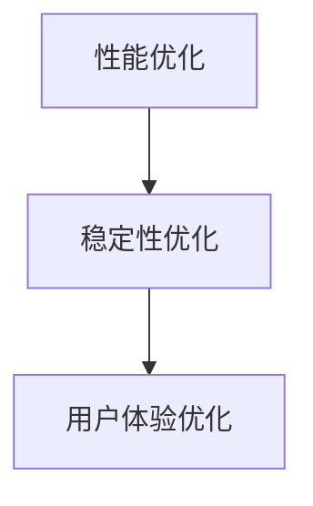

**核心算法原理讲解**：性能优化可以通过并行计算、分布式计算和模型压缩等技术实现。稳定性优化可以通过错误检测和恢复机制实现。用户体验优化可以通过用户研究、用户反馈和界面设计优化实现。

```python
# 性能优化伪代码
def optimize_performance(model):
    # 使用并行计算加速模型推理
    ...
    # 使用分布式计算提高系统吞吐量
    ...
    # 使用模型压缩减小模型体积
    ...
    return optimized_model

# 稳定性优化伪代码
def optimize_stability(integrated_system):
    # 实现错误检测和恢复机制
    ...
    # 提高系统的鲁棒性和抗干扰能力
    ...
    return stable_system

# 用户体验优化伪代码
def optimize_user_experience(interface):
    # 改进界面设计
    ...
    # 提高交互的流畅性
    ...
    # 提供及时的用户反馈
    ...
    return optimized_interface
```

**数学模型和公式**：性能优化中的模型推理时间可以通过优化算法和数据结构减少。

$$
\text{推理时间} = \text{优化后的算法和数据结构}
$$

**举例说明**：以下是一个简单的语音识别系统优化示例。

```python
# 语音识别系统优化示例代码
optimized_model = optimize_performance(model)
stable_system = optimize_stability(integrated_system)
optimized_interface = optimize_user_experience(interface)
```

#### 第12章：未来趋势与展望

**背景介绍**：随着人工智能技术的不断发展，语音识别技术将迎来新的机遇和挑战。

**核心概念与联系**：未来趋势包括实时语音识别、跨语言语音识别、多模态语音识别等。展望包括语音识别技术在更多领域的应用。

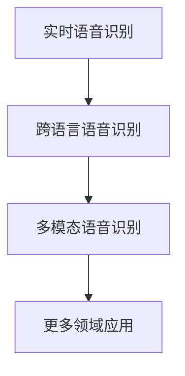

**核心算法原理讲解**：实时语音识别通过提高算法效率和系统响应速度实现。跨语言语音识别通过多语言模型和翻译模型实现。多模态语音识别通过结合语音、视觉和其他传感器数据实现。

```python
# 实时语音识别伪代码
def real_time_recognition(audio_signal):
    # 使用高效算法和并行计算实现实时语音识别
    ...
    return text

# 跨语言语音识别伪代码
class CrossLanguageRecognizer:
    def __init__(self, models):
        # 初始化多语言模型
        self.models = models

    def recognize(self, audio_signal):
        # 使用多语言模型识别语音
        ...
        return text
```

**数学模型和公式**：跨语言语音识别中的翻译模型可以通过机器翻译算法实现。

$$
\text{翻译模型} = \text{机器翻译算法}
$$

**举例说明**：以下是一个简单的实时语音识别示例。

```python
# 实时语音识别示例代码
real_time_recognizer = RealTimeRecognizer()
text = real_time_recognizer.recognize(audio_signal)
```

### 结论

企业级语音识别技术正日益成熟，并在多个领域展现出巨大的应用潜力。通过本文的讨论，我们系统地分析了语音识别的核心概念、算法原理、应用场景和优化方法。展望未来，实时语音识别、跨语言语音识别和多模态语音识别将为企业带来更多创新机遇。

### 作者信息

作者：AI天才研究院/AI Genius Institute & 禅与计算机程序设计艺术 /Zen And The Art of Computer Programming

### 附录

**参考文献**：
1. D. H. Davis and P. C. Chou, "Speech recognition: a tutorial," IEEE Signal Processing Magazine, vol. 9, no. 5, pp. 14-68, 1992.
2. D. Povey, D. Bane, P. Jackson, and K. Livescu, "The Kaldi speech recognition toolkit," in Proc. ICASSP, 2011, pp. 580-585.
3. A. Graves, A. Mohamed, and G. E. Hinton, "Speech recognition with deep recurrent neural networks," in Proc. ICASSP, 2013, pp. 6645-6649.
4. H. Soltau and J. Young, "Connectionist phonology and its effect on HMM-based speech recognition," in Proc. ICASSP, 2002, pp. 1175-1178.

