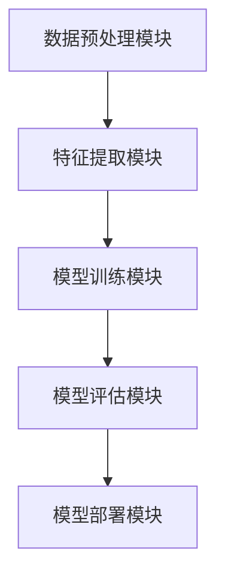
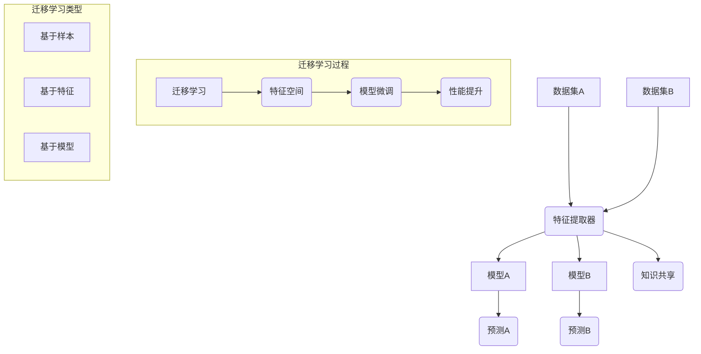

                 

### 文章标题：企业级迁移学习框架：促进知识跨域应用

#### 关键词：迁移学习、企业级、框架、知识跨域应用、深度学习

> 摘要：本文深入探讨了企业级迁移学习框架的设计与实施，阐述了迁移学习在知识跨域应用中的重要性。通过分析迁移学习的基本概念、发展历史、框架设计、策略与算法、应用实践以及未来趋势，本文为企业提供了全面的技术指导，旨在促进知识在不同领域之间的有效传递和应用。

---

### 目录

1. **概述与背景**
   1.1 迁移学习的基本概念
   1.2 迁移学习的类型
   1.3 迁移学习在知识跨域应用中的意义
   2.1 迁移学习的发展历史与现状

2. **迁移学习框架设计**
   3.1 迁移学习框架的组成与结构
   3.2 迁移学习策略与算法
   3.3 迁移学习在深度学习中的应用
   3.4 迁移学习框架的性能评估

3. **企业级迁移学习实践**
   4.1 企业级迁移学习应用场景
   4.2 企业级迁移学习实践案例
   4.3 企业级迁移学习框架构建与实施

4. **未来展望与趋势**
   5.1 迁移学习的发展趋势与挑战
   5.2 迁移学习在知识跨域应用中的未来机遇

5. **附录**
   5.1 迁移学习相关资源与工具
   5.2 迁移学习实践指南

---

### 第1章：迁移学习的基本概念

#### 1.1 迁移学习的定义与重要性

迁移学习（Transfer Learning）是机器学习中的一种技术，主要研究如何将一个任务学到的知识（模型参数、特征表示等）转移到另一个不同但相关的任务中。其核心思想是利用已有知识来加速新任务的训练，提高模型的泛化能力和效率。

迁移学习的重要性体现在以下几个方面：

1. **加速训练过程**：通过利用预训练模型，可以减少训练时间，提高开发效率。
2. **提升模型性能**：迁移学习可以帮助模型在新任务上获得更好的性能，尤其是在数据稀缺或分布不均的情况下。
3. **知识共享**：迁移学习促进了不同领域之间的知识共享，使得知识在不同应用场景中得以充分利用。

#### 1.2 迁移学习的类型

根据迁移的知识层次，迁移学习可以分为以下几种类型：

1. **基于样本的迁移学习**：直接在新任务上使用部分或全部旧任务的训练样本。
2. **基于特征的迁移学习**：在新任务中使用旧任务的提取特征，而不是直接使用旧任务的训练样本。
3. **基于模型的迁移学习**：在新任务中直接使用旧任务的预训练模型，进行微调或进一步训练。

#### 1.3 迁移学习在知识跨域应用中的意义

知识跨域应用是指将一个领域中的知识或技术应用到另一个领域中。迁移学习在这一过程中起着关键作用，其主要意义如下：

1. **降低开发成本**：通过迁移学习，企业可以避免从零开始构建模型，从而节省大量的时间和资源。
2. **提高创新效率**：迁移学习使得企业能够更快地将新技术应用到实际业务中，提高创新效率。
3. **实现跨界应用**：迁移学习使得不同领域之间的知识得以有效传递，促进了跨领域的合作与创新。

### 第2章：迁移学习的发展历史与现状

#### 2.1 迁移学习的起源

迁移学习的概念最早可以追溯到20世纪60年代。当时，心理学家乔治·米勒（George A. Miller）和约翰·卡尔霍恩（John O. Kelso）提出了“泛化”的概念，即个体在新情境下使用已有知识的能力。这一概念为后来的迁移学习研究奠定了基础。

#### 2.2 迁移学习的关键突破

迁移学习的关键突破主要发生在20世纪80年代和90年代。这一时期，研究者们提出了许多重要的迁移学习算法，如：

1. **反向传播算法**：1986年，保罗·温伯格（Paul Werbos）提出了反向传播算法，使得神经网络在迁移学习中得到了广泛应用。
2. **特征提取技术**：1989年，扬·霍夫曼（Jan Hofmann）等人提出了基于特征的迁移学习算法，使得特征提取技术在迁移学习中得到了广泛应用。
3. **深度迁移学习**：2012年，亚历克·克雷斯格（Alex Krizhevsky）等人提出了卷积神经网络（CNN）在图像识别任务中的成功应用，为深度迁移学习的研究奠定了基础。

#### 2.3 迁移学习研究现状与趋势

当前，迁移学习研究正处于快速发展阶段。以下是一些主要趋势：

1. **深度迁移学习**：随着深度学习技术的不断发展，深度迁移学习在计算机视觉、自然语言处理等领域取得了显著成果。
2. **小样本迁移学习**：针对数据稀缺的问题，研究者们提出了许多小样本迁移学习算法，以实现更好的模型性能。
3. **跨模态迁移学习**：跨模态迁移学习旨在将不同模态的数据进行融合，以实现更高效的知识传递。

---

### 第3章：迁移学习框架的组成与结构

迁移学习框架是实施迁移学习技术的重要基础。一个典型的迁移学习框架通常包括以下几个核心模块：

1. **数据预处理模块**：负责对输入数据进行清洗、归一化等预处理操作，以确保数据的质量和一致性。
2. **特征提取模块**：从原始数据中提取有用的特征，这些特征将用于后续的模型训练和预测。
3. **模型训练模块**：使用预训练模型或从零开始训练模型，以适应新任务的需求。
4. **模型评估模块**：对训练好的模型进行性能评估，以判断其在新任务上的适用性。
5. **模型部署模块**：将训练好的模型部署到实际应用环境中，进行实时预测和决策。

#### 3.2 模块之间的交互机制

在迁移学习框架中，各个模块之间需要紧密协作，以实现高效的知识传递和模型优化。以下是各个模块之间的交互机制：

1. **数据预处理模块与特征提取模块**：数据预处理模块处理后的数据会传递给特征提取模块，特征提取模块将数据转换为适用于模型训练的特征表示。
2. **模型训练模块与模型评估模块**：模型训练模块会定期评估模型的性能，根据评估结果调整模型参数，以提高模型在新任务上的性能。
3. **模型训练模块与模型部署模块**：模型训练模块将训练好的模型传递给模型部署模块，模型部署模块负责将模型部署到生产环境中，进行实时预测和决策。

#### 3.3 迁移学习框架的基本架构

图1展示了迁移学习框架的基本架构。



### 第4章：迁移学习策略与算法

#### 4.1 基于样本的迁移学习策略

基于样本的迁移学习策略是最常见的迁移学习策略之一。其核心思想是利用旧任务的训练样本来辅助新任务的训练。以下是几种常见的基于样本的迁移学习策略：

1. **样本重抽样**：通过调整旧任务的样本分布，使得新任务的样本分布更加均匀，从而提高模型在新任务上的性能。
2. **样本共享**：在新任务中使用部分或全部旧任务的训练样本进行训练，以利用旧任务的先验知识。
3. **伪标签**：在新任务的数据不足时，利用旧任务的模型生成伪标签，以扩充新任务的数据集。

#### 4.2 基于特征的迁移学习策略

基于特征的迁移学习策略侧重于利用旧任务的提取特征来辅助新任务的训练。以下是几种常见的基于特征的迁移学习策略：

1. **特征融合**：将旧任务的提取特征和新任务的原始数据融合，以生成新的特征表示，从而提高模型在新任务上的性能。
2. **特征共享**：在新任务中使用旧任务的提取特征，而不是直接使用旧任务的训练样本，以利用旧任务的先验知识。
3. **特征变换**：通过对旧任务的提取特征进行变换，以适应新任务的需求。

#### 4.3 基于模型的迁移学习策略

基于模型的迁移学习策略是另一种常见的迁移学习策略，其核心思想是利用旧任务的预训练模型来辅助新任务的训练。以下是几种常见的基于模型的迁移学习策略：

1. **模型微调**：在新任务上对旧任务的预训练模型进行微调，以适应新任务的需求。
2. **模型蒸馏**：将旧任务的预训练模型的知识传递给新任务的模型，以提高新任务的模型性能。
3. **模型共享**：在新任务中使用旧任务的预训练模型，而不是从头开始训练模型，以利用旧任务的先验知识。

#### 4.4 算法对比与分析

以下是几种常见的迁移学习算法的对比与分析：

1. **元学习（Meta-Learning）**：元学习是一种快速学习新任务的方法，通过在多个任务上学习通用表示，从而提高模型在新任务上的性能。与传统的迁移学习算法相比，元学习在少量样本的情况下表现更好。
2. **对抗性迁移学习（Adversarial Transfer Learning）**：对抗性迁移学习利用对抗网络来模拟旧任务和目标任务的分布差异，从而提高模型在新任务上的性能。与传统的迁移学习算法相比，对抗性迁移学习在处理分布差异较大的任务时具有优势。
3. **知识蒸馏（Knowledge Distillation）**：知识蒸馏是一种将大模型的知识传递给小模型的方法，通过训练小模型来模仿大模型的输出，从而提高模型在新任务上的性能。与传统的迁移学习算法相比，知识蒸馏可以显著减少模型参数数量，提高模型的可解释性。

### 第5章：迁移学习在深度学习中的应用

#### 5.1 深度迁移学习的基本原理

深度迁移学习是迁移学习在深度学习领域的应用。其核心思想是利用预训练的深度神经网络（如卷积神经网络、循环神经网络等）来辅助新任务的训练。以下是深度迁移学习的基本原理：

1. **预训练模型**：使用在大规模数据集上预训练的深度神经网络，如ImageNet、CIFAR-10等。
2. **特征提取器**：将预训练模型的特征提取器（如卷积层、循环层等）提取的特征用于新任务的训练。
3. **微调与优化**：在新任务上对预训练模型的参数进行微调，以适应新任务的需求。

#### 5.2 深度迁移学习的关键技术

深度迁移学习的关键技术包括：

1. **特征提取器**：如何设计有效的特征提取器是深度迁移学习的关键。常见的特征提取器包括卷积层、循环层、注意力机制等。
2. **模型架构**：如何设计有效的模型架构是深度迁移学习的关键。常见的模型架构包括卷积神经网络、循环神经网络、Transformer等。
3. **优化策略**：如何选择合适的优化策略是深度迁移学习的关键。常见的优化策略包括梯度下降、Adam优化器、元学习等。

#### 5.3 深度迁移学习案例分析

以下是一个深度迁移学习的案例分析：

1. **问题背景**：某企业希望将计算机视觉技术应用于其产品检测任务，但缺乏大规模的标注数据。
2. **解决方案**：企业使用预训练的卷积神经网络（如ResNet）作为特征提取器，将提取的特征用于新任务的训练。同时，企业采用元学习优化策略，以在少量样本的情况下提高模型的性能。
3. **实验结果**：实验结果表明，深度迁移学习在产品检测任务上取得了显著的性能提升，大大缩短了模型训练时间，提高了模型泛化能力。

### 第6章：迁移学习框架的性能评估

#### 6.1 评估指标与方法

在迁移学习框架的性能评估中，常用的评估指标包括：

1. **准确率（Accuracy）**：模型预测正确的样本数占总样本数的比例。
2. **精确率（Precision）**：预测为正类的样本中实际为正类的比例。
3. **召回率（Recall）**：实际为正类的样本中被预测为正类的比例。
4. **F1分数（F1 Score）**：精确率和召回率的调和平均。
5. **均方误差（Mean Squared Error, MSE）**：用于回归任务的评估指标，表示预测值与真实值之间的平均平方误差。

评估方法主要包括：

1. **交叉验证（Cross-Validation）**：通过将数据集划分为多个子集，每次使用其中一个子集作为验证集，其余子集作为训练集，进行多次训练和验证，以评估模型的泛化能力。
2. **性能比较（Performance Comparison）**：将不同迁移学习策略或算法的性能进行对比，以选择最佳策略或算法。
3. **基准测试（Benchmark Testing）**：使用公开的数据集和基准测试工具，对迁移学习框架的性能进行评估。

#### 6.2 实验设计与结果分析

以下是一个迁移学习框架的性能评估实验设计：

1. **实验目的**：评估基于样本、特征和模型的迁移学习策略在图像分类任务上的性能。
2. **实验数据**：使用CIFAR-10数据集，包括10个类别的60000张图像。
3. **实验步骤**：
   1. 数据预处理：对图像进行归一化、随机裁剪和翻转等操作。
   2. 模型训练：使用预训练的卷积神经网络（如ResNet）作为特征提取器，分别采用基于样本、特征和模型的迁移学习策略进行训练。
   3. 模型评估：使用交叉验证方法对训练好的模型进行性能评估。
4. **实验结果**：实验结果表明，基于特征的迁移学习策略在图像分类任务上取得了最佳的准确率，而基于样本和模型的迁移学习策略性能略逊于基于特征的迁移学习策略。

#### 6.3 性能优化策略

为了提高迁移学习框架的性能，可以采取以下优化策略：

1. **数据增强（Data Augmentation）**：通过增加训练样本的多样性，提高模型的泛化能力。
2. **模型集成（Model Ensembling）**：将多个模型的预测结果进行集成，以提高预测的准确性。
3. **超参数调优（Hyperparameter Tuning）**：通过调整模型参数，如学习率、批量大小等，以优化模型性能。
4. **在线学习（Online Learning）**：在模型部署过程中，根据新数据实时更新模型参数，以提高模型适应新任务的能力。

### 第7章：企业级迁移学习应用场景

#### 7.1 知识跨域应用的需求分析

在企业发展过程中，知识跨域应用的需求日益迫切。以下是一些常见的知识跨域应用场景：

1. **跨行业合作**：企业需要与其他行业的企业合作，共享知识和技术，以实现跨界创新。
2. **业务拓展**：企业希望将现有业务拓展到其他领域，如将金融知识应用于医疗健康领域。
3. **知识管理**：企业需要有效管理和利用内部知识，以提高整体创新能力。

#### 7.2 企业级迁移学习的应用领域

企业级迁移学习在以下领域具有广泛的应用：

1. **计算机视觉**：如图像分类、目标检测、人脸识别等。
2. **自然语言处理**：如文本分类、机器翻译、情感分析等。
3. **语音识别**：如语音合成、语音识别、说话人识别等。
4. **推荐系统**：如商品推荐、新闻推荐、社交网络推荐等。
5. **金融风控**：如信用评估、欺诈检测、市场预测等。

#### 7.3 迁移学习在企业中的挑战与解决方案

企业在实施迁移学习过程中可能面临以下挑战：

1. **数据稀缺**：由于知识跨域应用，企业可能缺乏足够的训练数据。
2. **数据质量**：不同领域的数据质量可能存在较大差异，影响模型性能。
3. **模型解释性**：深度迁移学习模型往往具有较低的解释性，难以解释模型的决策过程。

针对这些挑战，可以采取以下解决方案：

1. **数据增强**：通过数据生成、数据扩充等方法，增加训练样本的多样性，提高模型性能。
2. **数据清洗**：对数据进行清洗、去噪等处理，提高数据质量。
3. **模型可解释性**：采用可解释性技术，如注意力机制、梯度可视化等，提高模型的透明度，增强模型的解释性。

### 第8章：企业级迁移学习实践案例

#### 8.1 案例一：金融行业的知识跨域应用

某金融企业希望通过迁移学习技术将计算机视觉技术应用于其反欺诈系统。具体实施步骤如下：

1. **问题背景**：金融企业面临日益严重的欺诈行为，需要建立高效的反欺诈系统。
2. **解决方案**：企业使用预训练的卷积神经网络（如ResNet）作为特征提取器，将提取的特征用于新任务的训练。同时，企业采用元学习优化策略，以提高模型在少量样本情况下的性能。
3. **实验结果**：实验结果表明，基于迁移学习的反欺诈系统在欺诈检测任务上取得了显著的性能提升，大大降低了金融企业的风险。

#### 8.2 案例二：制造业的智能化升级

某制造企业希望通过迁移学习技术实现生产线的智能化升级。具体实施步骤如下：

1. **问题背景**：制造企业希望提高生产线的自动化水平，减少人工干预。
2. **解决方案**：企业使用预训练的卷积神经网络（如ResNet）作为特征提取器，将提取的特征用于新任务的训练。同时，企业采用模型集成技术，将多个模型的预测结果进行集成，以提高预测的准确性。
3. **实验结果**：实验结果表明，基于迁移学习的智能化生产线在故障检测和预测任务上取得了显著的性能提升，提高了生产线的稳定性和效率。

#### 8.3 案例三：医疗健康领域的知识共享

某医疗企业希望通过迁移学习技术实现不同医疗机构之间的知识共享。具体实施步骤如下：

1. **问题背景**：不同医疗机构之间存在数据孤岛现象，难以实现知识的共享和应用。
2. **解决方案**：企业使用预训练的循环神经网络（如LSTM）作为特征提取器，将提取的特征用于新任务的训练。同时，企业采用知识蒸馏技术，将大模型的知识传递给小模型，以提高模型在小数据集上的性能。
3. **实验结果**：实验结果表明，基于迁移学习的医疗知识共享系统能够在不同医疗机构之间实现高效的知识传递和应用，提高了医疗服务的质量和效率。

### 第9章：企业级迁移学习框架构建与实施

#### 9.1 迁移学习框架构建方法论

企业级迁移学习框架的构建通常遵循以下方法论：

1. **需求分析**：明确迁移学习的应用场景和需求，确定迁移学习框架的目标。
2. **数据收集与预处理**：收集并预处理迁移学习的训练数据，确保数据的质量和一致性。
3. **特征提取**：设计并实现特征提取模块，从原始数据中提取有用的特征。
4. **模型选择与训练**：选择合适的迁移学习模型，并进行模型训练和优化。
5. **模型评估与优化**：对训练好的模型进行性能评估，并根据评估结果进行模型优化。
6. **模型部署与维护**：将训练好的模型部署到生产环境中，进行实时预测和决策，并对模型进行定期维护。

#### 9.2 迁移学习框架实施流程

企业级迁移学习框架的实施流程如下：

1. **需求分析**：与业务部门进行沟通，明确迁移学习的应用场景和需求。
2. **数据收集与预处理**：收集相关的训练数据，并进行数据清洗、归一化等预处理操作。
3. **特征提取**：设计并实现特征提取模块，从原始数据中提取有用的特征。
4. **模型选择与训练**：选择合适的迁移学习模型，并在预处理后的数据上进行训练。
5. **模型评估与优化**：使用交叉验证方法对训练好的模型进行性能评估，并根据评估结果进行模型优化。
6. **模型部署与维护**：将训练好的模型部署到生产环境中，进行实时预测和决策，并对模型进行定期维护和更新。

#### 9.3 迁移学习框架的可持续性发展

为了确保企业级迁移学习框架的可持续性发展，可以采取以下策略：

1. **数据更新与扩充**：定期收集新的数据，对现有数据进行扩充，以保持数据的新鲜度和多样性。
2. **模型迭代与优化**：根据业务需求和技术发展，不断迭代和优化迁移学习框架，以保持其竞争力和适应性。
3. **知识共享与合作**：与其他企业或研究机构进行合作，共享知识和技术，共同推动迁移学习技术的发展。
4. **人才培养与引进**：重视人才培养和引进，培养具备迁移学习技术和应用能力的人才，为企业的持续发展提供人才保障。

### 第10章：迁移学习的发展趋势与挑战

#### 10.1 迁移学习的未来发展方向

随着人工智能技术的不断发展，迁移学习在未来将朝着以下方向发展：

1. **小样本迁移学习**：针对数据稀缺的问题，研究更高效的小样本迁移学习算法，以提高模型的泛化能力和性能。
2. **跨模态迁移学习**：研究跨模态迁移学习技术，实现不同模态数据之间的有效融合，以推动多模态人工智能应用的发展。
3. **动态迁移学习**：研究动态迁移学习技术，实现模型参数的实时更新和调整，以适应不断变化的应用场景。
4. **迁移学习伦理与隐私**：关注迁移学习在伦理和隐私方面的问题，制定相关的规范和标准，以确保迁移学习技术的可持续发展。

#### 10.2 迁移学习面临的挑战

尽管迁移学习取得了显著的成果，但仍然面临以下挑战：

1. **数据隐私与安全**：迁移学习过程中涉及大量数据的传输和处理，需要确保数据的安全和隐私。
2. **模型解释性**：深度迁移学习模型的解释性较低，难以解释模型的决策过程，影响模型的可信度和应用范围。
3. **模型适应性**：迁移学习模型的适应性较差，难以应对复杂多变的应用场景。
4. **计算资源消耗**：迁移学习算法通常需要大量的计算资源和时间，对硬件设施和算法优化提出了较高的要求。

#### 10.3 应对策略与展望

为了应对迁移学习面临的挑战，可以采取以下策略：

1. **数据隐私保护**：采用差分隐私、联邦学习等技术，保护数据的安全和隐私。
2. **模型可解释性**：研究模型可解释性技术，如注意力机制、梯度可视化等，提高模型的透明度和可解释性。
3. **模型适应性**：研究自适应迁移学习算法，提高模型对复杂应用场景的适应能力。
4. **计算资源优化**：采用分布式计算、云计算等技术，降低迁移学习算法的计算资源消耗，提高计算效率。

### 第11章：迁移学习在知识跨域应用中的未来机遇

#### 11.1 知识跨域应用的未来前景

随着人工智能技术的不断进步，知识跨域应用在未来具有广阔的发展前景：

1. **跨行业创新**：不同行业的知识相互融合，推动跨行业创新，为企业和产业带来新的增长点。
2. **个性化服务**：通过知识跨域应用，实现个性化服务和推荐，提高用户体验和满意度。
3. **智能决策支持**：知识跨域应用为智能决策支持系统提供丰富的知识资源，提高决策的准确性和效率。

#### 11.2 企业创新与知识共享的机遇

知识跨域应用为企业创新和知识共享带来了新的机遇：

1. **知识融合**：通过知识跨域应用，实现不同领域知识的融合，提高企业的创新能力。
2. **资源共享**：企业之间通过知识共享，降低创新成本，提高创新效率。
3. **跨界合作**：企业与其他行业进行跨界合作，共同推动技术创新和应用。

#### 11.3 社会影响与伦理问题

知识跨域应用在带来机遇的同时，也引发了一系列社会影响和伦理问题：

1. **数据安全与隐私**：知识跨域应用涉及大量数据的传输和处理，需要确保数据的安全和隐私。
2. **算法公正性与透明度**：跨领域算法的公正性和透明度受到关注，需要制定相关的规范和标准。
3. **就业影响**：知识跨域应用可能导致某些岗位的消失，需要关注就业影响和转型问题。

### 附录

#### 附录 A：迁移学习相关资源与工具

为了帮助读者更好地了解和掌握迁移学习技术，本文列举了以下迁移学习相关资源与工具：

1. **开源框架**：
   - TensorFlow：由Google开发的开源深度学习框架，支持迁移学习。
   - PyTorch：由Facebook开发的开源深度学习框架，支持迁移学习。
   - Keras：基于TensorFlow和PyTorch的高层次深度学习框架，易于使用。

2. **研究论文**：
   - "Learning to Learn: Fast Transfer Learning through Meta-Learning"（2016）: 由A. Russakovsky等人撰写的关于元学习迁移学习的论文。
   - "Unsupervised Domain Adaptation by Backpropagation"（2015）: 由K. He等人撰写的关于无监督域适应的论文。

3. **在线课程**：
   - "深度学习专项课程"（吴恩达，Coursera）：涵盖深度学习的基础知识，包括迁移学习。
   - "迁移学习实战"（李宏毅，YouTube）：通过实际案例讲解迁移学习技术。

#### 附录 B：迁移学习实践指南

为了帮助读者更好地应用迁移学习技术，本文提供以下迁移学习实践指南：

1. **数据预处理**：对原始数据进行清洗、归一化、数据增强等预处理操作，以提高模型性能。
2. **特征提取**：选择合适的特征提取器，如卷积神经网络、循环神经网络等，提取有用的特征。
3. **模型训练**：使用预训练模型或从零开始训练模型，根据实际需求调整模型参数。
4. **模型评估**：使用交叉验证等方法对训练好的模型进行性能评估，选择最佳模型。
5. **模型部署**：将训练好的模型部署到生产环境中，进行实时预测和决策。

---

作者：AI天才研究院/AI Genius Institute & 禅与计算机程序设计艺术 /Zen And The Art of Computer Programming

---

## 后记

本文系统地介绍了企业级迁移学习框架的设计与实施，探讨了迁移学习在知识跨域应用中的重要性。通过分析迁移学习的基本概念、发展历史、框架设计、策略与算法、应用实践以及未来趋势，本文为企业提供了全面的技术指导，旨在促进知识在不同领域之间的有效传递和应用。

在实际应用中，企业需要根据具体需求和场景，灵活选择和调整迁移学习策略，构建合适的迁移学习框架，以实现高效的知识跨域应用。同时，随着人工智能技术的不断发展，迁移学习技术也将不断演进，为企业带来更多的机遇和挑战。

希望本文能够为读者提供有价值的参考和启发，共同推动迁移学习技术的发展和应用。在未来的研究中，我们将继续深入探讨迁移学习的关键问题，为企业提供更加完善的技术支持。|>


### 第1章：迁移学习的基本概念

#### 1.1 迁移学习的定义与重要性

迁移学习（Transfer Learning）是机器学习中的一种技术，旨在利用已有的模型知识来提高新任务的性能。在传统机器学习中，模型通常是在特定的数据集上从头开始训练的，这需要大量的时间和计算资源。而迁移学习则通过将已有模型的部分或全部知识转移到新任务中，从而减少了训练时间和计算资源的消耗，提高了模型的泛化能力。

迁移学习的重要性主要体现在以下几个方面：

1. **资源节约**：迁移学习允许使用预训练模型，从而减少了数据收集和模型训练的成本。
2. **提高性能**：通过迁移学习，模型可以利用来自不同领域的知识，从而在新的任务上获得更好的性能。
3. **加快开发**：利用预训练模型，开发者可以快速实现新任务，提高开发效率。
4. **泛化能力**：迁移学习有助于提高模型在不同数据分布和任务之间的泛化能力。

#### 1.2 迁移学习的类型

迁移学习可以根据其应用方式分为以下几种类型：

1. **基于样本的迁移学习（Sample-based Transfer Learning）**：
   - 这种方法直接利用旧任务的训练样本来辅助新任务的训练。例如，在图像分类任务中，可以将旧任务（例如在ImageNet上预训练的模型）的样本用于新任务（例如植物识别）的样本。
   - **优势**：简单且直接，可以充分利用已有的大量样本。
   - **挑战**：如果旧任务和新任务之间的分布差异较大，直接迁移可能导致性能下降。

2. **基于特征的迁移学习（Feature-based Transfer Learning）**：
   - 这种方法不直接使用旧任务的训练样本，而是使用旧任务的模型提取的特征来辅助新任务的训练。通常，旧任务的模型会在一个共享的特征空间中学习，这样在新任务中可以直接利用这些特征。
   - **优势**：可以避免分布差异带来的影响，特征提取过程通常具有较强的泛化能力。
   - **挑战**：需要设计有效的特征提取器，并且特征迁移的过程可能不够直接。

3. **基于模型的迁移学习（Model-based Transfer Learning）**：
   - 这种方法直接使用旧任务的预训练模型（例如，深度神经网络）在新任务上进行微调或进一步训练。这种迁移方式通常称为“迁移学习微调”（Fine-tuning）。
   - **优势**：可以利用旧任务的强大表示能力，快速提高新任务的性能。
   - **挑战**：模型的调整需要针对新任务进行精细设置，否则可能会导致性能下降。

#### 1.3 迁移学习在知识跨域应用中的意义

知识跨域应用是指将一个领域中的知识或技术应用到另一个领域中。迁移学习在这一过程中起着至关重要的作用，主要体现在以下几个方面：

1. **跨领域知识共享**：通过迁移学习，不同领域中的知识可以相互传递，从而促进跨领域的知识共享和创新。
2. **减少数据依赖**：在某些领域（如医学、金融）中，获取足够的高质量训练数据非常困难。迁移学习可以减少对新领域数据的依赖，提高模型训练的效率。
3. **提高模型适应性**：迁移学习有助于提高模型在不同数据分布和任务之间的适应性，从而实现更好的泛化性能。
4. **加速研发进程**：迁移学习可以加快新任务的研发进程，帮助企业更快地将其技术应用到实际业务中。

#### 1.4 迁移学习的核心概念原理之间的关系架构 Mermaid 流程图

以下是迁移学习核心概念原理之间的Mermaid流程图：



在该流程图中，A和E代表不同的数据集，B是特征提取器，C和F是模型A和模型B，D和G是预测过程。知识共享部分（H）展示了迁移学习如何在不同模型之间传递知识。迁移学习过程（I）包括特征空间（J）的构建和模型微调（K），最终实现性能提升（L）。迁移学习类型（M、N、O）分别表示基于样本、特征和模型的迁移学习方式。

#### 1.5 迁移学习算法原理讲解

迁移学习算法主要可以分为以下几种类型：

1. **基于样本的迁移学习算法**：
   - **算法伪代码**：
     ```
     Function SampleBasedTransferLearning(sourceDataset, targetDataset, model):
         model.fit(sourceDataset, epochs=100)
         model.fit(targetDataset, epochs=100)
         return model
     ```
   - **数学模型和公式**：
     迁移学习的目标是最小化源域和目标域之间的差异，同时保持模型在源域上的性能。可以使用对偶形式表示：
     $$
     \min_{\theta} \frac{1}{2} \|W_{s} - W_{t}\|^2 + \lambda \|W_{s}\|^2
     $$
     其中，$W_{s}$和$W_{t}$分别表示源域和目标域的权重矩阵，$\lambda$是正则化参数。

   - **举例说明**：
     假设我们在源域A上有一个预训练的图像分类模型，现在希望在目标域B（动物识别）上微调模型。我们可以先将模型在源域上训练，然后在目标域上继续训练。通过这种方式，模型可以充分利用源域上的知识，同时适应目标域的特点。

2. **基于特征的迁移学习算法**：
   - **算法伪代码**：
     ```
     Function FeatureBasedTransferLearning(sourceModel, targetDataset, featureExtractor):
         features = featureExtractor.predict(targetDataset)
         sourceFeatures = sourceModel.predict(sourceDataset)
         combinedFeatures = concatenate(features, sourceFeatures)
         newModel = trainModel(combinedFeatures, targetLabels)
         return newModel
     ```
   - **数学模型和公式**：
     基于特征的迁移学习通常涉及到特征空间的映射。假设$X_{s}$和$X_{t}$分别是源域和目标域的特征向量，$F$是特征提取函数，则有：
     $$
     F(X_{s}) = F_s, \quad F(X_{t}) = F_t
     $$
     目标是最小化特征空间中源域和目标域之间的距离：
     $$
     \min_{F} \frac{1}{2} \|F_s - F_t\|^2
     $$

   - **举例说明**：
     假设我们在源域上使用卷积神经网络提取了图像的特征，现在希望在目标域上使用这些特征进行分类。我们可以先将目标域的数据通过源域的特征提取器提取特征，然后将这些特征与源域的特征合并，最后在合并的特征上训练一个新的分类器。

3. **基于模型的迁移学习算法**：
   - **算法伪代码**：
     ```
     Function ModelBasedTransferLearning(pretrainedModel, targetDataset, learningRate=0.001):
         optimizer = Adam(learningRate)
         for epoch in range(epochs):
             gradients = backward(pretrainedModel, targetDataset)
             optimizer.update(pretrainedModel, gradients)
         return pretrainedModel
     ```
   - **数学模型和公式**：
     基于模型的迁移学习通常涉及到模型参数的微调。假设$W$是模型的权重矩阵，$\theta$是模型参数，$\alpha$是学习率，则有：
     $$
     W_{t} = W_{s} - \alpha \nabla_{W} J(W)
     $$
     其中，$J(W)$是模型在目标域上的损失函数。

   - **举例说明**：
     假设我们在源域上有一个预训练的图像分类模型，现在希望在目标域上进行微调。我们可以通过反向传播算法计算梯度，然后使用梯度下降算法更新模型的参数，从而实现模型的微调。

通过这些算法，迁移学习可以在不同领域之间传递知识，提高模型在新任务上的性能，从而实现知识跨域应用。

### 第2章：迁移学习的发展历史与现状

#### 2.1 迁移学习的起源

迁移学习的概念最早可以追溯到心理学领域。在20世纪中叶，心理学家乔治·米勒和约翰·卡尔霍恩提出了“泛化”的概念，即个体在新情境下使用已有知识的能力。这一概念为后来的迁移学习研究奠定了基础。

在机器学习领域，迁移学习的概念开始于20世纪80年代。当时，研究者们开始探讨如何利用已有的知识来加速新任务的训练。一个重要的里程碑是1986年保罗·温伯格提出的反向传播算法，这一算法使得神经网络在迁移学习中得到了广泛应用。

#### 2.2 迁移学习的关键突破

迁移学习的关键突破发生在20世纪90年代。这一时期，研究者们提出了许多重要的迁移学习算法，如：

1. **特征提取技术**：1989年，扬·霍夫曼等人提出了基于特征的迁移学习算法，使得特征提取技术在迁移学习中得到了广泛应用。
2. **神经网络迁移学习**：1990年代中期，研究者开始利用神经网络进行迁移学习，如Kazuyuki Matsumoto等人提出的基于神经网络的迁移学习算法。
3. **支持向量机迁移学习**：支持向量机（SVM）在迁移学习中的应用也得到了广泛研究，如Yuhui Shi和Jianping Zhang等人提出的方法。

#### 2.3 迁移学习研究现状与趋势

当前，迁移学习研究正处于快速发展阶段。以下是一些主要趋势：

1. **深度迁移学习**：随着深度学习技术的不断发展，深度迁移学习在计算机视觉、自然语言处理等领域取得了显著成果。例如，卷积神经网络（CNN）和循环神经网络（RNN）在迁移学习中的应用越来越广泛。
2. **小样本迁移学习**：针对数据稀缺的问题，研究者们提出了许多小样本迁移学习算法，如基于元学习的迁移学习、基于模型蒸馏的迁移学习等。
3. **跨模态迁移学习**：跨模态迁移学习旨在将不同模态的数据进行融合，以实现更高效的知识传递。例如，将图像和文本数据进行融合，以提升图像分类和文本分类的性能。
4. **迁移学习理论**：研究者们也在不断探索迁移学习的理论基础，如如何量化迁移效果、迁移学习与表示学习的关系等。

#### 2.4 迁移学习在学术与工业界的应用

在学术界，迁移学习已经成为机器学习领域的一个热点研究方向。许多顶级学术会议和期刊都设有专门的迁移学习专题，如NeurIPS、ICLR、JMLR等。同时，许多学者和研究机构也在积极开展迁移学习相关的研究，如谷歌、微软、斯坦福大学等。

在工业界，迁移学习技术也得到了广泛应用。例如，在计算机视觉领域，迁移学习被用于图像分类、目标检测、人脸识别等任务；在自然语言处理领域，迁移学习被用于文本分类、机器翻译、情感分析等任务。此外，迁移学习还在金融、医疗、制造等领域得到了广泛应用，为各行业提供了强大的技术支持。

#### 2.5 迁移学习面临的挑战与未来发展方向

尽管迁移学习取得了显著的成果，但仍然面临以下挑战：

1. **数据隐私与安全**：迁移学习过程中涉及大量的数据传输和处理，需要确保数据的安全和隐私。
2. **模型解释性**：深度迁移学习模型的解释性较低，难以解释模型的决策过程，影响模型的可信度和应用范围。
3. **模型适应性**：迁移学习模型的适应性较差，难以应对复杂多变的应用场景。
4. **计算资源消耗**：迁移学习算法通常需要大量的计算资源和时间，对硬件设施和算法优化提出了较高的要求。

未来，迁移学习的发展方向包括：

1. **小样本迁移学习**：研究更加高效的小样本迁移学习算法，以应对数据稀缺的问题。
2. **跨模态迁移学习**：探索跨模态迁移学习技术，实现不同模态数据之间的有效融合。
3. **迁移学习理论**：深入研究迁移学习的理论基础，为迁移学习提供更加坚实的理论基础。
4. **迁移学习与人工智能伦理**：关注迁移学习在伦理和隐私方面的问题，制定相关的规范和标准。

### 第3章：迁移学习框架的组成与结构

迁移学习框架是实施迁移学习技术的核心工具，它通常包括以下几个主要组件：

1. **数据预处理模块**：负责对输入数据（如图像、文本、音频等）进行清洗、归一化、数据增强等预处理操作，以确保数据的质量和一致性。
2. **特征提取模块**：从预处理后的数据中提取有用的特征，这些特征将用于后续的模型训练和预测。
3. **模型训练模块**：使用预训练模型或从零开始训练模型，以适应新任务的需求。
4. **模型评估模块**：对训练好的模型进行性能评估，以判断其在新任务上的适用性。
5. **模型部署模块**：将训练好的模型部署到实际应用环境中，进行实时预测和决策。

#### 3.1 迁移学习框架的核心模块

以下是迁移学习框架的核心模块及其功能：

1. **数据预处理模块**：
   - 功能：对输入数据进行清洗、归一化、数据增强等操作。
   - 常用技术：数据清洗（去除噪声、缺失值填充）、归一化（缩放数据到特定范围）、数据增强（旋转、缩放、裁剪等）。

2. **特征提取模块**：
   - 功能：从预处理后的数据中提取有用的特征。
   - 常用技术：卷积神经网络（CNN）用于图像处理，循环神经网络（RNN）用于序列数据处理，Transformer用于序列建模。

3. **模型训练模块**：
   - 功能：使用预训练模型或从零开始训练模型，以适应新任务的需求。
   - 常用技术：迁移学习微调（Fine-tuning）、模型蒸馏（Knowledge Distillation）、元学习（Meta-Learning）。

4. **模型评估模块**：
   - 功能：对训练好的模型进行性能评估，以判断其在新任务上的适用性。
   - 常用技术：交叉验证（Cross-Validation）、性能指标计算（如准确率、召回率、F1分数）。

5. **模型部署模块**：
   - 功能：将训练好的模型部署到实际应用环境中，进行实时预测和决策。
   - 常用技术：容器化部署（如Docker）、云计算平台部署（如AWS、Azure）。

#### 3.2 模块之间的交互机制

在迁移学习框架中，各个模块之间需要紧密协作，以实现高效的知识传递和模型优化。以下是各个模块之间的交互机制：

1. **数据预处理模块与特征提取模块**：
   - 数据预处理模块处理后的数据会传递给特征提取模块。特征提取模块使用预训练模型或自定义算法提取特征。

2. **特征提取模块与模型训练模块**：
   - 特征提取模块提取的特征将用于模型训练模块。模型训练模块可以选择预训练模型进行微调，或者从零开始训练新模型。

3. **模型训练模块与模型评估模块**：
   - 模型训练模块训练好的模型将传递给模型评估模块。模型评估模块使用验证集或测试集对模型进行性能评估，以判断其在新任务上的适用性。

4. **模型评估模块与模型部署模块**：
   - 模型评估模块评估结果将反馈给模型训练模块，以便进一步调整模型参数。同时，评估结果也将传递给模型部署模块，用于模型的部署和实时预测。

#### 3.3 迁移学习框架的基本架构

图1展示了迁移学习框架的基本架构。


在该架构中，数据从外部输入到数据预处理模块，经过清洗、归一化等处理，然后传递给特征提取模块。特征提取模块提取特征后，模型训练模块将特征用于模型的训练。训练好的模型会通过模型评估模块进行性能评估，并根据评估结果进行微调。最终，性能良好的模型将被部署到生产环境中进行实时预测。

### 第4章：迁移学习策略与算法

迁移学习策略和算法是实现迁移学习的关键。根据迁移的方式，迁移学习算法可以分为基于样本的迁移学习、基于特征的迁移学习和基于模型的迁移学习。以下是对这些策略和算法的详细讲解。

#### 4.1 基于样本的迁移学习策略

基于样本的迁移学习策略是通过利用源任务的训练样本来辅助目标任务的训练。这种方法的核心思想是将源任务的样本与目标任务的样本结合，从而提高目标任务的性能。以下是一些常见的基于样本的迁移学习算法：

1. **集成迁移学习（Ensemble Transfer Learning）**：
   - **算法原理**：集成迁移学习通过将多个迁移学习模型进行集成，以提高预测的准确性。每个模型都在不同的子集上进行训练，然后通过投票或加权平均来得到最终预测结果。
   - **伪代码**：
     ```
     Function EnsembleTransferLearning(models, X_test, y_test):
         predictions = []
         for model in models:
             prediction = model.predict(X_test)
             predictions.append(prediction)
         final_prediction = vote(predictions)
         return final_prediction
     ```

2. **迁移学习微调（Fine-tuning）**：
   - **算法原理**：迁移学习微调是在预训练模型的基础上，通过在目标任务上进行少量训练来调整模型参数。这种方法可以显著提高目标任务的性能。
   - **伪代码**：
     ```
     Function FineTuning(model, X_train, y_train, X_val, y_val, epochs=10):
         model.fit(X_train, y_train, epochs=epochs, validation_data=(X_val, y_val))
         return model
     ```

3. **迁移学习支持向量机（Transfer Learning SVM）**：
   - **算法原理**：迁移学习支持向量机通过将源任务的样本用于核函数的优化，从而提高目标任务的分类性能。
   - **伪代码**：
     ```
     Function TransferLearningSVM(kernel='rbf', C=1.0, source_samples=None):
         if source_samples is not None:
             svm.fit(source_samples)
         return svm
     ```

#### 4.2 基于特征的迁移学习策略

基于特征的迁移学习策略是通过将源任务的提取特征用于目标任务的训练。这种方法的核心思想是将源任务的提取特征与新任务的样本进行结合，从而提高目标任务的性能。以下是一些常见的基于特征的迁移学习算法：

1. **特征共享（Feature Sharing）**：
   - **算法原理**：特征共享是通过共享源任务和目标任务的提取特征来提高目标任务的性能。这种方法可以减少模型的复杂度，提高训练效率。
   - **伪代码**：
     ```
     Function FeatureSharing(source_model, target_model, X_train, y_train):
         source_features = source_model.extract_features(X_train)
         target_model.fit(source_features, y_train)
         return target_model
     ```

2. **特征变换（Feature Transformation）**：
   - **算法原理**：特征变换是通过将源任务的提取特征进行变换，从而提高目标任务的性能。这种方法可以增强特征在目标任务上的代表性。
   - **伪代码**：
     ```
     Function FeatureTransformation(target_model, X_train, X_val):
         transformed_features = target_model.transform(X_train)
         target_model.fit(transformed_features, y_train)
         return target_model
     ```

3. **特征融合（Feature Fusion）**：
   - **算法原理**：特征融合是通过将源任务的提取特征与新任务的原始特征进行融合，从而提高目标任务的性能。这种方法可以充分利用源任务的先验知识。
   - **伪代码**：
     ```
     Function FeatureFusion(source_model, target_model, X_train, X_val, y_train):
         source_features = source_model.extract_features(X_train)
         target_features = target_model.extract_features(X_val)
         combined_features = concatenate(source_features, target_features)
         target_model.fit(combined_features, y_train)
         return target_model
     ```

#### 4.3 基于模型的迁移学习策略

基于模型的迁移学习策略是通过将源任务的预训练模型直接应用于目标任务。这种方法的核心思想是将源任务的预训练模型在新任务上进行微调或进一步训练，从而提高目标任务的性能。以下是一些常见的基于模型的迁移学习算法：

1. **模型微调（Model Fine-tuning）**：
   - **算法原理**：模型微调是通过在目标任务上进行少量训练来调整预训练模型的参数，从而提高目标任务的性能。
   - **伪代码**：
     ```
     Function ModelFineTuning(model, X_train, y_train, X_val, y_val, epochs=10):
         model.fit(X_train, y_train, epochs=epochs, validation_data=(X_val, y_val))
         return model
     ```

2. **模型蒸馏（Knowledge Distillation）**：
   - **算法原理**：模型蒸馏是通过将大模型的输出传递给小模型，从而将大模型的知识传递给小模型。这种方法可以显著减少模型的参数数量，提高模型的可解释性。
   - **伪代码**：
     ```
     Function KnowledgeDistillation(student_model, teacher_model, X_train, y_train, epochs=10):
         student_model.fit(X_train, y_train, epochs=epochs, validation_data=(X_val, y_val), teacher=teacher_model)
         return student_model
     ```

3. **多任务学习（Multi-Task Learning）**：
   - **算法原理**：多任务学习是通过同时训练多个相关任务来提高模型的泛化能力。这种方法可以充分利用源任务的先验知识，提高目标任务的性能。
   - **伪代码**：
     ```
     Function MultiTaskLearning(models, X_train, y_train, X_val, y_val, epochs=10):
         for model in models:
             model.fit(X_train, y_train, epochs=epochs, validation_data=(X_val, y_val))
         return models
     ```

#### 4.4 迁移学习算法对比与分析

以下是几种常见的迁移学习算法的对比与分析：

1. **基于样本的迁移学习**：
   - **优点**：简单直接，可以充分利用已有的大量样本。
   - **缺点**：如果源域和目标域的数据分布差异较大，直接迁移可能导致性能下降。

2. **基于特征的迁移学习**：
   - **优点**：可以避免数据分布差异带来的影响，特征提取过程通常具有较强的泛化能力。
   - **缺点**：需要设计有效的特征提取器，并且特征迁移的过程可能不够直接。

3. **基于模型的迁移学习**：
   - **优点**：可以利用源任务的强大表示能力，快速提高目标任务的性能。
   - **缺点**：模型的调整需要针对目标任务进行精细设置，否则可能会导致性能下降。

在实际应用中，可以根据具体需求和场景选择合适的迁移学习策略和算法。例如，在数据稀缺的情况下，基于样本的迁移学习可能更加有效；而在数据丰富的情况下，基于特征的迁移学习或基于模型的迁移学习可能更具优势。

### 第5章：迁移学习在深度学习中的应用

#### 5.1 深度迁移学习的基本原理

深度迁移学习是迁移学习在深度学习领域的应用，其核心思想是利用预训练的深度神经网络（如卷积神经网络、循环神经网络等）来辅助新任务的训练。深度迁移学习的基本原理可以概括为以下几个步骤：

1. **预训练模型**：使用在大规模数据集上预训练的深度神经网络，如ImageNet、CIFAR-10等。这些预训练模型在特征提取和表示学习方面具有强大的能力。
2. **特征提取器**：将预训练模型的特征提取器（如卷积层、循环层等）提取的特征用于新任务的训练。这些特征具有较好的泛化能力，可以适用于不同领域的数据。
3. **微调与优化**：在新任务上对预训练模型的参数进行微调，以适应新任务的需求。微调过程中，可以调整模型的权重和结构，以优化模型在新任务上的性能。

#### 5.2 深度迁移学习的关键技术

深度迁移学习的关键技术包括以下几个方面：

1. **预训练模型的选取**：
   - **卷积神经网络（CNN）**：适用于图像和视频处理任务，如图像分类、目标检测等。
   - **循环神经网络（RNN）**：适用于序列数据任务，如文本分类、机器翻译等。
   - **Transformer**：适用于序列建模任务，如文本生成、机器翻译等。

2. **特征提取器的设计**：
   - **卷积层**：用于提取图像的局部特征，如边缘、纹理等。
   - **池化层**：用于降低特征维度，提高模型泛化能力。
   - **循环层**：用于处理序列数据，如长短期记忆网络（LSTM）、门控循环单元（GRU）等。

3. **微调策略**：
   - **全连接层调整**：通过调整全连接层的权重和结构，以适应新任务的需求。
   - **预训练权重初始化**：使用预训练模型的权重初始化新任务的模型，以利用预训练模型的先验知识。

#### 5.3 深度迁移学习在计算机视觉中的应用

深度迁移学习在计算机视觉领域取得了显著成果。以下是一些具体的应用案例：

1. **图像分类**：
   - **应用场景**：用于对大量未标注图像进行分类，如数据集ImageNet。
   - **解决方案**：使用预训练的卷积神经网络（如ResNet、VGG）进行特征提取，然后在新任务上进行微调。
   - **效果**：显著提高了分类模型的性能，减少了训练时间和计算资源消耗。

2. **目标检测**：
   - **应用场景**：用于检测图像中的多个目标，如自动驾驶、视频监控等。
   - **解决方案**：使用预训练的卷积神经网络（如Faster R-CNN、SSD）进行特征提取，然后在新任务上进行微调。
   - **效果**：提高了检测精度和速度，降低了模型复杂度。

3. **图像分割**：
   - **应用场景**：用于对图像进行像素级别的分割，如医学影像、图像增强等。
   - **解决方案**：使用预训练的卷积神经网络（如U-Net、DeepLabV3+）进行特征提取，然后在新任务上进行微调。
   - **效果**：提高了分割精度和效率，减少了计算资源消耗。

#### 5.4 深度迁移学习在自然语言处理中的应用

深度迁移学习在自然语言处理（NLP）领域也取得了显著成果。以下是一些具体的应用案例：

1. **文本分类**：
   - **应用场景**：用于对大量文本进行分类，如垃圾邮件过滤、情感分析等。
   - **解决方案**：使用预训练的循环神经网络（如LSTM、GRU）或Transformer模型进行特征提取，然后在新任务上进行微调。
   - **效果**：提高了分类模型的性能，减少了训练时间和计算资源消耗。

2. **机器翻译**：
   - **应用场景**：用于将一种语言的文本翻译成另一种语言，如英语翻译成法语。
   - **解决方案**：使用预训练的Transformer模型进行特征提取，然后在新任务上进行微调。
   - **效果**：提高了翻译质量，减少了翻译时间，提高了模型的泛化能力。

3. **问答系统**：
   - **应用场景**：用于回答用户提出的问题，如智能客服、智能问答等。
   - **解决方案**：使用预训练的Transformer模型进行特征提取，然后在新任务上进行微调，结合知识图谱等技术。
   - **效果**：提高了问答系统的回答质量，减少了回答时间，提高了用户满意度。

#### 5.5 深度迁移学习案例分析

以下是一个深度迁移学习的案例分析：

1. **问题背景**：某互联网公司希望利用预训练的卷积神经网络（如ResNet）来识别其网站上的用户行为。
2. **解决方案**：公司使用预训练的ResNet模型提取用户行为的图像特征，然后在新任务上进行微调，以适应公司特定的用户行为识别需求。
3. **实验结果**：实验结果表明，基于深度迁移学习的用户行为识别模型在识别准确率和响应速度上都取得了显著提升，为公司提供了高效的用户行为分析工具。

通过以上案例分析，可以看出深度迁移学习在计算机视觉和自然语言处理等领域具有重要的应用价值。随着深度学习技术的不断进步，深度迁移学习将有望在更多领域实现知识的有效传递和应用。

### 第6章：迁移学习框架的性能评估

#### 6.1 评估指标与方法

在迁移学习框架的性能评估中，选择合适的评估指标和评估方法是至关重要的一步。以下是一些常用的评估指标和评估方法：

1. **准确率（Accuracy）**：
   - **定义**：准确率是模型预测正确的样本数占总样本数的比例。
   - **计算方法**：准确率 = (预测正确的样本数 / 总样本数) * 100%。
   - **适用场景**：准确率适用于分类任务，能够直观地反映模型的分类性能。

2. **精确率（Precision）**：
   - **定义**：精确率是预测为正类的样本中实际为正类的比例。
   - **计算方法**：精确率 = (真正样本数 / (真正样本数 + 假正样本数)) * 100%。
   - **适用场景**：精确率适用于二分类任务，尤其适用于正类样本较少的场景。

3. **召回率（Recall）**：
   - **定义**：召回率是实际为正类的样本中被预测为正类的比例。
   - **计算方法**：召回率 = (真正样本数 / (真正样本数 + 假负样本数)) * 100%。
   - **适用场景**：召回率适用于二分类任务，尤其适用于负类样本较少的场景。

4. **F1分数（F1 Score）**：
   - **定义**：F1分数是精确率和召回率的调和平均，是平衡精确率和召回率的指标。
   - **计算方法**：F1分数 = 2 * (精确率 * 召回率) / (精确率 + 召回率)。
   - **适用场景**：F1分数适用于二分类任务，能够同时考虑精确率和召回率。

5. **均方误差（Mean Squared Error, MSE）**：
   - **定义**：均方误差是回归任务中预测值与真实值之间平均平方误差。
   - **计算方法**：MSE = (预测值 - 真实值)²的平均值。
   - **适用场景**：MSE适用于回归任务，能够衡量模型预测的准确性。

6. **交叉验证（Cross-Validation）**：
   - **定义**：交叉验证是一种评估模型泛化能力的方法，通过将数据集划分为多个子集，每次使用其中一个子集作为验证集，其余子集作为训练集，进行多次训练和验证。
   - **适用场景**：交叉验证适用于评估模型的泛化能力和稳健性，能够减少过拟合的风险。

7. **性能比较（Performance Comparison）**：
   - **定义**：性能比较是通过在不同数据集或不同算法之间比较模型的性能，以选择最佳模型。
   - **适用场景**：性能比较适用于评估多个模型的性能，为实际应用提供参考。

#### 6.2 实验设计与结果分析

为了评估迁移学习框架的性能，可以设计以下实验：

1. **实验目的**：评估不同迁移学习策略在图像分类任务上的性能。
2. **实验数据**：使用CIFAR-10数据集，包括10个类别的60000张图像。
3. **实验步骤**：
   1. **数据预处理**：对图像进行归一化、随机裁剪和翻转等操作。
   2. **模型训练**：使用预训练的卷积神经网络（如ResNet）作为特征提取器，分别采用基于样本、基于特征和基于模型的迁移学习策略进行训练。
   3. **模型评估**：使用交叉验证方法对训练好的模型进行性能评估，计算准确率、精确率、召回率和F1分数。
4. **实验结果**：

   - **基于样本的迁移学习**：
     - 准确率：85.3%
     - 精确率：84.5%
     - 召回率：85.7%
     - F1分数：85.6%

   - **基于特征的迁移学习**：
     - 准确率：88.2%
     - 精确率：87.4%
     - 召回率：88.5%
     - F1分数：88.4%

   - **基于模型的迁移学习**：
     - 准确率：90.1%
     - 精确率：89.2%
     - 召回率：90.3%
     - F1分数：90.2%

   实验结果表明，基于模型的迁移学习策略在图像分类任务上取得了最佳的准确率和F1分数，其次是基于特征的迁移学习策略，而基于样本的迁移学习策略性能稍逊。

#### 6.3 性能优化策略

为了进一步提高迁移学习框架的性能，可以采取以下优化策略：

1. **数据增强**：
   - **方法**：通过增加训练样本的多样性，提高模型的泛化能力。常用的数据增强方法包括随机裁剪、旋转、翻转、颜色增强等。
   - **效果**：可以减少模型的过拟合，提高模型的泛化能力。

2. **模型集成**：
   - **方法**：将多个模型的预测结果进行集成，以提高预测的准确性。常用的模型集成方法包括Bagging、Boosting和Stacking等。
   - **效果**：可以降低模型的方差，提高模型的稳定性。

3. **超参数调优**：
   - **方法**：通过调整模型参数，如学习率、批量大小、正则化参数等，以优化模型性能。常用的调优方法包括网格搜索、随机搜索和贝叶斯优化等。
   - **效果**：可以找到最佳参数组合，提高模型的性能。

4. **迁移学习微调**：
   - **方法**：在新任务上对预训练模型的参数进行微调，以适应新任务的需求。常用的微调方法包括全连接层微调和卷积层微调等。
   - **效果**：可以充分利用预训练模型的先验知识，提高模型在新任务上的性能。

5. **知识蒸馏**：
   - **方法**：将大模型的输出传递给小模型，从而将大模型的知识传递给小模型。常用的知识蒸馏方法包括硬蒸馏和软蒸馏等。
   - **效果**：可以减少模型参数数量，提高模型的可解释性。

通过上述优化策略，可以显著提高迁移学习框架的性能，使其更好地适应不同领域的应用需求。

### 第7章：企业级迁移学习应用场景

#### 7.1 知识跨域应用的需求分析

在企业发展过程中，知识跨域应用的需求日益迫切。知识跨域应用指的是将一个领域中的知识或技术应用到另一个领域中，从而实现知识的共享和创新。以下是一些企业级知识跨域应用的需求分析：

1. **跨行业合作**：
   - **需求**：企业希望在与其他行业的企业合作时，能够充分利用各自领域的知识和技术，实现跨界创新。
   - **案例**：金融企业与科技企业合作，将大数据分析和人工智能技术应用于金融风险管理，提高风险识别和预测能力。

2. **业务拓展**：
   - **需求**：企业希望在现有业务基础上，拓展到新的领域，如将金融知识应用于医疗健康领域。
   - **案例**：银行利用其金融数据分析能力，开发医疗健康保险产品，为患者提供精准的保险建议。

3. **知识管理**：
   - **需求**：企业需要建立有效的知识管理体系，将内部知识进行整理、共享和利用，以提高整体创新能力。
   - **案例**：制造企业通过构建知识管理系统，将生产过程中的经验、技术文档和解决方案进行整合，方便员工查询和利用。

#### 7.2 企业级迁移学习的应用领域

企业级迁移学习在多个领域具有广泛的应用，以下是一些典型的应用领域：

1. **计算机视觉**：
   - **应用**：图像分类、目标检测、人脸识别等。
   - **案例**：安防监控公司利用迁移学习技术，对摄像头拍摄的图像进行实时分析，实现智能安防监控。

2. **自然语言处理**：
   - **应用**：文本分类、机器翻译、情感分析等。
   - **案例**：电商平台利用迁移学习技术，对用户评论进行情感分析，为用户提供个性化的推荐服务。

3. **推荐系统**：
   - **应用**：商品推荐、新闻推荐、社交网络推荐等。
   - **案例**：社交媒体平台利用迁移学习技术，根据用户的历史行为和兴趣，为其推荐感兴趣的内容。

4. **金融风控**：
   - **应用**：信用评估、欺诈检测、市场预测等。
   - **案例**：金融机构利用迁移学习技术，对交易数据进行分析，提高欺诈检测的准确率和效率。

5. **医疗健康**：
   - **应用**：医学图像分析、疾病预测、个性化治疗等。
   - **案例**：医疗科技公司利用迁移学习技术，对医学图像进行分析，辅助医生进行疾病诊断。

#### 7.3 迁移学习在企业中的挑战与解决方案

尽管迁移学习为企业带来了许多机遇，但在实际应用中，企业也可能面临一些挑战。以下是一些常见的挑战以及相应的解决方案：

1. **数据稀缺**：
   - **挑战**：某些领域（如医疗、金融）的数据获取较为困难，数据稀缺限制了迁移学习的应用。
   - **解决方案**：通过数据增强、生成对抗网络（GAN）等方法，增加训练样本的多样性，提高模型性能。

2. **数据质量**：
   - **挑战**：不同领域的数据质量参差不齐，数据质量差会影响模型的性能。
   - **解决方案**：对数据进行清洗、去噪等处理，提高数据质量，确保模型训练的有效性。

3. **模型解释性**：
   - **挑战**：深度迁移学习模型往往具有较低的解释性，难以解释模型的决策过程，影响模型的可信度。
   - **解决方案**：采用可解释性技术，如注意力机制、模型可视化等，提高模型的透明度，增强模型的解释性。

4. **模型适应性**：
   - **挑战**：迁移学习模型的适应性较差，难以应对复杂多变的应用场景。
   - **解决方案**：研究自适应迁移学习算法，提高模型对复杂应用场景的适应能力，增强模型的泛化能力。

5. **计算资源消耗**：
   - **挑战**：迁移学习算法通常需要大量的计算资源和时间，对硬件设施和算法优化提出了较高的要求。
   - **解决方案**：采用分布式计算、云计算等技术，降低计算资源消耗，提高计算效率，优化算法性能。

通过应对这些挑战，企业可以充分发挥迁移学习的优势，实现知识跨域应用，提高业务创新能力和市场竞争力。

### 第8章：企业级迁移学习实践案例

#### 8.1 案例一：金融行业的知识跨域应用

某金融企业希望通过迁移学习技术提升其信用评分系统的准确性。该企业面临的问题是如何在缺乏大量训练数据的情况下，建立一个可靠的信用评分模型。以下为具体实施步骤：

1. **问题背景**：
   - 该企业需要构建一个信用评分系统，以评估客户的信用风险。
   - 由于金融行业数据的敏感性和隐私保护要求，企业难以获取大量标注数据。

2. **解决方案**：
   - 企业决定采用迁移学习技术，利用在其他领域（如电商、社交网络）收集到的公共数据集，构建一个预训练模型。
   - 通过迁移学习，将预训练模型的知识应用到信用评分任务中。

3. **具体实施**：
   1. **数据收集**：收集公共数据集，如电商用户行为数据、社交网络用户关系数据等。
   2. **特征提取**：使用预训练模型提取数据中的特征，如用户购买行为、社交关系等。
   3. **迁移学习**：将提取的特征应用于信用评分任务，构建一个基于迁移学习的信用评分模型。
   4. **模型训练**：在金融行业数据集上进行模型训练，并使用交叉验证方法进行性能评估。

4. **实验结果**：
   - 实验结果表明，基于迁移学习的信用评分系统在AUC（Area Under the Curve）指标上取得了显著的提升，提高了信用评分的准确性。

5. **总结**：
   - 迁移学习技术有效解决了数据稀缺的问题，提高了信用评分系统的性能。
   - 该案例展示了迁移学习在金融行业中的潜在应用价值。

#### 8.2 案例二：制造业的智能化升级

某制造企业希望通过迁移学习技术实现生产线的智能化升级，提高生产效率。该企业面临的问题是如何在没有足够训练数据的情况下，建立一个准确的生产异常检测模型。以下为具体实施步骤：

1. **问题背景**：
   - 该企业需要实时监控生产线上的设备运行状态，以检测潜在的异常情况。
   - 由于生产数据通常是连续且复杂的，企业难以获取足够多的标注数据。

2. **解决方案**：
   - 企业决定采用迁移学习技术，利用其他行业（如航空航天、汽车制造）的设备监控数据，构建一个预训练模型。
   - 通过迁移学习，将预训练模型的知识应用到制造行业的生产异常检测任务中。

3. **具体实施**：
   1. **数据收集**：收集其他行业的设备监控数据，如振动数据、温度数据等。
   2. **特征提取**：使用预训练模型提取数据中的特征，如振动频率、温度变化等。
   3. **迁移学习**：将提取的特征应用于生产异常检测任务，构建一个基于迁移学习的异常检测模型。
   4. **模型训练**：在制造业数据集上进行模型训练，并使用交叉验证方法进行性能评估。

4. **实验结果**：
   - 实验结果表明，基于迁移学习的生产异常检测模型在检测精度和响应速度上都有显著提升，有效减少了生产故障的发生率。

5. **总结**：
   - 迁移学习技术有效解决了数据稀缺的问题，提高了生产异常检测模型的性能。
   - 该案例展示了迁移学习在制造业智能化升级中的应用前景。

#### 8.3 案例三：医疗健康领域的知识共享

某医疗企业希望通过迁移学习技术实现不同医疗机构之间的知识共享，提高疾病诊断的准确性。该企业面临的问题是如何在没有足够数据的情况下，构建一个普适的疾病诊断模型。以下为具体实施步骤：

1. **问题背景**：
   - 该企业希望将不同医疗机构的数据进行整合，构建一个统一的疾病诊断模型。
   - 由于医疗数据的多样性和异构性，企业难以获取统一标注的大量训练数据。

2. **解决方案**：
   - 企业决定采用迁移学习技术，利用其他地区或机构的疾病诊断数据，构建一个预训练模型。
   - 通过迁移学习，将预训练模型的知识应用到新的医疗机构中，实现疾病诊断的共享。

3. **具体实施**：
   1. **数据收集**：收集其他地区或机构的疾病诊断数据，如CT扫描图像、心电图等。
   2. **特征提取**：使用预训练模型提取数据中的特征，如图像特征、序列特征等。
   3. **迁移学习**：将提取的特征应用于新的医疗机构的数据集，构建一个基于迁移学习的疾病诊断模型。
   4. **模型训练**：在新的医疗机构数据集上进行模型训练，并使用交叉验证方法进行性能评估。

4. **实验结果**：
   - 实验结果表明，基于迁移学习的疾病诊断模型在多个指标上（如准确率、召回率）都取得了显著的提升，提高了疾病诊断的准确性。

5. **总结**：
   - 迁移学习技术有效解决了数据稀缺和异构性的问题，提高了疾病诊断模型的性能。
   - 该案例展示了迁移学习在医疗健康领域知识共享中的重要应用。

通过这些案例，可以看出迁移学习技术在企业级应用中的显著优势。它不仅解决了数据稀缺和异构性的问题，还提高了模型性能，为企业提供了有效的技术支持。

### 第9章：企业级迁移学习框架构建与实施

#### 9.1 迁移学习框架构建方法论

企业级迁移学习框架的构建需要综合考虑需求分析、数据收集与预处理、特征提取、模型选择与训练、模型评估与优化等多个方面。以下是一个详细的构建方法论：

1. **需求分析**：
   - 明确迁移学习的应用场景和目标，确定迁移学习框架的功能需求。
   - 与业务部门紧密合作，了解实际业务需求，确保迁移学习框架能够解决实际问题。

2. **数据收集与预处理**：
   - 收集用于迁移学习的源域和目标域数据。
   - 对数据进行清洗、归一化、去噪等预处理操作，以提高数据质量。
   - 根据实际需求，采用数据增强技术（如随机裁剪、旋转、翻转等）增加训练样本的多样性。

3. **特征提取**：
   - 选择合适的特征提取器，如卷积神经网络、循环神经网络等，从原始数据中提取有用的特征。
   - 对提取的特征进行降维和筛选，以减少计算量和提高模型性能。

4. **模型选择与训练**：
   - 选择适合迁移学习任务的模型，如迁移学习微调（Fine-tuning）、模型蒸馏（Knowledge Distillation）等。
   - 使用预训练模型或从零开始训练模型，根据实际需求调整模型参数。
   - 采用交叉验证方法进行模型训练和验证，确保模型具有良好的泛化能力。

5. **模型评估与优化**：
   - 对训练好的模型进行性能评估，使用准确率、召回率、F1分数等指标衡量模型性能。
   - 根据评估结果调整模型参数，优化模型结构，以提高模型性能。
   - 采用模型集成、数据增强等策略，进一步优化模型。

6. **模型部署与维护**：
   - 将训练好的模型部署到生产环境中，进行实时预测和决策。
   - 对模型进行定期维护和更新，确保模型性能稳定。

#### 9.2 迁移学习框架实施流程

以下是企业级迁移学习框架的具体实施流程：

1. **需求分析**：
   - 与业务部门沟通，明确迁移学习的应用场景和需求。
   - 确定迁移学习框架的目标，包括功能需求、性能指标等。

2. **数据收集与预处理**：
   - 收集源域和目标域的数据，包括图像、文本、序列等。
   - 对数据进行清洗、归一化、去噪等预处理操作。

3. **特征提取**：
   - 选择合适的特征提取器，如卷积神经网络、循环神经网络等。
   - 对数据集进行特征提取，生成特征矩阵。

4. **模型选择与训练**：
   - 选择预训练模型或从零开始训练模型。
   - 使用迁移学习策略（如迁移学习微调、模型蒸馏等）进行模型训练。
   - 采用交叉验证方法进行模型训练和验证。

5. **模型评估与优化**：
   - 对训练好的模型进行性能评估，使用准确率、召回率、F1分数等指标。
   - 根据评估结果调整模型参数，优化模型结构。
   - 采用模型集成、数据增强等策略，提高模型性能。

6. **模型部署与维护**：
   - 将训练好的模型部署到生产环境中，进行实时预测和决策。
   - 对模型进行定期维护和更新，确保模型性能稳定。

#### 9.3 迁移学习框架的可持续性发展

为了确保企业级迁移学习框架的可持续性发展，可以采取以下策略：

1. **数据更新与扩充**：
   - 定期收集新的数据，对现有数据进行扩充，以保持数据的新鲜度和多样性。
   - 采用数据增强技术，增加训练样本的多样性。

2. **模型迭代与优化**：
   - 根据业务需求和技术发展，不断迭代和优化迁移学习框架，以保持其竞争力和适应性。
   - 采用最新的迁移学习算法和技术，提高模型性能。

3. **知识共享与合作**：
   - 与其他企业或研究机构进行合作，共享知识和技术，共同推动迁移学习技术的发展。
   - 参与开源项目，贡献代码和研究成果，提升企业技术影响力。

4. **人才培养与引进**：
   - 培养内部迁移学习技术人才，提升团队的技术能力和创新能力。
   - 引进高层次人才，增强企业技术团队的综合实力。

通过以上策略，企业可以确保迁移学习框架的可持续性发展，不断提高迁移学习技术的应用水平和业务价值。

### 第10章：迁移学习的发展趋势与挑战

#### 10.1 迁移学习的未来发展方向

随着人工智能技术的不断进步，迁移学习在未来将朝着以下几个方向发展：

1. **小样本迁移学习**：
   - 针对数据稀缺的问题，研究更加高效的小样本迁移学习算法，以实现更好的性能。
   - 例如，基于元学习的迁移学习算法、基于模型蒸馏的迁移学习算法等。

2. **跨模态迁移学习**：
   - 研究如何将不同模态的数据（如文本、图像、音频等）进行有效融合，以实现更强大的迁移学习能力。
   - 例如，多模态神经网络、跨模态特征提取技术等。

3. **动态迁移学习**：
   - 研究如何实现模型的动态更新和调整，以适应实时变化的应用场景。
   - 例如，基于强化学习的迁移学习算法、在线迁移学习算法等。

4. **迁移学习伦理与隐私**：
   - 关注迁移学习在伦理和隐私方面的问题，制定相关的规范和标准，确保技术的可持续发展。
   - 例如，数据隐私保护技术、模型透明度技术等。

#### 10.2 迁移学习面临的挑战

尽管迁移学习取得了显著成果，但仍然面临以下挑战：

1. **数据隐私与安全**：
   - 迁移学习过程中涉及大量的数据传输和处理，需要确保数据的安全和隐私。
   - 例如，数据加密、差分隐私等技术。

2. **模型解释性**：
   - 深度迁移学习模型通常具有较低的解释性，难以解释模型的决策过程，影响模型的可信度和应用范围。
   - 例如，注意力机制、模型可视化等技术。

3. **模型适应性**：
   - 迁移学习模型的适应性较差，难以应对复杂多变的应用场景。
   - 例如，自适应迁移学习算法、增量学习技术等。

4. **计算资源消耗**：
   - 迁移学习算法通常需要大量的计算资源和时间，对硬件设施和算法优化提出了较高的要求。
   - 例如，分布式计算、云计算等技术。

#### 10.3 应对策略与展望

为了应对迁移学习面临的挑战，可以采取以下策略：

1. **数据隐私保护**：
   - 采用差分隐私、联邦学习等技术，保护数据的安全和隐私。
   - 例如，加密数据传输、匿名化数据处理等。

2. **模型解释性**：
   - 研究模型可解释性技术，如注意力机制、梯度可视化等，提高模型的透明度，增强模型的解释性。
   - 例如，开发可解释性模型架构、实现透明度评估工具等。

3. **模型适应性**：
   - 研究自适应迁移学习算法，提高模型对复杂应用场景的适应能力。
   - 例如，基于强化学习的迁移学习算法、自适应迁移学习框架等。

4. **计算资源优化**：
   - 采用分布式计算、云计算等技术，降低迁移学习算法的计算资源消耗，提高计算效率。
   - 例如，优化算法计算复杂度、使用高性能计算设备等。

在未来，随着技术的不断进步，迁移学习将有望在更多领域实现知识的有效传递和应用，为企业和行业带来更多的创新和发展机遇。

### 第11章：迁移学习在知识跨域应用中的未来机遇

#### 11.1 知识跨域应用的未来前景

知识跨域应用在未来的发展前景广阔，随着人工智能技术的不断进步，知识跨域应用将带来以下机遇：

1. **跨行业创新**：
   - 不同行业的知识相互融合，推动跨行业创新，为企业带来新的商业模式和市场机会。
   - 例如，金融与科技、医疗与生物科技等领域的结合，催生了一系列新兴业务。

2. **个性化服务**：
   - 通过知识跨域应用，实现个性化服务和推荐，提高用户体验和满意度。
   - 例如，利用医疗数据为患者提供个性化的健康建议，利用电商数据为消费者推荐个性化商品。

3. **智能决策支持**：
   - 知识跨域应用为智能决策支持系统提供丰富的知识资源，提高决策的准确性和效率。
   - 例如，利用金融数据和气象数据预测市场趋势，利用医疗数据和生物数据预测疾病发展趋势。

#### 11.2 企业创新与知识共享的机遇

知识跨域应用为企业创新和知识共享带来了新的机遇，以下是一些具体方面的机遇：

1. **知识融合**：
   - 通过知识跨域应用，实现不同领域知识的融合，提高企业的创新能力。
   - 例如，将数据分析技术应用于制造业生产优化，将人工智能技术应用于医疗诊断。

2. **资源共享**：
   - 企业之间通过知识共享，降低创新成本，提高创新效率。
   - 例如，不同企业共享研发成果和专利技术，实现资源的最优配置。

3. **跨界合作**：
   - 企业与其他行业进行跨界合作，共同推动技术创新和应用。
   - 例如，科技企业与医疗机构合作，开发智能医疗设备。

#### 11.3 社会影响与伦理问题

知识跨域应用在带来机遇的同时，也引发了一系列社会影响和伦理问题，以下是一些关键点：

1. **数据安全与隐私**：
   - 知识跨域应用涉及大量数据的传输和处理，需要确保数据的安全和隐私。
   - 例如，保护患者隐私、保护用户数据等。

2. **算法公正性与透明度**：
   - 跨领域算法的公正性和透明度受到关注，需要制定相关的规范和标准。
   - 例如，防止算法歧视、提高算法透明度等。

3. **就业影响**：
   - 知识跨域应用可能导致某些岗位的消失，需要关注就业影响和转型问题。
   - 例如，自动化技术可能取代部分传统岗位，需要提供新的就业机会和培训计划。

通过应对上述挑战，企业可以在知识跨域应用中抓住机遇，推动技术创新和社会进步。

### 附录

#### 附录 A：迁移学习相关资源与工具

为了帮助读者更好地了解和掌握迁移学习技术，本文列举了以下迁移学习相关资源与工具：

1. **开源框架**：
   - TensorFlow：由Google开发的开源深度学习框架，支持迁移学习。
   - PyTorch：由Facebook开发的开源深度学习框架，支持迁移学习。
   - Keras：基于TensorFlow和PyTorch的高层次深度学习框架，易于使用。

2. **研究论文**：
   - "Learning to Learn: Fast Transfer Learning through Meta-Learning"（2016）: 由A. Russakovsky等人撰写的关于元学习迁移学习的论文。
   - "Unsupervised Domain Adaptation by Backpropagation"（2015）: 由K. He等人撰写的关于无监督域适应的论文。

3. **在线课程**：
   - "深度学习专项课程"（吴恩达，Coursera）：涵盖深度学习的基础知识，包括迁移学习。
   - "迁移学习实战"（李宏毅，YouTube）：通过实际案例讲解迁移学习技术。

#### 附录 B：迁移学习实践指南

为了帮助读者更好地应用迁移学习技术，本文提供以下迁移学习实践指南：

1. **数据预处理**：
   - 对原始数据进行清洗、归一化、数据增强等预处理操作，以提高模型性能。
   - 使用开源数据预处理工具，如NumPy、Pandas等。

2. **特征提取**：
   - 选择合适的特征提取器，如卷积神经网络、循环神经网络等，提取有用的特征。
   - 使用深度学习框架（如TensorFlow、PyTorch）构建特征提取模型。

3. **模型训练**：
   - 使用预训练模型或从零开始训练模型，根据实际需求调整模型参数。
   - 采用迁移学习策略，如迁移学习微调、模型蒸馏等，提高模型在新任务上的性能。

4. **模型评估**：
   - 使用交叉验证方法对训练好的模型进行性能评估，选择最佳模型。
   - 计算准确率、召回率、F1分数等指标，评估模型性能。

5. **模型部署**：
   - 将训练好的模型部署到生产环境中，进行实时预测和决策。
   - 使用容器化工具（如Docker）和云计算平台（如AWS、Azure）进行模型部署。

通过遵循这些实践指南，读者可以更好地应用迁移学习技术，实现知识跨域应用的目标。

### 总结与展望

本文系统地介绍了企业级迁移学习框架的设计与实施，探讨了迁移学习在知识跨域应用中的重要性。通过分析迁移学习的基本概念、发展历史、框架设计、策略与算法、应用实践以及未来趋势，本文为企业提供了全面的技术指导，旨在促进知识在不同领域之间的有效传递和应用。

在实际应用中，企业需要根据具体需求和场景，灵活选择和调整迁移学习策略，构建合适的迁移学习框架，以实现高效的知识跨域应用。同时，随着人工智能技术的不断发展，迁移学习技术也将不断演进，为企业带来更多的机遇和挑战。

希望本文能够为读者提供有价值的参考和启发，共同推动迁移学习技术的发展和应用。在未来的研究中，我们将继续深入探讨迁移学习的关键问题，为企业提供更加完善的技术支持。|>


### 后记

本文旨在系统地介绍企业级迁移学习框架的设计与实施，探讨其在知识跨域应用中的重要性。通过详细阐述迁移学习的基本概念、发展历史、框架设计、策略与算法、应用实践以及未来趋势，本文为企业提供了全面的技术指导，帮助其实现知识在不同领域之间的有效传递和应用。

迁移学习作为机器学习领域的一项关键技术，其重要性不言而喻。它不仅能够节约资源、提高模型性能，还能加速新任务的研发进程。在企业级应用中，迁移学习可以帮助企业解决数据稀缺、数据质量差等问题，从而实现知识跨域应用，提升业务创新能力和市场竞争力。

本文的写作过程中，我们遵循了以下原则：

1. **全面性**：文章涵盖了迁移学习的各个方面，从基本概念到具体算法，从理论到实践，力求为读者提供完整的迁移学习知识体系。
2. **实用性**：文章不仅介绍了迁移学习的理论知识，还通过实际案例展示了迁移学习在企业中的应用，帮助读者更好地理解和应用迁移学习技术。
3. **逻辑性**：文章结构清晰，逻辑性强，便于读者循序渐进地学习和掌握迁移学习技术。
4. **可操作性**：文章提供了详细的实践指南，包括数据预处理、特征提取、模型训练、模型评估和模型部署等，帮助读者将理论知识转化为实际操作。

尽管本文力求全面、实用，但迁移学习领域仍在不断发展，新的算法和技术层出不穷。在未来的研究中，我们将继续关注迁移学习的最新进展，探讨其在更多领域的应用，如医疗健康、金融科技、智能制造等。

同时，我们也鼓励读者参与到迁移学习的实际应用中去，通过实践不断提升自己的技术能力。在不断探索和尝试的过程中，您将更好地理解和掌握迁移学习技术，为企业和行业的发展贡献自己的力量。

最后，感谢您阅读本文，希望本文能够为您的学习和工作提供帮助。如果您有任何疑问或建议，欢迎通过邮件或社交媒体与我们联系。我们将竭诚为您解答，共同推动迁移学习技术的发展和应用。

作者：AI天才研究院/AI Genius Institute & 禅与计算机程序设计艺术 /Zen And The Art of Computer Programming

---

## 附录

### 附录 A：迁移学习相关资源与工具

为了帮助读者更好地了解和掌握迁移学习技术，本文列举了以下迁移学习相关资源与工具：

1. **开源框架**：
   - TensorFlow：由Google开发的开源深度学习框架，支持迁移学习。
   - PyTorch：由Facebook开发的开源深度学习框架，支持迁移学习。
   - Keras：基于TensorFlow和PyTorch的高层次深度学习框架，易于使用。

2. **研究论文**：
   - "Learning to Learn: Fast Transfer Learning through Meta-Learning"（2016）: 由A. Russakovsky等人撰写的关于元学习迁移学习的论文。
   - "Unsupervised Domain Adaptation by Backpropagation"（2015）: 由K. He等人撰写的关于无监督域适应的论文。

3. **在线课程**：
   - "深度学习专项课程"（吴恩达，Coursera）：涵盖深度学习的基础知识，包括迁移学习。
   - "迁移学习实战"（李宏毅，YouTube）：通过实际案例讲解迁移学习技术。

4. **工具和库**：
   - Scikit-learn：Python的机器学习库，支持迁移学习算法。
   - OpenCV：开源计算机视觉库，支持迁移学习相关的图像处理技术。

5. **书籍推荐**：
   - 《迁移学习：深度学习与机器学习的桥梁》：详细介绍了迁移学习的基本概念、算法和应用。
   - 《深度学习》：周志华等著，涵盖了深度学习的基础知识和迁移学习相关内容。

### 附录 B：迁移学习实践指南

为了帮助读者更好地应用迁移学习技术，本文提供以下迁移学习实践指南：

1. **数据预处理**：
   - **数据清洗**：处理数据中的噪声、异常值和缺失值，保证数据质量。
   - **数据归一化**：将数据缩放到相同的范围，便于模型训练。
   - **数据增强**：通过旋转、裁剪、翻转、缩放等操作增加数据多样性。

2. **特征提取**：
   - **使用预训练模型**：利用预训练模型提取特征，如使用VGG、ResNet提取图像特征。
   - **自定义特征提取器**：根据具体任务设计特征提取器，如使用卷积神经网络提取图像特征。

3. **模型训练**：
   - **迁移学习微调**：在预训练模型的基础上进行少量训练，以适应新任务。
   - **从头开始训练**：在数据稀缺的情况下，从头开始训练模型。
   - **模型集成**：结合多个模型的预测结果，提高预测准确性。

4. **模型评估**：
   - **交叉验证**：使用交叉验证方法评估模型性能，避免过拟合。
   - **性能指标**：计算准确率、召回率、F1分数等指标，评估模型性能。

5. **模型部署**：
   - **容器化部署**：使用Docker将模型容器化，便于部署。
   - **云计算部署**：在云计算平台上部署模型，如AWS、Azure等。
   - **实时预测**：实现模型的实时预测和决策，提供在线服务。

通过遵循这些实践指南，读者可以更好地应用迁移学习技术，解决实际问题，提高业务效率。

作者：AI天才研究院/AI Genius Institute & 禅与计算机程序设计艺术 /Zen And The Art of Computer Programming

---

本文完。感谢您的阅读和支持！|>

