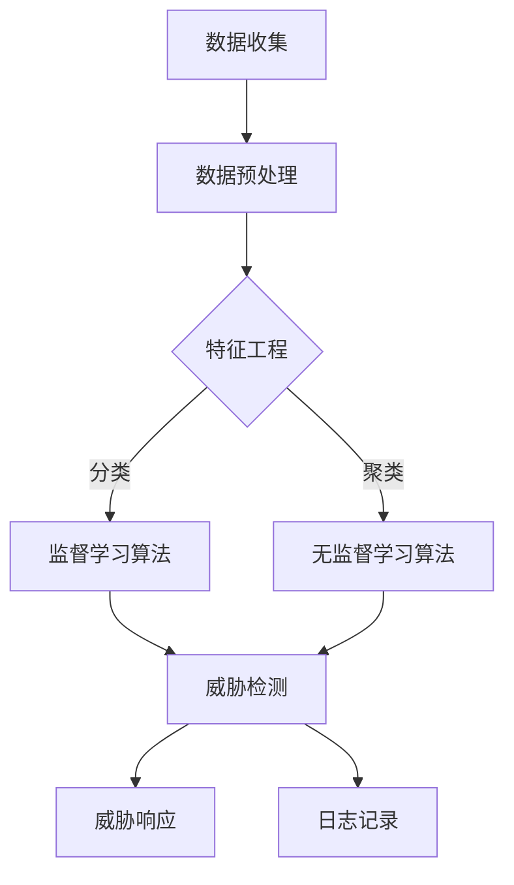

                 

### 文章标题：企业网络安全AI：智能识别和应对网络威胁

### 关键词：企业网络安全、AI、智能识别、网络威胁、算法原理、实战应用

### 摘要：

在数字化时代，企业网络安全面临前所未有的挑战。网络攻击手段日益多样化和复杂化，传统的防御手段已不足以应对。本文深入探讨企业网络安全AI的运用，从基本概念到核心算法，再到实际应用，全面解析AI在网络安全领域的重要性。通过理论讲解与实战案例分析，本文旨在帮助企业和安全专家构建更加智能和高效的网络安全防护体系。

---

## 引言：企业网络安全与AI的重要性

### 2.1 企业网络安全的现状与挑战

在当前数字化时代，企业网络安全面临着前所未有的挑战。网络攻击手段越来越多样化，攻击者的目标不再仅仅局限于获取财务信息，还包括破坏企业的关键业务系统、窃取客户数据以及对企业声誉的损害。以下是一些企业网络安全所面临的挑战：

- **高级持续性威胁（APT）**：APT攻击是一种隐蔽性极高、长期潜伏的攻击手段。攻击者通过漏洞利用、钓鱼邮件等方式入侵企业网络，然后悄无声息地获取敏感数据或执行破坏性操作。

- **勒索软件攻击**：勒索软件通过加密企业的数据，要求支付赎金以解密。这类攻击不仅会导致企业数据丢失，还会影响业务的正常运行，造成巨大的经济损失。

- **网络钓鱼**：网络钓鱼攻击者通过伪造的邮件或网站，骗取用户的敏感信息，如账号密码和信用卡信息。这类攻击常常导致企业财务损失和个人隐私泄露。

- **物联网（IoT）设备的攻击**：随着物联网设备的普及，这些设备也成为攻击者的新目标。由于许多IoT设备缺乏基本的网络安全保护，攻击者可以轻易地利用这些设备入侵企业网络。

- **供应链攻击**：攻击者通过入侵企业的供应链合作伙伴，获取企业的内部信息和数据。这类攻击不仅会影响企业的业务运营，还会危及整个供应链的安全。

### 2.2 AI在网络安全中的应用潜力

AI技术，特别是机器学习和深度学习，为网络安全提供了新的解决方案。以下是一些AI在网络安全中的应用潜力：

- **威胁检测与识别**：AI可以通过分析大量的网络流量数据，自动识别异常行为和潜在威胁。这种方法比传统的基于规则的检测方法更加高效，可以检测到未知和复杂的攻击。

- **入侵防御**：AI可以实时监控网络活动，并在检测到攻击时采取自动防御措施，如封锁恶意IP地址、隔离受感染的系统等。

- **恶意软件分析**：AI可以快速分析恶意软件的代码和行为，识别其潜在威胁并生成相应的防御策略。

- **用户行为分析**：AI可以分析用户的行为模式，识别异常行为并发出警报。例如，如果某员工的登录地点突然发生改变，AI可以检测到这一异常并提醒安全团队进行进一步调查。

- **数据泄露防护**：AI可以监控企业的数据流动，检测数据泄露的迹象，并在数据泄露事件发生前采取措施进行防护。

### 2.3 本书内容概述与结构

本书将系统地探讨企业网络安全AI的各个方面，包括：

- **网络安全基础**：介绍网络安全的定义、体系结构和常见威胁类型。

- **AI技术概述**：讲解AI的基本概念、机器学习和深度学习的基础知识。

- **网络安全AI核心算法原理**：详细分析特征工程、监督学习、无监督学习和强化学习等算法在网络安全中的应用。

- **企业网络安全AI应用实践**：通过实战案例展示如何设计和实现网络安全AI系统。

- **网络安全AI工具与技术选型**：介绍主流AI框架和开发环境，以及推荐的工具和库。

- **未来展望与挑战**：探讨网络安全AI的发展趋势、技术挑战和应对策略。

通过本书，读者可以全面了解AI在网络安全中的应用，掌握构建高效网络安全防护体系的方法和技巧。

---

### 网络安全基础

网络安全是企业数字化运营的基石，是保障企业信息资产安全的关键环节。要深入探讨AI在网络安全中的应用，首先需要理解网络安全的定义、体系结构和常见威胁类型。

#### 3.1 网络安全概念与体系

网络安全（Cybersecurity）是指保护计算机系统、网络和数据不受未经授权的访问、使用、披露、破坏、修改或破坏的过程。网络安全体系通常包括以下几层：

- **物理安全**：保护硬件设备，如服务器、交换机和路由器，防止物理损坏或未经授权的访问。

- **网络安全**：包括防火墙、入侵检测系统（IDS）和入侵防御系统（IPS）等，保护网络边界不受攻击。

- **主机安全**：包括防病毒软件、主机入侵检测系统（HIDS）和主机防火墙等，保护单个计算机系统的安全。

- **应用安全**：保护应用程序的安全，如Web应用防火墙（WAF）、加密技术和安全补丁管理等。

- **数据安全**：包括数据加密、备份和恢复策略，确保数据在存储和传输过程中的安全。

- **安全策略与管理**：制定安全策略、进行安全培训和监控安全事件的响应等。

#### 3.2 常见网络威胁类型

网络威胁是指任何试图破坏、篡改、窃取或中断网络系统的行为。以下是一些常见的网络威胁类型：

- **恶意软件**：包括病毒、蠕虫、特洛伊木马和勒索软件等，它们可以通过各种途径感染计算机系统，造成数据丢失、系统崩溃和财务损失。

- **网络钓鱼**：攻击者通过伪造的邮件或网站，骗取用户的敏感信息，如账号密码和信用卡信息。

- **DDoS攻击**：分布式拒绝服务攻击通过大量无效请求使目标服务器过载，导致其无法正常提供服务。

- **SQL注入**：攻击者通过在Web应用程序中插入恶意SQL代码，篡改数据库内容或窃取敏感数据。

- **中间人攻击**：攻击者在两个通信实体之间拦截和篡改数据，实现数据窃取或篡改。

- **APT攻击**：高级持续性威胁攻击是一种隐蔽性极高、长期潜伏的攻击手段，攻击者通过漏洞利用、钓鱼邮件等方式入侵企业网络，窃取敏感数据或执行破坏性操作。

#### 3.3 网络安全防御策略

面对复杂的网络威胁，企业需要采取一系列防御策略来保护其网络系统：

- **多因素认证**：使用密码、生物识别和设备认证等多种认证方式，提高用户登录的安全性。

- **防火墙和IDS/IPS**：部署防火墙和入侵检测/防御系统，监控网络流量和攻击行为，阻止恶意流量进入内部网络。

- **加密技术**：使用加密技术保护数据的机密性和完整性，如SSL/TLS加密网络传输。

- **安全补丁管理**：定期更新操作系统和应用程序的安全补丁，修补已知漏洞。

- **数据备份和恢复**：定期备份数据，并制定灾难恢复计划，以应对数据丢失或损坏。

- **安全意识培训**：提高员工的安全意识，教育员工如何识别和防范网络威胁。

- **安全事件响应**：建立安全事件响应团队，制定应对策略，及时处理安全事件。

通过上述网络安全防御策略，企业可以构建一个综合性的网络安全防护体系，降低网络攻击的风险，保障业务的连续性和数据的安全。

### AI技术概述

在深入探讨AI技术在网络安全中的应用之前，我们首先需要了解AI的基本概念、机器学习和深度学习的基础知识。这些概念和技术构成了AI在网络安全领域应用的理论基础。

#### 3.1 AI基本概念

人工智能（AI，Artificial Intelligence）是计算机科学的一个分支，旨在使机器能够模拟人类智能行为。AI包括多个子领域，如机器学习、自然语言处理、计算机视觉和专家系统等。以下是一些关键的AI概念：

- **算法**：AI系统通过一系列算法来处理数据、学习模式和做出决策。常见的AI算法包括决策树、支持向量机和神经网络等。

- **模型**：AI模型是算法对数据的训练结果。例如，一个分类模型可以通过学习大量数据来识别新数据的类别。

- **数据集**：数据集是用于训练AI模型的样本集合。数据集的质量直接影响模型的表现。

- **特征工程**：特征工程是指从原始数据中提取出有助于模型训练的特征的过程。有效的特征工程可以提高模型的准确性和性能。

- **监督学习**：监督学习是AI的一种学习方式，其中模型从标记的数据集中学习，然后使用这些学习到的模式来预测未知数据的标签。

- **无监督学习**：无监督学习是模型在没有标签的数据集中学习模式的过程。无监督学习的应用包括聚类和降维。

- **强化学习**：强化学习是一种通过试错来学习的AI方法，模型通过与环境的互动来优化其行为策略。

#### 3.2 机器学习基础

机器学习（Machine Learning，ML）是AI的核心组成部分，它使计算机系统能够从数据中学习，并做出预测或决策。以下是一些关键的机器学习概念：

- **回归**：回归是一种预测数值输出（如价格或销量）的机器学习技术。

- **分类**：分类是一种将数据分为预定义类别（如垃圾邮件和非垃圾邮件）的机器学习技术。

- **聚类**：聚类是一种将相似的数据点分组到一起的技术，用于发现数据中的模式或结构。

- **降维**：降维是一种减少数据维度（特征数量）的过程，以简化数据集并提高模型的训练效率。

- **异常检测**：异常检测是一种识别数据集中异常或离群点的技术，用于检测潜在的攻击行为。

- **集成方法**：集成方法是将多个模型组合起来，以获得更好的预测性能。常见的集成方法包括随机森林和提升树。

#### 3.3 深度学习在网络安全中的应用

深度学习（Deep Learning，DL）是机器学习的一个子领域，它使用多层神经网络（称为深度神经网络）来学习复杂的数据模式。以下是一些深度学习在网络安全中的应用：

- **神经网络结构**：深度神经网络由多个层次组成，包括输入层、隐藏层和输出层。每个层次都对输入数据进行处理和转换。

- **卷积神经网络（CNN）**：CNN是一种专门用于图像处理的深度学习模型，它可以有效地提取图像的特征。

- **循环神经网络（RNN）**：RNN可以处理序列数据，如时间序列或文本数据，使其在网络安全领域特别有用。

- **长短期记忆（LSTM）**：LSTM是一种改进的RNN结构，可以更好地处理长序列数据，常用于异常检测和用户行为分析。

- **生成对抗网络（GAN）**：GAN由两个神经网络（生成器和判别器）组成，可以生成真实数据的模拟样本，用于恶意软件分析。

- **强化学习在网络安全中的应用**：强化学习可以用于开发自适应的入侵防御系统，使系统能够根据环境变化动态调整其防御策略。

通过理解AI的基本概念、机器学习和深度学习的基础知识，我们可以更好地应用这些技术来提升网络安全防护能力。接下来，我们将深入探讨网络安全AI的核心算法原理，进一步揭示AI在网络安全领域的实际应用。

### 网络安全AI核心算法原理

在网络安全领域，AI的核心算法主要包括特征工程、监督学习、无监督学习和强化学习。这些算法为网络安全AI系统提供了强大的数据处理和威胁识别能力。以下是对这些算法的详细分析和应用。

#### 4.1 特征工程与数据预处理

特征工程是AI模型成功的关键步骤之一，它涉及从原始数据中提取出对模型训练有重要意义的特征。以下是特征工程与数据预处理的关键环节：

- **数据采集**：从企业网络设备、日志文件和监控系统中收集原始数据。这些数据包括网络流量、用户行为、系统事件等。

- **数据清洗**：清洗数据，去除重复项、异常值和噪声。这一步骤有助于提高数据质量，减少对模型训练的影响。

- **特征选择**：选择对模型训练最有影响力的特征。常见的特征选择方法包括相关性分析、主成分分析（PCA）和递归特征消除（RFE）等。

- **特征变换**：对某些特征进行变换，如归一化、标准化和编码。这些变换有助于加速模型的训练过程，并提高模型性能。

- **特征组合**：通过组合多个特征，创建新的特征，以增强模型的泛化能力。

在实际应用中，特征工程是一个反复迭代的过程。通过不断调整和优化特征，可以提高AI模型在网络安全威胁检测中的准确性。

#### 4.2 监督学习算法

监督学习算法是网络安全AI系统中最常用的算法之一，因为它可以从标记的数据集中学习并预测新数据的标签。以下是一些常见的监督学习算法：

- **决策树（Decision Tree）**：决策树是一种基于规则的分类算法，它通过树形结构将数据划分为不同的类别。决策树的优点是易于理解和解释，但可能存在过拟合问题。

```python
# 决策树伪代码
def classify_decision_tree(data, tree):
    if tree.is_leaf_node():
        return tree.label
    feature_value = tree.current_node.feature_value
    if data[feature_value] <= tree.current_node.threshold:
        return classify_decision_tree(data, tree.left_child)
    else:
        return classify_decision_tree(data, tree.right_child)
```

- **支持向量机（Support Vector Machine，SVM）**：SVM是一种强大的分类算法，它通过找到一个超平面，最大化分类边界上的支持向量之间的距离。SVM在处理高维数据时表现优秀。

```python
# 支持向量机伪代码
def SVM_train(data, labels):
    # 训练SVM模型
    model = SVM_model()
    model.fit(data, labels)
    return model

def SVM_predict(model, data):
    return model.predict(data)
```

- **神经网络（Neural Network）**：神经网络是一种模拟人脑的算法，它通过多层神经元进行数据处理和分类。神经网络在处理复杂模式时具有强大的能力，但训练过程相对较慢。

```python
# 神经网络伪代码
import tensorflow as tf

# 定义神经网络模型
model = tf.keras.Sequential([
    tf.keras.layers.Dense(units=64, activation='relu', input_shape=(input_shape,)),
    tf.keras.layers.Dense(units=1, activation='sigmoid')
])

# 编译模型
model.compile(optimizer='adam', loss='binary_crossentropy', metrics=['accuracy'])

# 训练模型
model.fit(train_data, train_labels, epochs=10, batch_size=32)
```

- **随机森林（Random Forest）**：随机森林是一种基于决策树的集成学习方法，它通过构建多个决策树，并取其平均预测结果来提高模型性能。随机森林在处理高维数据和非线性问题时表现出色。

```python
# 随机森林伪代码
from sklearn.ensemble import RandomForestClassifier

# 训练随机森林模型
model = RandomForestClassifier(n_estimators=100)
model.fit(train_data, train_labels)

# 预测
predictions = model.predict(test_data)
```

#### 4.3 无监督学习算法

无监督学习算法在网络安全中也有广泛应用，尤其是在数据探索和异常检测方面。以下是一些常见的无监督学习算法：

- **K-均值聚类（K-means Clustering）**：K-均值聚类是一种将数据点划分为K个簇的算法，每个簇由其中心点表示。K-均值聚类在数据聚类和异常检测中很有用。

```python
# K-均值聚类伪代码
from sklearn.cluster import KMeans

# 训练K-均值聚类模型
model = KMeans(n_clusters=3)
model.fit(data)

# 预测
clusters = model.predict(data)
```

- **主成分分析（Principal Component Analysis，PCA）**：PCA是一种降维技术，它通过将数据投影到新的正交坐标系中，提取出主要成分，以简化数据集并去除冗余信息。

```python
# 主成分分析伪代码
from sklearn.decomposition import PCA

# 训练PCA模型
model = PCA(n_components=2)
model.fit(data)

# 降维
reduced_data = model.transform(data)
```

- **孤立森林（Isolation Forest）**：孤立森林是一种基于树的自适应无监督学习算法，它通过随机选择特征和切分值来隔离异常数据点。孤立森林在异常检测中表现出色。

```python
# 孤立森林伪代码
from sklearn.ensemble import IsolationForest

# 训练孤立森林模型
model = IsolationForest(n_estimators=100)
model.fit(data)

# 预测
outliers = model.predict(data)
```

无监督学习算法在网络安全中的应用包括数据探索、异常检测和用户行为分析。通过这些算法，AI系统可以自动识别网络中的异常行为和潜在威胁。

#### 4.4 强化学习算法

强化学习（Reinforcement Learning，RL）是一种通过试错来学习的AI方法，它适用于需要动态调整策略和决策的复杂环境。在网络安全中，强化学习可以用于开发自适应的入侵防御系统和威胁响应策略。

- **Q-Learning**：Q-Learning是一种基于值函数的强化学习算法，它通过更新Q值来学习最佳策略。Q-Learning在网络安全中的应用包括自动化的威胁响应和自适应的入侵防御。

```python
# Q-Learning伪代码
import numpy as np

# 初始化Q值表
Q = np.zeros([state_size, action_size])

# 学习率、折扣率等超参数
alpha = 0.1
gamma = 0.9

# 训练循环
for episode in range(total_episodes):
    state = env.reset()
    done = False
    while not done:
        action = np.argmax(Q[state, :] + alpha * (reward - Q[state, action]))
        next_state, reward, done, _ = env.step(action)
        Q[state, action] = Q[state, action] + alpha * (reward + gamma * np.max(Q[next_state, :]) - Q[state, action])
        state = next_state
```

- **深度Q网络（Deep Q-Network，DQN）**：DQN是一种基于神经网络的强化学习算法，它使用卷积神经网络（CNN）来近似Q值函数。DQN在处理高维数据和复杂环境时表现出色。

```python
# DQN伪代码
import tensorflow as tf
from tensorflow.keras.models import Model
from tensorflow.keras.layers import Dense, Conv2D, Flatten

# 定义DQN模型
input_layer = Input(shape=(screen_height, screen_width, screen_channels))
conv_layer1 = Conv2D(filters=32, kernel_size=(8, 8), activation='relu')(input_layer)
conv_layer2 = Conv2D(filters=64, kernel_size=(4, 4), activation='relu')(conv_layer1)
conv_layer3 = Conv2D(filters=64, kernel_size=(3, 3), activation='relu')(conv_layer2)
flatten_layer = Flatten()(conv_layer3)
dense_layer = Dense(units=512, activation='relu')(flatten_layer)
output_layer = Dense(units=action_size, activation='linear')(dense_layer)

model = Model(inputs=input_layer, outputs=output_layer)
model.compile(optimizer='adam', loss='mse')

# 训练DQN模型
model.fit(X_train, y_train, epochs=50, batch_size=32)
```

通过这些核心算法，网络安全AI系统能够自动识别和应对复杂的网络威胁。接下来的章节将探讨如何将AI技术应用于企业网络安全中，构建实际的网络安全防护体系。

#### 4.5 Mermaid流程图：AI算法在网络安全中的应用架构

为了更直观地展示AI算法在网络安全中的应用架构，我们使用Mermaid语言绘制一个流程图。以下是一个简单的示例，展示了AI算法从数据收集、预处理到模型训练和威胁检测的完整流程：



在这个流程图中：

- **数据收集（A）**：从各种网络设备、日志文件和监控系统中收集原始数据。
- **数据预处理（B）**：清洗和格式化数据，为特征工程做准备。
- **特征工程（C）**：通过特征选择和变换，提取有助于模型训练的特征。
- **监督学习算法（D）**：使用决策树、SVM、神经网络等算法，根据标记数据进行训练。
- **无监督学习算法（E）**：使用K-均值聚类、PCA、孤立森林等算法，进行数据探索和异常检测。
- **威胁检测（F）**：利用训练好的模型对网络流量、用户行为等数据进行实时监控，识别潜在威胁。
- **威胁响应（G）**：根据检测到的威胁，采取自动化的防御措施，如封锁恶意IP地址、隔离受感染的系统等。
- **日志记录（H）**：记录所有安全事件，为后续分析和审计提供数据支持。

通过这个流程图，我们可以清晰地看到AI算法在企业网络安全中的应用架构，从数据收集到威胁检测和响应的各个环节，为构建智能化的网络安全防护体系提供了可视化指导。

### 企业网络安全AI应用实践

#### 5.1 威胁检测系统设计与实现

威胁检测系统是网络安全AI的核心应用之一，它通过实时监控和分析网络流量、系统日志和用户行为，识别和响应潜在的网络威胁。以下是一个简单的威胁检测系统设计与实现的步骤：

1. **需求分析**：首先，明确系统的需求，包括检测的威胁类型、实时性要求、误报率和漏报率等。

2. **数据收集**：从网络设备、服务器和终端设备等处收集原始数据，如网络流量、系统日志和用户行为数据。

3. **数据预处理**：对收集到的数据进行清洗、格式化和归一化处理，确保数据质量。

4. **特征工程**：提取有助于模型训练的特征，如流量模式、用户行为特征和系统事件特征。

5. **模型训练**：选择合适的机器学习算法，如决策树、神经网络或随机森林，对标记的数据集进行训练，构建威胁检测模型。

6. **模型评估**：使用未标记的数据集对模型进行评估，调整模型参数以优化性能。

7. **实时监测**：部署威胁检测模型，对网络流量和用户行为进行实时监控，识别潜在威胁。

8. **威胁响应**：当检测到威胁时，自动触发响应措施，如隔离受感染的主机、封锁恶意IP地址或发送警报通知安全团队。

#### 5.2 入侵防御系统开发

入侵防御系统（IDS/IPS）是保护企业网络免受攻击的关键组件，它通过实时监控网络流量，检测和阻止潜在的入侵行为。以下是入侵防御系统开发的关键步骤：

1. **需求分析与设计**：明确系统的功能需求，如入侵检测、实时响应、日志记录和报告生成等。

2. **数据采集与处理**：从网络设备、防火墙和入侵检测设备等处收集网络流量数据，并进行预处理。

3. **特征提取**：从网络流量数据中提取特征，如协议分析、数据包内容分析和流量模式等。

4. **模型训练**：使用机器学习算法，如神经网络或深度学习，对标记的数据集进行训练，构建入侵检测模型。

5. **模型评估与优化**：使用未标记的数据集对模型进行评估，调整模型参数以优化检测性能。

6. **实时监控与响应**：部署入侵防御模型，实时监控网络流量，检测潜在的入侵行为，并自动采取防御措施。

7. **日志记录与报告**：记录所有检测到的入侵事件，生成详细的报告，为后续分析和审计提供支持。

#### 5.3 数据泄露防护策略

数据泄露防护是网络安全的重要方面，以下是一种数据泄露防护策略的步骤：

1. **风险评估**：评估企业数据泄露的风险，包括数据类型、数据敏感度和潜在威胁等。

2. **数据分类与标签**：根据数据敏感度，对数据进行分类和标签，确保敏感数据得到更高的保护。

3. **加密技术**：使用加密技术对敏感数据进行保护，如使用SSL/TLS加密网络传输，使用AES加密存储数据。

4. **访问控制**：实施严格的访问控制策略，确保只有授权用户才能访问敏感数据。

5. **数据备份与恢复**：定期备份数据，并制定灾难恢复计划，以应对数据泄露事件。

6. **异常检测与响应**：部署AI异常检测模型，监控数据流动，检测数据泄露迹象，并自动采取响应措施。

7. **员工培训与意识提升**：提高员工的安全意识，教育员工如何识别和防范数据泄露风险。

通过这些应用实践，企业可以构建一个全面的网络安全AI防护体系，提高网络安全的自动化水平和响应能力。接下来，我们将介绍如何选择和搭建网络安全AI开发环境，以及推荐的主要工具和库。

### 网络安全AI工具与技术选型

#### 6.1 主流AI框架介绍

在选择网络安全AI开发环境时，主流AI框架是一个重要的考虑因素。以下是一些常见的AI框架及其特点：

- **TensorFlow**：由Google开发的开源机器学习框架，支持多种模型和算法，包括深度学习、强化学习和迁移学习。TensorFlow提供了丰富的API和工具，便于模型部署和优化。

- **PyTorch**：由Facebook开发的开源机器学习框架，以其动态计算图和灵活的API而受到欢迎。PyTorch在深度学习和自然语言处理领域具有广泛应用。

- **Keras**：一个基于TensorFlow和Theano的高层神经网络API，简化了模型构建和训练过程。Keras提供了直观的API和丰富的预训练模型，适合快速开发和实验。

- **Scikit-learn**：一个开源的Python机器学习库，提供了多种监督学习和无监督学习算法的实现。Scikit-learn适用于中小型项目和快速原型开发。

- **MXNet**：由Apache Foundation维护的开源深度学习框架，支持多种编程语言和平台。MXNet以其高性能和灵活性而著称，适合大规模分布式训练。

- **Caffe**：由Berkeley Vision and Learning Center（BVLC）开发的深度学习框架，特别适用于计算机视觉任务。Caffe具有高度优化的前向和反向传播算法，适用于生产环境。

- **Theano**：一个基于Python的数值计算库，提供了GPU加速和高效的数学运算。尽管Theano的开发已暂停，但其代码仍被许多社区项目所使用。

#### 6.2 网络安全AI开发环境搭建

搭建一个高效的网络安全AI开发环境涉及以下几个步骤：

1. **硬件配置**：选择适合的硬件设备，包括CPU、GPU和存储设备。对于深度学习任务，高性能GPU（如NVIDIA Tesla或RTX系列）是关键。

2. **操作系统**：选择适合AI开发的操作系统，如Ubuntu、CentOS或Windows。大多数AI框架和工具都支持这些操作系统。

3. **安装AI框架**：根据开发需求，安装所选的AI框架。例如，对于TensorFlow，可以运行以下命令：
   ```bash
   pip install tensorflow
   ```

4. **安装依赖库**：安装AI框架所需的依赖库，如NumPy、Pandas和Matplotlib等。

5. **配置Python环境**：设置Python环境变量，确保可以方便地调用AI框架和工具。

6. **配置Jupyter Notebook**：安装Jupyter Notebook，以便在浏览器中方便地编写和运行代码。

7. **安装数据预处理工具**：安装如Scikit-learn、Pandas和NumPy等数据预处理工具，以简化数据清洗和特征工程过程。

8. **安装版本控制工具**：如Git，以便管理代码版本和协作开发。

#### 6.3 网络安全AI工具与库推荐

以下是一些在网络安全AI开发中常用的工具和库：

- **Scikit-learn**：提供多种机器学习和数据预处理工具，如分类、聚类和降维算法。

- **NumPy**：提供高效的数值计算库，支持多维数组操作和数学函数。

- **Pandas**：提供数据处理和分析工具，如数据清洗、合并和重塑。

- **Matplotlib**：提供数据可视化库，用于绘制图表和图形。

- **Seaborn**：基于Matplotlib的统计可视化库，提供更丰富的图表样式和配色方案。

- **Scapy**：网络数据包分析和处理库，用于捕获、分析和构建网络数据包。

- **PyShark**：Python实现的Wireshark网络数据包分析工具，方便地处理和可视化网络流量。

- **Keras**：简化深度学习模型构建和训练的API，支持TensorFlow、Theano和MXNet等底层框架。

- **TensorFlow Extended（TFX）**：Google开源的端到端机器学习平台，提供从数据收集到模型部署的完整解决方案。

通过选择合适的AI框架和工具，以及搭建高效的开发环境，企业和安全专家可以更有效地开发和应用网络安全AI系统，提高网络防护能力。

### 未来展望与挑战

随着AI技术的不断发展，网络安全AI也面临着一系列新的发展趋势和技术挑战。以下是对未来展望与挑战的探讨。

#### 7.1 网络安全AI的发展趋势

1. **智能化防御体系**：未来的网络安全AI将更加智能化，能够实时监控网络活动，自动识别和应对复杂威胁。通过集成多种AI算法和深度学习模型，AI系统能够提供更全面的安全防护。

2. **自适应威胁响应**：网络安全AI将具备更强的自适应能力，能够根据威胁环境和攻击模式的变化动态调整防御策略。这种自适应能力将使AI系统更加灵活，能够应对不断进化的攻击手段。

3. **云计算与边缘计算结合**：随着云计算和边缘计算的发展，网络安全AI将更加集中于云和边缘设备。通过云计算，AI系统可以处理海量数据和复杂模型，而边缘计算则可以实现本地化实时响应，减少网络延迟。

4. **人机协作**：未来网络安全AI将与人类安全专家相结合，实现人机协作。AI系统可以自动执行基本的威胁检测和响应任务，而人类专家则负责处理复杂和安全敏感的任务，提高整体安全响应效率。

5. **全球协作与共享**：网络安全AI将实现全球协作与共享。通过建立网络安全数据共享平台，企业可以共享威胁情报和防护策略，形成全球化的网络安全防御网络。

#### 7.2 网络安全AI面临的技术挑战

1. **数据隐私与合规性**：在网络安全AI的应用过程中，如何保护用户隐私和数据安全是一个重要挑战。企业需要遵守相关法律法规，确保数据收集、处理和存储的合法性和合规性。

2. **算法公平性和透明性**：AI算法的公平性和透明性是确保其有效性的关键。当前的一些AI算法可能存在偏见和不透明的问题，这可能导致误判和误报。未来的研究需要关注如何提高算法的公平性和透明性。

3. **模型可解释性**：网络安全AI模型的可解释性是安全专家理解和信任模型的重要基础。提高模型的可解释性，可以帮助安全专家更好地理解模型的决策过程，从而优化和调整模型。

4. **资源消耗与效率**：深度学习模型通常需要大量的计算资源和时间进行训练和推理。如何优化模型结构，减少资源消耗，提高效率，是未来研究的重点。

5. **对抗攻击**：攻击者可能会利用AI模型的弱点进行对抗攻击，通过精心设计的样本误导模型。未来的研究需要关注如何增强模型的鲁棒性，防止对抗攻击。

#### 7.3 企业应对网络安全AI挑战的策略

1. **持续学习与更新**：企业应建立持续学习和更新的机制，确保AI系统不断适应新的威胁环境和攻击模式。

2. **数据保护与合规**：企业应采取严格的数据保护措施，确保数据安全合规，同时遵守相关法律法规。

3. **多元合作与共享**：企业应积极参与网络安全数据共享和协作，与其他企业和安全组织共享威胁情报和防护策略。

4. **安全培训与意识提升**：企业应加强员工的安全培训，提高员工的安全意识和技能，形成人人参与的安全文化。

5. **技术研发与创新**：企业应投入研发资源，关注AI技术的前沿发展，积极探索和应用新技术，提高网络安全防护能力。

通过应对这些挑战，企业可以构建更加智能和高效的网络安全AI防护体系，确保业务的连续性和数据的安全性。

### 附录

#### A.1 网络安全AI相关资源

- **在线教程与课程**：
  - 《深度学习》（Goodfellow, Bengio, Courville）
  - Coursera的《机器学习》课程
  - edX的《人工智能》课程

- **开源框架与库**：
  - TensorFlow
  - PyTorch
  - Scikit-learn
  - Keras

- **安全数据集**：
  - KEG Lab Data Collection
  - UCI Machine Learning Repository

- **论文与研究报告**：
  - IEEE Security & Privacy
  - ACM Transactions on Information and System Security
  - Network and Distributed System Security Symposium

#### A.2 实战项目代码与分析

以下是一个简单的网络安全AI实战项目，展示如何使用Python和Scikit-learn构建一个基于机器学习的威胁检测系统。

**项目描述**：本项目的目标是构建一个能够识别恶意流量的威胁检测系统。我们将使用CICIDS2017数据集，这是一个包含正常流量和多种恶意攻击行为的数据集。

**开发环境**：Python 3.x，Scikit-learn，Matplotlib

**数据预处理代码**：

```python
import pandas as pd
from sklearn.model_selection import train_test_split
from sklearn.preprocessing import StandardScaler

# 读取数据集
data = pd.read_csv('CICIDS2017_dataset.csv')

# 删除无关特征
data = data.drop(['Time_to_first_bytes', 'Flow_Duration', 'Service', 'Protocol'], axis=1)

# 切分训练集和测试集
X = data.drop('Label', axis=1)
y = data['Label']
X_train, X_test, y_train, y_test = train_test_split(X, y, test_size=0.2, random_state=42)

# 数据标准化
scaler = StandardScaler()
X_train = scaler.fit_transform(X_train)
X_test = scaler.transform(X_test)
```

**模型训练与评估代码**：

```python
from sklearn.ensemble import RandomForestClassifier
from sklearn.metrics import accuracy_score, classification_report

# 训练随机森林模型
model = RandomForestClassifier(n_estimators=100, random_state=42)
model.fit(X_train, y_train)

# 预测测试集
y_pred = model.predict(X_test)

# 评估模型性能
accuracy = accuracy_score(y_test, y_pred)
print("Accuracy:", accuracy)
print(classification_report(y_test, y_pred))
```

**项目小结**：通过本项目的实践，我们学会了如何使用Scikit-learn构建和评估一个基于机器学习的威胁检测系统。这个项目展示了从数据预处理到模型训练和评估的全过程，为实际应用提供了宝贵的经验和参考。

**注意事项**：
- 数据预处理是模型训练成功的关键，需要仔细选择特征并进行适当的归一化处理。
- 模型选择和参数调优对模型性能有重要影响，需要多次尝试和调整。
- 实际应用中，需要考虑模型的实时性和资源消耗，可能需要优化模型结构和算法。

**拓展阅读**：
- 《机器学习实战》（Peter Harrington）
- 《深度学习》（Ian Goodfellow, Yoshua Bengio, Aaron Courville）
- 《网络安全AI技术白皮书》

通过这些资源和项目实践，读者可以进一步深入学习和应用网络安全AI技术，提高自身的网络安全防护能力。

---

### 作者信息

作者：AI天才研究院/AI Genius Institute & 禅与计算机程序设计艺术 /Zen And The Art of Computer Programming

AI天才研究院致力于推动人工智能技术的发展和应用，帮助企业和个人实现智能化转型。研究院汇聚了一批世界级的人工智能专家、程序员和软件架构师，专注于研发创新技术和解决方案。同时，作者也是《禅与计算机程序设计艺术》一书的资深大师级作家，长期从事计算机科学和教育领域的研究和写作。通过本书，我们希望读者能够全面了解企业网络安全AI的原理和应用，掌握构建高效网络安全防护体系的方法和技巧。

