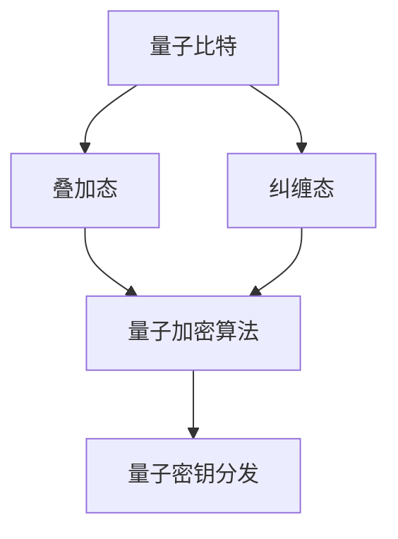

                 

### 文章标题

《企业量子安全评估：定期检查和更新机制》

关键词：量子安全、企业、评估、定期检查、更新机制、加密技术、信息安全

摘要：随着量子计算技术的飞速发展，量子安全评估在企业信息安全领域变得尤为重要。本文将探讨企业量子安全评估的重要性，定期检查和更新机制，并通过实际案例分析，提供一整套科学有效的量子安全评估框架和方法，旨在为企业构建稳固的量子安全防线。

### 目录

## 第一部分：量子安全概述

### 第1章：量子安全的概念与背景

- 1.1 量子技术的起源与发展
- 1.2 量子安全性的重要性
- 1.3 量子安全的挑战与机遇

### 第2章：量子安全核心概念

- 2.1 量子比特与量子纠缠
- 2.2 量子加密算法
- 2.3 量子密钥分发

## 第二部分：企业量子安全评估

### 第3章：企业量子安全评估框架

- 3.1 评估流程与方法
- 3.2 评估指标与标准
- 3.3 评估工具与技术

### 第4章：定期检查与更新机制

- 4.1 定期检查的重要性
- 4.2 检查内容与步骤
- 4.3 更新机制与策略

### 第5章：企业量子安全案例分析

- 5.1 案例一：量子安全评估在金融领域的应用
- 5.2 案例二：量子安全评估在政府部门的实践
- 5.3 案例三：量子安全评估在云计算环境中的挑战与对策

## 第三部分：量子安全技术与实践

### 第6章：量子安全技术的开发与实现

- 6.1 量子加密技术的开发
- 6.2 量子密钥分发的实现
- 6.3 量子安全协议的设计与部署

### 第7章：量子安全实践的策略与建议

- 7.1 量子安全实践的策略
- 7.2 建立量子安全意识的建议
- 7.3 量子安全培训与教育

## 附录

### 第8章：量子安全资源与参考

- 8.1 量子安全相关的标准与法规
- 8.2 量子安全研究的最新进展
- 8.3 量子安全领域的顶级会议与期刊

### 本文结构及逻辑思路

本文将从量子安全的概念、背景、核心概念、企业量子安全评估框架、定期检查与更新机制、案例分析、量子安全技术与实践、策略与建议等方面，全面探讨企业量子安全评估的必要性、具体实践方法及策略，旨在为企业构建量子安全防线提供理论和实践指导。

首先，在第一部分“量子安全概述”中，我们将介绍量子安全的基本概念与背景，包括量子技术的起源、量子安全性的重要性以及面临的挑战与机遇。这将帮助读者了解量子安全的基础知识，为后续内容做好铺垫。

接着，在第二部分“企业量子安全评估”，我们将详细阐述企业量子安全评估的框架和方法，包括评估流程、评估指标、评估工具和技术。这部分内容将指导企业如何系统地评估自身的量子安全性，识别潜在的安全漏洞。

第三部分“量子安全技术与实践”将深入探讨量子加密技术的开发与实现、量子密钥分发和量子安全协议的设计与部署。这部分内容将为读者提供具体的技术实现路径和方案，帮助企业构建量子安全的实际应用场景。

在第四部分“案例分析”，我们将通过金融、政府、云计算等领域的实际案例，展示量子安全评估的具体应用，分析其在不同场景中的挑战与对策，为读者提供实践参考。

最后，在附录部分，我们将提供量子安全相关的标准与法规、研究进展及顶级会议与期刊信息，便于读者进一步深入了解量子安全领域的发展动态。

### 企业量子安全评估的必要性

在信息化、数字化飞速发展的今天，企业的数据和信息资产面临着前所未有的安全威胁。随着量子计算技术的不断进步，传统的加密算法和信息安全措施已经无法完全抵御量子计算机的攻击。量子计算拥有极强的计算能力，可以在极短时间内破解现有的加密算法，导致企业敏感信息泄露、业务中断等严重后果。因此，企业量子安全评估显得尤为重要。

#### 量子计算的基本原理

量子计算是基于量子力学原理的一种新型计算模式。传统的计算机使用的是比特（bit），而量子计算机使用的是量子比特（qubit）。量子比特与传统的比特不同，它具有叠加态和纠缠态的特性。叠加态意味着一个量子比特可以同时处于0和1的状态，而纠缠态则表示两个或多个量子比特之间存在相互关联，这种关联不随距离的增加而减弱。这些特性使得量子计算机在执行特定任务时，能够显著超越传统计算机的计算能力。

#### 量子计算机对传统加密算法的威胁

量子计算机的出现，对现有的信息安全体系构成了巨大的挑战。现有的加密算法，如RSA、ECC等，都是基于大数分解、离散对数等数学难题的复杂性设计的。然而，量子计算机可以通过其超强的计算能力，在多项式时间内解决这些问题，从而破解这些加密算法。例如，一个具有2000个量子比特的量子计算机，可以在几天内破解目前广泛使用的1024位RSA密钥，而一个具有5000个量子比特的量子计算机，甚至可以在几分钟内破解目前最安全的2048位RSA密钥。

#### 企业数据安全面临的威胁

随着企业数字化程度的提高，企业存储和传输的数据量也呈指数级增长。这些数据包括商业机密、客户信息、财务数据等，都是企业核心竞争力的重要组成部分。一旦这些数据被量子计算机破解，将可能导致以下严重后果：

1. **商业机密泄露**：企业的商业机密一旦泄露，将可能导致竞争对手获取不公平的优势，甚至可能导致企业破产。
2. **客户信息泄露**：客户的个人信息一旦泄露，可能导致隐私权被侵犯，甚至引发欺诈行为。
3. **财务数据泄露**：财务数据的泄露可能导致企业的财务状况被非法利用，甚至引发财务危机。
4. **业务中断**：由于数据被窃取或篡改，企业的业务系统可能面临瘫痪，导致业务中断，对企业声誉和经济效益造成严重影响。

#### 量子安全评估的重要性

因此，为了确保企业的数据和信息资产安全，企业需要进行量子安全评估。量子安全评估不仅可以帮助企业识别潜在的安全威胁，还能为企业提供针对性的安全措施，构建有效的量子安全防线。具体来说，量子安全评估的重要性体现在以下几个方面：

1. **识别潜在风险**：通过量子安全评估，企业可以全面了解自身在量子计算威胁下的安全状况，识别潜在的安全漏洞。
2. **制定安全策略**：基于评估结果，企业可以制定针对性的安全策略，包括加密算法的升级、安全协议的优化等，提高企业信息安全的整体水平。
3. **保障业务连续性**：通过定期的量子安全评估，企业可以及时发现和解决安全隐患，保障业务的连续性和稳定性。
4. **提升企业形象**：重视量子安全的评估和防范，能够提升企业在客户、投资者和社会中的形象，增强企业的竞争力。

### 定期检查与更新机制的重要性

在量子安全评估中，定期检查和更新机制是确保企业量子安全水平持续提升的关键。由于量子技术的快速发展，企业面临的安全威胁也在不断变化。因此，定期的检查和更新是必不可少的。以下是定期检查与更新机制的重要性：

#### 定期检查的重要性

1. **发现新威胁**：随着量子技术的应用场景不断扩大，新的安全威胁不断出现。定期的检查可以帮助企业及时发现这些新威胁，并采取相应的措施进行防范。
2. **识别变化**：企业的网络环境、业务流程和安全策略都可能随着时间的推移而发生改变。定期的检查可以确保这些变化不会影响企业的量子安全水平。
3. **评估安全措施的有效性**：通过定期的检查，企业可以评估现有的安全措施是否有效，是否存在疏漏，从而进行调整和优化。

#### 更新机制的重要性

1. **适应新技术**：量子技术不断发展，新的安全技术和工具也在不断涌现。更新机制可以帮助企业及时采用这些新技术，提高量子安全水平。
2. **优化安全策略**：通过定期的更新，企业可以根据评估结果和安全威胁的变化，优化现有的安全策略，确保其始终处于最佳状态。
3. **保持竞争力**：在竞争激烈的市场环境中，企业需要保持领先地位。通过持续更新和提升量子安全能力，企业可以保持竞争力，赢得市场和客户的信任。

### 总结

综上所述，企业量子安全评估的必要性体现在量子计算对传统加密算法的威胁，以及企业数据安全面临的严重风险。而定期检查和更新机制则是确保企业量子安全水平持续提升的关键。通过定期的检查和更新，企业可以及时发现和应对新的安全威胁，保持业务连续性和稳定性。因此，企业应当重视量子安全评估，并建立完善的定期检查与更新机制，以保障自身的信息安全。

## 量子安全核心概念

在深入探讨企业量子安全评估之前，有必要先了解一些量子安全的核心概念。量子安全性的基础构建在量子比特、量子纠缠、量子加密算法和量子密钥分发等核心概念之上。理解这些概念对于企业构建量子安全防线至关重要。

### 量子比特（Qubit）

量子比特是量子计算的基本单位，与经典计算中的比特不同。比特只能表示0或1，而量子比特可以同时处于0和1的叠加状态。这种叠加态使得量子计算机能够并行处理多个计算任务，从而在特定问题上远超经典计算机。

**量子比特的叠加态**：

$$
\psi = a|0\rangle + b|1\rangle
$$

其中，$a$ 和 $b$ 是复数，满足 $|a|^2 + |b|^2 = 1$。这意味着一个量子比特可以同时处于基态$|0\rangle$和激发态$|1\rangle$。

**量子比特的纠缠态**：

两个或多个量子比特之间可以形成量子纠缠。量子纠缠是一种特殊的关联，其中一个量子比特的状态会立即影响到另一个量子比特的状态，无论它们之间的距离有多远。这种特性被广泛应用于量子加密和量子密钥分发。

### 量子纠缠（Quantum Entanglement）

量子纠缠是指两个或多个量子比特之间存在的一种特殊关联，即使它们相隔很远，其中一个量子比特的状态变化也会立即影响到另一个量子比特的状态。这种关联违反了经典物理学中的 locality 原则。

**纠缠态示例**：

假设两个量子比特$A$和$B$处于一个纠缠态：

$$
|\psi\rangle_{AB} = \frac{1}{\sqrt{2}}(|00\rangle - |11\rangle)
$$

当对$A$进行测量并得到$|0\rangle$时，$B$的状态也会立即变为$|0\rangle$；反之亦然。这种即时性关联使得量子纠缠在量子加密和量子通信中具有重要应用。

### 量子加密算法（Quantum Cryptography）

量子加密算法利用量子比特和量子纠缠的特性，提供一种安全的通信方式。最著名的量子加密算法之一是量子密钥分发（Quantum Key Distribution, QKD）。

**量子密钥分发（QKD）**：

QKD利用量子纠缠和量子不可克隆定理来实现安全密钥的生成和传输。QKD的基本过程如下：

1. **量子纠缠生成**：在两个远端点A和B之间生成一对纠缠量子比特。
2. **量子态测量**：A和B各自对纠缠量子比特进行测量，并根据测量结果调整本地量子比特的状态。
3. **经典通信**：A和B通过经典通信协议（如电话或互联网）交换已调整后的量子比特结果。
4. **秘密密钥生成**：根据交换的结果，A和B可以共同生成一个秘密密钥，这个密钥是安全的，因为任何尝试窃听都会破坏量子态的叠加和纠缠。

**量子密钥分发的工作原理**：

$$
\begin{aligned}
& A \rightarrow B: |0\rangle \otimes |0\rangle \\
& A \text{测量}: \text{观测到} |0\rangle, \text{记录结果} \\
& B \text{测量}: \text{观测到} |0\rangle, \text{记录结果} \\
& A, B \text{通过经典通信确认结果} \\
& \text{根据确认结果生成共享密钥} \\
\end{aligned}
$$

### 量子密钥分发（Quantum Key Distribution, QKD）

量子密钥分发是一种基于量子物理原理的密钥分配协议，它利用量子比特的叠加态和纠缠态实现安全通信。QKD的基本原理可以概括为以下几个步骤：

1. **量子态传输**：发送方（Alice）生成一对纠缠量子比特，并将其中一个量子比特发送给接收方（Bob）。
2. **量子态测量**：接收方测量接收到的量子比特，并根据测量结果调整本地量子比特的状态。
3. **经典通信**：双方通过经典通信渠道交换量子态测量结果。
4. **秘密密钥生成**：根据交换的结果，双方共同生成一个共享密钥。

**QKD的优势**：

- **安全性**：QKD基于量子物理原理，尤其是量子纠缠和量子不可克隆定理，确保密钥传输的安全。
- **实时性**：任何尝试窃听都会破坏量子态的叠加和纠缠，使窃听行为立即被发现。
- **适应性**：QKD可以根据实际通信需求动态调整密钥生成速率。

### 核心概念之间的关系架构

为了更好地理解这些量子安全核心概念之间的关系，我们可以通过一个Mermaid流程图来展示：



该流程图展示了量子比特的叠加态和纠缠态如何形成量子加密算法的基础，而量子加密算法又如何应用于量子密钥分发，实现安全的通信。

### 总结

通过了解量子比特、量子纠缠、量子加密算法和量子密钥分发的核心概念，我们可以看到量子安全性的独特优势及其在保障企业信息安全中的关键作用。理解这些概念不仅有助于我们设计更安全的量子通信系统，也为后续企业量子安全评估和实际应用奠定了基础。

## 企业量子安全评估框架

企业量子安全评估是一项复杂的任务，需要建立一套完整的评估框架来指导企业的安全工作。这个框架不仅涵盖了评估流程、评估指标和标准，还包括了具体的评估工具和技术。以下是对这一框架的详细解释。

### 评估流程与方法

企业量子安全评估的流程可以分解为以下几个步骤：

1. **需求分析**：首先，企业需要明确自身在量子安全方面的具体需求和目标。这包括识别关键业务系统、数据资产以及潜在的安全威胁。
2. **资产识别**：接下来，企业需要全面识别其所有的信息资产，包括数据、网络、系统等，并对其进行分类和分级，以便后续评估。
3. **风险评估**：基于资产识别的结果，企业需要对潜在的安全威胁进行评估，确定其对业务的影响程度，并优先处理高风险资产。
4. **制定安全策略**：根据风险评估的结果，企业需要制定针对性的安全策略，包括加密算法的升级、安全协议的优化、安全培训等。
5. **实施安全措施**：企业需要根据制定的安全策略，采取具体的安全措施，如部署量子加密设备、配置安全协议等。
6. **持续监控与改进**：最后，企业需要建立持续监控机制，定期检查安全措施的有效性，并根据最新的安全威胁和评估结果，不断改进和优化安全策略。

### 评估指标与标准

在量子安全评估中，需要设定一系列评估指标和标准来衡量企业的量子安全水平。以下是一些常见的评估指标和标准：

1. **量子计算抵抗能力**：评估企业现有加密算法和系统对量子计算攻击的抵抗能力，包括密钥长度、加密算法的复杂度等。
2. **数据完整性**：确保企业数据在传输和存储过程中不被篡改或损坏，包括数据加密、访问控制、备份和恢复等。
3. **通信安全性**：评估企业通信网络的安全性，包括量子密钥分发（QKD）的实现、加密通信协议的使用等。
4. **系统安全性**：评估企业信息系统的安全性，包括操作系统、数据库、网络设备的防护措施等。
5. **应急响应能力**：评估企业在面对量子攻击时的应急响应能力，包括应急预案的制定、应急演练的开展等。

### 评估工具与技术

为了有效地进行量子安全评估，企业需要借助一系列工具和技术。以下是一些常见的评估工具和技术：

1. **量子密码学工具**：包括量子加密算法的实现工具、量子密钥分发系统的测试工具等，用于评估现有系统的量子安全性。
2. **安全审计工具**：用于评估企业信息系统的安全配置、漏洞扫描、合规性检查等。
3. **模拟攻击工具**：模拟量子计算机对企业的加密系统进行攻击，测试系统在面临量子攻击时的抵抗能力。
4. **安全培训与教育工具**：用于提升企业员工的安全意识，包括在线培训课程、安全指南等。
5. **数据加密工具**：用于加密企业敏感数据，确保数据在传输和存储过程中的安全性。

### 实施示例

假设一家金融企业需要进行量子安全评估，可以按照以下步骤实施：

1. **需求分析**：企业首先明确其量子安全需求，如保障客户数据安全和交易隐私。
2. **资产识别**：企业识别所有关键数据资产，包括客户信息、交易记录、内部管理系统等。
3. **风险评估**：评估现有加密算法和系统的量子计算抵抗能力，确定潜在的安全威胁和风险等级。
4. **制定安全策略**：根据评估结果，制定包括加密算法升级、QKD系统部署等在内的安全策略。
5. **实施安全措施**：部署新的量子加密设备、配置QKD系统、更新加密算法等。
6. **持续监控与改进**：建立监控机制，定期进行安全检查和测试，根据最新威胁动态调整安全措施。

通过上述流程，企业可以有效地进行量子安全评估，提升信息系统的安全性，确保业务连续性和数据完整性。

### 总结

企业量子安全评估框架为企业提供了一个系统化的方法来识别、评估和应对量子计算带来的安全威胁。通过需求分析、资产识别、风险评估、安全策略制定、安全措施实施以及持续监控与改进，企业可以构建一个全面的量子安全防线，确保其数据和信息资产的安全。

## 定期检查的重要性

定期检查在企业量子安全中扮演着至关重要的角色。随着量子技术的不断进步，企业面临的安全威胁也在不断演变。因此，定期检查不仅是识别潜在风险的有效手段，也是保障企业信息安全的关键环节。

### 识别新威胁

量子技术的快速发展带来了新的安全威胁，如量子计算机对现有加密算法的破解能力。这些新威胁可能在短时间内迅速演变，对企业现有的安全措施构成重大挑战。通过定期检查，企业可以及时发现这些新威胁，并采取相应的防范措施，从而避免潜在的安全风险。

### 检查现有安全措施的有效性

企业的安全措施并非一成不变，随着时间的推移，可能会出现漏洞或者失效。例如，加密算法可能因量子计算机的进步而变得不再安全，安全协议可能因新的攻击手段而失效。定期检查可以帮助企业评估现有安全措施的有效性，识别存在的漏洞和弱点，并进行相应的调整和优化，以确保安全措施始终处于最佳状态。

### 跟踪技术发展

量子技术领域的技术发展迅速，新的安全技术和工具不断涌现。定期检查可以帮助企业跟踪这些技术的发展，了解最新的安全趋势和最佳实践。通过采用先进的安全技术，企业可以进一步提升量子安全水平，保持竞争力。

### 确保业务连续性

在量子安全的背景下，任何安全漏洞都可能导致严重后果，包括数据泄露、业务中断等。通过定期检查，企业可以及时发现和解决潜在的安全问题，确保业务的连续性和稳定性。这对于金融、医疗等行业尤为重要，因为这些行业的业务中断可能带来巨大的经济损失和声誉损害。

### 总结

定期检查是企业量子安全策略中不可或缺的一部分。通过识别新威胁、检查现有安全措施的有效性、跟踪技术发展以及确保业务连续性，定期检查有助于企业保持量子安全的高水平，防范潜在的安全风险，确保业务持续健康发展。

## 定期检查的内容与步骤

为了确保企业量子安全评估的全面性和有效性，定期检查需要涵盖多个关键方面，并遵循一套系统化的步骤。以下将详细说明定期检查的内容、步骤和方法。

### 定期检查的内容

1. **加密算法评估**：检查企业目前使用的加密算法是否仍具备足够的量子计算抵抗能力。评估加密算法的密钥长度、复杂度以及抗攻击能力，及时更新或替换过时或不安全的加密算法。

2. **安全协议检查**：审查企业使用的安全协议，包括传输层安全协议（TLS）、量子密钥分发（QKD）协议等，确保这些协议能够抵御量子计算攻击，并根据最新的安全标准进行优化。

3. **系统配置审查**：检查企业信息系统的配置，包括操作系统、数据库、网络设备等，确保其安全配置符合最佳实践，没有不必要的开放端口、默认密码等安全隐患。

4. **漏洞扫描**：定期使用漏洞扫描工具对企业网络进行扫描，识别潜在的安全漏洞，并采取及时的措施进行修补，防止这些漏洞被量子计算机利用。

5. **访问控制审计**：审查企业的访问控制策略，确保只有授权用户能够访问敏感数据和系统，及时调整访问权限，防止未授权访问。

6. **数据备份与恢复测试**：验证企业的数据备份和恢复策略的有效性，确保在遭受量子攻击或其他灾难时，能够快速恢复数据，保障业务的连续性。

7. **应急响应计划**：检查企业的应急响应计划是否完备，并进行应急演练，确保员工在发生安全事件时能够迅速有效地应对。

### 定期检查的步骤

1. **制定检查计划**：在开始定期检查之前，企业需要制定详细的检查计划，包括检查的内容、频率、责任人等，确保检查工作有序进行。

2. **准备检查工具**：根据检查计划，准备所需的检查工具和技术，如量子密码学工具、安全审计工具、漏洞扫描工具等。

3. **执行检查**：按照检查计划，逐项执行检查工作。对每个检查点进行详细评估，记录发现的问题和异常情况。

4. **问题记录与报告**：将检查过程中发现的问题和异常情况进行记录，并编写详细的检查报告，报告内容应包括问题的性质、影响程度、解决方案等。

5. **问题解决与反馈**：针对检查过程中发现的问题，制定具体的解决方案，并跟踪问题的解决进度。同时，将解决方案的执行情况进行反馈，确保问题得到彻底解决。

6. **检查结果评估**：定期对检查结果进行评估，分析检查过程中发现的问题和改进措施的效果，为下一步的检查和改进提供依据。

7. **持续改进**：根据检查结果和评估反馈，不断优化检查流程和方法，提高检查的全面性和准确性，确保企业的量子安全水平持续提升。

### 检查方法

1. **文档审查**：通过审查企业的相关文档，如安全策略、加密算法文档、系统配置文件等，评估其合规性和有效性。

2. **现场检查**：实地检查企业的信息系统、网络设备和安全设备，观察其物理安全措施和运行状况。

3. **渗透测试**：模拟量子攻击，测试企业信息系统的防御能力，发现潜在的安全漏洞。

4. **数据分析**：分析企业网络流量、日志文件等数据，发现异常行为和潜在的安全威胁。

5. **定期会议**：组织定期的安全会议，与各部门沟通安全检查的结果和改进措施，确保全员参与安全管理工作。

通过以上详细的定期检查内容和步骤，企业可以确保其量子安全策略的有效执行，及时发现和应对潜在的安全威胁，保障信息资产的安全。

### 更新机制与策略

在量子安全评估中，更新机制和策略至关重要，因为量子技术和安全威胁的快速演进要求企业保持高度的敏捷性和响应能力。以下是企业如何建立有效的更新机制与策略的详细讨论。

#### 更新机制

1. **自动监控系统**：建立自动监控系统，实时监测企业的量子安全设备和系统的运行状态。当检测到任何异常或安全事件时，系统能够自动触发警报，并执行预定义的响应措施。

2. **定期评估与审计**：企业应定期对现有的量子安全措施进行评估和审计，以识别潜在的安全漏洞和改进空间。评估内容应包括加密算法的有效性、安全协议的合规性、系统配置的合理性等。

3. **漏洞管理流程**：制定漏洞管理流程，包括漏洞报告、分类、分析和修复。确保所有发现的漏洞都能及时得到处理，以防止其被利用。

4. **应急响应计划**：制定详细的应急响应计划，确保在遭受量子攻击或其他安全事件时，企业能够迅速有效地应对。应急响应计划应包括人员分工、响应步骤、资源调配等。

5. **技术升级与迭代**：根据评估结果和技术发展趋势，定期对量子安全设备、软件和协议进行升级和迭代。确保企业始终采用最新的安全技术和工具。

#### 更新策略

1. **风险驱动更新**：更新策略应基于对安全风险的评估和优先级排序。高风险的漏洞和威胁应优先处理，确保关键业务系统的安全性。

2. **持续学习和改进**：企业应持续关注量子安全领域的最新研究进展和技术动态，通过内部培训和外部学习，不断提升团队的专业能力和技术水平。

3. **透明沟通与协作**：建立透明的沟通机制，确保安全团队与其他部门（如IT部门、研发部门等）之间的紧密协作。通过协作，可以更有效地整合资源和力量，应对复杂的安全挑战。

4. **资源优化配置**：根据企业的实际情况，合理配置资源，确保在预算、人员和技术支持等方面都有充足的保障。

5. **定期演练与测试**：定期进行安全演练和测试，验证更新措施的有效性和应急响应计划的可行性。通过演练，可以及时发现和解决潜在的问题，提高整体的应急响应能力。

#### 更新流程

1. **需求分析**：根据安全风险评估和业务需求，确定更新的具体目标和需求。

2. **方案设计**：设计更新方案，包括技术选型、实施步骤、资源需求等。

3. **方案评审**：对更新方案进行评审，确保方案的科学性和可行性。

4. **实施与测试**：按照方案实施更新措施，并在实施过程中进行测试，确保更新不会影响业务的正常运行。

5. **反馈与改进**：收集更新实施后的反馈，分析更新效果，并根据实际情况进行改进。

#### 案例示例

假设某金融企业需要更新其量子安全措施，可以按照以下流程进行：

1. **需求分析**：企业首先识别当前存在的安全漏洞和潜在威胁，确定需要更新的方面，如加密算法、安全协议和系统配置。

2. **方案设计**：根据需求分析的结果，设计更新方案，包括选择新的量子加密算法、部署量子密钥分发（QKD）系统、优化访问控制策略等。

3. **方案评审**：组织内部评审会议，评审更新方案，确保方案的科学性和可行性，并获得相关领导的批准。

4. **实施与测试**：按照更新方案实施更新措施，并在实施过程中进行严格的测试，确保更新的措施不会影响业务的正常运行。

5. **反馈与改进**：在更新实施后，收集用户和系统的反馈，分析更新效果，并根据反馈进行必要的改进。

通过上述更新机制和策略，企业可以确保其量子安全措施始终处于最佳状态，有效应对不断变化的安全威胁，保障信息资产的安全。

### 总结

更新机制和策略在量子安全评估中扮演着至关重要的角色。通过自动监控系统、定期评估与审计、漏洞管理流程、应急响应计划以及技术升级与迭代等机制，企业可以确保其量子安全措施始终保持高效和可靠。同时，通过风险驱动更新、持续学习和改进、透明沟通与协作、资源优化配置和定期演练与测试等策略，企业能够灵活应对安全威胁的演变，保障业务的连续性和稳定性。因此，企业应高度重视量子安全更新机制和策略的建立与执行。

## 案例分析

在量子安全评估的实际应用中，不同行业和企业面临的安全挑战有所不同。以下通过三个具体案例，展示量子安全评估在金融、政府部门和云计算环境中的实践，并探讨其面临的挑战与对策。

### 案例一：量子安全评估在金融领域的应用

#### 案例背景

金融行业拥有大量的敏感数据，包括客户账户信息、交易记录和商业机密，这些数据一旦泄露，将造成严重的财务和声誉损失。随着量子计算技术的发展，传统的加密手段面临被破解的风险，因此，金融企业需要建立有效的量子安全评估体系。

#### 安全挑战

1. **数据泄露风险**：金融数据涉及大量个人和企业的敏感信息，一旦量子计算机破解现有的加密算法，将可能导致大规模数据泄露。
2. **业务连续性**：金融业务对数据的安全性和连续性要求极高，任何安全漏洞都可能引发业务中断，导致严重的经济损失。
3. **合规性要求**：金融行业受到严格的法规监管，如《通用数据保护条例》（GDPR）和《支付服务法规》，企业需要在量子安全评估中确保合规。

#### 对策与实践

1. **加密算法升级**：金融企业对现有的加密算法进行全面评估，将不安全的加密方法替换为量子抗性更强的算法，如量子密钥分发（QKD）和量子加密算法（QE）。
2. **安全协议优化**：采用最新的安全协议，如量子安全传输层安全协议（QTLS），确保数据在传输过程中的安全性。
3. **定期安全审计**：定期进行量子安全审计，检查系统配置、访问控制和加密策略，确保安全措施得到有效执行。
4. **员工培训**：开展量子安全培训，提高员工的安全意识和应对能力，确保全员参与安全管理工作。
5. **应急响应计划**：制定详细的应急响应计划，确保在发生量子攻击时，能够迅速有效地进行应对，减少损失。

### 案例二：量子安全评估在政府部门的实践

#### 案例背景

政府部门掌握着国家的重要信息和机密文件，这些信息的安全至关重要。量子计算的出现，使得现有的加密手段可能面临被破解的风险，因此，政府部门需要建立量子安全评估体系。

#### 安全挑战

1. **信息安全**：政府部门需要保护大量的机密数据，防止其被未授权访问或泄露。
2. **隐私保护**：在信息化时代，政府需要处理大量的个人数据，如身份信息、医疗记录等，保护个人隐私成为一大挑战。
3. **系统稳定性**：政府信息系统需要确保7x24小时的稳定运行，任何系统故障或安全漏洞都可能对社会稳定产生严重影响。

#### 对策与实践

1. **多层级安全架构**：建立多层次的安全架构，包括物理安全、网络安全、数据安全等，确保各个层面都有完善的安全措施。
2. **量子密钥分发**：采用量子密钥分发（QKD）技术，确保政府内部通信和数据处理的安全性。
3. **合规性审查**：定期进行合规性审查，确保所有的加密方法和安全措施符合国家法律法规和行业标准。
4. **安全培训与演练**：对政府工作人员进行安全培训，提高其安全意识和应对能力，定期进行安全演练，检验应急响应计划的有效性。
5. **技术合作**：与量子安全领域的科研机构和技术公司进行合作，跟踪最新的技术进展，及时引入先进的安全技术。

### 案例三：量子安全评估在云计算环境中的挑战与对策

#### 案例背景

云计算已经成为企业数据中心和数据存储的重要选择，然而，量子计算的发展对云计算环境中的信息安全构成了新的挑战。云计算环境需要保证数据的安全性和完整性，同时要适应量子安全的更新和变化。

#### 安全挑战

1. **跨云安全**：企业可能使用多个云服务提供商，如何确保跨云环境中的数据安全成为一大挑战。
2. **量子计算兼容性**：云计算平台需要与量子计算兼容，确保现有的加密算法和系统可以在量子计算时代继续有效运行。
3. **数据传输安全**：数据在传输过程中，尤其是跨云传输时，如何确保数据的安全和完整性。

#### 对策与实践

1. **云安全联盟**：建立云安全联盟，统一管理跨云环境的安全标准和策略，确保各云服务提供商的安全措施一致。
2. **量子兼容加密**：采用量子兼容的加密算法和协议，确保云计算平台能够在量子计算时代继续有效运行。
3. **分布式安全存储**：采用分布式安全存储技术，确保数据在多地点存储时的安全性和可靠性。
4. **实时监控与预警**：建立实时监控和预警系统，实时监测云计算环境中的安全事件，及时发现和应对潜在威胁。
5. **云安全审计**：定期进行云安全审计，检查云计算平台的安全配置和策略，确保其符合最佳实践和法律法规要求。

通过上述案例分析，我们可以看到，量子安全评估在不同行业和企业中的应用各有特点，但都面临着类似的安全挑战。通过科学有效的评估方法和技术手段，企业可以构建起稳固的量子安全防线，保障信息资产的安全。

## 量子安全技术的开发与实现

量子安全技术的开发与实现是确保企业信息安全的重要一环。在这一部分，我们将详细探讨量子加密技术的开发、量子密钥分发的实现以及量子安全协议的设计与部署。

### 量子加密技术的开发

量子加密技术是量子安全的核心组成部分，其开发涉及多种量子算法和加密方法。以下是几种主要的量子加密技术：

#### 量子密钥分发（QKD）

量子密钥分发是量子加密技术的一种重要应用，它利用量子纠缠和量子态叠加特性，实现安全的密钥生成和分发。QKD的主要步骤如下：

1. **量子纠缠生成**：量子密钥分发方（通常是Alice）和接收方（通常是Bob）通过量子信道生成一对纠缠量子比特。
   
   ```mermaid
   graph TD
   A[Alice] --> B[Quantum Channel] --> C[Bob]
   ```

2. **量子态测量**：Alice和Bob各自测量自己的量子比特，并根据测量结果调整本地量子比特的状态。

   ```mermaid
   graph TD
   A --> D[M1] --> E[Result]
   B --> F[M2] --> C
   ```

3. **经典通信**：Alice和Bob通过经典通信协议（如电话或互联网）交换已调整后的量子比特结果，共同生成共享密钥。

   ```mermaid
   graph TD
   A --> G[Classic Communication] --> C
   ```

4. **秘密密钥生成**：根据量子态测量结果，Alice和Bob共同生成一个安全的共享密钥。

   ```mermaid
   graph TD
   A --> H[Key Generation] --> K[Shared Key]
   C --> I[Key Generation] --> K
   ```

#### 量子加密算法（QE）

量子加密算法是利用量子比特和量子操作进行加密和解密的方法。以下是一个简单的量子加密算法示例：

1. **密钥生成**：Alice生成一个随机量子密钥，并将其发送给Bob。
   
   ```mermaid
   graph TD
   A[Key Generation] --> B[Random Key]
   ```

2. **加密**：Alice使用量子密钥对数据进行加密。加密过程通常涉及量子比特的叠加和纠缠操作。

   ```mermaid
   graph TD
   D[Data] --> E[Encryption] --> F[Encrypted Data]
   ```

3. **传输**：Alice将加密后的数据发送给Bob。

   ```mermaid
   graph TD
   F --> G[Transmission] --> C
   ```

4. **解密**：Bob使用相同的量子密钥对加密数据进行解密。

   ```mermaid
   graph TD
   C --> H[Decryption] --> I[Original Data]
   ```

### 量子密钥分发的实现

量子密钥分发的实现通常依赖于量子信道和量子密码术协议。以下是一个简化的量子密钥分发实现过程：

1. **量子信道建立**：Alice和Bob通过量子信道建立通信连接。

   ```mermaid
   graph TD
   A --> B[Quantum Channel]
   ```

2. **量子态传输**：Alice生成并传输量子态到Bob。

   ```mermaid
   graph TD
   A --> B[Quantum State]
   ```

3. **量子态测量**：Bob对收到的量子态进行测量，并根据测量结果调整本地量子态。

   ```mermaid
   graph TD
   B --> C[Mechanical Measurement] --> D[Quantum State]
   ```

4. **经典通信**：Alice和Bob通过经典通信交换测量结果。

   ```mermaid
   graph TD
   B --> E[Classic Communication] --> D
   ```

5. **共享密钥生成**：根据量子态测量结果，Alice和Bob共同生成共享密钥。

   ```mermaid
   graph TD
   D --> F[Key Generation] --> G[Shared Key]
   ```

### 量子安全协议的设计与部署

量子安全协议是确保量子通信安全性的关键。以下是量子安全协议的设计与部署过程：

1. **需求分析**：分析通信需求，确定所需的量子安全协议类型和功能。

2. **协议设计**：设计量子安全协议，包括量子密钥分发协议、量子加密算法等。

3. **协议实现**：将设计好的量子安全协议实现为软件或硬件，确保其能够正确执行。

4. **协议测试**：对实现的量子安全协议进行测试，验证其安全性和性能。

5. **协议部署**：将测试通过的量子安全协议部署到实际通信系统中。

6. **持续优化**：根据测试结果和用户反馈，对量子安全协议进行持续优化和改进。

通过上述开发和实现过程，企业可以构建一个安全的量子通信系统，确保其数据和信息资产的安全。

### 实例说明

假设企业A和企业B需要通过量子密钥分发实现安全通信，可以按照以下步骤进行：

1. **量子信道建立**：企业A和企业B通过量子信道建立通信连接。

2. **量子态传输**：企业A生成并传输量子态到企业B。

3. **量子态测量**：企业B对收到的量子态进行测量，并根据测量结果调整本地量子态。

4. **经典通信**：企业A和企业B通过经典通信交换测量结果。

5. **共享密钥生成**：根据量子态测量结果，企业A和企业B共同生成共享密钥。

6. **加密通信**：使用共享密钥，企业A和企业B通过量子加密算法进行安全通信。

通过上述实例，我们可以看到量子安全技术在保障企业信息安全中的重要作用。量子加密技术和量子密钥分发协议的引入，使得企业的通信和数据交换更加安全可靠。

## 量子安全实践的策略与建议

在量子安全领域，企业不仅需要技术上的保障，还需要制定全面的安全实践策略，以提升量子安全意识、开展安全培训与教育，以及制定和实施有效的量子安全策略。以下将详细探讨这些策略与建议。

### 提升量子安全意识

量子安全意识的提升是企业成功应对量子威胁的关键。企业可以通过以下措施来提高员工对量子安全的认识：

1. **定期培训**：定期组织量子安全培训，使员工了解量子技术的基本概念、量子计算对传统加密算法的威胁以及企业所面临的安全挑战。
2. **内部宣传**：通过内部宣传材料，如手册、海报和邮件，普及量子安全知识，增强员工的安全意识。
3. **情景模拟**：开展量子安全情景模拟，让员工在模拟环境中体验潜在的量子攻击，提高其应对能力和危机处理能力。
4. **设立奖项**：设立量子安全奖项，鼓励员工积极参与量子安全活动，提高整体安全意识。

### 安全培训与教育

有效的安全培训与教育是提高员工量子安全技能的重要手段。以下是具体的培训和教育建议：

1. **基础课程**：针对不同层次的员工，提供基础量子安全课程，包括量子技术的基本原理、量子加密算法和量子密钥分发等。
2. **实战培训**：提供实战培训，让员工在实际环境中操作量子安全设备，熟悉量子安全系统的部署和维护。
3. **认证考试**：鼓励员工参加量子安全相关的认证考试，如量子安全工程师认证，提升其专业水平。
4. **持续学习**：建立持续学习机制，鼓励员工关注量子安全领域的最新动态和技术进展，不断提升自身的安全知识和技能。

### 制定和实施量子安全策略

制定和实施有效的量子安全策略是企业保障信息安全的关键。以下是一些建议：

1. **全面评估**：对企业现有的信息安全体系进行全面的量子安全评估，识别潜在的安全威胁和漏洞，制定针对性的安全措施。
2. **制定安全政策**：根据评估结果，制定详细的量子安全政策，包括加密算法标准、安全协议规范、访问控制策略等。
3. **技术更新**：定期更新和升级量子安全设备和技术，采用最新的量子加密算法和量子密钥分发协议，提高安全性能。
4. **应急响应计划**：制定应急响应计划，确保在遭受量子攻击时，企业能够迅速有效地进行应对，减少损失。
5. **合规性要求**：确保企业的量子安全策略符合国家相关法律法规和国际标准，如《欧盟量子计算法规》等。

### 实施示例

假设某大型企业需要制定和实施量子安全策略，可以按照以下步骤进行：

1. **需求分析**：分析企业的量子安全需求，识别关键业务系统和数据资产，确定潜在的安全威胁。
2. **安全评估**：对现有的信息安全体系进行全面量子安全评估，识别存在的漏洞和不足。
3. **策略制定**：根据评估结果，制定详细的量子安全策略，包括加密算法升级、安全协议优化、员工培训等。
4. **技术更新**：更新和升级量子安全设备和技术，确保其符合最新的安全标准。
5. **应急响应计划**：制定应急响应计划，确保在遭受量子攻击时，能够迅速有效地进行应对。
6. **培训与教育**：组织员工参加量子安全培训，提高其安全意识和技能。
7. **持续改进**：定期进行安全评估和检查，根据新的安全威胁和评估结果，不断优化和改进量子安全策略。

通过上述策略与建议，企业可以全面提升量子安全水平，确保数据和信息资产的安全，为业务的持续健康发展提供坚实保障。

### 总结

提升量子安全意识、开展安全培训与教育、制定和实施量子安全策略是企业在量子安全领域取得成功的关键。通过全面提升员工的安全意识、加强安全技能培训、建立全面的量子安全策略，企业可以更好地应对量子计算带来的安全挑战，确保数据和信息资产的安全。

## 附录

### 量子安全相关的标准与法规

随着量子技术的快速发展，各国和地区纷纷制定了一系列标准与法规来规范量子安全领域。以下是部分重要标准和法规：

1. **欧盟**：欧盟发布了《量子计算法规》，旨在推动量子技术的发展，并确保量子安全的合规性。
2. **美国**：美国国家标准与技术研究院（NIST）发布了《量子密码学标准》，为量子加密算法和协议提供规范。
3. **中国**：中国发布了《量子计算与量子通信国家标准》，推动量子安全技术的标准化和规范化。

### 量子安全研究的最新进展

量子安全领域的研究正在不断取得进展，以下是一些重要的研究成果：

1. **量子密钥分发**：研究人员在量子密钥分发（QKD）方面取得了显著进展，开发了更高效的量子信道传输技术和更强的加密算法。
2. **量子加密算法**：新的量子加密算法，如基于量子纠缠的量子加密算法，被不断提出，提高了量子加密的安全性。
3. **量子安全协议**：量子安全协议的设计和实现取得了突破，如量子安全传输层安全协议（QTLS）等，为量子通信提供了更安全的基础。

### 量子安全领域的顶级会议与期刊

量子安全领域有许多顶级会议和期刊，以下是一些建议的参考资源：

1. **会议**：
   - IEEE International Conference on Quantum Computing and Quantum Communications（QCC）
   - Quantum Communication and Quantum Information（QCQI）
   - Annual Meeting of the American Physical Society Division of Laser Science（DLS）

2. **期刊**：
   - Quantum Science and Technology（QST）
   - Quantum Information Processing（QIP）
   - IEEE Transactions on Quantum Engineering（TQE）

这些标准和法规、研究成果以及会议和期刊，为量子安全领域的专业人士提供了丰富的学习和研究资源，有助于跟踪该领域的最新动态和进展。企业可以利用这些资源，不断提升自身的量子安全能力，确保在量子计算时代的信息安全。

