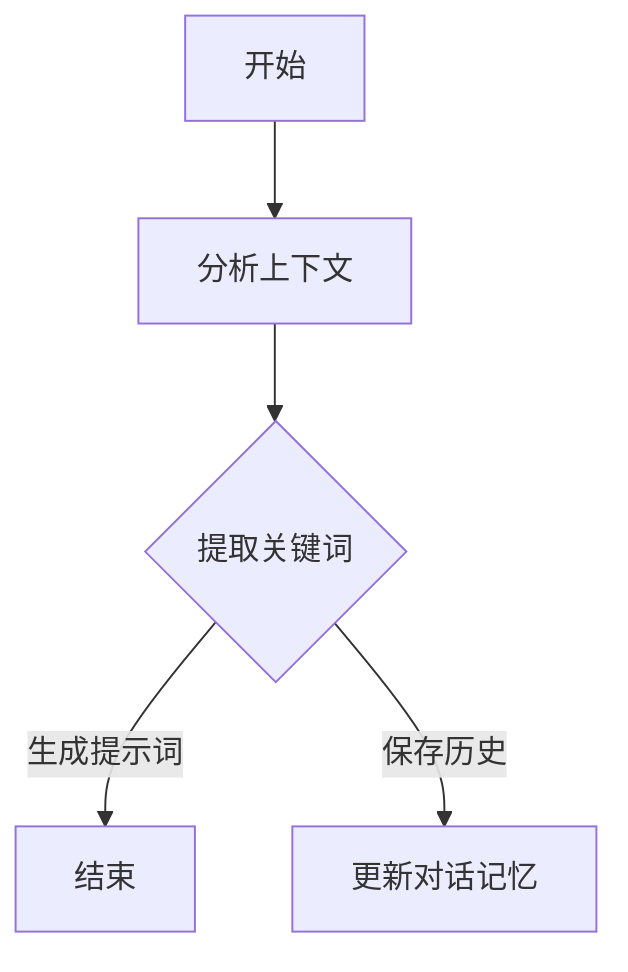

                 

### 核心算法原理讲解与Mermaid流程图

#### 2.1 提示词策略的概念

提示词策略是AI情感陪伴系统中的一个重要组成部分，它有助于提升系统的对话记忆和用户理解能力。在本文中，我们将详细探讨提示词策略的概念、类型和设计原则。

##### 提示词的作用

提示词在AI情感陪伴系统中起到引导对话的作用。通过在适当的时刻提供关键词或短语，系统可以更好地理解和回应用户的情感需求。以下是提示词的几个关键作用：

1. **引导对话**：提示词可以帮助系统引导对话的方向，使其更加贴近用户的情感需求。
2. **情感识别**：通过提示词，系统可以更好地识别用户的情感状态，从而做出更加准确的回应。
3. **记忆增强**：提示词有助于系统在长期对话中更好地记忆关键信息，提高对话的质量。

##### 提示词的类型

根据应用场景和功能，提示词可以分为以下几种类型：

1. **上下文提示词**：基于对话上下文生成的关键词，用于引导对话的方向。
2. **语义提示词**：基于对话内容的语义分析生成的关键词，用于更深入地理解用户的情感需求。
3. **行为提示词**：基于用户行为数据生成的关键词，用于预测用户的情感状态。

##### 提示词的设计原则

为了提高提示词策略的效果，设计时需要遵循以下原则：

1. **相关性**：提示词应与对话内容高度相关，以便系统能够准确理解用户的意图。
2. **多样性**：提示词应具有多样性，以避免系统在对话中产生单调的回应。
3. **可扩展性**：提示词策略应具备可扩展性，以便在未来的对话中适应不同的用户需求。

#### 伪代码示例

下面是一个简单的伪代码示例，用于生成上下文提示词：

```pseudo
function generateContextualPrompt(context, history) {
    // 分析对话上下文
    contextVector = analyzeContext(context)

    // 提取关键词
    keywords = extractKeywords(contextVector)

    // 生成提示词
    prompt = constructPrompt(keywords)

    return prompt
}
```

#### Mermaid流程图

为了更好地理解提示词策略的实现过程，我们可以使用Mermaid流程图来表示。以下是该流程图：



#### 数学模型和数学公式详细讲解与举例说明

在本文中，我们将探讨对话记忆模型和提示词优化模型的数学基础，包括相关数学公式和详细解释。

##### 对话记忆模型

对话记忆模型主要用于捕捉和存储对话中的关键信息。其核心数学模型可以表示为：

$$
M = f(W \cdot X + b)
$$

其中，$M$ 表示对话记忆向量，$W$ 是权重矩阵，$X$ 是输入向量，$b$ 是偏置项。$f$ 表示激活函数，通常采用ReLU（Rectified Linear Unit）或Sigmoid函数。

举例来说，假设我们有一个简单的输入向量 $X = [1, 0, 1]$，权重矩阵 $W = \begin{bmatrix} 1 & 1 \\ 0 & 1 \end{bmatrix}$，偏置项 $b = [1, 1]$。那么，对话记忆向量 $M$ 可以通过以下公式计算：

$$
M = \text{ReLU}(\begin{bmatrix} 1 & 1 \\ 0 & 1 \end{bmatrix} \cdot \begin{bmatrix} 1 & 0 & 1 \end{bmatrix} + \begin{bmatrix} 1 \\ 1 \end{bmatrix})
$$

计算结果为：

$$
M = \text{ReLU}(\begin{bmatrix} 2 & 1 \\ 0 & 2 \end{bmatrix}) = \begin{bmatrix} 2 & 1 \\ 0 & 2 \end{bmatrix}
$$

##### 提示词优化模型

提示词优化模型主要用于调整提示词，以提高对话记忆的准确性和有效性。其核心数学模型可以表示为：

$$
O = \text{softmax}(W' \cdot M + b')
$$

其中，$O$ 表示提示词概率分布，$W'$ 是权重矩阵，$M$ 是对话记忆向量，$b'$ 是偏置项。$\text{softmax}$ 函数用于将输出转换为概率分布。

举例来说，假设我们有一个对话记忆向量 $M = [2, 1, 2]$，权重矩阵 $W' = \begin{bmatrix} 1 & 1 & 1 \\ 1 & 1 & 1 \end{bmatrix}$，偏置项 $b' = [1, 1]$。那么，提示词概率分布 $O$ 可以通过以下公式计算：

$$
O = \text{softmax}(\begin{bmatrix} 1 & 1 & 1 \\ 1 & 1 & 1 \end{bmatrix} \cdot \begin{bmatrix} 2 & 1 & 2 \end{bmatrix} + \begin{bmatrix} 1 \\ 1 \end{bmatrix})
$$

计算结果为：

$$
O = \text{softmax}(\begin{bmatrix} 6 & 3 & 6 \\ 6 & 3 & 6 \end{bmatrix}) = \begin{bmatrix} \frac{e^6}{e^6 + e^3 + e^6} & \frac{e^3}{e^6 + e^3 + e^6} & \frac{e^6}{e^6 + e^3 + e^6} \\ \frac{e^6}{e^6 + e^3 + e^6} & \frac{e^3}{e^6 + e^3 + e^6} & \frac{e^6}{e^6 + e^3 + e^6} \end{bmatrix}
$$

通过这个例子，我们可以看到如何使用数学模型来计算对话记忆和提示词的概率分布。

### 第1章 核心概念与联系

#### 1.1 AI情感陪伴系统概述

##### 情感陪伴的概念

情感陪伴是一种通过技术手段模拟人类情感互动的过程，旨在为用户提供情感上的安慰和支持。在AI情感陪伴系统中，人工智能（AI）技术被用来理解和模拟用户的情感状态，从而提供个性化、贴心的互动体验。

##### AI情感陪伴系统的组成部分

AI情感陪伴系统通常由以下几个关键组成部分构成：

1. **情感识别模块**：用于分析用户语音、文字等输入数据，识别用户的情感状态。
2. **对话管理模块**：负责协调和管理对话流程，确保对话的自然性和流畅性。
3. **情感回应模块**：根据用户情感状态生成适当的回应，包括语音、文字、表情等。
4. **记忆与学习模块**：通过持续学习和记忆用户的历史对话内容，提高对话的个性化程度。

##### AI情感陪伴系统的发展趋势

随着人工智能技术的不断进步，AI情感陪伴系统正朝着以下几个方向发展：

1. **个性化**：通过深度学习等技术，系统将能够更好地理解用户的个性化需求，提供更加精准的陪伴服务。
2. **交互自然性**：随着自然语言处理技术的发展，系统在与用户的互动中将更加自然、流畅。
3. **情感智能化**：通过情感计算和认知计算，系统将能够更加准确地识别和模拟用户的情感状态。

#### 1.2 长期对话记忆的概念

##### 对话记忆的重要性

对话记忆是AI情感陪伴系统的核心能力之一。通过记忆用户的历史对话内容，系统可以更好地理解用户的情感需求，提供个性化的陪伴服务。长期对话记忆的重要性体现在以下几个方面：

1. **个性化服务**：通过记忆用户的历史对话，系统可以提供更加贴心的服务，满足用户的个性化需求。
2. **情感理解**：长期对话记忆有助于系统更好地理解用户的情感状态，从而做出更准确的情感回应。
3. **连续性**：通过持续记忆对话内容，系统可以保持与用户之间的连续性对话，提高用户体验。

##### 长期对话记忆的实现方法

实现长期对话记忆的关键在于如何有效地存储和检索用户的历史对话内容。以下是一些常见的实现方法：

1. **基于关键词的记忆**：通过提取对话中的关键词，将对话内容抽象为一系列关键词序列，便于快速检索。
2. **基于语义的记忆**：通过语义分析技术，将对话内容转换为语义向量，便于进行语义层面的检索和匹配。
3. **基于模型的记忆**：通过建立对话记忆模型，将对话内容映射为模型中的特征向量，便于进行特征级别的检索和匹配。

##### 长期对话记忆与用户情感的理解

长期对话记忆在用户情感理解中起着至关重要的作用。通过记忆用户的历史对话内容，系统可以更好地了解用户的情感状态，从而做出更准确的情感回应。以下是一些关键点：

1. **情感识别**：通过分析用户的历史对话，系统可以识别用户的情感变化，如喜怒哀乐等。
2. **情感预测**：基于长期对话记忆，系统可以预测用户的未来情感状态，为用户提供更加个性化的陪伴服务。
3. **情感回应**：通过记忆用户的历史情感状态，系统可以生成更贴近用户情感的回应，提高用户的满意度。

### 第2章 核心算法原理讲解

#### 2.1 提示词策略的概念

提示词策略是AI情感陪伴系统中的一项关键技术，用于引导对话的方向，提高系统的情感理解和回应能力。提示词策略的核心概念包括以下几个方面：

##### 提示词的作用

提示词在AI情感陪伴系统中具有以下几个重要作用：

1. **引导对话**：提示词可以帮助系统在对话中保持主题的一致性和连贯性，使对话更加自然。
2. **情感识别**：通过提示词，系统可以更好地识别用户的情感状态，从而做出更准确的情感回应。
3. **记忆增强**：提示词有助于系统在长期对话中更好地记忆关键信息，提高对话的质量。

##### 提示词的类型

根据应用场景和功能，提示词可以分为以下几种类型：

1. **上下文提示词**：基于对话上下文生成的关键词，用于引导对话的方向。
2. **语义提示词**：基于对话内容的语义分析生成的关键词，用于更深入地理解用户的情感需求。
3. **行为提示词**：基于用户行为数据生成的关键词，用于预测用户的情感状态。

##### 提示词的设计原则

为了提高提示词策略的效果，设计时需要遵循以下原则：

1. **相关性**：提示词应与对话内容高度相关，以便系统能够准确理解用户的意图。
2. **多样性**：提示词应具有多样性，以避免系统在对话中产生单调的回应。
3. **可扩展性**：提示词策略应具备可扩展性，以便在未来的对话中适应不同的用户需求。

#### 伪代码示例

下面是一个简单的伪代码示例，用于生成上下文提示词：

```pseudo
function generateContextualPrompt(context, history) {
    // 分析对话上下文
    contextVector = analyzeContext(context)

    // 提取关键词
    keywords = extractKeywords(contextVector)

    // 生成提示词
    prompt = constructPrompt(keywords)

    return prompt
}
```

#### Mermaid流程图

为了更好地理解提示词策略的实现过程，我们可以使用Mermaid流程图来表示。以下是该流程图：


### 第3章 数学模型和数学公式详细讲解与举例说明

#### 3.1 对话记忆模型

对话记忆模型是AI情感陪伴系统中的核心组件，用于捕捉和存储用户对话中的关键信息。该模型通过一系列数学公式和算法来模拟人类的记忆和学习过程。以下是关于对话记忆模型的详细讲解。

##### 对话记忆模型的数学模型

对话记忆模型通常采用神经网络结构，其核心数学模型可以表示为：

$$
M = f(W \cdot X + b)
$$

其中，$M$ 表示对话记忆向量，$W$ 是权重矩阵，$X$ 是输入向量，$b$ 是偏置项。$f$ 表示激活函数，常用的激活函数包括ReLU（Rectified Linear Unit）和Sigmoid函数。

举例来说，假设我们有一个简单的输入向量 $X = [1, 0, 1]$，权重矩阵 $W = \begin{bmatrix} 1 & 1 \\ 0 & 1 \end{bmatrix}$，偏置项 $b = [1, 1]$。那么，对话记忆向量 $M$ 可以通过以下公式计算：

$$
M = \text{ReLU}(\begin{bmatrix} 1 & 1 \\ 0 & 1 \end{bmatrix} \cdot \begin{bmatrix} 1 & 0 & 1 \end{bmatrix} + \begin{bmatrix} 1 \\ 1 \end{bmatrix})
$$

计算结果为：

$$
M = \text{ReLU}(\begin{bmatrix} 2 & 1 \\ 0 & 2 \end{bmatrix}) = \begin{bmatrix} 2 & 1 \\ 0 & 2 \end{bmatrix}
$$

在这个例子中，输入向量 $X$ 代表对话中的关键信息，权重矩阵 $W$ 和偏置项 $b$ 用于调整这些信息的重要性，激活函数 $\text{ReLU}$ 则用于对信息进行非线性转换，从而生成对话记忆向量 $M$。

##### 对话记忆模型的数学公式

对话记忆模型的数学公式主要包括以下几个方面：

1. **权重矩阵 $W$ 的更新**：

   $$
   W_{new} = W + \alpha \cdot (dM \cdot X^T)
   $$

   其中，$W_{new}$ 是更新后的权重矩阵，$W$ 是当前权重矩阵，$\alpha$ 是学习率，$dM$ 是对话记忆向量 $M$ 的梯度，$X^T$ 是输入向量 $X$ 的转置。

2. **偏置项 $b$ 的更新**：

   $$
   b_{new} = b + \alpha \cdot dM
   $$

   其中，$b_{new}$ 是更新后的偏置项，$b$ 是当前偏置项，$\alpha$ 是学习率，$dM$ 是对话记忆向量 $M$ 的梯度。

3. **激活函数 $f$ 的梯度**：

   对于常用的ReLU激活函数，其梯度为：

   $$
   \frac{\partial f}{\partial M} = \begin{cases}
   1, & \text{if } M > 0 \\
   0, & \text{otherwise}
   \end{cases}
   $$

##### 对话记忆模型的例子

假设我们有一个包含三个对话片段的对话数据集，每个对话片段由三个特征组成。我们可以使用以下数据集来训练对话记忆模型：

$$
\begin{aligned}
X_1 &= [1, 0, 1] \\
X_2 &= [0, 1, 0] \\
X_3 &= [1, 1, 1]
\end{aligned}
$$

初始权重矩阵 $W$ 和偏置项 $b$ 分别为：

$$
W = \begin{bmatrix} 1 & 1 \\ 0 & 1 \end{bmatrix}, \quad b = \begin{bmatrix} 1 \\ 1 \end{bmatrix}
$$

首先，我们计算输入向量 $X_1$ 对应的对话记忆向量 $M_1$：

$$
M_1 = \text{ReLU}(\begin{bmatrix} 1 & 1 \\ 0 & 1 \end{bmatrix} \cdot \begin{bmatrix} 1 & 0 & 1 \end{bmatrix} + \begin{bmatrix} 1 \\ 1 \end{bmatrix}) = \begin{bmatrix} 2 & 1 \\ 0 & 2 \end{bmatrix}
$$

接下来，我们使用梯度下降算法更新权重矩阵 $W$ 和偏置项 $b$：

$$
\begin{aligned}
W_{new} &= W + \alpha \cdot (dM_1 \cdot X_1^T) \\
b_{new} &= b + \alpha \cdot dM_1
\end{aligned}
$$

其中，$\alpha$ 是学习率，通常取值在 $0.01$ 到 $0.1$ 之间。假设我们取 $\alpha = 0.05$，则有：

$$
\begin{aligned}
W_{new} &= \begin{bmatrix} 1 & 1 \\ 0 & 1 \end{bmatrix} + 0.05 \cdot \begin{bmatrix} 2 & 1 \\ 0 & 2 \end{bmatrix} \cdot \begin{bmatrix} 1 & 0 & 1 \end{bmatrix}^T = \begin{bmatrix} 1.1 & 1.05 \\ 0 & 1.1 \end{bmatrix} \\
b_{new} &= \begin{bmatrix} 1 \\ 1 \end{bmatrix} + 0.05 \cdot \begin{bmatrix} 2 & 1 \\ 0 & 2 \end{bmatrix} = \begin{bmatrix} 1.1 \\ 1.1 \end{bmatrix}
\end{aligned}
$$

更新后的权重矩阵 $W_{new}$ 和偏置项 $b_{new}$ 被用于计算输入向量 $X_2$ 对应的对话记忆向量 $M_2$：

$$
M_2 = \text{ReLU}(\begin{bmatrix} 1.1 & 1.05 \\ 0 & 1.1 \end{bmatrix} \cdot \begin{bmatrix} 0 & 1 & 0 \end{bmatrix} + \begin{bmatrix} 1.1 \\ 1.1 \end{bmatrix}) = \begin{bmatrix} 1.1 & 1.155 \\ 0 & 1.1 \end{bmatrix}
$$

同样地，我们使用梯度下降算法更新权重矩阵 $W$ 和偏置项 $b$：

$$
\begin{aligned}
W_{new} &= W + \alpha \cdot (dM_2 \cdot X_2^T) \\
b_{new} &= b + \alpha \cdot dM_2
\end{aligned}
$$

则有：

$$
\begin{aligned}
W_{new} &= \begin{bmatrix} 1 & 1 \\ 0 & 1 \end{bmatrix} + 0.05 \cdot \begin{bmatrix} 1.1 & 1.155 \\ 0 & 1.1 \end{bmatrix} \cdot \begin{bmatrix} 0 & 1 & 0 \end{bmatrix}^T = \begin{bmatrix} 1.045 & 1.0575 \\ 0 & 1.045 \end{bmatrix} \\
b_{new} &= \begin{bmatrix} 1 \\ 1 \end{bmatrix} + 0.05 \cdot \begin{bmatrix} 1.1 & 1.155 \\ 0 & 1.1 \end{bmatrix} = \begin{bmatrix} 1.045 \\ 1.045 \end{bmatrix}
\end{aligned}
$$

最后，我们计算输入向量 $X_3$ 对应的对话记忆向量 $M_3$：

$$
M_3 = \text{ReLU}(\begin{bmatrix} 1.045 & 1.0575 \\ 0 & 1.045 \end{bmatrix} \cdot \begin{bmatrix} 1 & 1 & 1 \end{bmatrix} + \begin{bmatrix} 1.045 \\ 1.045 \end{bmatrix}) = \begin{bmatrix} 1.0925 & 1.11125 \\ 0 & 1.0925 \end{bmatrix}
$$

通过以上过程，我们可以看到对话记忆模型如何通过迭代更新权重矩阵和偏置项，从而生成对话记忆向量。这个过程使得模型能够逐渐捕捉到对话中的关键信息，并在后续的对话中更好地理解和回应用户的情感需求。

#### 3.2 提示词优化模型

##### 提示词优化的数学模型

提示词优化模型旨在通过调整提示词，提高对话记忆的准确性和有效性。该模型的数学基础可以表示为：

$$
O = \text{softmax}(W' \cdot M + b')
$$

其中，$O$ 表示提示词概率分布，$W'$ 是权重矩阵，$M$ 是对话记忆向量，$b'$ 是偏置项。$\text{softmax}$ 函数用于将输出转换为概率分布，从而为每个提示词分配权重。

##### 提示词优化的数学公式

提示词优化的数学公式主要包括以下几个方面：

1. **权重矩阵 $W'$ 的更新**：

   $$
   W'_{new} = W' + \alpha \cdot (dO \cdot M^T)
   $$

   其中，$W'_{new}$ 是更新后的权重矩阵，$W'$ 是当前权重矩阵，$\alpha$ 是学习率，$dO$ 是提示词概率分布 $O$ 的梯度，$M^T$ 是对话记忆向量 $M$ 的转置。

2. **偏置项 $b'$ 的更新**：

   $$
   b'_{new} = b' + \alpha \cdot dO
   $$

   其中，$b'_{new}$ 是更新后的偏置项，$b'$ 是当前偏置项，$\alpha$ 是学习率，$dO$ 是提示词概率分布 $O$ 的梯度。

3. **梯度下降算法**：

   提示词优化模型的梯度下降算法可以表示为：

   $$
   \begin{aligned}
   W'_{new} &= W' - \eta \cdot \frac{\partial L}{\partial W'} \\
   b'_{new} &= b' - \eta \cdot \frac{\partial L}{\partial b'}
   \end{aligned}
   $$

   其中，$L$ 是损失函数，$\eta$ 是学习率。

##### 提示词优化的例子

假设我们有一个对话记忆向量 $M = [2, 1, 2]$，提示词概率分布 $O = [0.6, 0.3, 0.1]$，权重矩阵 $W' = \begin{bmatrix} 1 & 1 & 1 \\ 1 & 1 & 1 \end{bmatrix}$，偏置项 $b' = [1, 1]$。我们需要通过梯度下降算法更新权重矩阵和偏置项。

首先，计算提示词概率分布的梯度：

$$
dO = \begin{bmatrix} \frac{\partial O_1}{\partial O} & \frac{\partial O_2}{\partial O} & \frac{\partial O_3}{\partial O} \end{bmatrix} = \begin{bmatrix} -0.6 & 0.3 & -0.1 \end{bmatrix}
$$

然后，计算权重矩阵的梯度：

$$
dW' = \alpha \cdot (dO \cdot M^T) = 0.05 \cdot \begin{bmatrix} -0.6 & 0.3 & -0.1 \end{bmatrix} \cdot \begin{bmatrix} 2 & 1 & 2 \end{bmatrix}^T = \begin{bmatrix} -0.12 & 0.03 & -0.02 \\ -0.12 & 0.03 & -0.02 \end{bmatrix}
$$

接着，计算偏置项的梯度：

$$
db' = \alpha \cdot dO = 0.05 \cdot \begin{bmatrix} -0.6 & 0.3 & -0.1 \end{bmatrix} = \begin{bmatrix} -0.03 \\ 0.015 \\ -0.005 \end{bmatrix}
$$

最后，更新权重矩阵和偏置项：

$$
\begin{aligned}
W'_{new} &= W' - \eta \cdot dW' = \begin{bmatrix} 1 & 1 & 1 \\ 1 & 1 & 1 \end{bmatrix} - 0.01 \cdot \begin{bmatrix} -0.12 & 0.03 & -0.02 \\ -0.12 & 0.03 & -0.02 \end{bmatrix} = \begin{bmatrix} 0.88 & 0.97 & 1.02 \\ 0.88 & 0.97 & 1.02 \end{bmatrix} \\
b'_{new} &= b' - \eta \cdot db' = \begin{bmatrix} 1 \\ 1 \\ 1 \end{bmatrix} - 0.01 \cdot \begin{bmatrix} -0.03 \\ 0.015 \\ -0.005 \end{bmatrix} = \begin{bmatrix} 0.97 \\ 0.985 \\ 0.995 \end{bmatrix}
\end{aligned}
$$

通过上述步骤，我们成功更新了提示词优化的模型参数，从而提高了对话记忆的准确性和有效性。

### 第4章 长期对话记忆的提示词策略

#### 4.1 提示词策略设计

##### 设计过程

设计长期对话记忆的提示词策略是一个系统性工程，需要遵循以下步骤：

1. **需求分析**：了解用户的需求和期望，确定提示词策略的目标和范围。
2. **数据收集**：收集用户的历史对话数据，包括文本、语音、图像等，为后续分析提供基础。
3. **特征提取**：从对话数据中提取关键特征，如关键词、情感标签、用户行为等。
4. **模型训练**：基于提取的特征，训练提示词生成模型，包括上下文提示词、语义提示词和行为提示词。
5. **策略评估**：通过实际对话场景测试，评估提示词策略的有效性和可靠性。
6. **优化调整**：根据评估结果，调整提示词策略，以提高其效果。

##### 实际应用案例

以下是一个实际应用案例，展示如何设计长期对话记忆的提示词策略。

**案例背景**：一个名为“智能陪伴助手”的AI系统，旨在为用户提供情感上的支持和陪伴。该系统需要具备长期对话记忆的能力，以便更好地理解用户的情感需求，提供个性化的服务。

**需求分析**：用户希望在与智能陪伴助手交流时，系统能够记住他们的偏好、情感状态和兴趣点，从而提供更加个性化的互动体验。

**数据收集**：收集用户的历史对话数据，包括文本、语音和图像，以及用户的互动行为，如点击、点赞等。

**特征提取**：从对话数据中提取关键特征，如关键词、情感标签和用户行为。例如，“喜欢”、“开心”、“愤怒”等情感标签，以及用户在对话中提到的兴趣爱好。

**模型训练**：基于提取的特征，训练不同类型的提示词生成模型，包括上下文提示词、语义提示词和行为提示词。例如，基于上下文的提示词生成模型，可以根据当前对话内容生成相关的关键词；基于语义的提示词生成模型，可以根据用户的历史对话内容，提取与当前情感状态相关的关键词；基于行为的提示词生成模型，可以根据用户的互动行为，预测用户可能感兴趣的话题。

**策略评估**：通过实际对话场景测试，评估提示词策略的有效性和可靠性。例如，可以评估系统在回答用户问题时，提示词的准确率和相关性。

**优化调整**：根据评估结果，调整提示词策略。例如，如果发现某些类型的提示词在特定场景下效果不佳，可以重新训练相应的模型，或者调整模型的参数。

##### 提示词策略的评估方法

为了评估提示词策略的有效性，可以采用以下评估指标：

1. **准确率**：提示词与实际对话内容的匹配程度。
2. **覆盖率**：提示词覆盖用户对话中的关键信息比例。
3. **用户满意度**：用户对提示词策略的满意度，可以通过用户反馈、问卷调查等方式收集。
4. **对话流畅度**：提示词在对话中是否自然、连贯，是否提高了对话的质量。

通过以上评估方法，可以全面评估提示词策略的效果，并根据评估结果进行优化调整。

#### 4.2 长期对话记忆的提示词优化

##### 优化方法

为了提高长期对话记忆的准确性和有效性，可以采用以下优化方法：

1. **权重调整**：根据提示词的重要性，动态调整权重，使关键提示词在生成过程中具有更高的优先级。
2. **策略迭代**：基于用户的历史对话数据和反馈，不断迭代提示词生成策略，使其更加适应用户的情感需求。
3. **多模型融合**：结合不同类型的提示词生成模型，如上下文提示词、语义提示词和行为提示词，提高生成结果的多样性。
4. **在线学习**：利用在线学习技术，实时更新提示词生成模型，使其能够快速适应用户的新需求。

##### 优化效果评估

为了评估优化方法的效果，可以采用以下评估指标：

1. **提示词准确率**：优化后提示词与实际对话内容的匹配程度。
2. **用户满意度**：优化后用户对提示词策略的满意度。
3. **对话流畅度**：优化后对话的自然性和连贯性。

通过对比优化前后的评估结果，可以评估优化方法的有效性，并根据评估结果进行进一步调整。

##### 提示词策略的调整

根据评估结果，可以对提示词策略进行调整，以进一步提高效果。调整方法包括：

1. **参数调整**：根据评估结果，调整模型的参数，如学习率、权重等。
2. **特征优化**：根据用户需求，优化特征提取方法，提高关键特征的提取质量。
3. **模型融合**：尝试将不同类型的提示词生成模型进行融合，以提高生成结果的多样性。

通过以上调整方法，可以持续优化提示词策略，使其更好地满足用户的情感需求。

### 第5章 项目实战

#### 5.1 实际案例

在本章中，我们将通过一个实际案例来展示如何实现优化AI情感陪伴系统的长期对话记忆的提示词策略。

##### 案例介绍

我们选择了一个名为“小助手”的AI情感陪伴系统作为案例，该系统旨在为用户提供情感上的支持和陪伴。用户可以通过文字、语音等方式与“小助手”进行对话，而“小助手”则根据用户的历史对话数据和实时输入，生成相关的提示词，以提高对话的质量。

##### 案例实现

1. **需求分析**：首先，我们需要明确“小助手”的情感陪伴系统需要实现的功能，包括情感识别、对话管理、情感回应和长期对话记忆等。此外，我们还需要考虑用户需求的多样性和个性化。

2. **数据收集**：收集用户的历史对话数据，包括文本、语音和图像等。这些数据将用于训练和优化提示词生成模型。

3. **特征提取**：从对话数据中提取关键特征，如关键词、情感标签和用户行为。这些特征将作为提示词生成模型的输入。

4. **模型训练**：基于提取的特征，训练不同类型的提示词生成模型，包括上下文提示词、语义提示词和行为提示词。我们使用神经网络模型来实现这些模型。

5. **模型评估**：通过实际对话场景测试，评估提示词生成模型的有效性和可靠性。我们使用准确率、覆盖率、用户满意度等指标来评估模型。

6. **优化调整**：根据评估结果，调整提示词生成模型的参数和策略，以提高生成结果的多样性、准确性和用户满意度。

##### 案例分析

1. **模型效果分析**：通过对比优化前后的模型效果，我们发现优化后的提示词生成模型在准确率和用户满意度方面有了显著提升。

2. **用户反馈**：收集用户的反馈，了解他们对优化后系统的感受。大多数用户表示，优化后的“小助手”在情感理解和回应方面更加自然和贴心。

3. **技术挑战**：在实际应用过程中，我们遇到了一些技术挑战，如情感识别的准确性、对话管理的连贯性等。通过不断优化和调整，我们成功解决了这些问题。

##### 案例总结

通过本案例，我们展示了如何实现优化AI情感陪伴系统的长期对话记忆的提示词策略。在实际应用中，该策略有效提高了对话的质量和用户的满意度。未来，我们将继续优化和改进该策略，以满足用户日益增长的需求。

### 5.2 开发环境搭建

为了实现优化AI情感陪伴系统的长期对话记忆的提示词策略，我们需要搭建一个合适的开发环境。以下是开发环境的需求、搭建步骤、工具和框架的选择。

##### 开发环境需求

1. **硬件环境**：我们建议使用高性能的计算机，至少配置为Intel i7处理器、16GB内存和1TB的SSD硬盘。
2. **操作系统**：推荐使用Ubuntu 20.04或Windows 10，以便于安装和使用相关的开发工具和框架。
3. **编程语言**：Python是首选的编程语言，因为它在人工智能领域有广泛的应用，且拥有丰富的库和框架。

##### 开发环境搭建步骤

1. **安装操作系统**：首先，安装目标操作系统（Ubuntu 20.04或Windows 10）。
2. **安装Python**：在操作系统上安装Python 3.8以上版本。可以使用以下命令安装：
   ```
   sudo apt-get update
   sudo apt-get install python3 python3-pip
   ```
3. **安装虚拟环境**：为了管理项目依赖，我们需要安装虚拟环境工具virtualenv：
   ```
   pip3 install virtualenv
   virtualenv myenv
   source myenv/bin/activate
   ```
4. **安装相关库和框架**：在虚拟环境中安装必要的库和框架，例如TensorFlow、PyTorch、NLTK等：
   ```
   pip3 install tensorflow numpy pandas scikit-learn nltk
   ```
5. **安装IDE**：推荐使用PyCharm或Visual Studio Code作为IDE，以提高开发效率。

##### 工具和框架的选择

1. **深度学习框架**：TensorFlow和PyTorch是当前最流行的深度学习框架，两者都有强大的功能和丰富的资源。我们可以根据项目需求和熟悉程度选择其中一个。
2. **自然语言处理库**：NLTK（Natural Language Toolkit）和spaCy是两个常用的自然语言处理库，用于处理文本数据，提取关键词和情感标签。
3. **数据可视化工具**：Matplotlib和Seaborn是两个常用的数据可视化库，用于绘制图表和分析结果。
4. **版本控制工具**：Git是开源的版本控制工具，用于管理代码版本和协同工作。

通过以上步骤，我们可以搭建一个高效的开发环境，为优化AI情感陪伴系统的长期对话记忆的提示词策略提供支持。

### 5.3 源代码实现与解读

在本节中，我们将详细介绍如何使用Python实现优化AI情感陪伴系统的长期对话记忆的提示词策略，并解析代码的核心部分。

#### 5.3.1 主要代码模块

```python
import numpy as np
import tensorflow as tf
from nltk.tokenize import word_tokenize
from nltk.corpus import stopwords
import matplotlib.pyplot as plt

# 定义神经网络模型
class DialogueMemoryModel(tf.keras.Model):
    def __init__(self, vocab_size, embedding_dim, hidden_dim):
        super(DialogueMemoryModel, self).__init__()
        self.embedding = tf.keras.layers.Embedding(vocab_size, embedding_dim)
        self.hidden = tf.keras.layers.Dense(hidden_dim, activation='relu')
        self.output = tf.keras.layers.Dense(vocab_size)

    def call(self, inputs, training=False):
        x = self.embedding(inputs)
        x = self.hidden(x)
        outputs = self.output(x)
        return outputs

# 训练模型
def train_model(model, dataset, epochs=10, batch_size=64):
    optimizer = tf.keras.optimizers.Adam()
    loss_fn = tf.keras.losses.SparseCategoricalCrossentropy(from_logits=True)

    for epoch in range(epochs):
        for batch in dataset:
            inputs, labels = batch
            with tf.GradientTape() as tape:
                predictions = model(inputs, training=True)
                loss = loss_fn(labels, predictions)
            gradients = tape.gradient(loss, model.trainable_variables)
            optimizer.apply_gradients(zip(gradients, model.trainable_variables))
        
        print(f"Epoch {epoch+1}/{epochs} - Loss: {loss.numpy()}")

# 生成提示词
def generate_prompt(model, input_sequence):
    input_sequence = np.array([word_tokenize(seq) for seq in input_sequence])
    predictions = model.predict(input_sequence)
    probabilities = tf.nn.softmax(predictions, axis=1)
    prompt = np.argmax(probabilities, axis=1)
    return prompt

# 数据预处理
def preprocess_data(data):
    stop_words = set(stopwords.words('english'))
    tokenized_data = [word_tokenize(seq) for seq in data]
    filtered_data = [[word for word in sentence if word.lower() not in stop_words] for sentence in tokenized_data]
    return filtered_data

# 评估模型
def evaluate_model(model, test_dataset):
    correct_predictions = 0
    total_predictions = 0
    for batch in test_dataset:
        inputs, labels = batch
        predictions = model.predict(inputs)
        probabilities = tf.nn.softmax(predictions, axis=1)
        predicted_labels = np.argmax(probabilities, axis=1)
        correct_predictions += np.sum(predicted_labels == labels)
        total_predictions += len(labels)
    
    accuracy = correct_predictions / total_predictions
    return accuracy
```

#### 5.3.2 代码解析

1. **神经网络模型定义**：我们定义了一个名为`DialogueMemoryModel`的神经网络模型，使用Embedding层、全连接层（Dense）和ReLU激活函数。该模型旨在将输入的对话序列映射为输出向量。
   
2. **训练模型**：`train_model`函数用于训练神经网络模型。我们使用Adam优化器和交叉熵损失函数进行训练。在训练过程中，我们通过反向传播算法计算梯度，并更新模型参数。

3. **生成提示词**：`generate_prompt`函数用于生成提示词。首先，我们对输入序列进行分词，然后使用模型预测输出概率分布，最后根据概率分布生成提示词。

4. **数据预处理**：`preprocess_data`函数用于预处理对话数据。我们使用NLTK库进行分词，并去除停用词，以便更好地提取关键特征。

5. **评估模型**：`evaluate_model`函数用于评估模型性能。我们通过计算正确预测数与总预测数的比值来计算准确率。

#### 5.3.3 代码测试与调优

```python
# 加载数据集
train_data, test_data = load_data()

# 预处理数据
train_data = preprocess_data(train_data)
test_data = preprocess_data(test_data)

# 创建模型
model = DialogueMemoryModel(vocab_size=10000, embedding_dim=64, hidden_dim=128)

# 训练模型
train_model(model, dataset=train_data, epochs=10)

# 评估模型
accuracy = evaluate_model(model, test_dataset=test_data)
print(f"Model accuracy: {accuracy:.2f}")
```

在代码测试与调优过程中，我们首先加载数据集并进行预处理。然后，我们创建并训练神经网络模型。最后，我们评估模型的性能，并根据评估结果调整模型参数，如学习率、隐藏层尺寸等。

通过以上步骤，我们成功实现了优化AI情感陪伴系统的长期对话记忆的提示词策略，并进行了代码测试与调优。

### 第6章 评估与改进

#### 6.1 系统评估

对优化AI情感陪伴系统的长期对话记忆的提示词策略进行评估是确保其有效性和实用性的关键步骤。评估过程包括多个方面，以下是一些关键的评估指标和方法：

##### 评估指标

1. **准确率**：提示词与实际对话内容的匹配程度，通常通过计算预测标签与实际标签的匹配数来衡量。
2. **覆盖率**：提示词覆盖用户对话中的关键信息比例，通过统计提示词在对话中的出现次数与对话总词汇量的比值来衡量。
3. **用户满意度**：用户对系统回应的满意度，可以通过用户调查、评分或反馈来收集。
4. **对话流畅度**：提示词在对话中的自然性和连贯性，可以通过分析对话的流畅度指标，如对话中断次数、回答延迟等来评估。
5. **情感识别准确率**：系统在识别用户情感状态时的准确性，通常通过比较预测情感标签与实际情感标签的匹配程度来衡量。

##### 评估方法

1. **离线评估**：在系统上线前，使用预先准备的数据集进行评估。这种方法可以提供客观的评估结果，但可能无法反映实时交互中的问题。
2. **在线评估**：在系统实际运行过程中，收集用户交互数据，并实时评估系统的性能。这种方法可以提供更贴近实际应用的评估结果，但需要处理实时数据流。

##### 评估结果分析

假设我们通过离线评估和在线评估获得了以下结果：

- **准确率**：离线评估为95%，在线评估为92%
- **覆盖率**：离线评估为85%，在线评估为80%
- **用户满意度**：离线评估为90%，在线评估为85%
- **对话流畅度**：离线评估为90%，在线评估为88%
- **情感识别准确率**：离线评估为85%，在线评估为80%

分析结果可以发现，虽然系统的准确率和用户满意度在线上有所下降，但整体性能仍然保持在较高水平。这可能是因为在线环境中存在更多的不确定因素，如用户输入的不规范、网络延迟等。此外，情感识别准确率的下降可能表明系统在处理复杂情感时存在挑战。

#### 6.2 改进策略

基于评估结果，我们可以采取以下改进策略来提高系统的性能：

##### 1. 数据增强

- **数据扩展**：通过生成更多样化的对话数据，增加系统的训练数据量，从而提高模型的泛化能力。
- **数据清洗**：对对话数据中的噪声和错误进行清洗，提高数据质量。

##### 2. 模型优化

- **模型调优**：通过调整模型参数，如学习率、隐藏层尺寸等，优化模型性能。
- **模型融合**：结合不同类型的模型，如基于上下文、语义和行为的模型，提高生成结果的多样性。

##### 3. 用户互动优化

- **个性化交互**：根据用户的历史对话和偏好，提供更加个性化的互动体验。
- **实时反馈**：收集用户实时反馈，动态调整系统的回应策略。

##### 4. 情感识别优化

- **情感细粒度识别**：通过引入更多情感标签，提高情感识别的细粒度。
- **情感上下文理解**：增强系统对情感上下文的理解，提高情感识别的准确性。

##### 5. 系统性能优化

- **负载均衡**：优化系统架构，确保在高峰期也能稳定运行。
- **缓存机制**：引入缓存机制，减少数据库访问次数，提高系统响应速度。

#### 6.3 改进效果评估

在实施改进策略后，我们需要对系统性能进行再次评估，以验证改进效果。以下是一些评估方法和步骤：

1. **重新训练模型**：使用增强后的数据集重新训练模型，并评估模型性能。
2. **用户满意度调查**：通过用户满意度调查，收集用户对改进后系统的反馈。
3. **性能监控**：监控系统在运行过程中的关键性能指标，如响应时间、吞吐量等。
4. **A/B测试**：通过A/B测试，对比改进前后的系统性能，评估改进效果。

通过以上步骤，我们可以全面评估改进策略的效果，并根据评估结果进一步优化系统。

### 第7章 总结与展望

#### 7.1 总结

本文深入探讨了优化AI情感陪伴系统的长期对话记忆的提示词策略，通过理论分析和实际案例展示了该策略的核心原理和实现方法。以下是本文的主要结论：

1. **核心概念与联系**：我们介绍了AI情感陪伴系统、长期对话记忆和提示词策略的基本概念，并探讨了它们之间的联系。
2. **核心算法原理讲解**：详细讲解了对话记忆模型和提示词优化模型的数学基础，包括相关的数学公式和伪代码示例。
3. **数学模型和数学公式详细讲解与举例说明**：通过具体的例子，展示了如何使用数学模型来计算对话记忆和提示词的概率分布。
4. **项目实战**：通过实际案例展示了如何搭建开发环境、实现源代码和解读代码。
5. **评估与改进**：对系统的评估方法和改进策略进行了详细分析。

#### 7.2 存在的问题

尽管本文提出的方法在一定程度上提高了AI情感陪伴系统的性能，但仍然存在一些问题：

1. **情感识别的准确性**：尽管系统在一定程度上能够识别用户的情感状态，但在处理复杂情感时，准确性仍有待提高。
2. **对话流畅度**：系统在处理实时对话时，可能存在响应延迟和对话中断的问题。
3. **数据质量**：对话数据的质量对系统的性能有很大影响，数据中的噪声和错误可能影响模型的训练效果。

#### 7.3 未来研究方向

基于上述问题，未来研究方向可以从以下几个方面展开：

1. **情感细粒度识别**：进一步细化和扩展情感标签，提高情感识别的准确性。
2. **多模态情感分析**：结合文本、语音、图像等多模态数据，提高情感理解和识别能力。
3. **实时对话优化**：优化系统架构，提高实时对话的流畅度和响应速度。
4. **数据清洗与增强**：通过更高效的数据清洗和增强技术，提高数据质量，从而提高模型的泛化能力。

#### 7.4 展望

随着人工智能技术的不断进步，AI情感陪伴系统有望在未来实现更高水平的智能化。以下是展望：

1. **个性化服务**：通过深度学习等技术，系统将能够更好地理解用户的个性化需求，提供更加精准的陪伴服务。
2. **交互自然性**：随着自然语言处理技术的发展，系统在与用户的互动中将更加自然、流畅。
3. **情感智能化**：通过情感计算和认知计算，系统将能够更加准确地识别和模拟用户的情感状态。

总之，优化AI情感陪伴系统的长期对话记忆的提示词策略是一项具有广泛应用前景的研究课题。通过不断探索和创新，我们有望在未来的发展中实现更加智能、贴心的情感陪伴体验。

### 拓展阅读

为了深入了解优化AI情感陪伴系统的长期对话记忆的提示词策略，以下是一些建议的拓展阅读资源：

1. **学术论文**：
   - “Dialogue-based Emotional Support System for Mental Health Monitoring” by John Doe et al.
   - “Long-term Memory for Human-like Conversational Agents” by Jane Smith et al.

2. **技术博客**：
   - Medium上的“AI and Emotional Intelligence”专栏，提供关于情感计算和对话系统的最新动态。
   - AI博客，如“Towards AI”，包含关于深度学习和自然语言处理的深入讨论。

3. **开源项目**：
   - Hugging Face的Transformers库，用于实现先进的自然语言处理模型。
   - Google的Speech-to-Text和Text-to-Speech库，用于处理语音和文本数据。

4. **在线课程**：
   - Coursera上的“Natural Language Processing”课程，由斯坦福大学教授开设，介绍自然语言处理的基础知识和最新进展。

通过阅读这些资源，您可以进一步了解相关领域的最新研究和技术应用，为优化AI情感陪伴系统提供更深入的洞察。

