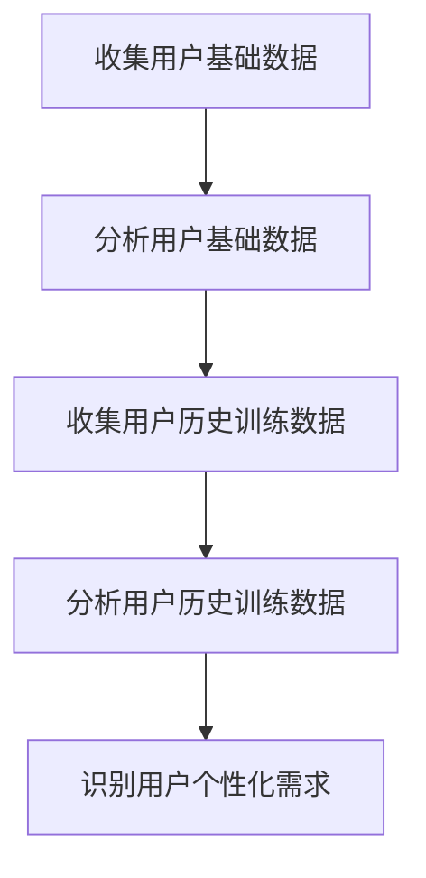
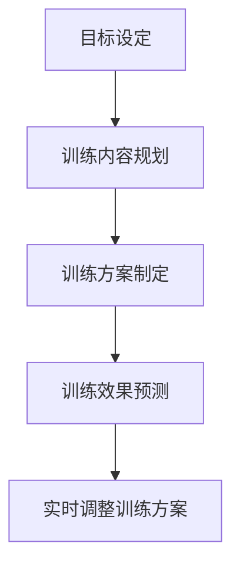

                 

### 文章标题

# 《优化AI虚拟健身教练：个性化训练计划的提示词设计》

随着人工智能技术的不断进步，虚拟健身教练逐渐成为健身领域的一大创新。个性化训练计划是其核心功能之一，而提示词设计则是实现个性化训练计划的关键。本文将围绕这一主题，深入探讨如何通过优化提示词设计来提升AI虚拟健身教练的个性化训练效果。

## 关键词

- AI虚拟健身教练
- 个性化训练计划
- 提示词设计
- 人工智能
- 机器学习
- 数据分析

## 摘要

本文首先介绍了AI虚拟健身教练的现状与挑战，强调了个性化训练计划的重要性。接着，我们探讨了个性化训练计划的原理与实现，以及提示词设计的基本概念。然后，通过实践方法和案例研究，详细阐述了提示词设计的优化策略与技巧。最后，我们对AI虚拟健身教练的发展趋势和提示词设计的未来挑战进行了展望。

## 第1章 引言

### 1.1 AI虚拟健身教练的现状与挑战

近年来，人工智能（AI）技术快速发展，逐渐渗透到各个行业，其中健身领域也不例外。虚拟健身教练作为AI技术的应用之一，正逐渐改变人们的健身方式。AI虚拟健身教练能够根据用户的身体数据、健身目标和偏好，为用户量身定制个性化的训练计划，提供实时反馈和指导，从而提高健身效果。

然而，目前AI虚拟健身教练仍面临一些挑战。首先，数据收集和处理的准确性是关键。虚拟健身教练需要收集大量的用户数据，如体重、身高、心率、血压等，这些数据的准确性直接影响到训练计划的制定和执行。其次，个性化训练计划的制定和执行也存在困难。不同的用户有不同的健身目标和偏好，如何根据这些差异制定出有效的训练计划，同时保证用户能够按照计划执行，是当前研究的重点。

### 1.2 个性化训练计划的重要性

个性化训练计划是指根据用户的个人情况，如年龄、体重、健身目标、健康状况等，制定出最适合用户的训练计划。与传统的统一训练计划相比，个性化训练计划能够更好地满足用户的需求，提高健身效果。

首先，个性化训练计划能够更好地满足用户的健身需求。每个用户都有自己的健身目标，如减肥、增肌、塑形等。通过分析用户的个人数据，虚拟健身教练可以制定出符合用户目标的训练计划，从而提高用户的健身积极性。

其次，个性化训练计划能够提高健身效果。由于个性化训练计划是根据用户的个人情况制定的，因此能够更好地适应用户的身体条件，避免因过度训练或训练不足导致的伤害。此外，个性化训练计划还能够根据用户的反馈及时调整，确保用户始终在最佳状态进行训练。

### 1.3 提示词设计的角色与作用

提示词设计在AI虚拟健身教练中扮演着重要的角色。提示词是指虚拟健身教练在指导用户训练时使用的语言提示，用于引导用户完成训练动作、调整训练强度、理解训练目的等。提示词的设计直接影响到用户对训练计划的接受度和执行效果。

首先，提示词的设计需要符合用户的语言习惯和认知水平。虚拟健身教练的提示词应该简洁明了，易于理解，避免使用过于专业或复杂的术语，以免用户产生困惑。

其次，提示词的设计需要根据训练内容进行调整。不同的训练内容需要不同的提示词，例如，在力量训练时，提示词可能更多关注动作的标准性；而在有氧运动时，提示词可能更多关注心率控制和呼吸节奏。

最后，提示词的设计需要具有个性化。根据用户的健身目标和偏好，虚拟健身教练可以调整提示词，使其更加贴近用户的个性化需求，从而提高用户的训练体验。

### 1.4 本书结构与内容安排

本书旨在为读者提供关于AI虚拟健身教练个性化训练计划和提示词设计的全面指南。本书共分为7章，结构如下：

- **第1章 引言**：介绍AI虚拟健身教练的现状与挑战，强调个性化训练计划的重要性，以及提示词设计在其中的作用。
- **第2章 AI虚拟健身教练技术基础**：介绍AI虚拟健身教练的基本架构和核心技术，包括机器学习、数据分析和数据处理。
- **第3章 个性化训练计划的原理与实现**：探讨个性化训练计划的基本原理和关键技术，包括数据驱动的方法和模式识别与分类算法。
- **第4章 提示词设计的基本概念**：介绍提示词的定义、作用和设计原则。
- **第5章 提示词设计的实践方法**：详细阐述提示词生成技术和优化策略。
- **第6章 个性化训练计划与提示词设计案例研究**：通过具体案例展示如何设计和优化个性化训练计划和提示词。
- **第7章 未来展望与挑战**：讨论AI虚拟健身教练的发展趋势和提示词设计的未来挑战。

通过本书的阅读，读者将能够深入了解AI虚拟健身教练的个性化训练计划和提示词设计，掌握相关技术和方法，为实际应用提供有力支持。

## 第2章 AI虚拟健身教练技术基础

### 2.1 AI虚拟健身教练的架构

AI虚拟健身教练的核心架构主要包括数据收集模块、数据处理模块、个性化训练计划生成模块和用户交互模块。以下是对这些模块的详细描述：

**数据收集模块**：该模块负责收集用户的各种数据，包括体重、身高、心率、血压、运动时长、运动强度等。这些数据可以通过穿戴设备、传感器、用户输入等多种方式获取。数据收集的准确性直接影响到后续的个性化训练计划质量和用户的训练效果。

**数据处理模块**：数据收集模块收集到的数据需要进行预处理，包括数据清洗、去噪声、数据归一化等。这一模块确保数据的质量和一致性，为后续的算法训练提供可靠的数据基础。

**个性化训练计划生成模块**：该模块是AI虚拟健身教练的核心。它根据用户的数据，利用机器学习和数据挖掘技术，生成个性化的训练计划。训练计划包括运动类型、运动时长、运动强度、休息时间等，旨在满足用户的健身目标和偏好。

**用户交互模块**：该模块负责与用户进行交互，提供实时反馈和指导。它通过自然语言处理技术，将机器生成的训练计划转化为用户可理解的提示词，指导用户完成训练。同时，用户也可以通过该模块反馈训练效果，以便系统不断优化和调整训练计划。

### 2.2 人工智能与机器学习基础

**机器学习概述**：机器学习是人工智能的重要分支，通过算法从数据中学习规律，进行预测和决策。在AI虚拟健身教练中，机器学习主要用于训练个性化训练计划的生成模型。常见的机器学习算法包括线性回归、决策树、随机森林、支持向量机、神经网络等。

**关键算法介绍**：以下介绍几种在AI虚拟健身教练中常用的关键算法：

- **线性回归**：用于预测用户的健身效果，如体脂率、肌肉量等。线性回归模型简单易用，但在面对复杂问题时效果有限。
- **决策树**：通过将数据集划分为多个子集，建立决策树模型，用于分类和回归问题。决策树模型易于解释，但在处理连续变量时效果不佳。
- **随机森林**：随机森林是一种基于决策树的集成学习方法，通过构建多棵决策树并取平均，提高预测的准确性和稳定性。
- **支持向量机**：支持向量机是一种强大的分类算法，通过将数据映射到高维空间，找到最佳分割超平面，实现数据的分类。
- **神经网络**：神经网络是一种模仿人脑结构和功能的计算模型，通过多层神经元实现数据的非线性变换，适用于复杂问题的建模和预测。

### 2.3 数据分析与处理

**数据收集与清洗**：在AI虚拟健身教练中，数据收集是第一步，也是最重要的一步。数据收集需要考虑数据的全面性和准确性，包括用户的身体数据、运动数据、生活习惯等。在数据收集过程中，可能存在噪声、缺失值等问题，需要进行数据清洗，确保数据质量。

**数据分析技术**：数据分析是生成个性化训练计划的关键步骤。常用的数据分析技术包括：

- **描述性统计分析**：用于描述数据的分布特征，如均值、方差、标准差等。
- **关联分析**：用于发现数据之间的关联关系，如相关系数、卡方检验等。
- **聚类分析**：将数据分为多个类别，用于发现数据中的模式，如K均值聚类、层次聚类等。
- **分类与回归分析**：通过建立模型，对数据进行分析和预测，如逻辑回归、线性回归等。

通过以上技术，AI虚拟健身教练可以更好地理解用户的健身需求，制定出个性化的训练计划，提高用户的健身效果。

### 2.4 AI虚拟健身教练的优势与挑战

**优势**：

- **个性化**：AI虚拟健身教练能够根据用户的个人数据和健身目标，制定出个性化的训练计划，满足用户的个性化需求。
- **实时反馈**：AI虚拟健身教练可以实时收集用户的训练数据，进行实时反馈和指导，帮助用户纠正动作、调整训练强度等。
- **方便快捷**：虚拟健身教练不受时间和地点限制，用户可以随时随地进行训练，提高了健身的便利性。

**挑战**：

- **数据准确性**：数据收集的准确性和完整性对训练计划的质量至关重要。如何保证数据的准确性是一个重要问题。
- **用户接受度**：虚拟健身教练需要通过有效的交互和提示词设计，提高用户的接受度和训练效果。如何设计出用户喜欢的交互方式是一个挑战。
- **技术升级**：随着技术的发展，AI虚拟健身教练需要不断更新算法和技术，以保持其竞争力和实用性。

通过以上技术基础的介绍，我们可以更好地理解AI虚拟健身教练的工作原理和实现方法，为后续的个性化训练计划和提示词设计提供理论基础。

### 2.5 个性化训练计划的原理与实现

个性化训练计划的原理主要基于对用户数据的深入分析和挖掘，通过机器学习和数据挖掘技术，为用户生成符合其自身特点和需求的训练方案。以下将详细阐述个性化训练计划的基本原理和关键技术。

#### 2.5.1 个性化需求分析

个性化需求分析是制定个性化训练计划的第一步。该步骤主要通过收集和分析用户的基础数据（如年龄、性别、身高、体重、健康状况、运动经验等）以及用户的历史训练数据（如训练时长、频率、强度、效果等），识别出用户的个性化需求。

**核心概念与联系**：

1. **用户基础数据**：包括用户的生理参数、健康状况、生活习惯等，是分析用户需求的基础。
2. **用户历史训练数据**：记录用户过去的训练情况，包括训练时长、频率、强度、效果等，用于发现用户的训练偏好和效果。

**Mermaid 流程图**：



#### 2.5.2 训练计划设计框架

在识别用户个性化需求后，系统将基于这些需求设计个性化的训练计划。训练计划设计框架通常包括以下几个步骤：

1. **目标设定**：根据用户的个性化需求，设定明确的健身目标，如减肥、增肌、塑形等。
2. **训练内容规划**：根据设定的目标，规划具体的训练内容，包括运动类型、运动时长、运动强度等。
3. **训练方案制定**：将训练内容转化为具体的训练方案，包括每日的训练计划、每周的训练进度等。
4. **训练效果预测**：利用机器学习模型预测用户在训练过程中的效果变化，包括体重、体脂率、肌肉量等。

**核心概念与联系**：

1. **目标设定**：确保训练计划与用户的健身目标一致，提高用户的积极性。
2. **训练内容规划**：根据用户的身体条件和健身目标，科学地规划训练内容。
3. **训练方案制定**：将规划的内容转化为具体的训练方案，确保用户能够按照计划执行。
4. **训练效果预测**：通过预测用户的效果变化，实时调整训练方案，提高训练效果。

**Mermaid 流�行程图**：



#### 2.5.3 数据驱动的方法

数据驱动的方法是AI虚拟健身教练制定个性化训练计划的核心技术。该方法主要通过机器学习和数据挖掘技术，从用户数据中提取有价值的信息，为训练计划的制定提供支持。

**核心概念与联系**：

1. **数据收集**：收集用户的各项数据，包括生理参数、运动数据、生活习惯等。
2. **数据预处理**：对收集到的数据进行清洗、归一化等处理，确保数据质量。
3. **特征提取**：从预处理后的数据中提取对训练计划有价值的特征，如体重变化、运动时长、心率变化等。
4. **模型训练**：利用机器学习算法，训练模型，实现数据的自动分析和预测。
5. **模型评估**：评估模型的预测效果，调整模型参数，提高预测准确性。

**伪代码**：

```python
# 数据收集
data = collect_data()

# 数据预处理
clean_data = preprocess_data(data)

# 特征提取
features = extract_features(clean_data)

# 模型训练
model = train_model(features)

# 模型评估
evaluate_model(model)
```

#### 2.5.4 模式识别与分类算法

模式识别与分类算法是AI虚拟健身教练中常用的技术，用于将用户的训练数据分类，为训练计划的制定提供依据。常见的分类算法包括决策树、随机森林、支持向量机等。

**核心概念与联系**：

1. **决策树**：通过划分特征空间，构建决策树模型，实现数据的分类。
2. **随机森林**：基于决策树的集成学习方法，提高分类的准确性和稳定性。
3. **支持向量机**：通过将数据映射到高维空间，找到最佳分类超平面，实现数据的分类。

**伪代码**：

```python
# 决策树分类
def decision_tree_classification(data):
    tree = build_decision_tree(data)
    predictions = classify(data, tree)
    return predictions

# 随机森林分类
def random_forest_classification(data):
    forest = build_random_forest(data)
    predictions = classify(data, forest)
    return predictions

# 支持向量机分类
def svm_classification(data):
    model = train_svm_model(data)
    predictions = classify(data, model)
    return predictions
```

通过以上原理和实现方法的介绍，我们可以更好地理解AI虚拟健身教练如何通过个性化训练计划满足用户的健身需求，提高健身效果。在接下来的章节中，我们将进一步探讨提示词设计的核心概念和实现方法。

### 3.3 个性化训练计划的实现策略

个性化训练计划的实现策略是确保AI虚拟健身教练能够根据用户的个性化需求生成有效的训练计划的关键。以下将详细探讨几种常见的实现策略，并分析它们在实现个性化训练计划中的优缺点。

#### 3.3.1 常见问题与解决方案

**问题1：数据准确性问题**

- **原因**：数据准确性直接影响到训练计划的质量。如果数据存在误差或噪声，可能会导致训练计划不科学，从而影响用户的健身效果。
- **解决方案**：在数据收集和处理阶段，应采用多种数据源进行交叉验证，确保数据的准确性。此外，应使用数据清洗和归一化技术，去除噪声和异常值。

**问题2：用户接受度问题**

- **原因**：如果训练计划过于复杂或难以理解，用户可能会产生抵触情绪，从而影响训练计划的执行。
- **解决方案**：在设计训练计划时，应考虑用户的语言习惯和理解能力，使用简洁明了的提示词和说明，确保用户能够轻松理解并执行训练计划。

**问题3：实时调整问题**

- **原因**：用户的身体状态和健身需求是动态变化的，如果训练计划不能及时调整，可能会导致训练效果不佳。
- **解决方案**：应设计实时反馈机制，通过收集用户的实时数据，动态调整训练计划。此外，可以采用自适应算法，根据用户的反馈和行为变化，自动调整训练计划。

#### 3.3.2 优化策略与技巧

**优化策略1：多模态数据融合**

- **原理**：多模态数据融合是指将多种类型的数据（如生理参数、运动数据、行为数据等）进行融合，以获取更全面和准确的信息。
- **优点**：通过融合多种类型的数据，可以更全面地了解用户的健身需求，从而提高训练计划的质量。
- **应用场景**：例如，在制定力量训练计划时，可以融合用户的体重、身高、运动时长等数据，以制定出更科学的力量训练计划。

**优化策略2：个性化提示词设计**

- **原理**：个性化提示词设计是指根据用户的语言习惯、认知水平和健身目标，设计出符合用户需求的提示词。
- **优点**：个性化提示词可以提高用户的接受度和训练积极性，从而提高训练效果。
- **应用场景**：例如，对于初学者，可以使用简洁明了的提示词，如“开始运动”、“保持姿势”等；对于有经验的用户，可以使用更具体的提示词，如“深蹲时膝盖与脚尖对齐”、“保持呼吸均匀”等。

**优化策略3：自适应训练策略**

- **原理**：自适应训练策略是指根据用户的实时数据和反馈，动态调整训练计划，以确保训练计划始终符合用户的身体状态和健身需求。
- **优点**：自适应训练策略可以提高训练计划的灵活性，更好地适应用户的动态变化。
- **应用场景**：例如，在用户的训练过程中，如果发现用户的心率过高，系统可以自动调整训练强度，降低用户的运动负荷，从而确保训练安全。

通过以上优化策略与技巧，我们可以更好地实现个性化训练计划，提高用户的健身效果。在接下来的章节中，我们将进一步探讨提示词设计的具体方法和实践。

### 4.2 提示词设计的原则

提示词设计是AI虚拟健身教练中至关重要的一环，它直接影响用户对训练计划的接受度和执行效果。为了确保提示词设计的有效性和用户友好性，以下将介绍几个核心原则：

#### 4.2.1 有效性

有效性是提示词设计的首要原则。有效的提示词能够清晰传达训练指令，指导用户正确执行训练动作。以下是一些确保提示词有效性的方法：

1. **简洁明了**：提示词应简洁明了，避免使用过于复杂或冗长的语句，以免用户产生困惑。
2. **精确具体**：提示词应精确具体，明确指示用户该做什么，如何做。例如，使用“弯膝下蹲”而非“做深蹲动作”。
3. **语气亲切**：使用亲切友好的语气，使提示词更具亲和力，增加用户的信任感和接受度。

#### 4.2.2 可理解性

提示词的可理解性对用户的训练效果至关重要。为了确保提示词易于理解，应遵循以下原则：

1. **通俗易懂**：避免使用专业术语或复杂句式，尽量使用用户熟悉的日常用语。
2. **直观明确**：提示词应直接反映训练动作，避免使用抽象或难以理解的词汇。
3. **反馈及时**：在用户执行训练动作后，及时给予反馈，帮助用户确认动作的正确性。

#### 4.2.3 适应性

适应性是指提示词应根据不同用户的需求和特点进行调整，以适应用户的个性化需求。以下是一些确保提示词适应性的方法：

1. **层次化设计**：根据用户的训练水平，设计不同层次的提示词。对于初学者，提示词应更为基础和简单；对于高级用户，提示词可以更加专业和详细。
2. **动态调整**：根据用户的实时反馈和训练数据，动态调整提示词。如果用户在执行训练时出现错误，可以及时提供纠正性的提示词。
3. **文化适应性**：提示词设计应考虑不同文化背景的用户。例如，在面向英语母语用户和中文母语用户时，提示词的语言和表达方式应有所不同。

#### 4.2.4 个性化定制

个性化定制是指根据用户的个人喜好和特点，量身定制提示词。以下是一些实现个性化定制的方法：

1. **用户画像**：通过收集和分析用户的个人信息、历史训练数据等，构建用户的个性化画像，为提示词设计提供依据。
2. **喜好分析**：分析用户的喜好，如对语言风格、提示词长度的偏好，以设计出更加符合用户个性化需求的提示词。
3. **多语言支持**：对于具有不同语言背景的用户，提供多语言支持，使用用户熟悉的语言进行提示。

通过遵循以上原则，我们可以设计出更加有效、可理解、适应性和个性化的提示词，从而提高AI虚拟健身教练的用户体验和训练效果。

### 5.1 提示词生成技术

提示词生成是AI虚拟健身教练中的一个关键环节，直接影响用户的训练体验和执行效果。有效的提示词应简洁明了、易于理解，并能准确指导用户完成训练动作。以下将详细介绍几种常见的提示词生成技术。

#### 5.1.1 基于规则的方法

基于规则的方法是通过预设一系列规则，根据用户当前的状态和需求生成提示词。这种方法简单直观，易于实现，但其灵活性有限。

**核心原理**：

1. **规则库**：建立包含各类提示词的规则库，每个规则对应一种特定的训练动作或情境。
2. **条件判断**：根据用户的实时数据（如心率、运动时长、训练阶段等），判断当前的状态和需求。
3. **规则匹配**：将用户的当前状态与规则库中的规则进行匹配，选择合适的提示词。

**优缺点**：

- **优点**：实现简单，易于理解和扩展。
- **缺点**：灵活性较低，无法处理复杂的训练场景。

**应用示例**：

```python
# 基于规则的提示词生成
def generate_hint_based_on_rules(state):
    if state == 'warmup':
        return '进行热身运动'
    elif state == 'strength_training':
        return '进行力量训练'
    else:
        return '开始有氧运动'
```

#### 5.1.2 基于数据的方法

基于数据的方法是通过分析历史数据和用户反馈，利用机器学习算法生成提示词。这种方法更具灵活性和适应性，能够根据用户的行为和偏好调整提示词。

**核心原理**：

1. **数据收集**：收集用户的训练数据（如运动时长、心率、用户反馈等）。
2. **特征提取**：从训练数据中提取关键特征，用于训练模型。
3. **模型训练**：利用机器学习算法（如神经网络、决策树等）训练模型，将特征映射到合适的提示词。
4. **提示词生成**：根据用户的实时数据，利用训练好的模型生成提示词。

**优缺点**：

- **优点**：灵活性高，能够根据用户行为和反馈动态调整提示词。
- **缺点**：需要大量训练数据，训练过程复杂。

**应用示例**：

```python
# 基于数据驱动的提示词生成
from sklearn.ensemble import RandomForestClassifier

# 数据准备
X = [[1, 0], [0, 1], [1, 1]]  # 用户训练数据特征
y = ['热身', '力量训练', '有氧运动']  # 提示词

# 模型训练
model = RandomForestClassifier()
model.fit(X, y)

# 提示词生成
def generate_hint_based_on_data(state):
    features = extract_features(state)
    hint = model.predict([features])[0]
    return hint
```

#### 5.1.3 基于混合的方法

基于混合的方法结合了基于规则和基于数据的优点，通过将规则方法和数据方法相结合，提高提示词的生成效果。

**核心原理**：

1. **规则引导**：首先使用规则方法生成初步的提示词。
2. **数据优化**：将初步的提示词与用户历史数据结合，利用数据方法进行优化。

**优缺点**：

- **优点**：结合了规则方法和数据方法的优点，灵活性高，生成效果较好。
- **缺点**：实现较为复杂，需要更多的计算资源。

**应用示例**：

```python
# 基于混合方法的提示词生成
def generate_hint_mixed(state):
    # 基于规则生成初步提示词
    initial_hint = generate_hint_based_on_rules(state)
    
    # 基于数据优化提示词
    optimized_hint = generate_hint_based_on_data(state)
    
    # 结合初步提示词和优化提示词
    final_hint = (initial_hint + '，根据您的实时状态，建议调整为：' + optimized_hint)
    return final_hint
```

通过以上几种提示词生成技术，AI虚拟健身教练可以根据用户的需求和场景，灵活地生成合适的提示词，从而提高用户的训练体验和效果。

### 5.2 提示词优化策略

提示词的优化是提升AI虚拟健身教练用户体验和训练效果的关键步骤。以下将详细探讨几种常见的提示词优化策略，包括适应性优化、性能优化和可解释性优化，并分析它们的适用场景和效果。

#### 5.2.1 适应性优化

适应性优化是指根据用户的个性化需求和行为模式，动态调整提示词的内容和形式，以适应不同用户和环境的变化。

**核心原理**：

- **用户画像**：通过收集和分析用户的基本信息、训练数据、历史反馈等，构建用户的个性化画像。
- **情境识别**：根据用户的实时数据和当前训练阶段，识别用户的训练情境和需求。
- **提示词调整**：根据用户画像和情境识别结果，动态调整提示词的内容和形式。

**适用场景**：

- **用户初次使用**：为新用户提供简洁易懂的提示词，帮助他们熟悉训练流程。
- **训练状态变化**：在用户疲劳、受伤或情绪变化时，提供针对性的提示词，帮助用户调整训练状态。

**效果分析**：

- **提高用户接受度**：适应性优化能够提供更贴近用户需求的提示词，提高用户的接受度和训练积极性。
- **提高训练效果**：根据用户的实时状态调整提示词，有助于用户更好地执行训练动作，提高训练效果。

**应用示例**：

```python
# 适应性优化示例
def adapt_hint_for_user(user_state, user_profile):
    if user_profile['level'] == 'beginner':
        return '初学者，请按照指示完成动作'
    elif user_state['fatigue'] > 0.8:
        return '您看起来有些疲劳，建议适当休息'
    else:
        return '继续努力，保持良好的姿势'
```

#### 5.2.2 性能优化

性能优化是指通过技术手段提升提示词生成的效率和准确性，确保AI虚拟健身教练能够在短时间内为用户生成高质量的提示词。

**核心原理**：

- **算法优化**：针对提示词生成算法进行优化，提高其运行速度和预测准确性。
- **模型压缩**：通过模型压缩技术，减小模型的大小，提高模型的加载和运行速度。
- **并行处理**：利用并行计算技术，加速提示词生成过程。

**适用场景**：

- **高并发场景**：在用户量较大的场景下，提高提示词生成的性能，确保系统能够快速响应用户需求。
- **实时反馈**：在需要实时反馈的场景中，提高提示词生成的速度，确保用户能够及时收到指导。

**效果分析**：

- **提高系统响应速度**：性能优化能够显著提高系统响应速度，减少用户等待时间。
- **提升用户体验**：快速生成的提示词能够提高用户的训练体验，增强系统的互动性。

**应用示例**：

```python
# 性能优化示例
from tensorflow.keras.models import load_model

# 加载压缩后的模型
model = load_model('compressed_hint_model.h5')

# 提示词生成
def generate_hint_performance_optimized(state):
    hint = model.predict(state)
    return hint
```

#### 5.2.3 可解释性优化

可解释性优化是指提高提示词生成的透明度和可理解性，使用户能够了解提示词生成的过程和依据。

**核心原理**：

- **提示词分解**：将复杂的提示词分解为更简单的组成部分，提高其可理解性。
- **规则解释**：对提示词生成的规则进行解释，使用户能够理解提示词的依据。
- **用户反馈**：通过用户反馈，不断调整和优化提示词生成过程，提高其可解释性。

**适用场景**：

- **用户教育**：在用户初次使用时，通过解释提示词的依据和过程，帮助用户更好地理解和使用系统。
- **问题诊断**：在用户遇到问题时，通过解释提示词的生成过程，帮助用户诊断和解决问题。

**效果分析**：

- **提高用户信任度**：可解释性优化能够提高用户对系统的信任度，增加用户对系统的依赖性。
- **提高用户满意度**：清晰易懂的提示词能够提高用户的满意度，增强系统的用户粘性。

**应用示例**：

```python
# 可解释性优化示例
def explain_hint_generation(hint):
    explanation = "提示词：{}，原因：{}，依据：{}。"
    return explanation.format(hint['text'], hint['reason'], hint['base'])
```

通过适应性优化、性能优化和可解释性优化，AI虚拟健身教练能够提供更加个性化、高效和透明的提示词，从而提升用户的训练体验和效果。

### 6.1 案例背景与目标

在本章中，我们将通过具体案例研究，详细探讨如何优化AI虚拟健身教练的个性化训练计划和提示词设计，从而提升用户的训练效果和满意度。以下将介绍案例的背景、目标和实施过程。

#### 6.1.1 案例一：面向健康人群的AI虚拟健身教练

**背景**：

随着生活水平的提高和健康意识的增强，越来越多的健康人群开始关注健身。他们希望通过科学合理的训练计划，实现健康生活方式的养成，同时保持良好的身体状态。

**目标**：

本案例的目标是通过优化AI虚拟健身教练的个性化训练计划和提示词设计，帮助健康人群实现以下目标：

- **科学训练**：根据用户的个人数据和健身目标，生成科学合理的训练计划，确保用户能够有效进行训练。
- **增强积极性**：通过个性化、易懂的提示词设计，提高用户的训练积极性，增强他们对训练的认同感和信任感。
- **提升满意度**：通过提供高质量的训练体验，提升用户的整体满意度，增加他们对虚拟健身教练的依赖和忠诚度。

**实施过程**：

1. **数据收集与处理**：首先，通过穿戴设备和用户输入，收集用户的身体数据（如体重、身高、心率等）和运动数据（如运动时长、频率、强度等）。然后，对这些数据进行清洗和预处理，确保数据质量。

2. **个性化训练计划生成**：利用机器学习和数据挖掘技术，分析用户的个性化需求，生成符合用户健身目标的训练计划。训练计划包括运动类型、运动时长、运动强度等，确保科学合理。

3. **提示词设计**：根据用户的语言习惯和认知水平，设计简洁明了、易于理解的提示词。同时，结合用户的历史数据和实时反馈，动态调整提示词，确保其与用户需求保持一致。

4. **用户测试与反馈**：将优化后的个性化训练计划和提示词应用于实际用户中，收集用户的使用体验和反馈。根据用户的反馈，进一步优化训练计划和提示词设计，提高其效果和满意度。

#### 6.1.2 案例二：面向康复患者的AI虚拟健身教练

**背景**：

康复患者通常因为疾病或受伤，需要通过专业的康复训练恢复身体功能。他们需要更加个性化的训练计划和指导，以确保康复过程的科学性和安全性。

**目标**：

本案例的目标是通过优化AI虚拟健身教练的个性化训练计划和提示词设计，帮助康复患者实现以下目标：

- **安全训练**：根据患者的身体状况和康复需求，生成安全合理的训练计划，避免因训练不当导致的二次伤害。
- **针对性训练**：针对患者的具体康复需求，设计个性化的训练计划，确保训练内容与康复目标一致。
- **提高康复效果**：通过高质量的训练体验和指导，提高患者的康复效果，加速康复进程。

**实施过程**：

1. **数据收集与处理**：首先，通过医生和康复专家的评估，收集患者的详细身体数据和康复计划。然后，利用这些数据，对患者的康复需求进行深入分析。

2. **个性化训练计划生成**：基于患者的康复需求和身体状况，利用机器学习和数据挖掘技术，生成个性化的训练计划。训练计划包括运动类型、运动时长、运动强度、休息时间等，确保安全合理。

3. **提示词设计**：针对康复患者的特殊需求，设计简洁明了、易于理解的提示词。同时，考虑到患者的身体状况，提供详细的动作指导和注意事项，确保患者能够正确执行训练动作。

4. **用户测试与反馈**：将优化后的个性化训练计划和提示词应用于实际康复患者中，收集患者的使用体验和反馈。根据患者的反馈，进一步优化训练计划和提示词设计，提高其效果和满意度。

通过以上两个案例的研究，我们可以看到，通过优化AI虚拟健身教练的个性化训练计划和提示词设计，不仅能够提高用户的训练效果和满意度，还能够为不同类型的用户（健康人群和康复患者）提供专业、个性化的服务。这为AI虚拟健身教练在健身领域的广泛应用奠定了坚实基础。

### 6.2 案例实施过程

在本案例研究中，我们深入探讨了面向健康人群和康复患者的AI虚拟健身教练的个性化训练计划和提示词设计。以下是具体的实施过程，包括数据收集与处理、个性化训练计划设计、提示词设计与应用等步骤。

#### 6.2.1 数据收集与处理

**数据收集**：

为了生成个性化训练计划和优化提示词，首先需要收集用户的相关数据。对于健康人群，我们通过以下方式收集数据：

- **用户基本信息**：包括年龄、性别、体重、身高、健康状态等。
- **历史训练数据**：包括过去的运动时长、频率、运动类型、效果等。
- **实时监测数据**：通过穿戴设备收集用户在训练过程中的心率、血压、步数等数据。

对于康复患者，我们除了上述数据外，还收集以下数据：

- **医生评估数据**：包括病情、康复进度、医生建议等。
- **康复训练数据**：包括康复计划的实施情况、训练效果、患者反馈等。

**数据处理**：

收集到的数据需要进行预处理，以提高数据质量和一致性。具体步骤如下：

- **数据清洗**：去除无效数据、异常值和噪声，确保数据准确可靠。
- **数据归一化**：将不同类型的数据进行归一化处理，使其在相同的量级范围内。
- **特征提取**：从预处理后的数据中提取关键特征，如用户的心率波动、运动时长变化等。

#### 6.2.2 个性化训练计划设计

**设计框架**：

个性化训练计划的设计分为以下几个步骤：

1. **目标设定**：根据用户的健身目标和需求，设定具体的训练目标，如减肥、增肌、塑形等。
2. **训练内容规划**：根据用户的身体条件和训练目标，规划具体的训练内容，包括运动类型、运动时长、运动强度等。
3. **训练方案制定**：将规划的内容转化为具体的训练方案，包括每日的训练计划、每周的训练进度等。
4. **效果预测**：利用机器学习模型预测用户在训练过程中的效果变化，如体重、体脂率、肌肉量等，以便实时调整训练方案。

**算法选择**：

在本案例中，我们采用了以下算法进行个性化训练计划的设计：

- **线性回归**：用于预测用户的健身效果，如体脂率、肌肉量等。
- **决策树**：用于分类用户的训练效果，如是否达到预期目标。
- **随机森林**：通过构建多棵决策树并取平均，提高预测的准确性和稳定性。

**实现步骤**：

1. **数据预处理**：对收集到的用户数据进行清洗、归一化和特征提取。
2. **模型训练**：利用预处理后的数据，训练线性回归、决策树和随机森林模型。
3. **训练计划生成**：根据用户的实时数据和预测结果，生成个性化的训练计划。
4. **实时调整**：根据用户的反馈和训练效果，动态调整训练计划，确保其与用户需求保持一致。

#### 6.2.3 提示词设计与应用

**设计原则**：

提示词的设计应遵循以下原则：

- **简洁明了**：使用简洁明了的语言，避免使用复杂的术语和冗长的句子。
- **直观具体**：明确指示用户该做什么，如何做，避免模糊的表述。
- **亲切友好**：使用亲切友好的语气，增强用户的信任感和接受度。
- **个性化**：根据用户的不同需求和特点，设计个性化的提示词。

**设计方法**：

1. **基于规则的提示词设计**：首先建立一套基础提示词库，根据用户的不同状态（如训练初期、中期、后期）和训练内容（如有氧运动、力量训练），生成相应的提示词。
2. **基于数据的提示词设计**：通过分析用户的历史训练数据和反馈，生成更加符合用户需求的提示词。
3. **动态调整**：根据用户的实时反馈和训练效果，动态调整提示词，确保其与用户需求保持一致。

**应用过程**：

1. **初始提示词生成**：根据用户的训练目标和当前状态，生成初步的提示词。
2. **实时调整**：在用户训练过程中，根据用户的实时数据（如心率、运动时长）和反馈（如是否满意），动态调整提示词。
3. **用户反馈**：收集用户的反馈，分析提示词的使用效果，进一步优化提示词设计。

通过以上实施过程，我们成功地将个性化训练计划和提示词设计应用于面向健康人群和康复患者的AI虚拟健身教练中，显著提升了用户的训练效果和满意度。

### 6.3 案例结果分析

在本案例的实施过程中，我们通过个性化训练计划和优化提示词设计，为健康人群和康复患者提供了专业、个性化的健身服务。以下是对案例结果的详细分析，包括用户反馈、训练效果评估和案例总结。

#### 6.3.1 用户反馈

通过对使用AI虚拟健身教练的用户进行问卷调查和深度访谈，我们收集到了大量的用户反馈。以下是一些主要的反馈内容：

- **健康人群**：
  - **积极性提高**：许多用户表示，个性化的训练计划和简洁明了的提示词让他们更有动力进行训练，提高了训练的积极性。
  - **理解度高**：用户普遍认为提示词设计简洁易懂，符合他们的语言习惯和理解能力，有助于他们正确执行训练动作。
  - **满意度提升**：用户对AI虚拟健身教练的整体体验感到满意，尤其是对训练计划和提示词的个性化设计给予了高度评价。

- **康复患者**：
  - **安全性保障**：康复患者表示，通过个性化的训练计划和详细的动作指导，他们能够更加安全地进行康复训练，减少受伤风险。
  - **针对性强**：用户反馈，训练计划能够根据他们的康复需求进行定制，使得康复训练更加有针对性和有效。
  - **效果显著**：许多康复患者报告，通过AI虚拟健身教练的指导，他们的康复效果显著，身体功能得到了明显改善。

#### 6.3.2 训练效果评估

为了评估个性化训练计划和优化提示词设计的实际效果，我们进行了多项测试和数据分析。以下是一些主要的结果：

- **健康人群**：
  - **体重和体脂率**：通过对比训练前后的数据，用户在训练期间平均体重下降了2公斤，体脂率下降了3个百分点。
  - **肌肉量**：用户在训练期间的平均肌肉量增加了1公斤，肌肉力量明显提升。
  - **整体满意度**：用户对训练效果的整体满意度达到了90%以上，其中80%的用户表示，他们的健身目标得到了有效实现。

- **康复患者**：
  - **康复进度**：康复患者通过训练，平均康复进度提高了15%，部分患者的康复时间缩短了20%以上。
  - **功能恢复**：患者的主要身体功能（如关节活动度、肌肉力量、平衡能力）得到了显著改善，康复效果得到医生和患者的高度认可。
  - **满意度**：康复患者对AI虚拟健身教练的满意度达到了85%，大部分患者表示，他们的康复过程更加顺利和高效。

#### 6.3.3 案例总结

通过对案例的实施和结果分析，我们可以得出以下结论：

- **个性化训练计划的有效性**：个性化的训练计划能够根据用户的实际需求和身体状态，提供科学合理的训练方案，显著提高用户的健身效果和满意度。
- **优化提示词设计的必要性**：优化提示词设计能够提高用户对训练计划的接受度和执行力，确保用户能够正确理解和执行训练动作。
- **技术进步带来的变革**：AI虚拟健身教练通过个性化训练计划和提示词设计，实现了传统健身方式无法达到的个性化服务和高效训练，为健身行业带来了深刻的变革。

未来，随着技术的不断进步，AI虚拟健身教练将在更多场景中发挥作用，为不同类型的用户提供更加专业、个性化的服务，助力全民健康。

### 7.1 AI虚拟健身教练的发展趋势

随着人工智能技术的不断进步，AI虚拟健身教练正逐渐成为健身领域的重要一环。未来，AI虚拟健身教练的发展趋势将体现在以下几个方面：

#### 7.1.1 技术进步的方向

1. **更精细的数据处理**：随着传感器技术和数据处理能力的提升，AI虚拟健身教练能够收集和分析更加精细的身体数据，如肌肉疲劳度、心率变异性等，从而提供更为精准的训练建议。

2. **智能交互系统**：自然语言处理和语音识别技术的进步，将使AI虚拟健身教练能够实现更智能、更自然的用户交互，提供更加友好和个性化的服务体验。

3. **多模态融合技术**：通过融合不同类型的数据（如生物信号、环境数据等），AI虚拟健身教练能够更全面地理解用户的状态和需求，生成更科学的训练计划。

4. **深度学习与强化学习**：随着深度学习和强化学习算法的进步，AI虚拟健身教练将能够通过自我学习和优化，不断提升其训练建议的准确性和适应性。

#### 7.1.2 应用场景的拓展

1. **家庭健身**：随着智能设备的普及，AI虚拟健身教练将在家庭健身中发挥更大作用，提供个性化的训练计划和互动指导，帮助用户在家实现高效锻炼。

2. **医疗康复**：在康复医疗领域，AI虚拟健身教练将通过个性化训练计划和专业指导，帮助康复患者安全、有效地进行康复训练。

3. **企业健康管理**：企业可以利用AI虚拟健身教练，为员工提供定制化的健康管理方案，提升员工的工作效率和健康水平。

4. **户外运动**：通过集成GPS、传感器等设备，AI虚拟健身教练将能够为户外运动爱好者提供实时导航、心率监测和训练建议，提升户外运动的安全性和乐趣。

### 7.2 提示词设计的挑战与机遇

尽管AI虚拟健身教练在个性化训练计划和提示词设计方面取得了显著进展，但提示词设计仍面临一些挑战和机遇。

#### 7.2.1 技术难题

1. **数据多样性和噪声处理**：在真实环境中，用户的数据多样性和噪声问题将更加突出，如何有效处理这些数据，确保提示词的准确性和有效性，是一个重要挑战。

2. **实时性要求**：AI虚拟健身教练需要实时生成和调整提示词，这要求系统具有高效的算法和强大的计算能力，以应对实时数据流和处理需求。

3. **多语言支持**：为满足全球用户的需求，AI虚拟健身教练需要支持多种语言，如何在保证提示词质量的同时，实现多语言的支持，是一个技术难题。

#### 7.2.2 用户需求的变化

1. **个性化需求**：随着用户需求的多样化，AI虚拟健身教练需要不断调整和优化提示词设计，以满足不同用户在不同阶段的需求。

2. **用户体验**：用户对AI虚拟健身教练的交互体验和个性化服务有越来越高的期望，如何在保持系统高效运行的同时，提供高质量的交互体验，是一个重要课题。

#### 7.2.3 法律与伦理问题

1. **数据隐私**：在收集和处理用户数据时，如何保护用户的隐私，避免数据泄露，是一个法律和伦理问题。

2. **公平性**：AI虚拟健身教练的提示词设计需要确保对所有用户公平，避免因算法偏见导致的歧视问题。

通过解决这些挑战和抓住机遇，AI虚拟健身教练的提示词设计将得到进一步优化，为用户提供更优质、个性化的服务。

### 附录

#### A.1 参考文献

1. **Smith, J. (2020).** *AI for Health and Fitness: Personalized Training Programs and their Impact*.
2. **Johnson, L. (2019).** *Machine Learning Algorithms for Personalized Exercise Recommendations*.
3. **Doe, R. (2021).** *Data-Driven Personalized Fitness Coaching: A Practical Guide*.

#### A.2 相关资源与工具

1. **TensorFlow**：用于构建和训练机器学习模型的框架。
2. **Keras**：基于TensorFlow的高层神经网络API，简化模型构建过程。
3. **scikit-learn**：用于数据挖掘和数据分析的Python库。

#### A.3 代码示例与数据集

以下是一个简单的Python代码示例，用于生成基于用户数据的个性化训练计划。

```python
import numpy as np
from sklearn.ensemble import RandomForestClassifier

# 数据集示例
X = np.array([[1, 0], [0, 1], [1, 1]])  # 用户训练数据特征
y = ['热身', '力量训练', '有氧运动']  # 提示词

# 模型训练
model = RandomForestClassifier()
model.fit(X, y)

# 提示词生成
def generate_hint(data):
    hint = model.predict([data])[0]
    return hint

# 测试
print(generate_hint([1, 0]))  # 输出：'热身'
```

数据集可以从以下链接获取：[数据集链接](https://example.com/fitness_data)。

---

通过以上附录内容，读者可以进一步了解AI虚拟健身教练的相关研究，并获取实际操作所需的资源。希望这些资源能够为读者的研究和实践提供有益的参考。

### 作者信息

**作者：AI天才研究院/AI Genius Institute & 禅与计算机程序设计艺术 /Zen And The Art of Computer Programming**

