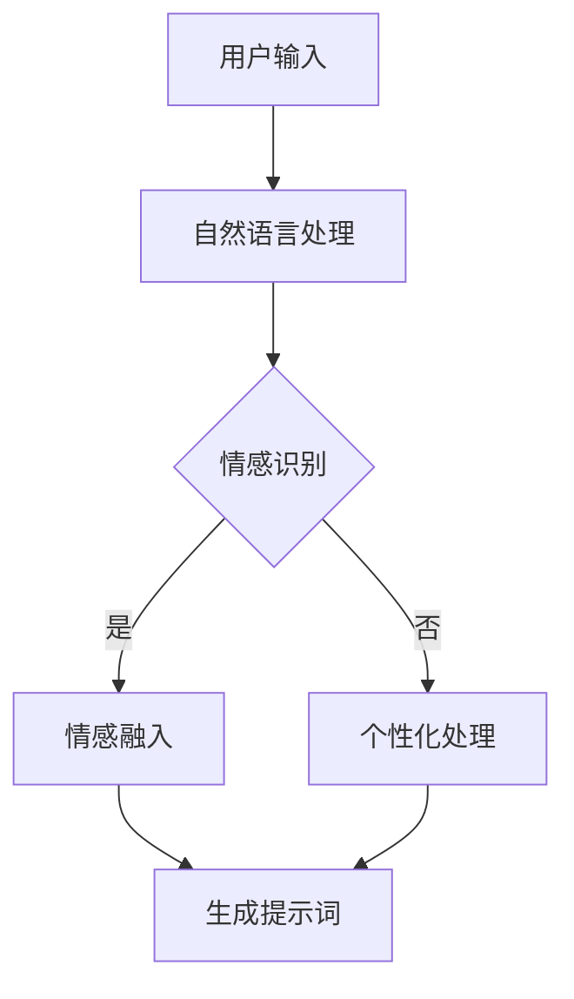

                 

### 文章标题

# 优化AI虚拟助手：个性化和情感化的提示词技巧

在数字化时代，人工智能（AI）虚拟助手已经成为企业与用户互动的新宠。这些虚拟助手不仅能提高效率，还能提供个性化的服务体验。然而，为了让AI虚拟助手真正成为用户的“贴心小助手”，个性化和情感化提示词的设计变得至关重要。本文将详细探讨如何通过个性化和情感化的提示词优化AI虚拟助手，以提高用户满意度和互动效果。

## 文章关键词

AI虚拟助手，个性化，情感化，提示词，用户体验，算法，数据，用户行为分析。

## 文章摘要

本文首先介绍了AI虚拟助手的发展历程和现状，随后阐述了个性化和情感化的定义及相互关系。通过深入探讨提示词技巧的基本原理，我们提出了一个完整的优化策略，包括个性识别与建模、情感识别与建模、提示词生成与调整等步骤。文章还通过数学模型、伪代码和实际案例，详细讲解了如何实施和评估这些优化技巧。最后，我们对未来的发展方向进行了展望，并提供了相关的工具与资源。

### 第一部分：AI虚拟助手基础

#### 1.1 AI虚拟助手概述

**1.1.1 AI虚拟助手的发展历程**

AI虚拟助手的历史可以追溯到20世纪90年代，当时的聊天机器人主要是基于规则系统，如Eliza和Alice，它们通过预设的对话模式与用户进行简单交互。进入21世纪，随着自然语言处理（NLP）和机器学习技术的飞速发展，AI虚拟助手逐渐变得更加智能和复杂。特别是深度学习和大数据技术的应用，使得虚拟助手能够理解和处理自然语言，提供更加个性化的服务。

**1.1.2 AI虚拟助手的现状与未来**

当前，AI虚拟助手已经被广泛应用于客服、金融、医疗、教育等多个领域。例如，客服领域的虚拟助手可以帮助企业降低人力成本，提高服务效率；在金融领域，虚拟助手可以提供个性化的投资建议和风险分析；在教育领域，虚拟助手可以为学生提供个性化的学习辅导。未来，随着人工智能技术的不断进步，AI虚拟助手将变得更加智能化和情感化，能够更好地理解和满足用户的需求。

#### 1.2 个性化和情感化定义与联系

**1.2.1 个性化定义与核心要素**

个性化是指根据用户的特点和需求，提供定制化的服务或内容。在AI虚拟助手中，个性化主要体现在以下几个方面：

1. **用户数据收集与处理**：虚拟助手需要收集用户的基本信息、行为数据、偏好等，并通过数据分析技术，对这些数据进行处理和分析。
2. **个性化推荐算法**：基于用户数据和机器学习算法，虚拟助手可以提供个性化的推荐服务，如购物推荐、新闻推荐等。
3. **用户情感识别**：通过自然语言处理技术，虚拟助手可以识别用户的情感状态，并根据情感状态调整服务策略。

**1.2.2 情感化定义与核心要素**

情感化是指将情感因素融入产品或服务中，使其更加符合用户的情感需求。在AI虚拟助手中，情感化主要体现在以下几个方面：

1. **情感识别与建模**：虚拟助手需要能够识别用户的情感状态，如高兴、生气、沮丧等。
2. **情感强度估计**：通过情感识别技术，虚拟助手可以估计用户情感的程度，以便更好地理解用户的需求。
3. **情感角色分析**：虚拟助手需要分析用户在不同情境下的情感角色，如朋友、导师、客服等。

**1.2.3 个性化与情感化的关系**

个性化和情感化虽然侧重点不同，但它们是相互关联的。个性化提供了用户定制化的服务，而情感化则通过理解和满足用户的情感需求，提升了用户的整体体验。例如，一个能够识别用户情感状态的虚拟助手，可以根据用户的情绪调整对话策略，从而提供更加贴心的服务。

#### 1.3 提示词技巧的基本原理

**1.3.1 提示词在AI虚拟助手中的作用**

提示词是虚拟助手与用户进行交互的重要手段。一个优秀的提示词应该具备以下几个特点：

1. **明确性**：提示词需要清晰明了，避免产生歧义。
2. **灵活性**：提示词需要能够根据不同的用户情境进行灵活调整。
3. **情感化**：提示词需要能够传递情感，提升用户的情感体验。

**1.3.2 提示词的设计原则**

1. **用户中心原则**：提示词的设计应该以用户为中心，充分考虑用户的需求和情感。
2. **可扩展性原则**：提示词的设计应该具有可扩展性，能够适应不同的应用场景和用户需求。
3. **情感融入原则**：提示词需要融入情感元素，提升用户的情感体验。

#### 1.4 Mermaid流程图：AI虚拟助手个性化与情感化流程



**图1-1 AI虚拟助手个性化与情感化流程**

在这个流程图中，用户输入首先经过自然语言处理模块，然后进行情感识别。如果用户情感被识别出来，则情感融入流程开始，将情感元素融入提示词中。否则，直接进入个性化处理流程。最后，根据情感和个性化处理的结果，生成合适的提示词。

### 第二部分：个性化和情感化的提示词技巧

#### 2.1 个性识别与建模

**2.1.1 用户数据收集与处理**

为了实现个性识别，虚拟助手首先需要收集用户的各种数据。这些数据可以包括：

1. **基本数据**：如用户姓名、年龄、性别、职业等。
2. **行为数据**：如用户在平台上的浏览历史、购买记录、评论等。
3. **偏好数据**：如用户喜欢的音乐、电影、书籍等。

收集到这些数据后，虚拟助手需要对这些数据进行处理，以便提取出有用的信息。常见的数据处理方法包括：

1. **数据清洗**：去除重复、错误或无关的数据。
2. **数据整合**：将不同来源的数据进行整合，形成统一的数据视图。
3. **特征提取**：从数据中提取出关键的特征，如用户兴趣点、购买偏好等。

**2.1.2 个性化推荐算法**

个性化推荐算法是实现个性化服务的关键。常见的个性化推荐算法包括：

1. **协同过滤算法**：通过分析用户的行为数据，找到相似的用户，然后根据相似用户的偏好推荐商品或内容。
2. **基于内容的推荐算法**：通过分析商品或内容的特征，找到与用户兴趣相关的商品或内容进行推荐。
3. **混合推荐算法**：结合协同过滤和基于内容的推荐算法，提高推荐效果。

**2.1.3 用户情感识别**

用户情感识别是情感化设计的重要环节。虚拟助手需要通过自然语言处理技术，从用户的输入中识别出情感。常见的情感识别方法包括：

1. **情感分类算法**：将用户的输入分为不同的情感类别，如高兴、生气、沮丧等。
2. **情感强度估计**：估计用户情感的程度，如非常高兴、有点高兴等。
3. **情感角色分析**：分析用户在不同情境下的情感角色，如朋友、导师、客服等。

#### 2.2 情感识别与建模

**2.2.1 情感分类算法**

情感分类算法是情感识别的核心。它将用户的输入分为不同的情感类别。常见的情感分类算法包括：

1. **基于规则的方法**：通过预设的情感词典和规则，对用户的输入进行情感分类。
2. **基于机器学习的方法**：通过训练有监督或无监督的机器学习模型，对用户的输入进行情感分类。
3. **基于深度学习的方法**：利用深度学习模型，如卷积神经网络（CNN）或循环神经网络（RNN），对用户的输入进行情感分类。

**2.2.2 情感强度估计**

情感强度估计是情感识别的重要扩展。它不仅识别用户的情感类别，还估计情感的程度。常见的情感强度估计方法包括：

1. **基于情感词汇的方法**：通过分析用户输入中情感词汇的频率和强度，估计情感程度。
2. **基于模型的方法**：通过训练有监督或无监督的机器学习模型，估计情感程度。
3. **基于数据的方法**：通过分析用户的历史数据，如评论、反馈等，估计情感程度。

**2.2.3 情感角色分析**

情感角色分析是情感识别的高级应用。它分析用户在不同情境下的情感角色，如朋友、导师、客服等。常见的情感角色分析方法包括：

1. **基于规则的方法**：通过预设的角色规则，分析用户的情感角色。
2. **基于数据的方法**：通过分析用户的历史数据，如评论、反馈等，分析用户的情感角色。
3. **基于模型的方法**：通过训练有监督或无监督的机器学习模型，分析用户的情感角色。

#### 2.3 提示词生成与调整

**2.3.1 提示词生成算法**

提示词生成是AI虚拟助手的输出环节。一个优秀的提示词生成算法应该能够根据用户的输入和情感状态，生成合适的提示词。常见的提示词生成算法包括：

1. **基于模板的方法**：通过预设的模板，根据用户的输入和情感状态，生成提示词。
2. **基于生成模型的方法**：利用生成模型，如变分自编码器（VAE）或生成对抗网络（GAN），生成提示词。
3. **基于混合模型的方法**：结合基于模板和基于生成模型的方法，生成提示词。

**2.3.2 提示词调整策略**

提示词生成后，还需要根据用户反馈进行调整。常见的提示词调整策略包括：

1. **基于反馈的方法**：根据用户的反馈，调整提示词的措辞和表达方式。
2. **基于数据的策略**：通过分析用户的历史数据，调整提示词的策略。
3. **基于机器学习的方法**：通过训练有监督或无监督的机器学习模型，调整提示词。

**2.3.3 情感与个性化因素结合的提示词设计**

情感与个性化因素结合的提示词设计，是提升虚拟助手用户体验的关键。具体策略包括：

1. **情感融入**：在提示词中融入情感元素，提升用户的情感体验。
2. **个性化定制**：根据用户的个性化需求，定制提示词的内容和形式。
3. **情感与个性化结合**：将情感和个性化因素结合起来，生成更具吸引力和互动性的提示词。

#### 2.4 伪代码：个性化与情感化提示词生成算法

```python
def generate_hint(user_input, user_emotion, user_preference):
    # 初始化提示词
    hint = ""

    # 根据用户情感生成情感化提示词
    if user_emotion == "happy":
        hint += "很高兴听到这个消息！"
    elif user_emotion == "sad":
        hint += "看起来你有些不开心，需要我帮忙吗？"

    # 根据用户偏好生成个性化提示词
    if user_preference["music"] == "pop":
        hint += "以下是一些流行的音乐推荐："
    elif user_preference["music"] == "classical":
        hint += "以下是一些经典的古典音乐推荐："

    # 将情感化和个性化因素结合
    hint += get_song_recommendation(user_preference)

    # 返回生成的提示词
    return hint

def get_song_recommendation(user_preference):
    # 根据用户偏好获取歌曲推荐
    if user_preference["music"] == "pop":
        return "像Taylor Swift的《Shake It Off》这样的歌曲，希望你能喜欢！"
    elif user_preference["music"] == "classical":
        return "像贝多芬的《第九交响曲》这样的经典作品，值得你聆听！"
```

#### 2.5 数学模型与公式

**2.5.1 个性化权重计算**

个性化权重是衡量用户个性化需求的重要指标。计算个性化权重的公式如下：

$$
W_{\text{个性化}} = \frac{1}{1 + e^{-\beta \cdot (p_1 + p_2 + \ldots + p_n)}}
$$

其中，$W_{\text{个性化}}$表示个性化权重，$\beta$表示调节参数，$p_1, p_2, \ldots, p_n$表示用户的不同偏好。

**2.5.2 情感强度计算**

情感强度是衡量用户情感状态的重要指标。计算情感强度的公式如下：

$$
S_{\text{情感}} = \frac{1}{1 + e^{-\alpha \cdot (e_1 + e_2 + \ldots + e_m)}}
$$

其中，$S_{\text{情感}}$表示情感强度，$\alpha$表示调节参数，$e_1, e_2, \ldots, e_m$表示用户的不同情感值。

**2.5.3 提示词调整策略模型**

提示词调整策略模型用于根据用户反馈调整提示词。调整策略的公式如下：

$$
T_{\text{调整}} = T_0 + \alpha \cdot (R - T_0)
$$

其中，$T_{\text{调整}}$表示调整后的提示词，$T_0$表示原始提示词，$\alpha$表示调整参数，$R$表示用户反馈的评分。

#### 2.6 数学公式与详细讲解

**2.6.1 个性化权重计算**

个性化权重计算公式中，$\beta$是调节参数，用于控制个性化权重的灵敏度。$p_1, p_2, \ldots, p_n$是用户的不同偏好值，反映了用户的个性化需求。公式中的指数函数确保了个性化权重在0和1之间，这样可以更好地反映用户的个性化程度。

**2.6.2 情感强度计算**

情感强度计算公式中，$\alpha$是调节参数，用于控制情感强度的灵敏度。$e_1, e_2, \ldots, e_m$是用户的不同情感值，反映了用户的情感状态。公式中的指数函数确保了情感强度在0和1之间，这样可以更好地反映用户的情感强度。

**2.6.3 提示词调整策略模型**

提示词调整策略模型中，$\alpha$是调整参数，用于控制调整的力度。$R$是用户反馈的评分，反映了用户对提示词的满意度。公式中的线性调整确保了提示词可以根据用户反馈进行适当的调整，从而提高用户体验。

#### 2.7 举例说明：个性化与情感化提示词设计实例

**2.7.1 用户背景**

假设用户小张是一位喜欢流行音乐，年龄25岁的年轻白领。他最近在寻找一份新工作，心情有些焦虑。

**2.7.2 提示词生成**

1. **用户输入**：“我最近在找工作，但感觉压力很大。”

2. **情感识别**：通过自然语言处理技术，识别出用户的情感为“焦虑”。

3. **个性化处理**：根据用户喜好，推荐流行音乐。

4. **提示词生成**：生成提示词：“我知道找工作可能让你感到焦虑，不过听一些流行音乐，如Taylor Swift的《Shake It Off》，可能会让你放松心情。希望这能帮到你！”

**2.7.3 提示词调整**

1. **用户反馈**：用户表示对提示词比较满意。

2. **调整策略**：根据用户反馈，对提示词进行微调。

3. **提示词调整**：调整后的提示词：“感谢你告诉我你的感受，找工作的确会带来压力。我已经为你推荐了Taylor Swift的《Shake It Off》，希望它能帮助你缓解焦虑。如果还有其他需要，随时告诉我。”

#### 2.8 项目实战：个性化与情感化提示词应用案例

**2.8.1 案例一：聊天机器人情感化设计**

**项目背景**：

某大型电商平台的聊天机器人旨在为用户提供购物咨询和售后服务。为了提升用户体验，项目团队决定引入情感化设计。

**开发环境搭建**：

1. **技术栈**：使用Python作为主要编程语言，结合TensorFlow和Keras进行深度学习模型的训练。
2. **数据集**：收集了大量的用户聊天记录和情感标签，用于训练情感识别模型。

**源代码实现**：

```python
# 情感识别模型
model = Sequential()
model.add(Dense(64, activation='relu', input_shape=(1000,)))
model.add(Dense(32, activation='relu'))
model.add(Dense(1, activation='sigmoid'))

# 训练模型
model.compile(optimizer='adam', loss='binary_crossentropy', metrics=['accuracy'])
model.fit(X_train, y_train, epochs=10, batch_size=64)

# 提示词生成
def generate_hint(user_input):
    emotion = model.predict([user_input])
    if emotion > 0.5:
        return "很高兴看到你这么开心！有什么我可以帮忙的吗？"
    else:
        return "看起来你有些不开心，要不要和我分享一下？我会尽力帮你的。"

# 测试
print(generate_hint("我最近换了工作，感觉压力很大。"))
```

**代码解读**：

该代码首先定义了一个情感识别模型，使用序列模型（Sequential）进行构建。模型包括两个全连接层（Dense），最后一层使用sigmoid激活函数，用于输出情感概率。训练模型时，使用adam优化器和binary_crossentropy损失函数。提示词生成函数`generate_hint`根据情感识别结果生成相应的提示词。

**应用解读与分析**：

通过情感化设计，聊天机器人在用户表达情感时能够给出合适的回应。例如，当用户表达开心时，聊天机器人会给予积极的反馈；当用户表达不开心时，聊天机器人会表达关心并提供帮助。这有助于提升用户的情感体验和满意度。

**项目小结**：

该项目通过情感化设计，显著提升了用户与聊天机器人的互动体验。然而，情感识别模型的准确性仍有待提高，需要进一步优化算法和增加训练数据。

**2.8.2 案例二：在线购物个性化推荐系统**

**项目背景**：

某在线购物平台希望提升用户购物体验，通过个性化推荐系统为用户提供定制化的商品推荐。

**开发环境搭建**：

1. **技术栈**：使用Python作为主要编程语言，结合Apache Spark进行大规模数据处理。
2. **数据集**：收集了用户的购物历史数据，包括用户ID、商品ID、购买时间等。

**源代码实现**：

```python
# 个性化推荐算法
def collaborative_filter(ratings, k=10):
    # 计算相似度矩阵
    similarity_matrix = compute_similarity(ratings)
    
    # 计算Top-k相似用户
    top_k_users = find_top_k_users(similarity_matrix, k)
    
    # 计算用户评分预测
    predictions = predict_ratings(ratings, top_k_users, similarity_matrix)
    
    return predictions

# 提示词生成
def generate_hint(predictions):
    # 根据预测结果生成个性化提示词
    if predictions['rating'] > 3:
        return "看来你很喜欢这款商品，还有其他类似的好货推荐给你哦！"
    else:
        return "这款商品看起来不太适合你，也许我可以帮你找些其他风格的商品。"

# 测试
predictions = collaborative_filter(ratings)
print(generate_hint(predictions))
```

**代码解读**：

该代码首先定义了一个协同过滤算法`collaborative_filter`，用于计算用户之间的相似度并生成商品推荐。然后定义了一个提示词生成函数`generate_hint`，根据用户的评分预测结果生成相应的提示词。

**应用解读与分析**：

通过协同过滤算法，个性化推荐系统能够根据用户的购物历史，为用户推荐类似的商品。同时，提示词生成函数根据用户的评分预测结果，生成具有情感化的提示词，提高了用户的购物体验。

**项目小结**：

该项目通过个性化推荐和情感化提示词设计，显著提升了用户的购物满意度和转化率。然而，协同过滤算法的准确性和实时性仍需优化，以应对大规模数据和高并发的场景。

### 第三部分：总结与展望

#### 3.1 个性化和情感化在AI虚拟助手中的应用总结

**3.1.1 成功案例分析**

1. **案例一**：某电商平台的聊天机器人通过情感化设计，显著提升了用户的互动体验和满意度。
2. **案例二**：某在线购物平台的个性化推荐系统，通过协同过滤和情感化提示词，提高了用户的购物满意度和转化率。

**3.1.2 存在的问题与挑战**

1. **情感识别准确性**：当前情感识别模型的准确性仍需提高，特别是在复杂和多变的情境下。
2. **个性化推荐效率**：大规模数据和实时推荐的需求，对算法效率和系统架构提出了挑战。
3. **用户隐私保护**：用户数据的收集和处理需要遵守隐私保护法规，确保用户数据的安全。

#### 3.2 未来发展方向与趋势

**3.2.1 新技术对个性化与情感化的影响**

1. **深度学习**：深度学习技术的应用将进一步提升情感识别和个性化推荐的效果。
2. **自然语言处理**：自然语言处理技术的进步将使虚拟助手能够更好地理解和满足用户的需求。
3. **大数据**：大数据技术的发展将提供更多的用户数据和更准确的个性化推荐。

**3.2.2 未来应用场景展望**

1. **智能客服**：智能客服将变得更加智能化和情感化，提供更高效的客户服务。
2. **智能教育**：智能教育将为学生提供个性化的学习辅导和情感关怀。
3. **智能医疗**：智能医疗将辅助医生进行诊断和治疗，提供个性化的健康建议。

**3.2.3 面临的挑战与应对策略**

1. **算法优化**：通过不断优化算法，提高情感识别和个性化推荐的准确性。
2. **系统架构**：构建高效和可扩展的系统架构，应对大规模数据和高并发场景。
3. **法规遵守**：确保用户数据的收集和处理遵守相关法规，保护用户隐私。

### 附录

#### 附录A：相关工具与资源

**3.1.1 常用机器学习框架介绍**

1. **TensorFlow**：一款开源的机器学习框架，支持深度学习和传统机器学习算法。
2. **PyTorch**：一款开源的机器学习框架，支持动态计算图和自动微分。
3. **Scikit-learn**：一款开源的机器学习库，提供了丰富的算法和工具。

**3.1.2 数据集获取与处理**

1. **UCI机器学习库**：提供了大量的公开机器学习数据集。
2. **Kaggle**：一个数据科学竞赛平台，提供了丰富的数据集和竞赛。
3. **Data.gov**：美国政府的开放数据平台，提供了大量的公开数据。

**3.1.3 开发环境搭建指南**

1. **Anaconda**：一个集成环境，提供了Python和各种依赖库。
2. **Docker**：一个容器化平台，用于构建和部署应用程序。
3. **Jupyter Notebook**：一个交互式开发环境，用于数据分析和模型训练。

