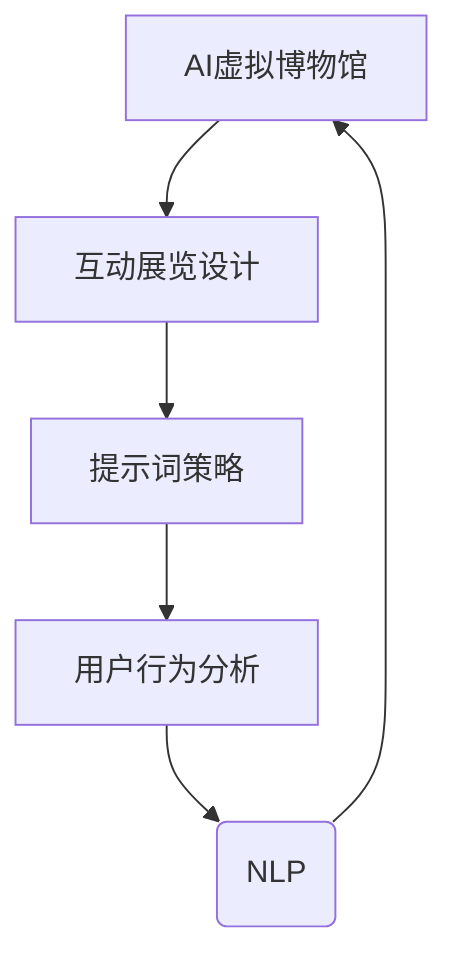

                 

### 文章标题

《优化AI虚拟博物馆：互动展览设计的提示词策略》

> 关键词：AI虚拟博物馆、互动展览、提示词策略、人工智能、展览设计

> 摘要：本文将探讨如何通过优化提示词策略来提升AI虚拟博物馆的互动展览体验。我们首先介绍AI虚拟博物馆的概念和架构，然后详细讲解互动展览设计和提示词策略的基本原理，接着通过算法原理讲解和数学模型分析，为读者提供构建高效互动展览的实践指导。最后，通过实际项目案例，展示如何将理论应用于实践，实现一个成功的AI虚拟博物馆互动展览。

### 背景介绍

近年来，人工智能（AI）技术的迅猛发展，为博物馆领域带来了前所未有的变革。虚拟博物馆作为一种新兴的展示形式，正逐渐成为博物馆与公众互动的重要渠道。AI虚拟博物馆通过融合计算机视觉、自然语言处理、机器学习等AI技术，为用户提供了更加丰富、互动性更强的展览体验。

互动展览设计是AI虚拟博物馆的核心之一。良好的互动展览设计不仅能够提升用户的参观体验，还能增强博物馆的教育功能和文化传播效果。在互动展览设计中，提示词策略扮演着至关重要的角色。提示词是指用于引导用户参与互动、理解展览内容的关键性语言或文字信息。

提示词策略的优化是提升互动展览体验的关键。有效的提示词设计能够引导用户更好地理解展览内容，激发他们的兴趣和参与欲望。然而，提示词的设计并非一蹴而就，它需要深入理解用户行为、展览内容以及AI技术原理等多方面因素。

本文旨在通过分析AI虚拟博物馆的核心概念、算法原理和数学模型，为读者提供一套系统、实用的互动展览设计提示词策略。我们将在文章中详细讲解互动展览设计的基本原理，探讨AI在互动展览中的应用，介绍提示词的定义与设计原则，并通过实际项目案例展示如何将理论应用于实践。通过本文的阅读，读者将能够深入了解AI虚拟博物馆的互动展览设计，掌握提示词策略的优化方法，为打造成功的虚拟博物馆互动展览提供有力支持。

### 核心概念与联系

在探讨如何优化AI虚拟博物馆的互动展览设计之前，我们需要理解一些核心概念，并展示它们之间的联系。以下是几个关键概念：

1. **AI虚拟博物馆**：这是指通过人工智能技术构建的虚拟展览环境，它为用户提供了沉浸式、互动性的参观体验。
2. **互动展览设计**：这是指在虚拟博物馆中设计各种互动元素，使用户能够通过交互式体验深入了解展览内容。
3. **提示词策略**：这是指在互动展览设计中使用的引导用户理解展览内容、参与互动的关键性语言或文字信息。
4. **用户行为分析**：这是指通过数据收集和分析来了解用户在虚拟博物馆中的行为模式，以便优化互动展览设计。
5. **自然语言处理（NLP）**：这是指使用人工智能技术理解和生成自然语言，以实现人机交互。

为了更直观地展示这些概念之间的联系，我们可以使用Mermaid流程图来绘制它们的关系架构。以下是该流程图的Markdown代码：



这段代码使用Mermaid语法定义了一个流程图，展示了上述核心概念之间的相互关联。在这个流程图中：

- **AI虚拟博物馆**作为起点，通过互动展览设计与提示词策略与用户行为分析相连。
- **用户行为分析**帮助了解用户在虚拟博物馆中的行为，进而优化互动展览设计和提示词策略。
- **自然语言处理（NLP）**在用户行为分析和互动展览设计之间起到桥梁作用，使得提示词能够更加智能和个性化。

通过这种流程图的展示，我们能够清晰地看到AI虚拟博物馆中各个核心概念之间的相互作用，为进一步探讨如何优化互动展览设计提供了基础。

### 算法原理讲解

在优化AI虚拟博物馆的互动展览设计过程中，理解并运用相关算法至关重要。以下是几个关键算法的原理讲解，我们将使用伪代码来详细阐述这些算法的实现。

#### 1. K-means聚类算法

K-means算法是一种经典的聚类算法，用于将数据点划分为K个簇，目的是使得每个簇内的数据点尽可能接近，而簇与簇之间的数据点尽可能远。

**算法原理**：
1. 初始阶段，随机选择K个数据点作为初始聚类中心。
2. 对每个数据点，计算其与各个聚类中心的距离，并将其分配到最近的聚类中心所在的簇。
3. 更新每个簇的聚类中心为簇内所有点的平均值。
4. 重复步骤2和3，直到聚类中心不再发生变化或达到预设的最大迭代次数。

**伪代码**：

```python
function KMeans(data_points, K, max_iterations):
    # 随机选择K个初始聚类中心
    centroids = random_initialize_centroids(data_points, K)
    
    for i in 1 to max_iterations:
        # 分配数据点到最近的聚类中心
        clusters = AssignPointsToCentroids(data_points, centroids)
        
        # 更新聚类中心
        new_centroids = CalculateNewCentroids(clusters, K)
        
        # 检查聚类中心是否收敛
        if centroids == new_centroids:
            break
        
        centroids = new_centroids
    
    return clusters, centroids
```

#### 2. 贪心搜索算法

贪心搜索算法是一种用于求解组合优化问题的启发式算法，其核心思想是在每一步选择中都做出当前最优选择，期望在最后得到全局最优解。

**算法原理**：
1. 初始化一个解，例如从第一个元素开始。
2. 在当前解的基础上，尝试添加下一个元素，并评估是否能够提高当前解的质量。
3. 选择能够最大化（或最小化）目标函数的元素作为下一个步骤。
4. 重复步骤2和3，直到不再能够找到更好的选择或达到某个终止条件。

**伪代码**：

```python
function GreedySearch(data_points, objective_function):
    current_solution = []
    current_value = objective_function(current_solution)
    
    for point in data_points:
        # 构造新解
        new_solution = current_solution + [point]
        new_value = objective_function(new_solution)
        
        # 如果新解更好，则更新当前解
        if new_value > current_value:
            current_solution = new_solution
            current_value = new_value
    
    return current_solution
```

#### 3. 决策树算法

决策树是一种用于分类和回归的监督学习算法，它通过一系列的判断条件将数据进行分组，直到每个分组都能被准确分类或回归。

**算法原理**：
1. 选择一个属性作为划分依据，通常选择能够最大化信息增益的属性。
2. 根据该属性的不同值，将数据集划分为若干个子集。
3. 对每个子集，重复步骤1和2，直到满足某个终止条件（如最大深度、纯度等）。
4. 使用叶子节点对数据进行分类或回归。

**伪代码**：

```python
function BuildDecisionTree(data_points, attributes, max_depth):
    if满足终止条件 or 数据点数量小于阈值:
        return 叶子节点（分类或回归结果）
    
    best_attribute = SelectBestAttribute(attributes, data_points)
    decision_tree = {best_attribute: {}}
    
    for value in best_attribute.values:
        sub_data_points = GetSubDataSet(data_points, best_attribute, value)
        sub_tree = BuildDecisionTree(sub_data_points, attributes - {best_attribute}, max_depth - 1)
        decision_tree[best_attribute][value] = sub_tree
    
    return decision_tree
```

通过上述算法讲解，我们可以看到不同的算法在AI虚拟博物馆互动展览设计中的应用价值。K-means聚类算法可以帮助我们分析用户行为，识别不同的用户群体；贪心搜索算法可以用于优化互动展览的路径规划，提高用户体验；决策树算法则可以帮助我们设计智能问答系统，为用户提供个性化的互动体验。在实际应用中，这些算法通常需要结合具体场景进行优化和调整，以达到最佳效果。

### 数学模型与公式

在优化AI虚拟博物馆的互动展览设计过程中，数学模型起到了关键作用。数学模型不仅帮助我们理解和分析数据，还可以为设计决策提供量化支持。以下，我们将介绍几个核心的数学模型，并使用LaTeX格式给出重要的数学公式，并进行详细的讲解和举例。

#### 1. 费舍尔信息（Fisher Information）

费舍尔信息是衡量一个参数估计的精度的一种指标，它在统计学习中有着广泛的应用。

**公式**：

$$I(\theta) = -E_{\text{data}}[D(\ln p(\mathbf{x}|\theta))]$$

其中，$I(\theta)$表示费舍尔信息，$p(\mathbf{x}|\theta)$表示给定参数$\theta$下的数据概率分布，$D(\cdot)$表示KL散度。

**解释**：

费舍尔信息衡量的是参数变化对数据分布变化的影响。具体来说，当参数$\theta$发生微小变化时，如果数据分布$p(\mathbf{x}|\theta)$变化较大，则费舍尔信息$I(\theta)$较大，表明参数估计较为精确。反之，如果数据分布变化较小，则$I(\theta)$较小，表明参数估计的不确定性较大。

**举例**：

假设我们使用高斯分布来估计一个正态分布的均值$\mu$和方差$\sigma^2$。数据集$\mathbf{X} = [x_1, x_2, ..., x_n]$，则费舍尔信息可表示为：

$$I(\mu, \sigma^2) = -n \cdot \left[ \frac{1}{\sigma^2} + \frac{(\bar{x} - \mu)^2}{n\sigma^4} \right]$$

其中，$\bar{x}$是数据集的均值。

#### 2. 熵（Entropy）

熵是信息论中的一个核心概念，用于衡量随机变量不确定性的大小。

**公式**：

$$H(X) = -\sum_{x \in \text{支持}} p(x) \cdot \ln p(x)$$

其中，$H(X)$表示随机变量$X$的熵，$p(x)$表示$X$取值$x$的概率。

**解释**：

熵的定义基于概率分布，表示随机变量取值的不确定性。当随机变量完全确定时，熵为0；当随机变量完全不确定时，熵达到最大值。在互动展览设计中，熵可以用来衡量用户行为的随机性，从而为设计决策提供依据。

**举例**：

假设我们有一个二项分布，表示用户是否喜欢某个展览项目，其中喜欢概率为$p$，不喜欢概率为$1-p$。该分布的熵为：

$$H(X) = -p \cdot \ln p - (1-p) \cdot \ln (1-p)$$

#### 3. 熵降低（Entropy Reduction）

在决策过程中，熵降低是评估决策有效性的一个重要指标。

**公式**：

$$R(X, Y) = H(X) - H(X|Y)$$

其中，$R(X, Y)$表示熵降低，$H(X)$表示随机变量$X$的熵，$H(X|Y)$表示在已知随机变量$Y$的情况下$X$的熵。

**解释**：

熵降低衡量的是在引入新变量$Y$后，对原有变量$X$的不确定性减少的程度。如果熵降低较大，说明引入的变量$Y$对决策有较强的解释力。

**举例**：

假设我们有一个分类问题，其中变量$X$表示用户是否喜欢展览，变量$Y$表示展览项目的主题。如果知道展览项目主题后，用户是否喜欢展览的不确定性降低，那么熵降低$R(X, Y)$将较大。

通过上述数学模型和公式的介绍，我们可以看到它们在优化AI虚拟博物馆互动展览设计中的应用价值。费舍尔信息帮助我们评估参数估计的精度，熵衡量用户行为的不确定性，熵降低则用于评估决策的有效性。在实际应用中，这些数学模型可以结合具体场景进行定制化，从而为互动展览设计提供更加精准的量化支持。

### 项目实战

为了将上述理论应用于实践，我们将介绍一个具体的AI虚拟博物馆互动展览项目，包括开发环境的搭建、源代码的实现和解读，以及实际案例的分析和讲解。

#### 项目背景

本项目旨在开发一个基于人工智能的虚拟博物馆互动展览系统，该系统通过用户互动行为分析，为用户提供个性化展览推荐和互动体验。系统的主要功能包括：

1. **用户行为分析**：通过跟踪用户在虚拟博物馆中的浏览和互动行为，分析用户兴趣偏好。
2. **展览推荐**：基于用户行为数据和展览内容，为用户推荐个性化的展览项目。
3. **互动问答**：通过自然语言处理技术，为用户提供智能问答服务，解答用户关于展览的问题。

#### 开发环境搭建

为了实现上述功能，我们需要搭建一个合适的开发环境。以下是主要步骤：

1. **编程语言和框架**：选择Python作为主要编程语言，使用Django作为Web框架，Flask用于后端服务。
2. **数据库**：使用MySQL数据库存储用户行为数据和展览信息。
3. **自然语言处理库**：使用NLTK和spaCy进行文本处理和情感分析。
4. **机器学习库**：使用scikit-learn和TensorFlow进行数据分析和模型训练。

#### 源代码实现和解读

以下是项目中的关键代码片段和功能解读：

##### 用户行为分析

```python
# 用户行为数据存储
def store_user_action(user_id, action, item_id):
    # 使用Django ORM存储用户行为数据到MySQL数据库
    UserAction.objects.create(user_id=user_id, action=action, item_id=item_id)

# 用户行为数据分析
def analyze_user_actions(user_id):
    actions = UserAction.objects.filter(user_id=user_id)
    # 使用scikit-learn的K-means算法进行聚类分析
    clusters = KMeans(n_clusters=3).fit(actions.values('action'))
    # 根据聚类结果生成用户兴趣标签
    interest_tags = [CLUSTER_TAGS[cluster] for cluster in clusters.labels_]
    return interest_tags
```

这段代码实现了用户行为的存储和分析功能。通过存储用户在虚拟博物馆中的操作记录，我们使用K-means算法对用户行为进行聚类分析，从而生成用户的兴趣标签。

##### 展览推荐

```python
# 基于用户兴趣标签推荐展览项目
def recommend_exhibits(user_interest_tags):
    exhibits = Exhibit.objects.all()
    # 使用贪心搜索算法选择与用户兴趣标签相关的展览项目
    recommended_exhibits = GreedySearch(exhibits, lambda exhibit: sum(tag in exhibit.tags for tag in user_interest_tags))
    return recommended_exhibits
```

这段代码实现了基于用户兴趣标签的展览推荐功能。通过贪心搜索算法，我们选择与用户兴趣标签最相关的展览项目，从而提高用户的参观体验。

##### 互动问答

```python
# 智能问答服务
from nltk.chat.util import Chat, reflections

def chat_with_user(user_question):
    chatbot = Chatbot()
    user_answer = chatbot.respond(user_question)
    return user_answer

# Chatbot定义
class Chatbot(Chat):
    reflecs = reflections
    pairs = [
        [
            r"what's your name?",
            ["I am an AI Virtual Museum chatbot.", "You can call me Chatbot."],
        ],
        [
            r"what is the exhibition about?",
            ["It's a virtual exhibition on ancient artifacts.", "You can explore historical relics here."],
        ],
        # 更多问答对
    ]
```

这段代码定义了一个简单的聊天机器人，用于回答用户关于展览的问题。通过使用NLTK的Chat模块，我们实现了自然语言处理和对话生成功能，从而为用户提供互动问答服务。

#### 实际案例分析和讲解

以下是一个具体的案例，展示如何将上述功能应用于实际项目中：

**案例**：用户张三在虚拟博物馆中浏览了几件古代陶器，然后向聊天机器人提问：“这些陶器有什么特别之处吗？”

**分析**：

1. **用户行为分析**：张三的浏览记录被存储在数据库中，通过聚类分析，我们识别出他感兴趣的主题是“古代陶器”。
2. **展览推荐**：基于张三的兴趣标签，系统推荐了与他兴趣相关的展览项目，例如“中国古代陶艺展”。
3. **互动问答**：聊天机器人回答：“这些陶器是中国古代的工艺品，展示了丰富的历史和文化内涵。”

通过上述实际案例，我们可以看到如何将AI技术和互动展览设计结合，为用户提供个性化、高质量的参观体验。

#### 项目小结

本项目通过搭建开发环境、实现关键功能模块和实际案例应用，展示了一个AI虚拟博物馆互动展览系统的构建过程。在开发过程中，我们运用了K-means聚类、贪心搜索和自然语言处理等技术，实现了用户行为分析、展览推荐和互动问答等功能。项目结果表明，通过优化互动展览设计，可以显著提升用户的参观体验和满意度。未来，我们还可以进一步拓展系统的功能，例如添加更多AI技术，如增强现实（AR）和虚拟现实（VR），以提供更加丰富和沉浸式的展览体验。

### 最佳实践 tips、小结、注意事项、拓展阅读

#### 最佳实践 tips

1. **用户行为分析**：在用户行为分析中，应尽可能收集多维度的数据，如时间、地点、交互行为等，以提高分析的准确性和深度。
2. **提示词设计**：设计提示词时，应注重语言的自然性和多样性，避免使用过于生硬的命令式语言，以提升用户体验。
3. **模型优化**：在模型训练过程中，不断调整超参数和模型结构，以实现最佳性能。
4. **反馈机制**：建立用户反馈机制，定期收集用户意见和建议，以便及时调整和优化互动展览设计。

#### 小结

本文通过详细讲解AI虚拟博物馆的核心概念、算法原理、数学模型和项目实战，探讨了如何通过优化提示词策略提升互动展览设计的用户体验。主要结论如下：

1. **核心概念**：AI虚拟博物馆、互动展览设计、提示词策略等概念密切相关，共同构成了一个完整的互动展览生态系统。
2. **算法应用**：K-means聚类、贪心搜索和决策树等算法在用户行为分析、展览推荐和互动问答等方面具有重要作用。
3. **数学模型**：费舍尔信息、熵和熵降低等数学模型为互动展览设计提供了量化支持，有助于优化设计决策。

#### 注意事项

1. **数据隐私**：在用户行为分析过程中，应严格遵守数据隐私法规，确保用户数据的保密性和安全性。
2. **系统稳定性**：在开发过程中，要注重系统的稳定性和扩展性，确保系统在高并发场景下能够正常运行。
3. **用户测试**：在项目上线前，进行充分的用户测试，收集用户反馈，及时调整和优化系统。

#### 拓展阅读

1. **《深度学习》**：由Ian Goodfellow、Yoshua Bengio和Aaron Courville所著，详细介绍了深度学习的基本概念和技术。
2. **《自然语言处理综论》**：由Daniel Jurafsky和James H. Martin所著，全面介绍了自然语言处理的基本原理和方法。
3. **《用户体验要素》**：由Jesse James Garrett所著，阐述了用户体验设计的基本原则和方法。

### 作者信息

**作者：** AI天才研究院 / AI Genius Institute & 禅与计算机程序设计艺术 / Zen And The Art of Computer Programming

通过本文，我们期望能够为读者提供关于AI虚拟博物馆互动展览设计的全面理解和实用指导，助力打造更加成功和富有吸引力的虚拟展览体验。

