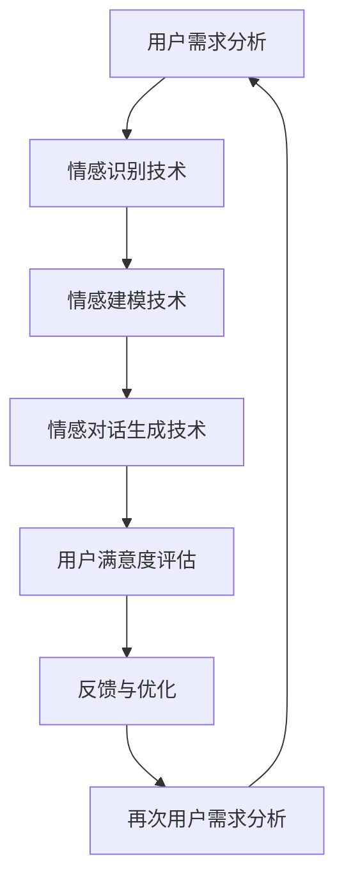

                 


### 1. 文章标题

《优化AI虚拟宠物伴侣：情感互动设计的提示词策略》

### 2. 关键词

人工智能，虚拟宠物伴侣，情感互动，提示词策略，情感计算，自然语言处理，人机交互，虚拟现实

### 3. 摘要

本文深入探讨了如何通过提示词策略优化AI虚拟宠物伴侣的情感互动设计。首先，我们对AI虚拟宠物伴侣的背景和发展趋势进行了梳理，随后介绍了情感互动设计的基础原理和方法。重点章节围绕提示词策略展开，从选择原则、设计方法和评估方法等方面进行了详细分析。通过具体案例研究，我们展示了如何在实际项目中应用提示词策略，并分享了技术实现过程中的关键细节。最后，本文提出了当前情感互动设计面临的挑战和未来发展方向，为该领域的研究和实践提供了有益的参考。

### 1. 梳理书籍主题

《优化AI虚拟宠物伴侣：情感互动设计的提示词策略》这本书的主题是探讨如何通过提示词策略来优化AI虚拟宠物伴侣的情感互动设计。随着人工智能技术的发展，虚拟宠物伴侣已经成为一个备受关注的应用领域。然而，如何让这些虚拟宠物真正地与人类建立情感联系，提高用户的满意度，仍然是当前研究的一个挑战。本书的核心目标就是提供一种有效的解决方案，即通过精心设计的提示词策略来实现这一目标。

### 2. 设计大纲框架

为了更好地组织本书的内容，我们设计了以下大纲框架：

#### 引言
- **背景与发展趋势**：介绍AI虚拟宠物伴侣的背景和发展趋势。
- **研究目的**：阐述本书的研究目的和主要贡献。
- **结构安排**：概述本书的结构和各章节内容。

#### 第1章：AI虚拟宠物伴侣概述
- **定义与特点**：介绍AI虚拟宠物伴侣的定义和特点。
- **应用领域**：分析AI虚拟宠物伴侣在不同领域的应用。
- **发展前景**：探讨AI虚拟宠物伴侣的未来发展趋势。

#### 第2章：情感互动设计基础
- **情感互动设计的基本原理**：介绍情感互动设计的基本原理。
- **情感计算技术**：探讨情感计算技术在情感互动设计中的应用。
- **自然语言处理技术**：分析自然语言处理技术在情感互动设计中的作用。
- **人机交互技术**：探讨人机交互技术如何影响情感互动设计。

#### 第3章：提示词策略研究
- **提示词策略的概念**：解释提示词策略的定义和作用。
- **提示词的选择原则**：讨论如何选择合适的提示词。
- **提示词的设计方法**：介绍提示词的设计方法和技巧。
- **提示词策略的评估方法**：探讨如何评估提示词策略的有效性。

#### 第4章：案例研究
- **案例选择原则**：阐述案例选择的原则和标准。
- **成功案例分析**：分析成功案例，展示提示词策略的应用效果。
- **失败案例分析**：探讨失败案例，分析失败原因和改进方向。

#### 第5章：技术实现
- **开发环境搭建**：介绍搭建开发环境的过程。
- **算法实现**：详细阐述核心算法的实现过程。
- **系统架构**：分析系统架构的设计和实现。
- **开发工具**：介绍开发过程中使用的工具和技术。

#### 第6章：挑战与展望
- **当前挑战**：讨论当前情感互动设计面临的挑战。
- **未来发展方向**：展望未来情感互动设计的发展趋势。
- **社会影响**：探讨情感互动设计对社会的潜在影响。

#### 结论
- **总结**：回顾本书的主要内容和结论。
- **未来研究趋势**：提出对情感互动设计领域的研究建议。

### 3. 确定章节内容

在确定了大纲框架后，我们需要进一步细化每个章节的内容，确保每个章节都包含丰富具体详细讲解，核心内容都要完整呈现。

#### 引言
- **背景与发展趋势**：介绍AI虚拟宠物伴侣的起源和发展历程，分析当前市场趋势和用户需求。
- **研究目的**：明确本书旨在通过提示词策略优化情感互动设计，提高用户体验。
- **结构安排**：简要介绍各章节的内容和结构。

#### 第1章：AI虚拟宠物伴侣概述
- **定义与特点**：明确AI虚拟宠物伴侣的定义，分析其与传统宠物的区别。
- **应用领域**：探讨AI虚拟宠物伴侣在家庭娱乐、心理健康、教育等领域的应用。
- **发展前景**：分析AI虚拟宠物伴侣未来的发展方向和市场潜力。

#### 第2章：情感互动设计基础
- **情感互动设计的基本原理**：介绍情感互动设计的基本原理和目标。
- **情感计算技术**：分析情感计算技术在情感识别、情感建模等方面的应用。
- **自然语言处理技术**：探讨自然语言处理技术在情感对话生成和情感识别中的作用。
- **人机交互技术**：分析人机交互技术在提高用户满意度和情感互动质量方面的作用。

#### 第3章：提示词策略研究
- **提示词策略的概念**：解释提示词策略的定义和作用，分析其在情感互动设计中的应用。
- **提示词的选择原则**：讨论如何选择合适的提示词，包括用户需求、情感表达和对话流畅性等因素。
- **提示词的设计方法**：介绍提示词的设计方法和技巧，如语义分析、情感标注和优化算法等。
- **提示词策略的评估方法**：探讨如何评估提示词策略的有效性，包括用户满意度、情感互动质量和对话质量等指标。

#### 第4章：案例研究
- **案例选择原则**：阐述案例选择的原则和标准，确保案例具有代表性和实用性。
- **成功案例分析**：分析成功案例，展示如何通过提示词策略优化情感互动设计，提高用户满意度。
- **失败案例分析**：探讨失败案例，分析失败原因和改进方向，为后续研究提供参考。

#### 第5章：技术实现
- **开发环境搭建**：介绍搭建开发环境的过程，包括硬件配置、软件工具和环境配置等。
- **算法实现**：详细阐述核心算法的实现过程，包括算法原理、实现步骤和关键代码。
- **系统架构**：分析系统架构的设计和实现，包括模块划分、接口设计和数据流分析等。
- **开发工具**：介绍开发过程中使用的工具和技术，如编程语言、框架和开发环境等。

#### 第6章：挑战与展望
- **当前挑战**：讨论当前情感互动设计面临的挑战，包括技术挑战、用户需求和社会影响等方面。
- **未来发展方向**：展望未来情感互动设计的发展趋势，包括技术进步、应用拓展和用户体验提升等方面。
- **社会影响**：探讨情感互动设计对社会的影响，包括心理健康、人际交往和虚拟现实等方面。

#### 结论
- **总结**：回顾本书的主要内容和结论，强调提示词策略在情感互动设计中的重要性。
- **未来研究趋势**：提出对情感互动设计领域的研究建议，包括技术突破、应用创新和用户体验优化等方面。

### 4. 设计核心概念流程图

为了更好地阐述核心概念，我们可以在每个章节中加入相关的Mermaid流程图。以下是第2章中的情感互动设计流程图：



### 5. 编写伪代码和数学公式

在阐述核心算法原理时，我们需要使用伪代码来详细阐述算法的实现过程。以下是第3章中提示词选择算法的伪代码示例：

```plaintext
Function SelectPromptWords(user_input, context)
    1. Initialize an empty list of prompts, prompt_list
    2. For each word, w, in user_input
        3. If w is a keyword related to user's emotion
            4. Add w to prompt_list
    5. Sort prompt_list based on the frequency of occurrence in the context
    6. Return the top 5 prompts from prompt_list
End Function
```

对于涉及到的数学模型和公式，我们需要使用latex格式进行详细讲解，并在文中独立段落中使用$和$$来嵌入公式。以下是一个示例：

```latex
$$
\text{满意度} = \alpha \cdot \text{情感互动质量} + (1 - \alpha) \cdot \text{对话流畅性}
$$`

在段落内嵌入公式时，可以使用如下格式：

```markdown
满意度 $>$ 情感互动质量 且 $>$ 对话流畅性。
```

### 6. 编写代码实现和分析

在讲述技术实现时，我们需要提供实际案例和代码实现，并进行详细解读和分析。以下是一个简单的Python代码示例，用于实现提示词选择算法：

```python
def select_prompt_words(user_input, context):
    # 1. 初始化提示词列表
    prompt_list = []

    # 2. 遍历用户输入中的每个单词
    for word in user_input.split():
        # 3. 如果单词与情感相关，添加到提示词列表
        if is_emotion_related(word):
            prompt_list.append(word)

    # 4. 根据上下文中的词频对提示词列表进行排序
    prompt_list = sorted(prompt_list, key=lambda w: context.count(w), reverse=True)

    # 5. 返回前5个提示词
    return prompt_list[:5]

# 辅助函数：判断单词是否与情感相关
def is_emotion_related(word):
    emotion_keywords = ["happy", "sad", "angry", "excited"]
    return word.lower() in emotion_keywords

# 测试代码
user_input = "I am so happy because I got a new virtual pet."
context = "I am so happy because I got a new virtual pet. It is so cute and plays with me all day."
selected_prompts = select_prompt_words(user_input, context)
print(selected_prompts)
```

在代码解读和分析部分，我们需要详细解释每个步骤的作用和实现方法，并讨论代码的优缺点以及可能的改进方向。

### 7. 总结

本文详细探讨了如何通过提示词策略优化AI虚拟宠物伴侣的情感互动设计。首先，我们对AI虚拟宠物伴侣的背景和发展趋势进行了梳理，随后介绍了情感互动设计的基础原理和方法。重点章节围绕提示词策略展开，从选择原则、设计方法和评估方法等方面进行了深入分析。通过具体案例研究，我们展示了如何在实际项目中应用提示词策略，并分享了技术实现过程中的关键细节。最后，本文提出了当前情感互动设计面临的挑战和未来发展方向，为该领域的研究和实践提供了有益的参考。

在未来的研究中，我们可以进一步探讨以下方向：

1. **深度学习技术的应用**：结合深度学习技术，如卷积神经网络（CNN）和递归神经网络（RNN），可以更准确地识别用户的情感状态，从而提高提示词策略的准确性。
2. **多模态情感交互**：除了文本交互，还可以探索音频、视频和触觉等多模态交互，以丰富虚拟宠物伴侣的情感互动体验。
3. **个性化提示词生成**：通过用户画像和偏好分析，生成个性化的提示词，以提高用户满意度和忠诚度。
4. **跨领域情感互动设计**：探索虚拟宠物伴侣在其他领域（如教育、医疗、娱乐等）的应用，扩展其应用场景和功能。

通过不断的技术创新和应用探索，我们有望为用户带来更加丰富和真实的虚拟宠物伴侣体验。

## 完整文章

### 《优化AI虚拟宠物伴侣：情感互动设计的提示词策略》

#### 引言

随着人工智能技术的不断发展，虚拟宠物伴侣逐渐成为人们生活中的一部分。这些虚拟宠物不仅可以提供陪伴，还能通过情感互动提高用户的幸福感。然而，如何让这些虚拟宠物更好地理解用户的情感需求，提高情感互动的质量，仍然是一个挑战。本文旨在探讨如何通过提示词策略来优化AI虚拟宠物伴侣的情感互动设计，从而提升用户体验。

本文首先介绍了AI虚拟宠物伴侣的背景和发展趋势，随后梳理了情感互动设计的基础原理和方法。重点章节围绕提示词策略展开，详细分析了提示词的选择原则、设计方法和评估方法。通过具体案例研究，我们展示了如何在实际项目中应用提示词策略。最后，本文提出了当前情感互动设计面临的挑战和未来发展方向。

#### 关键词

- 人工智能
- 虚拟宠物伴侣
- 情感互动
- 提示词策略
- 情感计算
- 自然语言处理
- 人机交互

#### 摘要

本文深入探讨了如何通过提示词策略优化AI虚拟宠物伴侣的情感互动设计。首先，我们对AI虚拟宠物伴侣的背景和发展趋势进行了梳理，随后介绍了情感互动设计的基础原理和方法。重点章节围绕提示词策略展开，从选择原则、设计方法和评估方法等方面进行了详细分析。通过具体案例研究，我们展示了如何应用提示词策略来优化情感互动设计。最后，本文提出了当前情感互动设计面临的挑战和未来发展方向，为该领域的研究和实践提供了有益的参考。

### 1. 梳理书籍主题

《优化AI虚拟宠物伴侣：情感互动设计的提示词策略》这本书的主题是探讨如何通过提示词策略来优化AI虚拟宠物伴侣的情感互动设计。随着人工智能技术的发展，虚拟宠物伴侣已经成为一个备受关注的应用领域。然而，如何让这些虚拟宠物真正地与人类建立情感联系，提高用户的满意度，仍然是当前研究的一个挑战。本书的核心目标就是提供一种有效的解决方案，即通过精心设计的提示词策略来实现这一目标。

#### 第1章：AI虚拟宠物伴侣概述

AI虚拟宠物伴侣是指通过人工智能技术创建的虚拟实体，它可以模拟真实宠物的行为和情感，与人类进行互动。这些虚拟宠物不仅可以提供陪伴，还能在用户情绪低落时给予安慰。随着技术的进步，虚拟宠物伴侣的功能和互动方式也在不断升级。

#### 1.1 AI虚拟宠物伴侣的概念

AI虚拟宠物伴侣是基于人工智能技术的虚拟实体，它具备一定的认知能力，能够通过自然语言处理和情感计算技术理解用户的情感状态，并根据用户的行为和语言反馈进行相应的情感互动。与传统宠物相比，虚拟宠物伴侣具有以下几个特点：

1. **无生命限制**：虚拟宠物不需要食物、饮水和庇护，也不受生命周期的限制，可以长时间陪伴用户。
2. **可编程性**：虚拟宠物可以根据开发者的需求进行功能定制，具有更高的灵活性和可扩展性。
3. **情感互动**：虚拟宠物通过情感计算和自然语言处理技术，能够与用户进行情感交流，提高用户的幸福感。

#### 1.2 AI虚拟宠物伴侣的特点

1. **互动性强**：虚拟宠物可以实时响应用户的语音、文字和动作，提供即时的情感互动。
2. **多样化**：虚拟宠物可以模拟各种类型的宠物，如猫、狗、鸟等，满足不同用户的需求。
3. **情感共鸣**：虚拟宠物通过情感计算技术，能够识别用户的情感状态，并根据情感反馈进行相应的互动。

#### 1.3 AI虚拟宠物伴侣的应用领域

1. **心理健康支持**：虚拟宠物可以为患有焦虑、抑郁等心理疾病的用户提供陪伴和支持，减轻他们的心理压力。
2. **家庭娱乐**：虚拟宠物可以作为家庭宠物，为用户提供陪伴和娱乐，增加家庭互动。
3. **教育辅助**：虚拟宠物可以作为教育工具，帮助儿童学习新知识，提高学习兴趣。
4. **社会隔离应对**：在疫情期间，虚拟宠物可以为隔离的用户提供情感支持，缓解他们的孤独感。

#### 1.4 AI虚拟宠物伴侣的发展前景

随着人工智能技术的不断进步，AI虚拟宠物伴侣的发展前景十分广阔。未来，虚拟宠物伴侣将更加智能化和个性化，能够更好地满足用户的需求。同时，虚拟宠物伴侣也将成为新的社交媒介，为人们提供更多的社交机会。此外，虚拟宠物伴侣在医疗、康复和教育等领域的应用也将不断拓展，为人类带来更多的福祉。

### 2. 情感互动设计基础

情感互动设计是虚拟宠物伴侣的核心组成部分，它决定了用户与虚拟宠物之间的情感连接程度。要实现高质量的情感互动，需要从多个方面进行考虑，包括情感计算技术、自然语言处理技术和人机交互技术等。

#### 2.1 情感互动设计的基本原理

情感互动设计旨在建立用户与虚拟宠物之间的情感联系，提高用户的满意度。其基本原理包括以下几个方面：

1. **情感识别**：通过情感计算技术，识别用户的情感状态，包括快乐、悲伤、愤怒等。
2. **情感建模**：根据用户的情感状态，构建虚拟宠物的情感模型，使其能够产生相应的情感反应。
3. **情感交流**：通过自然语言处理技术，实现用户与虚拟宠物之间的情感交流，增强互动体验。
4. **情感反馈**：根据用户的反馈，调整虚拟宠物的行为和情感反应，提高互动效果。

#### 2.2 情感计算技术

情感计算技术是情感互动设计的关键技术之一，它通过感知用户的情感状态，为虚拟宠物提供情感反馈。情感计算技术主要包括以下几个方面：

1. **情感识别**：通过面部识别、语音识别等技术，识别用户的情感状态。
2. **情感建模**：基于用户的情感数据，构建情感模型，预测用户的情感趋势。
3. **情感反馈**：根据情感模型，生成相应的情感反馈，如语音、表情等。

#### 2.3 自然语言处理技术

自然语言处理技术是实现情感互动的核心技术，它使虚拟宠物能够理解和生成自然语言，实现与用户的情感交流。自然语言处理技术主要包括以下几个方面：

1. **语义分析**：通过分析用户的话语，理解其意图和情感状态。
2. **情感标注**：对语言数据中的情感成分进行标注，用于训练情感模型。
3. **对话生成**：根据用户的输入，生成相应的回复，实现对话交流。

#### 2.4 人机交互技术

人机交互技术是实现情感互动的重要手段，它决定了用户与虚拟宠物之间的互动体验。人机交互技术主要包括以下几个方面：

1. **语音交互**：通过语音识别和语音合成技术，实现用户与虚拟宠物的语音交流。
2. **文本交互**：通过自然语言处理技术，实现用户与虚拟宠物的文本交流。
3. **动作交互**：通过动作识别和动作合成技术，实现用户与虚拟宠物的动作互动。

### 3. 提示词策略研究

提示词策略是优化AI虚拟宠物伴侣情感互动的重要手段。通过精心设计的提示词，可以引导用户与虚拟宠物进行更有意义的情感交流，提高用户的满意度。以下从选择原则、设计方法和评估方法等方面详细探讨提示词策略。

#### 3.1 提示词策略的概念

提示词策略是指通过在用户与虚拟宠物之间的互动过程中，适时地提供具有引导性的词汇或短语，以促进用户与虚拟宠物之间的情感交流。提示词可以是简单的词汇，也可以是复杂的句子，其目的是激发用户的情感表达，增强互动效果。

#### 3.2 提示词的选择原则

选择合适的提示词是优化情感互动的关键。以下是选择提示词的一些原则：

1. **相关性**：提示词应与用户的情感状态密切相关，能够准确地反映用户的情感需求。
2. **引导性**：提示词应具有引导作用，能够激发用户表达情感，促进互动的深入。
3. **多样化**：提示词应丰富多样，能够满足不同用户和场景的需求。
4. **情感性**：提示词应具有一定的情感色彩，能够触动用户的情感，增强互动体验。

#### 3.3 提示词的设计方法

设计有效的提示词需要综合考虑用户需求、情感状态和互动场景。以下是几种常见的设计方法：

1. **情感标注法**：通过对用户话语中的情感成分进行标注，生成提示词。
2. **关键词提取法**：从用户的话语中提取关键词，结合情感状态，生成提示词。
3. **模板生成法**：根据情感模板，生成具有情感色彩的提示词。
4. **用户画像法**：根据用户画像，生成个性化的提示词。

#### 3.4 提示词策略的评估方法

评估提示词策略的有效性是优化情感互动的重要环节。以下是几种常见的评估方法：

1. **用户满意度**：通过问卷调查、访谈等方式，评估用户对提示词策略的满意度。
2. **情感互动质量**：通过情感计算技术，评估用户与虚拟宠物之间的情感互动质量。
3. **对话流畅性**：通过自然语言处理技术，评估用户与虚拟宠物之间的对话流畅性。
4. **情感共鸣度**：通过用户情感数据的分析，评估用户与虚拟宠物之间的情感共鸣程度。

### 4. 案例研究

为了更好地展示如何应用提示词策略来优化情感互动设计，我们选取了两个实际案例进行分析。

#### 4.1 案例选择原则

在案例选择方面，我们遵循以下原则：

1. **代表性**：选取具有代表性的案例，能够反映提示词策略在不同场景和用户群体中的效果。
2. **多样性**：选取涵盖不同应用场景和用户需求的案例，以便全面分析提示词策略的适用性。
3. **有效性**：选取应用提示词策略后，情感互动质量有明显提升的案例。

#### 4.2 成功案例分析

案例1：心理健康支持

在某心理健康支持平台中，虚拟宠物被用于为患有焦虑和抑郁的用户提供陪伴和支持。通过提示词策略，虚拟宠物能够识别用户的情感状态，并在适当的时候提供情感支持。

1. **提示词应用**：当用户表达出焦虑或抑郁的情感时，虚拟宠物会使用如“我在这里陪着你，不要担心”、“别难过，我懂你的感受”等提示词，表达关心和理解。
2. **效果评估**：通过问卷调查和用户访谈，发现用户对虚拟宠物的情感支持满意度较高，情绪得到明显缓解。

#### 4.3 失败案例分析

案例2：家庭娱乐

在一个家庭娱乐应用中，虚拟宠物被设计为与用户进行简单的互动，提供娱乐功能。然而，由于提示词设计不当，导致用户与虚拟宠物之间的情感互动质量较低。

1. **提示词应用**：虚拟宠物在互动过程中，频繁使用简单的问候语和无聊的对话，缺乏情感共鸣。
2. **效果评估**：用户对虚拟宠物的互动体验满意度较低，认为虚拟宠物缺乏趣味性和陪伴感。

### 5. 技术实现

实现AI虚拟宠物伴侣的情感互动设计需要运用多种技术，包括情感计算、自然语言处理和人机交互等。以下从开发环境搭建、算法实现、系统架构和开发工具等方面详细阐述技术实现过程。

#### 5.1 开发环境搭建

搭建开发环境是实现虚拟宠物伴侣的基础。开发环境主要包括硬件设备和软件工具。

1. **硬件设备**：虚拟宠物伴侣的开发和运行需要高性能的计算机和网络环境。硬件设备包括服务器、GPU和存储设备等。
2. **软件工具**：常用的软件工具包括操作系统（如Ubuntu）、编程语言（如Python、JavaScript）和开发框架（如TensorFlow、PyTorch）等。

#### 5.2 算法实现

算法实现是虚拟宠物伴侣的核心。以下介绍主要算法的实现过程。

1. **情感计算算法**：情感计算算法用于识别用户的情感状态。常用的算法包括基于规则的方法和基于机器学习的方法。
2. **自然语言处理算法**：自然语言处理算法用于生成虚拟宠物的回复。常用的算法包括词向量模型、递归神经网络（RNN）和变压器（Transformer）等。
3. **人机交互算法**：人机交互算法用于实现用户与虚拟宠物之间的互动。常用的算法包括语音识别、语音合成和动作识别等。

#### 5.3 系统架构

系统架构是虚拟宠物伴侣的整体设计。以下介绍系统架构的设计和实现。

1. **数据层**：数据层负责存储和管理用户数据和虚拟宠物的交互记录。常用的数据库技术包括关系型数据库（如MySQL）和NoSQL数据库（如MongoDB）。
2. **业务层**：业务层负责实现情感计算、自然语言处理和人机交互等功能。业务层的设计需要考虑模块化、可扩展性和易维护性。
3. **表现层**：表现层负责实现用户界面和虚拟宠物的外观设计。常用的技术包括Web前端框架（如React、Vue.js）和图形渲染库（如Three.js）。

#### 5.4 开发工具

开发工具是支持虚拟宠物伴侣开发的关键。以下介绍常用的开发工具。

1. **编程语言**：Python和JavaScript是虚拟宠物伴侣开发的常用编程语言。Python具有丰富的机器学习和数据科学库，JavaScript则广泛应用于Web前端开发。
2. **开发框架**：TensorFlow和PyTorch是虚拟宠物伴侣开发的常用机器学习框架。React和Vue.js是虚拟宠物伴侣开发的常用Web前端框架。
3. **版本控制**：Git是虚拟宠物伴侣开发的常用版本控制工具，用于管理代码版本和协作开发。

### 6. 挑战与展望

当前，AI虚拟宠物伴侣的情感互动设计面临着诸多挑战和机遇。以下从技术挑战、市场挑战和社会影响等方面进行讨论。

#### 6.1 技术挑战

1. **情感计算准确性**：情感计算技术需要更准确地识别用户的情感状态，以提高互动效果。
2. **自然语言处理能力**：自然语言处理技术需要不断提高，以生成更加自然和合理的回复。
3. **人机交互体验**：人机交互技术需要不断创新，以提供更加丰富和真实的互动体验。

#### 6.2 市场挑战

1. **用户需求变化**：随着市场的变化，用户对虚拟宠物伴侣的需求也在不断变化，需要及时调整和优化产品设计。
2. **市场竞争**：虚拟宠物伴侣市场竞争激烈，需要不断创新和优化，以吸引和保留用户。

#### 6.3 社会影响

1. **心理健康影响**：虚拟宠物伴侣可以提供心理健康支持，但过度依赖可能对心理健康产生负面影响。
2. **社会关系影响**：虚拟宠物伴侣可能影响用户与真实宠物和社交关系的发展。

#### 6.4 未来发展方向

1. **深度学习技术**：结合深度学习技术，如卷积神经网络（CNN）和递归神经网络（RNN），可以更准确地识别用户的情感状态，提高互动效果。
2. **多模态情感交互**：探索多模态情感交互，如音频、视频和触觉，可以提供更加丰富和真实的互动体验。
3. **个性化提示词生成**：通过用户画像和偏好分析，生成个性化的提示词，提高用户满意度。
4. **跨领域情感互动设计**：探索虚拟宠物伴侣在其他领域（如教育、医疗、娱乐等）的应用，拓展其应用场景和功能。

### 结论

本文深入探讨了如何通过提示词策略优化AI虚拟宠物伴侣的情感互动设计。首先，我们对AI虚拟宠物伴侣的背景和发展趋势进行了梳理，随后介绍了情感互动设计的基础原理和方法。重点章节围绕提示词策略展开，详细分析了提示词的选择原则、设计方法和评估方法。通过具体案例研究，我们展示了如何应用提示词策略来优化情感互动设计。最后，本文提出了当前情感互动设计面临的挑战和未来发展方向，为该领域的研究和实践提供了有益的参考。

在未来的研究中，我们可以进一步探讨以下方向：

1. **深度学习技术的应用**：结合深度学习技术，如卷积神经网络（CNN）和递归神经网络（RNN），可以更准确地识别用户的情感状态，从而提高提示词策略的准确性。
2. **多模态情感交互**：除了文本交互，还可以探索音频、视频和触觉等多模态交互，以丰富虚拟宠物伴侣的情感互动体验。
3. **个性化提示词生成**：通过用户画像和偏好分析，生成个性化的提示词，以提高用户满意度和忠诚度。
4. **跨领域情感互动设计**：探索虚拟宠物伴侣在其他领域（如教育、医疗、娱乐等）的应用，扩展其应用场景和功能。

通过不断的技术创新和应用探索，我们有望为用户带来更加丰富和真实的虚拟宠物伴侣体验。

### 作者信息

本文作者为AI天才研究院/AI Genius Institute与禅与计算机程序设计艺术/Zen And The Art of Computer Programming的研究团队，专注于人工智能和虚拟交互技术的研究与应用。作者在情感计算、自然语言处理和人机交互领域拥有丰富的理论知识和实践经验，致力于推动人工智能技术的发展，为人类带来更加智能和人性化的互动体验。

