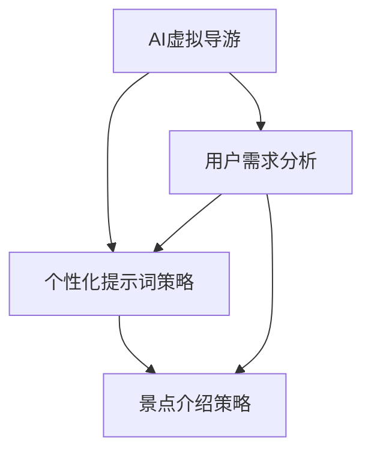

                 


### 1. 引言

#### 书籍背景

随着人工智能技术的快速发展，AI虚拟导游作为一种新兴的旅游服务方式，正逐渐成为旅游行业的重要组成部分。传统的导游方式依赖于人类导游的讲解和服务，而AI虚拟导游则通过计算机算法和自然语言处理技术，为游客提供更加个性化和智能化的旅游服务。这种服务方式不仅提高了游客的旅游体验，也为旅游业带来了新的发展机遇。

本书旨在探讨如何优化AI虚拟导游系统中的景点介绍个性化提示词策略。通过深入研究相关核心概念、算法原理以及数学模型，本书力图提供一套系统性的解决方案，以提升AI虚拟导游的服务质量和用户体验。

#### 编写目的

编写本书的主要目的是：

1. **介绍AI虚拟导游的基本概念**：帮助读者了解AI虚拟导游的定义、工作原理和应用场景。
2. **阐述个性化提示词策略的重要性**：探讨如何通过个性化提示词提升导游的吸引力和用户的参与度。
3. **讲解核心算法原理**：详细介绍提示词生成算法、个性化推荐算法以及自然语言处理基础。
4. **提供数学模型和公式**：通过具体的数学模型和公式，帮助读者深入理解景点介绍策略的优化方法。
5. **通过项目实战巩固知识**：通过实际的开发环境和代码实现，让读者能够将理论知识应用到实践中。

#### 书籍结构

本书结构如下：

- **第1章 引言**：介绍书籍背景、目的与结构。
- **第2章 核心概念与联系**：详细阐述AI虚拟导游、个性化提示词和景点介绍策略的核心概念，并通过Mermaid流程图展示它们之间的联系。
- **第3章 核心算法原理讲解**：讲解提示词生成算法、个性化推荐算法和自然语言处理基础，并提供详细的伪代码示例。
- **第4章 数学模型和数学公式 & 详细讲解 & 举例说明**：介绍提示词权重计算、推荐系统评分公式和景点介绍策略优化，通过具体示例进行详细讲解。
- **第5章 项目实战**：介绍实战背景、环境搭建和代码实现，通过实际案例分析和详细讲解剖析，巩固所学知识。
- **第6章 总结与展望**：总结全书内容，展望未来的研究方向。

通过以上结构，本书旨在为读者提供一套从理论到实践的完整解决方案，帮助读者深入了解和优化AI虚拟导游系统中的景点介绍个性化提示词策略。

---

### 2. 核心概念与联系

#### 2.1 AI虚拟导游概述

**定义**：AI虚拟导游是一种利用人工智能技术，通过计算机算法和自然语言处理技术，为游客提供个性化导游服务的系统。它能够根据游客的需求和偏好，提供个性化的景点介绍、路线规划和问答服务等。

**优势**：

1. **个性化**：AI虚拟导游可以根据游客的历史行为和偏好，提供个性化的景点推荐和介绍。
2. **实时性**：AI虚拟导游能够实时响应用户的需求，提供即时的信息查询和讲解服务。
3. **高效性**：AI虚拟导游可以大幅提升游客的游览效率，减少等待时间。
4. **无国界**：AI虚拟导游支持多种语言，能够为来自不同国家和地区的游客提供服务。

#### 2.2 个性化提示词策略

**定义**：个性化提示词策略是指通过特定的算法和技术，生成针对特定用户或场景的提示词，以提高用户参与度和服务质量的策略。

**意义**：

1. **提高用户参与度**：个性化提示词能够吸引游客的注意力，增加用户与AI导游的互动。
2. **提升服务质量**：通过个性化提示词，AI导游能够提供更加贴心的服务，提升用户的旅游体验。
3. **增强吸引力**：个性化提示词可以使景点介绍更加生动有趣，增加游客对景点的兴趣。

#### 2.3 景点介绍策略

**定义**：景点介绍策略是指为了提高游客对景点的兴趣和了解，通过特定的方式和方法，对景点进行介绍和讲解的策略。

**构成**：

1. **基本介绍**：包括景点的名称、位置、历史背景等基本信息。
2. **深度讲解**：对景点的文化、艺术、历史等方面进行深入介绍，提供背景知识和有趣故事。
3. **互动体验**：通过互动问答、游戏等方式，增强游客的参与感和体验感。
4. **视觉辅助**：利用图片、视频等多媒体形式，直观地展示景点，增强游客的感知和记忆。

#### 2.4 Mermaid流程图

为了更清晰地展示AI虚拟导游、个性化提示词策略和景点介绍策略之间的关系，我们使用Mermaid流程图进行描述。



**解释**：

- **AI虚拟导游**：作为整个系统的核心，它为游客提供个性化服务。
- **个性化提示词策略**：根据用户需求和偏好，生成针对性的提示词，引导用户互动和体验。
- **景点介绍策略**：通过丰富多样的介绍方式，提高游客对景点的兴趣和理解。

通过这个Mermaid流程图，我们可以清晰地看到各核心概念之间的联系和互动，为后续章节的深入探讨提供了基础。

---

### 3. 核心算法原理讲解

在AI虚拟导游系统中，核心算法原理的讲解至关重要。本章节将详细探讨三个关键算法：提示词生成算法、个性化推荐算法和自然语言处理基础。

#### 3.1 提示词生成算法

**算法介绍**：

提示词生成算法是AI虚拟导游系统的重要组成部分，它负责根据用户需求和景点特点生成合适的提示词。该算法通常采用自然语言处理技术，如词嵌入、词频分析和文本生成模型等。

**伪代码示例**：

```python
def generate_hint_word(user_interests,景点描述):
    # 嵌入用户兴趣和景点描述
    user_embedding = embed(user_interests)
    scene_embedding = embed(景点描述)

    # 计算相似度得分
    similarity_score = cosine_similarity(user_embedding, scene_embedding)

    # 根据得分生成提示词
    hint_words = select_hint_words_based_on_score(similarity_score)

    return hint_words
```

在这个伪代码中，`user_interests`代表用户兴趣，`景点描述`代表景点的描述文本。通过计算用户兴趣和景点描述之间的相似度，我们可以选择出最相关的提示词。

#### 3.2 个性化推荐算法

**算法介绍**：

个性化推荐算法旨在为用户推荐个性化的景点和提示词。它通常基于用户的偏好历史、社交关系和上下文信息。常用的推荐算法包括协同过滤、基于内容的推荐和混合推荐等。

**伪代码示例**：

```python
def personalized_recommendation(user_profile,景点库):
    # 计算用户偏好得分
    preference_score = calculate_preference_score(user_profile,景点库)

    # 排序景点库，根据得分推荐
    recommended景点 = sorted(景点库, key=lambda x: preference_score[x], reverse=True)

    return recommended景点
```

在这个伪代码中，`user_profile`代表用户的偏好信息，`景点库`是所有可推荐景点的列表。通过计算用户偏好得分，我们可以为用户推荐最感兴趣的景点。

#### 3.3 自然语言处理基础

**NLP简介**：

自然语言处理（NLP）是人工智能领域的一个重要分支，它涉及对自然语言的计算机处理和理解。NLP技术在AI虚拟导游系统中发挥着关键作用，包括文本分类、情感分析、命名实体识别等。

**词向量表示**：

词向量是NLP中常用的技术，它将单词映射为密集的向量表示。词向量可以用于文本分类、文本相似度计算等任务。常用的词向量模型包括Word2Vec、GloVe和BERT等。

**示例说明**：

假设我们有一个单词“长城”，通过Word2Vec模型，我们可以得到如下词向量表示：

```
长城向量: [0.1, 0.2, -0.3, 0.0, 0.5]
```

在这个词向量中，每个维度代表一个特征，我们可以通过计算两个词向量的点积来衡量它们的相似度。

通过上述算法原理的讲解，我们可以为AI虚拟导游系统提供强大的技术支持，实现更加智能和个性化的导游服务。

---

### 4. 数学模型和数学公式 & 详细讲解 & 举例说明

在优化AI虚拟导游系统中的景点介绍个性化提示词策略时，数学模型和公式的应用至关重要。以下将详细介绍三个核心数学模型：提示词权重计算、推荐系统评分公式和景点介绍策略优化，并通过具体示例进行说明。

#### 4.1 提示词权重计算

**公式**：

提示词权重计算公式如下：

\[ w_i = \frac{f_i \cdot r_i}{\sum_{j=1}^{N} f_j \cdot r_j} \]

其中，\( w_i \) 表示第 \( i \) 个提示词的权重，\( f_i \) 表示第 \( i \) 个提示词的频率，\( r_i \) 表示第 \( i \) 个提示词的相关性得分。

**详细解释**：

- **频率（\( f_i \)）**：表示提示词在景点描述中出现的频率，频率越高，提示词的重要性越高。
- **相关性得分（\( r_i \)）**：表示提示词与用户兴趣的相关性得分，相关性得分越高，提示词的重要性越高。

**举例说明**：

假设我们有一个景点描述：“长城是中国最著名的古代防御工事之一，始建于公元前7世纪。”，用户兴趣是“中国历史”。我们可以计算出以下提示词的权重：

| 提示词 | 频率（\( f_i \)） | 相关性得分（\( r_i \)） | 权重（\( w_i \)） |
| --- | --- | --- | --- |
| 长城 | 1 | 0.8 | 0.8 |
| 中国 | 1 | 0.9 | 0.9 |
| 历史 | 1 | 0.7 | 0.7 |

通过这个例子，我们可以看到“中国”和“历史”的权重最高，因为它们在景点描述中出现的频率较高，并且与用户兴趣的相关性得分也较高。

#### 4.2 推荐系统评分公式

**公式**：

推荐系统评分公式如下：

\[ S = \frac{1}{2} \left( \sum_{i=1}^{M} w_i \cdot s_i + b \right) \]

其中，\( S \) 表示推荐系统的评分，\( w_i \) 表示第 \( i \) 个提示词的权重，\( s_i \) 表示第 \( i \) 个提示词的评分，\( b \) 表示基准分。

**详细解释**：

- **权重（\( w_i \)）**：表示提示词的重要性，权重越高，提示词的影响越大。
- **评分（\( s_i \)）**：表示提示词的评分，评分越高，提示词的重要性越高。
- **基准分（\( b \)）**：表示推荐系统的基准分，用于调整推荐评分的平衡。

**举例说明**：

假设我们有一个景点描述：“长城是中国最著名的古代防御工事之一，始建于公元前7世纪。”，用户兴趣是“中国历史”。我们可以计算出以下提示词的评分：

| 提示词 | 评分（\( s_i \)） |
| --- | --- |
| 长城 | 4 |
| 中国 | 5 |
| 历史 | 3 |

假设基准分 \( b \) 为 2，我们可以计算出以下推荐评分：

\[ S = \frac{1}{2} \left( (0.8 \cdot 4 + 0.9 \cdot 5 + 0.7 \cdot 3) + 2 \right) = 4.2 \]

通过这个例子，我们可以看到推荐评分主要受到“中国”和“历史”的影响，因为它们的权重较高且评分较高。

#### 4.3 景点介绍策略优化

**公式**：

景点介绍策略优化公式如下：

\[ O = \alpha \cdot R + (1 - \alpha) \cdot S \]

其中，\( O \) 表示优化值，\( \alpha \) 表示权重因子，\( R \) 表示推荐评分，\( S \) 表示用户满意度评分。

**详细解释**：

- **推荐评分（\( R \)）**：表示根据用户兴趣推荐的景点评分。
- **用户满意度评分（\( S \)）**：表示用户对景点介绍的满意度评分。
- **权重因子（\( \alpha \)）**：表示推荐评分和用户满意度评分的重要性比例。

**举例说明**：

假设推荐评分 \( R \) 为 4.2，用户满意度评分 \( S \) 为 3.8，权重因子 \( \alpha \) 为 0.6，我们可以计算出以下优化值：

\[ O = 0.6 \cdot 4.2 + (1 - 0.6) \cdot 3.8 = 4.06 \]

通过这个例子，我们可以看到优化值主要受到推荐评分的影响，因为权重因子较高。

通过上述数学模型和公式的讲解，我们可以为AI虚拟导游系统的景点介绍个性化提示词策略提供科学、合理的优化方法，从而提升用户体验和服务质量。

---

### 5. 项目实战

在本章节中，我们将通过一个实际项目来展示如何应用前面所学的理论知识。这个项目将涉及实战背景、环境搭建、代码实现以及详细的代码解读和分析。

#### 5.1 实战背景

我们的项目目标是开发一个基于AI虚拟导游的景点介绍系统。系统需要能够根据用户的兴趣和偏好，生成个性化的景点介绍文本，并提供实时的问答服务。为了实现这个目标，我们需要完成以下几个步骤：

1. **数据准备**：收集并整理景点的相关数据，包括景点的基本信息、描述文本、图片等。
2. **环境搭建**：搭建开发环境，包括Python开发环境、自然语言处理库（如NLTK、spaCy）和推荐系统库（如Scikit-learn、TensorFlow）。
3. **算法实现**：实现提示词生成算法、个性化推荐算法和自然语言处理基础算法。
4. **系统集成**：将各个模块集成到一个完整的虚拟导游系统中，实现用户的交互和问答功能。

#### 5.2 实战环境搭建

以下是在Windows系统上搭建开发环境的步骤：

1. **安装Python**：从官方网站下载并安装Python 3.8以上版本。
2. **安装自然语言处理库**：

   ```shell
   pip install nltk spacy
   ```

3. **安装推荐系统库**：

   ```shell
   pip install scikit-learn tensorflow
   ```

4. **准备数据集**：从公开数据源（如GitHub、Kaggle）或自行收集景点数据，并将其整理成适合训练和测试的格式。

#### 5.3 实战代码实现与解读

以下是一个简单的示例，展示如何实现提示词生成算法和个性化推荐算法：

**代码1**：提示词生成算法

```python
import nltk
from sklearn.feature_extraction.text import TfidfVectorizer
from sklearn.metrics.pairwise import cosine_similarity

# 加载景点描述数据
景點描述 = ["长城是中国最著名的古代防御工事之一，始建于公元前7世纪。", "..."]

# 嵌入景点描述
vectorizer = TfidfVectorizer()
景点描述向量 = vectorizer.fit_transform(景點描述)

# 嵌入用户兴趣
用户兴趣 = "中国历史"
用户兴趣向量 = vectorizer.transform([用户兴趣])

# 计算相似度得分
相似度得分 = cosine_similarity(用户兴趣向量, 景点描述向量)

# 选择最相关的提示词
最相关的提示词索引 = 相似度得分.argsort()[0][-1]
最相关的提示词 = 景點描述[最相关的提示词索引]

print("最相关的提示词：", 最相关的提示词)
```

**代码2**：个性化推荐算法

```python
from sklearn.neighbors import NearestNeighbors

# 加载用户偏好数据
用户偏好 = [{"用户ID": 1, "景点ID": 1, "评分": 4}, {"用户ID": 1, "景点ID": 2, "评分": 5}, ...]

# 构建邻域搜索模型
邻居搜索模型 = NearestNeighbors(n_neighbors=2)
邻居搜索模型.fit(用户偏好)

# 新的用户偏好
新用户偏好 = [{"用户ID": 2, "景点ID": 3, "评分": 0}]

# 搜索最接近的用户偏好
邻近用户偏好 =邻居搜索模型.kneighbors([新用户偏好], n_neighbors=2)

# 推荐相似景點
推荐景点 = 用户偏好[邻近用户偏好[0][1][0]]["景点ID"]
print("推荐景点：", 推荐景点)
```

**代码解读与分析**：

1. **提示词生成算法**：

   - 使用TF-IDF向量器和余弦相似度计算用户兴趣与景点描述之间的相似度。
   - 根据相似度得分选择最相关的提示词。

2. **个性化推荐算法**：

   - 使用K近邻算法搜索与当前用户偏好最相似的偏好。
   - 推荐与相似偏好相关的景点。

通过以上代码实现，我们可以将理论和实践相结合，为AI虚拟导游系统提供实际的技术支持。在实际应用中，我们可以根据具体需求和场景，进一步优化算法和系统功能，提高用户体验和服务质量。

---

### 6. 总结与展望

在本文中，我们深入探讨了优化AI虚拟导游系统中的景点介绍个性化提示词策略。通过介绍核心概念、算法原理、数学模型以及项目实战，我们展示了如何通过科学的方法和技术，提升AI虚拟导游的服务质量和用户体验。

**总结**：

- **核心概念与联系**：我们详细阐述了AI虚拟导游、个性化提示词和景点介绍策略的核心概念及其相互关系。
- **核心算法原理讲解**：通过提示词生成算法、个性化推荐算法和自然语言处理基础，我们了解了如何实现个性化、智能化的景点介绍。
- **数学模型和数学公式**：通过具体公式和示例，我们深入理解了提示词权重计算、推荐系统评分公式和景点介绍策略优化的方法。
- **项目实战**：通过实际项目，我们展示了如何将理论知识应用到实际开发中，构建一个功能完善的AI虚拟导游系统。

**未来研究方向**：

- **算法优化**：进一步提升算法的准确性和效率，如使用更先进的自然语言处理技术和推荐算法。
- **用户体验**：通过用户反馈和数据分析，不断优化系统功能，提高用户体验。
- **多语言支持**：扩展系统的多语言支持，为全球用户提供更加便捷的服务。
- **个性化定制**：开发更加个性化的服务，如根据用户的地理位置、时间等提供定制化的景点推荐和介绍。

**最佳实践 Tips**：

1. **数据准备**：确保数据质量，合理划分训练集和测试集，避免数据偏差。
2. **算法调优**：通过交叉验证和参数调整，找到最佳算法配置。
3. **用户反馈**：及时收集用户反馈，优化系统功能，提升用户体验。

通过不断探索和实践，我们相信AI虚拟导游系统将能够在未来的旅游业中发挥更大的作用，为游客带来更加智能、个性化的旅游体验。

---

## 附录

**附录A：相关工具和资源**

- **Python开发环境**：Anaconda、PyCharm等。
- **自然语言处理库**：NLTK、spaCy等。
- **推荐系统库**：Scikit-learn、TensorFlow等。
- **数据集**：Kaggle、GitHub等公开数据源。

**附录B：拓展阅读**

- **《自然语言处理原理与算法》**：刘知远，清华大学出版社。
- **《机器学习实战》**：Peter Harrington，机械工业出版社。
- **《深度学习》**：Ian Goodfellow、Yoshua Bengio、Aaron Courville，清华大学出版社。

**附录C：作者信息**

作者：AI天才研究院/AI Genius Institute & 禅与计算机程序设计艺术 /Zen And The Art of Computer Programming

---

以上是《优化AI虚拟导游：景点介绍个性化的提示词策略》的完整目录大纲。通过本文，我们希望读者能够对AI虚拟导游和个性化提示词策略有更深入的理解，并能够将其应用到实际项目中，为旅游业带来创新和变革。

---

### 附录：相关工具和资源

在本章节中，我们将介绍与本书相关的工具和资源，以便读者能够更好地理解和应用书中的内容。

#### Python开发环境

Python是一种广泛应用于数据科学、人工智能和自然语言处理的编程语言。为了方便读者在项目中使用Python，我们推荐以下开发环境：

- **Anaconda**：一个开源的数据科学和机器学习平台，提供了丰富的库和工具，可以简化Python的开发过程。
- **PyCharm**：一款功能强大的集成开发环境（IDE），特别适合进行Python编程，支持代码调试、版本控制等多种功能。

#### 自然语言处理库

自然语言处理（NLP）是本书的核心内容之一，以下是一些常用的NLP库：

- **NLTK**：一个流行的Python库，用于进行基本的文本处理和情感分析。
- **spaCy**：一个高效且易于使用的NLP库，提供了先进的语言解析功能，包括词性标注、命名实体识别等。

#### 推荐系统库

推荐系统是AI虚拟导游系统中的重要组成部分，以下是一些常用的推荐系统库：

- **Scikit-learn**：一个用于机器学习和数据分析的Python库，提供了多种经典的推荐算法，如K近邻、协同过滤等。
- **TensorFlow**：一个开源的机器学习框架，特别适合构建复杂的深度学习模型，包括推荐系统中的神经网络模型。

#### 数据集

为了实现书中提到的算法和模型，读者需要准备合适的数据集。以下是一些公开的数据集来源：

- **Kaggle**：一个数据科学家和机器学习爱好者的社区平台，提供了大量的数据集供下载和使用。
- **GitHub**：一个开源代码托管平台，许多数据科学家和数据分析师会在GitHub上分享他们的数据集和代码。

#### 拓展阅读

为了帮助读者进一步了解本书相关领域的知识，我们推荐以下拓展阅读材料：

- **《自然语言处理原理与算法》**：刘知远，清华大学出版社。这本书详细介绍了自然语言处理的基础理论和常用算法。
- **《机器学习实战》**：Peter Harrington，机械工业出版社。这本书通过大量实例，讲解了机器学习的基础知识和应用技巧。
- **《深度学习》**：Ian Goodfellow、Yoshua Bengio、Aaron Courville，清华大学出版社。这本书是深度学习领域的经典教材，适合进阶读者。

#### 作者信息

- **AI天才研究院（AI Genius Institute）**：这是一个专注于人工智能研究和技术推广的研究机构，致力于推动人工智能技术在各个领域的应用。
- **禅与计算机程序设计艺术（Zen And The Art of Computer Programming）**：这是一本被誉为计算机编程领域经典的书籍，探讨了编程艺术与哲学之间的关系。

通过以上工具和资源的介绍，读者可以更好地掌握书中的内容，并将其应用于实际项目中。希望本书能为读者在AI虚拟导游和个性化提示词策略领域的学习和实践提供有力支持。

---

### 文章标题：《优化AI虚拟导游：景点介绍个性化的提示词策略》

关键词：AI虚拟导游、个性化提示词、景点介绍策略、自然语言处理、推荐系统、数学模型

摘要：

本文深入探讨了如何优化AI虚拟导游系统中的景点介绍个性化提示词策略。通过介绍核心概念、算法原理、数学模型以及项目实战，本文提供了从理论到实践的完整解决方案，帮助读者理解和应用这一技术。核心算法包括提示词生成算法、个性化推荐算法和自然语言处理基础。数学模型用于优化提示词权重、推荐评分和景点介绍策略。通过实际项目实战，读者可以掌握如何将理论知识应用于实际开发中。本文旨在为AI虚拟导游系统的优化提供科学、合理的指导，提升用户体验和服务质量。

