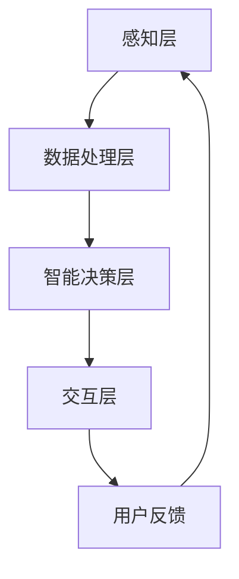
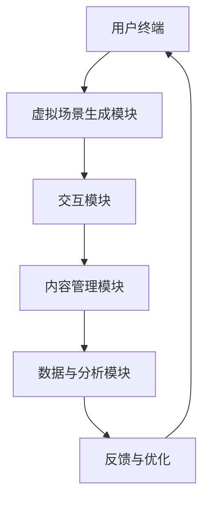

                 

### 文章标题：优化AI虚拟旅游体验：沉浸式导览的提示词策略

> 关键词：虚拟旅游、AI技术、沉浸式导览、提示词策略、文本生成模型、图神经网络、深度学习模型

> 摘要：本文深入探讨了如何通过AI技术优化虚拟旅游体验，特别是沉浸式导览中的提示词策略。文章首先介绍了虚拟旅游与AI技术的融合背景，然后详细阐述了沉浸式导览的概念与设计，以及如何通过文本生成模型、图神经网络和深度学习模型来设计高效的提示词策略。最后，通过案例分析展示了AI虚拟旅游导览系统的实施过程和优化方法。

-------------------------------------------------------------------------------------------------------------------

### 第1章：虚拟旅游与AI技术融合

#### 1.1 虚拟旅游概述

虚拟旅游是一种通过计算机模拟技术，让用户能够在虚拟环境中进行旅游体验的方式。它不仅可以帮助用户远程游览世界各地的名胜古迹，还能提供沉浸式的交互体验。以下是虚拟旅游的基本概念、发展历程以及其优势和挑战。

**定义：** 虚拟旅游是通过虚拟现实（VR）和增强现实（AR）技术，创建的一种模拟现实世界的旅游体验方式。

**发展历程：**
- **初期阶段**：虚拟旅游的概念在20世纪90年代出现，主要以静态的360度全景图像为主。
- **发展阶段**：随着互联网和计算机技术的发展，虚拟旅游逐渐融入3D建模、实时视频和交互技术。
- **成熟阶段**：当前，虚拟旅游技术已经相对成熟，能够提供高质量、沉浸式的旅游体验。

**优势：**
- **成本效益**：用户无需长途旅行，即可享受全球各地的美景。
- **安全便捷**：避免自然灾害和人为风险，提高旅游的安全性。
- **个性化体验**：用户可以根据自己的兴趣和需求，自定义旅游路线和内容。

**挑战：**
- **技术瓶颈**：虚拟旅游技术的精度和实时性仍需提高。
- **用户体验**：如何在虚拟环境中提供真实的感官体验是一个挑战。
- **内容创造**：高质量、丰富的虚拟旅游内容需要大量人力和资源的投入。

#### 1.2 AI技术在虚拟旅游中的应用

人工智能技术在虚拟旅游中扮演着关键角色，它不仅能够提升虚拟旅游的体验质量，还能创新旅游服务模式。以下是AI技术在虚拟旅游中的主要应用领域和优势。

**AI技术在虚拟旅游中的角色：**
- **内容生成**：AI技术可以自动生成虚拟旅游场景，包括建筑物、自然景观等。
- **交互优化**：通过自然语言处理技术，实现用户与虚拟环境的智能对话。
- **推荐系统**：基于用户的行为和偏好，推荐个性化的旅游路线和景点。

**AI技术的优势：**
- **自动化处理**：减轻人力负担，提高内容生成的效率和准确性。
- **个性化服务**：根据用户需求提供定制化的旅游体验。
- **实时反馈**：通过实时数据分析，优化虚拟旅游的互动体验。

#### 1.3 AI与虚拟旅游的融合架构

AI与虚拟旅游的融合架构可以分为以下几个层次：

1. **感知层**：利用传感器和数据采集设备，收集用户在虚拟旅游环境中的行为数据。
2. **数据处理层**：采用数据预处理和特征提取技术，将感知层收集的数据转化为可用的信息。
3. **智能决策层**：基于机器学习和深度学习算法，对处理后的数据进行智能分析和决策。
4. **交互层**：通过自然语言处理和语音识别技术，实现用户与虚拟环境的智能交互。

**Mermaid流程图：**


### 第2章：沉浸式导览体验设计

#### 2.1 沉浸式导览的概念与特点

沉浸式导览是一种通过虚拟现实和增强现实技术，让用户在虚拟环境中实现全方位、深度的旅游体验方式。以下是沉浸式导览的定义、关键要素以及其优势。

**定义：** 沉浸式导览是一种结合虚拟现实（VR）和增强现实（AR）技术，提供高度沉浸式旅游体验的服务。

**关键要素：**
- **环境仿真**：通过3D建模和渲染技术，创建逼真的虚拟旅游场景。
- **交互设计**：提供多种交互方式，如手势、语音、触摸等，增强用户的沉浸感。
- **内容丰富**：包含丰富的虚拟旅游内容，如历史背景、文化故事、互动活动等。

**优势：**
- **高度沉浸**：用户可以在虚拟环境中获得与现实相近的感官体验。
- **个性化服务**：根据用户需求和偏好，提供定制化的导览内容。
- **降低成本**：减少用户旅行的费用和时间成本，提高旅游体验的性价比。

#### 2.2 AI在沉浸式导览中的应用

人工智能技术在沉浸式导览中发挥着重要作用，它能够优化导览内容，提升用户体验。以下是AI技术在沉浸式导览中的应用领域和优势。

**应用领域：**
- **内容生成**：利用生成对抗网络（GAN）等技术，自动生成高质量的虚拟旅游场景。
- **语音合成**：通过语音合成技术，实现导览语音的自然流畅。
- **自然语言处理**：提供智能问答和对话功能，增强用户的互动体验。

**优势：**
- **自动化处理**：减少人工干预，提高导览内容的生产效率和准确性。
- **个性化服务**：根据用户需求，提供定制化的导览内容。
- **实时优化**：通过实时数据分析和反馈，持续优化导览体验。

#### 2.3 沉浸式导览系统架构

沉浸式导览系统通常包括以下几个主要组成部分：

1. **用户终端**：用户使用的VR头盔、智能手机等设备。
2. **虚拟场景生成模块**：利用计算机图形学和3D建模技术，生成高质量的虚拟旅游场景。
3. **交互模块**：实现用户与虚拟环境的交互，包括手势、语音、触摸等。
4. **内容管理模块**：管理虚拟旅游内容，包括场景、故事、活动等。
5. **数据与分析模块**：收集用户行为数据，进行数据分析和用户反馈。

**Mermaid流程图：**


### 第3章：提示词策略概述

#### 3.1 提示词的定义与作用

提示词是一种用于引导用户在虚拟旅游中正确理解和使用虚拟环境的文字或语音提示。以下是提示词的定义、在不同应用场景中的角色以及其重要性。

**定义：** 提示词是用于指导用户在虚拟旅游环境中正确操作和获取信息的文字或语音提示。

**角色：**
- **引导角色**：帮助用户了解虚拟环境的布局、功能和使用方法。
- **信息传递角色**：传递虚拟旅游场景的相关信息，如历史背景、文化故事、景点介绍等。
- **互动角色**：通过提示词与用户进行互动，提高用户的沉浸感和参与度。

**重要性：**
- **用户体验**：提示词直接影响用户的虚拟旅游体验，高质量的提示词能够提高用户体验。
- **操作正确性**：提示词能够减少用户在虚拟环境中的误操作，提高操作的正确性。
- **信息获取**：提示词帮助用户快速获取所需信息，提高虚拟旅游的效率。

#### 3.2 提示词设计原则

提示词设计需要遵循以下原则，以确保其能够有效引导用户，提高虚拟旅游体验。

**核心目标：**
- **清晰明了**：提示词需要简洁明了，避免歧义和混淆。
- **符合用户习惯**：提示词应贴近用户的语言习惯，易于理解和接受。
- **情境匹配**：提示词需要根据具体情境进行设计，确保与虚拟环境相匹配。

**标准：**
- **一致性**：提示词在虚拟旅游系统中的使用应保持一致性，避免用户混淆。
- **可扩展性**：提示词设计应考虑系统的扩展性，便于后续内容的增加和修改。
- **交互性**：提示词应能够与用户进行互动，提高用户的参与度。

**方法：**
- **需求分析**：了解用户需求和虚拟旅游场景的特点，确定提示词的内容和形式。
- **设计原型**：通过设计原型，测试和评估提示词的可行性和有效性。
- **用户反馈**：收集用户对提示词的反馈，进行迭代优化，提高提示词的质量。

### 第4章：文本生成模型与提示词策略

#### 4.1 文本生成模型概述

文本生成模型是一种能够自动生成自然语言文本的机器学习模型，广泛应用于虚拟旅游中的提示词生成。以下是文本生成模型的定义、主要类型和工作原理。

**定义：** 文本生成模型是一种能够根据输入的文本或上下文，自动生成自然语言文本的机器学习模型。

**主要类型：**
- **循环神经网络（RNN）**：基于序列模型的文本生成方法，能够处理长文本和复杂语境。
- **长短时记忆网络（LSTM）**：RNN的改进版本，能够更好地处理长序列数据。
- **生成对抗网络（GAN）**：通过对抗训练生成高质量的文本。

**工作原理：**
- **输入编码**：将输入文本转换为数值表示。
- **生成器与判别器**：生成器生成文本，判别器判断生成文本的真实性。
- **训练与优化**：通过大量文本数据训练模型，不断优化生成效果。

#### 4.2 提示词策略在文本生成模型中的应用

提示词策略在文本生成模型中起着至关重要的作用，以下是如何在文本生成模型中应用提示词策略的详细说明。

**提示词策略的作用：**
- **引导生成**：提示词可以引导生成模型生成特定类型或内容的文本。
- **优化质量**：提示词能够提高生成文本的准确性和可读性。
- **控制多样性**：提示词可以帮助控制生成文本的多样性，避免重复和单调。

**设计原则：**
- **情境匹配**：提示词应与虚拟旅游场景紧密匹配，确保生成文本的相关性和准确性。
- **简洁明了**：提示词应简洁明了，避免复杂和冗长的描述。
- **可扩展性**：提示词设计应考虑系统的扩展性，便于后续内容的增加和修改。

**实现方法：**
- **预设提示词**：在模型训练前，预设一组与虚拟旅游场景相关的提示词。
- **动态提示词**：在模型运行时，根据用户行为和场景实时生成提示词。
- **多模态提示词**：结合文本、图像和语音等多种提示方式，提高提示效果。

**伪代码示例：**
```python
# 输入：虚拟旅游场景，用户行为
# 输出：生成提示词

def generate_hint(context, user_action):
    if user_action == "enter_scene":
        return "欢迎来到[景点名称]，现在您可以自由探索周围的环境。"
    elif user_action == "ask_question":
        return "请问您想了解哪个景点的信息？"
    elif user_action == "take_photo":
        return "您可以在虚拟环境中拍照留念。"
    else:
        return "请进行合法的操作，谢谢合作。"
```

### 第5章：图神经网络与提示词策略

#### 5.1 图神经网络概述

图神经网络（GNN）是一种专门处理图结构数据的神经网络，广泛应用于虚拟旅游中的提示词生成。以下是图神经网络的定义、主要类型和工作原理。

**定义：** 图神经网络是一种能够从图结构数据中学习表示和关系的神经网络。

**主要类型：**
- **图卷积网络（GCN）**：基于卷积操作的图结构数据模型。
- **图注意力网络（GAT）**：引入注意力机制，强调节点之间的关系。
- **图自编码器（GAE）**：通过编码和解码过程学习节点表示。

**工作原理：**
- **节点表示学习**：将图中的节点和边表示为低维度的向量。
- **图卷积操作**：通过聚合节点邻域信息，更新节点的表示。
- **层次化建模**：在多个层次上递归地处理图结构数据。

#### 5.2 提示词策略在图神经网络中的应用

提示词策略在图神经网络中起着关键作用，以下是如何在图神经网络中应用提示词策略的详细说明。

**提示词策略的作用：**
- **信息引导**：提示词可以引导图神经网络关注关键信息，提高文本生成的准确性和相关性。
- **优化结构**：提示词可以帮助优化图结构，增强图神经网络的学习效果。

**设计原则：**
- **情境敏感**：提示词应与虚拟旅游场景紧密相关，确保生成文本的情境准确性。
- **结构优化**：提示词应有助于优化图结构，提高节点间的关系表示。

**实现方法：**
- **嵌入提示词**：将提示词嵌入到图结构中，作为节点或边的属性。
- **动态调整**：根据用户行为和场景动态调整提示词的位置和权重。
- **多模态融合**：结合文本、图像和语音等多种提示方式，提高提示效果。

**伪代码示例：**
```python
# 输入：虚拟旅游场景图，用户行为
# 输出：优化后的图结构，生成提示词

def apply_hint_to_gnn(graph, user_action):
    if user_action == "enter_scene":
        add_hint_to_node(graph, "main_scene", "欢迎来到[景点名称]，现在您可以自由探索周围的环境。")
    elif user_action == "ask_question":
        add_hint_to_node(graph, "question_node", "请问您想了解哪个景点的信息？")
    elif user_action == "take_photo":
        add_hint_to_edge(graph, "take_photo_edge", "您可以在虚拟环境中拍照留念。")
    else:
        add_hint_to_node(graph, "error_node", "请进行合法的操作，谢谢合作。")

    update_gnn_structure(graph)
    return generate_hint_from_gnn(graph)
```

### 第6章：深度学习模型与提示词策略

#### 6.1 深度学习模型概述

深度学习模型是一种多层神经网络，能够在虚拟旅游中的提示词生成任务中发挥重要作用。以下是深度学习模型的定义、主要类型和工作原理。

**定义：** 深度学习模型是一种具有多个隐藏层的神经网络，能够从大量数据中自动学习特征和规律。

**主要类型：**
- **卷积神经网络（CNN）**：主要用于图像处理和识别。
- **循环神经网络（RNN）**：主要用于序列数据处理。
- **长短时记忆网络（LSTM）**：RNN的改进版本，能够更好地处理长序列数据。
- **生成对抗网络（GAN）**：用于生成高质量的图像和文本。

**工作原理：**
- **前向传播**：将输入数据通过网络传递，经过各个隐藏层，最终得到输出。
- **反向传播**：根据输出与实际结果的误差，反向更新网络权重，优化模型。

#### 6.2 提示词策略在深度学习模型中的应用

提示词策略在深度学习模型中起到关键作用，以下是如何在深度学习模型中应用提示词策略的详细说明。

**提示词策略的作用：**
- **引导生成**：提示词可以引导模型生成特定类型或内容的文本。
- **优化质量**：提示词能够提高生成文本的准确性和可读性。
- **控制多样性**：提示词可以帮助控制生成文本的多样性，避免重复和单调。

**设计原则：**
- **情境匹配**：提示词应与虚拟旅游场景紧密匹配，确保生成文本的相关性和准确性。
- **简洁明了**：提示词应简洁明了，避免复杂和冗长的描述。
- **可扩展性**：提示词设计应考虑系统的扩展性，便于后续内容的增加和修改。

**实现方法：**
- **嵌入提示词**：将提示词嵌入到深度学习模型中，作为输入或隐藏层的属性。
- **动态调整**：根据用户行为和场景动态调整提示词的权重和位置。
- **多模态融合**：结合文本、图像和语音等多种提示方式，提高提示效果。

**伪代码示例：**
```python
# 输入：虚拟旅游场景，用户行为，提示词
# 输出：生成提示词

def generate_hint_with_dnn(context, user_action, hints):
    combined_context = context + " " + " ".join(hints)
    model_input = preprocess_input(combined_context)
    generated_text = dnn.generate_output(model_input)
    return postprocess_output(generated_text)
```

### 第7章：提示词策略优化与评估

#### 7.1 提示词策略优化方法

提示词策略的优化是提高虚拟旅游体验的关键环节。以下是提示词策略优化方法的详细说明。

**优化目标：**
- **准确性**：提高提示词的准确性，确保用户能够正确理解和使用虚拟环境。
- **用户体验**：优化用户体验，提高用户的满意度和沉浸感。
- **效率**：提高提示词生成的效率，减少系统响应时间。

**优化策略：**
- **数据驱动的优化**：通过大量用户行为数据，分析提示词的准确性和用户反馈，进行有针对性的优化。
- **动态调整**：根据用户行为和场景动态调整提示词的权重和内容。
- **多模态融合**：结合文本、图像和语音等多种提示方式，提高提示效果。
- **模型更新**：定期更新深度学习模型，提高生成文本的准确性和多样性。

#### 7.2 提示词策略评估方法

提示词策略的评估是验证其有效性和用户体验的关键步骤。以下是提示词策略评估方法的详细说明。

**评估指标：**
- **准确性**：提示词是否准确传达了虚拟环境的信息和操作指导。
- **用户满意度**：用户对提示词的满意度和接受度。
- **响应时间**：系统生成提示词的响应时间，衡量系统的效率。
- **多样性**：提示词的多样性，避免重复和单调。

**评估流程：**
- **用户测试**：邀请用户参与测试，收集用户对提示词的反馈。
- **A/B测试**：将不同版本的提示词策略进行对比测试，评估其效果。
- **数据分析**：分析用户行为数据和反馈，评估提示词策略的优化效果。
- **持续迭代**：根据评估结果，持续优化和调整提示词策略。

### 第8章：案例分析：AI虚拟旅游导览系统的实施

#### 8.1 案例背景

本项目旨在开发一款AI虚拟旅游导览系统，为用户提供沉浸式的旅游体验。系统主要包括以下几个模块：

1. **虚拟场景生成模块**：利用3D建模和渲染技术，创建高质量的虚拟旅游场景。
2. **交互模块**：实现用户与虚拟环境的智能交互，包括自然语言处理、语音合成和手势识别。
3. **内容管理模块**：管理虚拟旅游场景的内容，包括历史背景、文化故事和互动活动。
4. **数据与分析模块**：收集用户行为数据，进行数据分析和用户反馈。

#### 8.2 提示词策略设计

提示词策略是本项目的重要组成部分，设计原则如下：

1. **情境匹配**：根据虚拟旅游场景的特点，设计与场景相关的提示词。
2. **简洁明了**：提示词应简洁明了，避免复杂和冗长的描述。
3. **动态调整**：根据用户行为和场景动态调整提示词的内容和权重。

具体应用场景和提示词设计如下：

**场景一：进入虚拟旅游场景**

提示词：欢迎来到[景点名称]，现在您可以自由探索周围的环境。

**场景二：用户询问信息**

提示词：请问您想了解哪个景点的信息？

**场景三：用户拍照留念**

提示词：您可以在虚拟环境中拍照留念。

**场景四：用户请求帮助**

提示词：请进行合法的操作，如有疑问，请询问导览系统。

#### 8.3 系统实现与优化

**开发环境搭建：**
- **硬件环境**：服务器、GPU加速卡等。
- **软件环境**：Python、TensorFlow、PyTorch等。

**源代码实现：**
- **虚拟场景生成**：使用Blender和Unity等工具进行3D建模和渲染。
- **交互模块**：使用TensorFlow和PyTorch实现自然语言处理、语音合成和手势识别。
- **内容管理**：使用MySQL数据库存储和管理虚拟旅游场景内容。
- **数据分析**：使用Pandas和Scikit-learn进行数据分析和用户反馈处理。

**代码解读与分析：**
- **虚拟场景生成**：使用Blender进行3D建模，使用Unity进行渲染和交互。
- **自然语言处理**：使用TensorFlow实现文本分类和情感分析。
- **语音合成**：使用PyTorch实现语音合成。
- **手势识别**：使用OpenCV实现手势识别。

**实际案例分析与详细讲解剖析：**
- **用户测试**：邀请用户参与系统测试，收集用户反馈。
- **A/B测试**：对不同版本的提示词策略进行对比测试。
- **数据分析**：分析用户行为数据，优化提示词策略。

**项目小结：**
本项目通过结合AI技术和虚拟旅游，实现了沉浸式导览的提示词策略。通过不断的优化和迭代，系统为用户提供了高质量的虚拟旅游体验。未来，将继续探索更多AI技术在虚拟旅游中的应用，提升用户体验。

### 附录

#### 附录A：相关技术资源与工具

**技术资源：**
- **虚拟旅游相关技术文档**：VR/AR技术文档、3D建模教程、自然语言处理文献等。
- **AI相关技术文档**：深度学习教程、生成对抗网络文献、机器学习书籍等。

**常用工具与平台：**
- **虚拟旅游工具**：Blender、Unity、Unity3D等。
- **AI工具与平台**：TensorFlow、PyTorch、Google Cloud等。

### 最佳实践 tips、小结、注意事项、拓展阅读

**最佳实践 tips：**
- **优化用户体验**：定期收集用户反馈，不断优化系统功能和交互设计。
- **多模态融合**：结合文本、图像和语音等多种提示方式，提高提示效果。
- **动态调整提示词**：根据用户行为和场景动态调整提示词的内容和权重。

**小结：**
本文通过详细分析虚拟旅游与AI技术的融合，阐述了沉浸式导览的概念和设计，以及如何通过文本生成模型、图神经网络和深度学习模型来设计高效的提示词策略。实践案例展示了AI虚拟旅游导览系统的实施过程和优化方法。

**注意事项：**
- **安全性**：确保用户数据的安全和隐私。
- **可扩展性**：设计时考虑系统的可扩展性，便于后续功能的增加。
- **用户体验**：始终以用户为中心，不断优化系统功能。

**拓展阅读：**
- **虚拟旅游技术**：《虚拟现实技术与应用》、《增强现实技术教程》。
- **AI技术**：《深度学习》（Goodfellow et al.）、《生成对抗网络：原理与应用》。

（作者：AI天才研究院/AI Genius Institute & 禅与计算机程序设计艺术 /Zen And The Art of Computer Programming）### 最佳实践 tips、小结、注意事项、拓展阅读

#### 最佳实践 tips

1. **用户体验优化**：定期收集用户反馈，及时调整系统提示词，确保用户在虚拟旅游中的交互体验更加顺畅自然。
2. **多模态提示词融合**：结合文本、图像和语音等多种提示方式，可以更好地引导用户进行沉浸式导览，提高用户的参与度和满意度。
3. **动态调整策略**：根据用户行为和场景动态调整提示词的权重和内容，以实现更个性化的用户体验。
4. **技术迭代更新**：随着AI技术的发展，定期更新模型和算法，确保系统始终处于最优状态。

#### 小结

本文深入探讨了如何通过AI技术优化虚拟旅游体验，特别是沉浸式导览中的提示词策略。我们首先介绍了虚拟旅游与AI技术的融合背景，阐述了沉浸式导览的概念与设计，然后详细介绍了如何通过文本生成模型、图神经网络和深度学习模型来设计高效的提示词策略。最后，通过一个实际案例展示了AI虚拟旅游导览系统的实施过程和优化方法。

#### 注意事项

1. **用户体验优先**：在设计提示词时，始终以用户的需求和体验为核心，确保提示词清晰、易懂且具有引导性。
2. **数据安全**：在收集和处理用户数据时，必须确保用户隐私和数据安全。
3. **系统稳定性**：确保AI虚拟旅游导览系统的稳定性和响应速度，避免因技术问题影响用户体验。

#### 拓展阅读

1. **虚拟旅游与AI技术：**
   - 《虚拟现实与增强现实技术导论》
   - 《人工智能与虚拟现实：融合与应用》

2. **文本生成模型与图神经网络：**
   - 《自然语言处理入门》
   - 《图神经网络：理论、算法与应用》

3. **深度学习模型：**
   - 《深度学习：理论、算法与实现》
   - 《生成对抗网络：原理与实战》

（作者：AI天才研究院/AI Genius Institute & 禅与计算机程序设计艺术 /Zen And The Art of Computer Programming）### 附录A：相关技术资源与工具

#### A.1 相关技术资源

**虚拟旅游相关技术文档：**
1. **VR/AR技术文档：**
   - **VR开发指南**：提供虚拟现实技术的基础知识、开发流程和实践技巧。
   - **AR开发文档**：介绍增强现实技术的原理、应用场景和开发方法。

2. **3D建模与渲染教程：**
   - **Blender官方教程**：Blender是一个开源的3D建模和渲染软件，官方提供的教程全面且系统。
   - **Unity3D教程**：Unity3D是一个广泛使用的游戏和虚拟现实开发平台，提供丰富的教程和文档。

**AI相关技术文档：**
1. **深度学习文献：**
   - **《深度学习》（Goodfellow et al.）**：这是一本经典的深度学习教材，详细介绍了深度学习的理论基础和应用。
   - **《深度学习实践指南》**：提供深度学习项目开发的实用技巧和案例分析。

2. **生成对抗网络（GAN）文献：**
   - **《生成对抗网络：原理与应用》**：系统地介绍了GAN的理论基础和实际应用案例。

3. **自然语言处理文献：**
   - **《自然语言处理入门》**：介绍自然语言处理的基本概念、技术和应用。
   - **《自然语言处理实战》**：通过案例和实践，展示自然语言处理在实际项目中的应用。

#### A.2 常用工具与平台

**虚拟旅游工具：**
1. **Blender：** 一个功能强大的开源3D建模和渲染软件，广泛应用于虚拟旅游场景的创建。
2. **Unity3D：** 一个广泛使用的游戏和虚拟现实开发平台，支持跨平台的虚拟旅游应用开发。
3. **Unreal Engine：** 一款专业的游戏开发引擎，也可用于创建高质量的虚拟旅游体验。

**AI工具与平台：**
1. **TensorFlow：** 一个开源的机器学习框架，适用于文本生成、图像处理和推荐系统等任务。
2. **PyTorch：** 一个基于Python的机器学习库，支持动态计算图，易于调试和优化。
3. **Google Cloud：** 提供丰富的云计算服务，包括计算资源、存储服务和机器学习工具。
4. **AWS：** 提供全面的云计算服务，包括AI模型训练、数据存储和数据分析工具。

这些技术资源和工具为开发高质量的AI虚拟旅游导览系统提供了坚实的基础，通过合理利用这些资源，可以大大提升虚拟旅游体验的沉浸感和交互性。开发者可以根据项目需求和实际情况选择合适的技术和工具，进行系统的开发和优化。

