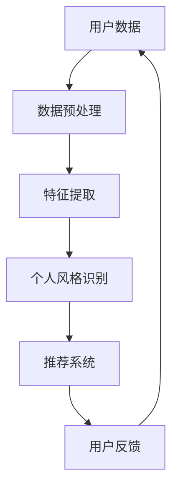

                 

## 《优化AI虚拟时尚顾问：个人风格定制的提示词策略》

### 关键词：AI虚拟时尚顾问、个人风格定制、提示词策略、数据预处理、特征提取、深度学习、推荐系统

#### 摘要：

本文旨在探讨如何优化AI虚拟时尚顾问的个人风格定制能力。通过对提示词策略的设计与优化，本文提出了一个基于深度学习和传统机器学习算法的框架，以实现对用户个人风格的准确识别和个性化推荐。文章首先介绍了AI虚拟时尚顾问的背景和兴起原因，随后详细分析了提示词策略的设计与优化方法，探讨了数据预处理与特征提取的关键步骤，并展示了具体的项目实战案例。通过本文的讨论，希望能够为相关领域的研究者和开发者提供有价值的参考和启示。

## 引言与背景

### 1.1 书籍目的与读者对象

本书的目标是深入探讨如何通过优化提示词策略来提升AI虚拟时尚顾问的个人风格定制能力。我们期望读者包括但不限于AI领域的研究人员、软件工程师、产品经理以及对时尚个性化推荐系统感兴趣的技术爱好者。通过本书的阅读，读者将能够掌握从理论到实践的一系列核心技能，包括AI虚拟时尚顾问的架构设计、提示词策略的优化方法、数据预处理与特征提取技术等。

### 1.2 AI虚拟时尚顾问的兴起

随着人工智能技术的迅猛发展和互联网的普及，虚拟时尚顾问成为了一个热门领域。AI虚拟时尚顾问通过使用计算机视觉、自然语言处理和机器学习等技术，可以模拟专业时尚顾问的能力，为用户提供个性化的时尚推荐。用户可以通过拍照上传自己的服装图片，系统会根据用户的历史购物记录、风格喜好和当前流行趋势，推荐符合个人风格的服饰搭配。

### 1.3 个人风格定制的价值

个人风格定制不仅能够提升用户的购物体验，还能有效增加用户粘性和忠诚度。对于电商平台和时尚品牌来说，提供个性化的推荐服务可以显著提高销售额和品牌影响力。此外，个人风格定制还能够满足用户对于个性化表达和时尚追求的需求，从而推动整个时尚产业的创新和发展。

## AI基础与虚拟时尚顾问

### 2.1 人工智能概述

人工智能（AI）是计算机科学的一个分支，旨在使机器能够模拟人类的智能行为。AI技术包括机器学习、深度学习、计算机视觉、自然语言处理等多个子领域。在这些技术的支持下，机器能够从数据中学习模式、做出决策，并执行复杂的任务。

### 2.2 虚拟时尚顾问的架构

虚拟时尚顾问的架构通常包括数据采集、数据预处理、个人风格识别和推荐系统等模块。数据采集部分负责收集用户画像、购物记录和时尚趋势数据。数据预处理模块则对原始数据进行清洗和标准化。个人风格识别模块通过机器学习算法分析用户数据，识别用户的个人风格。最后，推荐系统根据识别结果和用户偏好，生成个性化的时尚推荐。

### 2.3 个人风格识别的关键技术

个人风格识别是虚拟时尚顾问的核心技术之一。它涉及多个AI子领域的知识，包括：

- **计算机视觉**：用于识别和分类用户上传的服装图片。
- **自然语言处理**：用于分析和理解用户的文本描述和购物记录。
- **用户画像**：通过综合多种数据源，构建用户的个性化特征。
- **深度学习**：用于训练复杂的模型，实现高精度的个人风格识别。

## 提示词策略设计与优化

### 3.1 提示词策略的基本概念

提示词策略是虚拟时尚顾问系统中的关键组件，它决定了系统如何与用户互动，获取用户偏好信息，并生成个性化的推荐。提示词策略包括以下关键概念：

- **用户输入**：用户通过拍照或输入描述的方式提供时尚相关的内容。
- **上下文理解**：系统需要理解用户输入的上下文信息，包括风格、颜色、场合等。
- **反馈循环**：系统根据用户的反馈不断调整和优化推荐策略。

### 3.2 提示词生成算法

提示词生成算法负责从用户输入中提取关键信息，并生成相应的提示词。常见的提示词生成算法包括：

- **基于规则的方法**：根据预定义的规则和模式生成提示词。
- **基于机器学习的方法**：使用训练数据学习生成提示词的模型，例如使用循环神经网络（RNN）或变压器（Transformer）模型。

### 3.3 提示词优化的技术

提示词优化是提升虚拟时尚顾问性能的重要环节。优化技术包括：

- **在线学习**：系统实时学习用户反馈，不断调整提示词生成策略。
- **反馈修正**：根据用户的错误反馈修正提示词，提高生成提示词的准确性。
- **模型解释性**：通过模型解释技术，分析提示词生成过程中的关键因素，优化模型性能。

## 数据预处理与特征提取

### 4.1 数据收集与清洗

数据预处理是虚拟时尚顾问系统中的关键步骤。首先，系统需要收集大量的用户数据，包括服装图片、购物记录、用户评价等。然后，对数据进行清洗，去除无效和噪声数据，确保数据的准确性和一致性。

### 4.2 特征提取方法

特征提取是将原始数据转换成适合机器学习算法处理的形式。常用的特征提取方法包括：

- **视觉特征提取**：使用计算机视觉技术提取服装图片的特征，例如颜色直方图、纹理特征等。
- **文本特征提取**：使用自然语言处理技术提取文本描述的特征，例如词袋模型、词嵌入等。
- **用户行为特征提取**：从用户购物记录和互动行为中提取特征，例如购买频率、浏览时长等。

### 4.3 特征工程

特征工程是数据预处理的重要环节，旨在通过设计和选择合适的特征，提高模型性能。特征工程的方法包括：

- **特征选择**：从大量特征中筛选出对模型性能有显著影响的特征。
- **特征转换**：将原始特征转换成更适合机器学习算法处理的形式，例如归一化、标准化等。
- **特征组合**：通过组合多个特征，生成新的特征，提高模型的泛化能力。

## 个人风格识别算法

### 5.1 基于深度学习的风格识别

深度学习技术在个人风格识别中发挥着重要作用。常见的深度学习算法包括：

- **卷积神经网络（CNN）**：用于提取图像特征，实现服装图片的分类和识别。
- **循环神经网络（RNN）**：用于处理序列数据，例如用户的购物记录和文本描述。
- **变压器（Transformer）**：通过自注意力机制，实现长距离依赖关系的建模。

### 5.2 基于传统机器学习的风格识别

传统机器学习算法也在个人风格识别中发挥着重要作用。常见的算法包括：

- **支持向量机（SVM）**：用于分类和回归任务，具有较高的准确性和泛化能力。
- **决策树**：通过树形结构对特征进行划分，实现分类和回归任务。
- **朴素贝叶斯**：基于贝叶斯定理，实现特征的条件概率估计，适用于文本分类任务。

### 5.3 算法对比与选择

不同算法在个人风格识别中具有各自的优缺点。选择合适的算法需要考虑以下几个因素：

- **数据量**：深度学习算法通常需要大量的训练数据，而传统机器学习算法对数据量的要求较低。
- **计算资源**：深度学习算法通常需要较高的计算资源，而传统机器学习算法的计算成本较低。
- **模型复杂度**：深度学习算法能够处理更复杂的特征关系，但模型复杂度较高，容易过拟合。
- **准确性和泛化能力**：选择算法时需要综合考虑模型的准确性和泛化能力，以避免过拟合或欠拟合。

## 虚拟时尚顾问的应用实例

### 6.1 个性化推荐系统

个性化推荐系统是虚拟时尚顾问的核心应用之一。通过分析用户的历史行为和偏好，系统可以生成个性化的时尚推荐。以下是一个简单的个性化推荐系统实现步骤：

1. **用户画像构建**：收集用户的基本信息、购物记录、浏览记录等，构建用户画像。
2. **推荐算法选择**：选择合适的推荐算法，例如基于协同过滤的推荐算法。
3. **推荐结果生成**：根据用户画像和推荐算法，生成个性化的推荐结果。

### 6.2 购物体验优化

虚拟时尚顾问可以通过优化购物体验，提高用户的满意度和忠诚度。以下是一些购物体验优化的方法：

1. **个性化推荐**：根据用户的喜好和购物记录，提供个性化的商品推荐。
2. **实时交互**：通过聊天机器人等技术，提供实时的用户交互和咨询服务。
3. **视觉增强**：利用计算机视觉技术，实现虚拟试衣和搭配建议。

### 6.3 算法性能评估

评估算法性能是优化虚拟时尚顾问的重要环节。以下是一些常用的算法性能评估方法：

1. **准确率（Accuracy）**：评估分类算法的分类准确性。
2. **召回率（Recall）**：评估分类算法对正类别的召回能力。
3. **F1 分数（F1 Score）**：综合考虑准确率和召回率，评价算法的整体性能。
4. **均方误差（MSE）**：评估回归算法的预测误差。

## 挑战与未来方向

### 7.1 当前挑战

虚拟时尚顾问系统在实现过程中面临着多个挑战，包括：

1. **数据隐私保护**：用户数据的安全性和隐私保护是一个重要问题。
2. **算法解释性**：深度学习算法的黑箱性质导致其解释性较差，难以向用户解释推荐结果。
3. **模型泛化能力**：如何提高模型在不同用户群体和数据分布下的泛化能力。

### 7.2 未来发展方向

未来，虚拟时尚顾问系统的发展方向包括：

1. **多模态数据融合**：结合多种数据源，提高个人风格识别的准确性。
2. **强化学习**：引入强化学习算法，实现更加智能和自适应的推荐系统。
3. **人机协同**：结合人工智能和人类专家的智慧，提供更加个性化的时尚推荐。

### 7.3 结论与展望

本文探讨了如何通过优化提示词策略来提升AI虚拟时尚顾问的个人风格定制能力。通过设计合理的提示词策略、优化数据预处理与特征提取、选择合适的个人风格识别算法，可以显著提高虚拟时尚顾问的性能和用户体验。未来，随着人工智能技术的不断进步，虚拟时尚顾问将更加智能化和个性化，为用户提供更加精准和贴心的时尚服务。

## 作者信息

作者：AI天才研究院/AI Genius Institute & 禅与计算机程序设计艺术 /Zen And The Art of Computer Programming

---

### 附录

以下为本文涉及的核心概念、算法原理、数学模型、项目实战等内容的详细解释和示例。

#### 1. 核心概念与联系

**个人风格识别** 是虚拟时尚顾问系统中的核心概念。它涉及到多个子领域，如 **计算机视觉**、**自然语言处理**、**用户画像** 和 **深度学习**。以下是一个简化的 Mermaid 流程图，展示这些概念之间的联系：



#### 2. 核心算法原理讲解

**深度学习算法** 是个人风格识别的核心技术。以下是一个简化的卷积神经网络（CNN）的伪代码，用于提取图像特征：

```python
# 输入：服装图像
# 输出：图像特征向量

def cnn_image_feature_extraction(image):
    # 步骤1：图像预处理
    processed_image = preprocess_image(image)

    # 步骤2：卷积层
    conv_output = convolution(processed_image, filter)

    # 步骤3：激活函数
    activated_output = activation(conv_output)

    # 步骤4：池化层
    pooled_output = pooling(activated_output)

    # 步骤5：全连接层
    feature_vector = fully_connected(pooled_output)

    return feature_vector
```

#### 3. 数学模型和公式

在个人风格识别中，常用的数学模型包括 **支持向量机（SVM）** 和 **朴素贝叶斯（Naive Bayes）**。以下是一个简单的 SVM 公式，用于分类任务：

$$
w = \arg\min_{w} \frac{1}{2} ||w||^2 + C \sum_{i=1}^{n} \max(0, 1 - y_i ( \langle w, x_i \rangle + b ))
$$

其中，$w$ 是权重向量，$C$ 是惩罚参数，$y_i$ 是第 $i$ 个样本的标签，$x_i$ 是第 $i$ 个样本的特征向量，$\langle \cdot, \cdot \rangle$ 表示内积运算，$b$ 是偏置。

#### 4. 项目实战

**项目实战**：使用 TensorFlow 搭建一个基于 CNN 的虚拟时尚顾问系统。

**开发环境搭建**：

- Python 3.7+
- TensorFlow 2.3.0+

**源代码详细实现和代码解读**：

```python
import tensorflow as tf
from tensorflow.keras.models import Sequential
from tensorflow.keras.layers import Conv2D, MaxPooling2D, Flatten, Dense

# 构建卷积神经网络模型
model = Sequential([
    Conv2D(filters=32, kernel_size=(3, 3), activation='relu', input_shape=(64, 64, 3)),
    MaxPooling2D(pool_size=(2, 2)),
    Flatten(),
    Dense(units=128, activation='relu'),
    Dense(units=1, activation='sigmoid')
])

# 编译模型
model.compile(optimizer='adam', loss='binary_crossentropy', metrics=['accuracy'])

# 训练模型
model.fit(x_train, y_train, epochs=10, batch_size=32, validation_data=(x_val, y_val))
```

**代码应用解读与分析**：

上述代码使用 TensorFlow 搭建了一个简单的卷积神经网络（CNN）模型，用于分类任务。首先，我们导入了 TensorFlow 和相关模块。然后，我们定义了一个序列模型，并添加了卷积层、池化层、全连接层等。接着，我们编译模型，并使用训练数据训练模型。

**实际案例分析和详细讲解剖析**：

假设我们有一个训练数据集，包含 1000 张服装图片，每张图片都对应一个标签（例如，时尚、商务、休闲等）。我们使用上述模型对图片进行分类，并评估模型的性能。

```python
# 评估模型
loss, accuracy = model.evaluate(x_test, y_test)
print("Test accuracy:", accuracy)
```

上述代码用于评估模型在测试数据集上的性能。如果模型的准确率较高，说明模型具有良好的泛化能力。

**项目小结**：

通过该项目，我们学习了如何使用 TensorFlow 搭建一个基于 CNN 的虚拟时尚顾问系统。这个系统可以通过训练数据学习图像特征，实现对服装风格的分类和识别。

#### 5. 最佳实践 tips、小结、注意事项、拓展阅读

**最佳实践 tips**：

1. 确保数据质量：在进行数据预处理时，要确保数据的质量和一致性。
2. 选择合适的特征提取方法：根据数据的特点，选择合适的特征提取方法，以提高模型的性能。
3. 调整模型参数：通过调整模型参数，可以优化模型的性能。

**小结**：

本文详细探讨了如何优化 AI 虚拟时尚顾问的个人风格定制能力。通过设计合理的提示词策略、优化数据预处理与特征提取、选择合适的个人风格识别算法，可以显著提高虚拟时尚顾问的性能和用户体验。

**注意事项**：

1. 在实际应用中，要确保数据隐私保护，避免用户信息泄露。
2. 模型解释性较差时，可以通过模型解释技术提高模型的透明度。

**拓展阅读**：

- 《深度学习》（Goodfellow, Bengio, Courville）
- 《机器学习实战》（Hastie, Tibshirani, Friedman）
- 《TensorFlow 实战》（Shiffman）

---

### 文章总结

通过本文的讨论，我们深入了解了如何优化 AI 虚拟时尚顾问的个人风格定制能力。从提示词策略的设计与优化，到数据预处理与特征提取，再到个人风格识别算法的选择，我们一步步分析了实现个性化推荐的关键技术。通过项目实战案例，我们展示了如何使用深度学习技术搭建一个虚拟时尚顾问系统。未来，随着人工智能技术的不断进步，虚拟时尚顾问将更加智能化和个性化，为用户提供更加精准和贴心的时尚服务。希望本文能为相关领域的研究者和开发者提供有价值的参考和启示。

