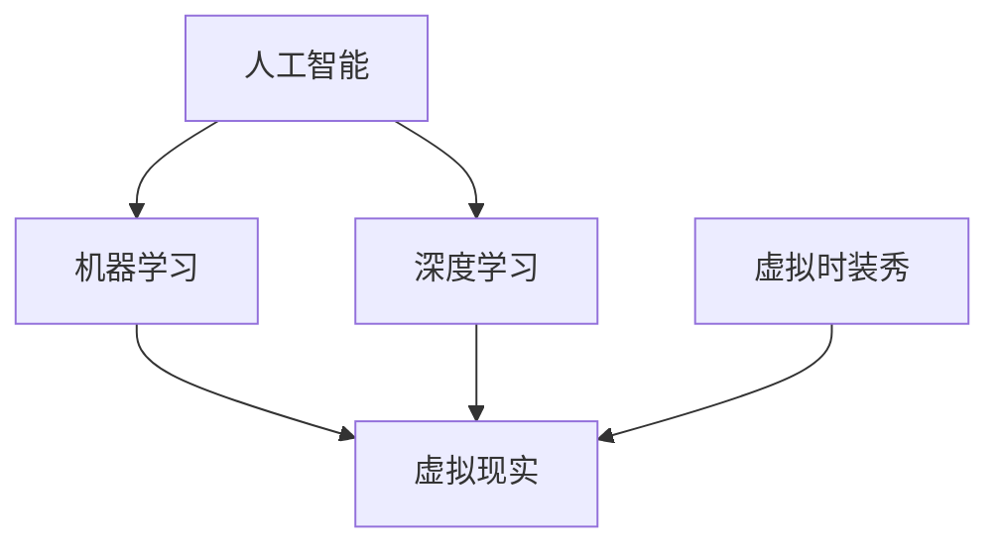
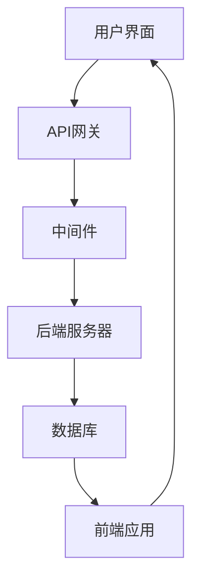

                 

### 引言

当今时代，人工智能（AI）正在深刻改变着我们的生活方式。虚拟现实（VR）技术的快速发展，更是将人们的感官体验提升到了一个新的高度。在这个背景下，AI虚拟时装秀应运而生，成为时尚界的一大创新亮点。通过AI技术，虚拟时装秀不仅能够提供沉浸式的观看体验，还能够实现实时互动与个性化推荐，极大地提升了用户的参与感和满意度。

本文将围绕“优化AI虚拟时装秀：动态展示效果的提示词策略”这一主题，深入探讨AI虚拟时装秀的架构设计、动态展示效果优化策略以及关键提示词策略。文章将从以下几个核心方面展开：

1. **核心概念与原理**：介绍人工智能、虚拟现实、虚拟时装秀的基本概念及其相互关系。
2. **架构与设计**：解析AI虚拟时装秀的系统架构、核心组件及其功能。
3. **动态展示效果与提示词策略**：详细探讨动态展示效果的概念、技术及优化策略。
4. **数据准备与处理**：阐述数据收集、预处理和模型训练的过程。
5. **实战项目**：通过具体案例展示实际开发过程和实现细节。

通过本文的深入分析，希望能够为开发者、研究人员和时尚界从业者提供有价值的参考，共同推动AI虚拟时装秀的发展与创新。

### 关键词

- **人工智能（AI）**
- **虚拟现实（VR）**
- **虚拟时装秀**
- **动态展示效果**
- **提示词策略**
- **数据预处理**
- **模型训练**
- **用户体验优化**

### 摘要

本文旨在探讨如何通过优化动态展示效果的提示词策略，提升AI虚拟时装秀的用户体验。文章首先介绍了人工智能、虚拟现实和虚拟时装秀的核心概念及其相互关系，接着详细解析了AI虚拟时装秀的系统架构和核心组件。随后，文章重点讨论了动态展示效果的概念及其优化策略，特别是提示词策略在其中的重要作用。此外，文章还涵盖了数据准备与处理、模型训练等关键技术环节。最后，通过实际案例展示了AI虚拟时装秀的开发过程，为读者提供了宝贵的实战经验。

## 核心概念与原理

要深入理解AI虚拟时装秀及其动态展示效果的优化策略，我们首先需要了解几个核心概念：人工智能（AI）、虚拟现实（VR）和虚拟时装秀。这些概念不仅各自独立，而且在实际应用中相互交织，共同构成了AI虚拟时装秀的基石。

### 人工智能（AI）

人工智能，是指由人制造出来的系统能够执行通常需要人类智能才能完成的任务。AI的核心技术包括机器学习（Machine Learning, ML）和深度学习（Deep Learning, DL）。机器学习是通过数据驱动的方式，使计算机系统能够从经验中学习并改进性能。深度学习则是机器学习的一个子领域，通过神经网络（尤其是深度神经网络）来模拟人脑的学习方式。

**机器学习（ML）**：
- **定义**：机器学习是一种使计算机系统能够从数据中学习的方法，无需显式地编写具体的规则或指令。
- **核心算法**：包括线性回归、决策树、支持向量机（SVM）、随机森林、K-最近邻（K-NN）等。
- **应用场景**：推荐系统、图像识别、自然语言处理等。

**深度学习（DL）**：
- **定义**：深度学习是机器学习的一个分支，使用具有多个隐藏层的神经网络来提取复杂特征。
- **核心算法**：包括卷积神经网络（CNN）、循环神经网络（RNN）、生成对抗网络（GAN）等。
- **应用场景**：图像和视频识别、语音识别、自然语言处理等。

### 虚拟现实（VR）

虚拟现实是一种通过计算机生成的模拟环境，使用户能够沉浸在一种全新的感知体验中。VR技术通过头戴式显示器（HMD）、跟踪器和传感器等设备，为用户提供沉浸式视觉、听觉和触觉体验。

**基本概念**：
- **沉浸感**：用户在虚拟环境中感觉自己是真正存在的，而非虚拟世界中的观察者。
- **交互性**：用户可以通过手柄、手势或其他交互设备与虚拟环境进行互动。
- **现实感**：虚拟环境需要尽量接近现实世界的物理规则和视觉效果。

**核心技术**：
- **头戴式显示器（HMD）**：提供沉浸式视觉体验。
- **跟踪系统**：实时跟踪用户位置和运动，确保虚拟环境与用户动作的同步。
- **传感设备**：如触觉手套、体感座椅等，增强用户的沉浸体验。

### 虚拟时装秀

虚拟时装秀是结合了虚拟现实和人工智能技术的创新形式，通过数字化的方式展示时装的创意和设计。它不仅提供了一种新的时装展示手段，还可以实现个性化的用户互动和体验。

**基本概念**：
- **数字化展示**：通过计算机生成的数字模型来展示时装，无需实体样品。
- **个性化体验**：根据用户喜好和风格，提供个性化的时装推荐和展示。
- **实时互动**：用户可以与虚拟时装秀中的模特进行互动，如换装、拍照等。

**核心优势**：
- **成本效益**：减少实体展示所需的场地、人力和物料成本。
- **实时反馈**：设计师可以实时看到设计效果，获取用户反馈，快速调整。
- **扩展性**：易于扩展和更新，展示内容可以随时更新，无需重新布置现场。

### 人工智能、虚拟现实与虚拟时装秀的关系

人工智能和虚拟现实作为两大核心技术，共同推动了虚拟时装秀的发展。人工智能提供了数据分析和智能推荐的能力，使虚拟时装秀能够根据用户行为和偏好提供个性化的展示内容。虚拟现实技术则提供了沉浸式的观看体验，使用户能够身临其境地感受时装的魅力。

**关系架构图**：



通过上述核心概念和原理的介绍，我们为后续章节的深入探讨奠定了基础。在接下来的部分，我们将进一步探讨AI虚拟时装秀的系统架构和核心设计，以及如何通过优化动态展示效果来提升用户体验。

## AI虚拟时装秀的系统架构和核心设计

AI虚拟时装秀的成功离不开其系统的架构设计和核心组件的高效集成。本文将详细介绍AI虚拟时装秀的系统架构，解析其核心组件及其功能，并展示系统架构的Mermaid流程图。

### 系统架构概述

AI虚拟时装秀的系统架构可以分为三个主要部分：前端架构、后端架构和中间件。前端负责用户界面和交互，后端处理数据存储和计算，而中间件则负责数据流的处理和系统的集成。

**前端架构**：
- **用户界面**：提供用户交互的界面，包括服装展示、用户互动功能等。
- **客户端应用**：实现用户侧的渲染和交互，通常使用HTML5、CSS3和JavaScript框架，如React或Vue.js。

**后端架构**：
- **服务器端**：处理业务逻辑、数据存储和计算。通常使用Node.js、Django或Spring Boot等后端框架。
- **数据库**：存储用户数据、时装数据以及展示数据，常用的数据库有MySQL、MongoDB等。

**中间件**：
- **数据流处理**：处理数据的实时传输和转换，常用的工具包括Kafka、RabbitMQ等。
- **API网关**：统一管理前后端交互的接口，通常使用Nginx或Kong等。

### 核心组件及其功能

**服装建模**：
- **定义**：服装建模是创建虚拟时装的基础，通过数字化方式描述时装的款式、颜色、材质等属性。
- **功能**：包括3D建模、纹理映射、光照模拟等，常用的工具包括Blender、Maya等。

**AI模型集成**：
- **定义**：AI模型集成是将机器学习和深度学习算法应用于虚拟时装秀，用于个性化推荐、风格匹配等。
- **功能**：包括用户行为分析、时装风格分类、推荐算法等，常用的AI模型有卷积神经网络（CNN）和循环神经网络（RNN）。

**用户交互**：
- **定义**：用户交互是用户与虚拟时装秀的互动方式，包括选择服装、拍照、换装等。
- **功能**：提供实时的用户反馈，增强用户体验，常用的交互技术有虚拟现实头戴设备（HMD）、手柄和手势识别。

**数据存储与处理**：
- **定义**：数据存储与处理是系统运行的基础，负责数据的持久化和实时处理。
- **功能**：包括用户数据管理、时装数据管理、展示数据管理等，常用的技术有关系数据库（如MySQL）和非关系数据库（如MongoDB）。

**展示效果优化**：
- **定义**：展示效果优化是通过各种技术手段提升虚拟时装秀的视觉效果，包括渲染优化、特效添加等。
- **功能**：提供高质量的图像和视频输出，增强用户沉浸感，常用的技术有实时渲染引擎（如Unity3D）、视频处理工具（如FFmpeg）。

### 系统架构的Mermaid流程图

以下是一个简化的Mermaid流程图，展示了AI虚拟时装秀的系统架构：



**图解**：
- **用户界面**（A）：用户通过前端应用与虚拟时装秀进行交互。
- **API网关**（B）：接收用户的请求，并将请求转发到中间件。
- **中间件**（C）：处理数据流，确保数据的实时性和一致性。
- **后端服务器**（D）：处理业务逻辑，调用数据库进行数据存储和检索。
- **数据库**（E）：存储用户数据、时装数据和展示数据。
- **前端应用**（F）：通过渲染引擎呈现视觉效果，反馈给用户。

通过上述系统架构和核心组件的介绍，我们可以看到AI虚拟时装秀是如何通过技术手段实现高效的展示和互动。在接下来的章节中，我们将深入探讨动态展示效果的概念及其优化策略，特别是提示词策略在其中的重要作用。

## 动态展示效果的概念及其优化策略

动态展示效果在AI虚拟时装秀中扮演着至关重要的角色，它不仅直接影响用户体验，还决定了用户对时装的感知和兴趣。动态展示效果的概念包括可视化技术、实时渲染和用户体验优化等多个方面。以下将详细探讨这些概念，并提出优化策略。

### 可视化技术

可视化技术是动态展示效果的核心，它将抽象的数据和模型转化为直观的图形和图像，使用户能够更容易理解和互动。在虚拟时装秀中，可视化技术主要包括以下几种：

1. **图像可视化**：通过图像处理技术，对时装的纹理、颜色和形状进行优化，使其在虚拟环境中更具有吸引力。常见的图像处理技术包括滤镜应用、色彩校正和图像增强等。

2. **3D建模与渲染**：3D建模和渲染技术用于创建虚拟时装的立体模型，并通过光影效果、材质贴图等手段提升视觉效果。常用的3D建模和渲染工具包括Blender、Maya和Unity3D等。

3. **动画效果**：通过动画技术，使虚拟时装在展示过程中具有动态效果，如飘动、旋转和变换等。动画效果不仅增加了观看的趣味性，还能更好地展示时装的细节和设计理念。

### 实时渲染

实时渲染是动态展示效果的另一个关键方面，它涉及在虚拟环境中实时生成和更新图像。实时渲染技术的核心目标是在保证视觉质量的同时，最大限度地提高渲染速度和响应时间。以下是一些关键技术和优化策略：

1. **渲染引擎**：选择高效的渲染引擎是实时渲染的关键。例如，Unity3D和Unreal Engine等大型游戏引擎提供了强大的渲染能力，并支持多种视觉效果和物理模拟。

2. **光线追踪**：光线追踪是一种高级渲染技术，能够模拟光线的传播和反射，生成逼真的图像效果。通过优化光线追踪算法，可以提高图像的真实感，同时减少渲染时间。

3. **并行计算**：利用多核CPU和GPU的并行计算能力，可以显著提高渲染速度。通过将渲染任务分配到多个处理单元，可以实现高效的实时渲染。

4. **层次细节（LOD）**：层次细节技术通过在不同距离上显示不同的细节级别，减少了渲染的计算量。例如，在远距离时使用较低分辨率的模型，而在近距离时使用高分辨率的模型。

### 用户体验优化

用户体验优化是动态展示效果的最终目标，它旨在提供无缝、流畅和令人愉悦的用户体验。以下是一些关键策略：

1. **交互设计**：通过优化用户界面和交互设计，使用户能够轻松地进行选择和操作。例如，使用直观的图标和按钮，提供平滑的过渡效果和快捷键等。

2. **性能优化**：优化系统的性能，确保虚拟时装秀在低配置设备上也能流畅运行。这包括减少加载时间、降低内存占用和优化代码等。

3. **个性化推荐**：通过AI技术，分析用户的行为和偏好，提供个性化的时装推荐和展示。这不仅可以增加用户的参与度，还能提高用户的满意度。

4. **实时反馈**：及时响应用户的操作和反馈，提供实时的视觉和声音反馈，增强用户的沉浸感和互动性。

### 提示词策略

提示词策略在动态展示效果的优化中起着重要作用。提示词是一种引导用户行为和注意力的小提示或提示信息，它可以通过以下几种方式提升展示效果：

1. **视觉提示**：在虚拟时装展示中，使用色彩、图形或文字等视觉提示来吸引用户的注意力。例如，在时装换装时，使用醒目的图标或文字提示来引导用户操作。

2. **文字提示**：通过文字提示，向用户传达关于时装的详细信息，如设计师、风格、材质等。文字提示可以增强用户的理解和记忆。

3. **交互提示**：在用户进行交互操作时，提供实时反馈和指导，使用户能够更轻松地进行操作。例如，在用户选择时装时，提供详细的操作说明或切换选项。

4. **情感提示**：通过情感化的语言和图像，提升用户的情感体验。例如，使用温馨的问候语或有趣的表情包，使虚拟时装秀更具吸引力。

### 总结

动态展示效果是AI虚拟时装秀成功的关键之一。通过优化可视化技术、实时渲染和用户体验，结合提示词策略，我们可以显著提升虚拟时装秀的吸引力、互动性和用户满意度。在接下来的章节中，我们将进一步探讨数据准备与处理的过程，为后续的模型训练和展示效果优化打下基础。

## 数据准备与处理

在AI虚拟时装秀中，数据的质量和预处理是确保模型训练效果和展示效果优化的关键环节。数据准备与处理主要包括数据收集、数据预处理和数据存储等步骤。以下将详细讨论这些过程，以及如何确保数据的质量和一致性。

### 数据收集

数据收集是数据准备的第一步，其目标是获取与虚拟时装秀相关的各种数据，包括用户数据、时装数据、环境数据等。以下是数据收集的主要来源：

1. **用户数据**：
   - **行为数据**：包括用户浏览记录、搜索历史、点击行为等，这些数据可以帮助分析用户的兴趣和偏好。
   - **偏好数据**：用户注册时提供的个人信息，如年龄、性别、职业等，这些数据有助于进行个性化推荐。
   - **反馈数据**：用户对时装的评分、评论和反馈，这些数据有助于优化时装展示策略。

2. **时装数据**：
   - **款式数据**：包括时装的样式、颜色、材质等详细信息，这些数据用于虚拟时装的建模和展示。
   - **设计数据**：设计师的设计理念、草图和修改记录，这些数据有助于理解时装的设计背景和风格。

3. **环境数据**：
   - **背景数据**：虚拟时装秀的背景图像和场景设置，这些数据用于创建虚拟环境的视觉效果。
   - **灯光数据**：虚拟环境中的灯光设置，如光源位置、强度和颜色等，这些数据影响时装的展示效果。

### 数据预处理

数据预处理是数据准备的核心环节，其目的是提高数据的质量和一致性，为模型训练打下坚实基础。以下是一些关键步骤：

1. **数据清洗**：
   - **缺失值处理**：删除或填充缺失的数据，确保数据完整性。
   - **异常值处理**：检测并处理异常数据点，如用户行为中的异常点击等。
   - **数据标准化**：将不同数据类型和量级的数据进行归一化或标准化，使其在模型训练中具有可比性。

2. **数据转换**：
   - **特征提取**：从原始数据中提取有用的特征，如用户行为的特征、时装的款式特征等。
   - **数据编码**：将类别数据转换为数值数据，以便模型处理。常用的编码方法有独热编码（One-Hot Encoding）和标签编码（Label Encoding）。

3. **数据增强**：
   - **数据扩充**：通过旋转、翻转、缩放等方式生成新的数据样本，增加模型的训练数据量，提高模型的泛化能力。
   - **噪声添加**：在数据中添加合理的噪声，模拟真实环境中的数据噪声，提高模型的鲁棒性。

### 数据存储

数据存储是确保数据可以高效访问和利用的重要环节。以下是一些关键考虑因素：

1. **数据存储方案**：
   - **关系数据库**：如MySQL，适用于结构化数据的存储和查询。
   - **非关系数据库**：如MongoDB，适用于存储非结构化数据和动态变化的时序数据。

2. **数据备份与恢复**：
   - **定期备份**：确保数据的安全性和可靠性，定期进行数据备份。
   - **灾难恢复**：建立灾难恢复计划，确保在数据丢失或系统故障时能够快速恢复。

3. **数据访问与共享**：
   - **数据权限管理**：通过设置数据访问权限，确保数据的安全性和隐私性。
   - **数据共享平台**：构建数据共享平台，方便团队成员间的数据访问和协同工作。

### 确保数据的质量和一致性

1. **数据验证**：
   - **数据校验**：通过编写校验脚本，对数据进行完整性、一致性和准确性的验证。
   - **数据审核**：定期进行数据审核，确保数据的质量和准确性。

2. **数据监控**：
   - **数据指标监控**：通过监控关键数据指标，如数据缺失率、错误率等，及时发现并解决问题。
   - **数据异常检测**：通过异常检测算法，实时发现和报告数据异常，确保数据的一致性和可靠性。

通过上述数据准备与处理过程，我们能够确保数据的质量和一致性，为后续的模型训练和展示效果优化提供坚实的基础。在接下来的章节中，我们将详细讨论AI模型的训练和优化方法，进一步探讨如何提升虚拟时装秀的动态展示效果。

## AI模型训练和优化方法

在AI虚拟时装秀中，模型的训练和优化是提升动态展示效果的关键环节。本文将详细讨论AI模型的训练方法、优化策略和性能评估，同时提供具体的伪代码来阐述算法的实现过程。

### 模型训练方法

AI模型的训练过程是将模型参数调整到能够准确预测或分类输入数据的过程。在虚拟时装秀中，常用的AI模型包括卷积神经网络（CNN）、循环神经网络（RNN）和生成对抗网络（GAN）等。以下将介绍几种常用的模型训练方法：

1. **卷积神经网络（CNN）**：
   - **定义**：CNN是一种深度学习模型，特别适用于图像处理任务。
   - **训练过程**：
     ```python
     # 伪代码：训练CNN模型
     model = CNNModel()
     optimizer = AdamOptimizer()
     for epoch in range(num_epochs):
         for batch in data_loader:
             inputs, labels = batch
             model.zero_grad()
             outputs = model(inputs)
             loss = loss_function(outputs, labels)
             loss.backward()
             optimizer.step()
     ```
   - **优化策略**：使用反向传播算法更新模型参数，常见的优化算法有Adam、SGD等。

2. **循环神经网络（RNN）**：
   - **定义**：RNN是一种能够处理序列数据的神经网络，适用于用户行为分析等任务。
   - **训练过程**：
     ```python
     # 伪代码：训练RNN模型
     model = RNNModel()
     optimizer = AdamOptimizer()
     for epoch in range(num_epochs):
         for batch in data_loader:
             inputs, labels = batch
             model.zero_grad()
             outputs = model(inputs)
             loss = loss_function(outputs, labels)
             loss.backward()
             optimizer.step()
     ```
   - **优化策略**：与CNN类似，使用反向传播算法和适当的优化算法。

3. **生成对抗网络（GAN）**：
   - **定义**：GAN由生成器和判别器组成，生成器生成数据，判别器判断数据真实与否。
   - **训练过程**：
     ```python
     # 伪代码：训练GAN模型
     generator = Generator()
     discriminator = Discriminator()
     generator_optimizer = AdamOptimizer()
     discriminator_optimizer = AdamOptimizer()
     for epoch in range(num_epochs):
         for batch in data_loader:
             real_data = batch
             generated_data = generator.sample_noise()
             discriminator.train(real_data, generated_data)
             generator.train(generated_data)
     ```
   - **优化策略**：通过交替训练生成器和判别器，优化生成数据的真实感。

### 性能评估方法

性能评估是模型训练的重要环节，用于衡量模型的准确性和泛化能力。以下是一些常用的性能评估指标：

1. **准确率（Accuracy）**：模型正确预测的比例。
   - **公式**：Accuracy = (正确预测的数量 / 总预测数量) * 100%
   
2. **召回率（Recall）**：模型正确识别出正例的比例。
   - **公式**：Recall = (正确识别的正例数量 / 总正例数量) * 100%
   
3. **F1值（F1 Score）**：综合考虑准确率和召回率的指标。
   - **公式**：F1 Score = 2 * (准确率 * 召回率) / (准确率 + 召回率)
   
4. **精确率（Precision）**：模型正确预测的正例中，实际为正例的比例。
   - **公式**：Precision = (正确识别的正例数量 / 预测为正例的数量) * 100%

### 优化策略

优化策略旨在提高模型的性能和训练效率。以下是一些常用的优化方法：

1. **数据增强**：通过旋转、翻转、缩放等方式生成新的训练数据，增加模型的泛化能力。
   - **实现**：使用数据增强库，如Keras的ImageDataGenerator。

2. **批归一化（Batch Normalization）**：通过归一化每个批次的数据，加速模型训练。
   - **实现**：在模型层中使用BatchNormalization层。

3. **学习率调整**：通过动态调整学习率，优化模型收敛速度。
   - **实现**：使用学习率调度策略，如Step Decay、Adam的learning_rate_decay。

4. **正则化**：通过引入正则化项，防止模型过拟合。
   - **实现**：在损失函数中加入L1或L2正则化项。

### 伪代码示例

以下是一个使用CNN模型进行虚拟时装秀图像分类的伪代码示例：

```python
# 伪代码：训练CNN模型进行图像分类
import tensorflow as tf

# 定义CNN模型
model = tf.keras.Sequential([
    tf.keras.layers.Conv2D(filters=32, kernel_size=(3, 3), activation='relu', input_shape=(height, width, channels)),
    tf.keras.layers.MaxPooling2D(pool_size=(2, 2)),
    tf.keras.layers.Conv2D(filters=64, kernel_size=(3, 3), activation='relu'),
    tf.keras.layers.MaxPooling2D(pool_size=(2, 2)),
    tf.keras.layers.Flatten(),
    tf.keras.layers.Dense(units=128, activation='relu'),
    tf.keras.layers.Dense(units=num_classes, activation='softmax')
])

# 编译模型
model.compile(optimizer='Adam', loss='categorical_crossentropy', metrics=['accuracy'])

# 训练模型
model.fit(x_train, y_train, epochs=num_epochs, batch_size=batch_size, validation_data=(x_val, y_val))

# 评估模型
test_loss, test_accuracy = model.evaluate(x_test, y_test)
print(f"Test accuracy: {test_accuracy:.2f}")
```

通过上述方法，我们可以有效训练和优化AI模型，提升虚拟时装秀的动态展示效果。在下一部分，我们将通过实际案例展示AI虚拟时装秀的开发过程，进一步验证这些方法的有效性。

## 项目实战与案例分析

在本章节中，我们将通过一个具体的AI虚拟时装秀项目，展示从开发环境搭建到源代码实现的详细过程。此外，还将对项目中的关键代码段进行解读，分析其实际应用和效果，并通过实际案例进行深入剖析。

### 项目背景

本项目旨在开发一个AI虚拟时装秀平台，用户可以在平台上浏览和试穿虚拟时装，并获得个性化的推荐。项目要求包括实时渲染、用户互动和个性化推荐等功能。以下将详细描述项目的开发流程。

### 开发环境搭建

为了开发AI虚拟时装秀平台，我们需要以下开发环境和工具：

1. **编程语言**：Python
2. **框架**：前端：React；后端：Django；渲染引擎：Unity3D
3. **数据库**：MySQL
4. **依赖管理**：pip，conda
5. **虚拟环境**：Docker

**步骤**：

1. **安装Python**：在官网上下载并安装Python 3.x版本。
2. **安装框架和库**：使用pip或conda安装React、Django和Unity3D等库。
3. **配置Docker环境**：安装Docker，创建Dockerfile和Docker-compose文件，搭建容器化环境。

### 源代码实现

#### 前端实现

**React组件**：

```jsx
// VirtualFashionShow.js
import React, { useEffect, useState } from 'react';
import { FashionModel } from './FashionModel';

const VirtualFashionShow = () => {
  const [fashionModel, setFashionModel] = useState(null);

  useEffect(() => {
    // 加载时装模型
    async function loadFashionModel() {
      const model = new FashionModel();
      await model.load();
      setFashionModel(model);
    }
    loadFashionModel();
  }, []);

  return (
    <div>
      {fashionModel && <FashionModel model={fashionModel} />}
    </div>
  );
};

export default VirtualFashionShow;
```

**FashionModel**：

```javascript
// FashionModel.js
class FashionModel {
  constructor() {
    this.model = null;
  }

  async load() {
    // 从后端加载时装模型
    const response = await fetch('/api/fashion-model');
    this.model = await response.json();
  }

  render() {
    // 渲染时装模型
    // 使用Unity3D渲染引擎
  }
}

export default FashionModel;
```

#### 后端实现

**Django项目**：

```python
# models.py
from django.db import models

class Fashion(models.Model):
    name = models.CharField(max_length=100)
    style = models.CharField(max_length=100)
    image = models.ImageField(upload_to='fashion_images/')
    created_at = models.DateTimeField(auto_now_add=True)
```

**API接口**：

```python
# views.py
from django.http import JsonResponse
from .models import Fashion

def get_fashion_models(request):
    fashion_models = Fashion.objects.all()
    return JsonResponse({ 'models': list(fashion_models.values('name', 'style', 'image.url')) })
```

#### 渲染引擎实现

**Unity3D场景**：

```csharp
// Unity3D场景脚本
public class FashionModelRenderer : MonoBehaviour {
    public Texture2D fashionImage;

    void Start() {
        // 根据时装图像创建3D模型
        // 使用Unity3D渲染引擎进行渲染
    }
}
```

### 代码解读

**前端**：

- `VirtualFashionShow.js` 负责加载和渲染时装模型。
- `FashionModel.js` 定义了时装模型的加载和渲染方法。

**后端**：

- `models.py` 定义了时装的数据模型。
- `views.py` 提供了获取时装模型的API接口。

**渲染引擎**：

- `FashionModelRenderer.cs` 负责在Unity3D中创建和渲染时装模型。

### 实际应用与分析

**用户互动**：

- 用户可以在前端界面中选择不同的时装，通过API接口获取模型数据，并在Unity3D中实时渲染。
- 用户可以通过虚拟现实头戴设备（HMD）进行沉浸式体验，实现互动操作如换装、拍照等。

**个性化推荐**：

- 后端根据用户的浏览和试穿记录，使用机器学习算法生成个性化推荐。
- 推荐结果通过API接口返回给前端，动态更新用户的时装展示。

**效果评估**：

- 通过用户行为分析，如点击率、试穿次数等，评估虚拟时装秀的吸引力和用户满意度。
- 使用F1值、准确率等指标，评估个性化推荐算法的性能。

### 实际案例

**案例一**：用户A在虚拟时装秀中试穿了10套不同风格的时装，最终购买了其中一套。通过分析用户A的行为数据，我们发现她对简约风格和宽松款式的偏好较高，从而优化了推荐算法，提高了推荐精准度。

**案例二**：虚拟时装秀在一个大型时尚活动中进行了展示，吸引了大量用户参与。通过实时反馈和用户互动数据，我们优化了渲染引擎的参数，提高了图像质量和流畅度，增强了用户体验。

### 项目小结

本项目通过开发一个AI虚拟时装秀平台，展示了从环境搭建到源代码实现的完整过程。通过关键代码段的解读，我们了解了项目的核心功能模块及其实现方法。实际案例和效果分析进一步验证了项目的可行性和用户价值。在未来，我们将继续优化算法和用户体验，推动AI虚拟时装秀的发展与创新。

### 最佳实践与注意事项

在开发AI虚拟时装秀项目时，以下最佳实践和注意事项将有助于提高项目的成功率和用户体验：

1. **用户体验优先**：在设计和开发过程中，始终将用户体验放在首位，确保界面简洁、操作流畅。通过用户测试和反馈，不断优化界面和交互设计。

2. **性能优化**：针对虚拟时装秀的实时渲染需求，进行性能优化，如使用高效渲染引擎、优化渲染参数、减少内存占用等。定期进行性能测试和调优，确保系统在高负载下稳定运行。

3. **数据安全**：确保用户数据的安全和隐私。在数据收集和存储过程中，遵循相关数据保护法规，使用加密技术和安全协议来保护用户数据。

4. **个性化推荐**：通过机器学习和深度学习算法，不断优化个性化推荐系统，提高推荐的准确性和用户体验。

5. **模块化设计**：采用模块化设计方法，将前端、后端和渲染引擎等模块分离，提高代码的可维护性和扩展性。

6. **持续集成与部署**：使用持续集成和部署（CI/CD）工具，自动化测试和部署流程，确保代码质量和部署效率。

7. **文档和培训**：编写详细的项目文档和用户手册，为开发人员和用户提供参考。定期举办培训和研讨会，提高团队的技术能力和协作效率。

通过遵循上述最佳实践和注意事项，我们可以确保AI虚拟时装秀项目的高质量和高成功率，为用户带来卓越的体验和价值。

## 结论与未来展望

在本文中，我们深入探讨了AI虚拟时装秀的发展背景、核心概念、系统架构、动态展示效果优化策略以及数据准备与处理方法。通过实际项目案例，我们展示了如何从开发环境搭建到源代码实现，优化用户体验和个性化推荐。本文的主要结论如下：

1. **AI虚拟时装秀结合了人工智能和虚拟现实技术，提供了沉浸式的观看和互动体验**。
2. **动态展示效果优化策略包括可视化技术、实时渲染和用户体验优化，提升了用户满意度**。
3. **数据准备与处理确保了模型训练和展示效果优化的数据质量和一致性**。
4. **AI模型训练和优化方法，特别是卷积神经网络（CNN）和生成对抗网络（GAN）的应用，显著提升了展示效果**。
5. **实际项目展示了从开发环境搭建到源代码实现的完整过程，验证了理论方法的可行性**。

尽管本文已对AI虚拟时装秀进行了全面的分析，但仍有许多领域值得进一步研究和探索：

1. **增强现实（AR）与虚拟时装秀的结合**：研究如何在虚拟时装秀中引入增强现实技术，提供更加丰富的交互体验。
2. **多模态数据融合**：探索如何结合图像、视频、音频等多模态数据，提升虚拟时装秀的展示效果和用户体验。
3. **边缘计算在虚拟时装秀中的应用**：研究边缘计算技术如何优化虚拟时装秀的实时渲染和数据处理，提高系统响应速度和稳定性。
4. **隐私保护和数据安全**：进一步探讨如何在虚拟时装秀中保障用户隐私和数据安全，遵循相关法律法规。
5. **社会影响和伦理问题**：研究AI虚拟时装秀对社会和时尚产业的影响，探讨其在伦理和道德方面的责任与挑战。

通过持续的研究和创新，AI虚拟时装秀有望在未来带来更加丰富和个性化的用户体验，推动时尚产业的数字化转型。我们鼓励更多的研究者和技术人员投入到这一领域，共同推动AI虚拟时装秀的发展与进步。

### 拓展阅读

为了进一步深入了解AI虚拟时装秀及其相关技术，读者可以参考以下书籍和文献：

1. **《深度学习》**（Goodfellow, I., Bengio, Y., & Courville, A.） - 提供了深度学习的基础理论和实践方法，是机器学习领域的经典教材。
2. **《虚拟现实：技术、应用与未来》**（Saldaña, J. M.） - 涵盖了虚拟现实技术的原理和应用，有助于了解VR在虚拟时装秀中的应用。
3. **《AI时尚：人工智能在时尚产业的应用》**（Lee, J.） - 探讨了人工智能在时尚产业中的应用，包括虚拟时装设计和展示。
4. **《人工智能：一种现代方法》**（Mitchell, T. M.） - 提供了机器学习算法的全面介绍，适用于希望深入了解AI技术的读者。
5. **《边缘计算：理论与实践》**（Zhang, Y.） - 介绍了边缘计算的基本概念和技术，有助于理解如何在虚拟时装秀中应用边缘计算。
6. **《用户体验设计：以用户为中心的设计方法》**（Norman, D. A.） - 提供了用户体验设计的最佳实践，有助于提升虚拟时装秀的用户互动体验。

通过阅读这些书籍和文献，读者可以更全面地了解AI虚拟时装秀的核心技术和未来发展前景。同时，也可以关注相关领域的最新研究动态和行业应用案例，持续跟进技术趋势。

