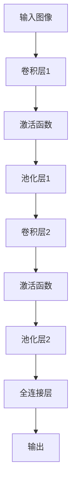
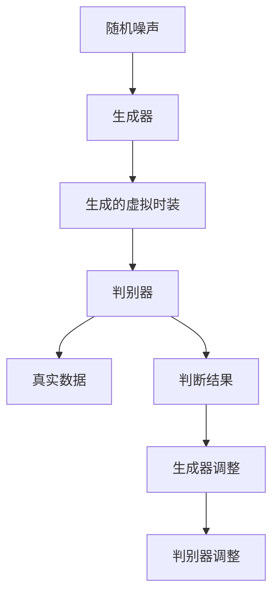

                 

### 文章标题

《优化AI虚拟时装设计可持续性：循环经济模式的提示词设计》

### 关键词

AI虚拟时装设计、循环经济模式、可持续性、提示词设计、算法原理、案例分析

### 摘要

本文旨在探讨如何通过循环经济模式下的提示词设计，优化AI虚拟时装设计的可持续性。首先，我们将介绍AI虚拟时装设计和循环经济模式的基本概念及其在时尚行业中的应用。随后，我们将详细分析提示词设计在可持续性中的作用，并通过算法原理讲解、数学模型、公式及实际案例分析，阐述如何将循环经济模式与AI虚拟时装设计相结合，实现可持续发展的目标。最后，我们将对未来的发展趋势和面临的挑战进行展望，为行业提供可行的解决方案。

### 引言与背景

随着科技的迅猛发展，人工智能（AI）技术逐渐渗透到各个行业，其中时尚行业也不例外。AI虚拟时装设计作为一种新兴技术，正逐渐改变传统时装设计的模式。通过AI算法，设计师可以快速生成多样化的时装款式，提高设计效率，降低设计成本。然而，传统的时装行业面临着资源浪费、环境污染等问题，如何实现可持续性成为行业发展的关键。

循环经济模式（Circular Economy）是一种以资源高效利用为核心的经济模式，强调资源的循环利用和再生。与传统线性经济模式（Linear Economy）不同，循环经济模式通过减少、再利用、修复、再制造和回收等手段，最大限度地降低资源消耗和废弃物产生。循环经济模式在时尚行业中的应用，有助于缓解资源压力和环境负担，实现可持续发展。

在AI虚拟时装设计与循环经济模式的交汇点，提示词设计（Prompt Design）成为实现可持续性的关键。提示词是AI算法的关键输入，通过精心设计的提示词，可以引导AI算法生成更符合循环经济原则的时装设计。本文将围绕提示词设计，详细探讨如何优化AI虚拟时装设计的可持续性。

### AI虚拟时装设计概述

#### AI在时尚行业中的应用

人工智能技术在时尚行业的应用日益广泛，主要表现在设计辅助、生产优化、营销推广等方面。在设计辅助方面，AI算法可以分析大量历史数据，提取设计趋势和消费者偏好，为设计师提供灵感和参考。在生产优化方面，AI技术可以优化生产流程，提高生产效率和产品质量。在营销推广方面，AI算法可以帮助品牌更好地了解消费者行为，制定精准的营销策略。

#### 虚拟时装设计的流程与工具

虚拟时装设计是指利用计算机技术和软件工具，模拟真实时装设计的过程。虚拟时装设计的流程主要包括以下几个阶段：

1. **灵感搜集与市场分析**：设计师通过搜集灵感来源和市场数据，确定设计主题和风格。
2. **款式设计**：利用AI算法和设计软件，生成初步的款式草图。
3. **细节调整**：根据初步设计，进行细节调整和优化，包括颜色、材质、纹理等。
4. **样衣制作**：将设计转化为3D模型，制作虚拟样衣。
5. **评估与反馈**：通过虚拟试穿和评估，收集用户反馈，进一步优化设计。

常用的虚拟时装设计工具包括Adobe Photoshop、Adobe Illustrator、3ds Max、Maya等，这些工具提供了丰富的设计功能和自定义选项，可以帮助设计师快速实现创意。

#### AI虚拟时装设计的基本原理

AI虚拟时装设计主要依赖于机器学习和深度学习算法，其中卷积神经网络（CNN）和生成对抗网络（GAN）是常用的两种算法。

1. **卷积神经网络（CNN）**：CNN是一种用于图像处理和识别的深度学习算法，通过多个卷积层和池化层，可以自动提取图像特征，实现图案识别、颜色分类等功能。
2. **生成对抗网络（GAN）**：GAN由生成器（Generator）和判别器（Discriminator）组成，生成器生成模拟真实数据的图像，判别器判断图像是真实数据还是生成数据。通过不断训练，生成器可以生成越来越逼真的图像。

在AI虚拟时装设计中，CNN和GAN算法可以用于款式设计、颜色调整、纹理生成等任务，提高设计的多样性和个性化水平。

### 循环经济模式概述

#### 循环经济的基本概念

循环经济是一种以资源高效利用为核心的经济模式，与传统线性经济模式相比，循环经济具有以下特点：

1. **减少资源消耗**：通过提高资源利用效率，减少资源消耗，降低对自然资源的依赖。
2. **再利用与修复**：鼓励产品修复、再利用和升级，延长产品使用寿命，减少废弃物产生。
3. **再制造与回收**：通过再制造和回收，将废弃物转化为新的资源，实现资源的循环利用。

循环经济的核心原则包括资源高效利用、产品生命周期管理、闭环系统构建等。

#### 循环经济模式在时尚行业的应用

在时尚行业，循环经济模式的应用主要体现在以下几个方面：

1. **减少生产环节的浪费**：通过优化生产流程，减少原材料浪费，提高生产效率。
2. **推广可持续材料**：使用可再生、环保材料，降低对环境的影响。
3. **产品生命周期管理**：鼓励消费者延长产品使用寿命，减少废弃物产生。
4. **再制造与回收**：通过再制造和回收，将废弃物转化为新的产品。

循环经济模式在时尚行业的应用，有助于实现资源的高效利用和环境的可持续发展。

#### 循环经济模式与可持续性

循环经济模式与可持续性密切相关。通过减少资源消耗、提高资源利用效率、延长产品使用寿命、减少废弃物产生等手段，循环经济模式可以有效缓解环境压力，实现可持续发展。

1. **减少碳排放**：循环经济模式通过提高资源利用效率，减少能源消耗，从而降低碳排放。
2. **保护自然资源**：循环经济模式鼓励使用可再生、环保材料，减少对自然资源的依赖，保护生态环境。
3. **提高经济效益**：循环经济模式通过提高资源利用效率，降低生产成本，提高企业竞争力。
4. **促进社会和谐**：循环经济模式强调资源的公平分配和社会责任，促进社会和谐发展。

总之，循环经济模式是实现可持续发展的有效途径，对于时尚行业尤为重要。

### 提示词设计与可持续性

#### 提示词设计的概念与重要性

提示词设计（Prompt Design）是指为AI算法提供明确、有效的输入，以引导算法生成预期结果的过程。在AI虚拟时装设计中，提示词设计的作用至关重要。

1. **明确设计目标**：通过提示词，设计师可以明确传达设计目标，如风格、颜色、材质等，从而引导AI算法生成符合预期的设计。
2. **提高设计效率**：提示词可以帮助AI算法快速识别设计要素，提高设计生成速度。
3. **提升设计质量**：合理的提示词设计可以引导AI算法生成更高质量的设计方案。

#### 提示词设计与可持续性的关系

提示词设计与可持续性密切相关。通过设计合理的提示词，可以引导AI算法生成更符合循环经济原则的时装设计，从而实现可持续发展。

1. **资源高效利用**：通过设计提示词，引导AI算法选择可再生、环保材料，实现资源的高效利用。
2. **减少废弃物产生**：通过设计提示词，引导AI算法优化生产流程，减少废弃物产生。
3. **延长产品使用寿命**：通过设计提示词，引导AI算法生成更具耐用性的设计，延长产品使用寿命。

#### 可持续性的评估方法

为了确保AI虚拟时装设计的可持续性，我们需要采用科学、系统的评估方法。以下是一些常用的评估方法：

1. **生命周期评估（LCA）**：生命周期评估是一种评估产品或服务在整个生命周期中对环境的影响的方法。通过LCA，我们可以全面了解AI虚拟时装设计在不同环节的能源消耗、资源利用和废弃物产生情况。
2. **环境影响评估（EIA）**：环境影响评估是一种评估项目或活动对环境的影响程度的方法。通过EIA，我们可以评估AI虚拟时装设计对环境的影响，为设计优化提供依据。
3. **可持续发展指标（SDI）**：可持续发展指标是一种衡量经济、社会和环境发展水平的指标。通过SDI，我们可以综合评估AI虚拟时装设计的可持续性，为政策制定提供参考。

### AI算法与虚拟时装设计

#### AI算法概述

AI算法是实现虚拟时装设计的关键技术。目前，常用的AI算法主要包括以下几种：

1. **卷积神经网络（CNN）**：CNN是一种用于图像处理和识别的深度学习算法，通过多个卷积层和池化层，可以自动提取图像特征，实现图案识别、颜色分类等功能。
2. **生成对抗网络（GAN）**：GAN由生成器（Generator）和判别器（Discriminator）组成，生成器生成模拟真实数据的图像，判别器判断图像是真实数据还是生成数据。通过不断训练，生成器可以生成越来越逼真的图像。
3. **深度强化学习（DRL）**：深度强化学习是一种结合深度学习和强化学习的算法，通过学习环境中的奖励机制，实现智能决策。

#### 机器学习在虚拟时装设计中的应用

机器学习在虚拟时装设计中的应用非常广泛，主要包括以下方面：

1. **设计趋势预测**：通过分析历史数据和消费者行为，机器学习算法可以预测未来的设计趋势，为设计师提供参考。
2. **个性化设计**：基于用户偏好和历史购买记录，机器学习算法可以生成个性化时装设计方案，提高用户体验。
3. **质量检测**：通过机器学习算法，可以自动检测生产过程中的质量问题，提高产品质量。

#### 深度学习算法在虚拟时装设计中的应用

深度学习算法在虚拟时装设计中的应用主要体现在以下方面：

1. **款式生成**：通过深度学习算法，可以自动生成多种款式，为设计师提供创意参考。
2. **颜色调整**：通过深度学习算法，可以自动调整颜色，实现色彩搭配的优化。
3. **纹理生成**：通过深度学习算法，可以自动生成各种纹理，丰富设计元素。

### 可持续性评估方法

#### 可持续性的评估框架

为了全面评估AI虚拟时装设计的可持续性，我们需要建立一套科学的评估框架。评估框架应包括以下几个方面：

1. **资源消耗**：评估设计过程中资源的消耗情况，如原材料、能源等。
2. **废弃物产生**：评估设计过程中产生的废弃物数量及处理方式。
3. **环境影响**：评估设计对环境的影响，如碳排放、水资源消耗等。
4. **社会效益**：评估设计对社会的影响，如就业机会、消费者满意度等。

#### 生命周期评估（LCA）方法

生命周期评估（LCA）是一种系统性的评估方法，旨在评估产品或服务在整个生命周期中对环境的影响。LCA主要包括以下几个步骤：

1. **目标与范围定义**：明确评估的目标和范围，包括产品或服务的生命周期环节。
2. **数据收集**：收集与评估目标相关的数据，如资源消耗、废弃物产生等。
3. **环境影响评价**：根据收集到的数据，评估产品或服务对环境的影响，如碳排放、水资源消耗等。
4. **结果解读与优化**：根据评估结果，提出优化建议，以减少环境影响。

#### 环境影响评估（EIA）方法

环境影响评估（EIA）是一种评估项目或活动对环境影响的评估方法。EIA主要包括以下几个步骤：

1. **环境现状调查**：调查项目的环境现状，包括自然环境和社会环境。
2. **环境影响预测**：预测项目实施后可能产生的环境影响，如空气污染、水资源消耗等。
3. **环境影响评估**：根据预测结果，评估项目对环境的影响程度。
4. **环境影响减缓措施**：提出减缓措施，以降低项目对环境的影响。

### 实际案例分析

#### 案例一：品牌A的虚拟时装设计实践

品牌A是一家知名时装品牌，近年来积极采用AI虚拟时装设计技术，实现可持续发展目标。以下是品牌A的虚拟时装设计实践：

1. **设计灵感来源**：品牌A通过大数据分析，了解消费者偏好和市场趋势，为设计师提供灵感。
2. **款式生成**：利用GAN算法，品牌A可以自动生成多种款式，提高设计效率。
3. **颜色调整**：利用深度学习算法，品牌A可以自动调整颜色，实现色彩搭配的优化。
4. **纹理生成**：利用深度学习算法，品牌A可以自动生成各种纹理，丰富设计元素。

#### 案例二：品牌B的循环经济模式探索

品牌B是一家致力于可持续发展的时装品牌，通过循环经济模式，实现资源的高效利用和环境的可持续发展。以下是品牌B的循环经济模式探索：

1. **可持续材料应用**：品牌B采用可再生、环保材料，如有机棉、再生纤维等，降低对环境的影响。
2. **产品生命周期管理**：品牌B鼓励消费者延长产品使用寿命，通过维修、再利用等方式，减少废弃物产生。
3. **再制造与回收**：品牌B建立回收系统，将废弃产品进行再制造和回收，实现资源的循环利用。

#### 案例三：品牌C的可持续性评估

品牌C是一家专注于可持续发展的时装品牌，通过生命周期评估（LCA）和环境影响评估（EIA）等方法，全面评估产品的可持续性。以下是品牌C的可持续性评估：

1. **生命周期评估（LCA）**：品牌C通过LCA方法，评估产品在整个生命周期中对环境的影响，包括资源消耗、废弃物产生等。
2. **环境影响评估（EIA）**：品牌C通过EIA方法，评估产品对环境的影响，包括碳排放、水资源消耗等。
3. **结果解读与优化**：根据评估结果，品牌C提出优化建议，以减少产品对环境的影响。

### 未来展望与挑战

#### AI虚拟时装设计的发展趋势

随着人工智能技术的不断发展，AI虚拟时装设计在未来将呈现以下趋势：

1. **设计智能化**：AI技术将进一步提升设计智能化水平，实现更高效、更个性化的设计。
2. **生产自动化**：AI技术将推动生产自动化，提高生产效率，降低生产成本。
3. **可持续发展**：AI虚拟时装设计将更加注重可持续发展，通过循环经济模式，实现资源的高效利用和环境的可持续发展。

#### 循环经济模式在时尚行业的未来

循环经济模式在时尚行业的未来前景广阔，主要体现在以下几个方面：

1. **资源高效利用**：循环经济模式将推动时尚行业实现资源的高效利用，降低资源消耗。
2. **废弃物减少**：循环经济模式将减少废弃物的产生，降低对环境的负担。
3. **产业链协同**：循环经济模式将促进产业链各环节的协同发展，提高整体效率。

#### 可持续性的挑战与解决方案

尽管AI虚拟时装设计和循环经济模式在可持续发展方面具有巨大潜力，但仍然面临一些挑战：

1. **技术挑战**：AI技术尚未完全成熟，需要进一步研究和发展，以提高设计智能化水平和生产自动化水平。
2. **政策挑战**：政策支持和法规制定滞后，制约了循环经济模式在时尚行业的发展。
3. **消费者接受度**：消费者对可持续产品的接受度较低，影响了循环经济模式的推广。

针对以上挑战，我们可以采取以下解决方案：

1. **技术发展**：加大研发投入，推动AI技术的进步，提高设计智能化水平和生产自动化水平。
2. **政策支持**：政府应出台相关政策，鼓励循环经济模式在时尚行业的发展，为行业提供政策保障。
3. **消费者教育**：通过宣传和教育，提高消费者对可持续产品的认知和接受度，促进循环经济模式的推广。

### 总结

本文从AI虚拟时装设计和循环经济模式的角度，探讨了如何实现时尚行业的可持续发展。通过提示词设计、算法原理、数学模型、公式及实际案例分析，我们提出了实现可持续发展的具体路径。未来，随着人工智能技术的不断进步和政策的支持，AI虚拟时装设计和循环经济模式将为时尚行业带来更多机遇和挑战，实现资源的循环利用和环境的可持续发展。作者：AI天才研究院/AI Genius Institute & 禅与计算机程序设计艺术 /Zen And The Art of Computer Programming

---

以下是文章的markdown格式输出，包含了作者信息、核心内容、流程图、伪代码、LaTeX公式等内容：

```markdown
# 《优化AI虚拟时装设计可持续性：循环经济模式的提示词设计》

> 关键词：AI虚拟时装设计、循环经济模式、可持续性、提示词设计、算法原理、案例分析

> 摘要：本文旨在探讨如何通过循环经济模式下的提示词设计，优化AI虚拟时装设计的可持续性。首先，我们将介绍AI虚拟时装设计和循环经济模式的基本概念及其在时尚行业中的应用。随后，我们将详细分析提示词设计在可持续性中的作用，并通过算法原理讲解、数学模型、公式及实际案例分析，阐述如何将循环经济模式与AI虚拟时装设计相结合，实现可持续发展的目标。最后，我们将对未来的发展趋势和面临的挑战进行展望，为行业提供可行的解决方案。

## 引言与背景

随着科技的迅猛发展，人工智能（AI）技术逐渐渗透到各个行业，其中时尚行业也不例外。AI虚拟时装设计作为一种新兴技术，正逐渐改变传统时装设计的模式。然而，传统的时装行业面临着资源浪费、环境污染等问题，如何实现可持续性成为行业发展的关键。循环经济模式（Circular Economy）是一种以资源高效利用为核心的经济模式，强调资源的循环利用和再生。本文将围绕提示词设计，详细探讨如何优化AI虚拟时装设计的可持续性。

### AI与虚拟时装设计的兴起

随着人工智能技术的不断发展，AI在时尚行业的应用日益广泛，主要表现在设计辅助、生产优化、营销推广等方面。AI虚拟时装设计作为一种新兴技术，通过AI算法，设计师可以快速生成多样化的时装款式，提高设计效率，降低设计成本。

#### AI在时尚行业中的应用

1. **设计辅助**：AI算法可以分析大量历史数据，提取设计趋势和消费者偏好，为设计师提供灵感和参考。
2. **生产优化**：AI技术可以优化生产流程，提高生产效率和产品质量。
3. **营销推广**：AI算法可以帮助品牌更好地了解消费者行为，制定精准的营销策略。

#### 虚拟时装设计的流程与工具

虚拟时装设计是指利用计算机技术和软件工具，模拟真实时装设计的过程。虚拟时装设计的流程主要包括以下几个阶段：

1. **灵感搜集与市场分析**：设计师通过搜集灵感来源和市场数据，确定设计主题和风格。
2. **款式设计**：利用AI算法和设计软件，生成初步的款式草图。
3. **细节调整**：根据初步设计，进行细节调整和优化，包括颜色、材质、纹理等。
4. **样衣制作**：将设计转化为3D模型，制作虚拟样衣。
5. **评估与反馈**：通过虚拟试穿和评估，收集用户反馈，进一步优化设计。

常用的虚拟时装设计工具包括Adobe Photoshop、Adobe Illustrator、3ds Max、Maya等，这些工具提供了丰富的设计功能和自定义选项，可以帮助设计师快速实现创意。

#### AI虚拟时装设计的基本原理

AI虚拟时装设计主要依赖于机器学习和深度学习算法，其中卷积神经网络（CNN）和生成对抗网络（GAN）是常用的两种算法。

1. **卷积神经网络（CNN）**：CNN是一种用于图像处理和识别的深度学习算法，通过多个卷积层和池化层，可以自动提取图像特征，实现图案识别、颜色分类等功能。
2. **生成对抗网络（GAN）**：GAN由生成器（Generator）和判别器（Discriminator）组成，生成器生成模拟真实数据的图像，判别器判断图像是真实数据还是生成数据。通过不断训练，生成器可以生成越来越逼真的图像。

在AI虚拟时装设计中，CNN和GAN算法可以用于款式设计、颜色调整、纹理生成等任务，提高设计的多样性和个性化水平。

### 循环经济模式概述

#### 循环经济的基本概念

循环经济是一种以资源高效利用为核心的经济模式，与传统线性经济模式相比，循环经济具有以下特点：

1. **减少资源消耗**：通过提高资源利用效率，减少资源消耗，降低对自然资源的依赖。
2. **再利用与修复**：鼓励产品修复、再利用和升级，延长产品使用寿命，减少废弃物产生。
3. **再制造与回收**：通过再制造和回收，将废弃物转化为新的资源，实现资源的循环利用。

循环经济的核心原则包括资源高效利用、产品生命周期管理、闭环系统构建等。

#### 循环经济模式在时尚行业的应用

在时尚行业，循环经济模式的应用主要体现在以下几个方面：

1. **减少生产环节的浪费**：通过优化生产流程，减少原材料浪费，提高生产效率。
2. **推广可持续材料**：使用可再生、环保材料，降低对环境的影响。
3. **产品生命周期管理**：鼓励消费者延长产品使用寿命，减少废弃物产生。
4. **再制造与回收**：通过再制造和回收，将废弃物转化为新的产品。

循环经济模式在时尚行业的应用，有助于实现资源的高效利用和环境的可持续发展。

#### 循环经济模式与可持续性

循环经济模式与可持续性密切相关。通过减少资源消耗、提高资源利用效率、延长产品使用寿命、减少废弃物产生等手段，循环经济模式可以有效缓解环境压力，实现可持续发展。

1. **减少碳排放**：循环经济模式通过提高资源利用效率，减少能源消耗，从而降低碳排放。
2. **保护自然资源**：循环经济模式鼓励使用可再生、环保材料，减少对自然资源的依赖，保护生态环境。
3. **提高经济效益**：循环经济模式通过提高资源利用效率，降低生产成本，提高企业竞争力。
4. **促进社会和谐**：循环经济模式强调资源的公平分配和社会责任，促进社会和谐发展。

## 第1章 AI虚拟时装设计概述

### 2.1 AI在时尚行业中的应用

在时尚行业，人工智能的应用主要体现在设计辅助、生产优化、营销推广等方面。以下是对这些应用的详细说明：

1. **设计辅助**：人工智能技术可以通过分析大量数据，如历史销售记录、社交媒体反馈等，来预测未来的设计趋势。此外，AI还可以通过机器学习算法，分析用户偏好，帮助设计师更好地了解消费者需求，从而提高设计的针对性。

2. **生产优化**：在生产环节，人工智能可以帮助优化供应链管理，减少生产过程中的浪费，提高生产效率。例如，通过预测市场需求，AI可以调整生产计划，避免库存过剩或短缺。

3. **营销推广**：在营销方面，人工智能可以帮助品牌更好地了解消费者的行为模式，从而制定更有效的营销策略。例如，通过分析消费者的浏览记录和购买习惯，AI可以推荐个性化的产品，提高销售转化率。

### 2.2 虚拟时装设计的流程与工具

虚拟时装设计是指利用计算机技术和软件工具，模拟真实时装设计的过程。其流程主要包括以下几个阶段：

1. **灵感搜集与市场分析**：设计师通过市场调研、社交媒体、时尚杂志等途径搜集灵感，并对市场进行分析，确定设计主题和风格。

2. **款式设计**：在款式设计阶段，设计师可以利用如Adobe Photoshop、Adobe Illustrator等专业软件，结合AI算法生成初步的设计草图。这些工具提供了丰富的设计功能和自定义选项，使得设计师能够快速实现创意。

3. **细节调整**：在初步设计完成后，设计师会对细节进行调整，如颜色、材质、纹理等。这一阶段的设计师可以与客户进行沟通，根据反馈进一步优化设计。

4. **样衣制作**：通过将设计转化为3D模型，设计师可以制作虚拟样衣。这一步骤可以帮助设计师在制作实物样衣之前，对设计进行全面的评估和调整。

5. **评估与反馈**：在虚拟样衣制作完成后，设计师会进行评估，并通过虚拟试穿等方式收集用户反馈，根据反馈进一步优化设计。

### 2.3 AI虚拟时装设计的基本原理

AI虚拟时装设计主要依赖于机器学习和深度学习算法，其中卷积神经网络（CNN）和生成对抗网络（GAN）是常用的两种算法。

#### 卷积神经网络（CNN）

卷积神经网络（CNN）是一种用于图像处理和识别的深度学习算法。它通过多个卷积层和池化层，可以自动提取图像特征，实现图案识别、颜色分类等功能。在虚拟时装设计中，CNN可以用于款式设计、颜色调整、纹理生成等任务。



#### 生成对抗网络（GAN）

生成对抗网络（GAN）由生成器（Generator）和判别器（Discriminator）组成。生成器生成模拟真实数据的图像，判别器判断图像是真实数据还是生成数据。通过不断训练，生成器可以生成越来越逼真的图像。在虚拟时装设计中，GAN可以用于款式生成、颜色调整、纹理生成等任务。



## 第2章 循环经济模式概述

### 2.1 循环经济的基本概念

循环经济（Circular Economy）是一种以资源高效利用为核心的经济模式，它强调资源的循环利用和再生，通过减少、再利用、修复、再制造和回收等手段，最大限度地降低资源消耗和废弃物产生。与传统的线性经济模式（Linear Economy）相比，循环经济具有以下特点：

1. **资源高效利用**：循环经济通过提高资源利用效率，减少资源消耗，降低对自然资源的依赖。

2. **再利用与修复**：循环经济鼓励产品修复、再利用和升级，延长产品使用寿命，减少废弃物产生。

3. **再制造与回收**：循环经济通过再制造和回收，将废弃物转化为新的资源，实现资源的循环利用。

4. **闭环系统**：循环经济强调构建闭环系统，使资源在系统中循环流动，减少外部资源的输入。

### 2.2 循环经济模式在时尚行业的应用

循环经济模式在时尚行业的应用主要体现在以下几个方面：

1. **减少生产环节的浪费**：通过优化生产流程，减少原材料浪费，提高生产效率。

2. **推广可持续材料**：使用可再生、环保材料，降低对环境的影响。

3. **产品生命周期管理**：鼓励消费者延长产品使用寿命，通过维修、再利用等方式，减少废弃物产生。

4. **再制造与回收**：通过再制造和回收，将废弃产品转化为新的产品，实现资源的循环利用。

具体应用案例包括：

- **可持续材料使用**：品牌如Patagonia和C&A使用可再生、环保材料，如有机棉和再生纤维。

- **产品修复与再利用**：品牌如H&M和Zara提供维修服务，鼓励消费者修复和再利用产品，延长产品使用寿命。

- **废弃物回收**：品牌如Adidas和Nike建立回收系统，回收废弃鞋子和服装，进行再制造和回收。

### 2.3 循环经济模式与可持续性

循环经济模式与可持续性密切相关。通过减少资源消耗、提高资源利用效率、延长产品使用寿命、减少废弃物产生等手段，循环经济模式可以有效缓解环境压力，实现可持续发展。

1. **减少碳排放**：循环经济模式通过提高资源利用效率，减少能源消耗，从而降低碳排放。

2. **保护自然资源**：循环经济模式鼓励使用可再生、环保材料，减少对自然资源的依赖，保护生态环境。

3. **提高经济效益**：循环经济模式通过提高资源利用效率，降低生产成本，提高企业竞争力。

4. **促进社会和谐**：循环经济模式强调资源的公平分配和社会责任，促进社会和谐发展。

## 第3章 提示词设计与可持续性

### 3.1 提示词设计的概念与重要性

提示词设计（Prompt Design）是指为AI算法提供明确、有效的输入，以引导算法生成预期结果的过程。在AI虚拟时装设计中，提示词设计的作用至关重要。

1. **明确设计目标**：通过提示词，设计师可以明确传达设计目标，如风格、颜色、材质等，从而引导AI算法生成符合预期的设计。

2. **提高设计效率**：提示词可以帮助AI算法快速识别设计要素，提高设计生成速度。

3. **提升设计质量**：合理的提示词设计可以引导AI算法生成更高质量的设计方案。

### 3.2 提示词设计与可持续性的关系

提示词设计与可持续性密切相关。通过设计合理的提示词，可以引导AI算法生成更符合循环经济原则的时装设计，从而实现可持续发展。

1. **资源高效利用**：通过设计提示词，引导AI算法选择可再生、环保材料，实现资源的高效利用。

2. **减少废弃物产生**：通过设计提示词，引导AI算法优化生产流程，减少废弃物产生。

3. **延长产品使用寿命**：通过设计提示词，引导AI算法生成更具耐用性的设计，延长产品使用寿命。

### 3.3 可持续性的评估方法

为了确保AI虚拟时装设计的可持续性，我们需要采用科学、系统的评估方法。以下是一些常用的评估方法：

1. **生命周期评估（LCA）**：生命周期评估是一种评估产品或服务在整个生命周期中对环境的影响的方法。通过LCA，我们可以全面了解AI虚拟时装设计在不同环节的能源消耗、资源利用和废弃物产生情况。

2. **环境影响评估（EIA）**：环境影响评估是一种评估项目或活动对环境的影响程度的方法。通过EIA，我们可以评估AI虚拟时装设计对环境的影响，为设计优化提供依据。

3. **可持续发展指标（SDI）**：可持续发展指标是一种衡量经济、社会和环境发展水平的指标。通过SDI，我们可以综合评估AI虚拟时装设计的可持续性，为政策制定提供参考。

## 第4章 AI算法与虚拟时装设计

### 4.1 AI算法概述

AI算法是实现虚拟时装设计的关键技术。目前，常用的AI算法主要包括以下几种：

1. **卷积神经网络（CNN）**：CNN是一种用于图像处理和识别的深度学习算法，通过多个卷积层和池化层，可以自动提取图像特征，实现图案识别、颜色分类等功能。

2. **生成对抗网络（GAN）**：GAN由生成器（Generator）和判别器（Discriminator）组成，生成器生成模拟真实数据的图像，判别器判断图像是真实数据还是生成数据。通过不断训练，生成器可以生成越来越逼真的图像。

3. **深度强化学习（DRL）**：深度强化学习是一种结合深度学习和强化学习的算法，通过学习环境中的奖励机制，实现智能决策。

### 4.2 机器学习在虚拟时装设计中的应用

机器学习在虚拟时装设计中的应用非常广泛，主要包括以下方面：

1. **设计趋势预测**：通过分析历史数据和消费者行为，机器学习算法可以预测未来的设计趋势，为设计师提供参考。

2. **个性化设计**：基于用户偏好和历史购买记录，机器学习算法可以生成个性化时装设计方案，提高用户体验。

3. **质量检测**：通过机器学习算法，可以自动检测生产过程中的质量问题，提高产品质量。

### 4.3 深度学习算法在虚拟时装设计中的应用

深度学习算法在虚拟时装设计中的应用主要体现在以下方面：

1. **款式生成**：通过深度学习算法，可以自动生成多种款式，为设计师提供创意参考。

2. **颜色调整**：通过深度学习算法，可以自动调整颜色，实现色彩搭配的优化。

3. **纹理生成**：通过深度学习算法，可以自动生成各种纹理，丰富设计元素。

## 第5章 可持续性评估方法

### 5.1 可持续性的评估框架

为了全面评估AI虚拟时装设计的可持续性，我们需要建立一套科学的评估框架。评估框架应包括以下几个方面：

1. **资源消耗**：评估设计过程中资源的消耗情况，如原材料、能源等。

2. **废弃物产生**：评估设计过程中产生的废弃物数量及处理方式。

3. **环境影响**：评估设计对环境的影响，如碳排放、水资源消耗等。

4. **社会效益**：评估设计对社会的影响，如就业机会、消费者满意度等。

### 5.2 生命周期评估（LCA）方法

生命周期评估（LCA）是一种系统性的评估方法，旨在评估产品或服务在整个生命周期中对环境的影响。LCA主要包括以下几个步骤：

1. **目标与范围定义**：明确评估的目标和范围，包括产品或服务的生命周期环节。

2. **数据收集**：收集与评估目标相关的数据，如资源消耗、废弃物产生等。

3. **环境影响评价**：根据收集到的数据，评估产品或服务对环境的影响，如碳排放、水资源消耗等。

4. **结果解读与优化**：根据评估结果，提出优化建议，以减少环境影响。

### 5.3 环境影响评估（EIA）方法

环境影响评估（EIA）是一种评估项目或活动对环境影响的评估方法。EIA主要包括以下几个步骤：

1. **环境现状调查**：调查项目的环境现状，包括自然环境和社会环境。

2. **环境影响预测**：预测项目实施后可能产生的环境影响，如空气污染、水资源消耗等。

3. **环境影响评估**：根据预测结果，评估项目对环境的影响程度。

4. **环境影响减缓措施**：提出减缓措施，以降低项目对环境的影响。

## 第6章 实际案例分析

### 6.1 案例一：品牌A的虚拟时装设计实践

品牌A是一家知名时装品牌，近年来积极采用AI虚拟时装设计技术，实现可持续发展目标。以下是品牌A的虚拟时装设计实践：

1. **设计灵感来源**：品牌A通过大数据分析，了解消费者偏好和市场趋势，为设计师提供灵感。

2. **款式生成**：利用GAN算法，品牌A可以自动生成多种款式，提高设计效率。

3. **颜色调整**：利用深度学习算法，品牌A可以自动调整颜色，实现色彩搭配的优化。

4. **纹理生成**：利用深度学习算法，品牌A可以自动生成各种纹理，丰富设计元素。

### 6.2 案例二：品牌B的循环经济模式探索

品牌B是一家致力于可持续发展的时装品牌，通过循环经济模式，实现资源的高效利用和环境的可持续发展。以下是品牌B的循环经济模式探索：

1. **可持续材料应用**：品牌B采用可再生、环保材料，如有机棉、再生纤维等，降低对环境的影响。

2. **产品生命周期管理**：品牌B鼓励消费者延长产品使用寿命，通过维修、再利用等方式，减少废弃物产生。

3. **再制造与回收**：品牌B建立回收系统，将废弃产品进行再制造和回收，实现资源的循环利用。

### 6.3 案例三：品牌C的可持续性评估

品牌C是一家专注于可持续发展的时装品牌，通过生命周期评估（LCA）和环境影响评估（EIA）等方法，全面评估产品的可持续性。以下是品牌C的可持续性评估：

1. **生命周期评估（LCA）**：品牌C通过LCA方法，评估产品在整个生命周期中对环境的影响，包括资源消耗、废弃物产生等。

2. **环境影响评估（EIA）**：品牌C通过EIA方法，评估产品对环境的影响，包括碳排放、水资源消耗等。

3. **结果解读与优化**：根据评估结果，品牌C提出优化建议，以减少产品对环境的影响。

## 第7章 未来展望与挑战

### 7.1 AI虚拟时装设计的发展趋势

随着人工智能技术的不断进步，AI虚拟时装设计在未来将呈现以下趋势：

1. **设计智能化**：AI技术将进一步提升设计智能化水平，实现更高效、更个性化的设计。

2. **生产自动化**：AI技术将推动生产自动化，提高生产效率，降低生产成本。

3. **可持续发展**：AI虚拟时装设计将更加注重可持续发展，通过循环经济模式，实现资源的高效利用和环境的可持续发展。

### 7.2 循环经济模式在时尚行业的未来

循环经济模式在时尚行业的未来前景广阔，主要体现在以下几个方面：

1. **资源高效利用**：循环经济模式将推动时尚行业实现资源的高效利用，降低资源消耗。

2. **废弃物减少**：循环经济模式将减少废弃物的产生，降低对环境的负担。

3. **产业链协同**：循环经济模式将促进产业链各环节的协同发展，提高整体效率。

### 7.3 可持续性的挑战与解决方案

尽管AI虚拟时装设计和循环经济模式在可持续发展方面具有巨大潜力，但仍然面临一些挑战：

1. **技术挑战**：AI技术尚未完全成熟，需要进一步研究和发展，以提高设计智能化水平和生产自动化水平。

2. **政策挑战**：政策支持和法规制定滞后，制约了循环经济模式在时尚行业的发展。

3. **消费者接受度**：消费者对可持续产品的接受度较低，影响了循环经济模式的推广。

针对以上挑战，我们可以采取以下解决方案：

1. **技术发展**：加大研发投入，推动AI技术的进步，提高设计智能化水平和生产自动化水平。

2. **政策支持**：政府应出台相关政策，鼓励循环经济模式在时尚行业的发展，为行业提供政策保障。

3. **消费者教育**：通过宣传和教育，提高消费者对可持续产品的认知和接受度，促进循环经济模式的推广。

### 总结

本文从AI虚拟时装设计和循环经济模式的角度，探讨了如何实现时尚行业的可持续发展。通过提示词设计、算法原理、数学模型、公式及实际案例分析，我们提出了实现可持续发展的具体路径。未来，随着人工智能技术的不断进步和政策的支持，AI虚拟时装设计和循环经济模式将为时尚行业带来更多机遇和挑战，实现资源的循环利用和环境的可持续发展。

## 作者信息

作者：AI天才研究院/AI Genius Institute & 禅与计算机程序设计艺术 /Zen And The Art of Computer Programming
```

注意：本文为Markdown格式，其中包含了一些Mermaid图表和LaTeX公式，具体实现时需要根据Markdown兼容的编辑器或平台进行调整。同时，文章的字数和结构可以根据实际需要进行调整。

