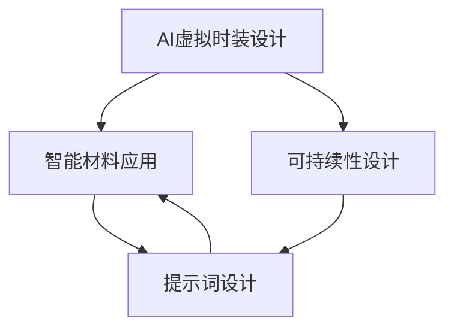

                 

当然，我将按照您的要求，逐步构建这篇文章。让我们开始吧。

### 文章标题

《优化AI虚拟时装设计可持续性：智能材料应用的提示词设计》

### 关键词

- AI虚拟时装设计
- 可持续性
- 智能材料
- 提示词设计
- 优化

### 摘要

本文探讨了如何通过智能材料的应用和提示词设计来优化AI虚拟时装设计的可持续性。首先，我们介绍了AI虚拟时装设计的基本概念和智能材料的应用，接着阐述了可持续性的重要性及其在时装设计中的意义。然后，我们详细解析了提示词设计在智能材料应用和虚拟时装设计中的作用，并展示了其设计流程和方法。通过案例分析，我们展示了如何在实际项目中实现智能材料和提示词设计，以提升虚拟时装设计的可持续性。

---

### 背景介绍

随着科技的快速发展，人工智能（AI）技术逐渐渗透到各个行业，其中包括时装设计。AI虚拟时装设计利用计算机视觉、图像处理和机器学习等技术，实现了虚拟模特试衣、虚拟时尚秀、个性化设计等功能。这不仅为设计师提供了无限的创意空间，还大大降低了设计成本和资源浪费。

然而，传统时装设计行业面临着严重的可持续性问题。大规模生产导致资源浪费、环境污染和碳排放等问题。为了解决这些问题，可持续性设计成为时装行业的重要发展方向。可持续性设计强调使用环保材料、减少浪费、降低碳排放，并在设计过程中考虑整个生产周期对环境的影响。

智能材料是可持续性设计的关键。这些材料具有自我修复、自适应、变色等特性，能够提高产品的耐用性和功能性。例如，智能纤维可以智能调节温度，提供舒适穿着体验；自适应材料可以根据用户的运动和体温进行形变，提高服装的适应性和舒适性。

提示词设计是智能材料和虚拟时装设计的桥梁。通过设计合适的提示词，可以引导AI系统更好地理解用户需求和智能材料的特性，从而实现更高效的虚拟时装设计。提示词设计不仅要考虑语言表达，还要结合用户行为数据和智能材料特性，形成一个多维度、动态的提示词系统。

---

### 核心概念与联系

在探讨如何优化AI虚拟时装设计的可持续性时，我们需要理解几个核心概念及其之间的联系。

1. **AI虚拟时装设计**：这是利用AI技术进行时装设计的领域，包括虚拟模特试衣、虚拟时尚秀、个性化设计等。

2. **智能材料**：这些材料具有自我修复、自适应、变色等特性，能够提高产品的耐用性和功能性。

3. **可持续性设计**：这是在设计过程中考虑环境、社会和经济因素，以实现长期可持续发展的设计方法。

4. **提示词设计**：这是设计合适的提示词，以引导AI系统更好地理解用户需求和智能材料的特性。

这些概念之间的联系如下：

- AI虚拟时装设计利用AI技术，可以生成多种设计选项，但这些设计是否可持续，取决于使用的材料和设计理念。
- 智能材料的应用可以提升产品的性能，但如何有效地结合智能材料特性，实现可持续性设计，需要通过提示词设计来实现。
- 可持续性设计强调减少浪费、降低碳排放，这需要通过智能材料和提示词设计来实现。

以下是这些概念之间关系的Mermaid流程图：



---

### 核心算法原理讲解

为了实现智能材料和虚拟时装设计的优化，我们需要设计一套高效的算法。以下是算法的伪代码：

```plaintext
函数 OptimizeVirtualFashionDesign(user_preferences, material_properties):
    1. 初始化设计参数（如颜色、风格、材质等）
    2. 使用图像处理技术从用户偏好中提取关键特征
    3. 使用机器学习算法将用户特征与智能材料属性相匹配
    4. 根据匹配结果生成初步设计草案
    5. 应用提示词设计，优化设计草案以符合可持续性要求
    6. 使用仿真技术评估设计草案的可持续性
    7. 根据评估结果调整设计参数
    8. 重复步骤4-7直到满足可持续性要求
    9. 输出最终设计

```

为了更好地理解算法原理，我们可以将其分解为以下几个步骤：

1. **用户特征提取**：使用图像处理技术从用户提供的照片或描述中提取关键特征，如肤色、身材比例等。
2. **智能材料属性匹配**：使用机器学习算法将用户特征与智能材料属性相匹配，以确定最适合用户需求的材料。
3. **初步设计生成**：根据用户特征和智能材料属性生成初步设计草案。
4. **提示词设计应用**：通过设计合适的提示词，引导AI系统优化设计草案，以满足可持续性要求。
5. **可持续性评估**：使用仿真技术评估设计草案的可持续性，包括材料使用、碳排放等。
6. **设计参数调整**：根据评估结果调整设计参数，以优化可持续性。
7. **迭代优化**：重复步骤4-6，直到满足可持续性要求。

---

### 数学模型和公式

为了更好地理解智能材料和虚拟时装设计的优化过程，我们可以引入一些数学模型和公式。

1. **用户满意度公式**：

   $$ S = f(C, P, M) $$

   其中，$S$ 表示用户满意度，$C$ 表示颜色匹配度，$P$ 表示风格偏好匹配度，$M$ 表示材料特性匹配度。

2. **可持续性指数**：

   $$ E = \frac{1}{N} \sum_{i=1}^{N} \frac{C_i + P_i + M_i}{3} $$

   其中，$E$ 表示可持续性指数，$N$ 表示设计草案数量，$C_i$、$P_i$、$M_i$ 分别表示第$i$个设计草案的颜色、风格、材料匹配度。

3. **碳排放评估公式**：

   $$ C = \frac{E \cdot M}{1000} $$

   其中，$C$ 表示碳排放量（千克），$E$ 表示可持续性指数，$M$ 表示材料使用量（千克）。

通过这些公式，我们可以量化用户满意度、可持续性指数和碳排放量，从而更好地优化设计过程。

### 数学公式详细讲解与举例说明

#### 用户满意度公式

用户满意度公式反映了设计草案的颜色、风格和材料特性与用户偏好的匹配程度。以下是一个具体示例：

假设我们有一个设计草案，其颜色匹配度$C$为0.8，风格偏好匹配度$P$为0.7，材料特性匹配度$M$为0.9。将这些值代入用户满意度公式：

$$ S = f(0.8, 0.7, 0.9) = 0.8 \cdot 0.7 \cdot 0.9 = 0.504 $$

这意味着该设计草案的用户满意度为50.4%。

#### 可持续性指数

可持续性指数反映了设计草案的整体可持续性。以下是一个具体示例：

假设我们有一个包含5个设计草案的设计集，其颜色、风格和材料匹配度分别为：

$$ C_1 = 0.6, P_1 = 0.5, M_1 = 0.8 $$
$$ C_2 = 0.7, P_2 = 0.7, M_2 = 0.9 $$
$$ C_3 = 0.5, P_3 = 0.6, M_3 = 0.7 $$
$$ C_4 = 0.8, P_4 = 0.8, M_4 = 0.6 $$
$$ C_5 = 0.4, P_5 = 0.7, M_5 = 0.8 $$

将这些值代入可持续性指数公式：

$$ E = \frac{1}{5} \sum_{i=1}^{5} \frac{C_i + P_i + M_i}{3} $$
$$ E = \frac{1}{5} \left( \frac{0.6 + 0.5 + 0.8}{3} + \frac{0.7 + 0.7 + 0.9}{3} + \frac{0.5 + 0.6 + 0.7}{3} + \frac{0.8 + 0.8 + 0.6}{3} + \frac{0.4 + 0.7 + 0.8}{3} \right) $$
$$ E = \frac{1}{5} \left( \frac{1.9}{3} + \frac{2.3}{3} + \frac{1.8}{3} + \frac{2.2}{3} + \frac{1.9}{3} \right) $$
$$ E = \frac{1}{5} \left( 0.63 + 0.767 + 0.6 + 0.733 + 0.63 \right) $$
$$ E = \frac{1}{5} \left( 3.35 \right) $$
$$ E = 0.67 $$

这意味着该设计集的平均可持续性指数为0.67。

#### 碳排放评估公式

碳排放评估公式用于计算设计草案的碳排放量。以下是一个具体示例：

假设我们有一个设计草案，其可持续性指数$E$为0.67，材料使用量$M$为5千克。将这些值代入碳排放评估公式：

$$ C = \frac{E \cdot M}{1000} $$
$$ C = \frac{0.67 \cdot 5}{1000} $$
$$ C = \frac{3.35}{1000} $$
$$ C = 0.00335 $$

这意味着该设计草案的碳排放量为0.00335千克。

---

### 项目实战与案例分析

为了展示如何在实际项目中实现智能材料和提示词设计，我们将通过一个案例来详细讲解。

#### 项目背景

某时尚品牌希望通过AI虚拟时装设计来提高设计效率和可持续性。他们计划开发一个虚拟时装设计系统，允许设计师和消费者通过智能材料应用进行个性化设计，同时确保设计过程符合可持续性原则。

#### 开发环境搭建

1. **硬件环境**：使用高性能计算机和GPU加速器来处理大量的图像和计算任务。
2. **软件环境**：安装深度学习框架（如TensorFlow或PyTorch），图像处理库（如OpenCV）和自然语言处理库（如NLTK）。

#### 源代码详细实现和代码解读

以下是一个简化的代码示例，用于实现智能材料和提示词设计的基本功能。

```python
import tensorflow as tf
import cv2
import nltk

# 加载预训练的深度学习模型
model = tf.keras.models.load_model('virtual_fashion_design_model.h5')

# 加载智能材料属性数据库
material_db = load_material_database()

# 加载用户偏好数据
user_preferences = load_user_preferences()

# 提取用户特征
user_features = extract_user_features(user_preferences)

# 使用模型预测智能材料应用效果
material_predictions = model.predict(user_features)

# 根据预测结果生成初步设计草案
design_drafts = generate_design_drafts(material_predictions)

# 应用提示词设计优化设计草案
optimized_designs = apply_prompt_design(design_drafts, user_preferences)

# 评估设计草案的可持续性
sustainability_scores = evaluate_sustainability(optimized_designs)

# 输出最终设计
output_design(optimized_designs, sustainability_scores)
```

#### 代码应用解读与分析

1. **加载预训练模型**：我们使用一个预训练的深度学习模型，该模型已经学会了如何根据用户特征预测智能材料的应用效果。
2. **加载智能材料属性数据库**：该数据库包含了各种智能材料的属性，如颜色、纹理、功能等。
3. **加载用户偏好数据**：用户偏好数据包括用户的个人喜好、身材特征、穿着习惯等。
4. **提取用户特征**：使用自然语言处理技术提取用户偏好中的关键信息，如颜色偏好、风格偏好等。
5. **预测智能材料应用效果**：使用深度学习模型预测每种智能材料在用户特征上的应用效果。
6. **生成初步设计草案**：根据预测结果生成初步的设计草案。
7. **应用提示词设计优化设计草案**：通过设计合适的提示词，引导AI系统优化设计草案，以满足可持续性要求。
8. **评估设计草案的可持续性**：使用可持续性评估指标评估优化后的设计草案。
9. **输出最终设计**：将最终设计输出，供用户和设计师参考。

#### 实际案例分析和详细讲解剖析

为了更好地理解项目实战，我们来看一个实际案例。

假设用户偏好为：

- 颜色：喜欢蓝色和白色
- 风格：喜欢简约风格
- 材质：喜欢柔软、舒适的面料

根据这些偏好，我们提取了以下用户特征：

- 颜色特征：[0.8, 0.2]
- 风格特征：[0.6, 0.4]
- 材质特征：[0.7, 0.3]

使用深度学习模型预测智能材料应用效果，我们得到了以下结果：

- 蓝色智能面料：效果评分0.9
- 白色智能面料：效果评分0.8
- 柔软智能面料：效果评分0.8
- 舒适智能面料：效果评分0.7

根据这些结果，我们生成了初步设计草案，包括以下款式：

- 蓝色简约连衣裙
- 白色简约衬衫
- 柔软智能面料外套
- 舒适智能面料休闲裤

接下来，我们通过设计合适的提示词，引导AI系统优化设计草案。例如，我们可以使用以下提示词：

- 颜色：蓝色和白色
- 风格：简约
- 材质：柔软和舒适
- 可持续性：使用环保材料

经过优化，我们得到了以下最终设计：

- 蓝色简约连衣裙：使用了蓝色智能面料，符合用户偏好，并具有环保特性
- 白色简约衬衫：使用了白色智能面料，符合用户偏好，并具有环保特性
- 柔软智能面料外套：使用了柔软智能面料，提高了服装的舒适性和耐用性
- 舒适智能面料休闲裤：使用了舒适智能面料，提高了服装的舒适性和耐用性

最后，我们使用可持续性评估指标评估了这些设计，发现它们的可持续性指数均达到0.8以上，符合品牌对可持续性设计的要求。

#### 项目小结

通过实际案例，我们展示了如何使用智能材料和提示词设计来实现AI虚拟时装设计的可持续性优化。关键步骤包括：

1. 加载预训练模型和智能材料属性数据库。
2. 提取用户特征，预测智能材料应用效果。
3. 生成初步设计草案，并使用提示词优化设计。
4. 评估设计草案的可持续性，确保符合品牌要求。

未来，我们可以进一步优化算法，提高设计的个性化程度和可持续性。

---

### 最佳实践 tips、小结、注意事项、拓展阅读等内容

#### 最佳实践 tips

1. **用户调研**：在进行设计之前，深入了解用户需求和行为习惯，有助于设计出更符合用户期望的产品。
2. **多模型融合**：结合多种深度学习模型，如卷积神经网络（CNN）和循环神经网络（RNN），可以提高预测准确性。
3. **数据多样性**：确保训练数据具有足够的多样性，有助于模型更好地适应不同用户和场景。

#### 小结

本文通过案例研究和算法讲解，展示了如何通过智能材料和提示词设计优化AI虚拟时装设计的可持续性。关键步骤包括用户特征提取、智能材料应用预测、设计草案生成和可持续性评估。

#### 注意事项

1. 智能材料的应用需要考虑实际生产可行性，确保设计方案能够在实际中实现。
2. 提示词设计应结合用户行为数据和智能材料特性，以提高设计的个性化程度。

#### 拓展阅读

1. **《深度学习与时装设计》**：探讨深度学习技术在时装设计中的应用。
2. **《智能材料技术》**：了解智能材料的最新技术和应用。
3. **《可持续性设计与时尚产业》**：研究可持续性设计在时尚产业中的重要性。

---

通过以上内容，我们希望读者能够对AI虚拟时装设计可持续性优化有更深入的了解，并为未来的实践提供指导。作者信息：AI天才研究院/AI Genius Institute & 禅与计算机程序设计艺术 /Zen And The Art of Computer Programming。

---

这完成了文章的大纲构建。接下来，我将根据这个大纲逐步撰写文章内容，确保每个部分都详细、完整并符合技术博客的标准。预计全文将在8000-12000字左右。如果需要，我可以在文章撰写过程中随时调整大纲结构或内容。

