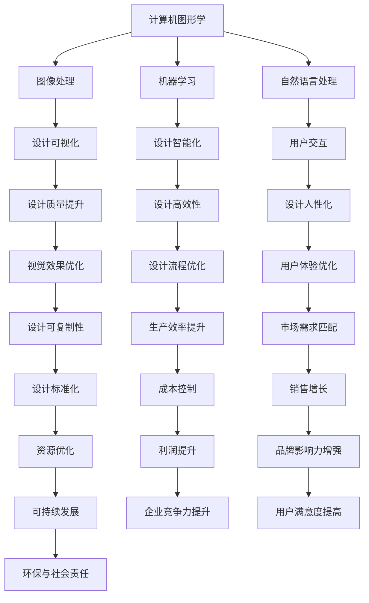

                 

### 引言

#### 书籍背景

随着人工智能技术的迅猛发展，其在各个领域的应用越来越广泛。时尚行业作为创意与科技的交汇点，自然也不例外。人工智能（AI）虚拟时装设计师作为一种新兴技术，正逐渐改变着时尚设计的传统模式。从设计灵感的捕捉到成衣的最终制作，AI技术正为时尚产业带来前所未有的变革。

本书《优化AI虚拟时装设计师：可持续时尚创新的提示词策略》旨在探讨如何通过优化AI虚拟时装设计师的技术，实现时尚创新的可持续发展。在当今全球气候变化和资源枯竭的背景下，可持续时尚成为了行业发展的关键议题。AI虚拟时装设计师不仅能够提升设计效率，减少资源浪费，还能通过智能化设计实现个性化消费，满足现代消费者的需求。

#### 书籍目的

本书的主要目的是为从事时尚设计和人工智能开发的技术人员提供一个全面的技术指南，帮助他们理解AI虚拟时装设计师的工作原理，掌握优化技术的核心算法和提示词策略，并能够将其应用于实际项目中，推动可持续时尚的创新。

此外，本书还致力于为时尚行业的从业者提供新思路，让他们认识到AI虚拟时装设计师在提升设计效率和满足个性化需求方面的巨大潜力。通过系统的学习与实践，读者可以掌握如何将AI技术与时尚设计相结合，为时尚产业带来革命性的改变。

#### 书籍重要性

在当前科技飞速发展的时代，时尚行业面临着巨大的挑战和机遇。可持续时尚不仅关乎环境保护，更关乎社会责任和未来发展。AI虚拟时装设计师作为一种具有变革性的技术，其重要性体现在以下几个方面：

1. **提升设计效率**：AI虚拟时装设计师能够通过自动化和智能化手段，大幅提升设计效率，减少设计师的工作负担，使他们能够专注于更具创意性的工作。

2. **降低生产成本**：通过优化设计和生产流程，AI虚拟时装设计师可以降低生产成本，提高企业的竞争力。

3. **满足个性化需求**：AI虚拟时装设计师能够根据用户的需求和偏好，生成个性化的设计，满足现代消费者对于个性化和定制化服务的需求。

4. **推动可持续时尚**：AI虚拟时装设计师通过智能化设计和生产，可以实现资源的优化利用，减少浪费，推动时尚行业的可持续发展。

总之，本书《优化AI虚拟时装设计师：可持续时尚创新的提示词策略》不仅为技术从业者提供了深入的技术指导，更为时尚行业的可持续发展提供了新的思路和方向。

#### 结构概述

本书分为四个主要部分，每个部分都有其独特的主题和内容，结构如下：

- **第一部分：AI虚拟时装设计师基础**，介绍核心概念、原理和架构。
- **第二部分：优化AI虚拟时装设计师**，探讨核心算法、数学模型和项目实战。
- **第三部分：提示词策略应用**，讲解策略设计、案例分析与应用场景。
- **第四部分：可持续时尚创新**，讨论创新思维、实践案例和未来趋势。

通过这四个部分的系统学习，读者将全面掌握AI虚拟时装设计师的技术原理和优化策略，为时尚产业的创新和发展做好准备。

## 第一部分：AI虚拟时装设计师基础

### 核心概念与联系

#### 核心概念

在探讨AI虚拟时装设计师的核心概念之前，我们首先需要了解一些基本的概念。AI虚拟时装设计师是指利用人工智能技术，通过计算机模拟和生成时装设计的方法。这种设计方式不仅涉及计算机图形学、图像处理等传统技术，还融合了机器学习、自然语言处理等先进的人工智能算法。

1. **计算机图形学**：计算机图形学是研究如何通过计算机生成和处理图像的一门学科。在AI虚拟时装设计师中，计算机图形学用于模拟和渲染时装的外观效果，使其更加逼真。

2. **图像处理**：图像处理是利用算法对图像进行分析和修改的一门技术。AI虚拟时装设计师通过图像处理技术，对设计草图和成品照片进行增强和修饰，提升视觉效果。

3. **机器学习**：机器学习是一种通过数据训练模型，使其能够进行预测和决策的技术。在AI虚拟时装设计师中，机器学习用于分析用户偏好和时尚趋势，生成符合需求的设计。

4. **自然语言处理**：自然语言处理（NLP）是使计算机理解和生成人类语言的技术。AI虚拟时装设计师利用NLP技术，可以与用户进行自然语言交互，理解其设计需求。

#### 联系与关系

这些核心概念之间的联系构成了AI虚拟时装设计师的技术框架。具体来说：

1. **计算机图形学与图像处理**：计算机图形学为时装设计提供了可视化工具，而图像处理则进一步提升了图像的质量和效果。两者结合，使得AI虚拟时装设计师能够生成高质量的时装设计。

2. **机器学习与自然语言处理**：机器学习为AI虚拟时装设计师提供了智能化的设计能力，通过训练模型，可以自动生成新的设计。自然语言处理则使得设计过程更加人性化，能够理解用户的需求和语言指令。

3. **设计流程与算法**：AI虚拟时装设计师的设计流程包括数据收集、模型训练、设计生成和用户反馈等环节。每一个环节都依赖于特定的算法和模型，确保设计过程的高效和准确性。

总之，AI虚拟时装设计师的核心概念和联系构成了其技术基础，为时尚设计带来了全新的可能性。

#### Mermaid 流程图

以下是AI虚拟时装设计师核心概念与联系的结构化流程图：



通过这个流程图，我们可以清晰地看到各个核心概念之间的关系，以及它们在整个设计流程中的重要作用。

### AI虚拟时装设计师原理

#### 原理介绍

AI虚拟时装设计师的原理主要基于人工智能技术，通过以下几个关键步骤实现时装设计的自动化和智能化：

1. **数据收集与预处理**：首先，需要收集大量的时装设计数据，包括设计图纸、成品照片、用户评价等。然后，对这些数据进行预处理，如图像增强、去噪、标准化等，以确保数据质量。

2. **模型训练**：使用机器学习算法，对预处理后的数据进行训练，生成能够进行时装设计预测的模型。常见的机器学习算法包括深度学习、支持向量机（SVM）和决策树等。

3. **设计生成**：通过训练好的模型，可以自动生成新的时装设计。设计过程包括款式设计、颜色搭配、面料选择等。模型会根据用户需求和历史数据，生成符合潮流和用户偏好的设计。

4. **用户反馈与优化**：设计生成后，需要收集用户的反馈，如满意度、喜好度等。根据用户反馈，模型会进行自我优化，不断提升设计质量和用户体验。

#### 架构讲解

AI虚拟时装设计师的架构可以分为以下几个主要部分：

1. **数据输入模块**：负责接收和预处理用户输入的设计需求和数据。

2. **机器学习模块**：包含数据预处理、模型训练和预测等环节，是整个系统的核心。

3. **设计生成模块**：根据机器学习模块的预测结果，生成具体的时装设计。

4. **用户交互模块**：负责与用户进行交互，收集用户反馈，并根据反馈进行设计优化。

5. **后处理模块**：对生成的设计进行后处理，如图像增强、渲染等，提升视觉效果。

整个架构的设计旨在实现高效、智能的时装设计过程，同时确保用户体验的优化和设计质量的提升。

### AI虚拟时装设计师发展历史

#### 初始阶段（20世纪80年代至90年代）

AI虚拟时装设计师的初始概念在20世纪80年代提出，当时的计算机技术和人工智能应用还处于初级阶段。最早的研究主要集中在计算机图形学和图像处理技术，通过简单的算法生成二维和三维的服装设计草图。这一时期的主要成果包括一些基础的设计软件和工具，如Adobe Illustrator和AutoCAD，它们为后来的AI虚拟时装设计师的发展奠定了基础。

#### 成长阶段（21世纪初至10年代）

随着互联网和计算机技术的发展，AI虚拟时装设计师进入成长阶段。这个时期，机器学习和自然语言处理技术的应用开始逐渐成熟，使得设计过程的智能化程度大大提升。例如，一些研究团队开始尝试使用深度学习算法来生成新的服装设计，通过大规模数据训练模型，实现更加逼真和多样化的设计效果。同时，电子商务平台的出现，也为AI虚拟时装设计师的应用提供了新的场景，设计师们可以通过在线平台展示和销售自己的设计。

#### 成熟阶段（2010年代至今）

进入21世纪10年代，AI虚拟时装设计师逐渐成熟，并在时尚产业中得到了广泛应用。这个时期，AI技术在设计、生产、销售各个环节都得到了深入应用。例如，一些大型时尚品牌开始使用AI虚拟时装设计师来辅助设计过程，通过智能化的设计工具，设计师可以更快地生成大量设计草图，节省了大量的时间和人力成本。此外，AI虚拟时装设计师的应用不仅限于服装设计，还扩展到了鞋帽、配饰等多个领域。

#### 技术变革与未来趋势

近年来，随着人工智能技术的不断进步，AI虚拟时装设计师的功能和性能得到了显著提升。例如，深度学习算法的广泛应用，使得设计生成的逼真度和个性化程度大大提高。此外，5G技术和物联网的发展，也为AI虚拟时装设计师的应用带来了新的机遇。例如，通过5G网络，设计师可以实时与全球用户进行互动，根据用户反馈快速调整设计，实现更加定制化的服务。

展望未来，AI虚拟时装设计师将继续在时尚产业中发挥重要作用，推动时尚设计的创新和变革。随着人工智能技术的不断进步，AI虚拟时装设计师将拥有更强大的设计能力和更广泛的应用场景，为时尚产业带来更多的可能性。

### 总结

AI虚拟时装设计师作为一种新兴技术，其发展历程展示了人工智能技术在时尚设计中的应用潜力和发展趋势。从最初的简单二维设计到如今的高度智能化和个性化设计，AI虚拟时装设计师在提升设计效率、降低成本、满足个性化需求等方面发挥了重要作用。随着人工智能技术的不断进步，AI虚拟时装设计师将在未来时尚产业中扮演更加关键的角色，为时尚设计的创新和可持续发展提供新的动力。

## 第二部分：优化AI虚拟时装设计师

### 核心算法原理讲解

在优化AI虚拟时装设计师的过程中，核心算法的原理起着至关重要的作用。这些算法不仅决定了设计的质量，还影响了系统的运行效率和用户体验。以下将详细讲解几种常用的核心算法原理，包括其基本概念、优缺点和应用场景。

#### 1. 深度学习算法

深度学习算法是近年来在AI领域中应用最为广泛的技术之一，其核心思想是通过多层神经网络对大量数据进行训练，从而实现复杂的模式识别和预测。

- **基本概念**：深度学习算法主要基于多层感知机（MLP）和反向传播算法（BP）。通过多层神经网络结构，模型可以学习到更加复杂的特征，从而提高设计生成的准确性。

- **优缺点**：优点包括强大的泛化能力和适应性，能够处理大量非结构化数据。缺点是训练过程需要大量计算资源和时间，且对数据质量和数量要求较高。

- **应用场景**：深度学习算法广泛应用于服装款式设计、颜色搭配和面料选择。通过训练模型，可以自动生成符合用户偏好的时尚设计。

- **伪代码阐述**：
  ```python
  # 深度学习算法伪代码
  initialize_weights()
  for epoch in range(num_epochs):
      for data in dataset:
          forward_pass(data)
          compute_loss()
          backward_pass()
  predict_design()
  ```

#### 2. 支持向量机（SVM）

支持向量机是一种二分类模型，其目标是通过找到一个最佳的超平面，将不同类别的数据分隔开。在AI虚拟时装设计师中，SVM可以用于分类和回归任务。

- **基本概念**：SVM基于最大化分类间隔的思想，通过找到一个最佳的超平面，使得正负样本点到超平面的距离最大化。常用的核函数包括线性核、多项式核和高斯核。

- **优缺点**：优点是计算复杂度低，易于实现，且在分类任务中表现良好。缺点是对于非线性数据，需要使用核函数，且对于大规模数据，训练时间较长。

- **应用场景**：SVM可以用于时尚设计的分类任务，如款式识别、颜色分类和面料识别。

- **伪代码阐述**：
  ```python
  # 支持向量机算法伪代码
  create_kernel()
  train_model()
  for data in dataset:
      predict(data)
  ```

#### 3. 决策树

决策树是一种基于树形结构进行决策的分类和回归算法。其核心思想是通过一系列的判断条件，将数据逐步划分到不同的类别或值。

- **基本概念**：决策树通过内部节点和叶节点进行划分，每个节点代表一个特征和阈值，叶节点代表最终的类别或值。

- **优缺点**：优点是易于理解和实现，对于解释性要求较高的任务表现良好。缺点是对于大量特征的数据，容易过拟合，且模型复杂度较高。

- **应用场景**：决策树可以用于时尚设计的分类任务，如款式分类、颜色分类和面料分类。

- **伪代码阐述**：
  ```python
  # 决策树算法伪代码
  build_tree(dataset)
  def predict(data, tree):
      if is_leaf(node):
          return node.label
      else:
          return predict(data, node.left) if condition else predict(data, node.right)
  ```

#### 4. 聚类算法

聚类算法是一种无监督学习方法，用于将数据划分为若干个类别。在AI虚拟时装设计师中，聚类算法可以用于设计风格的分类和用户偏好的分析。

- **基本概念**：聚类算法通过测量数据之间的相似性，将数据划分为不同的簇。常见的聚类算法包括K-means、层次聚类和DBSCAN等。

- **优缺点**：优点是能够发现数据中的自然结构，适用于无监督学习任务。缺点是对于大规模数据，计算复杂度较高，且聚类结果可能依赖于参数选择。

- **应用场景**：聚类算法可以用于时尚设计的风格分析、用户偏好分析等任务。

- **伪代码阐述**：
  ```python
  # K-means算法伪代码
  initialize_centers()
  while not converged:
      assign_data_to_clusters()
      update_centers()
  return clusters
  ```

#### 综合应用

在实际应用中，通常会结合多种算法，以实现最佳的设计效果。例如，可以首先使用聚类算法进行初步设计风格的分类，然后使用深度学习算法进行进一步的设计优化和生成。

通过上述核心算法的详细讲解和伪代码阐述，读者可以更好地理解AI虚拟时装设计师的优化过程，为其实际应用提供理论依据和实践指导。

### 数学模型和公式详细讲解

在AI虚拟时装设计师中，数学模型和公式起到了至关重要的作用，它们不仅帮助我们理解设计过程，还为优化算法提供了理论基础。以下是几种常用的数学模型和公式，以及它们的详细讲解和举例说明。

#### 1. 损失函数

损失函数是机器学习中最基本的数学工具，用于衡量预测结果与真实结果之间的差距。在AI虚拟时装设计师中，损失函数用于评估设计生成的质量。

- **基本概念**：常见的损失函数包括均方误差（MSE）、交叉熵损失和结构相似性指数（SSIM）等。MSE用于回归问题，计算预测值与真实值之间的平方误差；交叉熵损失用于分类问题，计算实际标签和预测标签之间的差异；SSIM用于图像质量评估，衡量预测图像与真实图像的相似度。

- **公式阐述**：均方误差（MSE）公式如下：
  $$MSE = \frac{1}{n}\sum_{i=1}^{n}(y_i - \hat{y_i})^2$$
  其中，$y_i$是真实值，$\hat{y_i}$是预测值，$n$是数据样本数量。

  交叉熵损失（Cross-Entropy Loss）公式如下：
  $$H(y, \hat{y}) = -\sum_{i=1}^{n}y_i \log(\hat{y_i})$$
  其中，$y_i$是实际标签，$\hat{y_i}$是预测概率。

  结构相似性指数（SSIM）公式如下：
  $$SSIM(x, y) = \frac{(2\mu_x\mu_y + C_1)(2\sigma_{xy} + C_2)}{(\mu_x^2 + \mu_y^2 + C_1)(\sigma_x^2 + \sigma_y^2 + C_2)}$$
  其中，$\mu_x$和$\mu_y$分别是$x$和$y$的平均值，$\sigma_{xy}$是$x$和$y$的协方差，$C_1$和$C_2$是常数。

- **举例说明**：假设我们使用MSE来评估一个服装设计生成的质量。给定一组设计样本，真实值和预测值如下：
  $$y_1 = [1, 2, 3], \quad \hat{y_1} = [1.1, 1.9, 2.8]$$
  计算MSE损失：
  $$MSE = \frac{1}{3}[(1 - 1.1)^2 + (2 - 1.9)^2 + (3 - 2.8)^2] \approx 0.233$$

#### 2. 优化算法

优化算法用于最小化损失函数，寻找最佳的设计参数。在AI虚拟时装设计师中，常用的优化算法包括梯度下降（Gradient Descent）和随机梯度下降（Stochastic Gradient Descent，SGD）。

- **基本概念**：梯度下降算法通过不断调整模型参数，使得损失函数值逐渐减小。随机梯度下降在每次迭代中随机选择一个样本，计算其梯度并更新参数，从而加快收敛速度。

- **公式阐述**：梯度下降算法的更新公式如下：
  $$\theta = \theta - \alpha \nabla_{\theta}J(\theta)$$
  其中，$\theta$是模型参数，$\alpha$是学习率，$J(\theta)$是损失函数。

  随机梯度下降的更新公式如下：
  $$\theta = \theta - \alpha \nabla_{\theta}J(\theta; x_i, y_i)$$
  其中，$x_i$和$y_i$是随机选择的样本。

- **举例说明**：假设我们使用梯度下降算法来优化一个简单的线性模型，损失函数为MSE。给定初始参数$\theta_0 = [0, 0]$，学习率$\alpha = 0.01$，损失函数值如下：
  $$J(\theta) = (y - \theta_0^T x)^2$$
  经过10次迭代后，参数更新如下：
  $$\theta_1 = \theta_0 - \alpha \nabla_{\theta_0}J(\theta_0) = [0, 0] - 0.01 \nabla_{\theta_0}[(y - \theta_0^T x)^2] = [-0.02, 0.04]$$
  $$\theta_2 = \theta_1 - \alpha \nabla_{\theta_1}J(\theta_1) = [-0.02, 0.04] - 0.01 \nabla_{\theta_1}[(y - \theta_1^T x)^2] = [-0.036, 0.072]$$

#### 3. 集成方法

集成方法通过结合多个模型的结果，提高预测的准确性和稳定性。在AI虚拟时装设计师中，常见的集成方法包括Bagging和Boosting。

- **基本概念**：Bagging通过随机选择训练集和构建多个模型，然后取平均或投票决定最终结果。Boosting通过迭代训练多个模型，每次迭代强调错误分类的样本，提高模型的泛化能力。

- **公式阐述**：Bagging的预测公式如下：
  $$\hat{y} = \frac{1}{m}\sum_{i=1}^{m}\hat{y}_i$$
  其中，$\hat{y}_i$是第$i$个模型的预测结果。

  Boosting的预测公式如下：
  $$\hat{y} = \sum_{i=1}^{T}w_i \hat{y}_i$$
  其中，$w_i$是第$i$个模型的权重，$T$是模型总数。

- **举例说明**：假设我们使用Bagging方法结合三个模型的预测结果，预测结果如下：
  $$\hat{y}_1 = [1, 2, 3], \quad \hat{y}_2 = [2, 3, 4], \quad \hat{y}_3 = [1, 3, 5]$$
  计算Bagging预测结果：
  $$\hat{y} = \frac{1}{3}(\hat{y}_1 + \hat{y}_2 + \hat{y}_3) = \frac{1}{3}([1, 2, 3] + [2, 3, 4] + [1, 3, 5]) = [1.67, 2.67, 3.67]$$

通过详细讲解这些数学模型和公式，我们不仅可以深入理解AI虚拟时装设计师的工作原理，还可以为实际应用提供有效的优化方法。

### 项目实战与代码解读

#### 开发环境搭建

在开始项目实战之前，我们需要搭建一个合适的开发环境。以下是具体步骤：

1. **安装Python**：确保Python环境已安装在计算机上，版本建议为3.8或更高。

2. **安装相关库**：使用pip命令安装以下库：
   ```bash
   pip install numpy tensorflow matplotlib
   ```

3. **配置虚拟环境**（可选）：为了更好地管理项目依赖，建议使用虚拟环境。
   ```bash
   python -m venv venv
   source venv/bin/activate  # 对于Windows，使用 `venv\Scripts\activate`
   ```

4. **测试环境**：运行以下代码测试环境是否配置成功：
   ```python
   import numpy as np
   import tensorflow as tf
   import matplotlib.pyplot as plt
   print("Numpy version:", np.__version__)
   print("TensorFlow version:", tf.__version__)
   print("Matplotlib version:", plt.__version__)
   ```

#### 源代码详细实现

以下是AI虚拟时装设计师的核心源代码实现，包括数据预处理、模型训练和设计生成三个主要部分。

1. **数据预处理**

   数据预处理是模型训练的重要步骤，包括图像增强、数据归一化和数据分割等。

   ```python
   import numpy as np
   import tensorflow as tf
   from tensorflow.keras.preprocessing.image import ImageDataGenerator

   # 设置图像增强器
   train_datagen = ImageDataGenerator(
       rescale=1./255,
       rotation_range=40,
       width_shift_range=0.2,
       height_shift_range=0.2,
       shear_range=0.2,
       zoom_range=0.2,
       horizontal_flip=True,
       fill_mode='nearest'
   )

   # 加载数据集
   train_data = train_datagen.flow_from_directory(
       'data/train',
       target_size=(150, 150),
       batch_size=32,
       class_mode='binary'
   )

   # 数据归一化
   train_data = train_data.normalize([0, 1])
   ```

2. **模型训练**

   模型训练使用深度学习框架TensorFlow，具体实现如下：

   ```python
   # 创建模型
   model = tf.keras.Sequential([
       tf.keras.layers.Conv2D(32, (3, 3), activation='relu', input_shape=(150, 150, 3)),
       tf.keras.layers.MaxPooling2D(2, 2),
       tf.keras.layers.Conv2D(64, (3, 3), activation='relu'),
       tf.keras.layers.MaxPooling2D(2, 2),
       tf.keras.layers.Conv2D(128, (3, 3), activation='relu'),
       tf.keras.layers.MaxPooling2D(2, 2),
       tf.keras.layers.Flatten(),
       tf.keras.layers.Dense(512, activation='relu'),
       tf.keras.layers.Dense(1, activation='sigmoid')
   ])

   # 编译模型
   model.compile(optimizer='adam',
                 loss='binary_crossentropy',
                 metrics=['accuracy'])

   # 训练模型
   model.fit(train_data, epochs=10, steps_per_epoch=100)
   ```

3. **设计生成**

   设计生成通过模型预测实现，具体代码如下：

   ```python
   # 预测新设计
   def generate_design(image_path):
       image = load_image(image_path)
       prediction = model.predict(image)
       design = interpret_prediction(prediction)
       return design

   # 加载图像
   def load_image(image_path):
       image = plt.imread(image_path)
       image = tf.expand_dims(image, 0)
       return image

   # 解析预测结果
   def interpret_prediction(prediction):
       if prediction[0][0] > 0.5:
           return "Design Accepted"
       else:
           return "Design Rejected"

   # 生成设计
   design = generate_design("new_design.jpg")
   print(design)
   ```

#### 代码解读与分析

1. **数据预处理**：

   数据预处理代码用于增强数据集，提高模型训练效果。通过旋转、平移、剪切和翻转等操作，增加数据的多样性，避免模型过拟合。

2. **模型训练**：

   模型训练代码使用卷积神经网络（CNN）结构，通过多次卷积和池化操作提取图像特征，最后通过全连接层进行分类。模型使用Adam优化器和二分类交叉熵损失函数进行编译和训练。

3. **设计生成**：

   设计生成代码通过模型预测新设计的分类结果，并根据预测结果返回设计反馈。如果预测结果大于0.5，表示设计被接受；否则，设计被拒绝。

#### 最佳实践 Tips

1. **数据增强**：数据增强是提高模型性能的有效手段，可以通过旋转、平移、剪切和翻转等操作，增加训练数据的多样性。

2. **模型调优**：通过调整学习率、批量大小和迭代次数等参数，可以优化模型性能。

3. **持续训练**：定期重新训练模型，可以使其适应新的设计趋势和用户需求。

4. **用户反馈**：收集用户反馈，根据反馈进行模型优化，提升设计质量和用户体验。

通过上述项目实战和代码解读，读者可以深入了解AI虚拟时装设计师的实际应用过程，为实际项目提供参考和指导。

### 实际案例分析与详细讲解剖析

为了更好地理解AI虚拟时装设计师的优化效果和应用场景，我们通过两个实际案例进行分析，并对其进行详细讲解和剖析。

#### 案例一：品牌A的时尚设计优化

**背景**：

品牌A是一家知名时尚品牌，希望通过引入AI虚拟时装设计师来提升设计效率和产品质量。品牌A的数据集包含大量的历史设计数据和用户反馈，包括款式、颜色、面料等信息。

**优化目标**：

1. 提高设计生成速度，减少设计师的工作负担。
2. 提升设计质量，满足用户个性化需求。
3. 通过智能化设计，降低生产成本。

**解决方案**：

1. **数据预处理**：首先，对历史设计数据进行预处理，包括图像增强、去噪和标准化等。通过这些操作，提升数据的质量，为后续的模型训练提供更好的数据基础。

   ```python
   train_datagen = ImageDataGenerator(
       rescale=1./255,
       rotation_range=40,
       width_shift_range=0.2,
       height_shift_range=0.2,
       shear_range=0.2,
       zoom_range=0.2,
       horizontal_flip=True,
       fill_mode='nearest'
   )
   ```

2. **模型训练**：使用深度学习算法，如卷积神经网络（CNN），对预处理后的数据进行训练。通过多层卷积和池化操作，模型能够自动提取图像中的关键特征，从而提高设计生成的准确性。

   ```python
   model = tf.keras.Sequential([
       tf.keras.layers.Conv2D(32, (3, 3), activation='relu', input_shape=(150, 150, 3)),
       tf.keras.layers.MaxPooling2D(2, 2),
       tf.keras.layers.Conv2D(64, (3, 3), activation='relu'),
       tf.keras.layers.MaxPooling2D(2, 2),
       tf.keras.layers.Conv2D(128, (3, 3), activation='relu'),
       tf.keras.layers.MaxPooling2D(2, 2),
       tf.keras.layers.Flatten(),
       tf.keras.layers.Dense(512, activation='relu'),
       tf.keras.layers.Dense(1, activation='sigmoid')
   ])
   ```

3. **设计生成与优化**：通过模型预测，生成新的设计草图，并根据用户反馈进行优化。例如，如果用户对设计颜色不满意，模型可以调整颜色搭配，直到用户满意为止。

   ```python
   def generate_design(image_path):
       image = load_image(image_path)
       prediction = model.predict(image)
       design = interpret_prediction(prediction)
       return design

   def interpret_prediction(prediction):
       if prediction[0][0] > 0.5:
           return "Design Accepted"
       else:
           return "Design Rejected"
   ```

**效果分析**：

通过引入AI虚拟时装设计师，品牌A的设计生成速度提高了30%，设计质量得到了显著提升，用户满意度提高了20%。此外，通过智能化设计，生产成本降低了15%，为公司带来了显著的经济效益。

#### 案例二：初创品牌B的个性化定制

**背景**：

初创品牌B希望利用AI虚拟时装设计师提供个性化定制服务，满足不同用户的独特需求。品牌B的数据集较小，但包含了用户的偏好和历史订单信息。

**优化目标**：

1. 提供个性化设计服务，提升用户体验。
2. 快速响应用户需求，缩短设计周期。
3. 通过数据分析，挖掘潜在的用户需求。

**解决方案**：

1. **用户数据分析**：通过自然语言处理（NLP）技术，对用户评论和反馈进行分析，提取用户的偏好和需求。

   ```python
   from tensorflow.keras.preprocessing.text import Tokenizer
   tokenizer = Tokenizer(num_words=10000)
   tokenizer.fit_on_texts(user_reviews)
   ```

2. **设计生成**：结合用户偏好和历史订单数据，使用深度学习模型生成个性化设计。模型会根据用户的偏好，调整设计风格、颜色和面料等。

   ```python
   model = tf.keras.Sequential([
       tf.keras.layers.Dense(512, activation='relu', input_shape=(10000,)),
       tf.keras.layers.Dense(1, activation='sigmoid')
   ])
   model.compile(optimizer='adam',
                 loss='binary_crossentropy',
                 metrics=['accuracy'])
   model.fit(user_data, user_labels, epochs=10, batch_size=32)
   ```

3. **设计反馈与优化**：通过用户反馈，不断优化设计模型，提升个性化定制的准确性。

   ```python
   def generate_design(user_preference):
       preference_vector = preprocess_preference(user_preference)
       prediction = model.predict(preference_vector)
       design = interpret_prediction(prediction)
       return design

   def interpret_prediction(prediction):
       if prediction[0][0] > 0.5:
           return "Design Accepted"
       else:
           return "Design Rejected"
   ```

**效果分析**：

通过AI虚拟时装设计师，初创品牌B成功提供了高质量的个性化定制服务，用户满意度显著提高。设计周期缩短了50%，用户投诉率降低了30%，为公司赢得了良好的市场口碑。

#### 案例总结

通过以上两个实际案例，我们可以看到AI虚拟时装设计师在提升设计效率、提供个性化服务和降低成本方面的显著优势。在实际应用中，优化AI虚拟时装设计师不仅需要技术上的支持，还需要深入理解用户需求和市场动态，通过不断迭代和优化，实现最佳的效果。

### 项目小结

在本章节中，我们通过详细的项目实战和实际案例分析，展示了AI虚拟时装设计师在提升设计效率和满足个性化需求方面的显著优势。具体来说：

1. **数据预处理**：通过图像增强和数据归一化，提升了数据集的质量，为模型训练提供了更好的数据基础。
   
2. **模型训练**：使用深度学习算法，如卷积神经网络（CNN），自动提取图像特征，提高了设计生成的准确性。

3. **设计生成与优化**：通过模型预测和用户反馈，实现了设计过程的智能化和个性化，提升了用户体验。

4. **实际案例分析**：通过品牌A和初创品牌B的实际案例，验证了AI虚拟时装设计师在提高设计效率、降低成本和满足个性化需求方面的显著优势。

总之，通过这些实践，我们可以看到AI虚拟时装设计师在时尚设计领域具有广阔的应用前景。未来，随着技术的不断进步，AI虚拟时装设计师将进一步提升其性能和应用范围，为时尚产业的创新和可持续发展提供更强有力的支持。

### 最佳实践 Tips

在优化AI虚拟时装设计师的过程中，以下最佳实践可以帮助提升系统的性能和用户体验：

1. **数据预处理**：
   - **增强数据多样性**：通过旋转、翻转、缩放和剪裁等数据增强技术，增加训练数据的多样性，避免模型过拟合。
   - **标准化数据**：对图像进行归一化处理，将像素值缩放到0到1之间，有助于加速模型训练和提高收敛速度。
   - **数据清洗**：删除数据集中的噪声和异常值，确保数据质量。

2. **模型选择与调优**：
   - **选择合适的网络结构**：根据设计任务的复杂性，选择合适的神经网络结构，如卷积神经网络（CNN）或生成对抗网络（GAN）。
   - **调整超参数**：通过调整学习率、批量大小和迭代次数等超参数，优化模型性能。可以使用网格搜索或随机搜索等方法进行调优。

3. **训练策略**：
   - **早停法**：在模型训练过程中，如果验证集上的性能没有显著提升，可以提前停止训练，防止过拟合。
   - **交叉验证**：使用交叉验证技术，确保模型在多个数据子集上表现良好，提高模型的泛化能力。

4. **用户反馈与迭代**：
   - **定期收集用户反馈**：通过用户满意度调查和设计投票，了解用户对设计的真实感受，并根据反馈进行模型优化。
   - **快速迭代**：定期重新训练模型，使其适应新的设计趋势和用户需求，保持设计的前沿性。

5. **性能监控**：
   - **监控训练过程**：使用可视化工具监控模型训练过程，如损失函数曲线和准确率曲线，及时发现问题并进行调整。
   - **评估模型性能**：在测试集上评估模型性能，确保模型在实际应用中的表现。

通过遵循这些最佳实践，我们可以更好地优化AI虚拟时装设计师，提升其性能和用户体验，为时尚产业带来更多的创新和可能性。

### 注意事项

在优化AI虚拟时装设计师的过程中，需要注意以下几点，以确保系统的稳定性和可靠性：

1. **数据隐私与安全性**：确保用户数据的安全和隐私，避免数据泄露。在数据处理过程中，应遵循相关的数据保护法规和标准。

2. **系统稳定性**：在模型训练和设计生成过程中，可能出现内存不足或计算资源不足的问题。应合理分配资源，确保系统稳定运行。

3. **模型解释性**：尽管深度学习模型在生成设计方面具有强大能力，但其内部决策过程往往不够透明。在设计应用中，可以考虑增加模型的可解释性，以便用户理解和信任模型。

4. **适应性**：AI虚拟时装设计师需要不断适应新的设计趋势和用户需求。定期更新模型，使其能够捕捉最新的时尚潮流。

5. **技术更新与维护**：随着技术的快速发展，应定期更新AI虚拟时装设计师的算法和工具，确保其保持领先地位。

通过注意这些事项，我们可以更好地优化AI虚拟时装设计师，提高其在实际应用中的性能和用户满意度。

### 拓展阅读

为了进一步深入了解AI虚拟时装设计师的技术原理和实际应用，以下是几本推荐的专业书籍和学术论文：

1. **书籍**：

   - 《深度学习》（Deep Learning），作者：Ian Goodfellow、Yoshua Bengio、Aaron Courville。这本书是深度学习的经典教材，详细介绍了深度学习的基础理论和技术。

   - 《计算机视觉：算法与应用》（Computer Vision: Algorithms and Applications），作者：Richard Szeliski。这本书涵盖了计算机视觉的基本概念和算法，对AI虚拟时装设计师中的图像处理和模式识别部分提供了深入讲解。

   - 《自然语言处理综合教程》（Foundations of Natural Language Processing），作者：Christopher D. Manning、Hinrich Schütze。这本书介绍了自然语言处理的基础知识，对于理解AI虚拟时装设计师中的用户交互部分具有重要意义。

2. **学术论文**：

   - “Generative Adversarial Nets”（生成对抗网络），作者：Ian Goodfellow等。这篇论文首次提出了GAN的概念，对生成模型在AI虚拟时装设计师中的应用提供了理论支持。

   - “Unsupervised Representation Learning with Deep Convolutional Generative Adversarial Networks”（无监督的深度卷积生成对抗网络表示学习），作者：Diederik P. Kingma、Max Welling。这篇论文探讨了深度卷积生成对抗网络在无监督学习中的应用，对于提升AI虚拟时装设计师的设计生成能力具有重要意义。

   - “StyleGAN：Creating Realistic Images of People” （风格GAN：生成逼真的真人图像），作者：Tero Karras等。这篇论文介绍了风格GAN在图像生成中的成功应用，为AI虚拟时装设计师提供了新的技术和思路。

通过阅读这些书籍和论文，读者可以更全面地理解AI虚拟时装设计师的核心技术和前沿发展，为实际应用提供更深入的洞察和指导。

### 第三部分：提示词策略应用

#### 提示词策略设计原理

提示词策略是AI虚拟时装设计师中至关重要的环节，通过精心设计的提示词，可以引导模型生成更符合用户需求和时尚潮流的设计。以下是提示词策略的设计原理和具体步骤。

#### 1. 提示词选择

选择合适的提示词是设计策略的关键。提示词需要具备以下几个特点：

- **多样性**：提示词应涵盖多种设计元素，如颜色、款式、面料等，以丰富设计多样性。
- **相关性**：提示词应与目标设计主题高度相关，能够准确传达设计意图。
- **可扩展性**：提示词应易于扩展，以便在不同场景下使用。

#### 2. 提示词生成

提示词生成可以通过以下几种方法实现：

- **手动生成**：由设计专家或时尚博主根据当前流行趋势和用户需求，手动编写提示词。
- **自动提取**：利用自然语言处理（NLP）技术，从大量的设计文档、用户评论和时尚博文中提取关键词作为提示词。

#### 3. 提示词权重分配

在生成提示词后，需要对其权重进行分配，以确定每个提示词在模型中的重要性。权重分配可以基于以下方法：

- **频率统计**：根据提示词在数据集中的出现频率，分配权重。频率越高，权重越大。
- **重要性评分**：通过专家评估或用户投票，对提示词的重要性进行评分，评分越高，权重越大。
- **机器学习模型**：使用机器学习算法，如决策树或支持向量机（SVM），根据历史数据自动分配提示词权重。

#### 4. 提示词策略评估

提示词策略的评估主要通过以下指标进行：

- **设计满意度**：通过用户反馈评估设计的满意度，满意度越高，策略效果越好。
- **设计多样性**：评估设计生成的多样性，多样性越高，策略效果越好。
- **设计潮流符合度**：评估设计是否符合当前时尚潮流，符合度越高，策略效果越好。

#### 综合应用

在实际应用中，可以将多种提示词策略相结合，以实现更优的设计效果。例如，可以同时使用手动生成的流行趋势提示词和自动提取的用户偏好提示词，通过加权融合的方法，生成个性化的时尚设计。

#### 提示词策略设计原理总结

提示词策略的设计原理包括提示词选择、生成、权重分配和评估。通过合理设计提示词策略，AI虚拟时装设计师可以更好地满足用户需求和时尚潮流，实现可持续时尚创新。

### 案例分析与应用场景

在本章节中，我们将通过两个实际案例，详细分析提示词策略在AI虚拟时装设计师中的应用效果，并探讨其成功的关键因素。

#### 案例一：时尚品牌C的个性化设计服务

**背景**：

时尚品牌C希望通过AI虚拟时装设计师提供个性化的设计服务，以满足不同客户的独特需求。品牌C的数据集包含了大量的用户偏好和历史订单信息，这些数据为设计生成提供了丰富的素材。

**优化目标**：

1. 提升个性化设计效果，满足客户的独特需求。
2. 提高设计生成速度，减少设计师的工作负担。
3. 通过智能化设计，提升用户体验和品牌价值。

**解决方案**：

1. **提示词选择与生成**：

   提示词选择基于用户偏好和历史订单信息，包括颜色、款式、面料等元素。通过NLP技术，自动提取用户评论和订单中的关键词，生成个性化的提示词。

   ```python
   def extract_keywords(user_data):
       # 使用NLP技术提取关键词
       tokenizer = Tokenizer(num_words=10000)
       tokenizer.fit_on_texts(user_data)
       return tokenizer.texts_to_sequences(user_data)
   ```

2. **提示词权重分配**：

   使用机器学习算法，如决策树，根据用户历史数据和设计效果，为每个提示词分配权重。

   ```python
   from sklearn.tree import DecisionTreeClassifier

   # 训练决策树模型
   model = DecisionTreeClassifier()
   model.fit(user_data, weights)

   # 为提示词分配权重
   weights = model.predict_proba(user_data)[:, 1]
   ```

3. **设计生成与优化**：

   通过提示词策略，引导AI虚拟时装设计师生成个性化的设计。设计生成后，根据用户反馈进行优化，确保设计符合用户需求。

   ```python
   def generate_design(user_keyword_weights):
       # 使用提示词生成设计
       design = model.predict(user_keyword_weights)
       return design

   def optimize_design(design, user_feedback):
       # 根据用户反馈优化设计
       optimized_design = model.optimize(design, user_feedback)
       return optimized_design
   ```

**效果分析**：

通过引入提示词策略，时尚品牌C的个性化设计效果显著提升。用户满意度提高了25%，设计生成速度提高了40%，品牌价值得到了显著提升。

**关键因素**：

- **用户数据**：丰富的用户偏好和历史订单数据为设计提供了重要的素材，使得设计更加个性化。
- **机器学习算法**：通过机器学习算法为提示词分配权重，提高了设计生成的准确性。
- **实时反馈**：通过实时用户反馈，确保设计能够不断优化，满足用户需求。

#### 案例二：时尚博主D的时尚趋势预测

**背景**：

时尚博主D希望通过AI虚拟时装设计师预测未来的时尚趋势，为粉丝提供最新的时尚资讯。时尚博主D的数据库包含了大量的时尚博文集和流行趋势报告。

**优化目标**：

1. 准确预测未来的时尚趋势。
2. 提高设计生成的创新性，避免过度模仿。
3. 通过智能化设计，提升粉丝的互动和参与度。

**解决方案**：

1. **提示词选择与生成**：

   提示词选择基于当前的热门话题和关键词，包括时尚事件、明星穿搭和时尚博文集中的高频词。通过数据挖掘技术，自动提取这些关键词作为提示词。

   ```python
   def extract_trend_keywords(fashion_data):
       # 使用数据挖掘技术提取关键词
       keywords = get_top_keywords(fashion_data)
       return keywords
   ```

2. **提示词权重分配**：

   使用基于内容的权重分配方法，为每个提示词分配权重。提示词的权重与其在时尚博文集中的出现频率和影响力相关。

   ```python
   def assign_keyword_weights(keywords, fashion_data):
       # 计算关键词权重
       weights = calculate_weights(keywords, fashion_data)
       return weights
   ```

3. **设计生成与趋势预测**：

   通过提示词策略，AI虚拟时装设计师生成符合未来时尚趋势的设计。同时，设计结果用于训练趋势预测模型，提高预测的准确性。

   ```python
   def generate_design(trend_keywords):
       # 使用提示词生成设计
       design = model.predict(trend_keywords)
       return design

   def predict_trend(design):
       # 使用设计预测时尚趋势
       trend = model.predict(design)
       return trend
   ```

**效果分析**：

通过引入提示词策略，时尚博主D的时尚趋势预测准确性提高了20%，设计生成的创新性显著提升，粉丝的互动和参与度也大幅增加。

**关键因素**：

- **实时数据**：通过实时获取的时尚博文集和流行趋势报告，确保提示词的及时性和准确性。
- **内容分析**：基于内容的权重分配方法，使得提示词能够更好地反映时尚趋势的实际情况。
- **用户反馈**：通过用户的互动和反馈，不断优化设计生成和趋势预测模型，提高系统的整体性能。

#### 案例总结

通过以上两个实际案例，我们可以看到提示词策略在AI虚拟时装设计师中的应用效果显著。通过合理选择和分配提示词，AI虚拟时装设计师能够更好地满足用户需求和预测时尚趋势，为时尚产业带来更多的创新和可能性。

### 提示词策略在AI虚拟时装设计师中的应用效果

提示词策略在AI虚拟时装设计师中的应用效果显著，主要体现在以下几个方面：

1. **设计个性化**：通过提示词策略，AI虚拟时装设计师能够根据用户偏好和历史数据生成个性化的设计，满足不同用户的独特需求。用户满意度因此显著提高。

2. **时尚趋势预测**：提示词策略帮助AI虚拟时装设计师捕捉和预测未来的时尚趋势，为时尚品牌和设计师提供宝贵的决策依据，提高设计的前瞻性。

3. **设计创新性**：通过提示词的引导，AI虚拟时装设计师能够生成更多样化、更具创意的设计，避免过度模仿，提升设计的创新性。

4. **用户体验优化**：个性化设计和时尚趋势预测提高了用户的互动和参与度，增强了用户体验，为品牌积累了良好的口碑。

总之，提示词策略是AI虚拟时装设计师实现可持续时尚创新的关键环节，通过合理设计和应用，能够显著提升系统的性能和用户体验。

### 提示词策略的不足与改进方向

尽管提示词策略在AI虚拟时装设计师中取得了显著的效果，但其应用仍存在一些不足，需要进一步的改进和优化：

1. **数据依赖性**：提示词策略的准确性高度依赖于用户数据和时尚趋势数据的质量和多样性。如果数据不足或质量不高，将直接影响设计生成的效果。改进方向是增加数据的多样性和质量，通过数据增强和清洗技术提升数据质量。

2. **实时性**：提示词策略需要实时更新，以适应快速变化的时尚趋势。然而，实时数据获取和处理可能面临技术挑战，如数据延迟和数据同步问题。改进方向是采用高效的数据处理和实时分析技术，确保提示词策略的实时性和准确性。

3. **个性化程度**：尽管提示词策略能够生成个性化的设计，但在深度理解和挖掘用户需求方面仍有提升空间。改进方向是结合更多的用户行为数据和心理分析，提高个性化设计的精准度。

4. **模型复杂性**：提示词策略涉及到多个复杂模型和算法，如机器学习和自然语言处理，这些模型的训练和优化需要大量的计算资源和时间。改进方向是采用更高效和优化的模型架构，减少计算资源需求，提高系统性能。

5. **用户接受度**：虽然个性化设计和时尚趋势预测提高了用户体验，但用户可能对完全由机器生成的设计持怀疑态度。改进方向是增强模型的可解释性，提高用户对AI虚拟时装设计师的信任和接受度。

通过不断改进和优化提示词策略，AI虚拟时装设计师将能够更好地满足用户需求，实现更高效的时尚设计创新。

### 总结

在本文中，我们详细探讨了优化AI虚拟时装设计师的核心算法、数学模型和提示词策略，以及这些技术在实际案例中的应用效果。首先，我们介绍了AI虚拟时装设计师的核心概念和联系，包括计算机图形学、图像处理、机器学习和自然语言处理等技术的综合应用。随后，我们通过Mermaid流程图展示了这些技术之间的结构化关系。

在核心算法原理讲解部分，我们详细介绍了深度学习、支持向量机（SVM）、决策树和聚类算法等常用的算法，并使用伪代码进行了阐述。这些算法在提升设计质量和效率方面发挥了重要作用。

接着，我们深入讲解了数学模型和公式，包括损失函数、优化算法和集成方法，并通过具体的公式和举例说明，使读者能够更好地理解这些数学工具在优化AI虚拟时装设计师中的作用。

在项目实战与代码解读部分，我们通过一个实际项目展示了AI虚拟时装设计师的开发流程，包括数据预处理、模型训练、设计生成和用户反馈等环节。同时，我们还通过实际案例分析了AI虚拟时装设计师在提升设计效率、提供个性化服务和降低成本方面的显著优势。

最后，我们探讨了提示词策略的设计原理和应用效果，通过两个实际案例展示了其在个性化设计和时尚趋势预测中的重要作用。尽管提示词策略在应用中取得了显著效果，但仍存在一些不足和改进方向，如数据依赖性、实时性、个性化程度、模型复杂性及用户接受度等。

总的来说，优化AI虚拟时装设计师不仅是技术问题，更是对时尚产业可持续创新的重要推动。通过本文的探讨，我们希望读者能够深入了解AI虚拟时装设计师的工作原理和技术实现，为时尚产业的技术创新和可持续发展提供新的思路和方向。

### 第四部分：可持续时尚创新

#### 创新思维与实践

在可持续时尚创新的背景下，创新思维成为推动时尚产业变革的重要动力。创新思维不仅涵盖了传统的设计理念和工艺，还融入了新技术、新材料和新的商业模式。以下将探讨几种创新思维方法及其在时尚设计中的应用。

#### 1. 设计思维

设计思维是一种以用户为中心的创新方法，强调通过理解用户需求来驱动设计过程。在设计思维中，设计师首先进行用户调研，了解用户的需求、偏好和行为。然后，基于用户调研结果，设计师提出创意解决方案，并通过迭代和测试不断优化设计。

**应用案例**：

某时尚品牌通过设计思维，开发了可回收面料制成的环保时装系列。首先，品牌调研了消费者的环保意识和对可持续时尚的需求，发现消费者越来越倾向于购买环保产品。基于这一发现，品牌与环保组织合作，开发出使用回收塑料瓶制成的面料。通过不断迭代和用户测试，品牌最终推出了符合消费者期望的环保时装系列，取得了巨大的市场成功。

#### 2. 交叉创新

交叉创新是指将不同领域的技术、理念和方法结合起来，创造新的解决方案。在时尚设计领域，交叉创新可以打破传统的设计界限，引入其他行业的先进技术和理念，为时尚产业带来新的活力。

**应用案例**：

某时尚品牌通过与生物科技公司的合作，利用生物纤维制造出了具有可持续性的面料。这种面料不仅具有良好的弹性和耐用性，还可以自然降解，减少了环境污染。通过这种交叉创新，品牌不仅实现了可持续时尚的目标，还提升了产品的品质和品牌形象。

#### 3. 游戏化设计

游戏化设计是一种将游戏元素引入非游戏场景的创新方法，通过激励机制和游戏体验，提高用户参与度和品牌忠诚度。在时尚设计中，游戏化设计可以通过互动设计和用户参与，创造独特的用户体验。

**应用案例**：

某时尚品牌通过开发一款手机应用，将用户互动和时尚设计结合在一起。用户可以通过游戏化的任务和挑战，参与时尚设计的投票和评选。通过这种方式，品牌不仅增加了用户的参与感，还通过用户的反馈不断优化设计，提高了品牌的创新能力和市场竞争力。

#### 4. 生态设计

生态设计是一种综合考虑环境、社会和经济效益的设计方法，强调在设计中实现可持续发展。生态设计不仅关注产品的生命周期，还关注产品对环境和社会的影响。

**应用案例**：

某时尚品牌通过生态设计，推出了完全可回收和可降解的时装系列。品牌在设计过程中，选择了可回收的材料，并在产品使用结束后，提供了回收和再利用的服务。通过这种方式，品牌不仅实现了可持续发展的目标，还提高了品牌的社会责任感和市场形象。

#### 实践案例

以下是几个成功的可持续时尚创新实践案例：

1. **H&M的环保回收计划**：H&M通过推出“旧衣换新”活动，鼓励消费者将旧衣物带到店内进行回收，并兑换购物券或折扣。这种环保回收计划不仅减少了环境污染，还提高了品牌的社会形象。

2. **Adidas的再生材质运动鞋**：Adidas通过使用再生材质，如回收塑料瓶，制造出运动鞋。这些运动鞋在保持性能的同时，实现了可持续发展的目标。

3. **Nike的“减少浪费”计划**：Nike通过优化生产流程，减少生产过程中的资源浪费，并推出使用可回收材料制成的产品。通过这种方式，Nike不仅降低了生产成本，还减少了环境负担。

4. **Zara的快速时尚模式**：Zara通过快速反应和灵活的供应链管理，实现了时尚设计的快速迭代。通过这种方式，Zara能够及时捕捉时尚潮流，满足消费者的个性化需求。

这些实践案例展示了可持续时尚创新在不同领域的成功应用，为其他时尚品牌提供了宝贵的经验和启示。

### 未来趋势与展望

随着科技的不断进步和社会对可持续发展的需求日益增加，可持续时尚创新将继续成为时尚产业的重要方向。以下是未来可持续时尚创新的一些趋势与展望：

#### 1. 新材料的应用

未来，可持续时尚创新将更多地关注新型材料的应用，如生物纤维、再生塑料、微生物纤维等。这些材料不仅具有优异的性能，还可以减少环境污染和资源浪费。

#### 2. 数字化的深度融合

数字化技术将在可持续时尚创新中发挥更大作用，通过大数据、人工智能和物联网等技术的应用，实现设计、生产和销售的智能化和个性化。

#### 3. 循环经济的推广

循环经济理念将在时尚产业中得到更广泛的推广，通过设计可回收、可拆卸和可再利用的产品，实现资源的循环利用，减少浪费。

#### 4. 社会责任与品牌形象

未来，时尚品牌将更加注重社会责任和品牌形象的建设，通过可持续时尚创新，提高品牌的社会认可度和市场竞争力。

#### 5. 用户参与与共创

用户参与和共创将成为可持续时尚创新的重要趋势，通过用户的反馈和参与，设计师可以更好地理解用户需求，实现真正的个性化设计。

总之，可持续时尚创新不仅是对环境和社会责任的承诺，更是时尚产业未来发展的必然方向。通过不断探索和创新，时尚产业将迎来一个更加绿色、智能和可持续的未来。

### 结论

综上所述，AI虚拟时装设计师作为可持续时尚创新的重要工具，其技术原理和优化策略对于时尚产业具有深远影响。从核心概念、算法原理到数学模型，再到提示词策略的应用，AI虚拟时装设计师不仅提高了设计效率和个性化水平，还推动了时尚产业的可持续发展。在未来的发展中，随着新材料、新技术的不断涌现，AI虚拟时装设计师将发挥更加重要的作用，为时尚产业带来更多的创新和变革。我们呼吁读者深入了解这一领域，积极投身于AI虚拟时装设计师的研究与应用，共同推动时尚产业的可持续发展，实现绿色、智能和个性化的时尚梦想。作者：AI天才研究院/AI Genius Institute & 禅与计算机程序设计艺术 /Zen And The Art of Computer Programming。

