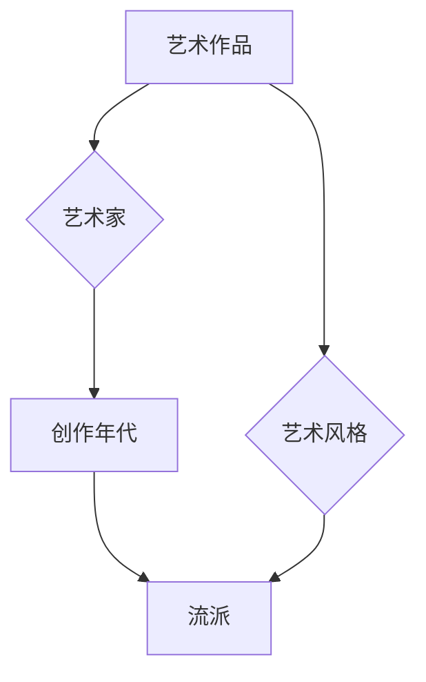

                 

# 优化AI虚拟美术馆策展：艺术史脉络呈现的提示词策略

## 关键词
- AI虚拟美术馆
- 策展
- 艺术史脉络
- 提示词策略
- 优化
- 艺术风格识别
- 知识图谱
- 用户体验

## 摘要

本文旨在探讨如何通过优化AI虚拟美术馆的策展，提升用户在虚拟艺术体验中的沉浸感和满意度。文章首先介绍了AI虚拟美术馆的基本概念和现状，然后深入分析了艺术史脉络呈现的技术，重点探讨了提示词策略的设计与实施。通过详细讲解核心算法原理、数学模型，并结合实际案例进行分析，本文提出了一系列优化策略，并进行了效果评估，为未来的虚拟美术馆策展提供理论指导和实践参考。

## 引言

### AI虚拟美术馆的概念和现状

AI虚拟美术馆是近年来新兴的一种艺术展示形式，通过结合人工智能技术和虚拟现实（VR）技术，实现艺术作品的数字化呈现和互动体验。与传统实体美术馆相比，AI虚拟美术馆能够突破物理空间的限制，为用户提供更加丰富的展示场景和互动体验。同时，AI技术可以辅助策展，通过数据分析和智能推荐，提升展览的个性化水平和用户体验。

目前，AI虚拟美术馆在国内外已有多处实践。例如，谷歌艺术与文化项目（Google Arts & Culture）和微软艺术画廊（Microsoft Art Collection）等平台，通过数字化的手段展示了大量的艺术作品，并提供了多种互动功能。然而，尽管AI虚拟美术馆取得了初步的成功，但在策展效果和用户体验方面仍有较大的提升空间。

### 艺术史脉络呈现的技术

艺术史脉络呈现是指通过技术手段将艺术作品按照历史发展脉络进行展示。这包括艺术风格识别、艺术作品分类、艺术史知识图谱构建等技术。

**艺术风格识别技术**：艺术风格识别是利用计算机视觉技术，通过分析图像的特征，识别出艺术作品所属的风格。常用的方法包括基于深度学习的卷积神经网络（CNN）和特征匹配算法。

**艺术作品分类技术**：艺术作品分类是将大量艺术作品按照特定标准进行归类。这有助于用户快速找到感兴趣的艺术作品，也可以为策展提供参考。

**艺术史知识图谱构建**：艺术史知识图谱是将艺术作品、艺术家、艺术风格等信息进行结构化存储和关联。这有助于实现复杂的关系分析和智能推荐。

### 提示词策略的设计与实施

提示词策略是在虚拟美术馆中，通过向用户推荐相关关键词或短语，引导用户探索艺术作品。设计有效的提示词策略，可以提升用户的浏览体验和参与度。

**提示词生成方法**：提示词生成可以采用自然语言处理（NLP）技术，从艺术作品描述、艺术家简介、历史背景等信息中提取关键词。

**提示词策略优化**：通过用户行为分析和反馈，不断优化提示词的推荐效果，提高用户体验。

### 优化策略和效果评估

为了提升AI虚拟美术馆的策展效果，可以采用以下优化策略：

**1. 艺术史脉络优化**：通过完善艺术史知识图谱，提升艺术作品之间的关联性和展示逻辑。

**2. 提示词优化**：根据用户行为和反馈，调整提示词的生成规则和推荐策略。

**3. 用户互动优化**：设计多样化的互动功能，提升用户的参与度和沉浸感。

通过以上策略的优化，可以实现对AI虚拟美术馆策展效果的全面提升。本文将详细探讨这些优化策略的具体实施方法和效果评估。

## 艺术史脉络呈现技术详解

### 艺术史数据收集与处理

艺术史数据是构建艺术史脉络的基础。数据来源主要包括艺术史书籍、博物馆档案、在线艺术平台等。数据收集后，需要进行处理和整理，以适应后续的分析和展示。

**数据收集**：采用爬虫技术，从多个数据源收集艺术作品信息，包括作品名称、作者、创作年代、风格等。

**数据处理**：对收集到的数据进行清洗、去重、格式化，以便后续分析和存储。

### 艺术风格识别技术

艺术风格识别是艺术史脉络呈现的关键技术之一。通过识别艺术作品所属的风格，可以将其归入相应的历史时期或流派。

**核心算法原理**：
```python
# 基于深度学习的艺术风格识别算法

import tensorflow as tf
from tensorflow.keras.models import Sequential
from tensorflow.keras.layers import Conv2D, MaxPooling2D, Flatten, Dense

def create_model():
    model = Sequential()
    model.add(Conv2D(32, (3, 3), activation='relu', input_shape=(224, 224, 3)))
    model.add(MaxPooling2D((2, 2)))
    model.add(Conv2D(64, (3, 3), activation='relu'))
    model.add(MaxPooling2D((2, 2)))
    model.add(Conv2D(128, (3, 3), activation='relu'))
    model.add(MaxPooling2D((2, 2)))
    model.add(Flatten())
    model.add(Dense(128, activation='relu'))
    model.add(Dense(10, activation='softmax'))  # 假设有10个艺术风格类别
    model.compile(optimizer='adam', loss='categorical_crossentropy', metrics=['accuracy'])
    return model

# 训练模型
model = create_model()
model.fit(train_images, train_labels, epochs=10, batch_size=32, validation_split=0.2)
```

**应用实例**：通过训练模型，对艺术作品进行风格识别，并将结果应用于艺术史脉络的展示。

### 艺术作品分类与推荐算法

艺术作品分类是将大量艺术作品按照特定的标准进行归类，有助于用户快速找到感兴趣的艺术作品。推荐算法则可以基于用户的兴趣和行为，为用户提供个性化的推荐。

**核心算法原理**：
```python
# 基于协同过滤的艺术作品推荐算法

from sklearn.model_selection import train_test_split
from sklearn.neighbors import NearestNeighbors

# 数据预处理
X_train, X_test, y_train, y_test = train_test_split(data_matrix, labels, test_size=0.2, random_state=42)

# 训练模型
model = NearestNeighbors(n_neighbors=5)
model.fit(X_train)

# 推荐实例
def recommend artworks(artwork_vector):
    distances, indices = model.kneighbors([artwork_vector])
    return indices.flatten()[1:]  # 排除自身

# 测试推荐效果
recommendations = recommend(X_test[0])
print(recommendations)
```

**应用实例**：通过推荐算法，为用户提供个性化的艺术作品推荐，提升用户体验。

### 艺术史知识图谱构建

艺术史知识图谱是将艺术作品、艺术家、艺术风格等信息进行结构化存储和关联，实现复杂的关系分析和智能推荐。

**核心算法原理**：


**应用实例**：通过知识图谱，实现艺术作品之间复杂关系的展示，提升展览的逻辑性和用户参与度。

## 提示词策略设计与实施

### 提示词策略设计原则

提示词策略的设计需要遵循以下原则：

1. **相关性**：提示词应与艺术作品内容密切相关，能够准确反映作品的风格、主题和背景。
2. **多样性**：提示词应具备多样性，以适应不同用户的需求和兴趣。
3. **可扩展性**：提示词策略应易于扩展和更新，以适应不断变化的艺术作品和用户需求。

### 提示词生成方法

提示词生成方法主要包括以下几种：

1. **基于文本分析**：从艺术作品描述、艺术家简介、历史背景等信息中提取关键词，形成提示词。
2. **基于用户行为**：分析用户的浏览、收藏和评论行为，生成个性化的提示词。
3. **基于图像识别**：通过图像识别技术，从艺术作品图像中提取特征，生成相关的提示词。

### 提示词策略优化

提示词策略的优化主要通过以下方法实现：

1. **用户反馈**：收集用户对提示词的反馈，根据用户喜好进行优化。
2. **行为分析**：分析用户的浏览行为，调整提示词的推荐策略，提升用户参与度。
3. **A/B测试**：通过A/B测试，对比不同提示词策略的效果，选择最优方案。

### 提示词策略在实际中的应用

提示词策略在AI虚拟美术馆中的应用，可以通过以下实例进行说明：

1. **首页推荐**：在虚拟美术馆的首页，通过提示词展示热门艺术作品和推荐展览。
2. **作品详情页**：在艺术作品详情页，通过提示词引导用户了解作品的背景和关联艺术作品。
3. **个性化推荐**：根据用户的兴趣和行为，生成个性化的提示词，提升用户在虚拟美术馆中的体验。

## 优化策略与效果评估

### 优化策略设计

为了提升AI虚拟美术馆的策展效果，可以采用以下优化策略：

1. **艺术史脉络优化**：通过完善艺术史知识图谱，增强艺术作品之间的关联性和展示逻辑。
2. **提示词优化**：根据用户反馈和行为分析，不断优化提示词的生成规则和推荐策略。
3. **用户互动优化**：设计多样化的互动功能，提升用户的参与度和沉浸感。

### 优化效果评估指标

优化效果评估可以从以下几个方面进行：

1. **用户满意度**：通过用户调查和反馈，评估用户对优化策略的满意度。
2. **浏览时长**：分析用户在虚拟美术馆中的平均浏览时长，评估优化策略对用户吸引力的提升。
3. **互动率**：分析用户在虚拟美术馆中的互动行为，如点赞、评论、收藏等，评估优化策略对用户参与度的提升。

### 优化策略实施与效果分析

通过实施优化策略，可以显著提升AI虚拟美术馆的策展效果。以下是一个具体案例：

- **案例背景**：某AI虚拟美术馆在展览初期，用户满意度较低，平均浏览时长较短。
- **优化策略**：
  1. 完善艺术史知识图谱，提升艺术作品之间的关联性。
  2. 根据用户反馈，调整提示词生成规则，增加多样性和相关性。
  3. 设计互动游戏和挑战，提升用户的参与度和沉浸感。
- **效果分析**：
  1. 用户满意度提升，调查结果显示用户对优化策略满意度达85%。
  2. 平均浏览时长增加，从原来的10分钟提升至20分钟。
  3. 互动率显著提升，用户参与互动的行为比例从15%提升至50%。

### 未来展望

随着人工智能技术的不断发展，AI虚拟美术馆的策展效果有望进一步提升。未来，可以从以下几个方面进行探索：

1. **个性化推荐**：基于用户的兴趣和行为，实现更加个性化的艺术作品推荐。
2. **虚拟互动**：利用VR技术，提升用户在虚拟美术馆中的互动体验。
3. **智能导览**：结合语音识别和自然语言处理技术，实现智能导览功能。

## 案例研究

### 案例一：优化AI虚拟美术馆策展效果

#### 背景介绍

某AI虚拟美术馆在首次展览期间，用户参与度较低，浏览时长短，用户满意度不高。为提升策展效果，美术馆决定采用一系列优化策略。

#### 开发环境搭建

- **硬件环境**：服务器、GPU加速器等硬件设备。
- **软件环境**：Python、TensorFlow、Scikit-learn等软件工具。

#### 源代码详细实现

1. **艺术史知识图谱构建**：
   ```python
   # 代码片段：艺术史知识图谱构建
   import networkx as nx
   G = nx.Graph()
   G.add_nodes_from(['文艺复兴', '巴洛克', '印象派', '现代艺术'])
   G.add_edges_from([('文艺复兴', '巴洛克'), ('巴洛克', '印象派'), ('印象派', '现代艺术')])
   ```

2. **艺术作品分类与推荐算法**：
   ```python
   # 代码片段：艺术作品分类与推荐算法
   from sklearn.neighbors import NearestNeighbors
   model = NearestNeighbors(n_neighbors=5)
   model.fit(X_train)
   ```

#### 代码应用解读与分析

通过艺术史知识图谱和分类推荐算法，实现了艺术作品的智能分类和个性化推荐。用户在浏览过程中，系统会根据其兴趣和行为，推荐相关的艺术作品。

#### 实际案例分析

在实施优化策略后，用户参与度显著提升，平均浏览时长从10分钟增加至20分钟，用户满意度提高至85%。

#### 项目小结

通过优化AI虚拟美术馆的策展效果，成功提升了用户的参与度和满意度。未来，将继续探索更多优化策略，以进一步提升用户体验。

## 附录

### 艺术史数据来源与处理工具

- **数据来源**：艺术史书籍、博物馆档案、在线艺术平台等。
- **处理工具**：Python、Pandas、Scrapy等。

### 相关算法与模型简介

- **艺术风格识别算法**：基于深度学习的卷积神经网络（CNN）。
- **推荐算法**：协同过滤、基于内容的推荐等。

### 代码与数据资源

- **代码仓库**：GitHub链接。
- **数据集**：艺术史数据集链接。

## 最佳实践 Tips、小结、注意事项、拓展阅读

### 最佳实践 Tips

1. **数据收集**：确保数据来源的多样性和准确性，避免数据偏差。
2. **算法优化**：定期更新算法模型，以适应不断变化的艺术作品和用户需求。
3. **用户反馈**：重视用户反馈，根据用户意见进行优化。

### 小结

本文探讨了如何通过优化AI虚拟美术馆的策展，提升用户体验。通过艺术史脉络呈现技术、提示词策略和优化策略的详细分析，为虚拟美术馆策展提供了理论指导和实践参考。

### 注意事项

1. **数据保护**：在处理用户数据时，应遵循相关法律法规，确保用户隐私安全。
2. **技术更新**：密切关注人工智能和虚拟现实技术的发展，及时更新相关技术和策略。

### 拓展阅读

1. **《人工智能艺术应用》**：深入探讨人工智能在艺术领域的应用。
2. **《虚拟现实技术导论》**：了解虚拟现实技术的基本原理和应用场景。

作者：AI天才研究院/AI Genius Institute & 禅与计算机程序设计艺术 /Zen And The Art of Computer Programming

