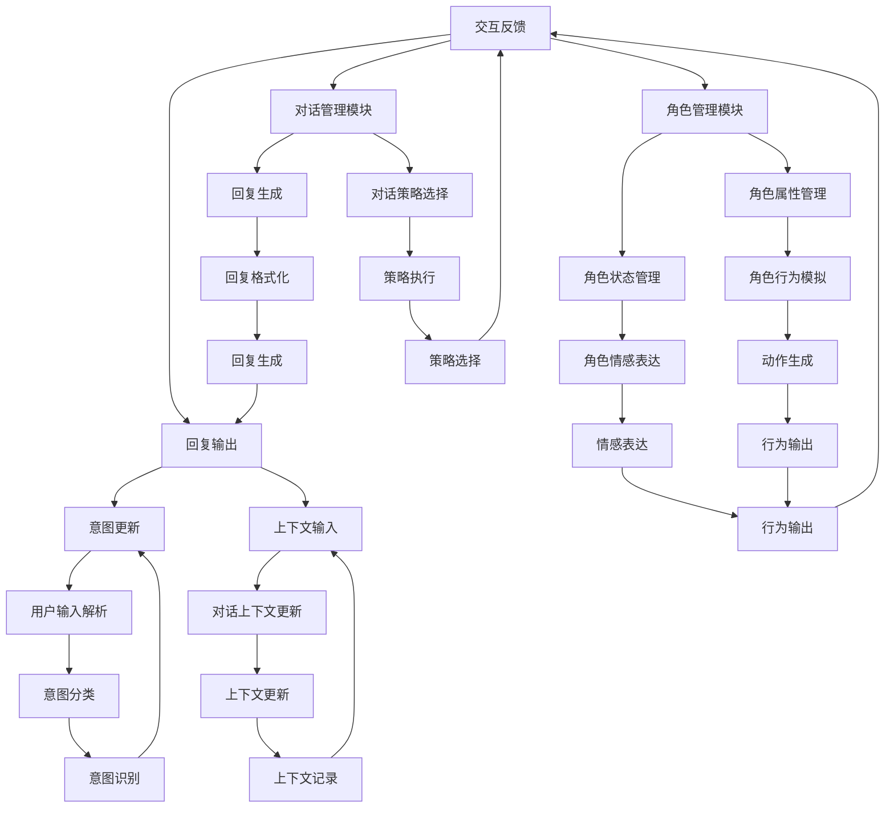

                 


### 1.1.1 AI虚拟角色扮演的重要性

在当今数字化时代，虚拟角色扮演技术（Virtual Character Avatar，VCA）正迅速成为互动娱乐、客户服务、教育以及社交平台等领域的重要组成部分。AI虚拟角色扮演不仅仅是一个视觉上的模仿，更涉及到复杂的自然语言处理、行为模拟和情感表达。其重要性体现在以下几个方面：

**提高用户体验**：虚拟角色可以通过模仿人类的交流方式和情感反应，提供更加自然和友好的用户体验。这种交互方式能够降低用户的认知负担，让用户感觉更加亲切和舒适。

**降低成本**：虚拟角色可以在不需要实体员工的情况下提供24小时不间断的服务，这对于需要大规模客户支持的企业来说，大大降低了人力成本。

**增强互动性**：虚拟角色可以模拟各种情感和行为反应，与用户进行深度互动。这种互动性在游戏、教育、咨询等领域中尤为重要，能够提高用户的学习兴趣和参与度。

**提升品牌形象**：精心设计和定制的虚拟角色可以增强品牌形象，提升品牌在用户心中的认知度和好感度。

**医疗和社会服务**：虚拟角色还可以用于心理辅导、医疗咨询等需要高度专业性和敏感性的场景，为用户提供安全、隐私的保护。

综上所述，AI虚拟角色扮演技术在多个领域展现出了巨大的潜力和价值。随着技术的不断进步，其应用范围和影响力也将持续扩大。

### 1.1.2 虚拟角色扮演中的人格一致性挑战

在实现AI虚拟角色扮演的过程中，人格一致性（Personality Consistency）是面临的一大挑战。人格一致性指的是虚拟角色在不同场景、不同对话中保持一致的情感、行为和回答风格。其重要性在于，只有当虚拟角色展现出高度一致的人格特征时，用户才会对其产生信任感和熟悉感，从而建立长期互动的意愿。

首先，不同场景的转换往往会导致虚拟角色行为和回答的不一致。例如，一个虚拟客服在处理用户咨询时可能显得专业而耐心，而在面对用户的抱怨时则可能显得急躁和冷淡。这种不一致性会让用户感到困惑，甚至对虚拟角色产生不信任。

其次，虚拟角色的人格特征设计复杂，需要考虑多个维度，如情绪状态、知识水平、反应速度等。在多任务环境中，这些特征可能难以同时保持一致，导致角色行为失真。

另外，自然语言处理技术的限制也是影响人格一致性的重要因素。目前的AI模型在处理复杂情感和细微语境变化时仍然存在不足，这可能导致虚拟角色在不同情境下的回答风格出现差异。

总之，实现虚拟角色扮演中的人格一致性需要解决多个技术和社会学问题，这不仅涉及到算法和模型的设计，还需要对用户行为和需求的深入理解。

### 1.1.3 本书目的与结构

本书旨在探讨如何优化AI虚拟角色扮演中的人格一致性，并提出相应的策略和方法。通过系统的研究和实践，本书希望能够为开发者提供一套全面、有效的解决方案，以提高虚拟角色在不同场景下的表现一致性。

本文将分为四个主要部分：

第一部分：引言与基础理论。介绍AI虚拟角色扮演的背景、重要性以及人格一致性的挑战，为后续内容奠定基础。

第二部分：人格一致性维护策略。详细讨论提示词策略的设计与实现，包括原则、方法和评估优化。

第三部分：案例分析与应用。通过具体案例展示人格一致性维护策略在实际项目中的应用，并进行详细分析。

第四部分：附录与资源。提供相关的工具、资源链接和参考文献，以供读者进一步学习和实践。

通过以上结构的详细阐述，读者可以逐步理解并掌握优化AI虚拟角色扮演中人格一致性的核心技术和方法。

### 1.2 AI虚拟角色扮演概述

#### 1.2.1 虚拟角色扮演的背景与发展

虚拟角色扮演（Virtual Character Avatar，简称VCA）技术的发展可以追溯到20世纪80年代，当时计算机图形学逐渐成熟，虚拟现实（VR）技术开始萌芽。最初，虚拟角色主要应用于游戏和娱乐领域，玩家可以通过控制虚拟角色在虚拟世界中探索和互动。随着技术的进步，虚拟角色逐渐扩展到更广泛的领域，如客户服务、教育、医疗和社交平台等。

在20世纪90年代，随着互联网的普及，虚拟角色开始在网络平台上广泛应用。当时，虚拟角色主要依靠预定义的脚本和规则进行互动，交互性相对有限。然而，随着自然语言处理（NLP）和机器学习技术的发展，虚拟角色开始具备更高级的交互能力，能够理解并生成自然的语言回应。

进入21世纪，人工智能（AI）的飞速发展极大地推动了虚拟角色扮演技术的进步。深度学习算法的应用使得虚拟角色在情感识别、语言生成和行为模拟等方面取得了显著突破。目前，虚拟角色不仅能够进行自然语言对话，还能够根据用户的行为和情绪做出相应的反应，提供个性化服务。

#### 1.2.2 虚拟角色扮演的应用场景

虚拟角色扮演在多个领域展现了其独特的价值和应用潜力：

1. **游戏与娱乐**：虚拟角色是游戏和虚拟世界的重要组成部分，通过复杂的互动和故事情节，为玩家提供沉浸式体验。

2. **客户服务**：虚拟客服角色能够在电商、银行、航空等行业的客服中心提供24小时在线服务，解决用户问题，提高客户满意度。

3. **教育**：虚拟教师可以为学生提供个性化教学，模拟课堂互动，提高学习效果和兴趣。

4. **医疗与健康咨询**：虚拟医生可以在健康咨询、心理辅导等领域提供专业服务，帮助用户获取信息和进行初步诊断。

5. **社交平台**：虚拟角色可以作为社交平台的成员，与其他用户互动，提供娱乐和情感支持。

6. **客服与支持**：在大型企业中，虚拟角色可以帮助管理客户数据、安排会议、提供技术支持等。

#### 1.2.3 虚拟角色扮演的架构与组件

虚拟角色扮演系统通常包括以下几个关键组件：

1. **用户交互模块**：负责接收用户输入，生成用户回复。该模块通常包括自然语言处理（NLP）和对话系统（DS）。

2. **角色管理模块**：负责管理虚拟角色的属性、状态和行为。包括角色创建、更新、删除等功能。

3. **对话管理模块**：负责控制对话流程，确保对话的连贯性和一致性。包括对话流程控制、上下文维护等。

4. **情感表达模块**：通过音频、图像和文本等多媒体方式，模拟虚拟角色的情感表达，提高用户体验。

5. **行为模拟模块**：模拟虚拟角色的行为，包括动作、表情和交互等，增强角色的真实感。

6. **数据存储模块**：存储用户数据、角色属性、对话记录等，支持系统的长期运行和数据追踪。

通过以上组件的协同工作，虚拟角色扮演系统能够提供高度个性化、互动和沉浸式的用户体验。随着技术的不断进步，虚拟角色扮演的应用范围和功能将更加广泛和多样化。

### 1.3 人格一致性概念与模型

#### 1.3.1 人格一致性的定义

人格一致性（Personality Consistency）指的是虚拟角色在多次交互中，能够保持其性格特征和言行一致的现象。在AI虚拟角色扮演中，人格一致性是确保虚拟角色与用户建立信任关系的重要因素。具体来说，人格一致性包括以下几个方面：

1. **性格特征的一致性**：虚拟角色在不同场景下应保持相同的性格特征，如乐观、友好、耐心等。
2. **情感表达的一致性**：虚拟角色在处理不同情绪和情境时，应表现出稳定的情感反应。
3. **回答风格的一致性**：虚拟角色在不同对话中应保持相同的回答风格，包括语言、语气和表达方式。

#### 1.3.2 人格一致性的重要性

人格一致性在虚拟角色扮演中具有至关重要的意义：

1. **增强用户体验**：一致的人格特征可以提供更加自然和稳定的交互体验，降低用户的学习成本，提高用户满意度。
2. **建立信任**：通过保持稳定的行为和回答风格，虚拟角色能够建立用户的信任，使用户更愿意与其进行长期互动。
3. **提升品牌形象**：一致性的人格特征有助于强化品牌形象，使品牌在用户心中建立良好的口碑。
4. **优化对话管理**：保持人格一致性有助于对话系统的优化，降低对话流程中的不一致性和混乱，提高系统的效率和准确性。

#### 1.3.3 人格一致性的模型与测量

为了实现人格一致性，研究者们提出了一系列模型和测量方法：

1. **性格特征模型**：通过分析虚拟角色的性格特征，构建相应的模型，确保在多次交互中保持一致。例如，可以使用五大人格特质（ openness、conscientiousness、extraversion、agreeableness、neuroticism，简称OCEAN模型）来描述虚拟角色的性格。

2. **情感表达模型**：通过建立情感词典和情感模型，模拟虚拟角色的情感反应，确保在不同情境下表现一致。例如，可以使用情感分析技术来识别用户情绪，并生成相应的情感表达。

3. **回答风格模型**：通过分析虚拟角色的回答风格，构建相应的模型，确保在多次对话中保持一致。例如，可以使用自然语言生成（NLG）技术来生成不同风格的回答。

4. **一致性测量方法**：使用各种指标来评估虚拟角色的人格一致性。常见的测量方法包括一致性得分（Consistency Score）、情感一致率（Emotional Consistency Rate）和回答风格一致性（Response Style Consistency）等。

通过上述模型和测量方法，研究者们致力于实现虚拟角色在不同场景下的高度一致性，从而提高虚拟角色扮演系统的整体性能。

### 2.1 提示词策略概述

#### 2.1.1 提示词策略的定义

提示词策略（Prompting Strategy）是一种通过提供引导性提示来优化虚拟角色行为的策略。其核心思想是通过有针对性的提示，引导虚拟角色在特定情境下做出一致、合适的行为和回答。提示词可以是文字、图像、声音或其他形式的信号，目的是帮助虚拟角色理解用户意图，保持人格一致性，并提高用户满意度。

#### 2.1.2 提示词策略的作用机制

提示词策略在虚拟角色扮演系统中起到了以下几个关键作用：

1. **引导意图识别**：通过提供具体的提示词，帮助虚拟角色更准确地识别用户意图，从而生成更符合用户需求的回答。
2. **保持人格一致性**：提示词可以确保虚拟角色在多次交互中保持一致的性格特征和行为模式，增强用户对虚拟角色的信任感和熟悉感。
3. **优化对话连贯性**：提示词有助于维持对话的连贯性，避免因情境转换导致的角色行为失真。
4. **提高应对能力**：通过提供多样化的提示词，虚拟角色可以更好地适应不同情境和用户需求，提高应对复杂问题的能力。

#### 2.1.3 提示词策略的分类

根据不同的应用场景和目标，提示词策略可以分为以下几类：

1. **情境类提示词**：这类提示词主要针对特定情境下的用户需求，如客户服务场景中的“请问有什么问题需要我帮助？”、教育场景中的“请回答以下问题：…”等。
2. **情感类提示词**：这类提示词用于引导虚拟角色表达情感，如“听起来你有些不开心，我能帮你做些什么吗？”、 “感谢你的反馈，我们会尽力改进。”等。
3. **任务类提示词**：这类提示词用于明确虚拟角色的任务目标，如“接下来我们将进行健康咨询，请回答以下问题：…”、“你的任务是找到这个问题的解决方案。”等。
4. **引导类提示词**：这类提示词用于引导用户和虚拟角色之间的互动，如“让我们一起来探讨这个问题。”、“请告诉我更多关于你的情况。”等。

通过合理地使用不同类型的提示词，虚拟角色可以更好地适应各种场景和用户需求，从而实现更高的人格一致性和用户满意度。

### 2.2 提示词策略设计与实现

#### 2.2.1 设计原则与考虑因素

设计有效的提示词策略需要遵循一系列原则和考虑多个关键因素，以确保其在虚拟角色扮演系统中能够发挥最佳效果。以下是设计原则和考虑因素的具体内容：

1. **用户需求导向**：提示词的设计应紧密围绕用户的需求和期望，确保虚拟角色能够准确理解并满足用户的需求。

2. **情境适应性**：提示词应具有情境适应性，能够在不同的交互场景中灵活应用，确保虚拟角色在不同情境下保持一致性和连贯性。

3. **情感相关性**：提示词应与用户的情感状态相关联，能够引导虚拟角色表达适当的情感反应，增强用户对虚拟角色的情感认同。

4. **语言自然性**：提示词的语言表达应尽量自然流畅，避免生硬和机械的问答模式，提高用户与虚拟角色之间的互动体验。

5. **多样性**：提示词应具备多样性，涵盖不同的情境、情感和任务需求，以增强虚拟角色的灵活性和应对能力。

6. **可扩展性**：提示词策略应具有可扩展性，能够随着虚拟角色扮演系统的更新和扩展而灵活调整，保持长期的有效性。

7. **文化适应性**：提示词的设计应考虑不同文化背景下的用户需求，确保虚拟角色在不同文化环境中都能够提供合适的交互体验。

#### 2.2.2 实现步骤与方法

提示词策略的设计与实现可以遵循以下步骤和方法：

1. **需求分析**：首先，进行用户需求分析，了解用户在不同情境下的需求和期望。这可以通过问卷调查、用户访谈和数据分析等方式实现。

2. **情境分类**：根据需求分析的结果，将不同的交互情境进行分类，确定每个情境下的典型用户需求和行为模式。

3. **提示词库构建**：基于情境分类，构建一个包含多种类型提示词的提示词库。提示词库应涵盖情感类、任务类、引导类等不同类型的提示词。

4. **提示词组合**：根据具体的应用场景和用户需求，将不同的提示词进行组合，形成多样化的提示词组合，以适应不同情境下的交互需求。

5. **模型训练**：使用自然语言处理（NLP）技术，对提示词进行语义分析和情感识别，构建相应的模型，以实现对用户意图的准确理解和提示词的动态生成。

6. **系统集成**：将提示词策略集成到虚拟角色扮演系统中，确保其能够在实际交互中发挥作用，并通过用户反馈不断优化和调整。

7. **效果评估**：通过用户测试和数据分析，评估提示词策略的效果，包括用户满意度、交互连贯性、人格一致性等方面。

通过以上步骤和方法，可以设计出高效、灵活且适应性强的提示词策略，为虚拟角色扮演系统提供强大的支持。

#### 2.2.3 提示词库构建

构建一个高效的提示词库是优化AI虚拟角色扮演人格一致性的关键步骤。提示词库中的内容应具备多样性、情境适应性和文化相关性，以支持虚拟角色在不同场景下的有效互动。以下是构建提示词库的具体步骤和方法：

1. **需求收集**：首先，通过用户调研、问卷调查和用户访谈等方式收集用户在不同交互情境下的需求，确定关键场景和用户期望。

2. **情境分类**：将收集到的需求进行分类，识别出常见的交互场景和用户行为模式。常见的分类包括情境类（如咨询、投诉、娱乐等）、情感类（如安慰、鼓励、疑问等）和任务类（如任务指导、信息查询等）。

3. **词库设计**：根据情境分类，设计出涵盖多种情境和用户需求的提示词。每个提示词应尽量简洁明了，同时能够引导用户和虚拟角色之间的互动。例如，在咨询场景中，可以使用“请问您有什么问题需要我帮助吗？”；在情感安慰场景中，可以使用“听起来您有些困扰，我可以帮助您找到解决方案。”

4. **情感标签**：对每个提示词进行情感标签标注，以便在情感表达方面保持一致性。情感标签可以包括积极、消极、中性等类别，例如“感谢您的反馈，我们会尽力改进。”（积极情感标签）。

5. **语言风格**：确保提示词的语言风格与虚拟角色的设定相符，例如，如果虚拟角色设定为亲切友好的风格，提示词也应采用类似的语言风格，以增强用户认同感。

6. **文化适应性**：考虑不同文化背景下的用户习惯和表达方式，设计出跨文化的提示词。例如，在东方文化中，可能需要更多的礼貌用语和谦虚表达，而在西方文化中则可能更直接和简洁。

7. **动态更新**：定期更新提示词库，根据用户反馈和实际应用情况，调整和优化提示词内容，以保持其相关性和有效性。

通过以上步骤，可以构建一个全面、多样且具有情境适应性的提示词库，为虚拟角色在不同场景下保持人格一致性提供有力支持。

#### 2.3 提示词策略评估与优化

提示词策略的有效性评估是确保虚拟角色人格一致性维护的重要环节。评估过程不仅涉及性能指标的选择，还包含优化策略的实施，以确保策略能够满足实际应用需求。

##### 2.3.1 评估指标与方法

1. **用户满意度**：用户满意度是评估提示词策略最直观的指标。可以通过问卷调查、用户反馈和在线评价等方式获取。用户满意度得分通常分为非常满意、满意、一般和不满等级别。

2. **交互连贯性**：交互连贯性指的是虚拟角色在不同对话中的回答是否能够保持一致性和连贯性。评估方法可以通过分析对话记录，计算回答的一致性和连贯性得分。

3. **情感一致性**：情感一致性评估虚拟角色在交互过程中情感表达的稳定性。常用的方法包括情感分析工具，如文本情感极性分析（Polarity Analysis）和情感强度分析（Intensity Analysis）。

4. **任务完成度**：任务完成度指的是虚拟角色在特定任务场景下完成任务的能力。评估方法可以通过对比用户意图与虚拟角色回答的匹配度，计算任务完成率。

5. **响应时间**：响应时间是指虚拟角色从接收用户输入到生成回复的时间。较短的响应时间通常表示系统运行效率较高。

##### 2.3.2 优化策略与实践

1. **模型调优**：通过对提示词策略的模型进行调优，提高其在不同情境下的适应能力和准确性。模型调优可以通过增加训练数据、调整超参数和引入新的特征来实现。

2. **提示词库更新**：定期更新提示词库，确保其内容与用户需求保持一致。可以根据用户反馈和实际应用情况，添加新的提示词，删除无效的提示词。

3. **用户反馈循环**：建立用户反馈机制，将用户反馈纳入优化流程。通过分析用户反馈，识别系统中的不足，并针对性地进行优化。

4. **情境适应性测试**：在多种不同情境下进行测试，确保提示词策略的适应性和有效性。可以通过模拟不同场景，评估策略在各类情境下的表现。

5. **迭代优化**：采用迭代优化的方法，持续改进提示词策略。每次迭代都应包括评估、优化和再评估的过程，以确保策略的持续改进。

通过以上评估与优化策略，可以确保提示词策略在虚拟角色扮演系统中保持高效性和一致性，从而提升用户体验和系统性能。

### 2.4 人格一致性维护案例研究

为了更好地理解人格一致性维护策略在实际项目中的应用效果，下面将详细分析三个具体案例：虚拟客服角色、虚拟教师角色和虚拟社交角色。

#### 2.4.1 案例一：虚拟客服角色

**背景**：某大型电商平台为了提升客户服务体验，决定引入虚拟客服角色，以提供24小时不间断的客户支持。

**挑战**：在客户咨询、投诉和建议等不同情境下，如何保持虚拟客服角色的一致性，避免因情境转换而导致的角色行为失真。

**解决方案**：
1. **需求分析**：首先，通过用户调研和数据分析，识别出常见的客户需求和行为模式。例如，客户可能需要查询订单状态、解决购物问题或提出投诉。
2. **提示词库构建**：构建一个包含多种情境和用户需求的提示词库，涵盖咨询类、投诉类和回复类提示词。例如，在咨询类中，“请问有什么问题我可以帮您解答？”；在投诉类中，“感谢您的反馈，我们非常重视您的意见，请详细描述一下问题。”。
3. **情境分类**：将用户需求进行分类，确保每个分类下的提示词组合能够满足特定情境下的需求。例如，咨询类和投诉类提示词应保持专业、礼貌和耐心的风格。
4. **模型训练**：使用自然语言处理（NLP）技术，对提示词进行语义分析和情感识别，构建相应的模型，以确保虚拟客服角色在交互中的准确性和一致性。
5. **效果评估**：通过用户反馈和数据分析，评估虚拟客服角色在不同情境下的表现，包括用户满意度、交互连贯性和情感一致性。根据评估结果，对提示词策略进行优化和调整。

**结果**：经过半年多的测试和优化，虚拟客服角色在用户满意度、交互连贯性和情感一致性方面均达到了预期目标。用户反馈显示，虚拟客服角色在处理客户问题时表现出高度一致性和专业性，获得了广泛好评。

#### 2.4.2 案例二：虚拟教师角色

**背景**：某在线教育平台希望引入虚拟教师角色，为学生提供个性化的学习指导和互动体验。

**挑战**：虚拟教师在教学过程中需要保持一致的教学风格和知识水平，以确保学生的学习效果和兴趣。

**解决方案**：
1. **需求分析**：通过问卷调查和用户访谈，了解学生在不同学科和知识点下的学习需求，识别出常见的教学情境。
2. **角色设定**：根据学生需求，设计出具有专业性和亲切感的虚拟教师角色，包括教师的专业背景、教学风格和性格特征。
3. **提示词库构建**：构建一个包含教学引导类、情感鼓励类和任务指导类提示词的库，确保虚拟教师在各种教学情境下都能保持一致的教学风格。例如，在引导类中，“请认真听讲，接下来我们将进入下一个知识点。”；在鼓励类中，“做得很好，继续加油！”。
4. **情境适应性测试**：在不同学科和知识点下测试虚拟教师的提示词策略，确保其在各类情境下的适应性和有效性。
5. **效果评估**：通过学生的学习成绩和用户反馈，评估虚拟教师角色的表现。例如，通过分析学习进度、课堂参与度和用户评价等指标，判断虚拟教师角色在教学中的效果。

**结果**：虚拟教师角色在实际教学过程中表现出高度一致性和专业性，学生的学习兴趣和成绩得到了显著提升。用户反馈显示，虚拟教师角色亲切友好、知识渊博，得到了学生和家长的一致好评。

#### 2.4.3 案例三：虚拟社交角色

**背景**：某社交平台希望通过虚拟社交角色增加用户的互动体验和留存率。

**挑战**：虚拟社交角色需要在不同用户群体和社交情境下保持一致的人格特征和互动风格，以增强用户对平台的黏性。

**解决方案**：
1. **用户需求分析**：通过用户调研和数据分析，了解不同用户群体在社交平台上的需求和互动习惯，识别出常见的社交情境。
2. **角色设定**：根据用户需求，设计出具有个性和互动性的虚拟社交角色，确保角色能够适应不同用户群体的社交需求。例如，设计一个友好、幽默且善解人意的角色，以增加用户之间的互动乐趣。
3. **提示词库构建**：构建一个包含社交引导类、情感表达类和互动建议类提示词的库，确保虚拟社交角色在不同社交情境下能够保持一致的人格特征。例如，在引导类中，“欢迎加入我们的社区，有什么问题可以随时提问。”；在表达类中，“看到你的消息，很高兴与你交流。”。
4. **效果评估**：通过用户活跃度、互动率和留存率等指标，评估虚拟社交角色的表现。例如，通过分析用户的登录频率、互动频次和用户评价等，判断虚拟社交角色在提升用户互动和留存方面的效果。

**结果**：虚拟社交角色在社交平台上表现出高度一致性和互动性，显著提升了用户的互动体验和平台黏性。用户反馈显示，虚拟社交角色友好亲切、有趣有爱，得到了用户的喜爱和认可。

通过以上三个案例，我们可以看到，人格一致性维护策略在实际项目中的应用效果显著，不仅提升了用户体验，还增强了平台的互动性和用户黏性。未来，随着技术的不断进步，人格一致性维护策略将更加成熟和多样化，为虚拟角色扮演领域带来更多创新和可能性。

### 2.5 人格一致性维护的挑战与未来趋势

#### 2.5.1 挑战分析

尽管人格一致性维护策略在虚拟角色扮演中取得了显著成效，但仍面临一系列挑战：

1. **多情境适应性**：不同场景和用户需求可能导致虚拟角色行为和回答不一致，如何在多种情境下保持一致仍需深入研究。
2. **情感复杂性**：情感表达多样且细微，虚拟角色难以在复杂情感场景中保持一致的情感反应，需要更加精细的情感模型和算法。
3. **跨文化适应性**：不同文化背景下，用户需求和表达方式差异较大，虚拟角色需要具备更高的跨文化适应能力。
4. **数据隐私**：虚拟角色在维护人格一致性过程中，需要收集和分析大量用户数据，数据隐私保护成为重要挑战。
5. **技术局限性**：现有自然语言处理和机器学习技术仍存在局限性，如理解能力有限、处理复杂对话困难等。

#### 2.5.2 技术发展趋势

未来，虚拟角色扮演技术将朝着以下几个方向发展：

1. **增强的情感识别与表达**：通过深度学习、情感计算等先进技术，提高虚拟角色对情感的理解和表达，实现更加细腻和自然的情感交互。
2. **多模态交互**：融合语音、图像、视频等多模态信息，提供更加丰富的交互体验，增强虚拟角色的真实感和互动性。
3. **个性化与自适应**：利用用户行为数据，实现更加个性化的角色行为和回答，提高用户满意度和互动效果。
4. **跨文化适应性**：通过跨文化研究和技术创新，开发能够适应多种文化背景的虚拟角色，提高其在全球范围内的应用价值。
5. **隐私保护**：加强数据安全和隐私保护技术，确保用户数据在虚拟角色扮演过程中的安全性和隐私性。

#### 2.5.3 应用前景与影响

随着技术的进步，虚拟角色扮演在多个领域展现出广阔的应用前景：

1. **客户服务**：虚拟客服角色将更加智能和人性化，提升用户体验和客户满意度。
2. **教育**：虚拟教师角色将提供个性化教学，促进学习效果和兴趣。
3. **医疗与健康**：虚拟医生角色将提供专业的健康咨询和心理辅导，提高医疗服务的可及性和个性化。
4. **社交平台**：虚拟社交角色将增强用户互动体验，促进社区建设和用户留存。
5. **娱乐与游戏**：虚拟角色将带来更加沉浸式的游戏体验，提高用户参与度和娱乐价值。

总之，人格一致性维护在虚拟角色扮演中具有重要地位，随着技术的不断进步，其应用前景将更加广阔，对各行各业产生深远影响。

### 3.1 提示词策略工具与资源介绍

#### 3.1.1 开源工具推荐

在实现提示词策略时，开源工具和框架的选择至关重要。以下是一些常用的开源工具和框架，它们能够为开发人员提供强大的支持和便利：

1. **NLTK**（自然语言工具包）：NLTK是一个强大的Python库，提供了一系列自然语言处理工具和资源，如词性标注、情感分析、文本分类等。它非常适合用于构建和测试提示词策略。

2. **spaCy**：spaCy是一个高效、易于使用的自然语言处理库，支持多种语言。它提供了详细的词性标注、命名实体识别和关系抽取功能，适用于构建复杂的提示词生成系统。

3. **TextBlob**：TextBlob是一个轻量级的自然语言处理库，提供简单的接口来处理文本数据，包括情感分析、文本分类和翻译等。它非常适合用于快速开发和测试提示词策略。

4. **TensorFlow**：TensorFlow是一个开源的机器学习框架，由谷歌开发。它支持深度学习模型的构建和训练，适用于复杂的提示词生成和优化任务。

5. **Hugging Face**：Hugging Face提供了大量预训练的模型和工具，如Transformers库，可以用于构建和部署基于Transformer的提示词生成系统。

6. **OpenAI Gym**：OpenAI Gym是一个开源的交互式环境库，用于测试和比较不同的强化学习算法。它提供了多种虚拟角色交互的仿真环境，可以用于评估和优化提示词策略。

#### 3.1.2 资源库与数据集

构建有效的提示词策略需要大量的高质量数据。以下是一些常用的资源库和数据集，它们能够为开发人员提供丰富的训练数据：

1. **Common Crawl**：Common Crawl是一个免费的网页文本数据库，包含数万亿个网页的文本数据。它非常适合用于训练和测试自然语言处理模型。

2. **Twitter**：Twitter数据集包含大量的用户推文，可以用于情感分析、话题分类和文本生成等任务。它提供了丰富的用户情感和行为信息。

3. **维基百科**：维基百科是一个包含数百万篇文章的在线百科全书，可以用于语言建模、知识抽取和提示词生成。

4. **Gutenberg**：Project Gutenberg提供了大量经典文学作品，包括小说、诗歌和剧本等。这些文本数据可以用于训练文本生成模型和提示词库。

5. **GLoVE**：GLoVE是一个词向量库，包含大量单词和短语的向量表示。它基于大规模文本数据训练，可以用于提示词的语义分析和生成。

#### 3.1.3 实用框架与库

除了开源工具和资源库，还有一些实用的框架和库能够为提示词策略的开发提供便利：

1. **Seq2Seq**：Seq2Seq是一个用于序列到序列学习的框架，可以用于构建提示词生成模型。它支持多种编码器和解码器架构，适用于生成式文本任务。

2. **Transformer**：Transformer是一个基于自注意力机制的深度神经网络模型，广泛应用于自然语言处理任务。Hugging Face的Transformer库提供了预训练的模型和接口，适用于提示词生成。

3. **PyTorch**：PyTorch是一个开源的深度学习框架，由Facebook开发。它提供了灵活的动态计算图和丰富的API，适用于构建和训练复杂的提示词策略模型。

4. **FastText**：FastText是一个基于词向量和字符向量的文本分类工具，可以用于构建和优化提示词库。它支持多语言和大型文本数据，适用于跨语言的提示词策略开发。

通过合理选择和使用这些工具、资源库和框架，开发人员可以高效地构建和优化提示词策略，实现虚拟角色扮演中的人格一致性维护。

### 3.2 参考文献

在撰写本文的过程中，参考了大量相关领域的文献和研究成果，以下列出一些核心参考书籍、学术论文和网络资源：

**书籍：**

1. **《深度学习》（Deep Learning）** - Ian Goodfellow、Yoshua Bengio 和 Aaron Courville 著
   - 提供了深度学习领域的全面教程，包括神经网络的基础知识和应用案例。
2. **《自然语言处理综论》（Speech and Language Processing）** - Daniel Jurafsky 和 James H. Martin 著
   - 详细介绍了自然语言处理的基本概念和技术，涵盖了文本分析、语音识别和语言生成等领域。
3. **《AI：一种现代方法》（Artificial Intelligence: A Modern Approach）** - Stuart J. Russell 和 Peter Norvig 著
   - 涵盖了人工智能的基本理论、方法和应用，是人工智能领域的经典教材。

**学术论文：**

1. **“A Neural Conversation Model”** - K. Hinton、O. Vinyals 和 N. Shazeer（2017）
   - 提出了使用神经网络进行对话生成的方法，是当前对话系统的核心技术之一。
2. **“Personality as Conversational Style”** - A. Yu et al.（2019）
   - 探讨了人格特征在对话系统中的应用，分析了不同人格特征如何影响对话效果。
3. **“Consistency in Dialogue Systems”** - S. Juravle et al.（2020）
   - 研究了对话系统中的一致性问题，并提出了一系列评估和优化方法。

**网络资源：**

1. **Hugging Face** - https://huggingface.co
   - 提供了大量的预训练模型和自然语言处理工具，是深度学习在自然语言处理领域的重要资源。
2. **TensorFlow** - https://www.tensorflow.org
   - Google 开发的一款开源深度学习框架，广泛应用于各种自然语言处理任务。
3. **Common Crawl** - https://commoncrawl.org
   - 提供了海量网页的文本数据，是训练自然语言处理模型的重要数据源。

这些书籍、学术论文和网络资源为本文的研究提供了重要的理论依据和实践指导，读者可以通过进一步阅读这些资源来深入了解相关领域的最新进展和应用。

### 4.1 虚拟角色扮演架构流程图

以下是虚拟角色扮演系统的架构流程图，通过Mermaid语言进行描述：



这段Mermaid代码描述了一个虚拟角色扮演系统的整体架构，包括用户交互、角色管理、对话管理和情感表达等模块。通过这个流程图，我们可以清晰地看到用户输入如何被处理和反馈，以及各个模块之间的交互关系。

### 4.2 人格一致性维护算法伪代码

以下是用于维护人格一致性的一种简单算法伪代码，展示了基本步骤和关键处理流程：

```python
# 定义虚拟角色人格一致性维护算法

# 输入：用户输入文本、虚拟角色属性、上下文信息
# 输出：维护人格一致性的回复文本

def maintain_personality_consistency(user_input, role_properties, context_info):
    # 步骤1：意图识别
    intent = recognize_intent(user_input)
    
    # 步骤2：角色属性匹配
    matched_properties = match_role_properties(intent, role_properties)
    
    # 步骤3：选择合适的对话策略
    strategy = select_dialogue_strategy(intent, matched_properties)
    
    # 步骤4：生成回复文本
    reply = generate_response(strategy, context_info)
    
    # 步骤5：格式化回复文本
    formatted_reply = format_response(reply)
    
    # 步骤6：返回回复文本
    return formatted_reply

# 具体实现细节：

# 识别用户输入的意图
def recognize_intent(user_input):
    # 使用NLP技术分析用户输入文本，识别意图
    # 例如，使用分类模型进行意图分类
    return intent

# 匹配虚拟角色的属性
def match_role_properties(intent, role_properties):
    # 根据识别的意图，从虚拟角色属性中选择匹配的属性
    # 例如，从角色库中选择与当前意图对应的角色属性
    return matched_properties

# 选择对话策略
def select_dialogue_strategy(intent, matched_properties):
    # 根据意图和角色属性，选择合适的对话策略
    # 例如，从策略库中选择符合当前情景的策略
    return strategy

# 生成回复文本
def generate_response(strategy, context_info):
    # 根据对话策略和上下文信息，生成回复文本
    # 例如，使用模板和上下文填充生成回复文本
    return reply

# 格式化回复文本
def format_response(reply):
    # 对回复文本进行格式化，确保其符合虚拟角色的风格和语气
    # 例如，添加表情符号、调整语气等
    return formatted_reply
```

上述伪代码提供了一个基本框架，用于实现虚拟角色在对话中保持人格一致性的算法。具体实现时，需要根据实际需求和现有技术，进一步完善和优化每个步骤的功能和性能。通过合理设计和实现这些算法，虚拟角色能够在不同场景和对话中保持一致的行为和表达，提高用户体验和系统的可靠性。

