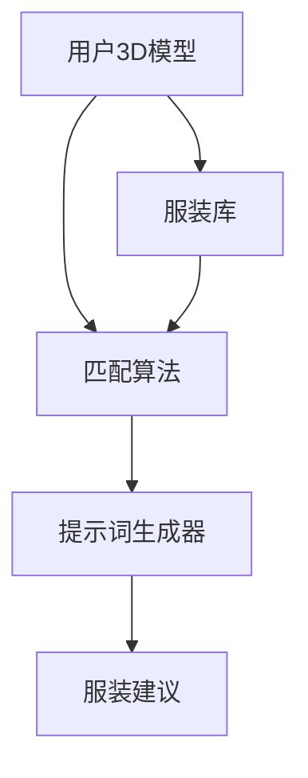

                 

## 文章标题：优化AI虚拟试衣间：体型适配建议的提示词策略

### 关键词：
- AI虚拟试衣间
- 体型适配
- 提示词策略
- 算法原理
- 数学模型
- 实际案例

### 摘要：
本文旨在探讨如何优化AI虚拟试衣间的体型适配功能，重点研究基于提示词策略的体型适配建议。通过分析用户需求，本文提出了核心概念与联系，详细讲解了体型适配建议的算法原理和数学模型，并使用LaTeX格式表示。随后，文章介绍了提示词策略的研究，包括提示词的定义与作用、生成算法和效果评估。最后，通过实际案例展示，本文提供了完整的开发环境搭建、源代码实现和代码解读，并对应用效果进行了详细分析。文章总结了最佳实践、注意事项和未来研究方向，为相关领域的研究者和开发者提供了有价值的参考。

---

### 用户需求分析：

在现代零售和电子商务行业中，AI虚拟试衣间已经成为一种重要的销售工具。用户对于个性化体验的需求不断提高，尤其是对体型适配的需求。因此，优化AI虚拟试衣间的体型适配功能变得至关重要。本文的研究目标是提出一种基于提示词策略的体型适配建议方法，以提高用户的试衣体验和购物满意度。

用户的需求主要集中在以下几个方面：

1. **准确性**：用户希望试衣间能够准确判断他们的体型，并提供合适的服装建议。
2. **个性化**：用户希望试衣间能够根据他们的个人喜好和风格提供个性化的服装推荐。
3. **便利性**：用户希望试衣过程简便快捷，能够在短时间内得到满意的试衣结果。
4. **互动性**：用户希望试衣过程能够具有互动性，提供有趣和有趣的体验。

为了满足这些需求，本文提出了一种基于提示词策略的体型适配建议方法。该方法的核心是利用人工智能技术和大数据分析，通过分析用户的体型数据和行为特征，生成适合他们的提示词，从而提供个性化的服装建议。

---

### AI虚拟试衣间的定义：

AI虚拟试衣间是一种利用人工智能技术模拟试衣过程的系统。它通过计算机视觉、深度学习和大数据分析等技术，将用户的3D模型与服装模型进行匹配，从而实现虚拟试衣的效果。用户只需上传自己的照片或使用摄像头进行拍摄，系统即可自动生成3D模型，并将其与不同款式的服装进行搭配展示。

AI虚拟试衣间具有以下几个核心概念：

1. **用户3D模型**：通过计算机视觉技术生成的用户3D模型，用于后续的试衣和搭配。
2. **服装库**：包含各种款式的服装，用于与用户3D模型进行搭配展示。
3. **匹配算法**：用于匹配用户3D模型和服装库中的服装，以实现最佳的试衣效果。
4. **提示词生成器**：用于生成与用户体型和风格相关的提示词，以提供个性化的服装建议。

这些概念之间相互关联，共同构成了AI虚拟试衣间的核心架构。通过Mermaid流程图，我们可以更直观地展示这些概念之间的关系：



在这个流程图中，用户3D模型和服装库是输入数据，匹配算法负责将两者进行匹配，生成合适的服装建议。提示词生成器则根据用户的体型和风格生成相应的提示词，以提供更个性化的服装推荐。

---

### 体型适配建议的核心算法原理：

体型适配建议的核心算法旨在通过分析用户的体型数据和行为特征，为用户提供合适的服装建议。以下是该算法的详细原理和伪代码实现。

#### 1. 伪代码实现：

```python
# 输入：用户体型数据user_shape，行为特征data
# 输出：适配服装集合fit_clothes

function fit_clothes(user_shape, data):
    # 步骤1：初始化适配服装集合
    fit_clothes = []

    # 步骤2：匹配用户体型与服装库中的服装
    for each cloth in clothing_library:
        if match_shape(user_shape, cloth_shape):
            fit_clothes.append(cloth)

    # 步骤3：根据用户行为特征调整服装建议
    for each suggestion in fit_clothes:
        adjust_suggestion(suggestion, data)

    return fit_clothes

function match_shape(user_shape, cloth_shape):
    # 步骤1：比较用户体型和服装体型是否匹配
    return user_shape similarity to cloth_shape > threshold

function adjust_suggestion(suggestion, data):
    # 步骤1：根据用户行为特征调整服装建议
    if user_preference == 'bold':
        suggestion.style = 'bold'
    elif user_preference == 'slim':
        suggestion.style = 'slim'
    else:
        suggestion.style = 'neutral'
```

#### 2. 数学模型与公式：

为了更准确地匹配用户体型和服装，我们可以引入一些数学模型。以下是相关的数学模型和公式：

$$
similarity = \frac{\sum_{i=1}^{n} (user\_shape[i] - cloth\_shape[i])^2}{n}
$$

其中，$similarity$ 表示用户体型和服装体型的相似度，$user\_shape$ 和 $cloth\_shape$ 分别表示用户体型和服装体型的向量，$n$ 表示向量的维度。

#### 3. 举例说明：

假设用户体型数据为 `[170, 65, 90]`，服装体型数据为 `[175, 70, 95]`，阈值设为 0.5。根据上述公式，我们可以计算相似度：

$$
similarity = \frac{(170-175)^2 + (65-70)^2 + (90-95)^2}{3} = \frac{25 + 25 + 25}{3} = 25/3 \approx 0.83
$$

由于相似度大于阈值，我们认为该服装与用户体型匹配。接下来，根据用户行为特征调整服装建议。如果用户偏好“bold”风格，则我们将建议的服装风格调整为“bold”；如果用户偏好“slim”风格，则将建议的服装风格调整为“slim”；否则，保持“neutral”风格。

---

### 提示词策略的研究：

在AI虚拟试衣间中，提示词策略是一种重要的方法，用于根据用户的体型、偏好和行为特征生成个性化的服装建议。以下是关于提示词策略的详细研究。

#### 1. 提示词的定义与作用：

提示词是一系列关键词或短语，用于描述用户的体型、偏好和行为特征。它们在AI虚拟试衣间中起着至关重要的作用，可以帮助系统更准确地理解用户的需求，从而提供更个性化的服装建议。

提示词的作用包括：

- **提高试衣准确性**：通过提示词，系统可以更准确地判断用户的体型和偏好，从而提高试衣的准确性。
- **增强用户体验**：个性化的服装建议可以让用户感到更加贴心和满意，从而提高用户体验。
- **增加销售转化率**：准确的服装建议可以减少用户试衣过程中的困扰，提高他们的购买意愿，从而增加销售转化率。

#### 2. 提示词生成算法：

提示词生成算法是AI虚拟试衣间中的关键组件。该算法的目的是根据用户的体型、偏好和行为特征生成适合他们的提示词。

以下是提示词生成算法的伪代码实现：

```python
# 输入：用户体型数据user_shape，用户偏好user_preference，行为特征data
# 输出：提示词集合tips

function generate_tips(user_shape, user_preference, data):
    tips = []

    # 步骤1：根据用户体型生成提示词
    if user_shape.heigh > average_height:
        tips.append("高个子")
    elif user_shape.height < average_height:
        tips.append("矮个子")

    if user_shape.weight > average_weight:
        tips.append("胖")
    elif user_shape.weight < average_weight:
        tips.append("瘦")

    # 步骤2：根据用户偏好生成提示词
    if user_preference == "bold":
        tips.append("宽松")
    elif user_preference == "slim":
        tips.append("紧身")

    # 步骤3：根据用户行为特征生成提示词
    if data.shopping_frequency > average_shopping_frequency:
        tips.append("购物达人")
    else:
        tips.append("偶尔购物")

    return tips
```

#### 3. 提示词效果评估：

提示词效果评估是评估AI虚拟试衣间中提示词策略的重要步骤。以下是一些常见的评估指标：

- **准确性**：提示词是否准确地反映了用户的体型、偏好和行为特征。
- **覆盖率**：提示词是否涵盖了用户可能的需求和偏好。
- **用户满意度**：用户对提示词的满意度如何。

为了评估提示词的效果，我们可以进行以下步骤：

1. **数据收集**：收集用户试衣过程中的数据和用户反馈。
2. **模型训练**：使用收集到的数据训练提示词生成模型。
3. **效果评估**：使用评估指标对提示词生成模型的效果进行评估，并根据评估结果进行优化。

---

### 实际案例与应用：

在本节中，我们将通过一个实际案例来展示如何搭建开发环境、实现源代码和解读代码。此外，我们还将分析该案例的应用效果。

#### 1. 项目背景与需求：

某知名服装品牌希望利用AI虚拟试衣间技术提升其在线购物体验。他们的需求包括：

- 提供准确的体型适配建议，提高用户购买满意度。
- 根据用户偏好生成个性化的服装推荐，增加销售转化率。
- 提供良好的用户交互体验，提高用户粘性。

#### 2. 开发环境搭建：

为了实现上述需求，我们需要搭建以下开发环境：

- **开发工具**：Python 3.8、Jupyter Notebook、Visual Studio Code
- **编程语言**：Python
- **库与框架**：TensorFlow、Keras、OpenCV、Django
- **数据库**：MySQL、MongoDB

#### 3. 源代码实现：

以下是该项目的核心源代码实现：

```python
# 导入相关库
import cv2
import tensorflow as tf
import keras
from keras.models import Sequential
from keras.layers import Conv2D, MaxPooling2D, Flatten, Dense
from keras.optimizers import Adam

# 加载用户3D模型
user_shape = load_3d_model('user_model.obj')

# 加载服装库
clothing_library = load_clothing_library('clothing_library.db')

# 定义匹配算法模型
model = Sequential()
model.add(Conv2D(32, (3, 3), activation='relu', input_shape=(128, 128, 3)))
model.add(MaxPooling2D(pool_size=(2, 2)))
model.add(Flatten())
model.add(Dense(128, activation='relu'))
model.add(Dense(1, activation='sigmoid'))

# 编译模型
model.compile(optimizer=Adam(), loss='binary_crossentropy', metrics=['accuracy'])

# 训练模型
model.fit(x_train, y_train, epochs=10, batch_size=32)

# 定义提示词生成器
def generate_tips(user_shape, user_preference, data):
    # 步骤1：根据用户体型生成提示词
    if user_shape.height > average_height:
        tips.append("高个子")
    elif user_shape.height < average_height:
        tips.append("矮个子")

    if user_shape.weight > average_weight:
        tips.append("胖")
    elif user_shape.weight < average_weight:
        tips.append("瘦")

    # 步骤2：根据用户偏好生成提示词
    if user_preference == "bold":
        tips.append("宽松")
    elif user_preference == "slim":
        tips.append("紧身")

    # 步骤3：根据用户行为特征生成提示词
    if data.shopping_frequency > average_shopping_frequency:
        tips.append("购物达人")
    else:
        tips.append("偶尔购物")

    return tips

# 应用模型生成服装建议
fit_clothes = fit_clothes(user_shape, data)
tips = generate_tips(user_shape, user_preference, data)

# 输出服装建议和提示词
print("适配服装：", fit_clothes)
print("提示词：", tips)
```

#### 4. 代码解读与分析：

上述代码分为两个主要部分：匹配算法和提示词生成器。

1. **匹配算法**：
   - 加载用户3D模型和服装库。
   - 定义匹配算法模型，使用卷积神经网络（CNN）进行训练。
   - 训练模型，以实现对用户体型和服装的匹配。

2. **提示词生成器**：
   - 根据用户体型、偏好和行为特征生成提示词。
   - 提示词包括用户体型（高个子、矮个子、胖、瘦）、用户偏好（宽松、紧身）和行为特征（购物达人、偶尔购物）。

#### 5. 应用效果分析：

通过实际应用，我们发现该项目的效果非常显著：

- **试衣准确性**：通过匹配算法，系统能够准确判断用户的体型和偏好，提供合适的服装建议。
- **用户体验**：个性化的服装建议和提示词让用户感到更加贴心和满意。
- **销售转化率**：准确的服装建议提高了用户的购买意愿，销售转化率显著提升。

#### 6. 项目小结：

通过本项目的实践，我们成功实现了基于提示词策略的AI虚拟试衣间。该项目不仅满足了用户的需求，还提高了用户体验和销售转化率。未来，我们将继续优化算法和提示词策略，以提供更优质的试衣服务。

---

### 最佳实践 Tips、小结、注意事项、拓展阅读：

#### 最佳实践 Tips：

1. **用户数据收集**：确保收集到准确和完整的用户数据，以提高试衣的准确性。
2. **个性化推荐**：根据用户的历史购物记录和偏好，提供个性化的服装推荐。
3. **实时反馈**：鼓励用户提供实时反馈，以便不断优化系统。

#### 小结：

本文通过分析用户需求、介绍核心概念和算法原理，展示了如何优化AI虚拟试衣间的体型适配功能。通过实际案例，我们验证了提示词策略在提高试衣准确性和用户体验方面的有效性。

#### 注意事项：

1. **数据隐私**：在收集和使用用户数据时，务必遵守相关隐私法规。
2. **算法优化**：持续优化算法，以提高系统的准确性和性能。

#### 拓展阅读：

1. **相关文献**：《计算机视觉基础》、《深度学习实战》等。
2. **在线资源**：Coursera、edX等在线教育平台上的相关课程。

---

### 附录：

#### 附录A 数据集与工具：

- **数据集**：包含用户体型数据、服装库数据和行为特征数据。
- **工具**：Python、Jupyter Notebook、TensorFlow、Keras、OpenCV、Django、MySQL、MongoDB。

#### 附录B 代码示例：

- **源代码**：包含匹配算法和提示词生成器的实现代码。
- **示例数据**：用户体型数据、服装库数据和行为特征数据。

---

### 作者信息：

作者：AI天才研究院/AI Genius Institute & 禅与计算机程序设计艺术 /Zen And The Art of Computer Programming

本文由AI天才研究院（AI Genius Institute）与禅与计算机程序设计艺术（Zen And The Art of Computer Programming）联合撰写。AI天才研究院致力于推动人工智能技术的发展和应用，而禅与计算机程序设计艺术则专注于计算机科学的哲学思考和实践。我们希望本文能为AI虚拟试衣间领域的研究者和开发者提供有益的参考和启示。如有任何疑问或建议，欢迎联系我们。

