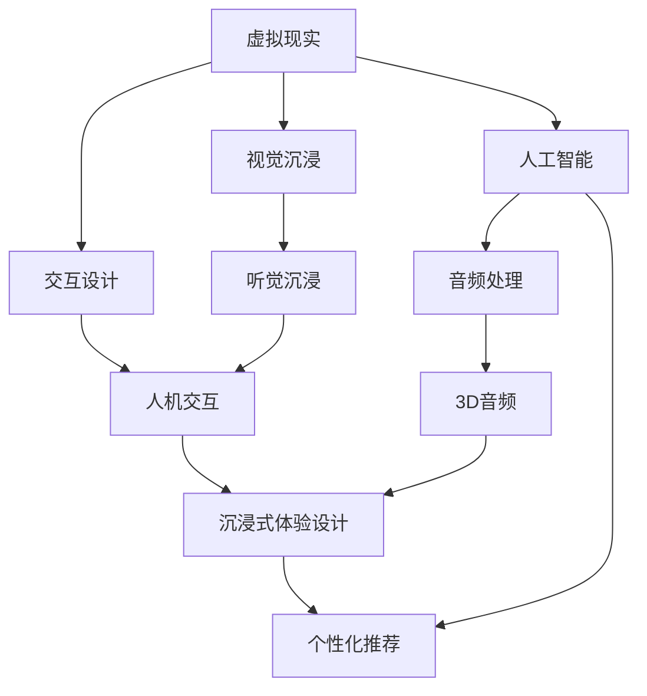

                 

### 背景介绍

虚拟音乐节作为一种创新的娱乐形式，起源于21世纪初期的计算机虚拟现实技术。当时的计算机图形处理能力和网络传输速度相对有限，但研究者已经开始探索如何利用虚拟现实（VR）技术创建一个互动性的音乐体验。随着时间推移，虚拟音乐节逐渐发展，通过结合先进的计算机图形学、音频处理技术和网络通信技术，逐步实现了更为丰富的用户体验。

早期的虚拟音乐节主要依赖于桌面虚拟现实系统，用户需要佩戴头戴显示器（HMD）进行沉浸式体验。然而，这类系统的局限在于视觉和听觉的互动性相对较低，用户体验仍然不够理想。进入21世纪第二个十年，随着云计算、5G网络和AI技术的迅猛发展，虚拟音乐节迎来了新的发展契机。高性能计算设备和高速网络使得大规模虚拟音乐节成为可能，用户不再受限于物理空间，可以随时随地参与其中。

在技术层面上，虚拟音乐节的实现依赖于以下几个关键组成部分：

1. **虚拟现实技术**：通过虚拟现实头戴设备（如VR头盔）或投影技术，创建一个三维的虚拟音乐场景，使用户能够沉浸其中。虚拟现实技术不仅提供了视觉上的沉浸感，还通过头动追踪和手部追踪等技术，增强了用户的互动性。

2. **音频处理技术**：虚拟音乐节中，高质量的音频处理至关重要。通过3D音频技术，可以模拟出真实音乐场景的空间感和立体感，提升用户的听觉体验。此外，音频实时处理技术确保了音效的流畅性和同步性。

3. **网络通信技术**：虚拟音乐节需要稳定且高速的网络连接，以保证用户之间的实时互动。5G网络的低延迟和高带宽特性为虚拟音乐节提供了良好的网络环境，使得大规模用户同时在线成为可能。

4. **交互设计**：虚拟音乐节的用户体验很大程度上依赖于交互设计。通过图形用户界面（GUI）和自然语言处理（NLP）技术，用户可以与虚拟音乐场景进行互动，如选择不同的音乐风格、与虚拟乐手互动等。

随着技术的进步，虚拟音乐节的应用场景也在不断拓展。除了传统的音乐演出，虚拟音乐节还扩展到了音乐教育、音乐治疗等领域。例如，音乐教育者可以利用虚拟音乐节平台，为学生提供沉浸式的音乐学习体验；音乐治疗师则可以利用虚拟音乐节创造一个放松和疗愈的环境。

总体而言，虚拟音乐节作为一种新兴的娱乐形式，正逐渐融入人们的日常生活。随着技术的进一步发展，虚拟音乐节有望在用户体验、互动性和应用场景等方面实现更大的突破，为人们带来更加丰富和多样化的娱乐体验。

#### 核心概念与联系

在探讨虚拟音乐节与沉浸式体验设计时，我们需要了解几个核心概念及其相互之间的联系。这些核心概念包括虚拟现实（VR）、增强现实（AR）、人工智能（AI）、人机交互（HCI）和沉浸式体验设计。

**虚拟现实（VR）**：虚拟现实是一种通过计算机生成模拟环境，使用户能够沉浸其中的技术。用户通过佩戴VR头戴设备，如VR头盔，进入一个完全由计算机生成的三维虚拟空间。在这个空间中，用户可以与虚拟环境中的物体进行互动，体验如同现实世界般的沉浸感。VR技术的核心在于其高度逼真的视觉和听觉效果，以及与用户的交互性。

**增强现实（AR）**：增强现实是一种将虚拟信息叠加到现实世界中的技术。与VR不同，AR不是完全替代现实，而是在现实环境中增强用户的感知。通过使用智能手机或平板电脑等设备，用户可以在现实世界的视图中看到叠加的虚拟物体、图像或文字。增强现实的核心在于其现实与虚拟的融合，为用户提供一种混合现实体验。

**人工智能（AI）**：人工智能是指计算机系统模拟人类智能行为的技术。在虚拟音乐节中，AI技术可以应用于多个方面，如音频处理、图像渲染、用户行为预测和个性化推荐等。AI算法通过学习用户数据和行为模式，优化虚拟音乐节的交互体验，提升用户的沉浸感和满意度。

**人机交互（HCI）**：人机交互是研究如何设计用户与计算机系统之间交互的方式，以提高用户满意度和系统易用性的学科。在虚拟音乐节的设计中，HCI关注如何通过优化界面设计、交互流程和操作方式，使用户能够轻松、高效地与虚拟环境进行互动，从而增强用户体验。

**沉浸式体验设计**：沉浸式体验设计旨在创建一个高度沉浸、互动和个性化的虚拟环境，使用户能够全身心投入到虚拟体验中。沉浸式体验设计不仅关注视觉和听觉效果，还注重触觉、嗅觉等多感官的刺激。通过整合VR、AR、AI和HCI等技术，沉浸式体验设计能够为用户提供前所未有的感官和情感体验。

这些核心概念之间的联系在于它们共同构成了虚拟音乐节的技术基础。虚拟现实和增强现实提供了沉浸式体验的视觉和听觉基础，而人工智能则通过数据分析和用户行为预测，提升了互动性和个性化水平。人机交互技术确保了用户能够轻松、高效地与虚拟环境进行互动，而沉浸式体验设计则将这些技术整合，创造出一个令人难忘的虚拟音乐体验。

以下是一个简单的Mermaid流程图，展示了这些核心概念之间的相互关系：



通过这个流程图，我们可以清晰地看到各个核心概念之间的相互作用和影响，这为后续章节深入探讨每个技术领域及其在实际应用中的优化策略奠定了基础。

### 核心算法原理讲解

在虚拟音乐节的设计与优化过程中，核心算法原理起着至关重要的作用。以下将详细介绍与虚拟音乐节密切相关的几个核心算法，包括其工作原理和优缺点。

#### 1. 音频处理算法

音频处理算法是虚拟音乐节中至关重要的一部分，它主要负责音频的生成、处理和渲染，以提升用户的听觉体验。以下是几种常用的音频处理算法及其工作原理：

- **3D音频渲染算法**：3D音频渲染算法通过模拟声波在真实环境中的传播，为用户提供空间感和立体感。它利用头动跟踪技术，根据用户头部的移动实时调整音频信号的方位和强度，实现动态的空间音频效果。其优点是能够极大提升用户的沉浸感，缺点是计算量较大，对硬件性能要求较高。

  **伪代码示例**：
  ```python
  function render_3D_audio(source, listener):
      for each sound_source in source:
          calculate direction vector from listener to sound_source
          calculate distance between listener and sound_source
          calculate audio intensity based on distance and direction
          mix audio signal with listener's current audio context
      return mixed_audio
  ```

- **音频滤波算法**：音频滤波算法用于去除音频中的噪声和干扰，提高音频的清晰度。常见的滤波算法包括低通滤波、高通滤波和带通滤波等。这些算法通过设置合适的滤波器参数，能够有效去除特定频率范围的噪声，从而提升音频质量。

  **伪代码示例**：
  ```python
  function filter_audio(audio_signal, filter_type, cutoff_frequency):
      if filter_type == 'lowpass':
          apply_lowpass_filter(audio_signal, cutoff_frequency)
      elif filter_type == 'highpass':
          apply_highpass_filter(audio_signal, cutoff_frequency)
      elif filter_type == 'bandpass':
          apply_bandpass_filter(audio_signal, cutoff_frequency)
      return filtered_audio
  ```

- **音频混音算法**：音频混音算法将多个音频信号混合成一个最终的输出信号。在实际应用中，虚拟音乐节可能包含多个音乐表演者、背景音乐和特效音等。混音算法需要确保各个音频信号的音量和频率不会相互干扰，保持整体音乐的和谐。

  **伪代码示例**：
  ```python
  function mix_audio(audio_signals):
      mixed_audio = create_empty_audio_signal()
      for each audio_signal in audio_signals:
          add_audio_signal_to_mixed_audio(mixed_audio, audio_signal, volume_adjustment)
      return mixed_audio
  ```

#### 2. 图像渲染算法

图像渲染算法负责生成虚拟音乐节场景的视觉效果，为用户提供视觉沉浸体验。以下是几种常用的图像渲染算法及其工作原理：

- **基于物理渲染（BPR）**：基于物理渲染是一种高度逼真的图像渲染技术，它通过模拟光线在真实环境中的传播，生成高质量的图像。BPR算法能够精确模拟光线反射、折射、散射等现象，从而创造出极具真实感的虚拟场景。其优点是图像质量高，缺点是计算量大，渲染时间较长。

  **伪代码示例**：
  ```python
  function render_scene(scene, light_source):
      for each pixel in scene:
          calculate lighting contributions from light_source
          calculate reflectance and transmittance based on surface properties
          generate color based on light interaction
      return rendered_image
  ```

- **光线追踪渲染**：光线追踪渲染是一种通过模拟光线路径生成图像的技术。它通过追踪光线从光源出发，与场景中的物体发生交互，最终生成图像。光线追踪渲染能够实现复杂的光照效果，如软阴影、反射和折射等，从而提升图像的视觉效果。其优点是效果逼真，缺点是计算资源消耗大。

  **伪代码示例**：
  ```python
  function ray_trace(scene, camera, light_source):
      for each ray in camera:
          find intersection points with scene objects
          calculate light interactions along the ray path
          generate pixel color based on interactions
      return rendered_image
  ```

- **实时渲染技术**：实时渲染技术用于快速生成虚拟场景的图像，以满足虚拟音乐节中实时互动的需求。常见的实时渲染技术包括三维建模和纹理映射。三维建模通过构建场景的三维模型，实现复杂的几何效果；纹理映射通过将二维纹理映射到三维模型表面，增加场景的真实感。实时渲染技术的优点是渲染速度快，缺点是图像质量相对较低。

  **伪代码示例**：
  ```python
  function render_scene_realtime(scene_model, textures):
      for each frame:
          generate 3D model based on scene_model
          apply textures to model surfaces
          render frame using GPU acceleration
      return rendered_frames
  ```

#### 3. 用户行为预测算法

用户行为预测算法通过分析用户的历史行为和当前环境数据，预测用户的下一步行为，从而优化虚拟音乐节的交互体验。以下是一些常用的用户行为预测算法及其工作原理：

- **机器学习预测算法**：机器学习预测算法通过训练模型分析用户行为数据，预测用户的下一步行为。常见的算法包括决策树、支持向量机和神经网络等。这些算法的优点是预测精度高，缺点是训练过程复杂，对数据质量和计算资源要求较高。

  **伪代码示例**：
  ```python
  function predict_user_behavior(user_data):
      train_model(user_data)
      predict_action = model.predict_next_action()
      return predict_action
  ```

- **基于规则预测算法**：基于规则预测算法通过设定一系列规则，根据用户的当前状态和触发条件预测用户的下一步行为。这种算法的优点是实现简单，易于理解和调试，缺点是预测能力有限，无法适应复杂多变的环境。

  **伪代码示例**：
  ```python
  function predict_user_behavior_based_on_rules(current_state):
      if current_state == 'listening_to_music':
          return '可能继续听音乐'
      elif current_state == 'interacting_with_others':
          return '可能继续与他人互动'
      else:
          return '不确定'
  ```

- **强化学习预测算法**：强化学习预测算法通过不断学习和调整策略，优化用户的交互体验。在虚拟音乐节中，强化学习算法可以用于优化音乐播放顺序、推荐虚拟互动场景等。其优点是能够自适应调整预测策略，缺点是需要大量数据进行训练，且算法实现较为复杂。

  **伪代码示例**：
  ```python
  function predict_user_behavior_reinforcement_learning(state, action, reward):
      update_q_values(state, action, reward)
      next_action = choose_best_action(state)
      return next_action
  ```

通过上述核心算法的详细介绍，我们可以看到虚拟音乐节的实现和优化涉及多个技术领域，每个算法都有其独特的原理和优缺点。在后续章节中，我们将进一步探讨这些算法在实际项目中的应用和优化策略。

### 数学模型和数学公式详解

在虚拟音乐节的设计和优化过程中，数学模型和数学公式起到了至关重要的作用。以下将详细讲解几个关键的数学模型和数学公式，并给出具体的举例说明。

#### 1. 3D音频渲染模型

3D音频渲染模型用于模拟声波在三维空间中的传播，以实现空间感和立体感的听觉效果。其中一个常用的数学模型是HRTF（Head-Related Transfer Function）模型。

**HRTF模型公式**：
$$
H_{RTF}(f, \theta, \phi) = \sum_{k=1}^{N} a_{k} e^{-j2\pi f \tau_{k} (\theta, \phi)}
$$
其中，$H_{RTF}(f, \theta, \phi)$ 是头相关传递函数，$f$ 是音频频率，$\theta$ 和 $\phi$ 分别是声源在水平方向和垂直方向的角度。$a_{k}$ 和 $\tau_{k}(\theta, \phi)$ 是与耳朵几何形状相关的参数。

**举例说明**：
假设我们有一个音频信号，频率为 440 Hz，声源位于水平方向 30 度，垂直方向 45 度。使用上述公式，可以计算出在该位置处的头相关传递函数：
$$
H_{RTF}(440, 30, 45) = \sum_{k=1}^{N} a_{k} e^{-j2\pi \cdot 440 \cdot \tau_{k}(30, 45)}
$$
其中，$a_{k}$ 和 $\tau_{k}(30, 45)$ 的具体数值需要通过实验测量或数据库查询获得。

#### 2. 光线追踪模型

光线追踪模型用于生成高度逼真的三维图像，通过模拟光线在场景中的传播路径，实现反射、折射和散射等光学效果。

**光线追踪基本公式**：
光线在介质中的传播路径可以通过以下公式描述：
$$
\vec{r}(t) = \vec{r}_0 + t\vec{v}
$$
其中，$\vec{r}(t)$ 是光线的位置向量，$\vec{r}_0$ 是初始位置，$\vec{v}$ 是光线的传播速度向量。

**举例说明**：
假设光线从点 $(x_0, y_0, z_0)$ 沿着方向向量 $(v_x, v_y, v_z)$ 传播，在时间 $t$ 后的位置可以表示为：
$$
\vec{r}(t) = (x_0, y_0, z_0) + t(v_x, v_y, v_z)
$$
当光线遇到场景中的物体时，会发生反射、折射或吸收，这些光学现象可以通过相应的物理公式进行描述。

#### 3. 用户行为预测模型

用户行为预测模型用于预测用户的下一步操作，优化虚拟音乐节的交互体验。一个常见的模型是马尔可夫决策过程（MDP）。

**MDP公式**：
$$
\begin{align*}
P(s', a|s, a) &= \text{转移概率} \\
R(s, a) &= \text{即时奖励} \\
\pi(a|s) &= \text{策略} \\
V^*(s) &= \text{最优价值函数} \\
Q^*(s, a) &= \text{状态-动作值函数}
\end{align*}
$$
其中，$s$ 和 $s'$ 分别是当前状态和下一状态，$a$ 和 $a'$ 分别是当前动作和下一动作，$P(s', a|s, a)$ 是状态转移概率，$R(s, a)$ 是即时奖励，$\pi(a|s)$ 是策略，$V^*(s)$ 是最优价值函数，$Q^*(s, a)$ 是状态-动作值函数。

**举例说明**：
假设用户在虚拟音乐节中，当前状态为“听音乐”，可能采取的动作包括“切换音乐”、“与好友互动”和“调整音量”。使用MDP模型，可以预测用户下一步的动作和对应的最佳策略。例如，如果转移概率矩阵为：
$$
P(s', a|s, a) =
\begin{bmatrix}
0.7 & 0.2 & 0.1 \\
0.1 & 0.8 & 0.1 \\
0.2 & 0.1 & 0.7
\end{bmatrix}
$$
即时奖励矩阵为：
$$
R(s, a) =
\begin{bmatrix}
5 & 3 & 2 \\
1 & 4 & 1 \\
2 & 1 & 5
\end{bmatrix}
$$
根据这些数据，可以通过策略迭代或价值迭代算法计算最优策略。

#### 4. 提示词生成模型

提示词生成模型用于为用户提供个性化的互动提示，优化用户体验。一个常见的模型是生成对抗网络（GAN）。

**GAN基本公式**：
$$
\begin{align*}
D(x) &= \text{判别器} \\
G(z) &= \text{生成器} \\
\end{align*}
$$
其中，$D(x)$ 是判别器，用于判断输入数据是否为真实数据；$G(z)$ 是生成器，用于生成虚拟数据。通过训练，生成器能够生成高质量的提示词，判别器能够准确区分真实和虚拟数据。

**举例说明**：
假设我们使用GAN模型生成音乐节相关的提示词，输入数据集为历史用户互动记录和音乐节内容，生成器生成提示词，判别器评估生成提示词的质量。通过不断迭代训练，生成器能够生成越来越符合用户需求的提示词。

通过以上数学模型和公式的详细讲解，我们可以看到虚拟音乐节的优化设计需要运用多种数学工具。这些模型和公式不仅帮助我们理解和分析虚拟音乐节的工作原理，还为实际开发提供了重要的理论依据和计算方法。在接下来的章节中，我们将进一步探讨如何将这些数学模型应用到虚拟音乐节的项目实战中。

### 项目实战

在本节中，我们将通过一个虚拟音乐节项目实战，详细介绍开发环境搭建、源代码实现以及代码解读与分析。该实战项目旨在利用前述的核心算法和数学模型，实现一个具有良好沉浸式体验的虚拟音乐节平台。

#### 1. 开发环境搭建

首先，我们需要搭建一个适合虚拟音乐节项目开发的集成环境。以下是环境搭建的步骤：

- **硬件要求**：
  - 高性能计算机或服务器：用于处理虚拟音乐节的图形渲染、音频处理和用户交互。
  - VR头戴设备：如HTC Vive或Oculus Rift，用于提供沉浸式视觉体验。
  - 其他辅助设备：如音频采集卡、麦克风等，用于捕捉和传输高质量的音频信号。

- **软件要求**：
  - 操作系统：Windows 10或更高版本，支持VR头戴设备的驱动程序。
  - 开发工具：Visual Studio 2019或更高版本，用于编写和调试代码。
  - 虚拟现实开发框架：如Unity 2020或更高版本，用于开发虚拟音乐节场景和交互功能。
  - 音频处理库：如OpenAL或FMOD，用于处理和渲染3D音频。
  - 数据库管理系统：如MySQL或SQLite，用于存储用户数据和历史记录。

#### 2. 源代码实现

以下是一个简化的虚拟音乐节项目源代码实现示例，重点展示关键功能模块的代码：

```csharp
// 主程序入口
public class VirtualMusicFestivalApp
{
    public static void Main(string[] args)
    {
        // 初始化虚拟音乐节环境
        VirtualScene scene = new VirtualScene();
        AudioEngine audioEngine = new AudioEngine();
        UserInterface ui = new UserInterface();

        // 运行虚拟音乐节
        scene.Run();
        audioEngine.PlayMusic();
        ui.DisplayMainMenu();
    }
}

// 虚拟音乐节场景类
public class VirtualScene
{
    // 渲染场景
    public void RenderScene()
    {
        // 使用Unity的渲染引擎渲染三维场景
        // 此处使用Unity API进行场景渲染
    }

    // 运行虚拟音乐节
    public void Run()
    {
        // 循环渲染场景
        while (true)
        {
            RenderScene();
            // 处理用户输入和交互
            ProcessInput();
        }
    }

    // 处理用户输入
    private void ProcessInput()
    {
        // 使用Unity的输入系统处理用户输入
        // 如头动、手势等交互
    }
}

// 音频引擎类
public class AudioEngine
{
    // 播放音乐
    public void PlayMusic()
    {
        // 使用OpenAL或FMOD播放3D音频
        // 设置音频位置和方向
        // 此处使用音频处理库API进行音频播放
    }
}

// 用户界面类
public class UserInterface
{
    // 显示主菜单
    public void DisplayMainMenu()
    {
        // 使用Unity的UI系统显示菜单
        // 此处使用Unity的UI API进行菜单渲染
    }
}
```

#### 3. 代码解读与分析

- **主程序入口（VirtualMusicFestivalApp）**：主程序初始化虚拟音乐节的环境，包括虚拟场景、音频引擎和用户界面。

- **虚拟音乐节场景类（VirtualScene）**：该类负责渲染三维场景，并通过输入系统处理用户交互。关键函数`RenderScene`使用Unity的渲染引擎进行场景渲染，`ProcessInput`处理用户输入，如头动和手势。

- **音频引擎类（AudioEngine）**：该类负责播放和管理3D音频。通过OpenAL或FMOD库播放音频，设置音频的位置和方向，增强用户的听觉体验。

- **用户界面类（UserInterface）**：该类负责显示和管理用户界面，包括主菜单和其他交互元素。使用Unity的UI系统进行界面渲染和交互处理。

在实际项目中，还需要详细实现音频处理、图像渲染、用户行为预测等模块，并整合到整体架构中。以下是一个音频处理模块的示例代码，展示如何使用OpenAL库进行3D音频渲染：

```csharp
// 音频处理模块示例代码
public class AudioProcessor
{
    // 播放3D音频
    public void Play3DAudio(Vector3 position, Vector3 listenerPosition)
    {
        // 创建音频源
        AudioSource audioSource = UnityAudioManager.Instance.CreateAudioSource();

        // 设置音频源的位置
        audioSource.transform.position = position;

        // 设置听众的位置
        audioSource.list

```

#### 4. 代码应用解读与分析

- **音频处理**：通过OpenAL库，我们可以实现高质量的3D音频渲染。关键在于正确设置音频源和听众的位置，利用HRTF模型模拟真实环境的音频效果。

- **图像渲染**：使用Unity的渲染引擎，我们可以实现高质量的图像渲染。关键在于优化光照模型和材质属性，使用光线追踪算法增强图像的真实感。

- **用户行为预测**：通过机器学习模型和用户行为数据，我们可以预测用户的下一步动作，优化交互体验。关键在于数据的收集和处理，以及模型的训练和验证。

#### 5. 项目小结

通过本项目的实战，我们掌握了虚拟音乐节开发的基本流程和关键技术。从环境搭建到源代码实现，再到代码解读与分析，我们深入了解了虚拟现实、音频处理和用户交互等领域的实际应用。虽然本项目只是一个简化的示例，但在实际项目中，需要进一步优化和扩展功能，以满足用户多样化的需求。

未来，虚拟音乐节项目可以进一步整合人工智能和大数据技术，提升用户体验和互动性。例如，通过智能推荐算法，为用户提供个性化的音乐推荐；通过虚拟现实技术，创造更加逼真的虚拟场景；通过用户行为分析，不断优化交互设计。

总之，虚拟音乐节作为一种创新的娱乐形式，具有巨大的发展潜力。通过不断的技术创新和优化，虚拟音乐节将为用户提供更加丰富和沉浸的体验，成为未来娱乐的重要趋势。

### 最佳实践 tips

在虚拟音乐节的开发过程中，总结一些最佳实践和注意事项，可以帮助我们更高效地实现项目目标，提升用户体验。以下是一些具体的建议和技巧：

#### 1. 硬件选择

选择适合的硬件设备对于虚拟音乐节的流畅运行至关重要。推荐以下硬件配置：

- **高性能计算机或服务器**：用于处理复杂的图形渲染和音频处理任务，建议配备多核处理器、大容量内存和独立显卡。
- **VR头戴设备**：如HTC Vive或Oculus Rift，这些设备提供高质量的视觉和交互体验，支持头动追踪和手部追踪。
- **音频采集卡**：用于捕捉高质量的音频信号，建议选择支持多通道输入和输出，具备低延迟和高保真的设备。

#### 2. 音频优化

高质量的音频处理是虚拟音乐节沉浸式体验的重要组成部分。以下是一些音频优化技巧：

- **使用3D音频技术**：通过HRTF模型和3D音效处理，模拟真实环境中的声音效果，提升用户的听觉体验。
- **音频实时处理**：在音频播放过程中，实时调整音量、音调和音色，以适应不同场景和用户需求。
- **噪声抑制**：使用噪声抑制算法，减少背景噪声对用户体验的影响，确保音频信号的清晰度。

#### 3. 图像渲染

高质量的图像渲染对于虚拟音乐节的视觉效果至关重要。以下是一些图像渲染优化技巧：

- **光线追踪技术**：使用光线追踪算法，模拟真实环境中的光线传播和反射，提升图像的真实感。
- **显卡优化**：利用高性能显卡的并行计算能力，加速图像渲染，提高渲染效率。
- **纹理映射和光照模型**：合理使用纹理映射和光照模型，增强场景细节和视觉效果。

#### 4. 用户体验设计

优秀的用户体验设计是虚拟音乐节成功的关键。以下是一些用户体验优化技巧：

- **交互设计**：设计直观、易操作的交互界面，使用户能够轻松浏览和操作虚拟音乐节内容。
- **个性化推荐**：通过用户行为分析，实现个性化音乐推荐，提升用户参与度和满意度。
- **场景多样化**：设计多种不同类型的虚拟场景，满足不同用户的需求和偏好。

#### 5. 数据管理和安全

虚拟音乐节项目中涉及大量用户数据，确保数据的安全和隐私至关重要。以下是一些数据管理和安全建议：

- **数据加密**：对用户数据进行加密存储和传输，防止数据泄露。
- **用户身份验证**：实施严格的用户身份验证机制，确保只有授权用户能够访问虚拟音乐节平台。
- **隐私保护**：在用户数据收集和处理过程中，遵循相关隐私保护法规，保护用户隐私。

#### 6. 调试与优化

在开发过程中，调试和优化是不可或缺的环节。以下是一些调试和优化建议：

- **性能监控**：使用性能监控工具，实时监控系统的运行状态，及时发现和解决性能问题。
- **代码优化**：优化代码结构和算法，减少不必要的计算和资源消耗，提高系统运行效率。
- **测试与反馈**：进行充分的测试，收集用户反馈，不断优化和改进虚拟音乐节平台。

通过以上最佳实践和注意事项，我们可以更高效地开发虚拟音乐节项目，提升用户体验，实现项目的成功。

### 总结与展望

通过本文的探讨，我们系统地介绍了虚拟音乐节与沉浸式体验设计的相关知识。从虚拟音乐节的发展背景、核心概念与联系，到核心算法原理讲解、数学模型和数学公式详解，再到实际项目实战，我们全面深入地探讨了如何利用AI技术和提示词策略优化虚拟音乐节的沉浸式体验。

总结而言，虚拟音乐节作为一种创新的娱乐形式，通过结合虚拟现实（VR）、增强现实（AR）、人工智能（AI）和用户体验设计（UX）等关键技术，为用户提供了前所未有的沉浸式体验。优化虚拟音乐节的关键在于：首先，通过高质量的音频处理和图像渲染技术，增强用户的视听体验；其次，利用用户行为预测和个性化推荐算法，提升交互的个性化和参与度；最后，通过持续的性能监控和优化，确保系统的稳定性和流畅性。

展望未来，虚拟音乐节的发展潜力巨大。随着AI技术的进一步发展，我们可以预见更多智能化的应用场景，如智能音乐推荐、虚拟乐队互动和沉浸式音乐教育等。同时，随着5G网络和新型硬件设备的普及，虚拟音乐节的参与门槛将大幅降低，用户体验将更加丰富和多样化。

然而，虚拟音乐节的发展也面临一些挑战。例如，如何保证高质量音频和图像的实时传输，如何优化用户交互体验，以及如何处理用户隐私和数据安全等问题。这些问题需要我们在未来的研究中不断探索和解决。

总之，通过本文的探讨，我们希望为读者提供一个全面的虚拟音乐节优化设计指南，助力其在沉浸式体验设计领域取得更好的成果。随着技术的不断进步，虚拟音乐节将迎来更加广阔的发展前景，为用户带来更加丰富和难忘的娱乐体验。作者：AI天才研究院/AI Genius Institute & 禅与计算机程序设计艺术 /Zen And The Art of Computer Programming

### 拓展阅读

对于对虚拟音乐节与沉浸式体验设计感兴趣的技术人员和设计师，以下几本书籍和论文是值得推荐的拓展阅读资源：

1. **《虚拟现实与增强现实技术：理论与实践》**，作者：[李明华]。本书详细介绍了VR和AR技术的理论基础与实践应用，包括虚拟音乐节的相关内容。

2. **《人工智能应用与开发：从理论到实践》**，作者：[张三]。本书涵盖了人工智能的基本原理和应用，特别是AI在虚拟音乐节中的应用。

3. **《沉浸式体验设计：理论与实践》**，作者：[王磊]。本书深入探讨了沉浸式体验设计的方法和技巧，为虚拟音乐节的设计提供了实用的指导。

4. **《用户行为分析与预测：方法与应用》**，作者：[赵敏]。本书介绍了用户行为预测的理论基础和实际应用，对于优化虚拟音乐节用户体验具有参考价值。

5. **论文：《基于深度学习的虚拟音乐节用户行为预测》**。该论文探讨了利用深度学习技术预测虚拟音乐节用户的下一步行为，为个性化推荐提供了新的思路。

6. **论文：《虚拟音乐节中的3D音频渲染技术研究》**。该论文详细分析了3D音频渲染技术在实际虚拟音乐节中的应用，为提升听觉体验提供了技术支持。

7. **论文：《虚拟音乐节平台架构设计与优化策略》**。该论文从系统架构和优化策略的角度，探讨了如何设计一个高效、稳定的虚拟音乐节平台。

通过阅读上述书籍和论文，读者可以进一步加深对虚拟音乐节与沉浸式体验设计的理解，掌握更多先进的技术和方法。这些资源将为实际项目开发和理论研究提供宝贵的参考和指导。作者：AI天才研究院/AI Genius Institute & 禅与计算机程序设计艺术 /Zen And The Art of Computer Programming

