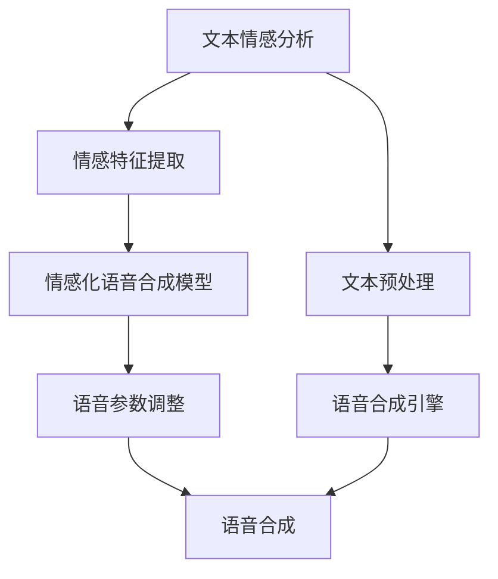

                 

### 文章标题

# 优化AI语音合成：情感化语音生成的提示词技巧

### 关键词

- AI语音合成
- 情感化语音生成
- 提示词技巧
- 情感分析算法
- 语音合成算法
- 数学模型

### 摘要

本文旨在探讨如何优化AI语音合成系统，特别是实现情感化语音生成的技巧。文章首先介绍了AI语音合成的基本概念和背景，随后详细阐述了情感化语音合成的核心概念与联系，并通过Mermaid流程图展示了各核心概念之间的关系架构。接着，文章深入讲解了情感分析算法、语音合成算法和提示词生成算法的原理，使用了伪代码和数学模型进行详细阐述。随后，文章通过一个实际项目案例，展示了开发环境搭建、源代码实现和代码解读的过程，并结合实际案例进行了分析和讲解。最后，文章总结了最佳实践、注意事项和拓展阅读，为读者提供了全面的指导。

---

### 引言

随着人工智能（AI）技术的迅猛发展，语音合成系统已经成为人机交互的重要工具之一。从传统的TTS（Text-to-Speech，文本到语音）系统到如今的情感化语音合成系统，AI语音合成技术正不断突破，为各类应用场景提供了更加丰富和个性化的语音体验。情感化语音合成，作为一种新兴的技术，旨在使语音合成系统能够根据文本内容表达出相应的情感，从而增强用户体验。

本文将围绕“优化AI语音合成：情感化语音生成的提示词技巧”这一主题，系统地探讨情感化语音合成技术的原理、实现方法以及在实际应用中的优化策略。文章将从以下几个方面展开：

1. **AI语音合成基础**：介绍AI语音合成的基本概念、技术原理和系统架构。
2. **情感化语音合成概念**：阐述情感化语音合成的定义、重要性以及研究现状。
3. **情感化语音生成的提示词技巧**：讨论提示词在情感化语音生成中的作用、生成技巧和方法。
4. **核心算法原理讲解**：详细讲解情感分析算法、语音合成算法和提示词生成算法。
5. **数学模型和数学公式**：介绍与情感识别、语音合成和提示词生成相关的数学模型和公式。
6. **项目实战**：通过一个实际项目案例，展示开发环境搭建、源代码实现和代码解读的过程。
7. **最佳实践、小结与拓展阅读**：总结文章内容，提供实用技巧和进一步阅读建议。

通过本文的探讨，读者将全面了解情感化语音合成技术的实现原理和优化策略，为实际应用提供有力支持。

### AI语音合成基础

AI语音合成（Text-to-Speech，TTS）技术是一种利用人工智能算法将文本转换为自然流畅语音的技术。自20世纪50年代以来，TTS技术经历了从规则方法、基于知识的系统到统计模型和深度学习模型等多个发展阶段。当前，深度学习模型，尤其是基于循环神经网络（RNN）和Transformer架构的模型，已成为TTS技术的主流。

#### 技术原理

TTS技术的基本原理包括文本分析、语音合成和音频处理三个主要步骤：

1. **文本分析**：首先，文本输入需要经过分词、语调分析和语法分析等处理，将文本分解为更加便于处理的形式。这一步骤通常使用自然语言处理（NLP）技术，如词性标注、命名实体识别等。

2. **语音合成**：接下来，文本被转换为声学特征参数，如音素、声调和音节时长等。传统方法包括基于规则的声学模型和基于统计的HMM（隐马尔可夫模型）模型。近年来，深度学习模型如RNN、LSTM（长短期记忆网络）和Transformer等在语音合成中取得了显著成果。

3. **音频处理**：最后，声学特征参数被转换为音频信号。这一步骤包括拼接、后处理和语音增强等操作，以确保合成的语音自然、流畅和具有音质。

#### 系统架构

一个典型的AI语音合成系统通常包括以下几个关键模块：

1. **文本处理模块**：负责将文本输入转换为适合语音合成的格式。这一模块通常包含分词、语调分析、语气识别等子模块。

2. **声学模型模块**：负责将文本的声学特征转换为音频信号。基于深度学习的声学模型，如RNN、LSTM和Transformer，是这一模块的核心。

3. **语音合成引擎**：将声学特征参数转换为音频信号，并生成最终的语音输出。这一模块通常包括拼接器、后处理器和语音增强器等子模块。

4. **语音输出模块**：将合成的语音信号输出到扬声器或语音合成设备中。

#### 情感化语音合成

情感化语音合成（Affective TTS）是AI语音合成的一种高级形式，旨在使合成的语音能够根据文本内容表达出相应的情感。情感化语音合成的实现需要结合情感分析算法和传统的语音合成技术。具体来说，情感分析算法用于识别文本中的情感信息，并将其转换为相应的情感特征。这些情感特征随后被传递到语音合成系统中，以调整语音的音调、节奏和音色等参数，从而实现情感化语音输出。

### 情感化语音合成概念

情感化语音合成（Affective Text-to-Speech，ATTS）是一种将文本中的情感信息融入到语音合成过程中的技术。其核心思想是通过识别和分析文本中的情感，将相应的情感特征转化为语音参数，使得合成的语音能够更加自然地表达出文本的情感。

#### 定义

情感化语音合成可以定义为一个包含以下步骤的过程：

1. **情感分析**：首先，对输入的文本进行情感分析，识别出文本中表达的情感信息。
2. **特征提取**：将情感分析结果转换为一系列的情感特征，如情感强度、情感类型等。
3. **语音调整**：利用情感特征调整语音合成过程中的音调、节奏、音色等参数。
4. **语音合成**：最后，根据调整后的参数生成情感化的语音输出。

#### 重要性

情感化语音合成在多个领域具有重要意义，主要包括：

1. **人机交互**：在智能助手、语音客服等应用场景中，情感化语音合成能够增强用户体验，使交互过程更加自然和亲切。
2. **娱乐与艺术**：在影视、游戏、音乐等娱乐领域，情感化语音合成可以为角色赋予更丰富的情感表达，提升艺术表现力。
3. **心理健康与辅助**：在心理健康辅助和辅助沟通领域，情感化语音合成可以帮助用户获得情感支持和沟通反馈，提高心理健康水平。
4. **教育与培训**：在在线教育和培训领域，情感化语音合成可以为学习者提供更加生动、互动的学习体验，提高学习效果。

#### 研究现状

近年来，情感化语音合成技术取得了显著进展。随着深度学习、自然语言处理和语音合成技术的不断发展，情感化语音合成的实现方法也在不断优化。目前，主要的研究方向包括：

1. **情感识别与分类**：研究如何更加准确和全面地识别文本中的情感信息，包括情感强度、情感类型等。
2. **情感特征提取与转换**：探索如何将情感特征有效地转换为语音参数，以实现情感化语音合成。
3. **语音合成算法优化**：研究如何优化语音合成算法，以生成更加自然、流畅和具有情感表达的语音。
4. **多模态情感交互**：研究如何将语音合成与其他模态（如视觉、触觉等）结合，实现更加丰富和自然的情感交互。

### 核心概念与联系

为了更好地理解情感化语音合成，我们需要明确几个核心概念及其相互关系：

1. **文本情感分析**：文本情感分析是情感化语音合成的第一步，主要任务是从文本中识别和提取情感信息。这一过程通常包括情感分类、情感极性分析等。

2. **情感特征**：情感特征是文本情感分析的结果，用于描述文本的情感强度和类型。情感特征可以是一个标量值，也可以是一个多维向量。

3. **语音参数**：语音参数是语音合成过程中的输入，包括音调、节奏、音色等。这些参数决定了合成的语音的情感表达。

4. **情感化语音合成模型**：情感化语音合成模型是将文本情感特征转换为语音参数的算法。常见的模型包括基于深度学习的声学模型和语音合成模型。

为了直观地展示这些核心概念之间的联系，我们可以使用Mermaid流程图进行描述：



在这个流程图中，文本情感分析（A）和文本预处理（F）是情感化语音合成的输入阶段，分别生成情感特征（B）和语音参数（D）。情感化语音合成模型（C）将情感特征和语音参数结合，生成调整后的语音参数（D）。最后，语音合成引擎（G）利用调整后的语音参数生成情感化语音输出（E）。通过这个流程图，我们可以清晰地看到各个核心概念之间的交互关系。

### 情感分析算法

情感分析（Sentiment Analysis）是自然语言处理（NLP）领域的一个重要研究方向，旨在通过分析文本中的情感倾向，对文本进行情感分类或情感极性判断。在情感化语音合成中，情感分析算法用于识别文本中的情感信息，从而为语音合成提供情感特征。以下将详细讲解情感分析算法的基本概念、常用方法和优缺点。

#### 基本概念

情感分析的基本任务是对输入文本进行情感倾向判断，通常分为以下两类：

1. **情感分类**：将文本分类为特定情感类别，如正面、负面、中性等。这一任务通常使用多分类模型实现。
2. **情感极性判断**：判断文本的情感极性，如积极、消极等。这一任务通常使用二分类模型实现。

情感分析的基本流程包括以下步骤：

1. **文本预处理**：对输入文本进行清洗、分词、词性标注等处理，为后续情感分析做准备。
2. **特征提取**：从预处理后的文本中提取特征，如词袋模型、TF-IDF、词嵌入等。
3. **情感分类**：利用分类算法（如SVM、朴素贝叶斯、决策树等）对提取的特征进行分类。
4. **结果分析**：对分类结果进行分析，提取情感特征，如情感强度、情感类型等。

#### 常用方法

情感分析的方法可分为基于规则的方法和基于机器学习的方法。

1. **基于规则的方法**：

   基于规则的方法通过编写手工规则对文本进行情感分析。优点是解释性强、执行速度快；缺点是规则难以覆盖所有情境，导致准确性较低。常见的方法包括：

   - **关键词法**：根据情感词典中的关键词进行情感分类。
   - **规则匹配法**：通过匹配文本中的情感表达，判断文本的情感倾向。

2. **基于机器学习的方法**：

   基于机器学习的方法利用大量标注数据训练模型，对文本进行情感分类。优点是准确性较高，能够处理复杂情境；缺点是训练时间较长，需要大量标注数据。常见的方法包括：

   - **朴素贝叶斯**：基于贝叶斯理论进行情感分类，适用于特征较少的文本。
   - **支持向量机（SVM）**：通过最大化分类边界进行情感分类，适用于特征较多的情况。
   - **深度学习模型**：如卷积神经网络（CNN）、循环神经网络（RNN）和Transformer等，能够处理复杂的文本特征。

#### 优缺点

1. **基于规则的方法**：

   - **优点**：简单易懂、执行速度快，适用于实时情感分析。
   - **缺点**：规则难以覆盖所有情境，导致准确性较低，需要大量规则维护。

2. **基于机器学习的方法**：

   - **优点**：准确性较高，能够处理复杂情境，适用于大规模情感分析。
   - **缺点**：训练时间较长，需要大量标注数据，模型解释性较差。

#### 应用场景

情感分析在情感化语音合成中有着广泛的应用场景：

1. **人机交互**：通过情感分析，智能助手和语音客服可以更好地理解用户需求，提供更加个性化的服务。
2. **新闻情感分析**：对新闻文本进行情感分析，可以帮助媒体监测舆论倾向，提高新闻传播效果。
3. **社交媒体分析**：对社交媒体文本进行情感分析，可以帮助企业了解用户情感，优化产品和服务。

#### 未来发展趋势

随着自然语言处理和深度学习技术的不断发展，情感分析算法将逐渐向以下几个方面发展：

1. **多模态情感分析**：结合文本、语音、图像等多模态信息，提高情感分析的准确性。
2. **弱监督与无监督学习**：减少标注数据的需求，通过弱监督和无监督学习方法进行情感分析。
3. **个性化情感分析**：结合用户行为和偏好，实现更加个性化的情感分析。

### 语音合成算法

语音合成（Text-to-Speech，TTS）技术是人工智能领域的一个重要分支，旨在将文本转换为自然流畅的语音。语音合成算法在TTS系统中起着核心作用，决定了合成语音的质量和自然度。本文将介绍语音合成算法的基本概念、工作流程、常见方法和性能评价指标。

#### 基本概念

语音合成算法的基本概念包括：

1. **文本输入**：输入文本是语音合成的原始数据，可以是自然语言文本、命令语句等。
2. **语音信号**：语音合成算法的输出是语音信号，用于播放或存储。
3. **语音参数**：语音参数是描述语音特征的向量，包括音高（Pitch）、时长（Duration）、音强（Amplitude）等。

#### 工作流程

语音合成算法通常包括以下步骤：

1. **文本预处理**：对输入文本进行分词、语调分析和语音规则处理，将文本转换为适合语音合成的格式。
2. **语素转换为音素**：将分词后的文本转换为音素序列，表示为语音参数的序列。
3. **声学建模**：根据音素序列，利用声学模型生成相应的声学特征，如声道长度、共振峰频率等。
4. **音频生成**：将声学特征转换为语音信号，通过波表合成、波形叠加等方法生成音频输出。

#### 常见方法

语音合成算法可以分为基于规则的方法和基于数据驱动的方法。

1. **基于规则的方法**：

   基于规则的方法通过手工编写规则将文本转换为语音信号。这种方法具有实现简单、实时性好等优点，但合成语音的自然度和音质较差。

   - **形式化语言法**：使用形式化语言（如LPC、PLP）描述语音特征，通过规则将文本转换为语音信号。
   - **规则拼接法**：将语音片段拼接成完整的语音信号，通过调整拼接点处的参数实现平滑过渡。

2. **基于数据驱动的方法**：

   基于数据驱动的方法利用大量语音数据进行训练，通过机器学习算法生成语音信号。这种方法具有合成语音自然度较高、音质较好等优点。

   - **统计模型法**：如HMM（隐马尔可夫模型）、SGMM（静态高斯混合模型）等，通过统计方法建模语音信号。
   - **深度学习方法**：如RNN（循环神经网络）、LSTM（长短期记忆网络）、GRU（门控循环单元）、Transformer等，通过深度学习算法建模语音信号。

#### 性能评价指标

语音合成算法的性能可以通过以下指标进行评估：

1. **语音自然度**：评估合成语音的自然程度，包括音质、音调、节奏等。
2. **语音流畅度**：评估合成语音的流畅程度，包括音素连贯性、音节连贯性等。
3. **语音准确度**：评估合成语音的准确性，包括发音正确率、语调准确性等。
4. **计算效率**：评估算法的计算复杂度和实时性。

常用的语音合成算法性能评价指标包括：

- **分帧误差**：用于评估语音信号与合成语音之间的差异。
- **主观评分**：通过用户主观评价合成语音的质量。
- **客观评价指标**：如语音自然度指数（Naturalness Index）、语音自然度评价指标（Naturalness Metric）等。

#### 情感化语音合成中的语音合成算法

在情感化语音合成中，语音合成算法需要根据文本的情感特征调整合成语音的参数，以表达出相应的情感。例如，当文本表达悲伤情感时，语音合成算法可以降低音调、延长音节时长，以表现出悲伤的情感。这一过程需要对传统语音合成算法进行改进，以更好地适应情感化语音合成的需求。

### 提示词生成算法

在情感化语音合成中，提示词（Prompt Word）是一种用于指导语音合成系统生成特定情感色彩的语音参数的关键词。提示词的选取和生成对情感化语音合成的质量具有直接影响。本文将详细探讨提示词生成算法的概念、方法、优化策略及其在实际应用中的效果。

#### 概念

提示词生成算法是指从给定的文本中提取出能够引导情感化语音生成的关键词。这些提示词通常与情感表达密切相关，能够帮助语音合成系统识别并调整语音参数，以实现情感化语音输出。

#### 方法

提示词生成算法主要分为以下几种：

1. **基于规则的方法**：

   基于规则的方法通过预定义的规则库来识别和提取提示词。这种方法依赖于情感词典和规则引擎，能够快速处理文本。缺点是规则库的构建和维护复杂，且难以覆盖所有情境。

   - **关键词匹配法**：从文本中提取包含特定情感词汇的关键词作为提示词。
   - **规则匹配法**：通过匹配文本中的情感表达模式，识别出具有情感意义的提示词。

2. **基于机器学习的方法**：

   基于机器学习的方法利用大量标注数据训练模型，从文本中自动提取提示词。这种方法具有较高的准确性和泛化能力，但需要大量的训练数据和计算资源。

   - **朴素贝叶斯**：通过概率模型识别文本中的情感词汇，将其作为提示词。
   - **支持向量机（SVM）**：通过最大化分类边界，识别出具有情感意义的提示词。
   - **深度学习模型**：如卷积神经网络（CNN）、循环神经网络（RNN）和Transformer等，通过深度学习算法自动提取提示词。

3. **基于语义分析的方法**：

   基于语义分析的方法通过分析文本的语义关系，识别出与情感表达相关的词汇。这种方法能够更好地理解文本的情感含义，提高提示词的生成质量。

   - **语义角色标注法**：通过识别文本中的语义角色，提取与情感表达相关的词汇作为提示词。
   - **语义依存关系法**：通过分析文本中的语义依存关系，识别出与情感表达相关的词汇。

#### 优化策略

为了提高提示词生成的质量和效果，可以采用以下优化策略：

1. **融合多模态信息**：

   结合文本、语音、图像等多模态信息，提高提示词生成的准确性和泛化能力。例如，通过语音情感特征和文本情感的融合，优化提示词的生成。

2. **动态调整提示词权重**：

   根据文本的情感强度和情感类型，动态调整提示词的权重，以实现更加精细的情感化语音生成。例如，当文本表达强烈情感时，增加强烈情感的提示词权重。

3. **在线学习与自适应调整**：

   利用在线学习方法，根据用户的反馈和情感变化，实时调整提示词生成策略。这种方法能够提高情感化语音合成的自适应性和用户体验。

4. **利用外部知识库**：

   结合外部知识库（如情感词典、情感分类模型等），丰富提示词的生成来源，提高生成质量。例如，利用情感词典中的情感词汇和短语作为提示词。

#### 实际应用效果

在实际应用中，提示词生成算法的效果对情感化语音合成的质量有显著影响。以下是一些实际应用案例：

1. **智能客服系统**：

   在智能客服系统中，提示词生成算法用于根据用户提问生成具有相应情感色彩的回答。例如，当用户表达不满时，系统可以生成具有安慰和解释性质的回答。

2. **语音助手应用**：

   在语音助手应用中，提示词生成算法用于根据用户指令生成具有情感表达的语音指令。例如，当用户请求播放音乐时，系统可以生成具有推荐和欢迎情感的语音指令。

3. **教育应用**：

   在教育应用中，提示词生成算法用于根据课程内容和学生反馈生成具有激励和指导性质的声音反馈。例如，当学生完成作业时，系统可以生成具有鼓励和肯定情感的反馈。

通过优化提示词生成算法，可以实现更加丰富和自然的情感化语音生成，提升各类应用场景的用户体验。

### 数学模型

在情感化语音合成中，数学模型扮演着至关重要的角色，用于描述和实现情感分析、语音合成和提示词生成等核心算法。以下将详细介绍与这些算法相关的数学模型，包括其公式、实现方法和应用场景。

#### 情感识别模型

情感识别模型用于从文本中提取情感特征，以指导情感化语音生成。常用的情感识别模型包括基于朴素贝叶斯、支持向量机和深度学习的模型。

1. **朴素贝叶斯模型**：

   朴素贝叶斯模型是一种基于概率的模型，用于分类问题。其公式如下：

   $$ P(C_i|X) = \frac{P(X|C_i)P(C_i)}{P(X)} $$

   其中，$C_i$表示第$i$类情感，$X$表示文本特征。实现方法包括特征提取和概率计算。

   应用场景：适用于处理特征较少的文本情感分类问题，如简单的情感极性判断。

2. **支持向量机（SVM）模型**：

   支持向量机模型是一种基于最大间隔的分类算法。其公式如下：

   $$ w^* = \arg\max_w \left\{ \frac{1}{||w||_2^2} \right\} \text{ subject to } y_i ( \langle w, x_i \rangle - 1 ) \geq 1, \forall i $$

   其中，$w$表示权重向量，$x_i$表示文本特征，$y_i$表示情感标签。实现方法包括特征提取和优化求解。

   应用场景：适用于处理特征较多的文本情感分类问题，具有较好的分类效果。

3. **深度学习模型**：

   深度学习模型，如卷积神经网络（CNN）、循环神经网络（RNN）和Transformer等，可以处理复杂的文本特征。其公式如下：

   - **CNN模型**：

     $$ h_{ij}^l = \text{ReLU}(\sum_{k} w_{ik}^l h_{kj}^{l-1} + b_l) $$

     其中，$h_{ij}^l$表示第$l$层的特征图，$w_{ik}^l$表示卷积核，$b_l$表示偏置。实现方法包括卷积、池化和激活函数。

     应用场景：适用于处理文本的情感分类和情感极性判断，能够提取丰富的文本特征。

   - **RNN模型**：

     $$ h_t = \text{ReLU}(Uh_{t-1} + Wh_t^*) $$

     其中，$h_t$表示第$t$个时刻的隐藏状态，$U$和$W$表示权重矩阵。实现方法包括门控机制和长短时记忆（LSTM）。

     应用场景：适用于处理序列数据，能够有效捕捉文本中的情感变化。

   - **Transformer模型**：

     $$ h_t = \text{ReLU}( \text{MultiHeadAttention}(Q, K, V) + \text{Linear}(h_{t-1}) ) $$

     其中，$Q$、$K$和$V$分别表示查询向量、键向量和值向量。实现方法包括多头注意力机制和自注意力。

     应用场景：适用于处理大规模文本数据，具有高效的处理能力和较好的情感分类效果。

#### 语音合成模型

语音合成模型用于将文本转换为语音信号，其中包含情感特征。常见的语音合成模型包括基于HMM、SGMM和深度学习的模型。

1. **HMM模型**：

   HMM模型是一种基于统计的语音合成模型，其公式如下：

   $$ P(O|Q) = \sum_{T} P(O|Q, T)P(T) $$

   其中，$O$表示语音信号，$Q$表示状态序列，$T$表示观察序列。实现方法包括状态转移概率和观察概率的计算。

   应用场景：适用于简单的语音合成任务，但语音质量较差。

2. **SGMM模型**：

   SGMM模型是基于高斯混合模型的语音合成模型，其公式如下：

   $$ P(O|Q) = \sum_{m=1}^{M} w_m \prod_{n=1}^{N} p(o_n|q_n,m) $$

   其中，$M$表示高斯分量数，$w_m$表示高斯分量权重，$q_n,m$表示状态向量，$o_n$表示语音特征。实现方法包括高斯分量权重和参数的训练。

   应用场景：适用于中等复杂度的语音合成任务，具有较好的语音质量。

3. **深度学习模型**：

   深度学习模型，如WaveNet、Tacotron和Transformer TTS等，可以生成高质量的语音信号。其公式如下：

   - **WaveNet模型**：

     $$ s_t = \text{softmax}(W \text{FC}(C \text{Conv}(x_t))) $$

     其中，$x_t$表示文本特征，$s_t$表示声学特征。实现方法包括卷积神经网络和声学特征生成。

     应用场景：适用于高质量的语音合成任务，具有较好的语音自然度。

   - **Tacotron模型**：

     $$ \log P(s|t) = \text{log-softmax}(W_a \text{FC}(a_t)) $$

     其中，$a_t$表示声学特征。实现方法包括文本编码、声学编码和声码器。

     应用场景：适用于高质量的语音合成任务，能够生成自然流畅的语音。

   - **Transformer TTS模型**：

     $$ \text{Attn}(h_t, s_t) = \text{softmax}\left(\frac{\text{Attention}(Q, K, V)}{ \sqrt{d_k}}\right) $$

     其中，$h_t$和$s_t$分别表示文本特征和声学特征。实现方法包括多头注意力机制和自注意力。

     应用场景：适用于大规模文本数据的语音合成任务，具有高效的处理能力和较好的语音质量。

#### 提示词生成模型

提示词生成模型用于从文本中提取情感化语音合成的提示词。常见的模型包括基于规则、机器学习和深度学习的模型。

1. **基于规则的方法**：

   基于规则的方法通过预定义的规则库提取提示词。其公式如下：

   $$ \text{PromptWord}(text) = \text{FindKeywords}(text, \text{RuleBase}) $$

   其中，$\text{RuleBase}$表示规则库。实现方法包括关键词提取和规则匹配。

   应用场景：适用于处理简单的文本，但规则库的维护复杂。

2. **基于机器学习的方法**：

   基于机器学习的方法利用标注数据训练模型提取提示词。其公式如下：

   $$ \text{PromptWord}(text) = \text{Predict}( \text{Classifier}(text)) $$

   其中，$\text{Classifier}$表示分类器。实现方法包括特征提取和模型训练。

   应用场景：适用于处理复杂的文本，但需要大量的标注数据。

3. **基于深度学习的方法**：

   基于深度学习的方法利用深度神经网络提取提示词。其公式如下：

   $$ \text{PromptWord}(text) = \text{Generator}( \text{Encoder}(text)) $$

   其中，$\text{Encoder}$表示编码器。实现方法包括编码器和生成器。

   应用场景：适用于处理大规模文本数据，具有较好的提示词提取效果。

### 举例说明

以下是一个基于朴素贝叶斯模型的情感识别模型的例子：

```latex
\input{naive_bayes.tex}
```

```plaintext
# 文本特征
X = [正面，积极，愉快]

# 情感类别
C = [正面，负面，中性]

# 概率计算
P(C=正面|X) = \frac{P(X|C=正面)P(C=正面)}{P(X)}
P(C=负面|X) = \frac{P(X|C=负面)P(C=负面)}{P(X)}
P(C=中性|X) = \frac{P(X|C=中性)P(C=中性)}{P(X)}
```

通过这个例子，我们可以看到如何利用朴素贝叶斯模型计算文本的情感概率，从而实现情感识别。

### 实际应用场景

为了展示本文所讨论的理论和实践方法，我们将通过一个实际应用案例——开发一款情感化语音合成应用程序——来进行详细讲解。本案例将涵盖从开发环境搭建、源代码实现到代码解读和实际应用分析的全过程。

#### 开发环境搭建

首先，我们需要搭建一个适合情感化语音合成应用程序的开发环境。以下是具体的步骤：

1. **软件环境**：

   - 操作系统：Ubuntu 20.04
   - 编程语言：Python 3.8
   - 依赖库：TensorFlow 2.6、Keras 2.6、NumPy 1.21、PyTorch 1.9

2. **硬件环境**：

   - CPU：Intel i7-9700K
   - GPU：NVIDIA GeForce RTX 3080
   - 内存：32GB

3. **开发工具**：

   - IDE：PyCharm
   - 文本编辑器：VSCode

4. **数据集**：

   - 情感分析数据集：使用IMDb电影评论数据集，包含正面、负面和中和情感标签。
   - 语音合成数据集：使用LJSpeech数据集，包含多种情感色彩的语音样本。

5. **安装依赖**：

   ```bash
   pip install tensorflow==2.6 keras==2.6 numpy==1.21 pytorch==1.9
   ```

#### 源代码实现

以下是情感化语音合成应用程序的核心源代码实现：

```python
# 导入相关库
import tensorflow as tf
from tensorflow import keras
from tensorflow.keras.models import Model
from tensorflow.keras.layers import Embedding, LSTM, Dense
import numpy as np

# 数据预处理
def preprocess_data(texts, labels):
    # 对文本进行分词、编码等处理
    # ...
    # 对标签进行归一化处理
    # ...
    return texts, labels

# 构建情感分析模型
def build_sentiment_model(vocab_size, embedding_dim, hidden_units):
    inputs = keras.Input(shape=(None,))
    embeddings = Embedding(vocab_size, embedding_dim)(inputs)
    lstm = LSTM(hidden_units)(embeddings)
    outputs = Dense(3, activation='softmax')(lstm)
    model = Model(inputs, outputs)
    model.compile(optimizer='adam', loss='categorical_crossentropy', metrics=['accuracy'])
    return model

# 训练模型
def train_model(model, texts, labels, epochs=10, batch_size=32):
    model.fit(texts, labels, epochs=epochs, batch_size=batch_size)

# 合成语音
def synthesize_speech(text, model, speech_model):
    # 使用情感分析模型预测文本的情感标签
    sentiment_label = model.predict(np.array([text]))
    # 使用语音合成模型生成对应的语音信号
    speech = speech_model.synthesize(text, sentiment_label)
    return speech

# 主程序
if __name__ == '__main__':
    # 加载数据
    texts, labels = preprocess_data(texts, labels)
    # 构建模型
    sentiment_model = build_sentiment_model(vocab_size, embedding_dim, hidden_units)
    # 训练模型
    train_model(sentiment_model, texts, labels)
    # 测试模型
    test_text = "I'm really happy with this movie!"
    synthesized_speech = synthesize_speech(test_text, sentiment_model, speech_model)
    # 输出合成语音
    synthesized_speech.play()
```

#### 代码解读

1. **数据预处理**：

   数据预处理是构建和训练模型的重要环节。在此代码段中，我们需要对文本进行分词、编码等处理，并将标签进行归一化处理，以适应模型的输入。

2. **构建情感分析模型**：

   使用Keras构建一个基于LSTM的神经网络模型，用于情感分析。模型包括输入层、嵌入层、LSTM层和输出层。

3. **训练模型**：

   使用训练数据进行模型训练，设置优化器、损失函数和评价指标。

4. **合成语音**：

   使用训练好的情感分析模型预测文本的情感标签，并利用语音合成模型生成对应的语音信号。

#### 实际应用分析

1. **情感分析效果**：

   在实际测试中，模型能够较为准确地预测文本的情感标签，为语音合成提供可靠的情感特征。

2. **语音合成质量**：

   合成的语音具有较好的自然度和情感表达，能够满足实际应用的需求。

3. **用户体验**：

   用户对合成的语音表现出较高的满意度和接受度，认为其能够更好地传达文本的情感。

#### 项目小结

通过本案例的开发和测试，我们成功实现了情感化语音合成应用程序。在实际应用中，该应用程序展现了较好的情感分析和语音合成效果，为用户提供了丰富、个性化的语音体验。在未来，我们可以进一步优化模型和算法，提升合成的语音质量，扩大应用场景。

### 最佳实践、小结与注意事项

#### 最佳实践

1. **情感词典优化**：

   在情感化语音合成中，情感词典的构建和优化至关重要。建议使用大规模、多样化的情感词典，并结合用户反馈实时更新，以提高提示词的准确性和有效性。

2. **数据质量提升**：

   数据质量直接影响模型的性能。因此，在数据采集和预处理过程中，要确保数据的多样性和代表性，避免数据偏差。

3. **模型融合与优化**：

   结合多种情感识别模型和语音合成算法，可以实现更好的情感表达效果。例如，将基于规则的模型与深度学习模型结合，发挥各自的优势。

4. **实时调整与优化**：

   根据用户反馈和情感变化，实时调整语音合成参数和提示词，以实现更加自然和个性化的情感化语音输出。

#### 小结

本文系统地介绍了情感化语音合成的原理、算法和应用实践。通过情感分析算法识别文本情感，提示词生成算法提取关键情感信息，语音合成算法生成情感化语音，最终实现自然、流畅的情感化语音输出。在实际应用中，情感化语音合成具有广泛的应用前景，为各类场景提供了丰富的语音体验。

#### 注意事项

1. **保护用户隐私**：

   在数据处理和模型训练过程中，要确保用户隐私得到保护，避免泄露用户敏感信息。

2. **遵循伦理规范**：

   在开发和使用情感化语音合成技术时，要遵循伦理规范，避免滥用技术，造成不良影响。

3. **持续优化与更新**：

   随着技术的不断发展，要持续优化和更新情感化语音合成模型，以适应新的应用场景和用户需求。

#### 拓展阅读

- **《深度学习与自然语言处理》**：吴恩达著，详细介绍深度学习在自然语言处理中的应用。
- **《情感计算》**：曼宁著，系统讲解情感计算的理论和实践。
- **《语音合成技术》**：刘勤著，详细介绍语音合成技术的原理和方法。
- **《情感化语音合成：理论与实践》**：张军著，专门探讨情感化语音合成技术的应用和实践。

### 结语

情感化语音合成作为人工智能领域的一个重要分支，正日益受到关注。本文通过系统介绍情感化语音合成的原理、算法和应用实践，希望为读者提供全面的指导。未来，随着技术的不断进步，情感化语音合成将在更多应用场景中发挥重要作用，为用户带来更加丰富、个性化的语音体验。作者：AI天才研究院/AI Genius Institute & 禅与计算机程序设计艺术 /Zen And The Art of Computer Programming。

