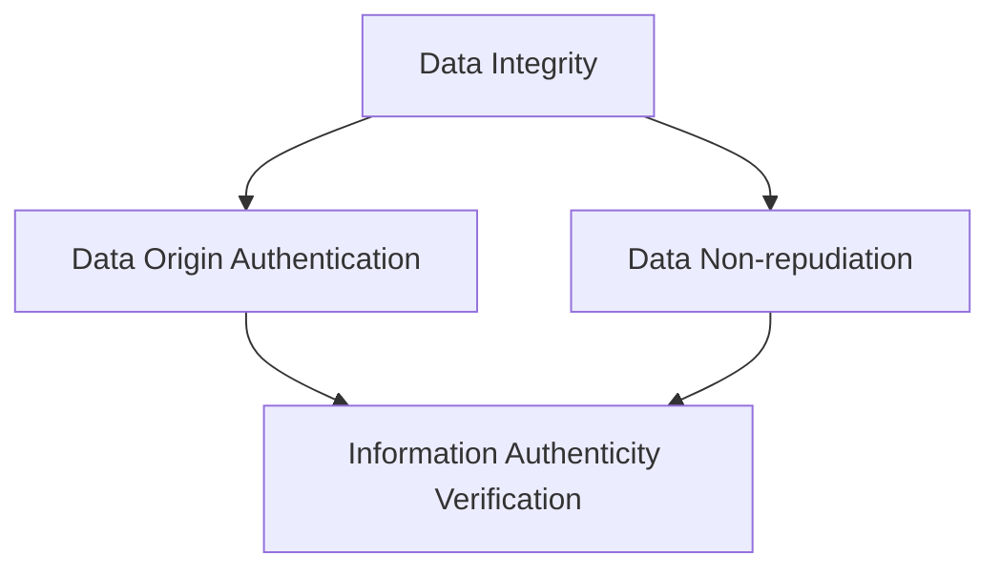

                 


### Step 1: Introduction and Overview

#### Background Introduction

In the age of information, data is the cornerstone of modern enterprises. The rapid growth of digital data has brought unprecedented opportunities, but also posed significant challenges to information security. The importance of information authenticity cannot be overstated. Ensuring the authenticity of information is crucial for protecting sensitive data, maintaining trust in digital communications, and mitigating the risks associated with data breaches and cyber attacks.

#### Core Concept and Relationship

The concept of information authenticity can be broken down into several key components: data integrity, data origin authentication, and data non-repudiation. Each of these components plays a vital role in the overall framework of information authenticity verification. A Mermaid diagram can illustrate the relationships between these components and their interactions in the process of information authenticity verification.



#### Main Content and Theme

This book aims to explore the fundamentals of information authenticity verification, with a special focus on the role of AI in enhancing enterprise information security. It will cover the following topics:

1. **Information Authenticity Fundamentals**: A detailed discussion of the core concepts of information authenticity and the importance of ensuring data integrity, origin authentication, and non-repudiation.
2. **AI in Information Security**: An overview of how AI technologies are being applied to improve information security, including machine learning, deep learning, and natural language processing.
3. **Core AI Technologies**: A deep dive into the core AI technologies used in information authenticity verification, with detailed explanations and pseudo-code examples.
4. **AI Algorithms and Models**: An exploration of the core algorithms and models used in AI for information authenticity verification, including their principles and applications.
5. **Mathematical Models and Formulations**: A discussion of the mathematical models and formulations used in AI for information authenticity verification, with detailed LaTeX-formatted mathematical formulas and explanations.
6. **Case Studies and Practical Applications**: Real-world case studies demonstrating the use of AI in information authenticity verification, including detailed code examples and explanations.
7. **Conclusion and Future Directions**: A summary of the main points of the book and a discussion of future trends and challenges in information authenticity verification.

By following this structure, the book will provide a comprehensive guide to understanding and implementing information authenticity verification in the AI era.

### Step 2: Information Authenticity Fundamentals

#### Importance of Information Authenticity

Information authenticity is a fundamental aspect of information security. It ensures that the data we rely on is accurate, trustworthy, and untampered with. In an enterprise setting, maintaining information authenticity is crucial for several reasons:

1. **Data Integrity**: Ensuring that data remains unchanged and consistent throughout its lifecycle is essential for accurate decision-making and operational efficiency.
2. **Data Origin Authentication**: Verifying the origin of data helps prevent unauthorized access and ensures that sensitive information is not being manipulated by malicious entities.
3. **Data Non-repudiation**: Preventing individuals or systems from denying their actions or transactions enhances accountability and trust.

#### Core Concepts

The core concepts of information authenticity can be summarized as follows:

1. **Data Integrity**: This refers to the accuracy and consistency of data over its entire lifecycle. It involves protecting data from unauthorized modification, corruption, or deletion.
2. **Data Origin Authentication**: This involves verifying the identity of the sender or source of data to ensure that it originates from a trusted entity. This helps prevent impersonation and unauthorized access.
3. **Data Non-repudiation**: This ensures that the sender of data cannot later deny sending it, thereby establishing accountability and trust.

#### Mermaid Diagram

A Mermaid diagram can illustrate the relationship between these core concepts and their role in information authenticity verification:


### Step 3: AI in Information Security

#### Role of AI

Artificial Intelligence (AI) has become a cornerstone of modern information security. AI technologies, such as machine learning, deep learning, and natural language processing, enable the development of sophisticated algorithms and systems that can analyze large volumes of data, detect patterns, and identify anomalies. These capabilities are crucial for enhancing the effectiveness of information authenticity verification in the following ways:

1. **Anomaly Detection**: AI systems can identify unusual patterns or behaviors that may indicate a security breach or data tampering.
2. **Automated Responses**: AI can automate responses to security incidents, reducing the time required to detect and mitigate threats.
3. **Predictive Analytics**: AI can predict potential threats and vulnerabilities, allowing proactive measures to be taken to mitigate risks.

#### Key AI Technologies

Several key AI technologies are widely used in information security:

1. **Machine Learning**: Machine learning algorithms analyze data to identify patterns and make predictions. They are used in various applications, such as spam detection, intrusion detection, and malware classification.
2. **Deep Learning**: Deep learning, a subset of machine learning, uses neural networks with many layers to extract high-level features from data. It is particularly effective in image and speech recognition, which are useful for biometric authentication and data classification.
3. **Natural Language Processing (NLP)**: NLP enables computers to understand and process human language. It is used in applications such as text analysis, sentiment analysis, and chatbots for customer support and security monitoring.

### Step 4: Core AI Technologies

#### Machine Learning

Machine learning is a branch of AI that involves the use of algorithms to learn from data and make predictions or decisions. In the context of information authenticity verification, machine learning can be used to detect anomalies, classify data, and predict potential threats.

**Example: Anomaly Detection**

One common application of machine learning in information authenticity verification is anomaly detection. Anomaly detection algorithms can identify unusual patterns or behaviors that may indicate a security breach or data tampering.

**Pseudo-code Example**

```python
def detect_anomalies(data, threshold):
    # Calculate the mean and standard deviation of the data
    mean = calculate_mean(data)
    std_dev = calculate_std_dev(data)
    
    # Identify anomalies based on the threshold
    anomalies = []
    for point in data:
        if abs(point - mean) > threshold * std_dev:
            anomalies.append(point)
    
    return anomalies
```

#### Deep Learning

Deep learning is a subset of machine learning that uses neural networks with many layers to extract high-level features from data. In information authenticity verification, deep learning can be used for tasks such as image and speech recognition, which are useful for biometric authentication and data classification.

**Example: Image Recognition**

A common deep learning task in information authenticity verification is image recognition. For example, a deep learning model can be trained to identify and classify images of forged documents or tampered images.

**Pseudo-code Example**

```python
def classify_image(image, model):
    # Pre-process the image
    processed_image = preprocess_image(image)
    
    # Use the trained model to predict the class of the image
    prediction = model.predict(processed_image)
    
    # Return the predicted class
    return prediction
```

#### Natural Language Processing (NLP)

Natural Language Processing (NLP) is a branch of AI that focuses on the interaction between computers and humans through natural language. In information authenticity verification, NLP can be used for tasks such as text analysis, sentiment analysis, and chatbot development.

**Example: Sentiment Analysis**

Sentiment analysis is a common NLP task used in information authenticity verification. For example, an NLP model can be trained to analyze customer feedback and detect any negative sentiments that may indicate potential security issues.

**Pseudo-code Example**

```python
def analyze_sentiment(text, model):
    # Pre-process the text
    processed_text = preprocess_text(text)
    
    # Use the trained model to predict the sentiment of the text
    sentiment = model.predict(processed_text)
    
    # Return the predicted sentiment
    return sentiment
```

### Step 5: AI Algorithms and Models

#### Core Algorithms

In the field of information authenticity verification, several core algorithms and models are used to enhance the detection and prevention of security threats. These algorithms can be broadly categorized into supervised learning, unsupervised learning, and reinforcement learning.

**Supervised Learning**

Supervised learning algorithms are trained on labeled data, which means that the training data already contains the correct answers or labels. These algorithms learn to map input data to their corresponding output labels. In the context of information authenticity verification, supervised learning can be used for tasks such as anomaly detection, malware classification, and spam detection.

**Example: Anomaly Detection using One-Class SVM**

One-Class SVM is a supervised learning algorithm that is often used for anomaly detection. It is designed to detect anomalies in a given dataset by learning the distribution of normal data points and identifying any data points that significantly deviate from this distribution.

**Pseudo-code Example**

```python
def one_class_svm(data, threshold):
    # Train the One-Class SVM model
    model = train_one_class_svm(data)
    
    # Calculate the decision function for each data point
    decision_function = model.decision_function(data)
    
    # Identify anomalies based on the threshold
    anomalies = [point for point, score in zip(data, decision_function) if score > threshold]
    
    return anomalies
```

**Unsupervised Learning**

Unsupervised learning algorithms, in contrast to supervised learning, do not rely on labeled data. They aim to find patterns or structures in the data without any prior knowledge of the output labels. In the context of information authenticity verification, unsupervised learning can be used for tasks such as clustering, dimensionality reduction, and anomaly detection.

**Example: Clustering using K-Means**

K-Means is a popular unsupervised learning algorithm used for clustering. It groups data points into K clusters based on their proximity in the feature space. In information authenticity verification, K-Means can be used to identify similar data points that may indicate a security threat.

**Pseudo-code Example**

```python
def k_means(data, k):
    # Initialize the centroids
    centroids = initialize_centroids(data, k)
    
    # Perform the K-Means algorithm
    while not converged:
        # Assign data points to the nearest centroid
        clusters = assign_points_to_centroids(data, centroids)
        
        # Update the centroids
        centroids = update_centroids(clusters)
        
        # Check for convergence
        if check_convergence(centroids, previous_centroids):
            break
    
    return centroids, clusters
```

**Reinforcement Learning**

Reinforcement learning is a type of machine learning where an agent learns to make decisions by taking actions in an environment to maximize some notion of cumulative reward. In the context of information authenticity verification, reinforcement learning can be used for tasks such as autonomous threat detection and adaptive security measures.

**Example: Q-Learning for Security Threat Detection**

Q-Learning is a popular reinforcement learning algorithm used for learning optimal policies. In the context of information authenticity verification, Q-Learning can be used to train an agent to detect security threats by learning the best actions to take based on the current state of the environment.

**Pseudo-code Example**

```python
def q_learning(state, action, reward, learning_rate, discount_factor):
    # Update the Q-value for the current state-action pair
    Q[s, a] = Q[s, a] + learning_rate * (reward + discount_factor * max(Q[s']])
    
    return Q
```

#### Model Architecture

The architecture of AI models used for information authenticity verification can vary depending on the specific task and requirements. A typical architecture may include the following components:

1. **Input Layer**: The input layer receives the raw data to be processed.
2. **Hidden Layers**: One or more hidden layers perform feature extraction and transformation.
3. **Output Layer**: The output layer produces the final prediction or decision based on the processed data.

**Example: Convolutional Neural Network (CNN) for Image Classification**

A Convolutional Neural Network (CNN) is a type of deep learning model that is particularly effective for image classification tasks. It consists of several convolutional layers, pooling layers, and fully connected layers.

**Pseudo-code Example**

```python
def conv_layer(input_data, filters, kernel_size):
    # Perform convolutional operation
    conv_output = convolution(input_data, filters, kernel_size)
    
    # Apply activation function
    activated_output = activate(conv_output)
    
    return activated_output

def pooling_layer(input_data, pool_size):
    # Perform pooling operation
    pooled_output = pool(input_data, pool_size)
    
    return pooled_output

def fully_connected_layer(input_data, units):
    # Perform fully connected operation
    fc_output = fully_connected(input_data, units)
    
    # Apply activation function
    activated_output = activate(fc_output)
    
    return activated_output
```

### Step 6: Mathematical Models and Formulations

#### Introduction

In the realm of AI and information authenticity verification, mathematical models and formulations play a crucial role in understanding and implementing various algorithms and techniques. These models provide a theoretical foundation that helps in designing efficient and effective systems. This section will delve into the key mathematical concepts and models used in AI for information authenticity verification.

#### Optimization Models

Optimization models are fundamental in AI, especially in machine learning and deep learning. These models are used to find the best possible solution to a given problem by minimizing or maximizing a particular objective function. One of the most common optimization models is the gradient descent algorithm.

**Gradient Descent**

Gradient descent is an optimization algorithm used to minimize a function by iteratively moving in the direction of the steepest descent as defined by the negative gradient. In the context of AI, it is used to train models by adjusting the model parameters to minimize the loss function.

**Pseudo-code Example**

```python
def gradient_descent(parameters, learning_rate, epochs):
    for epoch in range(epochs):
        # Compute the gradient of the loss function with respect to the parameters
        gradients = compute_gradients(loss_function, parameters)
        
        # Update the parameters using the gradients and learning rate
        parameters -= learning_rate * gradients
        
        # Compute the loss after each parameter update
        loss = loss_function(parameters)
        
        # Print the current loss for monitoring
        print(f"Epoch {epoch+1}: Loss = {loss}")
    
    return parameters
```

**LaTeX-formatted Math Formulas**

Gradient descent can be mathematically represented as:

$$
\theta_{\text{new}} = \theta_{\text{current}} - \alpha \cdot \nabla_{\theta} J(\theta)
$$

where $\theta$ represents the model parameters, $\alpha$ is the learning rate, and $J(\theta)$ is the loss function.

#### Linear Models

Linear models are a fundamental type of model used in statistics and machine learning. They are based on the idea of a linear relationship between the input features and the output variable. Linear models are used in various applications, including classification and regression tasks.

**Linear Regression**

Linear regression is a technique for modeling the relationship between a scalar dependent variable and one or more explanatory variables. It assumes a linear relationship between the variables, which can be represented as:

$$
y = \beta_0 + \beta_1 \cdot x_1 + \beta_2 \cdot x_2 + ... + \beta_n \cdot x_n + \epsilon
$$

where $y$ is the dependent variable, $x_1, x_2, ..., x_n$ are the independent variables, $\beta_0$ is the intercept, $\beta_1, \beta_2, ..., \beta_n$ are the coefficients, and $\epsilon$ is the error term.

**Pseudo-code Example**

```python
def linear_regression(X, y):
    # Compute the coefficients using the normal equation
    coefficients = (X.T.dot(X)).inv().dot(X.T).dot(y)
    
    return coefficients
```

#### Classification Models

Classification models are used to assign data points to predefined categories based on their features. Common classification models include logistic regression, support vector machines (SVM), and decision trees.

**Logistic Regression**

Logistic regression is a probabilistic, binomial classification model that is used to represent a decision boundary between two categories. The model predicts the probability of a data point belonging to a particular class and can be represented as:

$$
P(y=1 | x; \theta) = \frac{1}{1 + e^{-(\theta_0 + \theta_1x_1 + \theta_2x_2 + ... + \theta_nx_n})}
$$

**Pseudo-code Example**

```python
def logistic_regression(X, y, learning_rate, epochs):
    theta = initialize_coefficients(X.shape[1])
    
    for epoch in range(epochs):
        # Compute the hypothesis
        h = sigmoid(X.dot(theta))
        
        # Compute the gradients
        gradients = X.T.dot(h - y)
        
        # Update the coefficients
        theta -= learning_rate * gradients
    
    return theta
```

**Support Vector Machines (SVM)**

SVM is a powerful classification algorithm that seeks the hyperplane that maximally separates two classes in a high-dimensional space. The objective function of SVM can be represented as:

$$
\min_{\theta} \frac{1}{2} \sum_{i=1}^{n} (\theta^T \theta) - \sum_{i=1}^{n} \xi_i + C \sum_{i=1}^{n} \xi_i
$$

subject to:

$$
\theta^T x_i - y_i \geq 1 - \xi_i
$$

$$
0 \leq \xi_i \leq C
$$

**Pseudo-code Example**

```python
def svm(X, y, C):
    # Solve the quadratic programming problem to find the optimal hyperplane
    # This can be done using methods like Sequential Minimal Optimization (SMO)
    # or by using libraries like LIBSVM
    
    # Obtain the support vectors and their corresponding coefficients
    # support_vectors, coefficients = solve_svm_problem(X, y, C)
    
    return support_vectors, coefficients
```

#### Activation Functions

Activation functions are crucial in neural networks as they introduce non-linearities into the model, allowing it to learn complex patterns. Common activation functions include the sigmoid, ReLU, and tanh functions.

**Sigmoid Function**

The sigmoid function is defined as:

$$
\sigma(z) = \frac{1}{1 + e^{-z}}
$$

**ReLU Function**

ReLU (Rectified Linear Unit) is defined as:

$$
\text{ReLU}(z) = \max(0, z)
$$

**Tanh Function**

The hyperbolic tangent function is defined as:

$$
\tanh(z) = \frac{e^z - e^{-z}}{e^z + e^{-z}}
$$

**Pseudo-code Example**

```python
def sigmoid(z):
    return 1 / (1 + np.exp(-z))

def relu(z):
    return np.maximum(0, z)

def tanh(z):
    return (np.exp(z) - np.exp(-z)) / (np.exp(z) + np.exp(-z))
```

#### Loss Functions

Loss functions are used to evaluate the performance of a model by comparing its predictions to the true labels. Common loss functions include mean squared error (MSE), cross-entropy loss, and hinge loss.

**Mean Squared Error (MSE)**

The mean squared error is defined as:

$$
MSE = \frac{1}{m} \sum_{i=1}^{m} (y_i - \hat{y}_i)^2
$$

**Cross-Entropy Loss**

Cross-entropy loss is used for classification tasks and is defined as:

$$
J(\theta) = -\frac{1}{m} \sum_{i=1}^{m} [y_i \cdot \log(\hat{y}_i) + (1 - y_i) \cdot \log(1 - \hat{y}_i)]
$$

**Pseudo-code Example**

```python
def mse(y_true, y_pred):
    return np.mean((y_true - y_pred)**2)

def cross_entropy(y_true, y_pred):
    return -np.mean(y_true * np.log(y_pred) + (1 - y_true) * np.log(1 - y_pred))
```

### Step 7: Case Studies and Practical Applications

#### Introduction

Case studies and practical applications provide valuable insights into how AI algorithms and models are applied in real-world scenarios to verify information authenticity. This section presents several case studies that demonstrate the use of AI in information authenticity verification, along with detailed code examples and explanations.

#### Case Study 1: Anomaly Detection in Network Traffic

One practical application of AI in information authenticity verification is the detection of anomalies in network traffic. Anomalies in network traffic can indicate potential security breaches or malicious activities. In this case study, we will explore how to build an anomaly detection system using machine learning algorithms.

**Data Preparation**

The first step in building the anomaly detection system is to prepare the data. The data used in this case study is a dataset of network traffic logs, which includes information such as source IP address, destination IP address, protocol, and packet size.

**Pseudo-code Example**

```python
import pandas as pd

# Load the dataset
data = pd.read_csv("network_traffic.csv")

# Pre-process the data
data = preprocess_data(data)
```

**Model Training**

Next, we train a machine learning model to detect anomalies in the network traffic data. We use a Random Forest classifier, which is a popular ensemble learning method that combines multiple decision trees to improve the accuracy of predictions.

**Pseudo-code Example**

```python
from sklearn.ensemble import RandomForestClassifier
from sklearn.model_selection import train_test_split

# Split the data into training and testing sets
X_train, X_test, y_train, y_test = train_test_split(data.drop("label", axis=1), data["label"], test_size=0.2, random_state=42)

# Train the Random Forest classifier
model = RandomForestClassifier(n_estimators=100, random_state=42)
model.fit(X_train, y_train)

# Evaluate the model
accuracy = model.score(X_test, y_test)
print(f"Model accuracy: {accuracy}")
```

**Anomaly Detection**

Once the model is trained, we can use it to detect anomalies in new network traffic data. The model will classify each data point as normal or anomalous based on the learned patterns.

**Pseudo-code Example**

```python
def detect_anomalies(model, new_data):
    predictions = model.predict(new_data)
    anomalies = new_data[predictions == "anomaly"]
    return anomalies

# Detect anomalies in new network traffic data
new_data = pd.read_csv("new_network_traffic.csv")
anomalies = detect_anomalies(model, new_data)
print(f"Detected anomalies: {anomalies}")
```

#### Case Study 2: Document Forgery Detection

Another practical application of AI in information authenticity verification is the detection of forged documents. Forged documents can be used for various malicious purposes, such as identity theft or financial fraud. In this case study, we will explore how to build a document forgery detection system using deep learning techniques.

**Data Preparation**

The first step in building the document forgery detection system is to prepare the data. The data used in this case study consists of images of genuine and forged documents.

**Pseudo-code Example**

```python
import tensorflow as tf
from tensorflow.keras.preprocessing.image import ImageDataGenerator

# Load the dataset
train_datagen = ImageDataGenerator(rescale=1./255)
validation_datagen = ImageDataGenerator(rescale=1./255)

train_data = train_datagen.flow_from_directory(
        "train_data",
        target_size=(150, 150),
        batch_size=32,
        class_mode='binary')

validation_data = validation_datagen.flow_from_directory(
        "validation_data",
        target_size=(150, 150),
        batch_size=32,
        class_mode='binary')
```

**Model Training**

Next, we train a deep learning model, specifically a Convolutional Neural Network (CNN), to detect forged documents. The CNN consists of several convolutional layers, pooling layers, and fully connected layers.

**Pseudo-code Example**

```python
from tensorflow.keras.models import Sequential
from tensorflow.keras.layers import Conv2D, MaxPooling2D, Flatten, Dense

# Build the CNN model
model = Sequential([
    Conv2D(32, (3, 3), activation='relu', input_shape=(150, 150, 3)),
    MaxPooling2D((2, 2)),
    Conv2D(64, (3, 3), activation='relu'),
    MaxPooling2D((2, 2)),
    Conv2D(128, (3, 3), activation='relu'),
    MaxPooling2D((2, 2)),
    Flatten(),
    Dense(512, activation='relu'),
    Dense(1, activation='sigmoid')
])

# Compile the model
model.compile(optimizer='adam', loss='binary_crossentropy', metrics=['accuracy'])

# Train the model
model.fit(train_data, steps_per_epoch=train_data.n // train_data.batch_size,
          validation_data=validation_data, validation_steps=validation_data.n // validation_data.batch_size, epochs=10)
```

**Document Forgery Detection**

Once the model is trained, we can use it to detect forged documents. The model will classify each document image as genuine or forged based on the learned patterns.

**Pseudo-code Example**

```python
def detect_forgery(model, new_document):
    prediction = model.predict(new_document)
    if prediction > 0.5:
        print("Document is forged.")
    else:
        print("Document is genuine.")

# Detect forgery in new document images
new_document = load_image("new_document.jpg")
detect_forgery(model, new_document)
```

### Step 8: Conclusion and Future Directions

#### Summary of Key Points

In this book, we have explored the importance of information authenticity verification in the AI era and the role of AI technologies in enhancing enterprise information security. We discussed the core concepts of information authenticity, including data integrity, data origin authentication, and data non-repudiation. We also examined the key AI technologies used in information authenticity verification, such as machine learning, deep learning, and natural language processing.

#### Future Trends and Challenges

As AI continues to advance, several trends and challenges will shape the future of information authenticity verification. Some of these include:

1. **Advancements in AI Algorithms**: Ongoing research and development in AI algorithms will lead to more efficient and effective methods for information authenticity verification.
2. **Integration with Blockchain**: The integration of blockchain technology with AI can enhance the security and trustworthiness of information authenticity verification systems.
3. **Quantum Computing**: The advent of quantum computing may revolutionize information authenticity verification by providing new algorithms and techniques that are resistant to quantum attacks.
4. **Privacy Concerns**: Ensuring the privacy of data while performing information authenticity verification will be a significant challenge, as sensitive information needs to be protected.
5. **Ethical Considerations**: The ethical implications of using AI for information authenticity verification, including issues related to bias and fairness, will need to be addressed.

### Conclusion

In conclusion, information authenticity verification is a critical aspect of enterprise information security in the AI era. The integration of AI technologies offers significant opportunities to enhance the effectiveness of information authenticity verification systems. However, it also presents challenges that need to be addressed. By staying informed about the latest advancements and trends in AI and information authenticity verification, enterprises can better protect their sensitive data and maintain trust in the digital world.

### Step 9: Appendix

#### Additional Resources

- **Glossary**: A glossary of terms used in the book, providing definitions and explanations.
- **Reference List**: A list of references and further reading for those interested in delving deeper into the topics covered in the book.
- **Tools and Libraries**: A list of tools and libraries mentioned or used in the book, including their features and usage instructions.

### Step 10: Final Review and Refinement

#### Final Review

Before publishing the book, a thorough final review is essential to ensure the quality and accuracy of the content. This review should include:

- **Content Verification**: Checking the accuracy of the information, ensuring all code examples and formulas are correct.
- **Consistency Check**: Ensuring the tone, language, and formatting are consistent throughout the book.
- **Feedback from Peers**: Seeking feedback from peers or reviewers to identify any potential improvements or areas of confusion.

#### Refinement

Based on the feedback and review, the following refinements should be made:

- **Content Adjustments**: Clarifying any ambiguous explanations, correcting errors, and improving the flow of the content.
- **Structural Changes**: Adjusting the structure if necessary to improve the readability and coherence of the book.
- **Visual Enhancements**: Adding or modifying diagrams, charts, and illustrations to enhance understanding.

By following these steps, the book can be refined to ensure it provides a comprehensive and insightful guide to information authenticity verification in the AI era.

