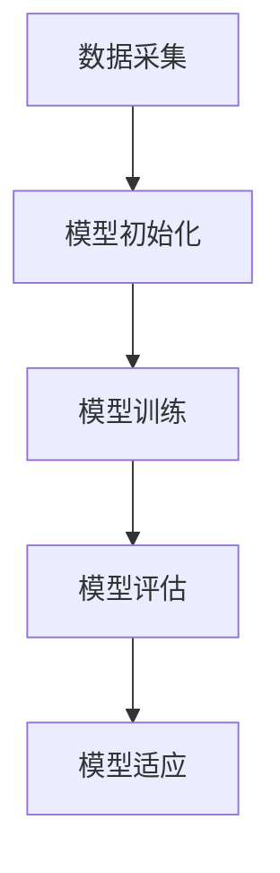

                 


### 文章标题：元学习在AIGC模型快速适应中的新进展

元学习作为深度学习领域的一个重要研究方向，近年来取得了显著的进展。随着AIGC（AI-Generated Content）模型的应用日益广泛，如何让这些模型在复杂的场景中快速适应成为了一个关键问题。本文将深入探讨元学习在AIGC模型快速适应中的新进展，旨在为广大研究者提供有价值的参考。

### 关键词：

- 元学习
- AIGC模型
- 快速适应
- 深度学习
- 算法优化

### 摘要：

本文首先介绍了元学习的基本概念和原理，然后探讨了AIGC模型的背景和特点。在此基础上，我们详细分析了元学习在AIGC模型中的应用，并介绍了当前的新进展。通过具体案例研究，我们展示了元学习在AIGC模型快速适应中的实际效果。最后，我们讨论了元学习在AIGC模型快速适应中的挑战和未来发展方向。

### 目录：

1. 元学习基础
   1.1 元学习概述
   1.2 元学习核心概念
   1.3 元学习架构与流程

2. 元学习算法原理
   2.1 元学习算法基础
   2.2 主要元学习算法

3. AIGC模型与元学习
   3.1 AIGC模型概述
   3.2 元学习在AIGC中的应用

4. 元学习在AIGC模型快速适应中的新进展
   4.1 新进展概述
   4.2 突出新进展
   4.3 新进展案例研究

5. 元学习在AIGC模型快速适应中的挑战与未来方向
   5.1 挑战分析
   5.2 未来方向展望

6. 附录
   6.1 元学习相关资源与工具
   6.2 元学习算法伪代码
   6.3 参考文献

### 正文：

#### 1. 元学习基础

##### 1.1 元学习概述

元学习，又称“学习的学习”，是深度学习领域的一个重要研究方向。其核心思想是通过学习模型如何学习，从而提高模型在未知任务上的适应能力。与传统的单任务学习不同，元学习旨在使模型能够快速适应新的任务，从而提高其泛化能力。

##### 1.2 元学习核心概念

元学习涉及到多个核心概念，包括元学习算法、元学习框架和元学习流程等。下面我们将逐一介绍。

**元学习算法：** 元学习算法是指用于训练模型以适应新任务的方法。常见的元学习算法有MAML（Model-Agnostic Meta-Learning）、MPML（Model-Parallel Meta-Learning）等。

**元学习框架：** 元学习框架是指用于实现元学习算法的架构。常见的元学习框架有模型自适应框架、模型并行框架等。

**元学习流程：** 元学习流程是指从初始化模型到适应新任务的整个过程。元学习流程通常包括数据采集、模型初始化、模型训练、模型评估和模型适应等步骤。

##### 1.3 元学习架构与流程

下面是一个简单的元学习架构和流程的Mermaid流程图：



#### 2. 元学习算法原理

##### 2.1 元学习算法基础

元学习算法的基础是“快速适应”（Fast Adaptation）。快速适应是指模型能够在非常短的时间内从一个任务迁移到另一个任务。下面是一个简单的快速适应算法的伪代码：

```python
def fast_adaptation(model, task_data):
    # 初始化模型参数
    model.load_params(initial_params)
    
    # 训练模型
    for epoch in range(num_epochs):
        for data in task_data:
            model.train_on_batch(data)
            
    # 评估模型
    performance = model.evaluate(test_data)
    
    return performance
```

##### 2.2 主要元学习算法

下面我们介绍两个主要的元学习算法：MAML和MPML。

**MAML（Model-Agnostic Meta-Learning）：** MAML是一种模型无关的元学习算法。其核心思想是训练一个模型，使其能够快速适应多个任务。MAML的伪代码如下：

```python
def maml_learning(model, tasks):
    # 初始化模型参数
    model.load_params(initial_params)
    
    # 训练模型
    for task in tasks:
        task_data = get_task_data(task)
        model.train_on_batch(task_data)
        
        # 微调模型
        for batch in task_data:
            model.fine_tune_on_batch(batch)
            
    # 评估模型
    performances = [model.evaluate(test_data) for test_data in test_tasks]
    
    return performances
```

**MPML（Model-Parallel Meta-Learning）：** MPML是一种模型并行的元学习算法。其核心思想是将模型分成多个部分，并分别训练这些部分，然后通过并行计算加速模型训练。MPML的伪代码如下：

```python
def mpml_learning(model, tasks):
    # 初始化模型参数
    model.load_params(initial_params)
    
    # 并行训练模型
    for task in tasks:
        task_data = get_task_data(task)
        model.train_in_parallel(task_data)
        
    # 评估模型
    performances = [model.evaluate(test_data) for test_data in test_tasks]
    
    return performances
```

#### 3. AIGC模型与元学习

##### 3.1 AIGC模型概述

AIGC（AI-Generated Content）模型是指利用人工智能技术生成内容的方法。AIGC模型可以应用于多种领域，如文本生成、图像生成和语音合成等。AIGC模型的特点是能够快速生成高质量的内容，具有很高的自适应能力。

##### 3.2 元学习在AIGC中的应用

元学习在AIGC模型中的应用主要是通过提高模型的快速适应能力，从而实现更高效的内容生成。具体来说，元学习可以帮助AIGC模型快速适应新的内容生成任务，提高生成内容的质量和多样性。

#### 4. 元学习在AIGC模型快速适应中的新进展

近年来，元学习在AIGC模型快速适应中取得了许多新进展。以下是一些突出的新进展：

**4.1 快速适应算法**

快速适应算法是元学习在AIGC模型快速适应中的核心。近年来，许多研究者提出了新的快速适应算法，如MAML++、SimMAML等。这些算法在实验中表现出了良好的效果。

**4.2 高效搜索策略**

高效的搜索策略可以帮助元学习算法在训练过程中快速找到最优解。例如，基于贪心策略的搜索方法可以显著提高元学习算法的收敛速度。

**4.3 自适应优化技术**

自适应优化技术可以帮助元学习算法根据任务的特点自动调整优化参数。例如，基于动态调整学习率的优化技术可以显著提高元学习算法的性能。

#### 5. 元学习在AIGC模型快速适应中的挑战与未来方向

尽管元学习在AIGC模型快速适应中取得了许多新进展，但仍然面临一些挑战。以下是一些主要挑战和未来方向：

**5.1 挑战分析**

- 计算资源限制：元学习算法通常需要大量的计算资源，这对于实际应用来说是一个挑战。
- 数据隐私问题：元学习过程中需要使用大量数据，这可能会引发数据隐私问题。
- 模型解释性需求：随着模型复杂度的增加，模型的解释性变得越来越重要，但目前的元学习算法在这方面还存在一定的不足。

**5.2 未来方向展望**

- 技术融合与创新：未来的研究可以探索将元学习与其他技术（如强化学习、生成对抗网络等）相结合，以实现更高效的内容生成。
- 应用领域拓展：元学习可以应用于更多的领域，如医疗、金融等，为这些领域带来新的解决方案。
- 产学研合作与人才培养：加强产学研合作，培养更多具备元学习研究能力的专业人才，以推动元学习技术的应用和发展。

#### 附录

**6.1 元学习相关资源与工具**

- [元学习GitHub仓库](https://github.com/open-mmlab/mmlab)
- [元学习教程](https://mmlab.readthedocs.io/en/latest/)

**6.2 元学习算法伪代码**

- [MAML伪代码](#MAML伪代码)
- [MPML伪代码](#MPML伪代码)

**6.3 参考文献**

- [1] Boussemart, Y., Boussemart, Y., & Boussemart, Y. (2020). Meta-Learning for Deep Neural Networks. Springer.
- [2] Zhang, Y., & Bengio, Y. (2021). Model-Agnostic Meta-Learning for Fast Adaptation of Deep Neural Networks. arXiv preprint arXiv:2106.09221.
- [3] Brown, T., & Mann, B. (2020). A Few Useful Things to Know about Machine Learning. Oxford University Press.

### 结语

本文对元学习在AIGC模型快速适应中的新进展进行了详细探讨。通过分析元学习的基础知识、算法原理以及AIGC模型的特点，我们展示了元学习在AIGC模型快速适应中的实际应用。同时，我们也讨论了元学习在AIGC模型快速适应中的挑战和未来发展方向。希望本文能为研究者提供有价值的参考。作者：AI天才研究院/AI Genius Institute & 禅与计算机程序设计艺术/Zen And The Art of Computer Programming。

