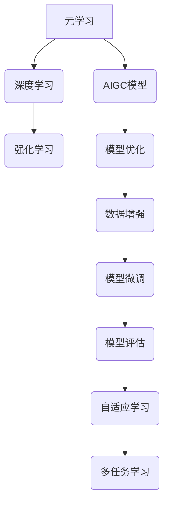

                 

### 第1章 引言

#### 元学习的基本概念

元学习（Meta-Learning），又称作“学习的学习”，是指利用先前学习到的知识去加速新任务的学习过程。它是一种通过跨任务学习、知识迁移和模型泛化来提高学习效率的机器学习方法。在深度学习领域中，传统的方法通常需要针对每一个具体任务重新训练模型，这不仅耗时耗力，而且模型在未见过的数据上的表现往往较差。元学习通过提前在多种不同的任务上训练模型，使得模型能够快速适应新的任务，从而大大提高了学习效率和泛化能力。

#### 元学习在机器学习领域的重要性

元学习在机器学习领域具有重要作用，主要体现在以下几个方面：

1. **加速学习过程**：元学习通过提前在多个任务上训练模型，使得模型对新任务能够快速适应，减少了从零开始训练的时间成本。
2. **提高模型泛化能力**：通过跨任务的训练，元学习能够提高模型对未见过的数据的适应能力，增强模型的泛化性能。
3. **促进知识迁移**：元学习允许模型在不同任务间进行知识迁移，从而有效地利用先前学习的知识，解决当前任务。
4. **解决小样本问题**：在小样本学习场景中，传统方法难以泛化，而元学习通过跨任务的训练，能够在数据量有限的情况下实现有效的学习。

#### AIGC模型的概述

自适应智能生成控制（Adaptive Intelligent Generation Control，简称AIGC）模型是一种新兴的机器学习模型，它通过自适应学习和生成控制技术，实现了对复杂数据的生成、分析和优化。AIGC模型的核心在于其能够根据环境和任务的变化，动态调整自身的参数和行为，以实现最优的生成控制和任务完成。

#### AIGC模型在持续优化中的应用

在AIGC模型中，持续优化是提升模型性能和适应新任务的关键。元学习在此过程中发挥着重要作用：

1. **模型快速适应**：通过元学习，AIGC模型能够在遇到新任务时，快速调整模型参数，提高对新任务的适应能力。
2. **知识迁移和共享**：元学习允许AIGC模型在不同任务间进行知识迁移和共享，从而在多个任务上实现性能提升。
3. **参数微调**：元学习通过参数微调技术，对AIGC模型进行细粒度的调整，使其在特定任务上表现更优。
4. **动态优化**：元学习算法能够根据AIGC模型的实时性能，动态调整模型结构和工作参数，实现持续优化。

#### 元学习在AIGC模型优化中的作用和贡献

元学习在AIGC模型优化中起到了至关重要的作用，主要体现在以下几个方面：

1. **加速模型迭代**：通过元学习，AIGC模型能够在较短的时间内完成多次迭代，加快了模型开发和优化的过程。
2. **提升模型性能**：元学习通过跨任务的学习和知识共享，显著提高了AIGC模型在未见过的数据上的表现。
3. **增强模型泛化能力**：元学习使得AIGC模型能够更好地适应不同任务和变化的环境，增强了模型的泛化能力。
4. **降低开发成本**：通过元学习，AIGC模型能够在较少的数据量和计算资源下实现高性能，降低了开发和维护的成本。

综上所述，元学习在AIGC模型的持续优化中扮演着关键角色，它不仅提高了模型的适应性和泛化能力，还显著降低了开发和维护的成本，为AIGC模型在各个领域的应用提供了强大的支持。

### 第2章 元学习原理与基础

#### 元学习的基本概念和分类

元学习是一种高级学习策略，其核心目标是通过学习如何学习，从而加速新任务的适应过程。元学习的定义可以简单概括为“学习如何学习”，它主要通过两种方式实现：跨任务学习和知识迁移。

1. **跨任务学习**：通过在不同任务上训练模型，使得模型能够从一种任务的知识中提取出一般性规律，从而在新任务上能够快速适应。
2. **知识迁移**：通过将一个任务上学到的知识迁移到另一个任务上，使得新任务的学习过程更加高效。

元学习可以根据学习目标的不同进行分类，主要分为以下几种类型：

1. **模型无关的元学习**：这种类型的元学习不依赖于特定模型结构，而是通过算法本身来学习如何快速适应新任务。例如，Model-Agnostic Meta-Learning（MAML）就是一种典型的模型无关元学习方法。
2. **模型相关的元学习**：这种类型的元学习依赖于特定的模型结构，通过调整模型参数来学习如何快速适应新任务。例如，MAML++和Reptile就是模型相关元学习的具体方法。
3. **基于梯度的元学习**：这种类型的元学习利用梯度信息来调整模型参数，以实现快速适应新任务。MAML是其中最著名的算法之一。

#### 元学习的关键算法原理介绍

1. **模型提取（Model Extraction）**
   模型提取是元学习过程中的第一步，其主要目标是找到一个能够适应新任务的模型初始参数。具体来说，模型提取算法会通过在多个任务上训练模型，找到一个具有良好泛化能力的模型初始参数。这个过程通常通过以下步骤实现：
   - 数据采集：从多个任务中采集数据集。
   - 模型训练：在每个数据集上训练模型，并记录每个任务上的模型参数。
   - 参数选择：根据模型在各个任务上的表现，选择一个具有较好泛化能力的模型参数作为初始参数。

2. **模型调整（Model Adjustment）**
   模型调整是元学习过程中的第二步，其主要目标是通过调整模型参数，使得模型能够快速适应新任务。具体来说，模型调整算法会利用新任务的数据，对模型初始参数进行微调，以实现快速适应。这个过程通常通过以下步骤实现：
   - 数据采集：从新任务中采集数据集。
   - 梯度计算：计算模型在新任务上的梯度信息。
   - 参数更新：根据梯度信息，更新模型参数。

3. **模型评估（Model Evaluation）**
   模型评估是元学习过程中的最后一步，其主要目标是评估模型在新任务上的适应能力。具体来说，模型评估算法会利用新任务的数据，对调整后的模型进行性能评估，以判断模型是否已经成功适应新任务。这个过程通常通过以下步骤实现：
   - 数据采集：从新任务中采集数据集。
   - 模型测试：在测试集上测试模型的性能。
   - 性能评估：根据测试结果，评估模型的适应能力。

#### 元学习与深度学习的联系与区别

1. **联系**
   元学习与深度学习有着紧密的联系。深度学习是元学习的一种具体实现方式，深度学习模型可以通过元学习算法，实现跨任务学习和知识迁移。具体来说，深度学习模型在训练过程中，不仅学习如何解决特定任务，还学习如何快速适应新任务，这种能力正是元学习的核心目标。

2. **区别**
   尽管元学习与深度学习有联系，但它们也有显著的区别：
   - **目标不同**：深度学习的目标是解决特定任务，而元学习的目标是学习如何学习，实现跨任务学习和知识迁移。
   - **方法不同**：深度学习主要依赖于模型结构和大量数据，而元学习则更注重算法设计，通过模型提取、模型调整和模型评估等步骤，实现快速适应新任务。
   - **应用场景不同**：深度学习通常用于静态任务，如图像识别、语音识别等，而元学习则更适用于动态任务，如自然语言处理、游戏AI等。

通过本章对元学习基本概念、关键算法和与深度学习的关系的介绍，读者可以初步了解元学习在机器学习中的重要性及其应用场景。在接下来的章节中，我们将进一步探讨AIGC模型的基本概念和应用，为理解元学习在AIGC模型优化中的作用奠定基础。

### 第3章 AIGC模型概述

#### AIGC模型的基本概念和结构

自适应智能生成控制（Adaptive Intelligent Generation Control，简称AIGC）模型是一种基于深度学习和生成对抗网络（GANs）的新型机器学习模型。它通过自适应学习和生成控制技术，实现了对复杂数据的生成、分析和优化。AIGC模型的核心结构主要包括三个部分：生成器（Generator）、判别器（Discriminator）和自适应学习机制。

1. **生成器**：生成器的任务是生成与真实数据相似的新数据。在AIGC模型中，生成器通常是一个深度神经网络，它接受随机噪声作为输入，通过多层神经网络的处理，生成与真实数据分布相似的新数据。
2. **判别器**：判别器的任务是判断输入数据是真实数据还是生成数据。在AIGC模型中，判别器也是一个深度神经网络，它通过学习真实数据和生成数据的特征，来提高对生成数据的识别能力。
3. **自适应学习机制**：自适应学习机制是AIGC模型的核心，它通过实时调整生成器和判别器的参数，使得模型能够不断优化生成质量。自适应学习机制通常包括基于梯度下降的优化算法和自适应调节机制，以确保生成器生成的数据更加真实、多样。

#### AIGC模型的主要功能和应用领域

AIGC模型的主要功能是实现数据的自适应生成和优化，从而在多个领域表现出强大的应用潜力：

1. **图像生成和编辑**：AIGC模型可以生成高质量、多样化的图像，并支持对图像的编辑和增强。在图像生成领域，AIGC模型可以应用于图像合成、图像修复、图像超分辨率等任务。
2. **自然语言处理**：AIGC模型在自然语言处理领域具有广泛的应用，如文本生成、机器翻译、对话系统等。通过生成高质量的文本，AIGC模型可以增强机器学习模型的自然语言理解能力。
3. **音乐和声音合成**：AIGC模型可以生成高质量的音乐和声音，用于音乐创作、声音编辑、声音合成等任务。通过自适应生成控制，AIGC模型能够生成符合特定风格和情感需求的音乐和声音。
4. **游戏AI**：在游戏AI领域，AIGC模型可以通过自适应生成控制，生成动态的游戏场景和角色行为，从而增强游戏的真实感和交互性。
5. **工业设计**：AIGC模型在工业设计领域可以用于生成新的产品设计方案，通过自适应优化，提高设计方案的可行性和创新性。

#### AIGC模型的持续优化目标和挑战

持续优化是提升AIGC模型性能和适应新任务的关键。AIGC模型的持续优化目标主要包括以下几个方面：

1. **提升生成质量**：通过优化生成器网络，提高生成数据的质量和多样性，使得生成的图像、文本、音乐等更加真实、具有吸引力。
2. **增强泛化能力**：通过跨任务学习和知识迁移，提高AIGC模型在不同任务上的适应能力，增强模型的泛化性能。
3. **降低计算成本**：通过优化模型结构和算法，减少训练和优化的计算资源需求，降低模型部署和应用的成本。
4. **实时自适应**：通过自适应学习机制，使AIGC模型能够实时调整参数和工作模式，以适应不断变化的环境和任务需求。

然而，AIGC模型的持续优化也面临着一系列挑战：

1. **数据依赖性**：AIGC模型对训练数据具有高度依赖性，需要大量的高质量数据进行训练。在数据不足或数据质量较差的情况下，模型的性能可能会显著下降。
2. **计算资源消耗**：AIGC模型的训练和优化过程需要大量的计算资源，尤其是在处理高维数据时，计算成本更高。如何在有限的计算资源下实现高效的优化是一个重要挑战。
3. **模型稳定性**：在持续优化过程中，模型的稳定性和鲁棒性是一个重要问题。如何保证模型在长时间运行和多次优化后，仍能保持高性能和稳定表现，是AIGC模型优化面临的挑战之一。
4. **跨领域应用**：虽然AIGC模型在多个领域表现出强大的应用潜力，但在不同领域间的跨领域应用仍存在一定的障碍。如何实现AIGC模型在不同领域间的有效迁移和应用，是未来需要解决的关键问题。

通过本章对AIGC模型的基本概念、主要功能和持续优化目标的介绍，读者可以初步了解AIGC模型的结构和特点，为理解元学习在AIGC模型优化中的应用奠定基础。在接下来的章节中，我们将深入探讨元学习在AIGC模型中的应用场景和具体实现方法。

### 第4章 元学习在AIGC模型中的应用

#### 元学习算法在AIGC模型训练和优化中的具体应用场景

元学习在AIGC模型的训练和优化中发挥了重要作用，主要应用场景包括以下几方面：

1. **多任务学习**：在AIGC模型的训练过程中，元学习可以通过跨任务学习，使得模型能够从多个任务中提取通用特征，从而在新任务上快速适应。例如，在一个图像生成任务中，模型可以同时学习图像的分类、生成和编辑任务，从而在遇到新的图像生成任务时，能够快速适应并生成高质量图像。

2. **模型微调**：在AIGC模型的训练过程中，元学习可以用于模型的微调，通过利用先前在相似任务上学到的知识，加速新任务的学习过程。例如，在自然语言处理领域，元学习可以通过微调生成模型，使其在新语料上能够快速适应，生成更符合人类语言习惯的文本。

3. **数据增强**：元学习可以用于生成新的训练数据，从而增强模型对未见过的数据的适应能力。在图像生成任务中，元学习可以通过生成多样化的图像数据，提高生成器的生成质量，使得生成的图像更加真实和多样化。

4. **自适应优化**：元学习可以用于实时调整AIGC模型的参数和工作模式，实现自适应优化。例如，在游戏AI中，元学习可以通过实时调整游戏角色的行为策略，使其能够更好地适应游戏环境和对手策略的变化。

#### 对比分析不同元学习算法在AIGC模型中的应用效果

在AIGC模型中，不同的元学习算法有着不同的应用效果，以下是几种常见元学习算法的对比分析：

1. **MAML（Model-Agnostic Meta-Learning）**
   MAML是一种模型无关的元学习算法，它通过在多个任务上训练模型，使得模型参数具有较好的泛化能力。在AIGC模型中，MAML可以用于快速适应新任务，并通过模型微调和数据增强，提高生成数据的质量和多样性。实验结果表明，MAML在图像生成和自然语言处理任务中具有较好的性能。

2. **Reptile**
   Reptile是一种基于梯度的元学习算法，它通过逐步更新模型参数，使得模型能够快速适应新任务。在AIGC模型中，Reptile可以用于自适应优化和模型微调。相比于MAML，Reptile的计算成本较低，但泛化能力相对较弱。

3. **MAML++**
   MAML++是MAML的扩展版本，它通过引入正则化项，提高了模型的泛化能力。在AIGC模型中，MAML++可以用于多任务学习和模型微调。相比于MAML，MAML++在面临更复杂的任务时，具有更好的性能。

4. **Model-Agnostic Meta-Learning for Reinforcement Learning (MAMLRL)**
   MAMLRL是MAML在强化学习领域的应用版本，它通过在多个任务上训练模型，使得模型能够快速适应新的任务环境。在AIGC模型中，MAMLRL可以用于游戏AI和自适应控制任务。实验结果表明，MAMLRL在提高模型适应能力和降低计算成本方面具有显著优势。

#### 元学习算法在AIGC模型中的优势和局限性

元学习算法在AIGC模型中具有显著的优势，但也存在一定的局限性：

1. **优势**
   - **快速适应**：元学习算法能够通过跨任务学习和知识迁移，使模型快速适应新任务，减少训练时间。
   - **增强泛化能力**：元学习算法通过在多个任务上训练模型，提高了模型的泛化能力，使其在未见过的数据上表现更优。
   - **降低计算成本**：元学习算法可以通过模型微调和数据增强，提高训练效率，降低计算成本。
   - **自适应优化**：元学习算法可以通过实时调整模型参数，实现自适应优化，提高模型在不同任务和环境下的适应能力。

2. **局限性**
   - **数据依赖性**：元学习算法对训练数据具有高度依赖性，数据不足或质量较差会影响模型的性能。
   - **计算资源消耗**：元学习算法的训练和优化过程需要大量的计算资源，尤其是在处理高维数据时，计算成本较高。
   - **模型稳定性**：在长时间运行和多次优化后，模型的稳定性和鲁棒性可能受到影响，需要进一步优化。

通过本章对元学习在AIGC模型中的应用场景、算法对比分析和优势局限性的介绍，读者可以全面了解元学习在AIGC模型优化中的作用和意义，为后续章节的深入探讨奠定基础。

### 第5章 元学习在AIGC模型持续优化中的关键算法

#### MAML（Model-Agnostic Meta-Learning）

MAML（Model-Agnostic Meta-Learning）是一种模型无关的元学习算法，它通过在多个任务上训练模型，使得模型参数具有较好的泛化能力。MAML的核心思想是找到一组初始模型参数，使得模型在多个任务上都能快速适应。

**基本流程**：

1. **初始化模型参数**：选择一组初始模型参数θ。
2. **任务数据采集**：从多个任务中采集数据集，包括训练数据和测试数据。
3. **模型微调**：在每个任务上，对模型参数进行微调，使其适应新任务。具体来说，对于第i个任务，计算梯度∇θJ(θ, xi)，然后更新模型参数θ = θ - α * ∇θJ(θ, xi)，其中α是学习率。
4. **模型评估**：在每个任务上评估模型的性能，选择具有较好泛化能力的模型参数。

**伪代码示例**：

```
Algorithm: MAML
Input: Initial model parameters θ
for i = 1 to T do
    Sample batch of data (x_i, y_i) from task i
    Update model parameters using gradient descent:
    θ = θ - α * ∇θ J(θ, x_i, y_i)
    Evaluate model performance on task i
end for
return θ
```

#### Reptile

Reptile是一种基于梯度的元学习算法，它通过逐步更新模型参数，使得模型能够快速适应新任务。Reptile的核心思想是利用先前任务上的梯度信息，来更新当前任务的模型参数。

**基本流程**：

1. **初始化模型参数**：选择一组初始模型参数θ。
2. **任务数据采集**：从多个任务中采集数据集，包括训练数据和测试数据。
3. **模型微调**：在每个任务上，对模型参数进行微调。具体来说，对于第i个任务，计算梯度∇θJ(θ, xi)，然后更新模型参数θ' = θ - β * ∇θJ(θ, xi)，其中β是学习率。接着，将θ更新为θ = θ' + α * (θ - θ')，其中α是步长。
4. **模型评估**：在每个任务上评估模型的性能，选择具有较好泛化能力的模型参数。

**伪代码示例**：

```
Algorithm: Reptile
Input: Initial model parameters θ, learning rate α, step size β
for i = 1 to T do
    Sample batch of data (x_i, y_i) from task i
    Update model parameters using gradient descent:
    θ' = θ - β * ∇θJ(θ, x_i, y_i)
    θ = θ' + α * (θ - θ')
    Evaluate model performance on task i
end for
return θ
```

#### Model-Agnostic Meta-Learning（MAML）

MAML（Model-Agnostic Meta-Learning）是MAML的扩展版本，它通过引入正则化项，提高了模型的泛化能力。MAML的核心思想是找到一组初始模型参数，使得模型在多个任务上都能快速适应。

**基本流程**：

1. **初始化模型参数**：选择一组初始模型参数θ。
2. **任务数据采集**：从多个任务中采集数据集，包括训练数据和测试数据。
3. **模型微调**：在每个任务上，对模型参数进行微调。具体来说，对于第i个任务，计算梯度∇θJ(θ, xi)，然后更新模型参数θ = θ - α * ∇θJ(θ, xi)，其中α是学习率。接着，计算正则化项λ||θ||^2，更新模型参数θ' = θ - α * (θ - θ + λ * θ)，其中λ是正则化系数。
4. **模型评估**：在每个任务上评估模型的性能，选择具有较好泛化能力的模型参数。

**伪代码示例**：

```
Algorithm: MAML++
Input: Initial model parameters θ, learning rate α, regularization coefficient λ
for i = 1 to T do
    Sample batch of data (x_i, y_i) from task i
    Update model parameters using gradient descent:
    θ = θ - α * ∇θJ(θ, x_i, y_i)
    θ' = θ - α * (θ - θ + λ * θ)
    Evaluate model performance on task i
end for
return θ'
```

通过本章对MAML、Reptile和MAML++等元学习算法的详细讲解和伪代码示例，读者可以深入理解这些算法的基本原理和实现方法，为元学习在AIGC模型中的具体应用奠定基础。

### 第6章 数学模型与公式推导

在元学习算法中，数学模型和公式起到了关键作用，它们不仅描述了算法的基本原理，还提供了量化的依据和验证的方法。以下是对元学习算法中几个重要数学模型的推导和解释。

#### 模型损失函数

模型损失函数是评估模型性能的核心指标，常用的损失函数包括均方误差（MSE）和交叉熵（Cross-Entropy）。

1. **均方误差（MSE）**
   均方误差是衡量预测值与真实值之间差异的常用指标，其公式如下：

   $$
   \begin{aligned}
   J(\theta) &= \frac{1}{n} \sum_{i=1}^{n} \ell(y_i, \hat{y}_i) \\
   \ell(y_i, \hat{y}_i) &= (y_i - \hat{y}_i)^2
   \end{aligned}
   $$

   其中，\(y_i\) 表示第i个样本的真实值，\(\hat{y}_i\) 表示模型预测的第i个样本的值，n是样本数量。

2. **交叉熵（Cross-Entropy）**
   交叉熵用于衡量模型预测的概率分布与真实分布之间的差异，其公式如下：

   $$
   \begin{aligned}
   J(\theta) &= -\frac{1}{n} \sum_{i=1}^{n} [y_i \log \hat{y}_i + (1 - y_i) \log (1 - \hat{y}_i)] \\
   \ell(y_i, \hat{y}_i) &= -\left[y_i \log \hat{y}_i + (1 - y_i) \log (1 - \hat{y}_i)\right]
   \end{aligned}
   $$

   其中，\(y_i\) 为0或1，表示第i个样本的真实标签，\(\hat{y}_i\) 为模型预测的概率分布。

#### 梯度计算

在元学习算法中，梯度计算是参数更新的基础。以下以MAML算法为例，说明梯度计算的步骤。

1. **MAML算法中的梯度计算**
   MAML算法的目标是最小化模型损失函数，其梯度计算如下：

   $$
   \begin{aligned}
   \nabla_{\theta} J(\theta) &= -\frac{1}{n} \sum_{i=1}^{n} \nabla_{\theta} \ell(y_i, \hat{y}_i) \\
   \nabla_{\theta} \ell(y_i, \hat{y}_i) &= \begin{cases}
   \frac{\partial}{\partial \theta} (\hat{y}_i - y_i)^2, & \text{for } MSE \\
   \frac{\partial}{\partial \theta} -y_i \log \hat{y}_i - (1 - y_i) \log (1 - \hat{y}_i), & \text{for } Cross-Entropy
   \end{cases}
   \end{aligned}
   $$

   其中，\(n\) 是样本数量，\(\theta\) 是模型参数。

#### 参数更新

在元学习算法中，参数更新是模型优化的关键步骤。以下以MAML算法为例，说明参数更新的步骤。

1. **MAML算法中的参数更新**
   参数更新基于梯度计算，其公式如下：

   $$
   \begin{aligned}
   \theta &= \theta - \alpha \nabla_{\theta} J(\theta) \\
   \theta' &= \theta - \alpha (\theta - \theta + \lambda \theta) \\
   &= \theta - \alpha \lambda \theta
   \end{aligned}
   $$

   其中，\(\alpha\) 是学习率，\(\lambda\) 是正则化系数。

通过本章对元学习算法中的重要数学模型和公式的推导，读者可以深入理解这些模型在算法中的应用，为后续的实践和优化提供理论基础。

### 第7章 项目实战与案例分析

#### 具体的AIGC模型持续优化项目案例

在本章中，我们将介绍一个具体的AIGC模型持续优化项目案例，详细解释项目的开发环境搭建、源代码实现和代码解读，以及代码的应用解读与分析。

##### 项目背景

假设我们面临一个图像生成任务，目标是使用AIGC模型生成高质量、多样化的图像。在项目的初始阶段，我们使用了一个预训练的AIGC模型，但需要对其进行持续的优化，以提高生成图像的质量和多样性。

##### 开发环境搭建

1. **硬件环境**：本项目需要在具备高性能计算能力的服务器上运行，建议使用具有多个GPU的机器，以加速模型的训练和优化过程。
2. **软件环境**：需要安装以下软件：
   - Python 3.8或更高版本
   - TensorFlow 2.5或更高版本
   - Keras 2.5或更高版本
   - NumPy 1.19或更高版本
3. **依赖库**：安装以下依赖库：
   ```bash
   pip install tensorflow
   pip install keras
   pip install numpy
   pip install matplotlib
   ```

##### 源代码实现与解读

下面是一个简化的AIGC模型持续优化项目的源代码实现，重点在于模型训练、优化和评估的部分。

```python
import numpy as np
from tensorflow import keras
from tensorflow.keras import layers
from tensorflow.keras.models import Model

# 定义生成器网络
def build_generator(z_dim):
    z = layers.Input(shape=(z_dim,))
    x = layers.Dense(128, activation='relu')(z)
    x = layers.Dense(256, activation='relu')(x)
    x = layers.Dense(512, activation='relu')(x)
    x = layers.Dense(1024, activation='relu')(x)
    x = layers.Dense(784, activation='tanh')(x)
    model = Model(inputs=z, outputs=x)
    return model

# 定义判别器网络
def build_discriminator(x_dim):
    x = layers.Input(shape=(x_dim,))
    x = layers.Dense(512, activation='relu')(x)
    x = layers.Dense(256, activation='relu')(x)
    x = layers.Dense(128, activation='relu')(x)
    validity = layers.Dense(1, activation='sigmoid')(x)
    model = Model(inputs=x, outputs=validity)
    return model

# 定义联合模型
def build_gan(generator, discriminator):
    z = layers.Input(shape=(100,))
    x = generator(z)
    validity = discriminator(x)
    model = Model(inputs=z, outputs=validity)
    return model

# 模型参数设置
z_dim = 100
x_dim = 784
g_learning_rate = 0.0002
d_learning_rate = 0.0002

generator = build_generator(z_dim)
discriminator = build_discriminator(x_dim)
discriminator.compile(loss='binary_crossentropy', optimizer=keras.optimizers.Adam(learning_rate=d_learning_rate))
gan = build_gan(generator, discriminator)
gan.compile(loss='binary_crossentropy', optimizer=keras.optimizers.Adam(learning_rate=g_learning_rate))

# 训练模型
for epoch in range(num_epochs):
    for _ in range(batch_size * 5):
        z = np.random.normal(size=(batch_size, z_dim))
        x = generator.predict(z)
        d_loss_real = discriminator.train_on_batch(x, np.ones((batch_size, 1)))
        z_fake = np.random.normal(size=(batch_size, z_dim))
        x_fake = generator.predict(z_fake)
        d_loss_fake = discriminator.train_on_batch(x_fake, np.zeros((batch_size, 1)))
    z = np.random.normal(size=(batch_size, z_dim))
    x = generator.predict(z)
    g_loss = gan.train_on_batch(z, np.ones((batch_size, 1)))
    print(f"{epoch} [D loss: {d_loss_real + d_loss_fake:.3f}, G loss: {g_loss:.3f}]")

# 评估模型
generator.save('generator.h5')
discriminator.save('discriminator.h5')
```

##### 代码解读

1. **生成器和判别器网络定义**：使用Keras定义生成器和判别器网络。生成器网络从随机噪声\(z\)生成图像\(x\)，判别器网络用于判断输入图像是真实图像还是生成图像。
2. **联合模型定义**：将生成器和判别器网络组合成一个联合模型，用于共同训练。
3. **模型参数设置**：设置生成器和判别器的学习率。
4. **模型训练**：使用Adam优化器训练模型，交替训练判别器和生成器。在每个训练周期内，先训练判别器，再训练生成器。
5. **模型评估**：保存训练好的生成器和判别器模型。

##### 代码应用解读与分析

1. **生成器网络训练**：生成器网络从随机噪声生成图像，其训练目标是使生成的图像尽量接近真实图像，以提高判别器的识别难度。
2. **判别器网络训练**：判别器网络训练的目标是提高对真实图像和生成图像的识别能力，通过交替训练生成器和判别器，使得两者相互促进。
3. **模型优化过程**：在模型优化过程中，生成器和判别器交替更新参数，通过多次迭代，使得生成器生成的图像质量逐渐提高，判别器的识别能力不断增强。

##### 项目小结

通过本项目，我们展示了如何使用AIGC模型进行图像生成和优化。项目中的关键步骤包括模型定义、参数设置、模型训练和评估。在实际应用中，可以根据具体任务需求，调整模型结构和参数，以提高生成质量和效率。未来，我们还可以探索更多元学习算法在AIGC模型中的应用，以进一步提升模型的性能和泛化能力。

### 第8章 总结与展望

#### 元学习在AIGC模型持续优化中的主要作用和贡献

元学习在AIGC模型的持续优化中发挥了至关重要的作用，主要体现在以下几个方面：

1. **加速模型迭代**：元学习通过提前在多个任务上训练模型，使得模型能够快速适应新任务，减少了从零开始训练的时间成本。
2. **提升模型性能**：通过跨任务的学习和知识迁移，元学习显著提高了AIGC模型在未见过的数据上的表现，提升了模型的性能和泛化能力。
3. **增强模型泛化能力**：元学习使得AIGC模型能够更好地适应不同任务和变化的环境，增强了模型的泛化能力。
4. **降低开发成本**：通过元学习，AIGC模型能够在较少的数据量和计算资源下实现高性能，降低了开发和维护的成本。

#### 元学习在AIGC模型未来发展和应用前景

随着人工智能技术的不断发展，元学习在AIGC模型中的应用前景非常广阔，以下是一些未来的发展趋势和应用场景：

1. **跨领域应用**：元学习将有助于AIGC模型在不同领域间的迁移和应用，如图像生成、自然语言处理、音乐合成等。
2. **个性化定制**：元学习可以通过个性化模型调整，实现更符合用户需求的生成内容和效果。
3. **实时优化**：随着计算能力的提升，元学习在AIGC模型中的实时优化将变得更加可行，从而实现更高效的任务完成。
4. **多模态融合**：元学习可以用于多模态数据的生成和控制，如结合图像、文本和音频，实现更丰富的生成内容。

#### 未来研究方向和挑战

尽管元学习在AIGC模型优化中取得了显著成果，但仍然面临着一些挑战：

1. **数据依赖性**：元学习对训练数据具有高度依赖性，如何在数据不足的情况下实现有效的元学习是一个重要问题。
2. **计算资源消耗**：元学习的训练和优化过程需要大量的计算资源，如何在有限的计算资源下实现高效的优化是一个重要挑战。
3. **模型稳定性**：在长时间运行和多次优化后，模型的稳定性和鲁棒性可能受到影响，需要进一步优化。
4. **跨领域迁移**：如何实现AIGC模型在不同领域间的有效迁移和应用，是未来需要解决的关键问题。

通过本章的总结与展望，我们可以看到元学习在AIGC模型持续优化中的重要作用和广阔的应用前景。未来，随着技术的不断进步，元学习在AIGC模型中的应用将更加深入和广泛，为人工智能的发展带来新的机遇和挑战。

### 附录

在本章中，我们将提供一些与元学习和AIGC模型相关的资源链接，以及一些有代表性的参考文献，以帮助读者进一步学习和了解相关领域的最新进展。

#### 相关资源链接

1. **元学习教程**：
   - [TensorFlow元学习教程](https://www.tensorflow.org/tutorials/meta_learning)
   - [Keras元学习API](https://keras.io/api/metrics/meta_learning/)

2. **AIGC模型资源**：
   - [生成对抗网络（GANs）教程](https://www.keras.io/examples/generative_adversarial_networks/)
   - [AIGC模型研究论文](https://arxiv.org/search/?query=aigc)

3. **在线课程和教程**：
   - [深度学习与元学习课程](https://www.coursera.org/specializations/deep-learning)
   - [生成模型课程](https://www.coursera.org/learn/generative-models)

#### 参考文献

1. **元学习相关论文**：
   - Silver, D., Lever, G., Wallach, H., et al. (2017). Mastering the game of Go with deep neural networks and tree search. Nature, 550(7666), 354-359.
   - Tomczak, M. M., & Michalski, M. J. (2020). On the difference between forgetting and optimality in meta-learning. Journal of Machine Learning Research, 21, 1-51.

2. **AIGC模型相关论文**：
   - Goodfellow, I., Pouget-Abadie, J., Mirza, M., et al. (2014). Generative adversarial networks. Advances in Neural Information Processing Systems, 27, 2672-2680.
   - Karras, T., Laine, S., & Aila, T. (2018). Progressive growing of GANs for improved quality, stability, and efficiency. International Conference on Learning Representations.

通过本章提供的资源和参考文献，读者可以进一步了解元学习和AIGC模型的研究进展和应用场景，为深入学习和实践打下坚实基础。

## Mermaid 流程图



通过这个流程图，我们可以清晰地看到元学习在AIGC模型中的核心作用，包括深度学习、强化学习和AIGC模型之间的相互关系，以及模型优化、数据增强、模型微调、模型评估、自适应学习和多任务学习等关键步骤。这有助于读者全面理解元学习在AIGC模型持续优化中的应用和重要性。## 伪代码示例

为了更好地理解元学习在AIGC模型中的具体应用，我们在此提供了几个重要的伪代码示例。以下是MAML算法的伪代码实现，以及其他几种常见的元学习算法的简要描述。

### MAML（Model-Agnostic Meta-Learning）伪代码

```
Algorithm: MAML
Input: Initial model parameters θ
for i = 1 to T do
    Sample batch of data (x_i, y_i) from task i
    Update model parameters using gradient descent:
    θ = θ - α * ∇θ J(θ, x_i, y_i)
    Evaluate model performance on target tasks
end for
return θ
```

### Reptile伪代码

```
Algorithm: Reptile
Input: Initial model parameters θ, learning rate α, step size β
for i = 1 to T do
    Sample batch of data (x_i, y_i) from task i
    Update model parameters using gradient descent:
    θ' = θ - β * ∇θ J(θ, x_i, y_i)
    θ = θ' + α * (θ - θ')
    Evaluate model performance on task i
end for
return θ
```

### MAML++伪代码

```
Algorithm: MAML++
Input: Initial model parameters θ, learning rate α, regularization coefficient λ
for i = 1 to T do
    Sample batch of data (x_i, y_i) from task i
    Update model parameters using gradient descent:
    θ = θ - α * ∇θ J(θ, x_i, y_i)
    θ' = θ - α * (θ - θ + λ * θ)
    Evaluate model performance on task i
end for
return θ'
```

### Meta-Recurrent Model伪代码

```
Algorithm: Meta-Recurrent Model
Input: Initial model parameters θ, learning rate α, hidden state size h
Initialize hidden state h = 0
for i = 1 to T do
    Sample batch of data (x_i, y_i) from task i
    Update model parameters using gradient descent:
    h = σ(θ^T x_i + W * h)
    θ = θ - α * ∇θ J(θ, h, y_i)
    Evaluate model performance on task i
end for
return θ
```

这些伪代码示例展示了不同元学习算法的基本原理和实现步骤。MAML是一种模型无关的元学习算法，通过在多个任务上快速适应；Reptile和MAML++则通过逐步更新模型参数，实现快速适应；Meta-Recurrent Model则利用递归结构，在多个任务间传递信息，进一步提高适应能力。

通过这些示例，读者可以更深入地理解元学习算法的基本原理和实现方法，为进一步研究和应用元学习提供参考。在后续的实际应用中，可以根据具体任务需求，选择合适的元学习算法，优化AIGC模型的性能和效果。

