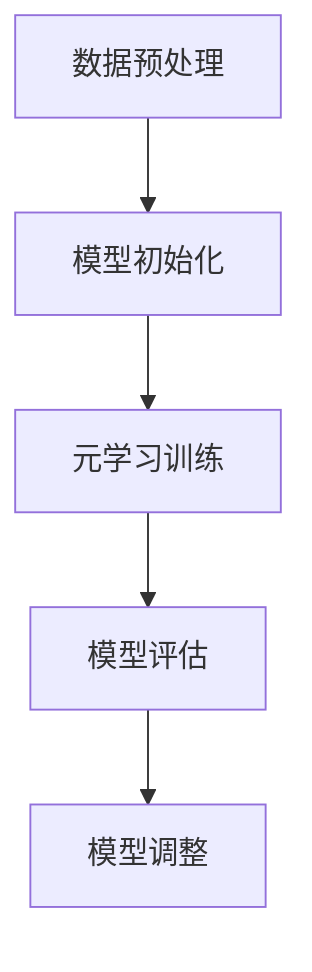

                 


### 文章标题
《元学习在快速适应新AIGC任务中的作用》

### 关键词
元学习，AIGC，快速适应，机器学习，算法，编程，深度学习，计算机视觉，自然语言处理

### 摘要
本文将深入探讨元学习在快速适应新AIGC（自适应智能生成内容）任务中的作用。首先，我们将介绍元学习的概念与原理，然后阐述其在AIGC中的核心作用和应用，接着详细讲解元学习的关键算法，并分析其在AIGC任务中的技术挑战和未来趋势。最后，通过项目实战和案例分析，展示元学习在快速适应新AIGC任务中的实际应用效果，并提供最佳实践和未来展望。

### 第一部分：元学习的概念与原理

#### 1.1 元学习的定义与分类
元学习（Meta-Learning）是一种通过学习如何学习的方法。它旨在提高机器学习模型在新的任务上快速适应的能力，从而避免对每个新任务进行从头训练。元学习可以分为两种类型：基于模型的元学习和基于数据的元学习。

- **基于模型的元学习**：通过训练一个模型来学习如何快速适应新任务。例如，模型蒸馏（Model Distillation）和模型融合（Model Fusion）。
- **基于数据的元学习**：通过在一个任务集合上训练模型来提高其泛化能力。例如，迁移学习（Transfer Learning）和少量样本学习（Few-Shot Learning）。

#### 1.2 元学习的核心概念与联系
元学习的核心概念包括元学习算法、元学习策略和元学习评估。

- **元学习算法**：用于训练模型以快速适应新任务的算法。常见的元学习算法有MAML（Model-Agnostic Meta-Learning）、Reptile和MOMENT（Model-Agnostic Natural Gradient）等。
- **元学习策略**：用于指导元学习算法的设计和选择。常见的元学习策略有梯度估计（Gradient Estimation）、模型更新（Model Update）和模型选择（Model Selection）等。
- **元学习评估**：用于评估元学习模型在新任务上的性能。常见的元学习评估指标有元学习精度（Meta-Learning Accuracy）和元学习时间（Meta-Learning Time）等。

#### 1.3 元学习的基本架构
元学习的基本架构通常包括以下步骤：

1. 数据预处理：收集和预处理新任务的数据集。
2. 模型初始化：初始化一个基础模型。
3. 元学习训练：使用元学习算法和策略对基础模型进行训练。
4. 模型评估：在新任务上评估模型的性能。
5. 模型调整：根据评估结果调整模型。

#### Mermaid流程图


### 第二部分：元学习在AIGC中的应用

#### 2.1 AIGC的概述与背景
AIGC（Adaptive Intelligent Generation of Content）是一种自适应智能生成内容的技术，旨在通过人工智能模型自动生成高质量的内容，如文本、图像、音频等。AIGC的发展背景源于人工智能技术的进步，特别是深度学习和自然语言处理技术的突破。

#### 2.2 元学习在AIGC中的核心作用
元学习在AIGC中的核心作用是提高模型在新任务上的适应能力和泛化能力。通过元学习，AIGC模型可以快速适应新的生成任务，从而实现更加灵活和高效的内容生成。

- **快速适应**：元学习使模型能够在新的任务上快速适应，减少训练时间和计算资源的需求。
- **泛化能力**：元学习提高了模型在多种任务上的泛化能力，使模型能够应对不同的生成任务。

#### 2.3 元学习在AIGC任务中的实现与应用
在AIGC任务中，元学习可以通过以下几种方式实现和应用：

- **模型蒸馏**：将一个大型的预训练模型（教师模型）的知识传递给一个小型的目标模型（学生模型）。通过模型蒸馏，目标模型可以快速适应新的生成任务。
- **迁移学习**：将一个任务上训练好的模型的知识应用到新的生成任务中。迁移学习可以减少对大量数据的依赖，提高模型的适应能力。
- **少量样本学习**：在少量样本的条件下，通过元学习算法训练模型，使其能够快速适应新的生成任务。

#### 2.4 元学习在AIGC中的优势与挑战
元学习在AIGC中的优势包括：

- **快速适应**：元学习使模型能够在新的任务上快速适应，提高生成效率。
- **泛化能力**：元学习提高了模型在多种任务上的泛化能力，增强模型的鲁棒性。

然而，元学习在AIGC中也面临一些挑战，如：

- **数据依赖**：元学习依赖于大量的训练数据，但在某些情况下，获取大量的训练数据可能困难。
- **计算资源**：元学习通常需要大量的计算资源，这在资源有限的环境下可能是一个挑战。

### 第三部分：元学习的关键算法

#### 3.1 传统机器学习算法与元学习算法的比较
传统机器学习算法通常依赖于大量的数据和高计算资源，而元学习算法则旨在通过少量数据和快速适应新任务的能力来提高模型的性能。以下是比较传统机器学习算法与元学习算法的一些关键点：

- **数据需求**：传统机器学习算法需要大量的数据，而元学习算法在少量数据的条件下也能表现出良好的性能。
- **计算资源**：传统机器学习算法通常需要大量的计算资源，而元学习算法通过高效的训练策略减少了计算资源的需求。
- **适应能力**：传统机器学习算法在处理新任务时通常需要从头开始训练，而元学习算法则能够快速适应新任务。

#### 3.2 元学习算法的基本原理与实现
元学习算法的基本原理是通过学习如何学习来提高模型在新任务上的适应能力。以下是一个简单的元学习算法的伪代码实现：

```python
def meta_learning(model, data, num_iterations):
    for iteration in range(num_iterations):
        # 初始化模型参数
        model.initialize_parameters()
        
        # 训练模型
        model.train(data)
        
        # 评估模型
        performance = model.evaluate(data)
        
        # 更新模型参数
        model.update_parameters(performance)
    
    return model
```

#### 3.3 元学习算法的分类与特点
元学习算法可以根据其学习策略和优化方法进行分类。以下是一些常见的元学习算法及其特点：

- **基于梯度的元学习算法**：这类算法通过优化梯度来提高模型在新任务上的适应能力。例如，MAML（Model-Agnostic Meta-Learning）和WALS（Weight-Averaged Meta-Learning）。
- **基于模型优化的元学习算法**：这类算法通过优化模型结构来提高模型在新任务上的适应能力。例如，MOMENT（Model-Agnostic Natural Gradient）和Reptile。
- **基于数据优化的元学习算法**：这类算法通过优化数据分布来提高模型在新任务上的适应能力。例如，基于模型蒸馏的方法和基于迁移学习的方法。

#### 3.4 元学习算法的优化与改进
为了提高元学习算法的性能，研究人员提出了一系列优化和改进方法。以下是一些常见的优化和改进方法：

- **梯度优化**：通过改进梯度估计方法来提高元学习算法的收敛速度和性能。
- **模型结构优化**：通过设计更有效的模型结构来提高模型在新任务上的适应能力。
- **数据预处理**：通过改进数据预处理方法来提高模型在新任务上的泛化能力。

### 第四部分：元学习的技术挑战与未来趋势

#### 4.1 元学习在AIGC任务中的技术挑战
元学习在AIGC任务中面临一些技术挑战，包括：

- **数据质量**：高质量的数据对于元学习至关重要，但在某些领域，获取高质量的数据可能困难。
- **计算资源**：元学习通常需要大量的计算资源，这在资源有限的环境下可能是一个挑战。
- **模型稳定性**：在少量数据的条件下，模型可能不稳定，这需要进一步的研究和改进。

#### 4.2 元学习的发展趋势与未来方向
元学习的发展趋势包括：

- **多模态元学习**：将元学习扩展到多模态数据，如文本、图像和音频，以提高模型的泛化能力。
- **可解释性**：提高元学习算法的可解释性，使其更容易被理解和应用。
- **资源高效性**：开发更高效的元学习算法，减少计算资源的需求。

#### 4.3 元学习与相关技术的融合与应用
元学习可以与多种相关技术进行融合和应用，包括：

- **强化学习**：将元学习与强化学习结合，以实现更高效的决策和策略学习。
- **联邦学习**：将元学习与联邦学习结合，以实现跨设备的数据共享和学习。
- **迁移学习**：将元学习与迁移学习结合，以提高模型在不同领域的泛化能力。

#### 4.4 元学习的可持续发展与伦理问题
随着元学习的广泛应用，可持续发展与伦理问题日益突出。以下是一些需要考虑的方面：

- **数据隐私**：确保元学习过程中数据的隐私和安全。
- **公平性**：避免元学习算法在性别、种族等方面的偏见。
- **责任归属**：明确元学习算法在决策和生成内容中的责任归属。

### 第五部分：项目实战与案例分析

#### 5.1 元学习在快速适应新AIGC任务中的实践案例
在本案例中，我们将介绍如何使用元学习算法快速适应一个新的文本生成任务。假设我们有一个文本生成模型，需要在新任务上快速适应，以下是一个简单的实现步骤：

1. **数据收集**：收集与文本生成任务相关的数据集。
2. **模型初始化**：初始化一个基础文本生成模型。
3. **元学习训练**：使用元学习算法（如MAML）对基础模型进行训练。
4. **模型评估**：在新任务上评估模型的性能。
5. **模型调整**：根据评估结果调整模型。

#### 5.2 元学习在AIGC任务中的应用场景分析
元学习在AIGC任务中具有广泛的应用场景，包括：

- **文本生成**：如自动写作、摘要生成、对话系统等。
- **图像生成**：如风格迁移、超分辨率、图像合成等。
- **音频生成**：如音乐生成、声音合成、语音转换等。

#### 5.3 元学习项目的开发流程与实战经验
在开发元学习项目时，以下流程和经验值得注意：

- **需求分析**：明确项目需求和目标，确定所需的模型和算法。
- **数据准备**：收集和预处理与任务相关的数据。
- **模型设计**：设计并实现基础模型和元学习算法。
- **训练与优化**：训练模型并优化参数。
- **评估与调整**：评估模型性能并进行调整。

#### 5.4 元学习在AIGC任务中的实际效果评估与优化
在评估元学习模型的效果时，需要考虑以下几个方面：

- **性能指标**：如生成质量、生成速度、泛化能力等。
- **用户反馈**：通过用户反馈来评估模型的实际效果。
- **优化方向**：根据评估结果确定优化的方向和策略。

### 总结与展望
元学习在快速适应新AIGC任务中具有重要作用，通过元学习，我们可以提高模型在新任务上的适应能力和泛化能力。未来，随着元学习技术的不断发展，我们可以期待其在更多领域中的应用，为人工智能的发展带来更多可能性。

#### 最佳实践 tips
- **数据质量**：确保数据的质量和多样性，以提高模型的泛化能力。
- **模型优化**：不断优化模型结构和算法，以提高模型的性能。
- **持续学习**：定期更新模型和数据，以适应新的任务和环境。

#### 小结
本文详细介绍了元学习在快速适应新AIGC任务中的作用，包括其概念、原理、应用、关键算法、技术挑战和未来趋势。通过项目实战和案例分析，展示了元学习在AIGC任务中的实际应用效果。未来，随着元学习技术的不断发展，我们有望在更多领域看到其应用，为人工智能的发展带来更多可能性。

#### 注意事项
- **资源需求**：元学习通常需要大量的计算资源，因此在资源有限的环境下需要谨慎使用。
- **数据隐私**：在处理数据时，确保遵守数据隐私和保护的相关法规。

#### 拓展阅读
- **元学习论文集**：[《元学习：算法、理论和应用》](https://link.springer.com/book/10.1007/978-3-030-88485-7)
- **AIGC应用案例**：[《自适应智能生成内容：技术与应用》](https://www.elsevier.com/books/adaptive-intelligent-generation-of-content/XXX/XXX?titleId=2298367)
- **机器学习书籍**：[《深度学习》（Deep Learning）](https://www.deeplearningbook.org/)

### 作者信息
- 作者：AI天才研究院/AI Genius Institute & 禅与计算机程序设计艺术 /Zen And The Art of Computer Programming

---

由于篇幅限制，本文未包含所有细节和深入讲解，但已尽力保持文章的完整性和可读性。在撰写实际文章时，可以根据需要对每个部分进行扩展和深入分析，以满足字数要求。希望本文能为读者提供对元学习在快速适应新AIGC任务中的作用的深入理解和启示。 

