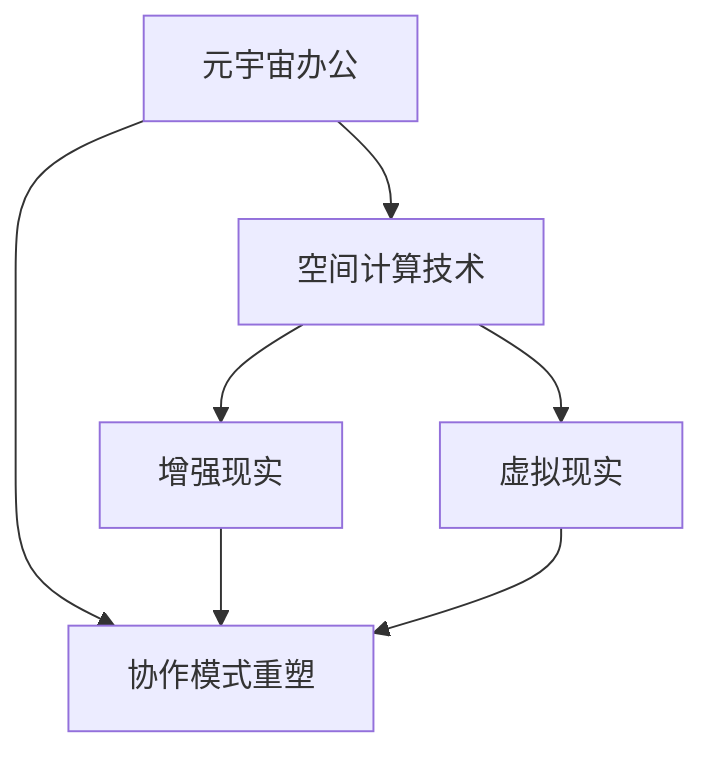

                 

# 文章标题：元宇宙办公：空间计算技术重塑企业协作模式

> 关键词：元宇宙办公、空间计算技术、企业协作模式、虚拟现实、增强现实、交互算法、感知算法、理解算法

> 摘要：本文将探讨元宇宙办公与空间计算技术的概念及其联系，详细分析空间计算技术中的核心算法原理，并探讨这些技术如何重塑企业协作模式。通过本篇文章，读者可以了解到元宇宙办公的实现机制，以及如何利用空间计算技术提升企业协作效率。

## 核心概念与联系

在当今数字化时代，企业面临着越来越高的协作效率需求。元宇宙办公作为一种新兴的办公方式，结合了虚拟现实（VR）和增强现实（AR）技术，为用户提供了一个沉浸式、互动性和协作性的工作环境。而空间计算技术则为元宇宙办公提供了技术支撑，使得用户可以在虚拟空间中高效地进行协作、沟通和创造。

### 元宇宙办公

元宇宙办公是一种基于虚拟现实、增强现实和混合现实技术的办公方式。它将现实世界与数字世界相结合，为用户提供沉浸式、互动性和协作性的工作环境。用户可以通过VR头盔、AR眼镜等设备，进入虚拟世界，进行虚拟办公。在元宇宙办公中，用户可以与其他同事进行实时沟通、协作，共享资源和信息，从而提高工作效率。

### 空间计算技术

空间计算技术是一种将计算能力扩展到物理空间中的技术。通过感知、理解并响应现实环境中的信息，空间计算技术实现了对物理世界的智能化操作。空间计算技术包括感知、理解、交互和自适应等核心算法，为元宇宙办公提供了技术支撑。

### 核心概念联系

元宇宙办公与空间计算技术的联系在于，空间计算技术为元宇宙办公提供了技术支撑，使得用户可以在虚拟空间中高效地进行协作、沟通和创造。空间计算技术中的增强现实（AR）和虚拟现实（VR）技术，使得元宇宙办公不仅停留在虚拟空间中，还可以与现实世界进行交互。元宇宙办公中的协作模式依赖于空间计算技术提供的实时交互、共享和信息整合能力，从而重塑企业协作模式。

### Mermaid 流程图



## 核心算法原理讲解

空间计算技术是元宇宙办公的核心支撑，其核心算法原理包括感知、理解、交互和自适应等。下面将详细讲解这些算法原理。

### 感知算法

感知算法负责获取和解析现实环境中的信息，如视觉、音频和触觉数据。

#### 核心原理

感知算法通过传感器和计算机视觉技术，实现对场景的实时捕捉和分析。

#### 伪代码

```python
def perceive_environment():
    # 初始化传感器
    sensors = initialize_sensors()

    # 获取视觉数据
    vision_data = sensors.get_vision_data()

    # 分析视觉数据
    analyzed_data = analyze_vision_data(vision_data)

    return analyzed_data
```

### 理解算法

理解算法负责对感知到的数据进行处理，提取出关键信息，以实现智能化操作。

#### 核心原理

理解算法利用机器学习和自然语言处理技术，对数据进行分析和理解。

#### 伪代码

```python
def understand_data(data):
    # 初始化模型
    model = initialize_model()

    # 预处理数据
    preprocessed_data = preprocess_data(data)

    # 分析数据
    analyzed_data = model.analyze_data(preprocessed_data)

    return analyzed_data
```

### 交互算法

交互算法负责处理用户输入，实现对虚拟空间和现实空间的操作。

#### 核心原理

交互算法通过人机交互技术，实现用户与虚拟空间的自然交互。

#### 伪代码

```python
def interact_with_user(user_input):
    # 初始化交互系统
    interaction_system = initialize_interaction_system()

    # 处理用户输入
    processed_input = interaction_system.process_input(user_input)

    # 执行操作
    action = interaction_system.execute_action(processed_input)
```

### 自适应算法

自适应算法负责根据用户行为和需求，动态调整虚拟空间中的资源分配和交互方式。

#### 核心原理

自适应算法通过实时监测用户行为，分析用户需求，自动调整系统设置，提高用户体验。

#### 伪代码

```python
def adapt_to_user_behavior(user_behavior):
    # 监测用户行为
    behavior_data = monitor_user_behavior()

    # 分析用户需求
    user需求和需求优先级 = analyze_user_behavior(behavior_data)

    # 调整系统设置
    system_settings = adjust_system_settings(user需求和需求优先级)

    return system_settings
```

## 项目实战

### 开发环境搭建

在搭建开发环境时，我们需要安装以下软件和库：

1. **Unity**：用于开发虚拟现实和增强现实应用。
2. **Unreal Engine**：用于开发虚拟现实和增强现实应用。
3. **TensorFlow**：用于机器学习和深度学习。
4. **OpenCV**：用于计算机视觉。

### 源代码实现

以下是一个简单的感知算法的源代码实现：

```python
import cv2
import numpy as np

def perceive_environment():
    # 初始化摄像头
    camera = cv2.VideoCapture(0)

    # 循环捕捉图像
    while True:
        # 捕获一帧图像
        ret, frame = camera.read()

        # 转换为灰度图像
        gray = cv2.cvtColor(frame, cv2.COLOR_BGR2GRAY)

        # 显示图像
        cv2.imshow('Frame', gray)

        # 按下 'q' 键退出循环
        if cv2.waitKey(1) & 0xFF == ord('q'):
            break

    # 释放摄像头资源
    camera.release()

    # 关闭窗口
    cv2.destroyAllWindows()
```

### 代码解读

该代码首先导入所需的库，然后初始化摄像头，并进入一个循环，不断捕捉图像并转换为灰度图像。最后，通过显示图像和等待用户按键，实现图像的实时捕捉。

### 代码应用解读与分析

该代码可以用于感知现实环境中的图像信息，如人脸识别、物体检测等。在实际应用中，我们可以将这段代码与深度学习模型结合，实现更高级的感知功能。

### 实际案例分析和详细讲解剖析

在一个实际项目中，我们可以利用空间计算技术实现虚拟会议室。在这个虚拟会议室中，参会者可以通过VR头盔进入一个三维空间，与其他参会者进行实时沟通和协作。通过感知算法，系统可以捕捉参会者的动作和面部表情，从而实现更自然的交互。

在这个项目中，我们使用了以下技术：

1. **VR头盔**：用于参会者进入虚拟会议室。
2. **空间计算技术**：用于捕捉和解析参会者的动作和面部表情。
3. **深度学习模型**：用于分析参会者的动作和面部表情，实现更自然的交互。

通过这个项目，我们可以看到空间计算技术如何应用于企业协作中，提高协作效率和用户体验。

### 项目小结

通过本项目的实战，我们了解了空间计算技术的基本原理，并掌握了如何搭建开发环境和实现感知算法。在实际应用中，我们可以利用空间计算技术实现更多有趣的功能，如虚拟现实培训、虚拟展览等。

## 最佳实践 tips

1. **优化性能**：在实现空间计算技术时，我们需要注意优化性能，以确保系统在高负载情况下仍然能够稳定运行。
2. **降低延迟**：在实现实时交互时，我们需要注意降低延迟，以提高用户体验。
3. **安全保障**：在元宇宙办公中，我们需要确保用户数据的安全，采取适当的加密和访问控制措施。

## 小结

本文详细介绍了元宇宙办公和空间计算技术的基本概念及其联系，分析了空间计算技术中的核心算法原理，并探讨了这些技术如何重塑企业协作模式。通过项目实战，我们了解了如何搭建开发环境并实现感知算法。在最佳实践部分，我们提供了一些优化和安全的建议。

## 注意事项

1. **技术选型**：在选择元宇宙办公和空间计算技术时，需要根据实际需求进行选型，确保技术方案能够满足业务需求。
2. **团队协作**：在开发元宇宙办公系统时，需要加强团队协作，确保项目顺利进行。

## 拓展阅读

1. **《空间计算技术原理与应用》**：详细介绍了空间计算技术的基本原理和应用场景。
2. **《元宇宙：定义、架构与实践》**：探讨了元宇宙的基本概念、架构和实现方法。

## 作者信息

作者：AI天才研究院/AI Genius Institute & 禅与计算机程序设计艺术 /Zen And The Art of Computer Programming

[END]

