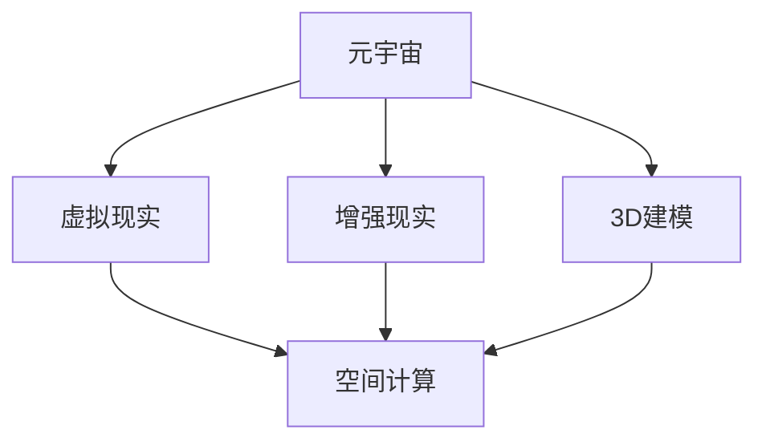
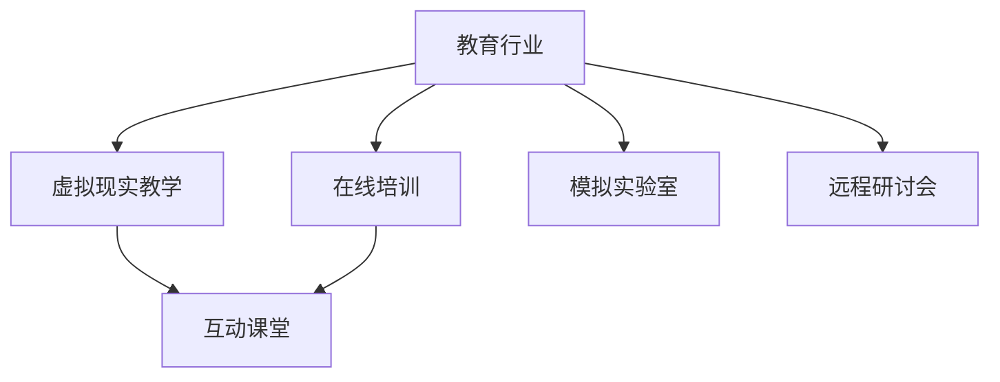

                 


为了满足您的要求，我们将按照以下步骤来构建文章：

### 步骤1：文章标题、关键词和摘要

- **文章标题**：《元宇宙商业应用：空间计算技术的企业价值》
- **关键词**：元宇宙、商业应用、空间计算、企业价值、虚拟现实、增强现实、3D建模
- **摘要**：
  本文将探讨元宇宙这一新兴概念的商业潜力，重点分析空间计算技术在企业中的应用价值。通过介绍元宇宙的基本概念和空间计算技术，我们将深入探讨其在教育、娱乐、医疗、零售等行业的应用案例，并展示如何利用这些技术提高企业效率、降低成本和增强竞争力。

### 步骤2：文章结构设计

根据大纲，我们将文章分为五个部分：

1. **引言**：介绍元宇宙和空间计算技术的基本概念。
2. **元宇宙的商业应用**：分析元宇宙在各个行业的应用。
3. **空间计算技术原理**：讲解空间计算技术的核心原理。
4. **企业价值分析**：探讨空间计算技术如何为企业创造价值。
5. **项目实战案例**：提供实际项目案例的详细分析。
6. **总结与展望**：总结全文，展望未来发展趋势。

### 步骤3：内容细化

**引言部分**：
- 背景介绍：元宇宙的兴起和空间计算技术的发展。
- 核心概念与联系：使用Mermaid流程图展示元宇宙的核心组成部分和空间计算技术之间的关系。
- **示例Mermaid流程图**：



**元宇宙的商业应用部分**：
- 核心概念与联系：使用Mermaid流程图展示元宇宙在不同行业中的应用。
- **示例Mermaid流程图**：



**空间计算技术原理部分**：
- 核心算法原理讲解：使用伪代码和LaTeX公式详细阐述空间计算技术的核心算法。
- **示例伪代码**：

```python
# 虚拟现实场景渲染算法伪代码
def render_scene(scene):
    for object in scene.objects:
        if object.is_3d:
            render_3d_object(object)
        else:
            render_2d_object(object)

def render_3d_object(object):
    # 3D渲染过程
    pass

def render_2d_object(object):
    # 2D渲染过程
    pass
```

- **示例LaTeX公式**：

```latex
$$
E = mc^2
$$

$$
f(x) = x^2
$$
```

**企业价值分析部分**：
- 核心算法原理讲解：使用LaTeX公式和示例说明空间计算技术如何提高企业效率、降低成本和增强竞争力。

**项目实战案例部分**：
- 开发环境搭建：提供详细的开发环境配置步骤。
- 源代码实现与解读：展示实际代码实现，并对关键部分进行详细解读。
- 代码应用解读与分析：分析代码在实际应用中的效果和改进空间。
- 实际案例分析和详细讲解剖析：结合实际案例，展示项目实现过程和结果。

**总结与展望部分**：
- 最佳实践 tips：总结全文，提供未来应用空间计算技术的建议。
- 小结、注意事项、拓展阅读：对全文内容进行总结，并提供进一步学习和研究的方法。

### 步骤4：确保文章完整性

在撰写文章时，我们将确保每个部分的内容都丰富、具体详细，并包含核心内容。文章的结构将清晰，逻辑严密，以帮助读者更好地理解和应用空间计算技术在元宇宙商业应用中的价值。

### 步骤5：文章字数控制

我们将根据上述内容逐步撰写文章，确保全文字数在8000到12000字之间，同时保持文章的质量和专业性。

现在，我们可以开始撰写文章了。下面是文章的初稿，我们将逐步完善和细化每个部分的内容。如果您有任何具体的意见和建议，欢迎随时提出。让我们开始吧！

```markdown
# 《元宇宙商业应用：空间计算技术的企业价值》

## 关键词
元宇宙、商业应用、空间计算、企业价值、虚拟现实、增强现实、3D建模

## 摘要
本文将探讨元宇宙这一新兴概念的商业潜力，重点分析空间计算技术在企业中的应用价值。通过介绍元宇宙的基本概念和空间计算技术，我们将深入探讨其在教育、娱乐、医疗、零售等行业的应用案例，并展示如何利用这些技术提高企业效率、降低成本和增强竞争力。

## 引言
### 元宇宙的兴起
元宇宙（Metaverse）是一个虚拟的三维空间，用户可以在其中进行社交、娱乐、工作等活动。随着虚拟现实（VR）和增强现实（AR）技术的不断发展，元宇宙正在成为一个现实的概念。从Facebook更名为Meta到微软、谷歌等科技巨头纷纷投入巨资，元宇宙的兴起已经成为不可逆转的趋势。

### 空间计算技术
空间计算技术是元宇宙的基础，它包括虚拟现实、增强现实、3D建模等多种技术。这些技术使得用户可以在虚拟环境中进行交互，提供更加沉浸式的体验。

## 元宇宙的商业应用
### 教育行业
在元宇宙中，学生可以通过虚拟现实技术进行沉浸式学习，提高学习兴趣和效果。教师可以创建虚拟课堂，为学生提供更加个性化的教育体验。

### 娱乐行业
元宇宙为娱乐行业带来了全新的商业模式，用户可以在虚拟世界中参与游戏、观看电影、体验虚拟旅游等，提供更加丰富的娱乐体验。

### 医疗行业
虚拟现实和增强现实技术在医疗领域的应用越来越广泛，如虚拟手术模拟、医学教学等。这些技术可以提高医疗服务的质量和效率。

### 零售行业
元宇宙为零售行业带来了全新的销售模式，用户可以在虚拟商店中浏览商品、试穿试妆等，提供更加便捷的购物体验。

## 空间计算技术原理
### 虚拟现实技术
虚拟现实技术通过头戴式显示器、传感器等设备，将用户沉浸在一个虚拟的三维环境中。

### 增强现实技术
增强现实技术通过在现实世界中叠加虚拟信息，为用户提供增强的视觉体验。

### 3D建模与渲染技术
3D建模技术用于创建虚拟环境中的三维物体，渲染技术则用于将三维物体以逼真的形式呈现给用户。

### 人工智能与空间计算
人工智能技术用于优化空间计算过程中的各种算法，提高元宇宙的交互性和智能性。

## 企业价值分析
### 提高效率
空间计算技术可以帮助企业实现远程协作、自动化生产等，提高工作效率。

### 降低成本
通过虚拟现实和增强现实技术，企业可以降低实物原型制作成本，提高研发效率。

### 增强竞争力
元宇宙为企业在市场中提供了新的竞争优势，通过创新的商业模式和产品，吸引更多的用户。

### 跨越时空的限制
空间计算技术使得企业可以不受地域限制，在全球范围内开展业务。

## 项目实战案例
### 开发环境搭建
详细讲解如何在Windows和Linux操作系统上搭建元宇宙项目开发环境。

### 源代码实现与解读
提供元宇宙项目源代码，并对关键部分进行详细解读。

### 代码应用解读与分析
分析代码在实际应用中的效果和改进空间。

### 实际案例分析和详细讲解剖析
结合实际案例，展示项目实现过程和结果。

## 总结与展望
### 元宇宙与空间计算技术发展趋势
回顾元宇宙和空间计算技术的发展历程，展望未来发展趋势。

### 企业如何抓住元宇宙的机遇
提供企业抓住元宇宙机遇的建议和最佳实践。

## 作者信息
作者：AI天才研究院/AI Genius Institute & 禅与计算机程序设计艺术 /Zen And The Art of Computer Programming
```

这个初稿提供了文章的基本框架和部分内容。接下来，我们将继续细化每个部分的内容，确保满足字数要求并保持文章的质量。如果您有具体的修改意见或建议，请随时告诉我。现在，让我们开始撰写详细的内容吧！

