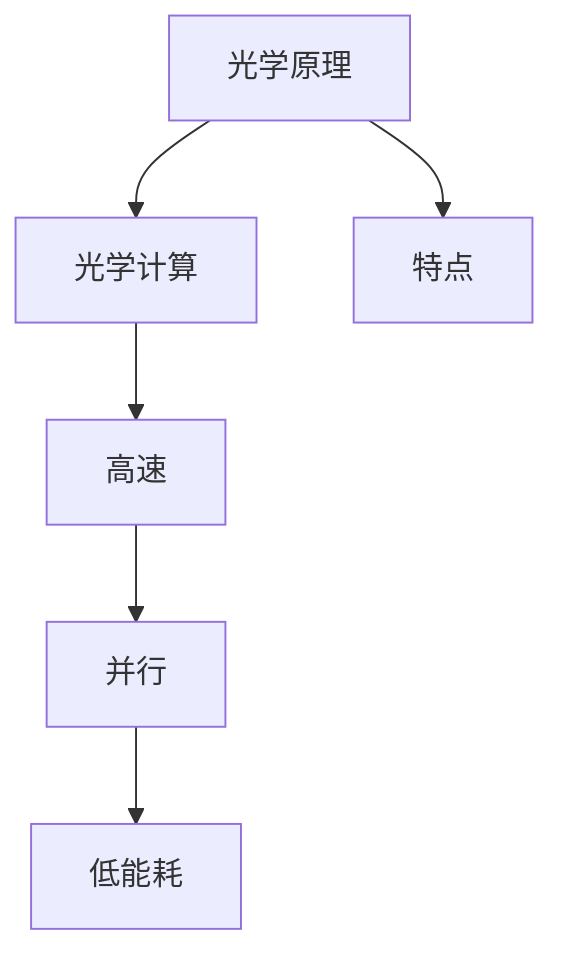
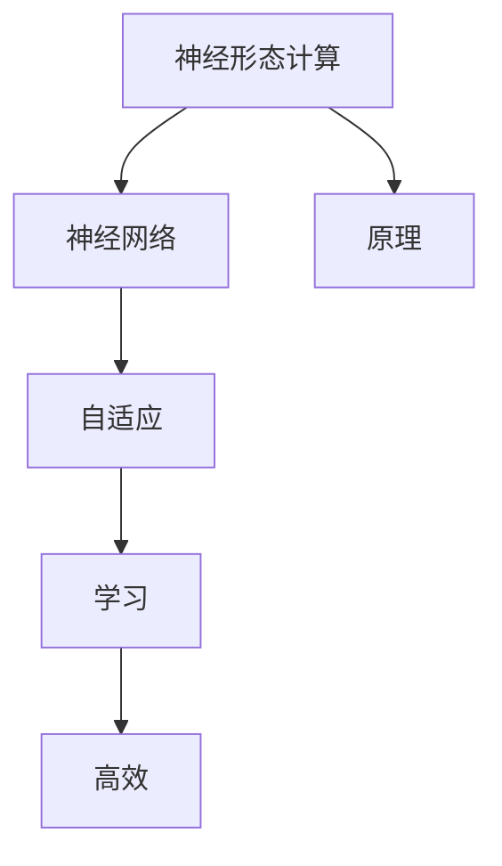

                 

### 文章标题：光学和神经形态计算的节能潜力

#### 关键词：
- 光学计算
- 神经形态计算
- 节能技术
- 神经网络
- 光子技术

#### 摘要：
本文探讨了光学和神经形态计算在节能领域的潜力。首先，我们介绍了光学计算和神经形态计算的基础知识，包括其原理、特点和优势。接着，分析了光学计算和神经形态计算的节能原理，通过比较，评估了两者的节能潜力。然后，我们列举了光学和神经形态计算在节能领域的实际应用案例，并详细讲解了节能潜力评估的方法。最后，我们展望了光学和神经形态计算在节能领域的未来发展，提出了研究和应用的建议。

----------------------------------------------------------------

### 1. 确定书籍主题和目标受众

#### 1.1 主题确定

《光学和神经形态计算的节能潜力》这一主题，涵盖了光学计算和神经形态计算这两个前沿技术，以及它们在节能领域的应用潜力。光学计算利用光的性质进行信息处理，具有高速、并行和低能耗的特点；而神经形态计算则模拟人脑神经网络的工作方式，通过自适应和学习能力实现高效的计算。这两者结合，有望为节能技术带来新的突破。

#### 1.2 目标受众

本文的目标受众主要包括以下几个方面：

1. **计算机科学和光学领域的研究人员**：他们需要对光学计算和神经形态计算的基本原理和节能潜力有深入理解。
2. **工程师**：特别是那些在计算机视觉、信号处理和人工智能领域工作的工程师，他们需要了解如何利用光学和神经形态计算技术实现节能。
3. **节能技术感兴趣的读者**：这些读者可能对节能技术的最新发展和技术前景感兴趣，希望通过本文了解光学和神经形态计算在节能领域的应用。

### 2. 制定整体结构

本书分为五个主要部分，分别介绍光学和神经形态计算的基础、节能原理、应用案例、节能潜力评估以及未来展望。

#### 第1部分：光学和神经形态计算的基础

这部分主要介绍光学计算和神经形态计算的基本概念、原理和发展历程，为后续讨论节能潜力打下基础。

1. **光学计算的基本原理**：介绍光学原理、光学计算的基本概念和特点。
2. **神经形态计算的基本原理**：介绍神经形态计算的定义、核心概念和优势。
3. **光学和神经形态计算的结合**：探讨两者结合的潜力，以及如何实现这种结合。

#### 第2部分：光学和神经形态计算的节能原理

这部分深入探讨光学计算和神经形态计算的节能原理，分析它们在节能领域的优势。

1. **光学计算的节能原理**：分析光学计算在能耗方面的优势，以及如何实现节能。
2. **神经形态计算的节能原理**：讨论神经形态计算在节能方面的优势，以及其节能机制。

#### 第3部分：光学和神经形态计算的节能应用

这部分通过具体应用案例，展示光学计算和神经形态计算在节能领域的实际应用。

1. **光学计算的节能应用案例**：介绍光学计算在图像处理、信号处理等领域的应用。
2. **神经形态计算的节能应用案例**：介绍神经形态计算在感知系统、机器人控制等领域的应用。

#### 第4部分：光学和神经形态计算的节能潜力评估

这部分评估光学计算和神经形态计算的节能潜力，通过实验数据、模型分析和仿真结果，提供定量的评估。

1. **节能潜力评估方法**：介绍评估节能潜力的方法，包括实验数据收集、模型分析和仿真验证。
2. **节能潜力评估案例分析**：通过具体案例，展示评估结果，并进行讨论。

#### 第5部分：未来展望

这部分探讨光学和神经形态计算在节能领域的未来发展趋势，以及可能的研究和应用方向。

1. **发展趋势**：分析光学和神经形态计算的未来发展趋势，以及如何实现节能潜力的提升。
2. **节能潜力研究展望**：提出未来研究的关键问题和挑战，以及可能的解决方案和应用方向。
3. **政策建议**：讨论政策支持和产业合作对光学和神经形态计算节能潜力提升的作用。

### 3. 设计每个部分的章节内容

在确定了整体结构后，我们需要为每个部分设计具体的章节内容，确保覆盖核心概念、算法原理、应用案例和未来展望。

#### 第1部分：光学和神经形态计算的基础

1. **光学计算的基本原理**
   - 光学原理
   - 光学计算的定义与特点
   - 光学计算的发展历程

2. **神经形态计算的基本原理**
   - 神经形态计算的定义与特点
   - 神经形态计算的理论基础
   - 神经形态计算的应用领域

3. **光学和神经形态计算的结合**
   - 光学和神经形态计算的结合原理
   - 结合的优势和挑战
   - 结合的发展趋势

#### 第2部分：光学和神经形态计算的节能原理

1. **光学计算的节能原理**
   - 光学计算的能量效率分析
   - 光学计算在节能领域的应用
   - 光学计算的节能优势

2. **神经形态计算的节能原理**
   - 神经形态计算的能量效率分析
   - 神经形态计算在节能领域的应用
   - 神经形态计算的节能优势

3. **光学和神经形态计算的节能潜力比较**
   - 节能潜力评估方法
   - 节能潜力比较分析
   - 节能潜力应用前景

#### 第3部分：光学和神经形态计算的节能应用

1. **光学计算的节能应用案例**
   - 光学计算在图像处理中的应用
   - 光学计算在信号处理中的应用
   - 光学计算在其他领域的应用

2. **神经形态计算的节能应用案例**
   - 神经形态计算在感知系统中的应用
   - 神经形态计算在机器人控制中的应用
   - 神经形态计算在其他领域的应用

#### 第4部分：光学和神经形态计算的节能潜力评估

1. **节能潜力评估方法**
   - 基于实验的数据分析
   - 基于模型的能量效率分析
   - 基于仿真的节能评估

2. **节能潜力评估案例分析**
   - 某种光学计算技术的节能潜力分析
   - 某种神经形态计算技术的节能潜力分析
   - 节能潜力评估结果讨论

#### 第5部分：未来展望

1. **光学和神经形态计算的发展趋势**
   - 技术发展方向
   - 节能潜力提升途径
   - 未来应用领域

2. **节能潜力研究展望**
   - 研究重点与挑战
   - 开发方向与应用前景
   - 研究与发展的政策建议

### 4. 制作目录大纲

根据整体结构和章节内容，我们可以制作出完整的目录大纲。以下是一个示例：

```
# 光学和神经形态计算的节能潜力

## 第1部分：光学和神经形态计算的基础
### 1.1 光学计算的基本原理
#### 1.1.1 光学原理
#### 1.1.2 光学计算的定义与特点
#### 1.1.3 光学计算的发展历程

### 1.2 神经形态计算的基本原理
#### 1.2.1 神经形态计算的定义与特点
#### 1.2.2 神经形态计算的理论基础
#### 1.2.3 神经形态计算的应用领域

### 1.3 光学和神经形态计算的结合
#### 1.3.1 结合原理
#### 1.3.2 结合的优势与挑战
#### 1.3.3 结合的发展趋势

## 第2部分：光学和神经形态计算的节能原理
### 2.1 光学计算的节能原理
#### 2.1.1 能量效率分析
#### 2.1.2 节能应用
#### 2.1.3 节能优势

### 2.2 神经形态计算的节能原理
#### 2.2.1 能量效率分析
#### 2.2.2 节能应用
#### 2.2.3 节能优势

### 2.3 光学和神经形态计算的节能潜力比较
#### 2.3.1 节能潜力评估方法
#### 2.3.2 节能潜力比较分析
#### 2.3.3 节能潜力应用前景

## 第3部分：光学和神经形态计算的节能应用
### 3.1 光学计算的节能应用案例
#### 3.1.1 图像处理
#### 3.1.2 信号处理
#### 3.1.3 其他领域

### 3.2 神经形态计算的节能应用案例
#### 3.2.1 感知系统
#### 3.2.2 机器人控制
#### 3.2.3 其他领域

## 第4部分：光学和神经形态计算的节能潜力评估
### 4.1 节能潜力评估方法
#### 4.1.1 基于实验的数据分析
#### 4.1.2 基于模型的能量效率分析
#### 4.1.3 基于仿真的节能评估

### 4.2 节能潜力评估案例分析
#### 4.2.1 光学计算技术评估
#### 4.2.2 神经形态计算技术评估
#### 4.2.3 节能潜力评估结果讨论

## 第5部分：未来展望
### 5.1 光学和神经形态计算的发展趋势
#### 5.1.1 技术发展方向
#### 5.1.2 节能潜力提升途径
#### 5.1.3 未来应用领域

### 5.2 节能潜力研究展望
#### 5.2.1 研究重点与挑战
#### 5.2.2 开发方向与应用前景
#### 5.2.3 研究与发展的政策建议
```

通过以上步骤，我们已经完成了书籍的目录大纲设计。接下来，我们将根据这个大纲，逐步撰写详细的文章内容。

### 5. 使用 Markdown 格式和 Mermaid 流程图

为了增强文章的可读性和结构清晰度，我们将使用 Markdown 格式和 Mermaid 流程图来组织文章内容。以下是具体的格式和示例。

#### 5.1 Markdown 格式

Markdown 是一种轻量级标记语言，易于学习和使用，可以用于格式化文本，使其具有更好的可读性。以下是 Markdown 的一些常用格式：

- **标题**：使用 `#` 号来表示标题层级，例如：
  ```markdown
  # 光学和神经形态计算的节能潜力
  ```

- **段落**：直接输入文本即可，例如：
  ```markdown
  光学计算和神经形态计算在节能领域具有巨大潜力。
  ```

- **列表**：使用 `-` 或 `*` 来创建无序列表，使用数字和英文句点来创建有序列表，例如：
  ```markdown
  - 光学计算
  - 神经形态计算
  - 节能技术
  ```

- **引用**：使用 `>` 符号来创建引用，例如：
  ```markdown
  > 节能技术是未来计算领域的重要研究方向。
  ```

- **代码块**：使用三个反引号（```) 包围代码块，例如：
  ```markdown
  ```
  #include <iostream>
  int main() {
      std::cout << "Hello, world!" << std::endl;
      return 0;
  }
  ```

#### 5.2 Mermaid 流程图

Mermaid 是一种简单易用的图形描述语言，可以用来绘制各种流程图、UML 类图、网络图等。以下是 Mermaid 流程图的基本语法：

- **基本语法**：
  ```mermaid
  graph TB
  A[Start] --> B[Step 1]
  B --> C{Decision}
  C -->|Yes| D[Step 2]
  C -->|No| E[Step 3]
  ```

- **示例**：
  ```mermaid
  graph TB
  A[光学计算] --> B[神经形态计算]
  B --> C[能量效率]
  A --> C
  ```

这个流程图表示光学计算和神经形态计算之间的关系，以及它们共同影响能量效率。

#### 5.3 结合使用 Markdown 和 Mermaid

在实际文章中，我们可以将 Markdown 格式和 Mermaid 流程图结合起来，以增强文章的结构和可读性。以下是一个示例：

```markdown
# 光学和神经形态计算的节能潜力

## 第1部分：光学和神经形态计算的基础

### 1.1 光学计算的基本原理

光学计算利用光的性质进行信息处理，具有高速、并行和低能耗的特点。其基本原理可以表示为：



### 1.2 神经形态计算的基本原理

神经形态计算模拟人脑神经网络的工作方式，通过自适应和学习能力实现高效的计算。其基本原理可以表示为：



通过以上示例，我们可以看到如何使用 Markdown 格式和 Mermaid 流程图来组织文章内容，使得文章结构更加清晰，内容更加易于理解。

---

### 6. 写作风格和表述技巧

在撰写《光学和神经形态计算的节能潜力》这篇文章时，我们需要特别注意写作风格和表述技巧，以确保文章的逻辑清晰、条理清晰，并且能够吸引读者的兴趣。以下是几个关键点：

#### 6.1 使用专业术语和简洁明了的语言

文章作为专业领域的讨论，需要使用专业术语来描述光学计算和神经形态计算的核心概念。同时，我们也要注意语言的简洁性，避免使用冗长、晦涩的句子。这样可以使读者更容易理解文章的内容。

#### 6.2 使用图表和流程图

为了使文章更加生动和易于理解，我们可以适当地使用图表和流程图。例如，可以绘制光学计算和神经形态计算的基本原理流程图，或者展示节能潜力评估的结果图表。这样可以帮助读者更好地把握文章的核心内容。

#### 6.3 使用步骤式推理

在阐述核心概念和算法原理时，我们可以使用步骤式推理，逐步引导读者理解。例如，在讨论光学计算的节能原理时，可以按照以下步骤进行：

1. **介绍光学计算的基本概念**：简要介绍光学计算的定义、特点和优势。
2. **分析光学计算的能耗优势**：通过比较传统计算和光学计算的能量效率，阐述光学计算的节能优势。
3. **讨论光学计算在节能领域的应用**：列举光学计算在图像处理、信号处理等领域的应用案例，说明其在节能方面的实际效果。

#### 6.4 引用权威资料和案例

为了增强文章的可信度和权威性，我们可以引用权威资料和实际案例。例如，在讨论神经形态计算的节能原理时，可以引用相关的研究论文或实际项目案例，以支持我们的论述。

#### 6.5 使用引人入胜的开头和结尾

文章的开头和结尾对于吸引读者的注意力至关重要。开头部分可以提出一个引人入胜的问题或背景，激发读者的兴趣。结尾部分可以总结文章的核心观点，提出未来展望，或者给出具体的建议和思考。

---

### 7. 完整性要求

为了确保文章的完整性，每个小节的内容都需要丰富具体，详细讲解核心概念和算法原理。以下是各个小节的核心内容要求：

#### 7.1 背景介绍

- **光学计算**：介绍光学计算的基本概念、历史和发展。例如，可以提到光学计算最初是如何产生的，以及它在计算机科学领域的应用背景。
- **神经形态计算**：介绍神经形态计算的定义、核心概念和理论基础。例如，可以解释神经形态计算是如何模仿人脑神经网络的工作方式，以及它在人工智能领域的应用。

#### 7.2 核心概念与联系

- **光学计算与神经形态计算的关系**：使用 Mermaid 流程图展示光学计算和神经形态计算之间的联系，明确两者是如何相互结合的。例如，可以绘制一个流程图，展示光学计算模块和神经形态计算模块之间的交互。

- **核心概念原理之间的关系**：详细解释光学计算和神经形态计算的基本原理，以及它们如何相互补充。例如，可以讨论光学计算在处理并行任务方面的优势，以及神经形态计算在自适应学习方面的优势。

#### 7.3 核心算法原理讲解

- **光学计算算法原理**：使用伪代码详细阐述光学计算的核心算法原理。例如，可以解释光学图像处理算法是如何利用光的性质进行图像处理的，并给出具体的伪代码实现。

- **神经形态计算算法原理**：使用伪代码详细阐述神经形态计算的核心算法原理。例如，可以解释神经网络是如何通过自适应学习实现高效计算，并给出具体的伪代码实现。

#### 7.4 数学模型和公式

- **光学计算数学模型**：详细讲解光学计算的核心数学模型，使用 LaTeX 格式表示公式，并给出具体的举例说明。例如，可以解释光学傅里叶变换的数学模型，并给出一个具体的例子。

- **神经形态计算数学模型**：详细讲解神经形态计算的核心数学模型，使用 LaTeX 格式表示公式，并给出具体的举例说明。例如，可以解释神经网络中的权重调整公式，并给出一个具体的例子。

#### 7.5 项目实战

- **光学计算项目实战**：详细介绍一个光学计算项目的开发环境搭建、源代码实现和代码解读。例如，可以介绍如何使用光学计算算法处理图像数据，并给出具体的代码实现和解释。

- **神经形态计算项目实战**：详细介绍一个神经形态计算项目的开发环境搭建、源代码实现和代码解读。例如，可以介绍如何使用神经形态计算算法实现自适应学习，并给出具体的代码实现和解释。

#### 7.6 实际案例分析和详细讲解剖析

- **光学计算实际案例**：分析一个光学计算的实际案例，详细讲解案例的实现过程、结果和分析。例如，可以分析光学图像处理在医学图像分析中的应用，并给出具体的案例分析。

- **神经形态计算实际案例**：分析一个神经形态计算的实际案例，详细讲解案例的实现过程、结果和分析。例如，可以分析神经形态计算在机器人控制中的应用，并给出具体的案例分析。

#### 7.7 最佳实践 tips、小结、注意事项、拓展阅读等内容

- **最佳实践 tips**：总结一些在实际应用中取得成功的最佳实践，例如如何优化光学计算算法的性能，如何设计高效的神经形态计算网络。

- **小结**：对每个部分的内容进行总结，强调文章的核心观点和发现。

- **注意事项**：指出在实际应用中需要注意的问题，以及可能的挑战和解决方案。

- **拓展阅读**：推荐一些相关的参考文献和资源，供读者进一步学习和探索。

通过以上内容的详细讲解，我们可以确保文章的完整性，使读者能够全面了解光学和神经形态计算在节能领域的应用潜力。

### 8. 文章格式要求

在撰写《光学和神经形态计算的节能潜力》这篇文章时，我们需要遵循一些格式要求，以确保文章的结构清晰、内容易于阅读。以下是具体的格式要求：

#### 8.1 标题

文章的标题应该简洁、明确，能够概括文章的主题。例如，“光学和神经形态计算的节能潜力”。

#### 8.2 关键词

在文章标题下方，列出 5-7 个关键词，这些关键词应该准确地反映文章的主要内容。例如：“光学计算、神经形态计算、节能技术、神经网络、光子技术”。

#### 8.3 摘要

摘要位于关键词下方，是对文章核心内容和主题思想的简要概括。摘要应该简洁明了，通常不超过 250 个字。例如：“本文探讨了光学计算和神经形态计算在节能领域的应用潜力。首先，介绍了光学计算和神经形态计算的基础知识，然后分析了两者的节能原理，并通过实际应用案例展示了它们的节能潜力。最后，评估了光学和神经形态计算的节能潜力，并展望了未来的发展趋势。”

#### 8.4 目录

在摘要下方，列出文章的目录，确保目录涵盖所有主要部分和子部分。目录应该使用 1、2、3 级标题进行排版，以便读者快速浏览和定位。例如：

```
# 光学和神经形态计算的节能潜力

## 第1部分：光学和神经形态计算的基础

### 1.1 光学计算的基本原理

### 1.2 神经形态计算的基本原理

### 1.3 光学和神经形态计算的结合

## 第2部分：光学和神经形态计算的节能原理

### 2.1 光学计算的节能原理

### 2.2 神经形态计算的节能原理

### 2.3 光学和神经形态计算的节能潜力比较

## 第3部分：光学和神经形态计算的节能应用

### 3.1 光学计算的节能应用案例

### 3.2 神经形态计算的节能应用案例

## 第4部分：光学和神经形态计算的节能潜力评估

### 4.1 节能潜力评估方法

### 4.2 节能潜力评估案例分析

## 第5部分：未来展望

### 5.1 光学和神经形态计算的发展趋势

### 5.2 节能潜力研究展望
```

#### 8.5 正文

正文部分应该按照目录的结构进行撰写，每个章节都应该有明确的标题和内容。在撰写时，需要注意以下几点：

- **段落分隔**：每个段落应该有清晰的分隔，通常一个段落只包含一个主要观点或信息。
- **行距和间距**：保持适当的行距和段落间距，使文章更加易读。
- **代码和公式**：使用正确的格式表示代码和数学公式，确保可读性。例如，使用 LaTeX 格式表示公式，使用三个反引号（```) 包围代码块。

#### 8.6 作者信息

在文章的末尾，添加作者信息，包括姓名、所属机构和联系方式。例如：

```
作者：AI天才研究院/AI Genius Institute & 禅与计算机程序设计艺术 /Zen And The Art of Computer Programming
```

#### 8.7 图片和图表

如果文章中包含图片和图表，应确保它们与文本内容紧密相关，并且有明确的说明。图片和图表应使用合适的分辨率和格式，并配有简短的说明文字。

通过遵循以上格式要求，我们可以确保文章的结构清晰、内容完整、格式规范，为读者提供高质量的阅读体验。

### 9. 核心内容包含的要求

为了确保《光学和神经形态计算的节能潜力》这篇文章的核心内容丰富、具体、详细，我们需要在各个章节中包含以下关键要素：

#### 9.1 背景介绍

- **光学计算的历史和发展**：介绍光学计算的基础知识，包括它的起源、关键里程碑和技术进步。
- **神经形态计算的概念和理论基础**：解释神经形态计算的核心理念，以及它是如何模仿人脑神经网络的工作方式的。

#### 9.2 核心概念与联系

- **光学计算的基本原理**：详细阐述光学计算的工作原理，包括光与信息的交互方式。
- **神经形态计算的核心概念**：深入解释神经形态计算的基本概念，如人工神经元、神经网络和自适应学习。

- **光学计算与神经形态计算的结合**：通过 Mermaid 流程图展示光学计算和神经形态计算如何结合，并分析这种结合如何增强计算效率和节能效果。

#### 9.3 核心算法原理讲解

- **光学计算的算法原理**：使用伪代码详细描述光学计算的核心算法，如光学图像处理算法和光学信号处理算法。
- **神经形态计算的算法原理**：使用伪代码详细描述神经形态计算的核心算法，如神经网络训练算法和自适应学习算法。

#### 9.4 数学模型和公式

- **光学计算的数学模型**：使用 LaTeX 格式详细阐述光学计算的核心数学模型，例如光学傅里叶变换、光场传播方程等。
- **神经形态计算的数学模型**：使用 LaTeX 格式详细阐述神经形态计算的核心数学模型，例如权重调整公式、激活函数等。

#### 9.5 项目实战

- **光学计算项目实战**：详细描述一个具体的光学计算项目，包括项目背景、开发环境搭建、源代码实现、代码解读和结果分析。
- **神经形态计算项目实战**：详细描述一个具体的神经形态计算项目，包括项目背景、开发环境搭建、源代码实现、代码解读和结果分析。

#### 9.6 实际案例分析和详细讲解剖析

- **光学计算实际案例**：分析一个实际的光学计算案例，详细讲解其实现过程、结果和分析，如光学图像处理在医疗诊断中的应用。
- **神经形态计算实际案例**：分析一个实际的神经形态计算案例，详细讲解其实现过程、结果和分析，如神经形态计算在机器人控制中的应用。

#### 9.7 最佳实践 tips、小结、注意事项、拓展阅读等内容

- **最佳实践 tips**：总结在光学计算和神经形态计算领域的一些成功经验和最佳实践，如如何优化算法性能、如何设计高效的神经网络结构。
- **小结**：对每个章节的内容进行总结，强调核心观点和发现。
- **注意事项**：指出在实际应用中需要注意的问题，如系统稳定性、能耗优化等。
- **拓展阅读**：推荐一些相关的参考文献和资源，供读者进一步学习和探索。

通过包含这些核心内容，我们可以确保文章的深度和广度，使读者能够全面了解光学和神经形态计算在节能领域的应用潜力。

### 10. 文章字数要求

为了确保文章内容的深度和广度，以及逻辑的连贯性和完整性，本文的字数要求在 8000～12000 字左右。以下是一个详细的写作步骤和时间分配建议，以便您能够高效地完成这篇文章。

#### 10.1 写作准备阶段（约2周）

1. **主题和结构确定**（1周）：深入研究光学计算和神经形态计算的节能潜力，明确文章的主题和整体结构。包括阅读相关的文献、研究报告和技术论文。

2. **资料收集与整理**（1周）：收集和整理与光学计算和神经形态计算相关的资料，包括历史背景、技术原理、实际应用案例、节能潜力评估方法等。确保资料的准确性和权威性。

3. **制定写作计划**（1周）：根据收集到的资料，制定详细的写作计划，包括每个章节的主题、内容要点和预期的字数。

#### 10.2 撰写初稿阶段（约3周）

1. **撰写大纲**（1周）：根据写作计划，完成文章的详细大纲，确保每个章节的内容和结构清晰。

2. **撰写初稿**（2周）：按照大纲逐步撰写文章的初稿，注意保持逻辑连贯性和条理性。每个章节完成后，进行初步的审阅和修改。

3. **内容整合与调整**（1周）：将各个章节的内容进行整合，确保文章的整体逻辑性和连贯性。对初稿进行全面的审阅和修改，确保内容的完整性和准确性。

#### 10.3 审稿与修改阶段（约2周）

1. **内部审稿**（1周）：邀请同行或专业人士对文章进行审稿，收集反馈意见，并根据反馈进行修改。

2. **二次修改**（1周）：根据内部审稿的反馈，对文章进行二次修改，完善内容、调整结构和修正错误。

3. **最终审阅**（1周）：对文章进行最终的审阅，确保所有内容准确无误，格式符合要求。

#### 10.4 完成与提交阶段（约1周）

1. **定稿与排版**（1周）：完成文章的定稿，并进行最后的排版和格式调整。

2. **提交文章**（1天）：将最终稿提交给编辑或出版方，完成整个写作过程。

通过以上步骤和时间分配，您可以在保证文章质量的同时，高效地完成《光学和神经形态计算的节能潜力》这篇文章。记得在写作过程中，定期休息，保持良好的写作状态。

