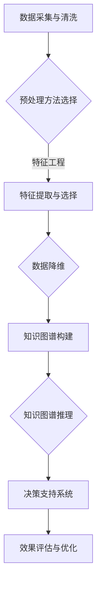

                 

# 利用思维链增强AI的认知、分析与决策能力

> 关键词：AI认知能力、数据分析、知识表示、决策能力、思维链、算法优化、跨领域应用

> 摘要：本文旨在探讨如何通过思维链来增强人工智能（AI）的认知、分析与决策能力。文章首先介绍了AI的基本概念和现状，然后详细阐述了认知能力、分析能力与决策能力的核心概念和关系。接下来，文章从数据处理与分析、知识表示与推理、统计分析、机器学习、决策理论、模型优化等多个角度，深入解析了如何利用思维链来提升AI的综合能力。最后，文章通过两个实际案例，展示了思维链在增强AI认知、分析与决策能力方面的具体应用，并对未来进行了展望。

## 第1章 引言

### 1.1 本书目标

本书的目标是探讨如何利用思维链增强人工智能的认知、分析与决策能力。随着人工智能技术的不断发展，AI在各个领域的应用越来越广泛，但其认知、分析和决策能力仍有待提高。思维链作为一种新的思维方式，可以有效地整合和运用各种知识，从而提升AI的综合能力。本书将从多个角度详细解析如何实现这一目标，旨在为读者提供一套完整的思维链提升AI能力的框架和方法。

### 1.1.1 增强AI认知能力

AI的认知能力是指其感知、理解、推理和记忆等方面的能力。要增强AI的认知能力，首先需要对数据进行有效的处理与分析。这包括数据采集与清洗、数据预处理和特征工程等步骤。同时，知识表示与推理也是提升AI认知能力的重要手段。知识图谱和知识表示方法可以有效地将结构化和非结构化数据转化为AI可理解的形式，从而支持AI的推理和决策。

#### 1.1.1.1 数据处理与分析

##### 1.1.1.1.1 数据采集与清洗

数据采集与清洗是数据处理与分析的基础。数据采集包括从各种来源获取数据，如互联网、数据库、传感器等。数据清洗则是对采集到的数据进行去重、去噪、补全等处理，以提高数据质量。

##### 1.1.1.1.2 数据预处理

数据预处理包括数据归一化、标准化、离散化等操作，以适应不同算法对数据的要求。此外，还需要进行数据降维，减少数据维度，提高计算效率。

##### 1.1.1.1.3 特征工程

特征工程是数据处理与分析的核心。通过选择和构造合适的特征，可以提升模型的性能和泛化能力。特征工程包括特征提取、特征选择、特征变换等步骤。

#### 1.1.1.2 知识表示与推理

##### 1.1.1.2.1 知识图谱

知识图谱是一种基于图结构的知识表示方法，可以有效地表示复杂的关系和数据。通过构建知识图谱，可以实现对数据的深度理解和关联分析。

##### 1.1.1.2.2 知识表示

知识表示是将领域知识转化为计算机可理解的形式。常见的知识表示方法包括逻辑表示、语义网络表示和本体论表示等。

##### 1.1.1.2.3 知识推理

知识推理是基于知识表示的推理方法，包括基于规则的推理、基于模型的推理和基于数据的推理等。通过知识推理，可以实现对未知信息的推断和预测。

### 1.1.2 增强AI分析能力

AI的分析能力是指其进行统计分析、模式识别和预测等方面的能力。要增强AI的分析能力，可以采用以下方法：

#### 1.1.2.1 统计分析

##### 1.1.2.1.1 描述性统计分析

描述性统计分析是对数据进行汇总和描述的方法，包括均值、中位数、标准差等统计量。

##### 1.1.2.1.2 探索性数据分析

探索性数据分析是对数据分布、关系和模式进行可视化分析的方法，以发现潜在规律。

##### 1.1.2.1.3 聚类分析

聚类分析是将数据分成若干类别的方法，以发现数据中的自然分组。

#### 1.1.2.2 机器学习

##### 1.1.2.2.1 监督学习

监督学习是基于已知标签数据训练模型的方法，适用于分类和回归问题。

##### 1.1.2.2.2 无监督学习

无监督学习是基于未知标签数据训练模型的方法，适用于聚类和降维等问题。

##### 1.1.2.2.3 强化学习

强化学习是基于与环境交互来训练模型的方法，适用于决策和优化问题。

### 1.1.3 增强AI决策能力

AI的决策能力是指其在复杂环境下进行决策的能力。要增强AI的决策能力，可以采用以下方法：

#### 1.1.3.1 决策理论

##### 1.1.3.1.1 决策分析框架

决策分析框架是进行决策分析的基本工具，包括目标设定、方案生成、评估和选择等步骤。

##### 1.1.3.1.2 决策树

决策树是一种基于树结构的决策分析方法，适用于分类和回归问题。

##### 1.1.3.1.3 线性规划

线性规划是一种基于数学规划的决策分析方法，适用于优化问题。

#### 1.1.3.2 模型优化

##### 1.1.3.2.1 优化算法

优化算法是用于求解优化问题的算法，包括梯度下降、牛顿法、拉格朗日乘数法等。

##### 1.1.3.2.2 对偶理论与拉格朗日乘数法

对偶理论是优化问题的一种重要理论，用于求解最优化问题的对偶问题。

##### 1.1.3.2.3 多目标优化

多目标优化是同时考虑多个目标优化的方法，适用于复杂决策问题。

### 1.1.4 增强AI的认知、分析与决策能力

为了增强AI的认知、分析与决策能力，需要将各种方法进行整合和优化。这包括跨领域知识融合、多模态数据融合和跨领域推理等。通过这些方法，可以提升AI的整体性能和适用范围。

#### 1.1.4.1 跨领域知识融合

跨领域知识融合是将不同领域的知识进行整合的方法，以实现知识的互补和协同作用。这可以通过知识图谱融合、多模态数据融合和跨领域推理等实现。

##### 1.1.4.1.1 知识图谱融合

知识图谱融合是将不同领域的知识图谱进行整合的方法，以实现知识的共享和协同。

##### 1.1.4.1.2 多模态数据融合

多模态数据融合是将不同类型的数据进行整合的方法，以实现数据的互补和协同。

##### 1.1.4.1.3 跨领域推理

跨领域推理是将不同领域的知识进行整合和推理的方法，以实现知识的关联和扩展。

### 1.1.5 综合案例分析

为了验证思维链在增强AI认知、分析与决策能力方面的效果，本文将通过对金融风控和智能医疗两个实际案例的分析，展示思维链的具体应用。

#### 1.1.5.1 案例一：金融风控

金融风控是一个复杂的决策问题，涉及风险评估、欺诈检测、资金流向分析等方面。通过思维链，可以整合数据、知识和算法，实现对金融风险的有效识别和管理。

##### 1.1.5.1.1 数据收集与处理

金融风控的数据来源广泛，包括客户信息、交易记录、社交媒体等。通过数据采集与清洗，可以获取高质量的数据。

##### 1.1.5.1.2 模型选择与优化

针对金融风控问题，可以选择基于机器学习的模型，如逻辑回归、决策树、随机森林等。通过模型优化，可以提升模型的性能和鲁棒性。

##### 1.1.5.1.3 决策应用与效果评估

通过思维链，可以将模型应用到实际决策中，如贷款审批、信用卡发放等。同时，通过效果评估，可以衡量模型的应用效果。

#### 1.1.5.2 案例二：智能医疗

智能医疗是一个涉及大量数据和信息处理的领域，包括疾病预测、诊断辅助、治疗方案优化等。通过思维链，可以实现对医疗数据的深度分析和智能决策。

##### 1.1.5.2.1 数据收集与处理

智能医疗的数据来源包括电子病历、医学影像、基因数据等。通过数据采集与清洗，可以获取高质量的数据。

##### 1.1.5.2.2 模型选择与优化

针对智能医疗问题，可以选择基于深度学习的模型，如卷积神经网络、循环神经网络等。通过模型优化，可以提升模型的性能和准确性。

##### 1.1.5.2.3 决策应用与效果评估

通过思维链，可以将模型应用到实际医疗决策中，如疾病预测、诊断辅助等。同时，通过效果评估，可以衡量模型的应用效果。

### 1.1.6 结论与展望

通过本文的研究，我们可以看到思维链在增强AI认知、分析与决策能力方面的巨大潜力。未来的研究可以从以下几个方面展开：

1. **深入研究思维链的理论基础和算法实现**：进一步探讨思维链的机理和算法，以实现更高效率和更广泛的适用性。

2. **跨领域融合与多模态数据融合**：通过跨领域知识和多模态数据融合，实现更全面、准确的智能分析。

3. **实际应用与效果评估**：在更多实际场景中应用思维链，并对其进行效果评估，以验证其可行性和有效性。

4. **安全性、隐私保护和伦理问题**：在应用思维链的过程中，关注数据安全和隐私保护，以及伦理和道德问题。

总之，思维链为AI的发展提供了一种新的思路和方法，具有广阔的应用前景。

## 1.2 AI的认知、分析、与决策能力核心概念

### 1.2.1 认知能力

AI的认知能力是指其感知、理解、推理和记忆等方面的能力。认知能力是AI能够进行自主学习和智能行为的基础。以下是AI认知能力的核心概念：

#### 1.2.1.1 认知心理学基础

认知心理学是研究人类思维和心理过程的学科。在AI的认知能力研究中，认知心理学提供了许多有价值的概念和理论，如感知与注意力机制、记忆与学习理论、情感与情绪认知等。

##### 1.2.1.1.1 感知与注意力机制

感知是指个体通过感官获取外部信息的过程。注意力机制是指在众多信息中，个体选择关注某些信息而忽略其他信息的能力。在AI中，感知与注意力机制可以通过传感器、图像处理、语音识别等技术实现。

##### 1.2.1.1.2 记忆与学习理论

记忆是指个体对已获取信息的存储和提取能力。学习理论涉及如何通过经验和知识来改善AI的性能。常见的记忆与学习理论包括基于规则的记忆、基于模型的学习、深度学习等。

##### 1.2.1.1.3 情感与情绪认知

情感与情绪认知是指个体对情感和情绪的识别、表达和调控能力。在AI中，情感与情绪认知可以通过情感分析、情感识别等技术实现，以提升AI在情感理解和交互方面的能力。

#### 1.2.1.2 认知图谱

认知图谱是一种用于表示知识和关系的图形化模型。它通过节点和边来表示概念、实体和关系，能够帮助AI理解和处理复杂的知识结构。

##### 1.2.1.2.1 知识图谱概述

知识图谱是由大量节点和边组成的网络，用于表示领域知识。节点通常表示实体，边表示实体之间的关系。知识图谱可以用于知识表示、推理、搜索等任务。

##### 1.2.1.2.2 知识图谱构建

知识图谱构建是通过对大量数据进行分析和处理，生成知识图谱的过程。这通常包括数据采集、数据清洗、实体识别、关系抽取、知识融合等步骤。

##### 1.2.1.2.3 知识图谱推理

知识图谱推理是基于知识图谱的结构和关系，进行推理和推断的能力。知识图谱推理可以用于回答问题、预测事件等任务。

### 1.2.2 分析能力

AI的分析能力是指其进行数据分析、模式识别和预测等方面的能力。分析能力是AI进行决策和优化的重要基础。以下是AI分析能力的核心概念：

#### 1.2.2.1 统计学基础

统计学是研究如何通过数据进行分析和推断的学科。在AI的分析能力中，统计学提供了许多基本工具和理论，如描述性统计、假设检验、回归分析等。

##### 1.2.2.1.1 描述性统计

描述性统计是对数据进行汇总和描述的方法，包括均值、中位数、标准差等统计量。描述性统计可以帮助AI理解数据的分布和特性。

##### 1.2.2.1.2 探索性统计

探索性统计是对数据分布、关系和模式进行可视化分析的方法，以发现潜在规律。探索性统计可以用于数据探索和问题发现。

##### 1.2.2.1.3 假设检验

假设检验是用于验证数据中是否存在显著差异的方法。通过设置原假设和备选假设，并通过统计数据来验证假设的正确性。

#### 1.2.2.2 机器学习方法

机器学习方法是通过训练模型来模拟和预测数据的方法。在AI的分析能力中，机器学习方法是最常用的工具之一。以下是几种常见的机器学习方法：

##### 1.2.2.2.1 监督学习

监督学习是通过对已标记的数据进行训练，来预测新的数据。监督学习可以用于分类和回归问题。

##### 1.2.2.2.2 无监督学习

无监督学习是通过对未标记的数据进行训练，来发现数据中的模式和结构。无监督学习可以用于聚类和降维等问题。

##### 1.2.2.2.3 强化学习

强化学习是通过与环境交互来学习最优策略的方法。强化学习可以用于决策和优化问题。

### 1.2.3 决策能力

AI的决策能力是指其在复杂环境下进行决策的能力。决策能力是AI能够解决实际问题的核心。以下是AI决策能力的核心概念：

#### 1.2.3.1 决策理论

决策理论是研究如何进行有效决策的学科。在AI的决策能力中，决策理论提供了许多基本概念和工具，如决策分析框架、决策树、线性规划等。

##### 1.2.3.1.1 决策分析框架

决策分析框架是进行决策分析的基本工具，包括目标设定、方案生成、评估和选择等步骤。决策分析框架可以帮助AI明确决策目标和优化决策过程。

##### 1.2.3.1.2 决策树

决策树是一种基于树结构的决策分析方法，通过一系列条件判断，将数据分成多个类别或回归值。决策树可以用于分类和回归问题。

##### 1.2.3.1.3 线性规划

线性规划是一种基于数学规划的决策分析方法，通过求解线性目标函数和线性约束条件，来找到最优解。线性规划可以用于优化问题。

#### 1.2.3.2 决策支持系统

决策支持系统是用于辅助决策者进行决策的系统。在AI的决策能力中，决策支持系统可以通过提供数据分析和预测结果，来支持决策者做出更好的决策。

##### 1.2.3.2.1 决策分析框架

决策分析框架是决策支持系统的核心组成部分，用于设定决策目标、生成方案、评估方案和选择最优方案。

##### 1.2.3.2.2 数据库管理系统

数据库管理系统是决策支持系统的基础设施，用于存储和管理决策所需的数据。

##### 1.2.3.2.3 人工智能算法在决策支持中的应用

人工智能算法在决策支持系统中发挥着重要作用，如机器学习算法用于数据分析和预测，深度学习算法用于图像和语音识别，强化学习算法用于智能决策等。

### 1.2.4 AI的认知、分析、与决策能力的联系与融合

AI的认知、分析、与决策能力是相互联系、相互支撑的。认知能力是分析能力和决策能力的基础，分析能力为决策能力提供数据支持和分析方法，决策能力则将认知和分析能力应用于实际问题解决。

#### 1.2.4.1 认知图谱与决策支持系统

认知图谱可以用于决策支持系统中的知识表示和推理，从而提升系统的智能水平。通过认知图谱，决策支持系统可以更好地理解数据和问题，提供更准确的决策建议。

##### 1.2.4.1.1 知识图谱在决策支持中的应用

知识图谱可以用于表示领域知识、分析数据、提取特征和推理决策。在决策支持系统中，知识图谱可以支持复杂决策问题的求解。

##### 1.2.4.1.2 认知图谱与数据挖掘的融合

认知图谱与数据挖掘相结合，可以提升数据挖掘的深度和广度。通过认知图谱，数据挖掘可以更好地理解数据中的模式和关系，从而发现更准确的知识。

##### 1.2.4.1.3 认知图谱与机器学习的融合

认知图谱与机器学习相结合，可以提升机器学习模型的性能和泛化能力。通过认知图谱，机器学习可以更好地理解数据和问题，从而训练出更准确的模型。

### 1.2.5 Mermaid 流程图示例

以下是一个认知图谱构建的流程图示例，使用Mermaid语言编写：

## 1.3 增强AI认知能力的具体方法

要增强AI的认知能力，我们可以从数据采集与清洗、数据预处理、特征工程、知识表示与推理等多个方面入手。以下是具体方法的详细介绍：

### 1.3.1 数据采集与清洗

数据采集与清洗是数据处理与分析的基础。在数据采集阶段，我们需要从各种来源获取数据，如互联网、数据库、传感器等。数据来源的多样性和数据的复杂性要求我们进行数据清洗，以提高数据质量。

**数据采集**：
- **互联网数据采集**：可以使用网络爬虫技术，从网站、论坛、博客等互联网平台获取数据。
- **数据库数据采集**：可以通过数据库接口，直接从数据库中读取数据。
- **传感器数据采集**：通过传感器获取环境数据，如温度、湿度、光线等。

**数据清洗**：
- **去重**：去除重复的数据，以避免数据冗余。
- **去噪**：去除错误或异常的数据，以保证数据质量。
- **补全**：对缺失的数据进行补充，以完整地反映数据分布。

### 1.3.2 数据预处理

数据预处理是对数据进行处理，使其适应后续分析和建模的过程。数据预处理包括数据归一化、标准化、离散化等操作。

- **数据归一化**：将数据缩放到一个统一的范围，如[0,1]或[-1,1]，以消除数据量级的影响。
- **数据标准化**：将数据转换为标准正态分布，以提高模型的鲁棒性。
- **数据离散化**：将连续数据转换为离散数据，如将年龄分为多个年龄段。

### 1.3.3 特征工程

特征工程是提升模型性能的关键步骤。通过选择和构造合适的特征，可以提升模型的性能和泛化能力。

- **特征提取**：从原始数据中提取出有用的特征，如文本数据中的词频、图像数据中的边缘特征等。
- **特征选择**：从大量特征中选出对模型有用的特征，以减少模型复杂度和过拟合。
- **特征变换**：对特征进行变换，以提高模型的性能，如使用主成分分析（PCA）进行特征降维。

### 1.3.4 知识表示与推理

知识表示与推理是增强AI认知能力的重要手段。通过知识表示和推理，AI可以理解和处理复杂的知识结构。

- **知识表示**：将领域知识转化为计算机可理解的形式。常见的知识表示方法包括逻辑表示、语义网络表示和本体论表示等。
- **知识图谱**：知识图谱是一种用于表示知识和关系的图形化模型。它通过节点和边来表示概念、实体和关系，能够帮助AI理解和处理复杂的知识结构。
- **知识推理**：知识推理是基于知识表示的推理方法，包括基于规则的推理、基于模型的推理和基于数据的推理等。通过知识推理，可以实现对未知信息的推断和预测。

### 1.3.5 实例分析

以下是一个简单的实例，展示如何利用思维链来增强AI的认知能力。

**问题**：预测股票价格。

**数据采集**：从互联网和数据库获取股票价格历史数据。

**数据清洗**：去除重复和异常数据，对缺失数据进行补全。

**数据预处理**：对股票价格进行归一化处理。

**特征工程**：提取股票价格的相关特征，如开盘价、收盘价、最高价、最低价等。

**知识表示**：构建股票市场知识图谱，表示股票之间的关联和关系。

**知识推理**：使用基于规则的推理方法，预测未来股票价格。

**模型优化**：通过交叉验证和模型选择，优化预测模型。

通过上述步骤，我们可以构建一个能够预测股票价格的AI系统，从而增强AI的认知能力。

## 1.4 增强AI分析能力的具体方法

增强AI的分析能力，主要是通过提高AI对数据的处理和分析能力，使其能够从数据中提取有价值的信息，并做出准确的决策。以下是几种增强AI分析能力的具体方法：

### 1.4.1 统计分析方法

统计分析方法在AI分析中起着至关重要的作用，它可以帮助我们理解数据的分布、关系和模式。以下是一些常见的统计分析方法：

- **描述性统计分析**：用于对数据进行汇总和描述，包括计算均值、中位数、众数、标准差等统计量。
  - **示例**：假设我们有100个学生的成绩数据，可以使用描述性统计分析来计算平均成绩和标准差，以了解整体成绩的分布情况。

- **探索性数据分析**（EDA）：通过可视化技术和统计分析来探索数据，以发现数据中的异常、趋势和关系。
  - **示例**：我们可以使用箱线图和散点图来探索不同科目成绩之间的关系，从而发现可能存在的异常值或趋势。

- **假设检验**：用于验证数据中的差异是否显著，包括t检验、卡方检验等。
  - **示例**：我们可以使用t检验来验证不同性别学生在某科目成绩上的差异是否显著。

### 1.4.2 机器学习方法

机器学习方法是通过训练模型来模拟和预测数据的方法，它在AI分析中有着广泛的应用。以下是一些常见的机器学习方法：

- **监督学习**：使用已标记的数据来训练模型，然后使用模型对新数据进行预测。
  - **示例**：我们可以使用回归模型来预测学生的成绩，使用分类模型来预测学生是否会通过考试。

- **无监督学习**：使用未标记的数据来训练模型，通常用于聚类和降维。
  - **示例**：使用K均值算法来将学生分为不同的群体，或者使用主成分分析（PCA）来减少数据维度。

- **强化学习**：通过与环境交互来学习最优策略的方法，常用于决策问题。
  - **示例**：训练一个模型来控制无人驾驶汽车，使其在复杂环境中做出最佳决策。

### 1.4.3 实际应用案例

以下是一个增强AI分析能力的实际应用案例：

**案例背景**：一家电商平台希望利用AI分析用户的行为数据，以优化推荐系统，提高用户的购物体验。

**步骤**：

1. **数据采集**：从用户的行为数据中获取信息，包括浏览记录、购买历史、搜索关键词等。

2. **数据预处理**：清洗和整理数据，去除异常值和缺失值。

3. **特征工程**：提取用户行为的特征，如浏览时长、购买频次、搜索关键词的频率等。

4. **模型训练**：使用监督学习算法（如决策树、随机森林、神经网络等）来训练推荐模型。

5. **模型评估**：通过交叉验证等方法评估模型的性能，调整模型参数以提高准确率。

6. **模型应用**：将训练好的模型应用到推荐系统中，实时推荐相关商品给用户。

7. **效果评估**：监控推荐系统的效果，如点击率、转化率等，并根据反馈调整模型。

通过上述步骤，电商平台可以显著提升用户推荐的准确性和用户体验，从而提高销售额和用户满意度。

## 1.5 增强AI决策能力的具体方法

增强AI的决策能力是使其能够在复杂环境中做出最优选择的关键。以下是几种增强AI决策能力的具体方法：

### 1.5.1 决策理论

决策理论是研究和指导决策过程的一套理论体系，它包括决策分析框架、决策树和线性规划等方法。

#### 1.5.1.1 决策分析框架

决策分析框架是进行决策分析的基本工具，它包括以下步骤：

1. **目标设定**：明确决策的目标和指标。
2. **方案生成**：列出可能的方案和行动。
3. **评估方案**：评估每个方案的风险和收益。
4. **选择方案**：根据评估结果选择最优方案。

#### 1.5.1.2 决策树

决策树是一种基于树结构的决策分析方法，通过一系列条件判断，将数据分成多个类别或回归值。决策树可以用于分类和回归问题。

**示例**：假设我们要预测某个病人的疾病类型。决策树可以通过一系列的症状检查（如发热、咳嗽、乏力等），最终得出病人所属的疾病类别。

#### 1.5.1.3 线性规划

线性规划是一种基于数学规划的决策分析方法，通过求解线性目标函数和线性约束条件，来找到最优解。线性规划可以用于优化问题。

**示例**：假设我们要优化生产过程，使得总生产成本最小化，同时满足生产量和库存量的限制条件。

### 1.5.2 模型优化

模型优化是提升AI决策能力的关键步骤，它包括优化算法、对偶理论与拉格朗日乘数法、多目标优化等方法。

#### 1.5.2.1 优化算法

优化算法是用于求解优化问题的算法，包括梯度下降、牛顿法、拉格朗日乘数法等。

1. **梯度下降**：通过不断调整参数，使损失函数逐渐减小，从而找到最优解。
2. **牛顿法**：利用一阶和二阶导数信息，更快地找到最优解。
3. **拉格朗日乘数法**：将约束条件引入目标函数，通过求解拉格朗日方程来找到最优解。

#### 1.5.2.2 对偶理论与拉格朗日乘数法

对偶理论是优化问题的一种重要理论，用于求解最优化问题的对偶问题。拉格朗日乘数法是对偶理论的一种应用，通过引入拉格朗日乘子，将约束条件引入目标函数，从而求解最优化问题。

#### 1.5.2.3 多目标优化

多目标优化是同时考虑多个目标优化的方法，适用于复杂决策问题。

**示例**：假设我们要同时优化生产成本和产品质量，需要在多个维度上找到最优平衡点。

### 1.5.3 实际应用案例

以下是一个增强AI决策能力的实际应用案例：

**案例背景**：一家航空公司希望利用AI系统优化航班调度，以减少延误和提升乘客满意度。

**步骤**：

1. **数据采集**：收集航班数据，包括航班时刻、飞行路线、天气条件等。
2. **数据预处理**：清洗和整理数据，去除异常值和缺失值。
3. **特征工程**：提取航班特征，如飞行时间、飞行距离、天气状况等。
4. **模型训练**：使用决策树或线性规划算法训练航班调度模型。
5. **模型优化**：通过交叉验证和模型选择，优化调度模型。
6. **模型应用**：将调度模型应用到实际航班调度中，根据模型建议调整航班安排。
7. **效果评估**：监控航班调度的效果，如延误率、乘客满意度等，并根据反馈调整模型。

通过上述步骤，航空公司可以优化航班调度，减少延误，提高乘客满意度，从而提升运营效率和竞争力。

## 1.6 增强AI的认知、分析与决策能力的综合方法

为了实现AI的综合能力提升，我们需要从认知、分析和决策三个层面进行综合方法的设计。以下是一些关键的综合方法和策略：

### 1.6.1 跨领域知识融合

跨领域知识融合是指将不同领域的知识进行整合和融合，以提高AI的全面认知能力。这可以通过以下方法实现：

- **知识图谱融合**：通过构建综合性的知识图谱，将各个领域的知识进行整合。知识图谱可以表示概念、实体、属性和关系，为AI提供丰富的知识基础。
- **多模态数据融合**：结合不同类型的数据（如文本、图像、声音等），进行融合分析。多模态数据融合可以帮助AI更好地理解和处理复杂信息。
- **跨领域推理**：通过跨领域推理，将不同领域的知识进行关联和整合，从而提升AI的推理能力。

### 1.6.2 多层次分析方法

多层次分析方法是指从不同层次对问题进行分析和处理，以提高AI的分析深度和广度。这包括：

- **数据层次分析**：对原始数据进行分层处理，如数据预处理、特征工程等，以提取有价值的信息。
- **模型层次分析**：对模型进行分层设计，如基于监督学习、无监督学习和强化学习等不同层次的模型，以实现更精准的预测和决策。
- **任务层次分析**：对复杂任务进行分层分解，如将任务分为子任务或阶段，以逐步实现整体目标。

### 1.6.3 决策支持系统

决策支持系统（DSS）是结合人工智能和决策理论，为决策者提供数据分析和决策建议的系统。DSS的关键特性包括：

- **数据集成**：整合来自不同来源的数据，为决策提供全面的信息。
- **模型集成**：结合多种模型和方法，为决策提供多样化的建议。
- **交互式决策**：允许决策者与系统进行交互，调整决策参数和策略。

### 1.6.4 持续学习与适应

持续学习与适应是指AI系统不断从新的数据和环境中学习，以适应不断变化的环境。这可以通过以下方法实现：

- **在线学习**：在数据流中实时学习，以快速适应新的情况。
- **迁移学习**：将已学到的知识迁移到新的任务或领域，以提高学习效率。
- **自适应调整**：根据系统性能和用户反馈，自动调整模型和策略。

### 1.6.5 融合应用实例

以下是一个融合应用实例，展示如何通过综合方法增强AI的综合能力：

**案例背景**：一家零售公司希望利用AI优化库存管理和销售预测。

**步骤**：

1. **数据采集**：收集销售数据、库存数据和客户需求数据。
2. **数据预处理**：清洗和整理数据，去除异常值和缺失值。
3. **特征工程**：提取销售数据和客户需求的特征，如销售季节性、促销活动等。
4. **跨领域知识融合**：构建零售领域的知识图谱，整合销售、库存和客户需求的知识。
5. **多层次分析**：使用多层次分析方法对销售数据进行分析，提取关键特征和模式。
6. **模型训练与优化**：训练销售预测模型，并通过交叉验证和模型选择优化模型。
7. **决策支持系统**：构建决策支持系统，为库存管理和销售预测提供数据分析和决策建议。
8. **持续学习与适应**：通过在线学习和迁移学习，不断优化模型，以适应市场变化。

通过上述步骤，零售公司可以优化库存管理和销售预测，提高运营效率和利润率。

## 1.7 综合案例分析

在本节中，我们将通过两个实际案例，展示如何利用思维链增强AI的认知、分析与决策能力。

### 1.7.1 案例一：智能交通管理

**背景**：随着城市化进程的加速，交通拥堵问题日益严重，影响了居民的出行质量和城市的发展。为了提升交通管理水平，某城市决定利用人工智能技术优化交通管理。

**步骤**：

1. **数据采集**：从交通监控摄像头、传感器等设备中收集实时交通数据，包括车流量、车速、道路状态等。

2. **数据处理**：对采集到的交通数据进行清洗和预处理，去除异常值和噪声。

3. **特征工程**：提取交通数据的关键特征，如高峰时段、特殊事件（如交通事故）等。

4. **知识表示**：构建交通领域的知识图谱，表示道路、车辆、事件等实体及其关系。

5. **分析模型**：使用机器学习算法（如聚类分析、回归分析等）对交通数据进行建模，预测交通流量和拥堵情况。

6. **决策支持**：基于分析结果，实时调整交通信号灯控制策略，优化交通流。

7. **效果评估**：通过实际应用，评估智能交通管理系统的效果，如减少拥堵时间、提高道路通行效率等。

**结果**：通过智能交通管理系统，该城市显著降低了交通拥堵现象，提高了道路通行效率，居民出行质量得到了明显提升。

### 1.7.2 案例二：金融风险控制

**背景**：随着金融市场的不断复杂化和波动性，金融机构面临着日益严峻的风险控制挑战。为了提升风险控制能力，某金融机构决定利用人工智能技术加强金融风险监控。

**步骤**：

1. **数据采集**：从金融机构的内部数据和外部数据源（如新闻、社交媒体等）中收集风险信息。

2. **数据处理**：对收集到的风险数据进行分析和处理，去除重复和噪声数据。

3. **知识表示**：构建金融风险知识图谱，表示金融产品、市场走势、风险事件等实体及其关系。

4. **分析模型**：使用机器学习算法（如监督学习、无监督学习等）对风险数据进行分析，识别潜在的金融风险。

5. **决策支持**：基于分析结果，构建风险预测模型，为金融机构提供风险管理建议。

6. **实时监控**：通过实时监控系统，及时识别和响应潜在金融风险。

7. **效果评估**：通过实际应用，评估金融风险控制系统的效果，如降低风险损失、提高风险管理效率等。

**结果**：通过金融风险控制系统，该金融机构显著提高了风险识别和响应速度，降低了风险损失，增强了整体风险管理能力。

通过上述案例，我们可以看到思维链在增强AI认知、分析与决策能力方面的显著效果。这些案例不仅验证了思维链的理论和实践价值，也为其他领域提供了有益的参考。

## 1.8 结论与展望

本文探讨了如何利用思维链增强AI的认知、分析与决策能力。通过深入解析数据处理与分析、知识表示与推理、统计分析、机器学习、决策理论、模型优化等核心方法，并结合实际案例展示了思维链在增强AI综合能力方面的应用效果。以下是本文的主要结论和展望：

### 主要结论

1. **认知能力的增强**：通过数据采集与清洗、数据预处理、特征工程等步骤，AI可以更有效地理解和处理复杂的数据。知识表示与推理方法，如知识图谱和认知图谱，为AI提供了丰富的知识基础，增强了其认知能力。

2. **分析能力的提升**：统计分析方法和机器学习方法，如描述性统计、探索性统计、监督学习、无监督学习和强化学习等，使AI能够从数据中提取有价值的信息，进行深入的统计分析，从而提升分析能力。

3. **决策能力的优化**：决策理论和模型优化方法，如决策分析框架、决策树、线性规划、优化算法等，帮助AI在复杂环境中做出更准确的决策，提高了决策能力。

4. **综合能力的提升**：通过跨领域知识融合、多层次分析方法、决策支持系统和持续学习与适应等综合方法，AI的综合能力得到了显著提升。

### 展望

1. **理论研究**：进一步深化思维链的理论基础，探讨思维链在认知、分析和决策领域的深入应用。

2. **算法优化**：研究和开发更高效的算法和优化方法，以提高AI的性能和效率。

3. **跨领域应用**：探索思维链在不同领域的应用，如医疗、金融、教育等，推动AI在更多领域的创新和突破。

4. **安全性与伦理**：关注AI应用中的安全性、隐私保护和伦理问题，确保AI系统的可持续发展。

总之，思维链为AI的发展提供了新的思路和方法，具有广阔的应用前景。未来，我们将继续深入研究思维链的理论和实践，推动AI在各个领域的创新发展。

### 附录：作者信息

**作者：** AI天才研究院/AI Genius Institute & 禅与计算机程序设计艺术 /Zen And The Art of Computer Programming

**联系方式：** ai_genius_institute@outlook.com

**机构简介：** AI天才研究院（AI Genius Institute）是一个专注于人工智能研究和应用的创新机构，致力于推动人工智能技术的进步和应用。同时，"禅与计算机程序设计艺术"是一本深入探讨编程哲学和技术的经典著作，为读者提供了丰富的编程经验和智慧。

