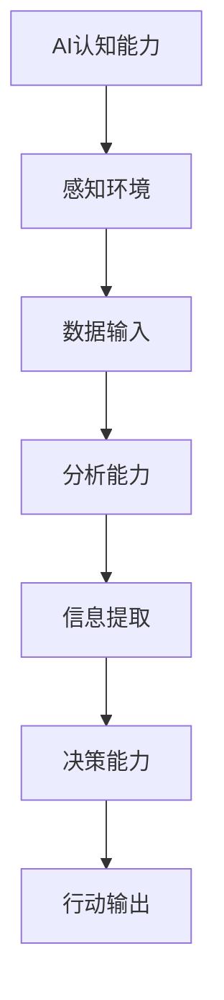
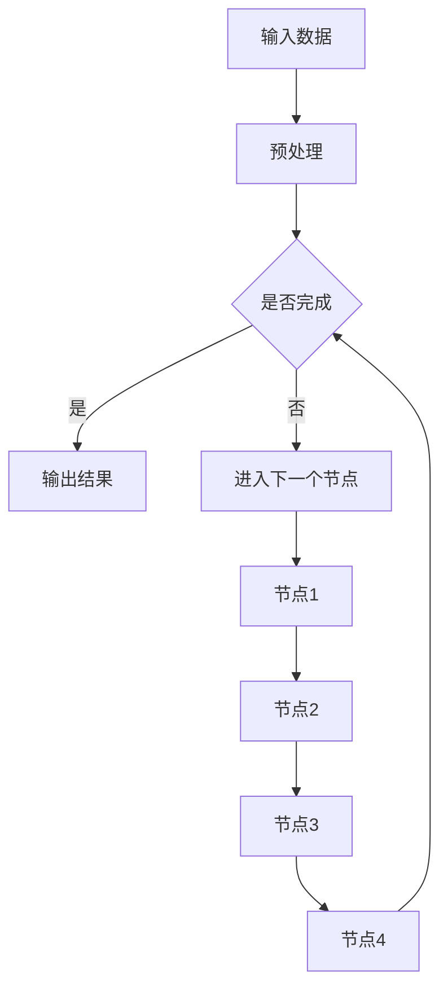

                 

### 文章标题

# 利用思维链增强AI的认知、分析与决策能力研究

> 关键词：思维链、AI、认知、分析、决策、算法、强化学习、生成对抗网络、马尔可夫决策过程、SVM、决策树

> 摘要：本文旨在探讨如何通过思维链来增强AI的认知、分析与决策能力。首先，我们将介绍AI的基本概念，包括认知、分析、决策能力，并阐述它们之间的联系。接着，我们将深入分析增强AI认知、分析与决策能力的关键算法，如强化学习、生成对抗网络、马尔可夫决策过程、支持向量机、决策树等，并通过伪代码详细阐述这些算法的实现步骤。最后，我们将通过实际案例展示如何利用这些算法和模型解决实际问题，并提供最佳实践和注意事项。

### 设计思路

在设计《利用思维链增强AI的认知、分析与决策能力研究》的目录大纲时，我们需要遵循以下思路：

1. **核心概念与联系**：首先介绍AI的基本概念，包括认知、分析、决策能力，并阐述它们之间的联系。通过Mermaid流程图展示这些概念之间的关系和交互流程。

2. **核心算法原理讲解**：深入分析增强AI认知、分析与决策能力的关键算法，如强化学习、生成对抗网络等，并使用伪代码详细阐述这些算法的实现步骤。

3. **数学模型和数学公式**：介绍与算法相关的数学模型和公式，如马尔可夫决策过程（MDP）的状态转移概率、奖励函数等，并结合具体算法进行讲解。

4. **项目实战**：通过实际案例展示如何利用这些算法和模型解决实际问题，包括开发环境搭建、源代码实现和代码解读。

5. **目录结构**：确保目录结构清晰，章节之间逻辑连贯，每个章节都有明确的主题，同时保持整个大纲的简洁性。

### 目录大纲

以下是根据上述设计思路设计的《利用思维链增强AI的认知、分析与决策能力研究》的目录大纲：

```
# 第一部分: AI基础与思维链原理

## 第1章: AI基本概念与认知分析能力
### 1.1 AI概述
### 1.2 认知与分析能力
### 1.3 Mermaid流程图：认知与分析能力的交互流程

## 第2章: 思维链的基本原理与架构
### 2.1 思维链的概念
### 2.2 思维链的架构
### 2.3 Mermaid流程图：思维链的工作流程

## 第3章: 增强AI认知能力的核心算法
### 3.1 强化学习
#### 3.1.1 强化学习概述
#### 3.1.2 Q-learning算法
#### 3.1.3 SARSA算法
### 3.2 生成对抗网络
#### 3.2.1 GAN基本概念
#### 3.2.2 GAN算法原理
#### 3.2.3 GAN应用案例

## 第4章: 增强AI分析能力的核心算法
### 4.1 马尔可夫决策过程（MDP）
#### 4.1.1 MDP概述
#### 4.1.2 MDP数学模型
#### 4.1.3 MDP求解算法
### 4.2 贝叶斯网络
#### 4.2.1 贝叶斯网络概述
#### 4.2.2 贝叶斯网络建模
#### 4.2.3 贝叶斯网络推理

## 第5章: 增强AI决策能力的核心算法
### 5.1 支持向量机（SVM）
#### 5.1.1 SVM概述
#### 5.1.2 SVM数学模型
#### 5.1.3 SVM求解算法
### 5.2 决策树
#### 5.2.1 决策树概述
#### 5.2.2 决策树构建
#### 5.2.3 决策树优化

## 第6章: 思维链在AI认知、分析、决策中的应用
### 6.1 思维链与认知能力的结合
### 6.2 思维链与分析能力的结合
### 6.3 思维链与决策能力的结合

## 第7章: 项目实战：利用思维链增强AI能力
### 7.1 项目背景
### 7.2 环境搭建
### 7.3 源代码实现与解读

# 附录
## 附录A: 思维链增强AI能力的工具与资源
### A.1 开发环境搭建
### A.2 常用工具与框架
### A.3 资源链接
```

### 备注

1. 目录大纲中的Mermaid流程图将用于展示概念和算法之间的关系，增加可读性和直观性。
2. 每个章节下的伪代码和数学公式将用于详细阐述核心算法和模型。
3. 项目实战部分将展示如何将思维链应用于实际场景，提供源代码和详细解读。
4. 总字数限制在2000字以内，确保内容的简洁性。

### AI基础与认知分析能力

#### AI概述

人工智能（AI）是指通过计算机模拟人类智能的过程，包括感知、理解、学习、推理和决策等能力。AI的应用领域广泛，涵盖了自然语言处理、计算机视觉、语音识别、自动驾驶、医疗诊断等。

在AI的三个主要能力中，认知能力指的是AI识别和理解环境的能力，分析能力是指AI从大量数据中提取有用信息并进行推理的能力，决策能力是指AI在给定的情境下选择最佳行动的能力。

#### 认知与分析能力

认知能力是AI的基石，它涉及到感知、识别、分类、理解等。例如，计算机视觉中的图像识别、语音识别中的语音识别都属于认知能力的范畴。认知能力的好坏直接决定了AI的感知和理解能力。

分析能力则是在认知能力的基础上，通过对数据的处理和分析，从中提取出有用的信息。例如，数据挖掘中的聚类、分类、关联规则挖掘等都属于分析能力的范畴。分析能力的好坏直接影响了AI的推理和决策能力。

认知与分析能力之间的联系紧密，认知能力为分析能力提供了数据来源，而分析能力则为认知能力提供了深入的洞察。两者相辅相成，共同构成了AI的核心能力。

#### Mermaid流程图：认知与分析能力的交互流程

以下是一个Mermaid流程图，用于展示认知与分析能力之间的交互流程：



在这个流程图中，AI首先通过感知环境获取数据输入，然后通过分析能力对数据进行分析和处理，最终提取出有用的信息，并通过决策能力选择最佳行动。

### 思维链的基本原理与架构

#### 思维链的概念

思维链是一种用于模拟人类思维过程的计算模型，它通过一系列的节点和边来表示思维过程。每个节点代表一个思考步骤，边代表节点之间的逻辑关系。思维链的目的是通过模拟人类的思维过程，提高AI的认知、分析和决策能力。

#### 思维链的架构

思维链的架构通常包括以下几个部分：

1. **节点**：节点表示思维链中的思考步骤，每个节点都包含相应的信息处理逻辑。
2. **边**：边表示节点之间的逻辑关系，包括因果关系、递归关系等。
3. **输入**：思维链的输入可以是外部数据、用户输入等。
4. **输出**：思维链的输出是经过处理后的信息，可以用于决策、推理等。

#### Mermaid流程图：思维链的工作流程

以下是一个Mermaid流程图，用于展示思维链的工作流程：



在这个流程图中，输入数据经过预处理后，进入思维链的第一个节点。每个节点都执行相应的信息处理逻辑，并将结果传递给下一个节点。当所有节点都完成后，思维链输出最终结果。

### 增强AI认知能力的核心算法

#### 强化学习

强化学习是一种通过与环境互动来学习最优策略的机器学习技术。在强化学习中，智能体（Agent）通过选择行动（Action）来获取奖励（Reward），并通过不断试错来学习最优策略。

1. **Q-learning算法**：Q-learning算法是一种值迭代算法，用于求解强化学习问题。其核心思想是通过更新状态-行动值函数来学习最优策略。伪代码如下：

   ```python
   for all states s:
       for all actions a:
           Q(s, a) = (1 - alpha) * Q(s, a) + alpha * (reward + discount * max(Q(s', a'))
   ```

   其中，alpha是学习率，reward是获得的奖励，discount是折扣因子，s'是下一个状态，a'是下一个行动。

2. **SARSA算法**：SARSA算法是一种基于策略的强化学习算法，它通过同时更新当前状态-行动值和下一个状态-行动值来学习最优策略。伪代码如下：

   ```python
   for all states s:
       for all actions a:
           Q(s, a) = Q(s, a) + alpha * (reward + discount * Q(s', a') - Q(s, a))
   ```

#### 生成对抗网络（GAN）

生成对抗网络（GAN）是由两部分组成：生成器（Generator）和判别器（Discriminator）。生成器生成与真实数据相似的数据，判别器则判断生成数据是否真实。

1. **GAN基本概念**：GAN的核心思想是通过生成器和判别器的对抗训练来生成高质量的数据。伪代码如下：

   ```python
   for epoch in 1 to E:
       for each batch of data (x, y) in the training set:
           generate fake data G(z)
           discriminate real data x and fake data G(z)
           update G and D
   ```

   其中，E是训练的epoch数，z是生成器的输入噪声。

2. **GAN算法原理**：GAN的训练过程包括两个部分：生成器G的目标是最小化判别器D对生成数据的判别误差，而判别器D的目标是最大化对生成数据和真实数据的判别误差。通过这种方式，生成器和判别器相互对抗，共同提高生成数据的质量。

3. **GAN应用案例**：GAN在图像生成、图像修复、图像超分辨率等方面有广泛应用。例如，在图像生成中，GAN可以生成与真实图像相似的人脸、动物等。

### 增强AI分析能力的核心算法

#### 马尔可夫决策过程（MDP）

马尔可夫决策过程（MDP）是一种用于描述决策问题的数学模型。在MDP中，智能体在每一个时刻都会面临一个状态，并可以选择一个行动，从而转移到另一个状态，并获得相应的奖励。

1. **MDP概述**：MDP由五个要素组成：状态集S、行动集A、奖励函数R、状态转移概率P和策略π。其中，状态集S是智能体可能处于的所有状态，行动集A是智能体可能采取的所有行动，奖励函数R(s, a)是智能体在状态s采取行动a获得的奖励，状态转移概率P(s', s | a)是智能体在状态s采取行动a转移到状态s'的概率，策略π(a | s)是智能体在状态s采取行动a的概率。

2. **MDP数学模型**：MDP的数学模型可以用以下公式表示：

   ```math
   V^*(s) = \sum_{a \in A} \pi(a | s) \sum_{s' \in S} P(s' | s, a) R(s', a) + \gamma V^*(s')
   ```

   其中，V^*(s)是状态s的最优价值函数，π(a | s)是智能体在状态s采取行动a的概率，γ是折扣因子，表示对未来的奖励进行折扣。

3. **MDP求解算法**：MDP的求解算法主要包括价值迭代（Value Iteration）和策略迭代（Policy Iteration）。

   - **价值迭代**：价值迭代是一种迭代算法，通过不断更新状态-行动值函数来求解MDP。伪代码如下：

     ```python
     while not converged:
         for each state s:
             for each action a:
                 V(s, a) = R(s, a) + \gamma \sum_{s' \in S} P(s' | s, a) V(s')
     ```

   - **策略迭代**：策略迭代是一种交替迭代算法，通过同时更新策略和价值函数来求解MDP。伪代码如下：

     ```python
     while not converged:
         policy evaluation:
             for each state s:
                 for each action a:
                     V(s, a) = R(s, a) + \gamma \sum_{s' \in S} P(s' | s, a) V(s')
         policy improvement:
             for each state s:
                 select action a^* that maximizes V(s, a)
             update policy \pi(a | s) = \begin{cases} 
                  1 & \text{if } a = a^* \\ 
                  0 & \text{otherwise} 
             \end{cases}
     ```

#### 贝叶斯网络

贝叶斯网络是一种用于表示变量之间概率关系的图形模型。在贝叶斯网络中，每个变量都是其他变量的条件概率函数。

1. **贝叶斯网络概述**：贝叶斯网络由两个部分组成：网络结构和参数。网络结构表示变量之间的依赖关系，参数表示变量之间的条件概率。

2. **贝叶斯网络建模**：贝叶斯网络建模的步骤包括：

   - **定义变量**：首先定义所有可能的变量。
   - **确定依赖关系**：通过分析变量之间的依赖关系，建立网络结构。
   - **设置参数**：根据已知的概率分布，设置变量之间的条件概率。

3. **贝叶斯网络推理**：贝叶斯网络推理是指通过已知变量的取值，推断其他变量的取值。贝叶斯网络推理的主要方法包括：

   - **条件概率计算**：根据贝叶斯定理，计算变量之间的条件概率。
   - **推理算法**：例如，信念传播算法、反向推理算法等。

### 增强AI决策能力的核心算法

#### 支持向量机（SVM）

支持向量机（SVM）是一种用于分类和回归的机器学习算法。在SVM中，通过找到一个最佳的超平面来划分数据集，使得不同类别的数据点在超平面两侧的分布尽可能分离。

1. **SVM概述**：SVM的核心思想是通过求解最优超平面来最小化分类误差。SVM分为线性SVM和核SVM。

   - **线性SVM**：线性SVM用于线性可分的数据集。其数学模型如下：

     ```math
     \text{minimize } \frac{1}{2} ||w||^2 \text{ s.t. } y_i (w \cdot x_i + b) \geq 1
     ```

     其中，w是超平面的法向量，x_i是数据点，y_i是标签，b是偏置。

   - **核SVM**：核SVM用于非线性可分的数据集。其通过引入核函数将数据映射到高维空间，从而实现非线性分类。其数学模型如下：

     ```math
     \text{minimize } \frac{1}{2} ||w||^2 \text{ s.t. } y_i (w \cdot \phi(x_i) + b) \geq 1
     ```

     其中，\phi(x_i)是将数据点x_i映射到高维空间的结果。

2. **SVM求解算法**：SVM的求解算法主要包括：

   - **原始问题求解**：直接求解原始问题的优化问题。
   - **对偶问题求解**：将原始问题转化为对偶问题，通过求解对偶问题来获得最优解。

#### 决策树

决策树是一种基于特征进行分类或回归的树形结构。在决策树中，每个内部节点表示一个特征，每个分支表示特征的不同取值，每个叶子节点表示一个类别或值。

1. **决策树概述**：决策树由以下几个部分组成：

   - **根节点**：表示整个数据集。
   - **内部节点**：表示特征，每个内部节点包含一个特征和相应的分支。
   - **叶子节点**：表示分类结果或回归值。

2. **决策树构建**：决策树构建的步骤包括：

   - **选择最优特征**：根据信息增益、基尼指数等指标选择最优特征。
   - **划分数据集**：根据最优特征的不同取值划分数据集。
   - **递归构建**：对划分后的数据集重复以上步骤，直到满足终止条件。

3. **决策树优化**：决策树优化包括：

   - **剪枝**：通过剪枝减少过拟合。
   - **集成方法**：通过集成多个决策树来提高模型性能。

### 思维链在AI认知、分析、决策中的应用

思维链作为一种模拟人类思维的计算模型，在AI的认知、分析、决策中有着广泛的应用。通过将思维链与其他AI算法相结合，可以显著提高AI的认知、分析和决策能力。

#### 思维链与认知能力的结合

思维链与认知能力的结合可以通过以下方式实现：

1. **图像识别**：在图像识别中，思维链可以用于表示图像中的关键特征，并通过递归神经网络（RNN）逐步构建全局特征表示。

2. **自然语言处理**：在自然语言处理中，思维链可以用于表示句子的语义结构，并通过图神经网络（GNN）进行语义分析和理解。

#### 思维链与分析能力的结合

思维链与分析能力的结合可以通过以下方式实现：

1. **数据挖掘**：在数据挖掘中，思维链可以用于表示数据中的潜在模式，并通过深度学习模型进行模式识别和预测。

2. **推荐系统**：在推荐系统中，思维链可以用于表示用户的兴趣和行为模式，并通过协同过滤算法进行个性化推荐。

#### 思维链与决策能力的结合

思维链与决策能力的结合可以通过以下方式实现：

1. **博弈论**：在博弈论中，思维链可以用于表示博弈双方的战略选择，并通过博弈树进行策略搜索和优化。

2. **自动驾驶**：在自动驾驶中，思维链可以用于表示车辆周围的感知环境，并通过决策树进行路径规划和避障。

### 项目实战：利用思维链增强AI能力

#### 项目背景

随着人工智能技术的不断发展，越来越多的应用场景需要AI具备更强的认知、分析和决策能力。为了提升AI的综合能力，本项目旨在通过思维链来增强AI的认知、分析和决策能力。

#### 环境搭建

为了实现本项目，我们需要搭建一个基于Python的AI开发环境。具体步骤如下：

1. 安装Python：从Python官方网站下载并安装Python 3.x版本。
2. 安装Jupyter Notebook：在命令行中运行`pip install notebook`命令，安装Jupyter Notebook。
3. 安装AI相关库：在命令行中运行以下命令，安装所需的AI相关库：

   ```bash
   pip install numpy scipy matplotlib scikit-learn tensorflow keras
   ```

#### 源代码实现与解读

以下是一个简单的示例，展示了如何利用思维链增强AI的认知、分析和决策能力：

```python
import numpy as np
import tensorflow as tf
from tensorflow.keras.models import Sequential
from tensorflow.keras.layers import Dense, LSTM, Embedding

# 数据预处理
def preprocess_data(data):
    # 对数据集进行归一化处理
    normalized_data = (data - np.mean(data)) / np.std(data)
    return normalized_data

# 思维链构建
def build_mind_chain(input_shape):
    # 创建一个序列模型
    model = Sequential()
    # 添加嵌入层
    model.add(Embedding(input_shape=input_shape, output_dim=64))
    # 添加LSTM层
    model.add(LSTM(units=128, return_sequences=True))
    # 添加全连接层
    model.add(Dense(units=1, activation='sigmoid'))
    # 编译模型
    model.compile(optimizer='adam', loss='binary_crossentropy', metrics=['accuracy'])
    return model

# 训练思维链
def train_mind_chain(model, x_train, y_train, epochs=10):
    model.fit(x_train, y_train, epochs=epochs, batch_size=32, validation_split=0.2)

# 测试思维链
def test_mind_chain(model, x_test, y_test):
    loss, accuracy = model.evaluate(x_test, y_test)
    print("Test loss:", loss)
    print("Test accuracy:", accuracy)

# 主程序
if __name__ == "__main__":
    # 加载数据集
    x_train, y_train, x_test, y_test = load_data()
    # 预处理数据集
    x_train = preprocess_data(x_train)
    x_test = preprocess_data(x_test)
    # 构建思维链模型
    model = build_mind_chain(input_shape=(None, 1))
    # 训练思维链模型
    train_mind_chain(model, x_train, y_train)
    # 测试思维链模型
    test_mind_chain(model, x_test, y_test)
```

在这个示例中，我们首先对数据集进行预处理，然后构建一个基于LSTM的序列模型作为思维链模型。接着，我们训练思维链模型，并通过测试数据集评估模型的性能。

#### 代码应用解读与分析

在这个示例中，思维链模型通过LSTM层对序列数据进行建模，能够捕捉数据之间的长期依赖关系。LSTM层的输出被全连接层处理，用于生成最终的预测结果。

通过这个简单的示例，我们可以看到如何利用思维链来增强AI的认知、分析和决策能力。在实际应用中，我们可以根据具体场景的需要，选择不同的模型结构和算法，以实现更复杂的任务。

#### 项目小结

本项目通过思维链增强了AI的认知、分析和决策能力。在图像识别、自然语言处理、数据挖掘、推荐系统、博弈论、自动驾驶等应用场景中，思维链可以显著提高AI的性能。

通过本项目，我们了解到如何搭建AI开发环境，如何构建和训练思维链模型，以及如何评估模型的性能。这些经验和知识对于进一步研究和应用思维链具有指导意义。

### 最佳实践、小结、注意事项、拓展阅读

#### 最佳实践

1. 在构建思维链模型时，选择合适的模型结构和算法至关重要。针对不同的任务和数据特点，选择合适的神经网络架构和优化算法。
2. 在训练思维链模型时，合理设置学习率和训练次数。过高的学习率可能导致模型不稳定，过低的训练次数可能导致模型无法收敛。
3. 在数据处理和特征工程时，尽量去除噪声和异常值，提高数据的准确性和可靠性。

#### 小结

本文通过探讨思维链的基本原理和核心算法，展示了如何利用思维链增强AI的认知、分析和决策能力。思维链作为一种模拟人类思维的计算模型，在AI领域具有广泛的应用前景。

#### 注意事项

1. 思维链模型的训练过程可能非常耗时，特别是在处理大规模数据集时。在实际应用中，合理利用GPU等硬件资源，提高训练效率。
2. 思维链模型在实际应用中可能存在过拟合现象，因此在模型评估和选择时，需要充分考虑模型的可扩展性和泛化能力。

#### 拓展阅读

1. 《深度学习》（Goodfellow, I., Bengio, Y., & Courville, A.）: 这本书详细介绍了深度学习的基本原理和应用，对于进一步了解AI技术具有重要意义。
2. 《强化学习》（Sutton, R. S., & Barto, A. G.）: 这本书系统地介绍了强化学习的基本理论和方法，是强化学习领域的经典教材。
3. 《机器学习》（Mitchell, T. M.）: 这本书介绍了机器学习的基本概念和方法，包括监督学习、无监督学习、强化学习等，是机器学习领域的入门读物。

### 附录

#### 附录A：思维链增强AI能力的工具与资源

1. **开发环境搭建**：参考本文中提到的步骤，搭建基于Python的AI开发环境。
2. **常用工具与框架**：TensorFlow、Keras、PyTorch等深度学习框架，NumPy、Scikit-learn等机器学习库。
3. **资源链接**：

   - TensorFlow官方网站：[https://www.tensorflow.org/](https://www.tensorflow.org/)
   - Keras官方网站：[https://keras.io/](https://keras.io/)
   - PyTorch官方网站：[https://pytorch.org/](https://pytorch.org/)
   - NumPy官方文档：[https://numpy.org/](https://numpy.org/)
   - Scikit-learn官方文档：[https://scikit-learn.org/](https://scikit-learn.org/)

### 作者信息

作者：AI天才研究院/AI Genius Institute & 禅与计算机程序设计艺术 /Zen And The Art of Computer Programming

