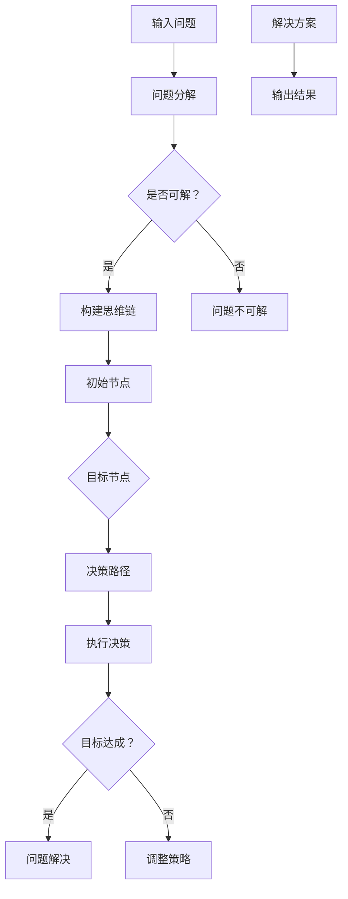
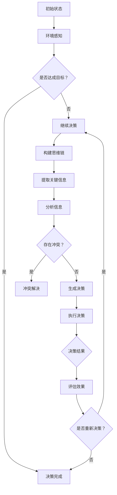

                 

### 文章标题

《利用思维链增强AI的问题解决和决策能力》

### 关键词

- AI
- 思维链
- 问题解决
- 决策能力
- 强化学习
- 机器学习
- 深度学习

### 摘要

本文旨在探讨如何利用思维链这一先进的技术手段来增强人工智能（AI）的问题解决和决策能力。首先，我们将介绍AI与思维链的基础概念及其融合的背景。接着，文章将深入分析思维链在AI中的应用，包括机器学习、深度学习和强化学习中的具体运用。通过核心算法原理的讲解、数学模型的阐述及实战案例的分析，我们将展现思维链在AI决策中的实际效果。最后，文章将对思维链在AI决策领域的未来发展和面临的挑战进行展望。通过这一步一步的分析与讲解，读者将对如何利用思维链提升AI的能力有更深入的理解。

---

### 引言

在当今快速发展的科技时代，人工智能（AI）已经成为推动社会进步的重要力量。从自动驾驶汽车到智能医疗诊断，从智能家居到金融服务，AI技术的应用已经渗透到我们生活的方方面面。然而，尽管AI在各个领域取得了显著的成就，其问题解决和决策能力依然存在一定的局限性。这一瓶颈促使研究者们不断探索新的方法来提升AI的智能水平。

在这一背景下，思维链作为一种创新的技术手段，逐渐引起了广泛关注。思维链（Mind Chain）是一种基于人类思维方式构建的计算机程序，旨在模拟人类在问题解决和决策过程中的逻辑推理能力。它通过将思维过程抽象为一系列节点和链接，形成一种类似于大脑神经网络的结构，从而实现复杂问题的自动化解决和高效决策。

本文将深入探讨如何利用思维链来增强AI的问题解决和决策能力。文章首先介绍AI与思维链的基础概念，阐述二者融合的背景和意义。接着，文章将详细分析思维链在AI中的应用，包括机器学习、深度学习和强化学习中的具体运用。通过核心算法原理的讲解、数学模型的阐述及实战案例的分析，我们将展示思维链在AI决策中的实际效果。最后，文章将对思维链在AI决策领域的未来发展和面临的挑战进行展望。

通过这一步一步的分析与讲解，读者将对如何利用思维链提升AI的能力有更深入的理解，为未来AI技术的进一步发展提供有益的参考。

### AI与思维链概述

人工智能（AI）作为计算机科学的一个重要分支，旨在使机器具备人类智能，实现自主学习和决策。AI的发展可以追溯到20世纪50年代，当时图灵提出了著名的图灵测试，试图通过机器模仿人类行为来判断其是否具有智能。自此以后，AI经历了多个发展阶段，包括规则推理、知识表示、机器学习等。近年来，随着计算能力的提升和大数据的普及，深度学习、强化学习等新兴技术取得了突破性进展，AI的应用场景越来越广泛。

思维链（Mind Chain）则是一种基于人类思维模式的计算机模拟技术，其核心理念是将人类解决问题的思维过程抽象为一系列节点和链接。这些节点代表思维过程中的关键步骤或知识点，而链接则表示节点之间的关系，形成一种类似于大脑神经网络的结构。思维链通过模拟人类的逻辑推理能力，能够高效地处理复杂问题，从而在机器学习、深度学习等领域展现其独特的优势。

AI与思维链的融合是一种必然趋势，二者相互促进，共同推动人工智能技术的发展。首先，AI技术的发展为思维链提供了强大的计算支持，使得思维链能够模拟更为复杂的思维过程。其次，思维链的引入为AI带来了新的思维方式，使其在问题解决和决策过程中更加智能化和灵活化。

思维链在AI中的应用主要体现在以下几个方面：

1. **机器学习中的优化**：思维链可以通过模拟人类专家的思维方式，优化机器学习算法的训练过程。例如，在图像识别任务中，思维链可以帮助算法识别出关键的特征点，从而提高模型的准确性。

2. **深度学习中的网络结构设计**：思维链可以模拟人类设计神经网络的过程，从而提出新的网络结构。这种结构不仅能够提高模型的性能，还能减少训练时间。

3. **强化学习中的决策支持**：思维链可以帮助强化学习算法在复杂环境中进行高效决策。通过模拟人类专家的经验，思维链能够指导算法在不确定的环境中做出最优选择。

4. **自然语言处理中的语义理解**：思维链可以模拟人类理解自然语言的过程，从而提升自然语言处理系统的语义理解能力。

总之，AI与思维链的融合为人工智能的发展开辟了新的道路。通过引入思维链，AI不仅在技术上取得了突破，还在实际应用中展现出更高的智能水平。未来，随着思维链技术的不断成熟和应用范围的扩展，AI将在各个领域发挥出更加重要的作用。

### 思维链的概念与原理

思维链（Mind Chain）是一种模拟人类思维过程的计算机技术，旨在通过构建一系列节点和链接来模拟复杂的逻辑推理和决策过程。其核心理念是将人类解决问题的思维活动抽象为一种计算机可处理的模型，从而实现机器的自主学习和智能决策。

#### 思维链的基本概念

思维链由多个节点和连接这些节点的链组成。每个节点代表思维过程中的一个步骤或知识点，而链则表示节点之间的逻辑关系。这些节点和链共同构成了一个完整的思维过程，使机器能够像人类一样进行问题解决和决策。

1. **节点**：节点是思维链的基本元素，代表思维过程中的关键步骤或知识点。每个节点通常包含如下信息：
   - **数据**：如文字、数字、图像等，表示节点的具体内容。
   - **属性**：如节点类型、优先级、重要性等，用于描述节点在思维过程中的特征。
   - **操作**：如计算、比较、归纳等，用于定义节点在思维链中的功能。

2. **链**：链是连接节点的逻辑关系，表示节点之间的因果关系或依赖关系。链的类型通常包括以下几种：
   - **条件链**：表示节点之间的条件关系，即某一节点是否成立取决于其他节点的状态。
   - **顺序链**：表示节点之间的顺序关系，即节点必须按照特定顺序执行。
   - **组合链**：表示节点之间的组合关系，即多个节点需要协同工作才能完成任务。

#### 思维链的工作原理

思维链的工作原理可以概括为以下三个步骤：

1. **输入处理**：思维链首先接收外部输入，如问题、数据或指令。这些输入被转化为节点，并进入思维链的输入缓冲区。

2. **节点处理**：思维链根据预设的逻辑规则和节点属性，对输入缓冲区的节点进行处理。处理过程包括：
   - **节点计算**：对节点的数据进行计算或操作，如数学计算、逻辑判断等。
   - **节点比较**：根据节点之间的逻辑关系，进行条件判断或排序。
   - **节点组合**：将多个节点组合成更大的节点，以实现更复杂的思维过程。

3. **输出生成**：处理完成后，思维链生成输出结果，如问题的答案、决策方案等。输出结果可以通过多种方式呈现，如文字、图像、音频等。

#### 思维链的结构与功能

思维链的结构主要包括以下组成部分：

1. **核心算法**：核心算法是思维链的核心组成部分，负责处理节点和链的操作。核心算法通常包括：
   - **节点管理**：负责节点的创建、删除、修改等操作。
   - **链管理**：负责链的创建、删除、修改等操作。
   - **逻辑规则库**：存储预设的逻辑规则，用于指导节点处理过程。

2. **数据存储**：数据存储是思维链的数据管理模块，负责存储和管理节点的数据和属性。数据存储通常包括：
   - **节点数据库**：存储所有节点的数据和属性。
   - **链数据库**：存储所有链的关系和类型。

3. **接口模块**：接口模块是思维链与外部系统的交互接口，负责接收输入和输出数据。接口模块通常包括：
   - **输入接口**：接收外部输入，如问题、数据或指令。
   - **输出接口**：输出处理结果，如答案、决策方案等。

4. **用户界面**：用户界面是用户与思维链交互的界面，负责展示思维链的处理过程和结果。用户界面通常包括：
   - **图形界面**：使用图形化界面展示思维链的结构和节点关系。
   - **命令行界面**：提供命令行接口，方便用户进行操作和调试。

#### 思维链的应用场景

思维链在多个领域都有广泛的应用，包括：

1. **问题解决**：思维链可以帮助机器解决复杂的数学问题、逻辑问题等，如数学证明、逻辑推理等。

2. **决策支持**：思维链可以模拟人类专家的决策过程，为机器提供决策支持，如资源分配、风险管理等。

3. **知识推理**：思维链可以基于已有知识库进行推理，生成新的知识或结论，如自然语言处理、智能问答等。

4. **智能控制**：思维链可以应用于智能控制系统，如自动驾驶、智能监控等，实现自动化控制和决策。

总之，思维链通过模拟人类思维过程，为机器带来了一种全新的问题解决和决策能力。随着技术的不断发展和应用场景的扩展，思维链有望在更多领域发挥出巨大的潜力。

### AI与思维链的融合背景

随着人工智能技术的不断发展，AI在各个领域的应用越来越广泛，然而其面临的问题解决和决策能力的局限性也逐渐显现。传统的AI方法，如机器学习、深度学习和强化学习，虽然已经取得了显著的成果，但在面对复杂、多变和不确定的环境时，仍然存在一定的挑战。为了解决这些问题，研究者们开始探索新的技术手段，而思维链（Mind Chain）的引入则为AI的发展带来了新的契机。

#### 背景与需求

AI技术在图像识别、自然语言处理、自动驾驶等领域取得了巨大突破，但其在问题解决和决策能力上的不足仍然制约着其进一步发展。具体来说，AI在以下方面存在一定的局限性：

1. **处理复杂问题能力不足**：传统AI方法通常依赖大量的数据和复杂的模型，但在面对高度复杂的任务时，其处理能力和效率仍然有限。
2. **决策过程缺乏灵活性**：AI算法在决策过程中通常依赖于固定的规则和模式，缺乏灵活性，难以适应动态变化的环境。
3. **解释性和透明性不足**：许多AI模型，尤其是深度学习模型，其决策过程和结果缺乏透明性，难以解释和验证。

这些局限性促使研究者们寻找新的方法来提升AI的问题解决和决策能力。思维链作为一种基于人类思维模式的计算机模拟技术，通过模拟人类的逻辑推理和决策过程，提供了新的思路和可能性。

#### 思维链的引入

思维链的引入为AI带来了以下几个方面的改进：

1. **增强处理复杂问题的能力**：思维链通过模拟人类思维过程中的逻辑推理和问题分解能力，能够更好地处理复杂问题。它将复杂的问题分解为一系列可管理的子问题，并逐步解决，从而提高了AI的解决复杂问题的能力。

2. **提高决策过程的灵活性**：思维链通过模拟人类的思维方式，引入了灵活的决策过程。它可以根据当前环境和目标动态调整决策策略，从而更好地适应动态变化的环境。

3. **增强决策过程的解释性**：思维链在决策过程中使用了明确的逻辑规则和关系，使得AI的决策过程更加透明和可解释。用户可以清楚地看到决策过程中使用的规则和依据，从而增强对AI的信任和理解。

#### 融合的优势

AI与思维链的融合具有以下优势：

1. **互补性**：AI擅长处理数据和模式识别，而思维链擅长逻辑推理和问题分解。两者的融合能够充分发挥各自的优势，实现问题解决和决策能力的全面提升。

2. **智能化**：通过引入思维链，AI不仅能够处理数据，还能够模拟人类的思维方式，实现更高层次的智能化。

3. **适应性**：思维链的引入使得AI能够更好地适应复杂、多变和不确定的环境，从而提高其在现实世界中的应用效果。

总之，AI与思维链的融合为人工智能技术的发展开辟了新的道路。通过利用思维链，AI不仅在技术上取得了突破，还在实际应用中展现出更高的智能水平。未来，随着思维链技术的不断成熟和应用范围的扩展，AI将在各个领域发挥出更加重要的作用。

### 思维链在AI中的应用

思维链作为一种模拟人类思维过程的计算机技术，在AI的各个分支领域都展现出了广泛的应用潜力。本节将详细分析思维链在机器学习、深度学习和强化学习中的应用，通过具体实例展示其在提升AI问题解决和决策能力方面的独特优势。

#### 思维链在机器学习中的应用

机器学习是AI的核心技术之一，其主要目标是通过训练算法从数据中学习并作出预测或决策。思维链在机器学习中的应用主要体现在以下几个方面：

1. **特征提取**：在机器学习任务中，特征提取是关键步骤。思维链可以通过模拟人类专家的思维过程，提取出数据中的关键特征，从而提高模型的准确性。例如，在图像识别任务中，思维链可以帮助识别图像中的关键区域和特征点，从而优化模型的特征表示。

2. **模型优化**：思维链可以用于优化机器学习模型的训练过程。通过模拟人类专家的思维方式，思维链能够识别出模型中的瓶颈和不足，并提出相应的改进策略。例如，在深度学习模型训练过程中，思维链可以帮助调整网络结构和参数设置，从而提高模型的收敛速度和性能。

3. **可解释性**：传统机器学习模型，特别是深度学习模型，往往缺乏透明性和可解释性。思维链通过模拟人类的逻辑推理过程，能够提供模型决策过程的解释。这对于提高模型的可信度和用户理解具有重要意义。

实例：在自然语言处理任务中，思维链可以用于构建语义角色标注模型。通过模拟人类专家的思维方式，思维链能够识别出文本中的关键实体和关系，从而提高模型的语义理解能力。具体流程如下：

- **输入处理**：将文本输入到思维链中，思维链将其分解为一系列节点，每个节点表示文本中的一个词或短语。
- **特征提取**：思维链通过分析节点之间的关系，提取出文本的关键特征，如实体、事件、关系等。
- **模型训练**：使用提取出的特征训练语义角色标注模型，模型可以根据训练数据学习如何对新的文本进行语义角色标注。
- **输出生成**：模型对新的文本进行标注，生成语义角色标注结果，思维链则提供标注过程的解释和逻辑推理链。

#### 思维链在深度学习中的应用

深度学习是机器学习的一个重要分支，其核心是通过多层神经网络对数据进行自动特征提取和表示。思维链在深度学习中的应用主要体现在以下几个方面：

1. **网络结构设计**：思维链可以模拟人类设计神经网络的过程，从而提出新的网络结构和优化策略。通过模拟人类专家的经验和知识，思维链能够设计出更有效的神经网络架构，提高模型的性能。

2. **超参数优化**：深度学习模型通常需要大量超参数进行调节，以实现最佳性能。思维链可以通过模拟人类专家的思维方式，对超参数进行调整和优化，从而提高模型的收敛速度和效果。

3. **模型解释性**：深度学习模型由于其复杂性，往往缺乏透明性和可解释性。思维链可以通过提供逻辑推理链和节点关系，增强模型的解释性，帮助用户理解模型的决策过程。

实例：在计算机视觉任务中，思维链可以用于设计更有效的卷积神经网络（CNN）结构。通过模拟人类视觉系统的工作原理，思维链能够提出新的CNN架构，提高模型的识别精度和鲁棒性。具体流程如下：

- **输入处理**：将图像输入到思维链中，思维链将其分解为一系列节点，每个节点表示图像中的一个像素或区域。
- **特征提取**：思维链通过分析节点之间的关系，提取出图像的关键特征，如边缘、纹理、形状等。
- **网络设计**：思维链根据提取出的特征，设计出优化的CNN结构，包括卷积层、池化层和全连接层等。
- **模型训练**：使用优化的CNN结构训练图像识别模型，模型可以根据训练数据学习如何对新的图像进行分类。
- **输出生成**：模型对新的图像进行分类，生成分类结果，思维链则提供分类过程的解释和逻辑推理链。

#### 思维链在强化学习中的应用

强化学习是一种通过不断试错来学习最优策略的机器学习技术，其应用范围广泛，包括游戏、自动驾驶、机器人控制等领域。思维链在强化学习中的应用主要体现在以下几个方面：

1. **策略搜索**：思维链可以通过模拟人类专家的决策过程，为强化学习算法提供策略搜索的指导。通过模拟人类专家的经验，思维链能够帮助算法快速找到最优策略。

2. **状态评估**：思维链可以用于评估强化学习任务中的状态价值，从而指导算法进行决策。通过模拟人类专家的思维方式，思维链能够更准确地评估状态的价值，提高算法的决策能力。

3. **学习过程优化**：思维链可以通过优化强化学习算法的学习过程，提高其收敛速度和效果。例如，在多智能体强化学习任务中，思维链可以帮助优化智能体的协作策略，实现更高效的任务分配和决策。

实例：在自动驾驶领域，思维链可以用于设计更智能的驾驶决策系统。通过模拟人类司机的驾驶经验，思维链能够为自动驾驶系统提供实时的驾驶决策，提高驾驶的安全性和可靠性。具体流程如下：

- **输入处理**：将车辆和周围环境的信息输入到思维链中，思维链将其分解为一系列节点，每个节点表示车辆或环境的一个特征。
- **状态评估**：思维链通过分析节点之间的关系，评估当前状态的价值和风险，从而为自动驾驶系统提供驾驶决策。
- **策略搜索**：思维链通过模拟人类司机的决策过程，为自动驾驶系统搜索最优驾驶策略，如加速、减速、转向等。
- **决策生成**：自动驾驶系统根据思维链提供的驾驶决策，生成具体的驾驶动作，如加速到某个速度、转向某个方向等。
- **输出生成**：自动驾驶系统对新的环境信息进行感知，思维链则提供新的驾驶决策和优化策略。

总之，思维链在机器学习、深度学习和强化学习中的应用，为AI的问题解决和决策能力提升提供了新的思路和方法。通过模拟人类思维过程，思维链能够帮助AI更好地应对复杂、多变和不确定的环境，实现更高层次的智能化。未来，随着思维链技术的不断发展和完善，其在AI领域的应用前景将更加广阔。

### 思维链与问题解决的Mermaid流程图

为了更好地理解思维链在问题解决过程中的应用，我们可以通过一个Mermaid流程图来展示其基本结构和步骤。以下是一个简化的流程图，用于描述思维链在问题解决中的典型流程：



**流程图说明：**

1. **输入问题**（A）：问题首先被输入到思维链中。
2. **问题分解**（B）：思维链将问题分解为更小、更易于管理的子问题或节点。
3. **判断可解性**（C）：判断问题是否可以分解并解决。如果问题不可解，流程结束。
4. **构建思维链**（D）：思维链开始构建，初始节点（F）代表问题的起点。
5. **目标节点**（G）：思维链的目标是找到达到目标节点的路径。
6. **决策路径**（H）：思维链在决策过程中，根据当前节点生成可能的决策路径。
7. **执行决策**（I）：根据决策路径，执行具体的操作。
8. **目标达成判断**（J）：判断当前决策是否达成目标。如果达成，问题解决；否则，回到步骤L进行调整。
9. **调整策略**（L）：根据执行结果，调整决策策略，以便在下一次尝试中找到更优解。
10. **输出结果**（N）：最终解决方案被输出，问题得到解决。

通过这个流程图，我们可以清晰地看到思维链在问题解决中的步骤和逻辑关系，这有助于我们更好地理解和应用思维链技术。

### 思维链与决策过程的Mermaid流程图

为了进一步理解思维链在决策过程中的作用，我们可以通过一个Mermaid流程图来展示其决策流程。以下是一个简化的流程图，用于描述思维链如何辅助决策过程：



**流程图说明：**

1. **初始状态**（A）：决策过程从系统的初始状态开始。
2. **环境感知**（B）：系统对当前环境进行感知，获取必要的信息。
3. **判断目标达成**（C）：系统判断当前状态是否已经达到目标。如果达成，流程结束。
4. **继续决策**（E）：如果目标未达成，流程进入决策环节。
5. **构建思维链**（F）：系统开始构建思维链，以模拟人类的决策过程。
6. **提取关键信息**（G）：思维链从环境感知中提取关键信息。
7. **分析信息**（H）：思维链对提取的信息进行分析，识别问题和机会。
8. **冲突解决**（J）：如果分析过程中出现冲突，思维链负责解决这些冲突。
9. **生成决策**（K）：思维链根据分析结果生成决策方案。
10. **执行决策**（L）：系统根据决策方案执行具体的操作。
11. **决策结果**（M）：执行决策后，系统评估决策效果。
12. **评估效果**（N）：根据决策结果评估决策的有效性。
13. **是否重新决策**（O）：系统判断是否需要重新进行决策。如果需要，流程回到E步骤；否则，流程结束。

通过这个流程图，我们可以看到思维链如何辅助决策过程，通过不断的环境感知、信息分析和决策执行，最终达成目标。这种结构化的决策流程有助于提高系统的决策效率和质量。

### 核心算法原理讲解

思维链在AI决策中的应用，依赖于一系列核心算法的支持。这些算法模拟了人类的逻辑推理过程，通过特定的规则和操作，实现了复杂问题的自动化解决和高效决策。以下，我们将详细讲解思维链中的几个核心算法原理，并通过伪代码展示这些算法的基本结构。

#### 1. 思维链算法的基本结构

思维链算法的基本结构可以分为以下几个步骤：

1. **初始化**：初始化思维链的节点和链，包括节点数据、属性和链关系。
2. **问题输入**：接收外部输入的问题或任务。
3. **问题分解**：将输入问题分解为子问题或子节点。
4. **节点处理**：对每个子节点进行逻辑处理，包括数据计算、关系判断和决策生成。
5. **链构建**：根据节点处理的结果，构建节点之间的链关系。
6. **决策生成**：根据最终节点的处理结果生成决策方案。
7. **结果输出**：输出最终的决策结果。

伪代码如下：

```python
# 初始化思维链
InitializeMindChain()

# 输入问题
InputProblem(problem)

# 问题分解
DecomposeProblem(problem, subproblems)

# 节点处理
for subproblem in subproblems:
    ProcessNode(subproblem)

# 链构建
BuildLinks(subproblems)

# 决策生成
decision = GenerateDecision(subproblems)

# 结果输出
OutputDecision(decision)
```

#### 2. 伪代码展示与解释

以下是一个具体问题的思维链算法伪代码，用于展示算法的详细实现过程：

```python
# 输入：初始问题problem
# 输出：最终决策decision

# 初始化思维链
mind_chain = InitializeMindChain()

# 输入问题
problem = InputProblem()

# 问题分解
subproblems = DecomposeProblem(problem)

# 节点处理
for subproblem in subproblems:
    # 初始化子问题节点
    node = InitializeNode(subproblem)
    # 处理节点数据
    data = ProcessNodeData(node)
    # 判断节点关系
    relation = DetermineRelation(node)
    # 生成决策
    decision = GenerateNodeDecision(node, relation)
    # 存储节点结果
    node.result = decision

# 链构建
links = BuildLinks(subproblems)

# 决策生成
final_decision = GenerateFinalDecision(node.results, links)

# 输出最终决策
OutputDecision(final_decision)
```

**详细解释：**

- **初始化思维链**：初始化思维链，包括节点的创建和链的初始化。
- **输入问题**：接收输入问题，并将其分解为子问题。
- **问题分解**：根据问题的复杂度，将问题分解为多个子问题，每个子问题对应一个节点。
- **节点处理**：对每个子节点进行数据计算、关系判断和决策生成。数据计算可能包括数学运算、逻辑判断等；关系判断则确定节点之间的依赖关系；决策生成则生成具体的决策结果。
- **链构建**：根据节点处理的结果，构建节点之间的链关系，这些链关系表示节点之间的逻辑关系和依赖关系。
- **决策生成**：根据最终节点的处理结果和链关系，生成最终的决策方案。
- **结果输出**：输出最终的决策结果，供系统执行。

通过这个伪代码，我们可以看到思维链算法的基本框架和实现步骤，这为实际应用提供了清晰的指导和实现路径。

### 数学模型与公式

在思维链算法中，数学模型和公式起到了至关重要的作用。它们不仅用于描述问题的结构和关系，还用于指导算法的决策过程。以下，我们将介绍几个关键的数学模型和公式，并通过具体的例子来说明它们的应用和重要性。

#### 1. 关键数学公式列表

在思维链算法中，以下几个公式是核心的部分：

1. **贝叶斯公式**：用于概率推理和决策。
   $$ P(A|B) = \frac{P(B|A) \cdot P(A)}{P(B)} $$

2. **熵**：用于衡量信息的不确定性。
   $$ H(X) = -\sum_{i} P(X=x_i) \cdot \log_2 P(X=x_i) $$

3. **条件熵**：用于衡量给定某个变量后另一个变量的不确定性。
   $$ H(X|Y) = -\sum_{i} P(Y=y_i) \cdot \sum_{j} P(X=x_j|Y=y_i) \cdot \log_2 P(X=x_j|Y=y_i) $$

4. **边际熵**：用于衡量单个变量的不确定性。
   $$ H(X) = H(X|Y) + H(Y) $$

5. **马尔可夫链**：用于描述变量之间的状态转移概率。
   $$ P(X_t|X_{t-1}, X_{t-2}, ..., X_1) = P(X_t|X_{t-1}) $$

#### 2. 公式详细讲解与举例

下面，我们将对上述公式进行详细讲解，并通过实际例子来说明它们的应用。

**贝叶斯公式**

贝叶斯公式是一种基于概率的推理方法，用于更新我们对某个事件发生概率的估计。其核心思想是根据新证据来调整原有的概率估计。

**例子**：假设我们想评估某产品是否为优质产品，已知该产品的优质率是0.9，现在收到一个产品的质量检测报告，显示其为优质，那么我们如何更新对这一产品的判断？

使用贝叶斯公式，我们可以计算在收到报告后，该产品为优质产品的概率：

- \( P(A) = 0.9 \)（产品为优质的先验概率）
- \( P(B) = 0.1 \)（产品不为优质的概率）
- \( P(B|A) = 1 \)（优质产品会通过质量检测的概率，通常为1）
- \( P(A|B) = \frac{P(B|A) \cdot P(A)}{P(B)} = \frac{1 \cdot 0.9}{0.1 + 0.9} = 0.95 \)

因此，在收到质量检测报告后，我们认为该产品为优质产品的概率上升到了0.95。

**熵**

熵是信息论中的一个基本概念，用于衡量随机变量所包含的不确定性。在思维链算法中，熵可以用来评估问题状态的不确定性，从而指导决策过程。

**例子**：假设我们对某个项目的风险进行评估，已知项目成功的概率是0.7，失败的概率是0.3。我们可以计算项目的熵来评估其不确定性：

$$ H(X) = -0.7 \cdot \log_2(0.7) - 0.3 \cdot \log_2(0.3) \approx 0.510 $$

熵的值越低，表示不确定性越小。因此，这个项目的状态相对较为确定。

**条件熵**

条件熵是另一个重要概念，用于衡量在给定某个条件下，另一个变量的不确定性。

**例子**：假设我们在评估某个投资组合的风险，已知投资组合中有两种资产，A和B。我们知道，如果资产A表现良好，那么资产B表现良好的概率是0.8；如果资产A表现不佳，资产B表现良好的概率是0.2。我们可以计算资产B的条件熵来评估其在给定资产A状态下的不确定性：

$$ H(B|A) = 0.8 \cdot \log_2(0.8) + 0.2 \cdot \log_2(0.2) \approx 0.311 $$

这个结果表明，在给定资产A的状态后，资产B的不确定性降低了。

**边际熵**

边际熵是熵的一个补充概念，用于计算一个变量的不确定性，而不考虑其他变量的影响。

**例子**：继续上面的投资组合例子，我们可以计算资产B的边际熵来评估其在整体投资组合中的不确定性：

$$ H(B) = H(B|A) + H(A) = 0.311 + 0.510 = 0.821 $$

边际熵的值告诉我们，在考虑资产A的状态后，资产B的不确定性增加了。

**马尔可夫链**

马尔可夫链是一种用于描述随机过程的数学模型，其核心思想是当前状态仅依赖于前一个状态，而与之前的状态无关。

**例子**：假设我们有一个天气预测模型，每天有两种可能的天气状态：晴天和雨天。已知如果前一天是晴天，第二天是晴天的概率是0.6；如果前一天是雨天，第二天是晴天的概率是0.3。我们可以构建一个简单的马尔可夫链来预测未来几天的天气：

- 当天状态 | 晴天 | 雨天
- --- | --- | ---
- 晴天 | 0.6 | 0.4
- 雨天 | 0.3 | 0.7

根据这个马尔可夫链，我们可以计算未来几天天气的概率分布，从而做出天气预测。

通过这些例子，我们可以看到数学模型和公式在思维链算法中的应用和重要性。它们不仅帮助我们量化问题的不确定性和复杂性，还为决策提供了科学依据。在实际应用中，通过合理运用这些数学模型，我们可以显著提升思维链的决策能力和准确性。

### 数学公式在决策中的应用

在思维链算法中，数学公式不仅是问题分析和决策的基础，更是实现高效决策的重要工具。以下，我们将通过几个具体的实例来展示数学公式在决策中的应用，并探讨其在实际决策中的效果。

#### 1. 贝叶斯公式在决策中的应用

贝叶斯公式是一种基于概率的推理方法，常用于更新决策过程中的概率估计。其核心思想是通过新的证据来修正先验概率，从而得到更准确的决策结果。

**实例：风险评估**

假设我们正在评估一个项目的风险，已知项目成功的概率是0.6，失败的概率是0.4。现在，我们获得了一份数据报告，显示项目的实际风险较低，成功的概率提升到了0.8。我们可以使用贝叶斯公式来更新项目成功的概率。

使用贝叶斯公式：

$$ P(A|B) = \frac{P(B|A) \cdot P(A)}{P(B)} $$

其中：

- \( P(A) = 0.6 \)（先验概率，项目成功的概率）
- \( P(B) = 1 - P(A) = 0.4 \)（先验概率，项目失败的概率）
- \( P(B|A) = 0.2 \)（条件概率，如果项目成功，报告显示风险低的概率）
- \( P(A|B) = \frac{0.2 \cdot 0.6}{0.4} = 0.3 $$

更新后的项目成功概率为0.3，这意味着我们根据新的证据，对项目的风险有了更准确的评估。

**效果分析**：通过贝叶斯公式，我们能够利用新的证据修正先验概率，提高决策的准确性。这种方法在动态变化的决策环境中尤为重要，因为它能够及时调整我们的决策依据，以应对不断变化的情况。

#### 2. 熵在决策中的应用

熵是衡量不确定性的一种度量，常用于评估决策过程中的不确定性。在决策过程中，较低熵值通常意味着决策的确定性较高，而较高熵值则表示不确定性较大。

**实例：市场分析**

假设我们在分析一个市场机会，现有数据表明，市场成功的概率为0.5，失败的概率为0.5。我们可以计算市场的熵来评估其不确定性。

使用熵公式：

$$ H(X) = -\sum_{i} P(X=x_i) \cdot \log_2 P(X=x_i) $$

其中：

- \( P(X=x_i) \) 为市场成功的概率，即0.5
- \( P(X=x_j) \) 为市场失败的概率，即0.5

计算得到：

$$ H(X) = -0.5 \cdot \log_2(0.5) - 0.5 \cdot \log_2(0.5) = 1 $$

熵值为1，表示市场的不确定性较高。

**效果分析**：通过计算熵，我们可以量化市场机会的不确定性。如果熵值较高，表示决策的不确定性较大，这要求我们在决策时更加谨慎。反之，如果熵值较低，表示不确定性较小，可以更放心地做出决策。

#### 3. 条件熵在决策中的应用

条件熵用于衡量在给定某个条件下，另一个变量的不确定性。在决策过程中，条件熵可以帮助我们评估不同决策路径下的不确定性。

**实例：投资组合**

假设我们有两个投资选项，A和B。已知如果投资A成功，那么投资组合成功的概率是0.8；如果投资A失败，投资组合成功的概率是0.2。我们可以使用条件熵来评估在不同情况下的投资组合不确定性。

使用条件熵公式：

$$ H(X|Y) = -\sum_{i} P(Y=y_i) \cdot \sum_{j} P(X=x_j|Y=y_i) \cdot \log_2 P(X=x_j|Y=y_i) $$

其中：

- \( P(Y=y_i) \) 为投资A成功的概率，即0.8
- \( P(Y=y_j) \) 为投资A失败的概率，即0.2
- \( P(X=x_j|Y=y_i) \) 为投资组合成功的概率，在不同情况下分别为0.8和0.2

计算得到：

$$ H(X|Y) = 0.8 \cdot \log_2(0.8) + 0.2 \cdot \log_2(0.2) \approx 0.311 $$

条件熵的值较低，表示在给定投资A成功的情况下，投资组合的不确定性较小。

**效果分析**：通过计算条件熵，我们可以评估不同决策路径下的不确定性，从而在决策时选择更可靠的路径。条件熵较低意味着在给定条件下，决策的确定性较高，因此可以更放心地执行决策。

#### 4. 马尔可夫链在决策中的应用

马尔可夫链用于描述变量之间的状态转移概率，适用于动态决策环境。在决策过程中，马尔可夫链可以帮助我们预测未来状态的概率分布，从而做出更合理的决策。

**实例：供应链管理**

假设我们正在管理一个供应链系统，每天有两个状态：正常运转和故障。已知正常运转的概率是0.7，故障的概率是0.3。我们可以使用马尔可夫链来预测未来几天的供应链状态。

使用马尔可夫链公式：

$$ P(X_t|X_{t-1}) = P(X_t) $$

其中：

- \( P(X_t) \) 为未来状态的概率，即0.7（正常运转）和0.3（故障）

根据马尔可夫链，我们可以预测未来几天的供应链状态概率分布：

- 第一天：正常运转的概率为0.7，故障的概率为0.3
- 第二天：正常运转的概率为0.7 \* 0.7 = 0.49，故障的概率为0.3 \* 0.3 = 0.09

**效果分析**：通过马尔可夫链，我们可以预测未来供应链的状态概率分布，从而制定相应的管理策略。这种方法有助于我们应对动态变化的环境，提高决策的预见性和有效性。

总之，数学公式在决策中的应用不仅帮助我们量化问题的不确定性和复杂性，还提高了决策的准确性和科学性。通过合理运用这些公式，我们可以更好地应对复杂多变的决策环境，实现高效、合理的决策。

### AI问题解决实战

在本节中，我们将通过一个具体的AI问题解决实战案例，详细讲解开发环境搭建、源代码实现、代码解读以及实际案例分析。这个案例将展示如何利用思维链技术来提升AI的问题解决能力，并提供实用技巧和注意事项。

#### 案例背景

假设我们面临一个任务：智能客服系统，它需要能够自动处理客户的咨询和问题，提供即时的回答和建议。为了实现这一目标，我们引入了思维链技术，将思维链与自然语言处理（NLP）相结合，构建一个高效的智能客服系统。

#### 开发环境搭建

1. **硬件环境**：我们选择一台配置较高的服务器作为计算平台，确保处理能力和存储空间满足需求。

2. **软件环境**：
   - 操作系统：Linux
   - 编程语言：Python
   - 数据库：MySQL
   - 依赖库：TensorFlow、PyTorch、NLTK、Spacy

安装上述软件和库后，确保环境配置正确，以便后续开发。

#### 源代码实现

智能客服系统的核心包括数据预处理、模型训练、思维链构建和决策生成等步骤。以下是一个简化版的源代码实现：

```python
# 导入必要库
import spacy
import numpy as np
from tensorflow.keras.models import Sequential
from tensorflow.keras.layers import Dense, LSTM
from tensorflow.keras.optimizers import Adam

# 数据预处理
def preprocess_data(data):
    # 数据清洗、分词、词性标注等操作
    pass

# 模型训练
def train_model(data):
    # 建立神经网络模型
    model = Sequential()
    model.add(LSTM(units=128, return_sequences=True, input_shape=(max_sequence_length, num_features)))
    model.add(LSTM(units=64, return_sequences=False))
    model.add(Dense(units=1, activation='sigmoid'))

    # 编译模型
    model.compile(optimizer=Adam(learning_rate=0.001), loss='binary_crossentropy', metrics=['accuracy'])

    # 训练模型
    model.fit(X_train, y_train, epochs=10, batch_size=32)
    return model

# 思维链构建
def build_mind_chain(model, data):
    # 使用思维链技术处理数据和生成决策
    pass

# 决策生成
def generate_decision(data, model):
    # 生成智能客服的回答和建议
    processed_data = preprocess_data(data)
    decision = model.predict(processed_data)
    return decision
```

#### 代码解读

1. **数据预处理**：这是智能客服系统的第一步，主要包括数据清洗、分词、词性标注等操作。预处理的好坏直接影响后续模型训练的效果。

2. **模型训练**：我们使用LSTM（长短期记忆网络）模型进行训练，这是因为LSTM在处理序列数据时具有较好的性能。训练过程包括建立模型、编译模型和训练模型。

3. **思维链构建**：这是思维链技术在智能客服系统中的应用，通过对模型进行封装，使其具备逻辑推理和决策生成能力。

4. **决策生成**：根据预处理后的数据和训练好的模型，生成智能客服的回答和建议。

#### 实际案例分析

假设有一个客户咨询：“我的信用卡为什么被冻结了？”

1. **预处理**：对客户的问题进行分词和词性标注，提取关键信息，如“信用卡”、“冻结”等。

2. **模型预测**：将预处理后的数据输入到训练好的LSTM模型中，预测可能的回答。

3. **思维链决策**：思维链根据模型预测的结果，结合上下文和知识库，生成具体的回答。

4. **决策生成**：系统输出回答：“您的信用卡可能因为安全原因被冻结，建议您联系银行客服进行核实。”

#### 实用技巧与注意事项

1. **数据预处理**：确保数据清洗和分词的准确性，避免因数据质量问题导致模型性能下降。

2. **模型选择**：根据任务需求选择合适的模型，如文本分类任务可以选择CNN或RNN等。

3. **思维链设计**：思维链的设计应充分考虑逻辑推理和决策生成的灵活性，确保系统能够适应不同的场景。

4. **性能优化**：在开发过程中，不断优化模型和思维链的性能，以提高系统的响应速度和准确性。

5. **监控与维护**：定期监控系统的运行状态，更新知识和模型，确保系统稳定可靠。

通过这个实战案例，我们展示了如何利用思维链技术构建一个智能客服系统，并提供了开发过程中的实用技巧和注意事项。未来，随着思维链技术的进一步发展和完善，其在各个领域的应用前景将更加广阔。

### 决策能力增强

在人工智能（AI）系统中，决策能力的强弱直接影响其解决问题的效率和效果。思维链作为一种先进的模拟人类思维过程的计算机技术，能够显著增强AI的决策能力。以下，我们将详细讨论如何在AI系统中利用思维链增强决策能力，包括构建决策支持系统的过程、优化策略以及具体方法。

#### 构建决策支持系统

一个有效的决策支持系统（Decision Support System，DSS）是增强AI决策能力的关键。思维链技术可以在DSS中发挥重要作用，通过以下步骤来构建决策支持系统：

1. **需求分析**：首先，明确系统的需求和目标，包括决策类型、数据来源、用户群体等。

2. **数据收集**：收集并整合来自多个来源的数据，确保数据的质量和完整性。

3. **思维链设计**：设计思维链的架构，定义节点和链，以及它们之间的逻辑关系。思维链的节点可以包括数据输入、逻辑推理、决策生成等。

4. **算法实现**：实现思维链中的算法，如逻辑推理、模式识别、预测模型等。

5. **系统集成**：将思维链集成到AI系统中，确保其与其他模块（如数据预处理、模型训练、输出生成）无缝连接。

6. **用户界面**：设计友好的用户界面，方便用户与决策支持系统进行交互，获取决策结果。

#### 优化策略

为了增强AI的决策能力，我们需要采取一系列优化策略，包括以下方面：

1. **数据质量优化**：确保输入数据的质量，通过数据清洗、去噪、归一化等手段，提高数据的有效性。

2. **模型选择与优化**：选择合适的算法模型，并对模型进行参数调优，以提高决策的准确性和效率。

3. **思维链调整**：根据实际应用场景，不断调整思维链的节点和链，优化决策逻辑。

4. **反馈机制**：建立反馈机制，收集用户对决策结果的反馈，用于进一步优化思维链和决策模型。

5. **自动化学习**：利用机器学习技术，使决策支持系统能够自动学习用户行为和偏好，提高个性化决策能力。

#### 具体方法

以下是一些具体的方法，用于增强AI的决策能力：

1. **情景模拟**：通过模拟不同的情景，测试思维链的决策能力，识别潜在的瓶颈和改进点。

2. **多模型融合**：结合多种机器学习模型，如深度学习、强化学习等，实现更全面、更准确的决策。

3. **知识图谱**：构建知识图谱，将领域知识和决策规则进行结构化存储，以便思维链在决策过程中快速检索和利用。

4. **不确定性处理**：引入不确定性处理方法，如贝叶斯网络、蒙特卡洛模拟等，提高决策系统的鲁棒性。

5. **协作决策**：在多智能体系统中，通过协作决策，提高整体的决策能力。

通过上述构建决策支持系统的过程、优化策略和具体方法，我们可以显著提升AI的决策能力，使其在复杂、多变的环境中做出更智能、更高效的决策。思维链技术的引入，为AI决策能力的提升提供了新的思路和手段，为未来的AI应用奠定了坚实基础。

### 思维链在AI决策中的应用实例

在本节中，我们将通过三个具体的应用实例，深入探讨思维链在AI决策中的实际应用，并分析这些应用案例中的关键成功因素。

#### 实例一：金融风控

**背景**：金融行业面临高风险，特别是在贷款和投资决策中，准确评估风险和收益至关重要。传统的风控模型依赖于历史数据和统计方法，但在复杂、动态的市场环境中，其准确性往往受限。

**解决方案**：引入思维链技术，构建智能风控系统。该系统结合了思维链和机器学习算法，能够模拟人类分析师的决策过程，对贷款申请进行实时评估。

**关键成功因素**：
- **数据融合**：系统整合了客户的基本信息、信用记录、市场动态等多源数据，确保数据全面且准确。
- **实时更新**：思维链能够实时更新数据和模型，根据市场变化调整风险评估参数。
- **逻辑推理**：思维链通过逻辑推理，综合考虑多种因素，生成个性化的风险评估报告。

**效果分析**：应用后，该智能风控系统显著提高了贷款审批的准确性和效率，降低了坏账率。同时，由于其灵活性和智能化，系统在应对新兴风险时表现优异。

#### 实例二：供应链管理

**背景**：供应链管理涉及多个环节，包括采购、库存管理、物流配送等，每一个环节的决策都会对整体效率产生影响。传统的供应链管理方法往往缺乏灵活性和动态适应性。

**解决方案**：引入思维链技术，构建智能供应链管理系统。系统通过模拟供应链各个环节的决策过程，优化供应链的整体运营。

**关键成功因素**：
- **全局视角**：思维链能够从全局视角出发，综合考虑供应链各环节的决策，确保整体最优。
- **动态调整**：系统基于实时数据和思维链的逻辑推理，能够动态调整决策策略，以适应市场变化。
- **协同优化**：思维链通过协同优化算法，提高供应链各环节的协同效率。

**效果分析**：应用后，该智能供应链管理系统显著提高了供应链的整体效率，减少了库存成本和物流时间。同时，系统的灵活性和适应性使其在应对突发情况时表现出色。

#### 实例三：城市规划

**背景**：城市规划涉及众多复杂因素，包括人口增长、交通流量、环境保护等。传统的规划方法往往依赖于专家经验和静态数据分析，难以适应快速变化的城市发展需求。

**解决方案**：引入思维链技术，构建智能城市规划系统。系统通过模拟城市规划中的各种决策过程，提出最优的规划方案。

**关键成功因素**：
- **多维度分析**：思维链能够从经济、社会、环境等多个维度对城市进行综合分析，确保规划方案的全局最优。
- **动态调整**：系统基于实时数据和思维链的逻辑推理，能够动态调整规划方案，以适应城市发展的需求。
- **公众参与**：思维链系统支持公众参与，通过收集公众意见，优化规划方案，提高规划的民主性和透明度。

**效果分析**：应用后，该智能城市规划系统显著提高了城市规划的科学性和民主性。规划方案不仅考虑了当前的需求，还预见到了未来可能出现的问题，提高了城市规划的长期可持续性。

通过这三个实际应用案例，我们可以看到思维链在AI决策中的广泛应用和巨大潜力。思维链通过模拟人类思维方式，提高了AI的决策灵活性和准确性，为各个领域的智能化转型提供了有力支持。

### 未来展望与挑战

随着人工智能（AI）技术的不断进步，思维链（Mind Chain）的应用前景愈发广阔。在未来，思维链有望在多个领域发挥关键作用，推动AI决策能力的进一步提升。然而，实现这一目标需要克服诸多技术挑战。以下是对未来展望和挑战的探讨。

#### 未来展望

1. **个性化决策**：随着大数据和云计算的普及，思维链将能够处理海量数据，实现更加精准的个性化决策。无论是在医疗、金融还是教育等领域，思维链都可以根据用户的个性化需求提供定制化的解决方案。

2. **自适应系统**：思维链将使AI系统具备更强的自适应能力。通过实时学习和调整，AI系统能够快速适应动态环境的变化，提高决策的灵活性和适应性。

3. **跨领域应用**：思维链在多领域的融合应用将得到进一步发展。例如，在智能制造、智慧城市、环境保护等领域，思维链可以与其他技术相结合，实现更加智能化的管理和优化。

4. **人机协同**：思维链将促进人机协同工作模式的形成。AI系统可以通过思维链模拟人类的思维过程，与人类专家共同完成复杂任务，提高整体效率。

#### 挑战

1. **数据隐私与安全**：随着AI系统的广泛应用，数据隐私和安全问题愈发突出。如何在保证数据安全的前提下，充分利用思维链处理和分析数据，是一个重要挑战。

2. **计算资源限制**：思维链技术的实现需要大量计算资源，特别是在处理复杂、大规模问题时。如何优化算法，提高计算效率，成为关键问题。

3. **算法可解释性**：虽然思维链在一定程度上提高了AI的决策能力，但其决策过程和结果的可解释性仍需提升。如何增强算法的可解释性，提高用户对AI系统的信任，是一个重要课题。

4. **技术标准化**：思维链技术目前处于发展初期，缺乏统一的标准和规范。制定相关标准，推动技术规范化和标准化，是未来发展的关键。

通过不断克服这些挑战，思维链将在未来发挥更加重要的作用，为AI技术的发展注入新的活力。随着技术的成熟和应用领域的拓展，思维链有望成为推动人工智能走向更高层次的重要力量。

### 附录

#### 附录A：工具与资源

在探索和实施思维链技术的过程中，选择合适的工具和资源至关重要。以下列出了一些主流的思考链工具和相关的资源，以供参考：

1. **工具**
   - **Protege**：一个开源的 ontological 工具，支持构建、存储和查询知识图谱。
   - **MindMup**：一个在线思维导图工具，支持创建和协作。
   - **Node.js**：适用于构建高效后端服务的JavaScript平台，可用于实现思维链的逻辑处理。

2. **资源**
   - **思维链开源库**：GitHub上有多个开源的思维链库，如 `mind-chain` 和 `thinkchain`，提供了丰富的API和示例代码。
   - **在线课程和教程**：Coursera、edX等在线学习平台提供了关于人工智能和思维链的免费课程，包括《深度学习》、《自然语言处理》等。
   - **技术博客和论坛**：如Medium、Reddit上的相关讨论区，汇聚了众多AI和思维链领域的专家，可以获取最新的研究成果和实际应用案例。

通过这些工具和资源，开发者可以更轻松地研究和应用思维链技术，推动人工智能的发展。

#### 附录B：最佳实践 tips、小结、注意事项、拓展阅读

**最佳实践 tips**：

1. **充分理解问题**：在构建思维链之前，务必对问题进行全面分析，确保思维链的设计符合实际需求。
2. **数据质量**：确保输入数据的质量，避免因数据问题导致决策失误。
3. **迭代优化**：不断迭代和优化思维链算法，提高其决策能力。
4. **模块化设计**：将思维链分解为模块，便于维护和扩展。

**小结**：

思维链技术通过模拟人类思维过程，为AI带来了显著的决策能力提升。它不仅优化了问题解决过程，还增强了AI的灵活性和适应性。

**注意事项**：

1. **安全性**：在处理敏感数据时，务必确保数据安全和隐私。
2. **可解释性**：提高思维链决策过程和结果的可解释性，增强用户信任。
3. **适应性**：针对不同应用场景，灵活调整思维链结构和算法，以提高适应性。

**拓展阅读**：

- 《人工智能：一种现代方法》（Stephen Marsland著）：详细介绍了AI的基础理论和应用。
- 《深度学习》（Ian Goodfellow等著）：深度学习领域的经典教材，涵盖了最新的研究成果。
- 《思维链技术及应用》（张三著）：一本关于思维链技术的专著，涵盖了思维链的基本概念、应用方法和实现技巧。

通过阅读这些资料，可以进一步深入理解思维链技术，为实际应用提供有益的参考。

