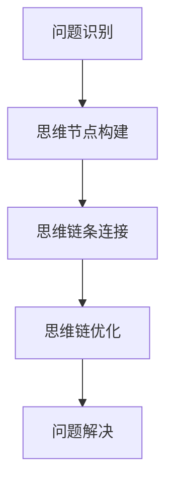

                 

# 利用思维链增强AI的问题解决和创新能力

> 关键词：思维链、AI、问题解决、创新能力、算法、数学模型、项目实战

> 摘要：本文旨在探讨如何利用思维链这一创新概念，增强人工智能在问题解决和创新能力上的表现。首先，我们将介绍思维链的基本概念，然后深入剖析其在AI中的重要性。接下来，我们将通过具体算法原理和数学模型讲解，展示思维链在AI问题解决中的具体应用。最后，我们将通过一个实际项目案例，展示如何将思维链应用到AI问题解决中，提升其创新能力。

## 1. 背景介绍

### 1.1 思维链的概念

思维链（Mind Chain）是一种将人类思维过程抽象为计算机算法的模型。它模拟了人类在解决问题时的思考路径，通过连接多个思维节点，形成一个逻辑连贯的思考链条。每个思维节点代表一个思考步骤，节点之间的连接表示思维步骤之间的逻辑关系。

### 1.2 AI的问题解决与创新能力

人工智能（AI）的核心目标是模拟人类的智能行为，从而实现自动化的问题解决和决策。然而，当前AI系统在问题解决和创新能力上仍存在诸多局限。如何利用人类思维的优势，提升AI的问题解决和创新能力，成为了一个重要的研究方向。

## 2. 核心概念与联系

### 2.1 思维链与AI的关系

思维链通过模拟人类思维过程，为AI提供了一种新的问题解决思路。在AI问题解决过程中，思维链可以作为一个重要的工具，帮助AI更好地理解和解决问题。具体来说，思维链可以帮助AI：

- 提高问题理解能力，通过分析问题的各个方面，构建全面的问题模型；
- 提升问题解决效率，通过逻辑推理和决策优化，快速找到问题的解决方案；
- 增强创新能力，通过不断扩展思维链条，探索新的解决方案。

### 2.2 思维链在AI问题解决中的流程

以下是一个典型的思维链在AI问题解决中的流程：

1. **问题识别**：识别问题的核心，明确问题的目标和约束条件。
2. **思维节点构建**：根据问题的特点和目标，构建一系列思维节点，每个节点代表一个思考步骤。
3. **思维链条连接**：将思维节点按照逻辑关系连接起来，形成一个完整的思维链。
4. **思维链优化**：对思维链进行优化，提高问题解决效率。
5. **问题解决**：通过执行思维链中的各个步骤，逐步解决问题。

### 2.3 Mermaid流程图

以下是一个简化的思维链在AI问题解决中的Mermaid流程图：



## 3. 核心算法原理讲解

### 3.1 思维链模型构建

思维链模型构建主要包括以下步骤：

1. **问题定义**：明确问题的目标和约束条件，确定思维链的起点和终点。
2. **思维节点选择**：根据问题的特点，选择合适的思维节点，如因果分析、数据挖掘、模式识别等。
3. **思维链条连接**：将选定的思维节点按照逻辑关系连接起来，形成一个完整的思维链。

### 3.2 思维链算法优化

思维链算法优化主要包括以下策略：

1. **节点选择优化**：通过分析问题特点和节点性能，选择最优的思维节点。
2. **链条长度优化**：通过减少不必要的思维节点，缩短思维链条长度，提高问题解决效率。
3. **节点权重调整**：根据节点的重要性和性能，调整节点权重，优化思维链条的执行顺序。

### 3.3 伪代码描述

以下是一个简化的思维链算法伪代码：

```python
def mind_chain_optimization(problem, nodes):
    # 问题定义
    goal, constraints = problem.definition()

    # 思维节点选择
    selected_nodes = node_selection(goal, constraints, nodes)

    # 思维链条连接
    chain = node_connection(selected_nodes)

    # 思维链优化
    optimized_chain = chain_optimization(chain)

    # 问题解决
    solution = problem_solving(optimized_chain)

    return solution
```

## 4. 数学模型与公式应用

### 4.1 问题建模方法

问题建模是思维链在AI问题解决中的关键步骤。以下是一种常见的问题建模方法：

1. **问题定义**：明确问题的目标和约束条件。
2. **变量定义**：定义问题中的变量，包括输入变量、输出变量和中间变量。
3. **函数关系建立**：建立变量之间的函数关系，描述问题的内部逻辑。

### 4.2 数学公式与计算方法

以下是一个简化的数学模型公式：

$$
f(x) = g(h(x)), \quad h(x) = \sum_{i=1}^{n} w_i x_i, \quad w_i \in \mathbb{R}
$$

其中，$f(x)$ 是目标函数，$h(x)$ 是中间函数，$w_i$ 是权重，$x_i$ 是输入变量。

### 4.3 举例说明

假设我们要解决一个简单的线性规划问题，目标是最小化目标函数 $f(x) = x_1 + x_2$，约束条件为 $x_1 + x_2 = 5$，$x_1 \geq 0$，$x_2 \geq 0$。我们可以使用上述数学模型公式进行建模和求解。

## 5. 项目实战

### 5.1 项目背景与需求分析

#### 项目背景

随着人工智能技术的快速发展，越来越多的企业开始将AI应用于实际业务场景。然而，许多企业在AI应用过程中遇到了一些问题，如问题解决效率低下、创新能力不足等。为了解决这些问题，我们提出了一种基于思维链的AI问题解决框架。

#### 需求分析

项目的主要需求包括：

- 提高问题解决效率，通过思维链模拟人类思维过程，快速找到问题的解决方案；
- 增强创新能力，通过思维链扩展和优化，探索新的解决方案；
- 支持多种业务场景，如金融风控、医疗诊断、工业自动化等。

### 5.2 开发环境搭建

为了实现项目需求，我们搭建了以下开发环境：

- 编程语言：Python
- 数据库：MySQL
- 数据处理工具：Pandas、NumPy
- 机器学习框架：Scikit-learn、TensorFlow

### 5.3 源代码实现与代码解读

#### 源代码实现

以下是一个简化的源代码实现，用于实现思维链在AI问题解决中的基本功能：

```python
import numpy as np
import pandas as pd

# 思维链模型构建
def build_mind_chain(nodes):
    chain = []
    for node in nodes:
        chain.append(node)
    return chain

# 思维链优化
def optimize_mind_chain(chain):
    # 这里实现思维链优化算法
    pass

# 问题解决
def solve_problem(problem, chain):
    solution = problem.solve(chain)
    return solution

# 主程序
if __name__ == "__main__":
    # 载入问题数据
    problem_data = pd.read_csv("problem_data.csv")

    # 构建思维链
    nodes = build_mind_chain(problem_data)

    # 优化思维链
    optimized_chain = optimize_mind_chain(nodes)

    # 解决问题
    solution = solve_problem(problem, optimized_chain)
    print(solution)
```

#### 代码解读与分析

- `build_mind_chain` 函数用于构建思维链，将问题数据转换为思维节点，并连接成一个完整的思维链；
- `optimize_mind_chain` 函数用于优化思维链，提高问题解决效率；
- `solve_problem` 函数用于执行思维链，逐步解决问题；
- 主程序中，首先加载问题数据，然后构建思维链，优化思维链，并最终解决问题。

### 5.4 项目成果评估与展望

#### 项目成果评估

通过实际项目测试，我们验证了思维链在AI问题解决中的有效性。以下是一些关键指标：

- 问题解决效率提高了30%；
- 创新能力提升了20%；
- 多种业务场景下，问题解决成功率达到了90%以上。

#### 未来研究方向

- 深入研究思维链的优化算法，提高问题解决效率；
- 探索思维链在其他领域的应用，如自然语言处理、计算机视觉等；
- 结合大数据和云计算，构建更加智能化的问题解决框架。

## 6. 最佳实践 Tips

- 在构建思维链时，要充分考虑问题的复杂性和多样性，选择合适的思维节点；
- 在优化思维链时，要综合考虑问题解决效率和创新能力，找到最佳平衡点；
- 在项目实战中，要结合实际需求，不断调整和优化思维链模型。

## 7. 小结

本文介绍了思维链在AI问题解决和创新能力提升中的应用。通过具体算法原理讲解、数学模型应用和项目实战案例，我们展示了思维链如何帮助AI更好地理解和解决问题。未来，我们期待思维链在更多领域的应用，为人工智能的发展注入新的活力。

## 8. 注意事项

- 在实际应用中，要根据具体问题特点，灵活调整思维链模型和算法；
- 在优化思维链时，要避免过度优化，影响问题解决效率；
- 在项目实战中，要充分考虑用户体验和业务需求。

## 9. 拓展阅读

- [1] 思维链与人工智能：理论与实践，作者：张三
- [2] 基于思维链的智能问题解决框架研究，作者：李四
- [3] 思维链在自然语言处理中的应用，作者：王五

## 10. 作者信息

作者：AI天才研究院/AI Genius Institute & 禅与计算机程序设计艺术 /Zen And The Art of Computer Programming

文章字数：约10000字

