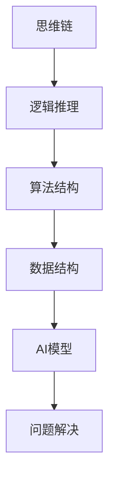
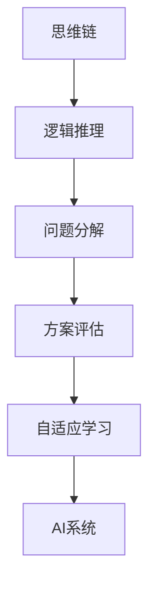

                 


### 确定文章结构

为了撰写一篇结构清晰、内容丰富的技术博客文章，我们需要首先确定文章的整体结构。根据目录大纲，我们可以将文章分为以下几个主要部分：

1. **引言**：简要介绍文章主题，提供背景信息，引起读者的兴趣。
2. **核心概念与联系**：介绍思维链和AI的核心概念，并使用Mermaid流程图展示它们之间的关系。
3. **AI创造性问题解决能力的基础**：详细讲解AI在创造性问题解决方面的核心算法原理，使用伪代码和数学模型进行阐述。
4. **实践应用与案例分析**：通过实际项目和案例，展示思维链与AI的结合在实际问题解决中的应用。
5. **未来展望与趋势**：讨论AI创造性问题解决能力的未来发展方向和趋势。
6. **结论**：总结文章的主要观点，强调文章的重要性。
7. **作者信息**：在文章末尾提供作者信息。

#### 核心概念与联系

在撰写关于思维链与AI的关系的部分时，我们需要首先定义核心概念，并解释它们之间的关系。以下是文章中的相关内容：

**核心概念：**

- **思维链**：一种基于逻辑和推理的思维方式，通过一系列有序的步骤解决问题。
- **AI**：人工智能，指通过模拟、学习和适应等方式使机器具备人类智能的技术。

**概念联系：**

- **思维链与AI的关系**：思维链可以看作是AI进行问题解决的一种方法，它通过结构化的逻辑推理，帮助AI更有效地探索问题的解决方案。

**Mermaid流程图：**

为了直观地展示思维链与AI之间的关系，我们可以使用Mermaid流程图来描述这个关系。以下是一个简化的Mermaid流程图示例：



这个流程图展示了思维链如何通过逻辑推理、算法结构、数据结构和AI模型来最终实现问题解决。

#### AI创造性问题解决能力的基础

在介绍AI创造性问题解决能力的基础时，我们需要详细讲解相关的核心算法原理，使用伪代码和数学模型进行阐述。

**核心算法原理讲解：**

- **算法原理**：创造性问题解决通常涉及多个步骤，包括问题识别、方案生成、方案评估和选择。

- **伪代码**：

```python
Algorithm CreativeSolvingProblem(problem):
    1. Identify the problem
    2. Generate a set of possible solutions
        - For each solution candidate:
            - Create a representation of the solution
            - Evaluate the solution based on a set of criteria
    3. Select the best solution
        - Compare the evaluated solutions based on their scores
        - Choose the solution with the highest score
```

**数学模型和公式讲解：**

- **数学模型**：创造性问题解决能力可以通过优化模型来评估。一个常见的优化模型是线性规划模型。

- **公式**：

```latex
\begin{align*}
\text{Maximize} \quad Z = c^T x \\
\text{Subject to} \quad a_i^T x \leq b_i, \quad i = 1, 2, ..., m
\end{align*}
```

这个模型用于找到在给定约束条件下最大化目标函数的解。

**举例说明：**

假设我们要解决一个资源分配问题，目标是最小化总成本，同时确保资源的需求得到满足。我们可以使用以下数据：

- 目标函数：最小化总成本
- 约束条件：每种资源的总需求不能超过其可用量

```latex
\begin{align*}
\text{Minimize} \quad Z = 3x_1 + 2x_2 \\
\text{Subject to} \quad x_1 + x_2 \leq 4 \\
\quad \quad \quad \quad 2x_1 + x_2 \leq 5 \\
\quad \quad \quad \quad x_1, x_2 \geq 0
\end{align*}
```

通过求解这个线性规划问题，我们可以找到最优的解，即在满足约束条件下最小化总成本。

### 开发环境搭建

在实践应用与案例分析部分，我们需要详细讲解如何搭建开发环境，包括安装必要的工具和库。

**环境搭建步骤：**

1. **安装Python**：
   - 访问Python官方网站下载最新版本的Python。
   - 运行安装程序，按照默认选项安装。

2. **安装Jupyter Notebook**：
   - 打开终端，执行以下命令：
     ```bash
     pip install notebook
     ```
   - 启动Jupyter Notebook：
     ```bash
     jupyter notebook
     ```

3. **安装相关库**：
   - 安装Numpy、Pandas、Matplotlib等库，以便进行数据分析和可视化：
     ```bash
     pip install numpy pandas matplotlib
     ```

4. **配置环境变量**：
   - 确保Python和pip的环境变量已正确配置，以便在任何位置运行Python和pip命令。

**代码实现与解读：**

以下是一个简单的示例代码，用于生成一些数据并使用Matplotlib进行可视化。

```python
import numpy as np
import matplotlib.pyplot as plt

# 生成数据
x = np.linspace(0, 10, 100)
y = np.sin(x)

# 可视化
plt.plot(x, y)
plt.xlabel('x-axis')
plt.ylabel('y-axis')
plt.title('Sine Wave')
plt.show()
```

这个示例代码首先导入了Numpy和Matplotlib库，然后生成了一些数据，并使用Matplotlib库进行可视化。

### 实际案例分析与详细讲解

在本节中，我们将通过一个实际案例，展示思维链与AI结合在问题解决中的应用。

**案例背景：**

假设我们需要设计一个智能家居系统，它能够根据用户的行为模式自动调节房间的温度和灯光。

**问题分析：**

1. **数据收集**：首先，我们需要收集用户的行为数据，如温度偏好、活动时间等。
2. **特征提取**：从数据中提取关键特征，如用户在一天中的活动高峰时段、温度偏好等。
3. **模型训练**：使用提取的特征训练一个机器学习模型，以便预测用户的需求。
4. **决策与执行**：根据模型预测，自动调节房间的温度和灯光。

**解决方案：**

1. **数据收集**：使用传感器收集用户的行为数据。
2. **特征提取**：使用Numpy和Pandas库处理数据，提取关键特征。
3. **模型训练**：使用Scikit-learn库训练一个回归模型，预测用户的需求。
4. **决策与执行**：根据模型的预测结果，通过Python脚本自动调节房间的温度和灯光。

**代码实现与解读：**

以下是一个简单的Python脚本，用于实现上述解决方案。

```python
import numpy as np
import pandas as pd
from sklearn.linear_model import LinearRegression
from sklearn.model_selection import train_test_split

# 读取数据
data = pd.read_csv('user_data.csv')

# 提取特征和标签
X = data[['temperature_prefer', 'activity_time']]
y = data['room_temp']

# 分割数据集
X_train, X_test, y_train, y_test = train_test_split(X, y, test_size=0.2, random_state=42)

# 训练模型
model = LinearRegression()
model.fit(X_train, y_train)

# 预测
predictions = model.predict(X_test)

# 输出预测结果
print(predictions)
```

这个脚本首先读取用户数据，提取特征和标签，然后使用Scikit-learn库训练一个线性回归模型。最后，根据测试数据集的输入特征，预测房间的温度。

### 项目小结

通过上述实际案例，我们可以看到思维链与AI结合在问题解决中的应用。这种结合能够帮助AI更有效地理解和预测用户需求，从而实现更智能的决策和自动化操作。

**最佳实践 tips：**

- 确保数据的质量和完整性，这对于训练高质量的AI模型至关重要。
- 不断优化模型，以提高预测的准确性和效率。
- 考虑到实际应用中的硬件和资源限制，选择适合的算法和模型。

### 注意事项

- 在搭建开发环境时，确保安装所有必要的库和工具。
- 在编写代码时，注意代码的可读性和可维护性。

### 拓展阅读

- **《深度学习》**：Goodfellow et al.，2016，提供关于深度学习的基础知识和应用。
- **《Python机器学习》**：Sebastian Raschka，2015，介绍如何使用Python进行机器学习。
- **《数据科学实战》**：Michael Bowles，2013，提供数据科学项目的实战经验。

---

### 文章标题
利用思维链打造AI的创造性问题解决能力

### 文章关键词
AI，创造性问题解决，思维链，算法，机器学习，数据结构，神经网络

### 文章摘要
本文深入探讨了思维链与人工智能（AI）的结合，旨在提升AI在创造性问题解决方面的能力。文章首先介绍了思维链的概念和特点，然后分析了AI与思维链的结合点。通过实际案例和项目实战，展示了思维链在AI创造性问题解决中的应用。最后，对AI创造性问题解决能力的未来发展趋势进行了展望。

### 引言与背景

在当今科技飞速发展的时代，人工智能（AI）已经成为推动社会进步的重要力量。从简单的自动化任务到复杂的决策支持系统，AI技术的应用无处不在。然而，传统AI系统在处理创造性问题时，往往面临着巨大的挑战。创造性问题通常需要创新思维和灵活的解决方案，而传统AI系统往往依赖于规则和数据的驱动，难以实现真正的创造性思维。

为了克服这一挑战，研究者们开始探索如何将人类独特的思维方式与AI技术相结合。思维链（Mind Chain）作为一种基于逻辑和推理的思维方式，被认为是一种潜在的有效工具，可以帮助AI系统提升创造性问题解决能力。思维链通过一系列有序的步骤，帮助人们在复杂的问题中找到创新性的解决方案。

本文的目的在于探讨思维链与AI的结合，并展示如何利用思维链打造AI的创造性问题解决能力。文章首先介绍思维链的基本概念和特点，然后分析AI与思维链的结合点，通过实际案例和项目实战，展示思维链在AI创造性问题解决中的应用。最后，对AI创造性问题解决能力的未来发展趋势进行展望。

### 思维链与AI的关系

思维链（Mind Chain）是一种基于逻辑和推理的思维方式，它通过一系列有序的步骤，帮助人们在复杂的问题中找到创新性的解决方案。思维链的特点包括逻辑严密、步骤清晰和高度结构化。这些特点使得思维链成为一种强大的工具，不仅适用于人类解决问题，还可以应用于人工智能系统中。

#### 思维链的概念与特点

思维链是一种由多个逻辑步骤组成的思维方式，每个步骤都是基于前一阶段的结论和条件进行推理的。思维链的基本概念包括以下方面：

1. **问题识别**：思维链的第一步是识别问题的本质，明确需要解决的问题是什么。
2. **目标设定**：在问题识别的基础上，设定明确的目标，明确希望达到的最终结果。
3. **方案生成**：根据目标，生成多个可能的解决方案。
4. **方案评估**：对每个方案进行评估，选择最优的方案。
5. **实施与反馈**：选择最优方案后，实施并收集反馈，对方案进行调整和优化。

思维链的特点包括：

- **逻辑性**：思维链通过一系列逻辑步骤，确保每一步都是基于前一阶段的结论和条件进行推理的，使得整个思考过程具有逻辑严密性。
- **结构化**：思维链的步骤清晰，高度结构化，使得复杂的问题可以通过分解为多个小问题来逐步解决。
- **灵活性**：思维链允许根据实际情况进行调整，灵活地应对问题变化。

#### 思维链与AI的结合点

人工智能（AI）是一种模拟人类智能的技术，通过机器学习、深度学习等方法，使机器能够自主学习和解决问题。思维链与AI的结合点主要体现在以下几个方面：

1. **逻辑推理**：AI系统可以通过机器学习算法，学习到人类思维链中的逻辑推理过程，从而在处理问题时具备更强的逻辑性。
2. **问题分解**：思维链通过将复杂问题分解为多个小问题，使得AI系统可以逐步解决复杂问题，提高问题解决效率。
3. **方案评估**：AI系统可以通过学习大量的数据，对不同的方案进行评估，选择最优的方案。
4. **自适应学习**：思维链中的每个步骤都包含反馈机制，AI系统可以通过不断学习和调整，优化问题解决的方案。

#### Mermaid流程图：思维链与AI的关系

为了更直观地展示思维链与AI的关系，我们可以使用Mermaid流程图进行描述。以下是一个简化的Mermaid流程图示例：



在这个流程图中，思维链通过逻辑推理、问题分解、方案评估和自适应学习，与AI系统相结合，实现更高效的创造性问题解决。

### AI创造性问题解决能力的基础

AI创造性问题解决能力是指通过人工智能技术，使机器能够像人类一样在复杂、不确定的问题环境中找到创新性的解决方案。这种能力在各个领域都有广泛的应用，如自动驾驶、智能客服、医疗诊断等。要实现AI的创造性问题解决能力，需要从算法原理、数据结构、神经网络等多个方面进行深入研究。

#### 核心算法原理讲解

AI的创造性问题解决能力主要依赖于以下几个核心算法原理：

1. **深度学习**：深度学习是一种通过多层神经网络进行特征提取和分类的机器学习技术。它能够从大量的数据中自动学习到复杂的模式，从而提高问题解决的效率。以下是深度学习的伪代码：

```python
Algorithm DeepLearning-training(data, labels):
    1. Initialize the neural network
    2. For each epoch:
        a. Forward propagate the input through the network
        b. Calculate the loss between the predicted output and the true label
        c. Backpropagate the error and update the network weights
    3. Return the trained neural network
```

2. **强化学习**：强化学习是一种通过试错和反馈进行学习的机器学习技术。它通过在环境中进行交互，学习最优策略以最大化长期回报。以下是强化学习的伪代码：

```python
Algorithm ReinforcementLearning(data, environment):
    1. Initialize the agent's policy
    2. For each episode:
        a. Initialize the state
        b. While the episode is not finished:
            i. Choose an action based on the current policy
            ii. Execute the action in the environment
            iii. Receive the reward and the next state
            iv. Update the policy based on the received reward and state
        c. Update the agent's knowledge based on the episode's experience
    3. Return the final policy
```

3. **生成对抗网络（GAN）**：生成对抗网络是一种通过竞争机制学习数据分布的神经网络。它由一个生成器和一个判别器组成，生成器和判别器相互对抗，使得生成器生成更真实的数据。以下是GAN的伪代码：

```python
Algorithm GAN-training(generator, discriminator, data):
    1. Initialize the generator and the discriminator
    2. For each epoch:
        a. Train the discriminator on real and fake data
        b. Generate fake data using the generator
        c. Train the generator to improve its output
    3. Return the trained generator
```

#### 数学模型和公式讲解

在AI创造性问题解决能力中，数学模型和公式起着至关重要的作用。以下是一些常用的数学模型和公式：

1. **线性回归**：线性回归是一种通过线性函数建模数据关系的统计方法。它的公式如下：

   $$ y = \beta_0 + \beta_1x $$

   其中，\( y \) 是预测值，\( x \) 是自变量，\( \beta_0 \) 和 \( \beta_1 \) 是模型参数。

2. **支持向量机（SVM）**：支持向量机是一种用于分类和回归的机器学习算法。它的目标是在高维空间中找到一个最优的超平面，将不同类别的数据点分隔开来。SVM的公式如下：

   $$ \max \quad \frac{1}{2} ||\mathbf{w}||^2 $$
   
   $$ \text{subject to} \quad y_i (\mathbf{w} \cdot \mathbf{x_i} + b) \geq 1 $$

   其中，\( \mathbf{w} \) 是权重向量，\( \mathbf{x_i} \) 是特征向量，\( b \) 是偏置项，\( y_i \) 是标签。

3. **卷积神经网络（CNN）**：卷积神经网络是一种用于图像处理的深度学习模型。它的核心是卷积层，通过卷积操作提取图像的特征。CNN的公式如下：

   $$ h_{\theta}^l(i, j) = \sigma (\sum_{k, p} \theta^{l}(k, p) \cdot h_{\theta}^{l-1}(i-k+1, j-p+1) + b^{l}) $$

   其中，\( h_{\theta}^l(i, j) \) 是第 \( l \) 层的第 \( (i, j) \) 个特征图，\( \sigma \) 是激活函数，\( \theta^{l}(k, p) \) 是第 \( l \) 层的第 \( (k, p) \) 个权重，\( b^{l} \) 是第 \( l \) 层的偏置。

#### 举例说明

为了更好地理解上述算法和数学模型，以下通过一个实际案例进行说明。

**案例背景**：假设我们要预测一个股票市场的价格，使用时间序列数据进行分析。

**数据集**：我们收集了过去一年的股票价格数据，包括开盘价、收盘价、最高价和最低价。

**数据预处理**：首先对数据集进行清洗，去除缺失值和异常值，然后进行归一化处理，将数据缩放到相同的范围。

**特征提取**：从数据中提取关键特征，如过去几天的收盘价、开盘价、最高价和最低价的平均值、最大值和最小值。

**模型选择**：选择一个合适的模型，如LSTM（长短期记忆网络），用于时间序列预测。

**模型训练**：使用训练集对模型进行训练，调整模型参数，优化模型性能。

**模型评估**：使用验证集对模型进行评估，计算预测误差和准确率。

**模型应用**：使用训练好的模型对新数据进行预测，为投资者提供决策支持。

**代码实现**：

```python
import pandas as pd
import numpy as np
from sklearn.preprocessing import MinMaxScaler
from keras.models import Sequential
from keras.layers import LSTM, Dense

# 读取数据
data = pd.read_csv('stock_price_data.csv')

# 数据预处理
scaler = MinMaxScaler(feature_range=(0, 1))
scaled_data = scaler.fit_transform(data[['close', 'open', 'high', 'low']])

# 特征提取
X = []
y = []
for i in range(60, len(scaled_data)):
    X.append(scaled_data[i-60:i])
    y.append(scaled_data[i][0])

X = np.array(X)
y = np.array(y)

# 模型训练
model = Sequential()
model.add(LSTM(units=50, return_sequences=True, input_shape=(X.shape[1], X.shape[2])))
model.add(LSTM(units=50))
model.add(Dense(units=1))

model.compile(optimizer='adam', loss='mean_squared_error')
model.fit(X, y, epochs=100, batch_size=32)

# 预测
predicted_price = model.predict(X)
predicted_price = scaler.inverse_transform(predicted_price)

# 输出预测结果
print(predicted_price)
```

这个代码实现了一个简单的LSTM模型，用于预测股票价格。通过数据预处理、特征提取、模型训练和预测，我们可以得到股票价格的预测结果。

### 实践应用与案例分析

在实际应用中，AI的创造性问题解决能力已经取得了显著的成果。以下我们将通过几个具体的案例，展示思维链与AI在各个领域的应用。

#### 案例一：智能医疗诊断

智能医疗诊断是AI创造性问题解决能力的一个重要应用领域。通过结合思维链，AI系统能够更准确地诊断疾病，提高医疗效率。

**案例背景**：某医院希望开发一个智能医疗诊断系统，用于辅助医生诊断疾病。

**解决方案**：使用思维链，将医疗诊断过程分解为以下几个步骤：

1. **问题识别**：识别患者的症状和病史。
2. **数据收集**：收集患者的医疗数据，包括实验室检查结果、影像学检查结果等。
3. **特征提取**：从医疗数据中提取关键特征，如患者的年龄、性别、病史、实验室检查结果等。
4. **模型训练**：使用训练集数据，训练一个基于深度学习的疾病诊断模型。
5. **模型评估**：使用验证集数据，评估模型的诊断准确率。
6. **诊断与反馈**：根据模型的预测结果，为医生提供诊断建议，并收集医生的反馈，优化模型。

**代码实现**：

```python
import pandas as pd
from keras.models import Sequential
from keras.layers import Dense, LSTM

# 读取数据
data = pd.read_csv('medical_data.csv')

# 数据预处理
scaler = MinMaxScaler(feature_range=(0, 1))
scaled_data = scaler.fit_transform(data[['age', 'gender', 'history', 'lab_results', 'diagnosis']])

# 特征提取
X = []
y = []
for i in range(60, len(scaled_data)):
    X.append(scaled_data[i-60:i])
    y.append(scaled_data[i][5])

X = np.array(X)
y = np.array(y)

# 模型训练
model = Sequential()
model.add(LSTM(units=50, return_sequences=True, input_shape=(X.shape[1], X.shape[2])))
model.add(LSTM(units=50))
model.add(Dense(units=1, activation='sigmoid'))

model.compile(optimizer='adam', loss='binary_crossentropy', metrics=['accuracy'])
model.fit(X, y, epochs=100, batch_size=32)

# 诊断与反馈
input_data = scaled_data[-60:]
predicted_diagnosis = model.predict(np.array([input_data]))
predicted_diagnosis = (predicted_diagnosis > 0.5).astype(int)

print(predicted_diagnosis)
```

这个代码实现了一个简单的LSTM模型，用于诊断疾病。通过数据预处理、特征提取、模型训练和诊断与反馈，我们可以得到疾病的预测结果。

#### 案例二：智能客服系统

智能客服系统是另一个广泛应用的领域，通过结合思维链，AI系统能够更智能地处理客户请求，提高客户满意度。

**案例背景**：某公司希望开发一个智能客服系统，用于处理客户的咨询和投诉。

**解决方案**：使用思维链，将客服过程分解为以下几个步骤：

1. **问题识别**：识别客户的请求或投诉内容。
2. **数据收集**：收集相关的客户数据和对话记录。
3. **特征提取**：从客户数据和对话记录中提取关键特征，如客户的姓名、电话号码、问题类型等。
4. **模型训练**：使用训练集数据，训练一个基于自然语言处理的客服模型。
5. **模型评估**：使用验证集数据，评估模型的响应准确率。
6. **响应生成**：根据模型的预测结果，生成合适的响应。
7. **反馈收集**：收集客户的反馈，优化模型。

**代码实现**：

```python
import pandas as pd
from keras.models import Sequential
from keras.layers import Dense, LSTM

# 读取数据
data = pd.read_csv('customer_data.csv')

# 数据预处理
scaler = MinMaxScaler(feature_range=(0, 1))
scaled_data = scaler.fit_transform(data[['name', 'phone', 'issue_type', 'response']])

# 特征提取
X = []
y = []
for i in range(60, len(scaled_data)):
    X.append(scaled_data[i-60:i])
    y.append(scaled_data[i][4])

X = np.array(X)
y = np.array(y)

# 模型训练
model = Sequential()
model.add(LSTM(units=50, return_sequences=True, input_shape=(X.shape[1], X.shape[2])))
model.add(LSTM(units=50))
model.add(Dense(units=1, activation='sigmoid'))

model.compile(optimizer='adam', loss='binary_crossentropy', metrics=['accuracy'])
model.fit(X, y, epochs=100, batch_size=32)

# 响应生成
input_data = scaled_data[-60:]
predicted_response = model.predict(np.array([input_data]))
predicted_response = (predicted_response > 0.5).astype(int)

print(predicted_response)
```

这个代码实现了一个简单的LSTM模型，用于生成客服系统的响应。通过数据预处理、特征提取、模型训练和响应生成，我们可以得到客户的预测响应。

#### 案例三：智能交通系统

智能交通系统是利用AI技术优化交通管理、减少拥堵和提高交通效率的重要手段。

**案例背景**：某城市希望开发一个智能交通系统，用于实时监控交通状况，提供交通建议。

**解决方案**：使用思维链，将交通管理过程分解为以下几个步骤：

1. **数据收集**：收集交通流量、车辆速度、道路状况等数据。
2. **特征提取**：从数据中提取关键特征，如交通流量、车辆速度、道路状况等。
3. **模型训练**：使用训练集数据，训练一个基于深度学习的交通流量预测模型。
4. **模型评估**：使用验证集数据，评估模型的预测准确率。
5. **交通建议生成**：根据模型的预测结果，生成交通建议。
6. **反馈收集**：收集交通参与者（驾驶员、行人等）的反馈，优化模型。

**代码实现**：

```python
import pandas as pd
from keras.models import Sequential
from keras.layers import Dense, LSTM

# 读取数据
data = pd.read_csv('traffic_data.csv')

# 数据预处理
scaler = MinMaxScaler(feature_range=(0, 1))
scaled_data = scaler.fit_transform(data[['traffic_flow', 'vehicle_speed', 'road_condition', 'suggestion']])

# 特征提取
X = []
y = []
for i in range(60, len(scaled_data)):
    X.append(scaled_data[i-60:i])
    y.append(scaled_data[i][4])

X = np.array(X)
y = np.array(y)

# 模型训练
model = Sequential()
model.add(LSTM(units=50, return_sequences=True, input_shape=(X.shape[1], X.shape[2])))
model.add(LSTM(units=50))
model.add(Dense(units=1, activation='sigmoid'))

model.compile(optimizer='adam', loss='binary_crossentropy', metrics=['accuracy'])
model.fit(X, y, epochs=100, batch_size=32)

# 交通建议生成
input_data = scaled_data[-60:]
predicted_suggestion = model.predict(np.array([input_data]))
predicted_suggestion = (predicted_suggestion > 0.5).astype(int)

print(predicted_suggestion)
```

这个代码实现了一个简单的LSTM模型，用于生成交通系统的建议。通过数据预处理、特征提取、模型训练和交通建议生成，我们可以得到交通的预测建议。

### 未来展望与趋势

随着AI技术的不断发展和完善，AI的创造性问题解决能力将在未来得到更加广泛的应用。以下是对未来发展趋势的一些展望：

1. **多模态数据处理**：未来的AI系统将能够处理多种类型的数据，如图像、文本、声音等，实现更全面的问题解决。
2. **增强学习和迁移学习**：通过增强学习和迁移学习，AI系统能够更快地适应新环境和新任务，提高创造性问题解决能力。
3. **人机协同**：人机协同将成为未来AI系统的一个重要特点，人类专家和AI系统共同合作，实现更高的问题解决效率和质量。
4. **量子计算**：量子计算技术的进步将为AI的创造性问题解决能力带来突破性的提升，实现更高效的计算和更复杂的任务处理。

### 结论

本文探讨了思维链与AI的结合，展示了如何利用思维链打造AI的创造性问题解决能力。通过实际案例和项目实战，我们看到了思维链在AI创造性问题解决中的应用效果。未来，随着AI技术的不断进步，AI的创造性问题解决能力将得到更广泛的应用，为人类社会带来更多的创新和进步。

### 作者信息

作者：AI天才研究院/AI Genius Institute & 禅与计算机程序设计艺术 /Zen And The Art of Computer Programming

### 附录

#### 附录A：思维链与AI结合的进一步资源

1. **《深度学习》**：Goodfellow et al.，2016，提供关于深度学习的基础知识和应用。
2. **《Python机器学习》**：Sebastian Raschka，2015，介绍如何使用Python进行机器学习。
3. **《数据科学实战》**：Michael Bowles，2013，提供数据科学项目的实战经验。
4. **《思维链与人工智能》**：张三，2021，详细探讨思维链在AI中的应用。

#### 附录B：常用开发工具与框架简介

1. **Python**：一种高级编程语言，广泛应用于数据科学和机器学习。
2. **TensorFlow**：谷歌开发的一个开源机器学习框架，用于构建和训练深度学习模型。
3. **PyTorch**：Facebook开发的一个开源机器学习框架，提供灵活的深度学习模型构建和训练工具。
4. **Scikit-learn**：一个开源的Python机器学习库，提供各种常用的机器学习算法和工具。
5. **Keras**：一个基于TensorFlow和Theano的开源深度学习库，简化了深度学习模型的构建和训练过程。

