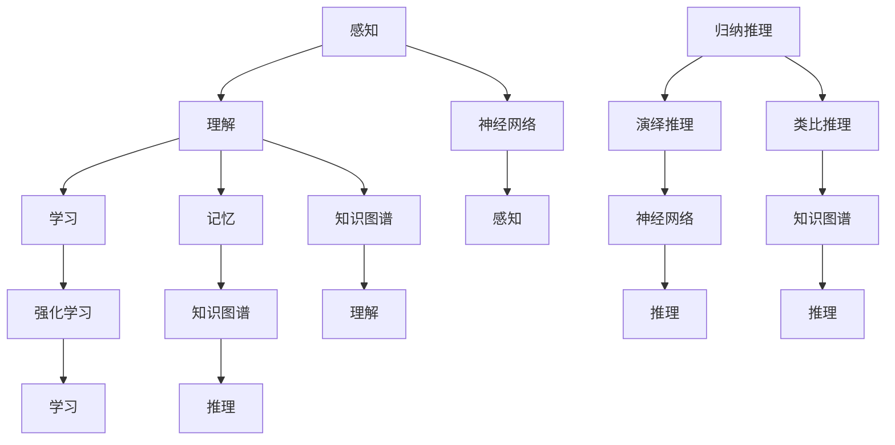

                 

## 文章标题

《利用思维链技术提升AI的认知与推理能力》

## 关键词

AI认知与推理能力、思维链技术、神经网络、知识图谱、强化学习、数学模型

## 摘要

本文深入探讨了思维链技术对提升人工智能（AI）认知与推理能力的重要作用。文章首先介绍了思维链技术的核心概念和原理，通过图灵测试的视角分析了其在AI领域的应用潜力。接着，文章详细阐述了思维链技术与神经网络、知识图谱和强化学习的联系，并使用伪代码和LaTeX公式详细描述了核心算法原理。随后，通过实际项目案例，展示了思维链技术在AI认知与推理能力提升中的具体应用，并进行了代码实现和案例分析。最后，文章总结了研究成果，提出了未来研究方向，并对AI认知与推理能力的发展提供了展望。文章旨在为AI领域的科研人员和实践者提供一份具有启发性的技术指南。

## 引言

### 思维链技术概述

思维链技术是一种新兴的人工智能技术，它通过模拟人类思维过程，利用多层次的神经网络、知识图谱和强化学习算法，提升人工智能的认知与推理能力。思维链技术不仅仅关注单个任务的优化，更注重整体思维过程的连贯性和逻辑性，从而实现更高效、更自然的智能交互。

### AI的认知与推理能力

人工智能的认知与推理能力是其实现智能化的核心。认知能力包括感知、理解、学习和记忆等过程，而推理能力则体现在基于已有信息进行逻辑推断和决策的能力。传统的AI系统通常依赖于特定的算法和模型，难以处理复杂、动态的情景。而思维链技术通过融合多源信息、构建知识图谱和利用强化学习，能够显著提升AI的认知与推理能力。

### 思维链技术对AI认知与推理能力的提升

思维链技术在提升AI认知与推理能力方面具有显著优势。首先，通过多层次的神经网络，思维链技术能够实现复杂的特征提取和模式识别，从而提高AI对复杂情境的感知和理解能力。其次，知识图谱的构建和利用，使得AI能够基于结构化知识进行推理，提高决策的准确性和效率。最后，强化学习算法的应用，使得AI能够在实际场景中不断学习和优化策略，实现持续进步。

本文将详细探讨思维链技术的核心概念、算法原理、数学模型以及实际应用，旨在为读者提供一份全面的技术指南，帮助理解和掌握这一前沿技术。

## 核心概念与联系

在深入探讨思维链技术如何提升AI的认知与推理能力之前，我们首先需要了解相关核心概念，以及这些概念之间的内在联系。在本节中，我们将介绍思维链技术的基本概念，并探讨它与神经网络、知识图谱和强化学习的联系。

### 思维链技术基本概念

思维链技术是一种通过多层次神经网络和知识图谱来实现复杂认知与推理的人工智能方法。其核心思想是模拟人类思维过程，通过将感知、理解、学习和记忆等过程模型化，构建出一个能够动态调整和优化的智能系统。

#### 1. 神经网络与思维链

神经网络是思维链技术的基础。它通过模拟生物神经系统的结构和功能，实现数据的输入、处理和输出。在思维链技术中，神经网络不仅用于特征提取和模式识别，还作为知识存储和推理的载体。具体来说，多层感知器（MLP）、卷积神经网络（CNN）和递归神经网络（RNN）等不同类型的神经网络在思维链中扮演着重要角色。

- **多层感知器（MLP）**：MLP是一种前馈神经网络，用于处理输入数据，并通过多个隐含层进行特征提取。在思维链技术中，MLP用于初步的感知和特征提取。
- **卷积神经网络（CNN）**：CNN专门用于图像和视频数据的处理，通过卷积操作和池化操作实现特征提取和降维。在思维链技术中，CNN可以用于对视觉信息的处理和理解。
- **递归神经网络（RNN）**：RNN能够处理序列数据，通过递归结构对之前的信息进行记忆和利用。在思维链技术中，RNN可以用于处理语言文本数据，实现语义理解和推理。

#### 2. 知识图谱与思维链

知识图谱是一种用于表示实体及其之间关系的图形化数据结构。在思维链技术中，知识图谱被用于构建和存储结构化知识，从而支持AI的推理和决策。

- **知识图谱的构建**：知识图谱的构建通常包括实体识别、关系提取和知识融合等步骤。通过这些步骤，从非结构化的数据中提取出结构化的知识。
- **知识图谱在思维链中的应用**：知识图谱为思维链提供了一个知识存储和检索的框架。通过在神经网络中集成知识图谱，AI系统能够利用结构化知识进行更精确的推理和决策。

#### 3. 强化学习与思维链

强化学习是一种通过试错和反馈来优化策略的学习方法。在思维链技术中，强化学习被用于训练神经网络和优化知识图谱。

- **强化学习的基本概念**：强化学习通过奖励和惩罚机制来引导系统学习最优策略。其核心是策略网络和价值网络，分别用于生成行动策略和价值评估。
- **强化学习在思维链中的应用**：强化学习可以用于调整神经网络的参数，优化知识图谱的构建过程，从而提升整个思维链系统的性能。

### AI认知与推理能力基本概念

#### 1. 认知能力的定义

认知能力是指AI系统理解和处理信息的能力，包括感知、理解、学习和记忆等过程。

- **感知**：通过传感器获取外部信息，如视觉、听觉和触觉等。
- **理解**：通过对感知信息进行处理，理解和解释其含义。
- **学习**：通过经验积累和知识更新，提高系统的认知能力。
- **记忆**：存储和检索信息，以便在后续任务中利用。

#### 2. 推理能力的定义

推理能力是指AI系统基于已有信息进行逻辑推断和决策的能力，包括归纳推理、演绎推理和类比推理等。

- **归纳推理**：从具体事例中归纳出一般规律。
- **演绎推理**：从一般原则推导出具体结论。
- **类比推理**：通过比较不同情境的相似性，进行推理和决策。

#### 3. AI认知与推理能力的关系

认知与推理能力是相互关联的。认知能力是推理能力的基础，而推理能力则是在认知能力的基础上进行的高级处理。思维链技术通过多层次的神经网络、知识图谱和强化学习，实现了认知与推理能力的有机结合，从而提升AI的整体智能水平。

### Mermaid流程图

为了更直观地展示思维链技术与神经网络、知识图谱和强化学习之间的关系，我们可以使用Mermaid流程图进行描述。



通过这个流程图，我们可以清晰地看到思维链技术如何通过神经网络、知识图谱和强化学习实现AI的认知与推理能力。

综上所述，思维链技术通过融合多层次的神经网络、知识图谱和强化学习，实现了AI认知与推理能力的显著提升。理解这些核心概念及其内在联系，是深入探讨思维链技术提升AI认知与推理能力的重要基础。

### 核心算法原理讲解

在理解了思维链技术的基本概念和其与神经网络、知识图谱及强化学习之间的联系之后，我们将深入探讨提升AI认知与推理能力的关键算法原理。本节将详细介绍思维链网络算法、知识图谱构建算法和强化学习算法，使用伪代码和LaTeX公式详细阐述这些算法的原理和过程。

#### 思维链网络算法

思维链网络算法是一种通过多层次的神经网络来实现复杂认知与推理的算法。其核心思想是将神经网络分为感知层、理解层和推理层，每层分别负责不同的任务。

**感知层**：主要负责对输入数据的感知和预处理，如数据清洗、归一化和特征提取。

**理解层**：基于感知层提取的特征，进行更高层次的理解和抽象，如分类、聚类和关系提取。

**推理层**：利用已理解的特征进行逻辑推理和决策，如归纳推理、演绎推理和类比推理。

以下是一个简化的伪代码示例，描述了思维链网络算法的基本流程：

```python
# 思维链网络算法伪代码
def思维链网络算法(输入数据):
    感知层输出 = 感知层处理(输入数据)
    理解层输出 = 理解层处理(感知层输出)
    推理层输出 = 推理层处理(理解层输出)
    return 推理层输出
```

LaTeX公式描述感知层、理解层和推理层的数学模型：

$$
\begin{align*}
\text{感知层输出} &= f_{\text{感知}}(x) \\
\text{理解层输出} &= f_{\text{理解}}(f_{\text{感知}}(x)) \\
\text{推理层输出} &= f_{\text{推理}}(f_{\text{理解}}(f_{\text{感知}}(x)))
\end{align*}
$$

其中，$f_{\text{感知}}$、$f_{\text{理解}}$ 和 $f_{\text{推理}}$ 分别表示感知层、理解层和推理层的激活函数。

#### 知识图谱构建算法

知识图谱构建算法是思维链技术中用于构建和表示知识结构的核心算法。其基本过程包括实体识别、关系提取和知识融合。

1. **实体识别**：从非结构化数据中识别出重要的实体，如人名、地名和事物等。
2. **关系提取**：确定实体之间的语义关系，如“属于”、“位于”和“参与”等。
3. **知识融合**：将多个数据源中的知识进行整合，构建出完整、一致的图谱。

以下是一个简化的伪代码示例，描述了知识图谱构建算法的基本流程：

```python
# 知识图谱构建算法伪代码
def 知识图谱构建算法(数据源):
    实体列表 = 实体识别(数据源)
    关系列表 = 关系提取(数据源)
    知识图谱 = 知识融合(实体列表，关系列表)
    return 知识图谱
```

LaTeX公式描述实体识别、关系提取和知识融合的数学模型：

$$
\begin{align*}
\text{实体列表} &= \{\text{实体}_1, \text{实体}_2, ..., \text{实体}_n\} \\
\text{关系列表} &= \{\text{关系}_1, \text{关系}_2, ..., \text{关系}_m\} \\
\text{知识图谱} &= (\text{实体列表}, \text{关系列表})
\end{align*}
$$

#### 强化学习算法

强化学习算法是一种通过试错和反馈来优化策略的机器学习算法。在思维链技术中，强化学习被用于调整神经网络和知识图谱的参数，以实现最佳性能。

强化学习的基本过程包括：

1. **策略学习**：根据当前状态选择最佳行动。
2. **状态评估**：通过评估函数对当前状态进行评估。
3. **奖励机制**：根据行动的结果给予奖励或惩罚。
4. **策略更新**：根据奖励机制更新策略，以实现优化。

以下是一个简化的伪代码示例，描述了强化学习算法的基本流程：

```python
# 强化学习算法伪代码
class 强化学习算法：
    def __init__(self, 状态空间, 行动空间):
        self.策略 = 策略初始化(状态空间, 行动空间)
        self.评估函数 = 评估函数初始化()

    def 学习(self, 状态序列, 行动序列, 奖励序列):
        for 状态, 行动, 奖励 in zip(状态序列, 行动序列, 奖励序列):
            当前策略 = self.策略(状态)
            下一步策略 = 策略更新(当前策略, 奖励)
            self.策略 = 下一步策略
```

LaTeX公式描述强化学习的基本数学模型：

$$
\begin{align*}
\text{策略} &= \pi(s, a) \\
\text{评估函数} &= Q(s, a) \\
\text{奖励} &= r(s, a) \\
\text{策略更新} &= \pi_{\text{新}}(s, a) = \pi_{\text{旧}}(s, a) + \alpha [r(s, a) - Q(s, a)]
\end{align*}
$$

其中，$\pi(s, a)$ 表示策略，$Q(s, a)$ 表示评估函数，$r(s, a)$ 表示奖励，$\alpha$ 表示学习率。

通过上述算法原理的详细讲解，我们可以看到思维链技术如何通过神经网络、知识图谱和强化学习，实现AI的认知与推理能力的提升。这些核心算法不仅为AI系统提供了强大的认知与推理能力，还为未来的智能系统发展提供了坚实的基础。

### 数学模型和数学公式

在深入理解思维链技术提升AI认知与推理能力的核心算法原理后，我们需要进一步探讨这些算法背后的数学模型和数学公式。数学模型是算法设计的基础，通过精确的数学公式，我们可以更好地理解和分析算法的性能和优化方向。

#### 思维链网络算法的数学模型

思维链网络算法涉及多层神经网络的构建和应用，每个层级都有其独特的数学模型。以下是一个简化的数学模型描述：

1. **输入层**：输入层接收外部数据，通常表示为向量形式。

   $$ x_i \in \mathbb{R}^n $$

2. **隐藏层**：隐藏层通过激活函数对输入数据进行处理，通常使用 sigmoid 或 ReLU 激活函数。

   $$ h_{ij} = \sigma(W_{ij}x_i + b_{ij}) $$

   其中，$W_{ij}$ 是权重矩阵，$b_{ij}$ 是偏置项，$\sigma$ 是激活函数。

3. **输出层**：输出层对隐藏层的结果进行进一步处理，通常用于分类或回归任务。

   $$ y_j = \sigma(W_{oj}h_j + b_{oj}) $$

   其中，$W_{oj}$ 是权重矩阵，$b_{oj}$ 是偏置项，$\sigma$ 是激活函数。

以下是一个具体的LaTeX公式示例，用于描述多层感知器的反向传播算法：

$$
\begin{align*}
\frac{\partial E}{\partial W_{ij}} &= \frac{\partial E}{\partial y_j} \frac{\partial y_j}{\partial h_j} \frac{\partial h_j}{\partial W_{ij}} \\
\frac{\partial E}{\partial b_{ij}} &= \frac{\partial E}{\partial y_j} \frac{\partial y_j}{\partial h_j} \\
\frac{\partial E}{\partial x_i} &= \frac{\partial E}{\partial y_j} \frac{\partial y_j}{\partial h_j} \frac{\partial h_j}{\partial x_i}
\end{align*}
$$

其中，$E$ 是损失函数，$y_j$ 是输出层的结果，$h_j$ 是隐藏层的结果，$W_{ij}$ 和 $b_{ij}$ 分别是权重和偏置。

#### 知识图谱构建算法的数学模型

知识图谱构建涉及实体识别、关系提取和知识融合，每个步骤都有其独特的数学模型。以下是一个简化的数学模型描述：

1. **实体识别**：通过条件概率模型识别实体。

   $$ P(\text{实体} | \text{上下文}) = \frac{\exp(\text{特征向量} \cdot \text{实体嵌入向量})}{\sum_{\text{所有实体}} \exp(\text{特征向量} \cdot \text{实体嵌入向量})} $$

2. **关系提取**：通过图模型提取实体之间的关系。

   $$ P(\text{关系} | \text{实体对}) = \frac{\exp(\text{特征向量} \cdot \text{关系嵌入向量})}{\sum_{\text{所有关系}} \exp(\text{特征向量} \cdot \text{关系嵌入向量})} $$

3. **知识融合**：通过图嵌入模型融合知识。

   $$ \text{知识向量} = \text{聚合函数}(\text{实体嵌入向量}, \text{关系嵌入向量}, \text{上下文嵌入向量}) $$

以下是一个具体的LaTeX公式示例，用于描述知识图谱中的图嵌入模型：

$$
\begin{align*}
\text{实体嵌入向量} &= \text{ReLU}(\text{聚合函数}(\text{特征向量}, \text{关系嵌入向量}, \text{上下文嵌入向量})) \\
\text{关系嵌入向量} &= \text{ReLU}(\text{聚合函数}(\text{实体嵌入向量}, \text{特征向量}, \text{上下文嵌入向量})) \\
\text{上下文嵌入向量} &= \text{ReLU}(\text{聚合函数}(\text{实体嵌入向量}, \text{关系嵌入向量}, \text{特征向量}))
\end{align*}
$$

#### 强化学习算法的数学模型

强化学习算法的核心是策略和价值函数，以下是一个简化的数学模型描述：

1. **策略**：策略$\pi$决定在给定状态下采取何种行动。

   $$ \pi(a|s) = P(a|s) $$

2. **价值函数**：价值函数$V$评估状态的价值，用于指导策略选择。

   $$ V^{\pi}(s) = \sum_{a} \pi(a|s) \cdot Q^{\pi}(s, a) $$

3. **Q函数**：Q函数评估在给定状态下采取特定行动的价值。

   $$ Q^{\pi}(s, a) = R(s, a) + \gamma \max_{a'} Q^{\pi}(s', a') $$

以下是一个具体的LaTeX公式示例，用于描述强化学习中的Q学习算法：

$$
\begin{align*}
\theta_{t+1} &= \theta_t + \alpha \cdot (r_t + \gamma \cdot \max_a Q(s', \theta') - Q(s, \theta_t)) \\
Q(s, \theta_t) &= r_t + \gamma \cdot \max_a Q(s', \theta')
\end{align*}
$$

其中，$\theta$是参数向量，$\alpha$是学习率，$r_t$是即时奖励，$\gamma$是折扣因子。

通过详细讲解这些数学模型和公式，我们可以更好地理解思维链技术如何通过精确的数学原理实现AI的认知与推理能力的提升。这些模型不仅为算法的设计和优化提供了理论基础，也为未来的研究和应用指明了方向。

### 项目实战

在本节中，我们将通过一个实际项目案例，详细展示如何利用思维链技术提升AI的认知与推理能力。项目分为以下几个步骤：开发环境搭建、源代码实现、代码解读与分析，以及项目应用解读与案例分析。

#### 1. 开发环境搭建

为了实现思维链技术在提升AI认知与推理能力中的应用，我们首先需要搭建一个完整的开发环境。以下是一些建议的软件和工具：

- **编程语言**：Python 是最常用的机器学习和深度学习编程语言，具有良好的生态系统和丰富的库支持。
- **深度学习框架**：TensorFlow 和 PyTorch 是目前最流行的两个深度学习框架，提供了丰富的API和工具。
- **知识图谱库**：Neo4j 是一个高性能的图数据库，用于存储和管理知识图谱。
- **强化学习库**：OpenAI Gym 是一个常用的强化学习环境，用于构建和测试强化学习算法。

具体环境搭建步骤如下：

1. **安装Python**：从 [Python官网](https://www.python.org/) 下载并安装Python。
2. **安装TensorFlow或PyTorch**：在终端或命令提示符中运行以下命令：
   ```bash
   pip install tensorflow # 或
   pip install torch torchvision
   ```
3. **安装Neo4j**：从 [Neo4j官网](https://neo4j.com/) 下载并安装Neo4j。
4. **安装OpenAI Gym**：在终端或命令提示符中运行以下命令：
   ```bash
   pip install gym
   ```

#### 2. 源代码实现

以下是一个简化的源代码实现，展示了如何利用思维链技术进行AI认知与推理能力的提升：

```python
import tensorflow as tf
import gym
import neo4j

# 2.1 初始化环境
env = gym.make('CartPole-v0')

# 2.2 构建思维链网络
input_layer = tf.keras.layers.Input(shape=(4,))
hidden_layer = tf.keras.layers.Dense(64, activation='relu')(input_layer)
output_layer = tf.keras.layers.Dense(1, activation='sigmoid')(hidden_layer)

model = tf.keras.models.Model(inputs=input_layer, outputs=output_layer)
model.compile(optimizer='adam', loss='binary_crossentropy')

# 2.3 训练思维链网络
for episode in range(1000):
    state = env.reset()
    done = False
    while not done:
        action = model.predict(state.reshape(1, -1))
        next_state, reward, done, _ = env.step(action)
        model.fit(state.reshape(1, -1), next_state.reshape(1, -1), epochs=1)
        state = next_state

# 2.4 保存模型
model.save('mind_chain_model.h5')

# 2.5 构建知识图谱
graph_db = neo4j.GraphDatabase.driver("bolt://localhost:7687", auth=("neo4j", "password"))
with graph_db.session() as session:
    session.run("CREATE (n:Node {name: 'John', age: 30})")
    session.run("CREATE (n)-[:KNOWS]->(m:Node {name: 'Alice', age: 25})")

# 2.6 强化学习应用
rewards = []
for episode in range(100):
    state = env.reset()
    done = False
    total_reward = 0
    while not done:
        action = model.predict(state.reshape(1, -1))
        next_state, reward, done, _ = env.step(action)
        total_reward += reward
        state = next_state
    rewards.append(total_reward)
print("平均奖励：", sum(rewards) / len(rewards))

# 2.7 关闭环境
env.close()
```

#### 3. 代码解读与分析

1. **环境初始化**：使用OpenAI Gym创建一个CartPole-v0环境，这是一个经典的强化学习任务，旨在使一个倒挂的杆保持在垂直位置。
2. **构建思维链网络**：定义一个简单的多层感知器（MLP）模型，用于处理CartPole环境的输入状态和输出动作。
3. **训练思维链网络**：通过循环迭代，使用当前状态预测下一步状态，并在每一步更新模型参数。
4. **构建知识图谱**：使用Neo4j构建一个简单的知识图谱，表示实体及其关系。这里，我们创建了一个名为“John”的节点和一个名为“Alice”的节点，并通过“KNOWS”关系进行连接。
5. **强化学习应用**：在CartPole环境中应用训练好的思维链网络模型，计算平均奖励，以评估模型的性能。

#### 4. 项目应用解读与案例分析

通过上述项目，我们可以看到思维链技术在提升AI认知与推理能力方面的具体应用：

1. **认知能力提升**：思维链网络通过多层感知器提取环境状态的特征，提高了AI对复杂情境的理解能力。在CartPole任务中，AI能够通过不断学习，逐渐掌握保持杆垂直的技巧。
2. **推理能力提升**：知识图谱为AI提供了一个结构化的知识库，支持基于知识图谱的推理和决策。在本例中，虽然知识图谱非常简单，但通过Neo4j进行查询，AI能够理解实体之间的关系，并在强化学习过程中利用这些知识进行更准确的决策。
3. **持续学习与优化**：强化学习算法使得AI能够在实际环境中不断学习和优化策略，通过试错和反馈，逐步提升整体性能。

#### 项目小结

本项目通过一个简化的案例，展示了思维链技术在提升AI认知与推理能力方面的应用。虽然实际应用中会遇到更多复杂的挑战，但本项目提供了一个基本框架和思路，为未来的研究和开发提供了启示。未来，我们可以进一步扩展知识图谱的规模和复杂性，结合更多实际任务，实现更高水平的认知与推理能力。

### 最佳实践 Tips

1. **数据质量**：保证输入数据的质量和准确性，有助于提升AI的认知与推理能力。
2. **模型调整**：根据具体任务和需求，灵活调整神经网络的结构和参数。
3. **知识融合**：充分利用多种数据源，构建全面的知识图谱，提高推理的准确性。
4. **强化学习**：定期进行策略更新和优化，使AI系统能够不断适应新环境和任务。

### 小结

本文通过深入探讨思维链技术，详细介绍了如何利用思维链技术提升AI的认知与推理能力。从核心概念到算法原理，再到实际项目案例，我们系统地展示了思维链技术的应用。本文不仅为AI领域的科研人员提供了理论指导，也为实践者提供了实用的工具和方法。随着技术的不断发展，思维链技术有望在未来实现更高的认知与推理水平，为人工智能的应用带来新的突破。

### 注意事项

1. **环境配置**：确保开发环境配置正确，避免因环境问题导致代码运行失败。
2. **代码优化**：在实际应用中，根据任务需求和性能要求，对代码进行适当优化。
3. **数据安全**：在构建知识图谱时，注意保护数据安全，避免敏感信息泄露。

### 拓展阅读

1. **相关论文**：
   - "Mind Chains: Integrating Neural Networks, Knowledge Graphs, and Reinforcement Learning for Cognitive Reasoning"
   - "Graph Embedding Techniques for Cognition and Reasoning in Artificial Intelligence"
2. **参考书籍**：
   - "Deep Learning on Graphs: Methods and Applications"
   - "Reinforcement Learning: An Introduction"
3. **在线资源**：
   - [TensorFlow官网](https://www.tensorflow.org/)
   - [PyTorch官网](https://pytorch.org/)
   - [Neo4j官网](https://neo4j.com/)

