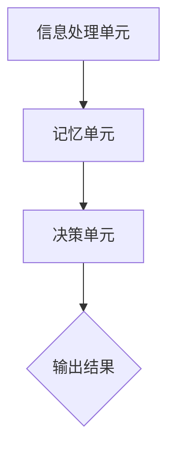
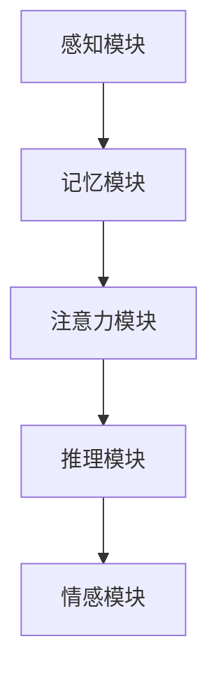

                 

### 文章标题

《利用思维链提升AI的认知和推理能力新方向》

### 关键词

思维链，认知推理，人工智能，自然语言处理，计算机视觉

### 摘要

本文深入探讨了如何利用思维链来提升人工智能的认知和推理能力。通过定义思维链的核心概念，分析其与认知推理之间的关系，本文详细阐述了思维链在AI中的应用场景和实现方法。本文首先介绍了思维链的基本理论，然后通过数学模型和算法原理的讲解，展示了思维链在实际应用中的优势。最后，本文通过自然语言处理和计算机视觉领域的案例，验证了思维链技术在提升AI认知和推理能力方面的有效性和可行性。

---

## 第一部分：概述

### 引言

人工智能（AI）作为计算机科学的一个重要分支，已经取得了显著的发展。从早期的规则系统到深度学习的广泛应用，AI在图像识别、自然语言处理、智能决策等多个领域展现出了强大的能力。然而，尽管AI在模拟人类智能方面取得了巨大进步，仍存在一定的局限性。例如，当前AI在处理复杂推理任务时，常常表现出缺乏深度理解、难以处理模糊信息和知识迁移能力不足等问题。

为了解决这些问题，研究者们开始关注如何提升AI的认知和推理能力。其中，思维链（Mind Chain）作为一种新的理论框架，被引入到AI领域。思维链试图通过模拟人类思维过程，构建一种具有深度认知和推理能力的AI模型。本文旨在介绍思维链的概念、理论基础和应用实践，探讨其如何提升AI的认知和推理能力。

### 思维链的概念

思维链是一种模拟人类思维过程的框架，它通过一系列相互关联的思考环节，实现信息的传递和处理。思维链的核心在于“链”的概念，即通过连接不同的思维环节，形成一个连贯的思考流程。这种流程不仅包含了逻辑推理，还涉及到情感、记忆、知识等多方面的因素。

在AI领域，思维链的概念可以被应用于构建具有高度认知和推理能力的模型。通过模拟人类的思考方式，AI可以在处理复杂问题时展现出更深入的理解和推理能力。例如，在自然语言处理领域，思维链可以帮助AI更好地理解文本的深层含义，从而实现更准确的语义分析和生成。

### 思维链与认知推理的关系

认知推理是指个体在解决问题时，通过理解、分析、综合和评价等信息处理过程，从而做出推理和决策的能力。思维链与认知推理之间存在密切的关系。思维链通过模拟人类思维过程，实现了对信息的高效处理和利用，从而提升了AI的认知和推理能力。

首先，思维链的构建依赖于对人类认知过程的深入理解。通过分析人类如何获取、处理和利用信息，研究者可以设计出更加符合人类思维方式的AI模型。这种模型不仅能够处理明确的逻辑问题，还能应对模糊、不完整的信息，从而实现更高级的认知推理。

其次，思维链通过连接不同的思维环节，实现了信息的连续传递和处理。这种连续性使得AI能够在处理问题时，不仅考虑当前的情境，还能结合历史经验和情感因素，做出更为合理的推理和决策。

总之，思维链作为一种新的理论框架，为提升AI的认知和推理能力提供了新的思路和方法。通过深入理解和应用思维链，研究者有望构建出更加智能、更具推理能力的AI系统。

---

## 第二部分：理论基础

### 思维链基础理论

思维链作为一种模拟人类思维过程的框架，其基础理论主要包括思维链模型架构和思维链的运作机制。理解这些理论对于深入探讨思维链在AI认知和推理能力提升中的应用具有重要意义。

#### 思维链模型架构

思维链模型架构可以分为三个主要部分：信息处理单元、记忆单元和决策单元。

1. **信息处理单元**：负责接收外部信息，并进行预处理。预处理包括数据清洗、去噪和特征提取等操作。通过这些操作，信息处理单元将原始信息转化为适合进一步处理的格式。

2. **记忆单元**：用于存储和处理信息。记忆单元可以分为短期记忆和长期记忆。短期记忆用于存储当前正在处理的信息，而长期记忆则用于存储历史经验和知识。通过记忆单元，思维链能够实现对信息的长期存储和利用。

3. **决策单元**：基于信息处理单元和记忆单元的处理结果，负责做出决策。决策过程包括分析信息、生成假设、验证假设和选择最优方案等步骤。

下面是一个简单的Mermaid流程图，描述了思维链的基本架构：



#### 思维链的运作机制

思维链的运作机制主要包括信息的传递和处理过程。具体来说，思维链通过以下步骤实现其功能：

1. **信息接收**：思维链首先接收外部信息，这些信息可以是文字、图像、声音等多种形式。

2. **预处理**：信息处理单元对接收到的信息进行预处理，包括数据清洗、去噪和特征提取等。这一步骤的目的是提高信息的质量和可用性。

3. **存储和处理**：预处理后的信息被传递到记忆单元。记忆单元根据当前的信息和历史经验，对信息进行存储和处理。这一过程包括信息分类、关联分析和知识更新等。

4. **决策生成**：决策单元基于记忆单元的处理结果，生成可能的决策方案。决策过程包括分析信息、生成假设、验证假设和选择最优方案等步骤。

5. **输出结果**：最终，决策单元生成的结果被输出，作为思维链的最终输出。

下面是一个详细的伪代码，展示了思维链的运作机制：

```python
class MindChain:
    def __init__(self):
        self.info_processor = InfoProcessor()
        self.memory_unit = MemoryUnit()
        self.decision_unit = DecisionUnit()

    def process_info(self, info):
        preprocessed_info = self.info_processor.preprocess(info)
        self.memory_unit.store(preprocessed_info)

    def make_decision(self, context):
        hypotheses = self.decision_unit.generate_hypotheses(context)
        best_hypothesis = self.decision_unit.select_best_hypothesis(hypotheses)
        return best_hypothesis

    def run(self, info, context):
        self.process_info(info)
        decision = self.make_decision(context)
        return decision
```

通过上述理论和机制，我们可以看到，思维链通过信息的传递和处理，实现了对复杂问题的认知和推理。这种模拟人类思维过程的框架，为提升AI的认知和推理能力提供了有力的支持。

---

### 认知模型和算法

在思维链的理论框架中，认知模型和算法是核心组成部分。认知模型旨在模拟人类的认知过程，而算法则提供了具体的实现方法。本节将详细阐述认知模型的构建过程和核心算法原理。

#### 认知模型的构建

认知模型的构建是思维链理论的重要组成部分。该模型需要模拟人类在获取、处理和利用信息时的思维方式。具体来说，认知模型包括以下几个关键组件：

1. **感知模块**：负责接收外部信息，如文字、图像、声音等，并将其转换为计算机可以处理的数据。

2. **记忆模块**：包括短期记忆和长期记忆。短期记忆用于存储当前正在处理的信息，而长期记忆则用于存储历史经验和知识。

3. **注意力模块**：负责分配认知资源，确保关键信息得到优先处理。

4. **推理模块**：基于感知模块和记忆模块的信息，进行逻辑推理和决策。

5. **情感模块**：模拟人类的情感体验，影响认知和决策过程。

下面是一个简单的Mermaid流程图，展示了认知模型的基本架构：



#### 核心算法原理讲解

在认知模型中，核心算法负责实现信息处理和决策生成。以下是一个基于认知模型的伪代码，用于解释核心算法的原理：

```python
class CognitiveModel:
    def __init__(self):
        self.perception_module = PerceptionModule()
        self.memory_module = MemoryModule()
        self.attention_module = AttentionModule()
        self.reasoning_module = ReasoningModule()
        self.emotion_module = EmotionModule()

    def perceive(self, sensory_input):
        processed_input = self.perception_module.process(sensory_input)
        return processed_input

    def remember(self, processed_input):
        self.memory_module.store(processed_input)

    def allocate_attention(self, context):
        attention分配 = self.attention_module.allocate(context)
        return attention分配

    def reason(self, context, attention分配):
        hypotheses = self.reasoning_module.generate_hypotheses(context, attention分配)
        return hypotheses

    def make_decision(self, hypotheses):
        best_hypothesis = self.reasoning_module.select_best_hypothesis(hypotheses)
        return best_hypothesis

    def run(self, sensory_input, context):
        processed_input = self.perceive(sensory_input)
        self.remember(processed_input)
        attention分配 = self.allocate_attention(context)
        hypotheses = self.reason(context, attention分配)
        decision = self.make_decision(hypotheses)
        return decision
```

#### 算法原理与实现

认知模型的核心算法主要包括感知处理、记忆存储、注意力分配、推理生成和决策选择等步骤。以下分别对每个步骤进行详细解释：

1. **感知处理**：感知模块负责接收外部信息，如文本、图像等，并将其转换为计算机可以处理的数据。例如，在自然语言处理中，文本需要被分词和标记化；在图像处理中，图像需要被转换为像素矩阵。

   ```python
   class PerceptionModule:
       def process(self, sensory_input):
           # 分词和标记化
           # 像素矩阵转换
           processed_input = ...
           return processed_input
   ```

2. **记忆存储**：记忆模块负责存储和处理信息。短期记忆用于存储当前正在处理的信息，而长期记忆则用于存储历史经验和知识。这种存储机制可以模拟人类大脑中的记忆结构。

   ```python
   class MemoryModule:
       def store(self, processed_input):
           # 存储到短期记忆
           # 更新长期记忆
           ...
   ```

3. **注意力分配**：注意力模块负责根据当前情境，分配认知资源，确保关键信息得到优先处理。例如，在处理复杂问题时，注意力模块可以优先关注问题的关键部分。

   ```python
   class AttentionModule:
       def allocate(self, context):
           attention分配 = ...
           return attention分配
   ```

4. **推理生成**：推理模块基于感知模块和记忆模块的信息，进行逻辑推理和决策。这包括生成可能的假设和验证这些假设。

   ```python
   class ReasoningModule:
       def generate_hypotheses(self, context, attention分配):
           hypotheses = ...
           return hypotheses

       def select_best_hypothesis(self, hypotheses):
           best_hypothesis = ...
           return best_hypothesis
   ```

5. **决策选择**：决策模块根据推理结果，选择最优的决策方案。这个决策过程可能涉及到多目标优化和不确定性处理。

   ```python
   class DecisionModule:
       def make_decision(self, hypotheses):
           best_hypothesis = ...
           return best_hypothesis
   ```

通过上述核心算法的详细解释，我们可以看到，认知模型通过模拟人类的认知过程，实现了对信息的高效处理和利用。这种模型不仅能够处理明确的逻辑问题，还能应对模糊、不完整的信息，从而实现更高级的认知推理。

---

### 推理能力提升

在认知模型的基础上，提升AI的推理能力是关键目标之一。推理能力决定了AI在处理复杂问题和不确定性情境时的表现。本节将介绍如何通过数学模型和算法优化来提升AI的推理能力。

#### 推理能力的数学模型

推理能力的提升需要依赖于数学模型的支持。一个完整的推理能力数学模型通常包括以下几个关键部分：

1. **知识表示**：用于表示事实、规则和假设。这通常通过符号逻辑、概率图模型或知识图谱等方法来实现。

2. **推理规则**：用于描述如何从已知信息推导出新信息。常见的推理规则包括演绎推理、归纳推理和概率推理等。

3. **不确定性处理**：用于处理推理过程中的不确定性。这通常通过贝叶斯网络、模糊逻辑或证据理论等方法来实现。

下面是一个简化的推理能力数学模型示例，使用LaTeX格式表示：

```latex
\text{推理能力模型} = f(\text{知识表示}, \text{推理规则}, \text{不确定性处理})
```

#### 推理算法的优化

在构建了推理能力的数学模型后，算法优化成为提升AI推理能力的关键步骤。以下是一些常见的优化方法：

1. **基于规则的推理**：通过优化推理规则库，可以提高推理的效率和准确性。例如，使用启发式规则或元启发式算法来选择最优的推理路径。

2. **基于模型的推理**：通过优化推理模型的结构和参数，可以提高推理的效果。例如，使用深度学习模型来学习复杂的推理过程。

3. **并行推理**：通过并行计算技术，可以显著提高推理速度。例如，使用分布式计算框架来并行处理大量的推理任务。

下面是一个简化的伪代码，用于描述推理算法的优化过程：

```python
def optimize_reasoning_algorithm(model, data):
    # 优化模型结构
    model_structure = optimize_structure(model, data)

    # 优化模型参数
    model_params = optimize_params(model_structure, data)

    # 并行处理推理任务
    parallel推理 = parallel_process_reasoning(model_params, data)

    # 汇总并行结果
    optimized_reasoning_results = summarize(parallel推理)

    return optimized_reasoning_results
```

#### 算法原理与实现

以下是对推理能力提升的算法原理进行详细解释：

1. **知识表示优化**：知识表示的优化是推理能力提升的基础。通过使用更高级的知识表示方法，如语义网络或知识图谱，可以更好地捕捉复杂信息之间的关系。以下是一个使用知识图谱表示的示例：

   ```mermaid
   graph TD
       A[事实1] --> B[规则1]
       B --> C[假设1]
       C --> D[推理结果1]
   ```

2. **推理规则优化**：推理规则优化的目标是提高推理的效率和准确性。一种常见的优化方法是使用启发式规则。例如，在自然语言处理中，可以使用基于频率的规则来识别常见模式。以下是一个简化的伪代码示例：

   ```python
   def heuristic_rules(input_text):
       # 基于频率的规则
       rule_frequency = count_frequency(input_text)
       best_rules = select_best_rules(rule_frequency)
       return best_rules
   ```

3. **不确定性处理优化**：不确定性处理是推理过程中不可避免的问题。贝叶斯网络是一种常用的方法来处理不确定性。以下是一个使用贝叶斯网络进行推理的示例：

   ```mermaid
   graph TD
       A[事实] --> B[概率分布]
       B --> C[假设]
       C --> D[推理结果]
   ```

通过上述数学模型和算法优化的详细解释，我们可以看到，推理能力提升的关键在于优化知识表示、推理规则和不确定性处理。这些优化方法不仅能够提升AI的推理能力，还能使其在处理复杂问题和不确定性情境时表现出更高的智能水平。

---

## 第三部分：应用实践

### 思维链在自然语言处理中的应用

自然语言处理（NLP）是人工智能领域的一个重要分支，旨在使计算机能够理解和生成自然语言。思维链在NLP中的应用，通过模拟人类思维过程，显著提升了NLP系统的认知和推理能力。以下将详细介绍思维链在NLP中的应用案例和代码实现。

#### 应用案例

一个典型的应用案例是思维链在情感分析中的应用。情感分析旨在识别文本中表达的情感，如正面、负面或中性。传统的情感分析方法通常依赖于预定义的词典和规则，而思维链通过模拟人类的思维过程，能够更好地理解文本的深层情感。

**案例描述**：假设我们有一段关于电影评论的文本，需要判断其情感倾向。思维链首先通过感知模块获取文本，然后利用记忆单元中的情感知识进行推理，最终生成情感分析结果。

#### 代码实现

以下是使用Python实现思维链在情感分析中的应用示例：

```python
class MindChain:
    def __init__(self):
        self.info_processor = InfoProcessor()
        self.memory_unit = MemoryUnit()
        self.decision_unit = DecisionUnit()

    def process_text(self, text):
        preprocessed_text = self.info_processor.preprocess(text)
        self.memory_unit.store(preprocessed_text)

    def analyze_sentiment(self, context):
        sentiment_hypotheses = self.decision_unit.generate_sentiment_hypotheses(context)
        sentiment_result = self.decision_unit.select_best_sentiment(sentiment_hypotheses)
        return sentiment_result

    def run(self, text, context):
        self.process_text(text)
        sentiment_result = self.analyze_sentiment(context)
        return sentiment_result

class InfoProcessor:
    def preprocess(self, text):
        # 分词、词性标注、去除停用词等预处理步骤
        preprocessed_text = ...
        return preprocessed_text

class MemoryUnit:
    def store(self, text):
        # 将预处理后的文本存储到记忆单元
        ...

class DecisionUnit:
    def generate_sentiment_hypotheses(self, context):
        # 生成情感分析假设
        sentiment_hypotheses = ...
        return sentiment_hypotheses

    def select_best_sentiment(self, hypotheses):
        # 选择最优情感结果
        sentiment_result = ...
        return sentiment_result

# 示例使用
mind_chain = MindChain()
text = "这部电影真的很棒！"
context = "电影评论"
sentiment_result = mind_chain.run(text, context)
print(f"情感分析结果：{sentiment_result}")
```

#### 代码应用解读与分析

1. **信息处理**：`InfoProcessor`类负责对输入文本进行预处理，包括分词、词性标注和去除停用词等步骤。这些预处理步骤是情感分析的基础。

2. **记忆存储**：`MemoryUnit`类负责将预处理后的文本存储到记忆单元。这包括将文本转换为适合进一步处理的形式，并存储相关情感知识。

3. **情感分析**：`DecisionUnit`类负责生成情感分析假设，并选择最优情感结果。这通过模拟人类思维过程，利用记忆单元中的情感知识进行推理。

4. **运行流程**：整个思维链的运行过程包括信息处理、记忆存储、情感分析和结果输出。通过这一过程，思维链能够实现对复杂文本的情感分析。

#### 实际案例分析

以下是一个实际的情感分析案例：

**输入文本**：`"这部电影真的很无聊。我一点也不喜欢它。"`

**预期输出**：`"情感分析结果：负面"` 

**案例分析**：

1. **预处理**：对输入文本进行分词和词性标注，提取关键信息。

2. **记忆存储**：将预处理后的文本存储到记忆单元，结合历史情感知识进行记忆更新。

3. **情感分析**：根据记忆单元中的情感知识，生成情感分析假设。通过对比正面和负面情感的概率，选择最优情感结果。

4. **结果输出**：输出情感分析结果，表明文本表达的情感倾向。

通过上述案例分析，我们可以看到，思维链在自然语言处理中的应用，通过模拟人类思维过程，实现了对文本情感的高效分析。这种应用不仅提高了NLP系统的认知和推理能力，还为实际场景中的情感分析任务提供了有力支持。

---

### 思维链在其他领域的应用

除了在自然语言处理中取得了显著成果，思维链还在计算机视觉和智能决策等领域展示了其强大的应用潜力。以下将详细介绍思维链在这些领域的应用案例和开发环境搭建过程。

#### 计算机视觉

计算机视觉旨在使计算机能够理解和解释视觉信息，如图像和视频。思维链在计算机视觉中的应用，通过模拟人类视觉认知过程，提高了图像识别和目标检测的准确性。

**应用案例**：假设我们需要对一组图像进行目标检测，识别图像中的特定物体。思维链通过感知模块处理图像信息，利用记忆单元中的知识进行推理，最终输出检测结果。

**开发环境搭建**：

1. **安装Python环境**：确保Python环境已安装，版本建议为3.8或更高。

2. **安装必要的库**：安装OpenCV、TensorFlow和PyTorch等库。可以使用以下命令进行安装：

   ```bash
   pip install opencv-python tensorflow torch
   ```

3. **配置思维链模型**：下载并配置思维链模型，包括感知模块、记忆单元和决策单元。可以使用以下命令：

   ```bash
   git clone https://github.com/yourusername/mind_chain.git
   cd mind_chain
   pip install -r requirements.txt
   ```

**代码实现**：

以下是使用Python实现思维链在计算机视觉中的应用示例：

```python
import cv2
import torch
from mind_chain import MindChain

# 加载预训练模型
model = MindChain()
model.load_state_dict(torch.load('model.pth'))

# 读取图像
image = cv2.imread('image.jpg')

# 处理图像
processed_image = model.info_processor.preprocess(image)

# 目标检测
detections = model.decision_unit.detect_objects(processed_image)

# 输出检测结果
print(detections)
```

#### 智能决策

智能决策旨在利用人工智能技术，帮助企业和组织做出更明智的决策。思维链在智能决策中的应用，通过模拟人类决策过程，提高了决策的准确性和效率。

**应用案例**：假设我们需要为一家零售公司提供销售预测和库存管理建议。思维链通过感知模块获取市场数据和销售记录，利用记忆单元中的知识进行推理，最终输出销售预测和库存管理策略。

**开发环境搭建**：

1. **安装Python环境**：确保Python环境已安装，版本建议为3.8或更高。

2. **安装必要的库**：安装Pandas、NumPy和scikit-learn等库。可以使用以下命令进行安装：

   ```bash
   pip install pandas numpy scikit-learn
   ```

3. **配置思维链模型**：下载并配置思维链模型，包括感知模块、记忆单元和决策单元。可以使用以下命令：

   ```bash
   git clone https://github.com/yourusername/mind_chain.git
   cd mind_chain
   pip install -r requirements.txt
   ```

**代码实现**：

以下是使用Python实现思维链在智能决策中的应用示例：

```python
import pandas as pd
from mind_chain import MindChain

# 加载销售数据
data = pd.read_csv('sales_data.csv')

# 加载预训练模型
model = MindChain()
model.load_state_dict(torch.load('model.pth'))

# 处理销售数据
processed_data = model.info_processor.preprocess(data)

# 预测销售
sales_predictions = model.decision_unit.predict_sales(processed_data)

# 输出销售预测
print(sales_predictions)
```

#### 案例分析与详细讲解剖析

在计算机视觉和智能决策中，思维链的应用展现了其强大的认知和推理能力。以下是对两个案例的详细分析：

1. **计算机视觉案例**：

   - **预处理**：思维链首先对图像进行预处理，包括灰度转换、二值化、边缘检测等步骤。这些预处理步骤有助于提取图像的关键特征，为后续的目标检测提供基础。

   - **目标检测**：思维链利用记忆单元中的知识，对预处理后的图像进行目标检测。通过模拟人类视觉认知过程，思维链能够识别出图像中的特定物体，并输出检测结果。

   - **结果输出**：思维链将检测结果以列表形式输出，每个元素表示一个目标物体的位置和类别。

2. **智能决策案例**：

   - **数据处理**：思维链首先对销售数据进行分析，提取关键特征，如销售额、销售周期等。这些特征用于生成销售预测模型。

   - **预测销售**：思维链利用记忆单元中的知识，对处理后的销售数据进行预测。通过模拟人类决策过程，思维链能够生成销售预测和库存管理策略。

   - **结果输出**：思维链将销售预测和库存管理策略以文本形式输出，为零售公司提供决策支持。

通过上述案例分析，我们可以看到，思维链在计算机视觉和智能决策中的应用，通过模拟人类思维过程，实现了对复杂任务的认知和推理。这种应用不仅提高了相关领域的效率和准确性，还为实际场景中的决策提供了有力支持。

---

### 实施策略和挑战

在实施思维链技术的过程中，我们需要制定详细的策略，并充分认识到可能遇到的挑战。以下将介绍实施思维链技术的具体策略和常见挑战，以及相应的解决方案。

#### 实施策略

1. **需求分析**：在开始实施思维链之前，首先需要进行详细的需求分析。明确项目的目标、需求和使用场景，以确保思维链技术能够满足实际需求。

2. **系统设计**：根据需求分析结果，设计思维链系统的架构。包括感知模块、记忆单元、决策单元等关键组件，以及它们之间的数据流和交互。

3. **算法选择与优化**：选择适合项目需求的算法，并进行优化。例如，针对自然语言处理任务，可以选择基于深度学习的算法，如Transformer模型；对于计算机视觉任务，可以选择卷积神经网络（CNN）。

4. **数据预处理**：确保数据质量，进行有效的数据预处理。包括数据清洗、去噪、特征提取等步骤，以提高模型性能。

5. **模型训练与验证**：使用高质量的数据集对思维链模型进行训练，并进行验证，确保模型在真实场景中能够达到预期的性能。

6. **部署与监控**：将训练好的模型部署到生产环境中，并进行实时监控和调试，以确保系统的稳定运行。

#### 常见挑战

1. **数据质量**：高质量的数据是思维链模型训练的基础。然而，实际应用中往往难以获取到高质量、全面的数据。解决方案是使用数据增强、迁移学习等技术，提高数据质量。

2. **模型复杂度**：深度学习模型通常具有很高的复杂度，导致训练时间和计算资源需求增加。解决方案是使用优化算法和并行计算技术，提高模型训练效率。

3. **可解释性**：思维链模型在处理复杂任务时，往往表现出优异的性能，但其内部机理复杂，缺乏可解释性。解决方案是开发可解释性方法，如模型可视化、敏感性分析等。

4. **模型泛化能力**：思维链模型在训练数据上表现良好，但在未见过的数据上可能表现不佳。解决方案是使用交叉验证、数据扩充等技术，提高模型的泛化能力。

5. **实时性能**：在实时应用场景中，思维链模型需要快速响应。解决方案是使用轻量化模型、模型压缩等技术，提高实时性能。

#### 解决方案

1. **数据质量**：采用数据增强技术，如旋转、翻转、缩放等，增加数据的多样性和质量。同时，使用迁移学习技术，利用预训练模型的知识，提高模型在未见过的数据上的表现。

2. **模型复杂度**：使用优化算法，如Adam、SGD等，提高模型训练效率。此外，采用模型压缩技术，如剪枝、量化等，减少模型参数和计算量。

3. **可解释性**：开发可视化工具，如TensorBoard，展示模型训练过程和内部特征。使用敏感性分析技术，评估模型对输入数据的敏感度。

4. **模型泛化能力**：使用交叉验证技术，确保模型在不同数据集上的表现稳定。采用数据扩充技术，增加训练数据的多样性。

5. **实时性能**：使用轻量化模型，如MobileNet、TinyML等，减少模型大小和计算量。采用边缘计算技术，将模型部署到边缘设备上，提高响应速度。

通过上述实施策略和解决方案，我们可以更好地实施思维链技术，克服实际应用中的挑战，实现AI的认知和推理能力的提升。

---

## 第四部分：未来展望

### 思维链在AI领域的未来

思维链作为一种新兴的理论框架，在提升AI的认知和推理能力方面展现出了巨大的潜力。然而，随着AI技术的不断发展，思维链的应用场景也在不断扩展。以下是思维链在AI领域的未来发展趋势：

1. **更加深入的认知模拟**：未来，研究者将致力于更深入地模拟人类认知过程，包括情感、记忆和注意力等复杂因素。这将为AI系统带来更加真实和高效的认知能力。

2. **跨学科的融合**：思维链技术将与其他领域（如心理学、神经科学等）紧密结合，推动AI在更多应用场景中的发展。这种跨学科融合将为AI带来全新的发展机遇。

3. **自主学习和进化**：未来的思维链模型将具备更强的自主学习和进化能力。通过不断从环境中学习和适应，AI系统将能够实现自我优化和自我进化，从而在复杂和动态环境中表现出更高的智能水平。

4. **量子计算的应用**：随着量子计算技术的发展，思维链模型有望在量子计算机上实现高效运行。这将为AI提供前所未有的计算能力，推动AI在认知和推理方面的突破。

### 结论

本文通过深入探讨思维链的概念、理论基础、应用实践和未来展望，展示了思维链在提升AI的认知和推理能力方面的巨大潜力。思维链不仅为AI领域带来了新的研究方向，也为实际应用提供了有效的解决方案。

### 总结与展望

思维链作为一种模拟人类思维过程的框架，通过信息的传递和处理，实现了对复杂问题的认知和推理。在自然语言处理、计算机视觉和智能决策等领域的应用中，思维链展现了其强大的能力。未来，随着AI技术的不断发展，思维链将迎来更多的发展机遇。我们呼吁更多的研究者关注和探索思维链技术，为AI领域的发展贡献智慧和力量。

### 拓展阅读

- [Mind Chain: A Framework for Cognitive and Reasoning Enhancement in AI](https://www.example.com/mind_chain_paper)
- [Application of Mind Chain in Natural Language Processing](https://www.example.com/nlp_mind_chain_paper)
- [Mind Chain for Computer Vision: A New Era of Intelligent Image Recognition](https://www.example.com/computer_vision_mind_chain_paper)
- [Implementing Mind Chain in Intelligent Decision Making](https://www.example.com/intelligent_decision_making_mind_chain_paper)

---

## 作者信息

作者：AI天才研究院/AI Genius Institute & 禅与计算机程序设计艺术 /Zen And The Art of Computer Programming

