                 


### 第1章 概述与背景

#### 1.1 AI逻辑分析能力的重要性

人工智能（AI）作为21世纪最具革命性的技术之一，已经在诸多领域展现出了强大的应用潜力。然而，随着AI技术的不断发展和应用范围的拓展，AI的逻辑分析能力成为了一个至关重要的议题。逻辑分析能力是AI系统进行推理、决策和问题解决的核心，它决定了AI系统在复杂环境中的表现和可靠性。

首先，AI逻辑分析能力对于AI系统的推理能力至关重要。在许多场景中，AI系统需要根据输入的数据和已有的知识进行逻辑推理，从而得出合理的结论。例如，在医疗诊断中，AI系统需要分析患者的各种症状和检查结果，然后根据医学知识进行推理，最终给出诊断结果。如果AI的逻辑分析能力较弱，可能会导致推理过程出现偏差，从而影响诊断的准确性。

其次，逻辑分析能力也是AI系统进行决策的基础。在自动驾驶、智能客服、金融风控等领域，AI系统需要根据实时数据和已有规则进行决策。逻辑分析能力强的AI系统可以更加准确地识别情况、评估风险，并做出最优的决策。例如，在自动驾驶中，AI系统需要分析道路环境、车辆状态和行人行为，然后做出驾驶决策。逻辑分析能力不足的AI系统可能无法正确识别危险情况，从而导致交通事故。

最后，AI的逻辑分析能力还影响着系统的可解释性和可靠性。在许多应用中，用户和开发者需要对AI系统的决策过程进行理解和验证。逻辑分析能力强的AI系统可以提供详细的决策路径和推理过程，使得用户和开发者更容易理解系统的行为，从而提高系统的可靠性。

#### 1.2 思维链的作用

思维链（Mind Chain）作为一种高效的逻辑分析工具，在提升AI的逻辑分析能力方面发挥着关键作用。思维链通过将逻辑思维过程分解为多个步骤，使得AI系统可以更加清晰地理解和处理复杂问题。

首先，思维链可以将问题分解为多个子问题，从而简化问题的复杂性。例如，在一个复杂的商业决策问题中，思维链可以帮助我们将问题分解为多个部分，如市场分析、财务预测、风险评估等。通过这种方式，AI系统可以专注于解决子问题，而不是被整个复杂问题的复杂性所淹没。

其次，思维链可以提供一种逻辑框架，帮助AI系统在推理过程中遵循一致的逻辑规则。这种逻辑框架不仅提高了AI系统的推理准确性，还使得推理过程更加透明和可解释。例如，在医疗诊断中，思维链可以帮助AI系统按照一定的逻辑顺序分析患者的症状、检查结果和医学知识，从而得出诊断结论。

最后，思维链还可以帮助AI系统在推理过程中发现和纠正错误。通过思维链的逐步分析，AI系统可以识别出逻辑上的不一致性，并采取措施进行纠正。这种自我纠正能力是提升AI逻辑分析能力的关键因素。

#### 1.3 本书的目的和结构

本书旨在深入探讨如何利用思维链提升AI的逻辑分析能力。具体来说，本书将分为以下几个部分：

1. **概述与背景介绍**：介绍AI逻辑分析能力的重要性，思维链的作用，以及本书的目的和结构。

2. **基础概念与理论**：介绍AI逻辑分析能力的基础理论，包括思维链的基本概念、AI的逻辑结构等。

3. **思维链在AI逻辑分析中的应用**：介绍思维链如何应用于AI逻辑分析，包括算法原理、应用场景等。

4. **核心算法与模型**：详细介绍提升AI逻辑分析能力的核心算法和模型，包括伪代码和数学公式。

5. **实战应用与案例**：通过实际案例展示如何应用思维链提升AI的逻辑分析能力。

6. **挑战与未来趋势**：探讨AI逻辑分析能力提升面临的挑战和未来趋势。

7. **总结与展望**：总结本书内容，展望AI逻辑分析能力的未来。

通过以上结构，本书希望能够为读者提供一套系统、全面的思维链提升AI逻辑分析能力的指南，帮助读者更好地理解和应用这一先进技术。

## 第2章 基础概念与理论

### 2.1 AI的逻辑结构

#### 2.1.1 AI的基本原理

人工智能（AI）是一种模拟人类智能的技术，通过计算机程序实现智能行为，使机器能够执行诸如学习、推理、决策和问题解决等任务。AI的基本原理主要包括以下几个关键组成部分：

1. **感知**：AI系统通过感知器（如摄像头、麦克风等）获取外部环境的信息。感知是AI系统获取数据输入的重要途径。

2. **知识表示**：AI系统需要将感知到的信息转换为可处理的形式，这涉及到知识表示。知识表示是将现实世界的概念、规则和事实表示为计算机可以理解和操作的形式。

3. **推理**：推理是AI系统的核心功能，通过逻辑推理和模式识别，AI系统能够从已知信息中推导出新的结论。推理过程包括演绎推理、归纳推理和类比推理等。

4. **学习**：学习是AI系统改进自身性能的过程。通过不断学习，AI系统能够从数据中提取知识，调整内部模型，提高推理和决策能力。

5. **决策**：决策是AI系统在实际应用中做出的选择。AI系统需要根据当前情况和目标，从多个可选方案中选择最佳方案。

#### 2.1.2 逻辑分析在AI中的应用

逻辑分析在AI中的应用至关重要，它为AI系统提供了一种基于逻辑推理的方法来处理复杂问题。逻辑分析在AI中的应用主要包括以下几个方面：

1. **知识表示**：逻辑分析用于表示和理解AI系统所处理的知识。例如，命题逻辑、谓词逻辑和模态逻辑等都是常用的知识表示方法。

2. **推理**：逻辑分析用于实现AI系统的推理过程。通过逻辑推理，AI系统能够从已知的事实中推导出新的结论。例如，在医疗诊断中，AI系统可以使用逻辑推理来确定患者的疾病。

3. **决策**：逻辑分析在决策过程中起到关键作用。通过逻辑分析，AI系统能够根据目标和约束条件选择最优行动方案。例如，在自动驾驶中，AI系统需要使用逻辑分析来确定驾驶策略。

4. **问题解决**：逻辑分析帮助AI系统解决复杂问题。通过逻辑推理和规划，AI系统能够找到解决问题的最优路径。

#### 2.2 思维链的基本概念

思维链（Mind Chain）是一种逻辑分析工具，旨在提升AI系统的逻辑分析能力。思维链通过将逻辑思维过程分解为多个步骤，帮助AI系统更清晰地理解和处理复杂问题。以下是思维链的基本概念：

1. **思维链节点**：思维链中的每个节点代表一个逻辑步骤或推理单元。节点可以包含数据、规则或逻辑运算。

2. **思维链路径**：思维链中的路径表示从初始节点到目标节点的推理过程。路径可以包含多个节点，每个节点代表一个逻辑步骤。

3. **思维链规则**：思维链规则定义了节点之间的关系和逻辑运算。规则可以帮助AI系统在推理过程中遵循一致的逻辑框架。

4. **思维链框架**：思维链框架是思维链的整体结构，包括节点、路径和规则。框架为AI系统提供了一个逻辑分析框架，使得推理过程更加清晰和系统化。

#### 2.2.1 思维链的定义

思维链是一种逻辑分析工具，旨在提升AI系统的逻辑分析能力。它通过将逻辑思维过程分解为多个步骤，帮助AI系统更清晰地理解和处理复杂问题。思维链的基本定义如下：

1. **思维链节点**：思维链中的每个节点代表一个逻辑步骤或推理单元。节点可以包含数据、规则或逻辑运算。

2. **思维链路径**：思维链中的路径表示从初始节点到目标节点的推理过程。路径可以包含多个节点，每个节点代表一个逻辑步骤。

3. **思维链规则**：思维链规则定义了节点之间的关系和逻辑运算。规则可以帮助AI系统在推理过程中遵循一致的逻辑框架。

4. **思维链框架**：思维链框架是思维链的整体结构，包括节点、路径和规则。框架为AI系统提供了一个逻辑分析框架，使得推理过程更加清晰和系统化。

### 2.2.2 思维链的类型

思维链可以根据不同的应用场景和逻辑结构分为多种类型。以下是几种常见的思维链类型：

1. **条件思维链**：条件思维链基于条件-结果逻辑，通过条件判断来决定下一步的行动。条件思维链适用于需要根据特定条件做出决策的场景，如自动化测试、故障诊断等。

2. **循环思维链**：循环思维链用于处理需要多次迭代的过程，如数据清洗、模型训练等。循环思维链通过重复执行一系列逻辑步骤，逐步解决问题。

3. **层次思维链**：层次思维链基于层次结构，将问题分解为多个层次，每个层次包含不同的逻辑步骤。层次思维链适用于复杂问题的分解和解决，如自然语言处理、图像识别等。

4. **并行思维链**：并行思维链用于处理多个并行执行的任务，如多任务学习、分布式计算等。并行思维链通过同时执行多个逻辑步骤，提高系统的效率和处理能力。

### 2.2.3 思维链在AI中的应用场景

思维链在AI中的应用场景非常广泛，以下是一些典型的应用场景：

1. **数据预处理**：思维链可以帮助AI系统对输入数据进行分析和预处理。通过条件思维链和循环思维链，AI系统可以自动完成数据清洗、去噪、归一化等任务。

2. **模型训练**：在模型训练过程中，思维链可以帮助AI系统进行特征提取、模型选择、参数调整等步骤。通过层次思维链和并行思维链，AI系统可以高效地优化模型性能。

3. **模型评估**：思维链可以用于评估AI模型的性能，如准确性、召回率、F1值等。通过条件思维链和循环思维链，AI系统可以自动执行不同的评估指标和评估流程。

4. **决策支持**：在决策支持系统中，思维链可以帮助AI系统进行复杂决策。通过条件思维链、循环思维链和层次思维链，AI系统可以提供基于逻辑推理的决策支持。

5. **问题解决**：在问题解决过程中，思维链可以帮助AI系统分析和解决复杂问题。通过层次思维链和并行思维链，AI系统可以逐步分解问题、寻找解决方案。

通过上述基础概念和理论的介绍，我们为后续章节的深入探讨打下了坚实的基础。接下来，我们将进一步探讨思维链在AI逻辑分析中的应用，以及如何通过思维链提升AI的逻辑分析能力。

## 第3章 思维链在AI逻辑分析中的应用

### 3.1 思维链在AI逻辑分析中的应用场景

思维链作为一种高效的逻辑分析工具，在AI逻辑分析中有着广泛的应用场景。通过思维链，AI系统可以更加清晰、系统地处理复杂问题，从而提升其逻辑分析能力。以下是一些典型的应用场景：

1. **数据预处理**：在数据预处理阶段，思维链可以帮助AI系统对输入数据进行分析和清洗。通过条件思维链，AI系统可以根据特定的条件对数据进行过滤和筛选；通过循环思维链，AI系统可以自动执行数据清洗、去噪、归一化等步骤，从而为后续的模型训练提供高质量的数据。

2. **模型训练**：在模型训练过程中，思维链可以帮助AI系统进行特征提取、模型选择、参数调整等步骤。通过层次思维链，AI系统可以将复杂问题分解为多个层次，逐步优化模型性能；通过并行思维链，AI系统可以同时执行多个训练任务，提高训练效率。

3. **模型评估**：思维链可以用于评估AI模型的性能，如准确性、召回率、F1值等。通过条件思维链，AI系统可以根据不同的评估指标进行评估；通过循环思维链，AI系统可以自动执行不同的评估流程，全面评估模型的性能。

4. **决策支持**：在决策支持系统中，思维链可以帮助AI系统进行复杂决策。通过条件思维链，AI系统可以根据当前情况和目标，选择最优行动方案；通过循环思维链和层次思维链，AI系统可以提供基于逻辑推理的决策支持。

5. **问题解决**：在问题解决过程中，思维链可以帮助AI系统分析和解决复杂问题。通过层次思维链，AI系统可以将问题分解为多个部分，逐步寻找解决方案；通过并行思维链，AI系统可以同时考虑多个可能的解决方案，提高问题解决的效率。

### 3.2 思维链算法原理

思维链算法的原理在于将逻辑思维过程分解为多个步骤，并通过逻辑运算和条件判断来逐步解决复杂问题。以下是思维链算法的基本原理：

1. **节点定义**：思维链中的每个节点代表一个逻辑步骤或推理单元。节点可以包含数据、规则或逻辑运算。节点之间的连接关系表示逻辑运算和条件判断。

2. **路径规划**：思维链算法通过路径规划来选择最优的逻辑步骤序列。路径规划过程包括两个主要步骤：首先，根据初始条件和目标，生成所有可能的路径；然后，通过评估函数对路径进行排序，选择最优路径。

3. **逻辑运算**：思维链中的逻辑运算包括与（AND）、或（OR）、非（NOT）等基本逻辑运算。逻辑运算用于实现节点之间的逻辑关系，从而构成完整的逻辑链条。

4. **条件判断**：思维链算法通过条件判断来决定下一步的行动。条件判断基于当前节点和已有数据，选择满足条件的分支进行下一步操作。

5. **迭代优化**：思维链算法通过迭代优化来逐步优化逻辑步骤序列。每次迭代过程中，算法根据评估函数对路径进行重新评估和排序，选择最优路径进行下一步操作。

### 3.3 思维链算法的应用

以下是一个简单的思维链算法示例，用于解决一个二元问题，例如判断一个数是否为素数。

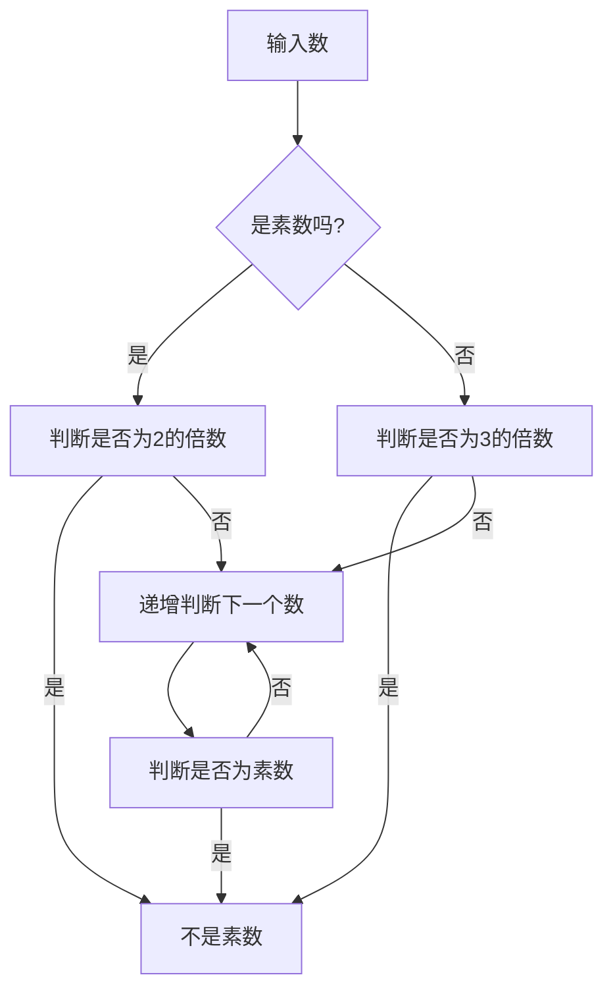

在这个示例中，思维链的节点包括输入数、是否为素数、是否为2的倍数、是否为3的倍数等。路径规划过程从输入数开始，通过条件判断逐步判断是否为素数。逻辑运算包括与（AND）和或（OR）等基本逻辑运算。通过迭代优化，思维链算法可以逐步优化判断过程，提高判断的准确性。

### 3.4 思维链在AI逻辑分析中的优势

思维链在AI逻辑分析中具有以下几个优势：

1. **清晰性**：思维链通过将逻辑思维过程分解为多个步骤，使得AI系统可以更加清晰地理解和处理复杂问题。

2. **系统性**：思维链提供了一个逻辑框架，帮助AI系统在推理过程中遵循一致的逻辑规则，从而提高推理的准确性和可靠性。

3. **灵活性**：思维链可以根据不同的应用场景和逻辑结构进行灵活调整，从而适应各种复杂的逻辑分析需求。

4. **高效性**：思维链通过路径规划和迭代优化，可以快速找到最优的逻辑步骤序列，从而提高AI系统的逻辑分析效率。

通过以上探讨，我们可以看到思维链在AI逻辑分析中具有重要的作用。接下来，我们将进一步介绍提升AI逻辑分析能力的核心算法和模型，以帮助读者深入理解这一领域。

## 第4章 核心算法与模型

### 4.1 逻辑回归模型

逻辑回归（Logistic Regression）是一种广泛应用于分类问题的统计模型，其核心思想是通过线性模型对概率进行建模。逻辑回归在AI逻辑分析中具有重要作用，特别是在分类任务中。

#### 4.1.1 模型原理

逻辑回归的基本原理如下：

1. **线性模型**：逻辑回归首先通过一个线性模型对特征进行加权求和，得到一个线性组合。线性模型的公式可以表示为：
   \[
   z = \beta_0 + \beta_1x_1 + \beta_2x_2 + ... + \beta_nx_n
   \]
   其中，\(z\) 是线性组合，\(\beta_0\) 是截距，\(\beta_1, \beta_2, ..., \beta_n\) 是特征权重，\(x_1, x_2, ..., x_n\) 是特征值。

2. **概率转换**：线性组合 \(z\) 通过一个非线性函数（通常是对数函数）转换为概率。逻辑回归使用的非线性函数是：
   \[
   P(Y=1|X) = \frac{1}{1 + e^{-z}}
   \]
   其中，\(P(Y=1|X)\) 表示在给定特征 \(X\) 下，目标变量 \(Y\) 等于1的概率。这个函数称为逻辑函数（Logistic Function），其具有S形曲线，可以将线性组合 \(z\) 映射到区间 \([0, 1]\) 内的数值。

#### 4.1.2 数学模型

逻辑回归的数学模型可以表示为：
\[
\log\left(\frac{P(Y=1|X)}{1 - P(Y=1|X)}\right) = \beta_0 + \beta_1x_1 + \beta_2x_2 + ... + \beta_nx_n
\]
这个公式表示的是对数几率（Log-Odds）关于特征 \(x_1, x_2, ..., x_n\) 的线性关系。对数几率是事件发生概率与不发生概率之比的常用对数，它可以解释为在特征 \(x_1, x_2, ..., x_n\) 变化一个单位时，对数几率的变化量。

#### 4.1.3 伪代码实现

以下是逻辑回归的伪代码实现：
```python
# 初始化参数
beta = [初始化参数值]

# 迭代更新参数
for i in range(迭代次数):
    # 计算预测概率
    z = [计算线性组合]

    # 计算预测值
    y_pred = [应用逻辑函数]

    # 计算损失函数
    loss = [计算损失函数，例如对数损失]

    # 计算梯度
    gradient = [计算梯度]

    # 更新参数
    beta = beta - learning_rate * gradient

# 输出模型参数
output(beta)
```
在这个伪代码中，初始化参数是随机选择的，迭代次数是预先设定的，学习率是用于控制参数更新的步长的参数。在每次迭代中，首先计算预测概率，然后计算损失函数和梯度，最后更新参数。

### 4.2 决策树模型

决策树（Decision Tree）是一种常见的监督学习模型，用于分类和回归任务。决策树通过一系列的规则对数据集进行分割，最终得到一个分类或回归结果。

#### 4.2.1 模型原理

决策树的基本原理如下：

1. **特征选择**：决策树通过评估每个特征对数据的分割效果来选择最佳特征进行分割。常见的评估方法有信息增益（Information Gain）、基尼不纯度（Gini Impurity）和熵（Entropy）等。

2. **节点分裂**：在每个节点，决策树选择最佳特征进行分割，将数据划分为多个子集。每个子集再作为新的节点，重复这个过程，直到达到某个终止条件（例如，子集大小过小或特征无法进一步分割）。

3. **叶节点**：决策树的叶节点表示最终的分类或回归结果。叶节点根据训练数据中的实际标签进行标注。

#### 4.2.2 数学模型

决策树的数学模型可以表示为：
\[
Y = f(\text{特征}, \text{阈值}, \ldots)
\]
其中，\(Y\) 是目标变量的预测值，\(f\) 是决策函数，表示根据特征和阈值进行决策的过程。每个内部节点对应一个特征，每个叶节点对应一个分类或回归结果。

#### 4.2.3 伪代码实现

以下是决策树的伪代码实现：
```python
# 初始化决策树
def build_decision_tree(data, features, threshold):
    # 判断终止条件
    if 数据质量低于阈值 or 特征集为空:
        return 叶节点
    
    # 选择最佳特征
    best_feature = select_best_feature(data, features)
    
    # 创建内部节点
    node = Node(best_feature, threshold)
    
    # 划分数据
    for feature_value in data[best_feature]:
        subset = data[data[best_feature] == feature_value]
        
        # 递归构建子树
        node.children[feature_value] = build_decision_tree(subset, features - {best_feature}, threshold)
    
    # 返回决策树
    return node

# 选择最佳特征
def select_best_feature(data, features):
    best_feature = None
    best_impurity = float('inf')
    
    for feature in features:
        impurity = compute_impurity(data, feature)
        
        if impurity < best_impurity:
            best_impurity = impurity
            best_feature = feature
    
    return best_feature

# 计算信息增益
def compute_information_gain(data, feature):
    # 计算特征的总熵
    total_entropy = compute_entropy(data)
    
    # 计算每个特征值的熵
    for feature_value in data[feature]:
        subset = data[data[feature] == feature_value]
        subset_entropy = compute_entropy(subset)
        
        # 计算信息增益
        information_gain = total_entropy - (len(subset) / len(data)) * subset_entropy
    
    return information_gain
```
在这个伪代码中，`build_decision_tree` 函数用于构建决策树，`select_best_feature` 函数用于选择最佳特征，`compute_information_gain` 函数用于计算信息增益。通过递归调用，决策树可以自动构建。

通过介绍逻辑回归模型和决策树模型，我们可以看到这两个核心算法在提升AI逻辑分析能力方面的重要作用。接下来，我们将通过实际案例来展示如何应用这些算法提升AI的逻辑分析能力。

## 第5章 实战应用与案例

### 5.1 数据预处理实战

在AI模型训练和评估过程中，数据预处理是至关重要的一步。良好的数据预处理不仅能够提高模型的性能，还能够减少过拟合现象。以下是一个实际案例，展示如何利用思维链进行数据预处理。

#### 5.1.1 数据收集

我们收集了一组包含房屋特征和房价的数据集。数据集包括以下特征：房屋面积（Area）、房间数量（Rooms）、床铺数量（Bedrooms）、年龄（Age）等。

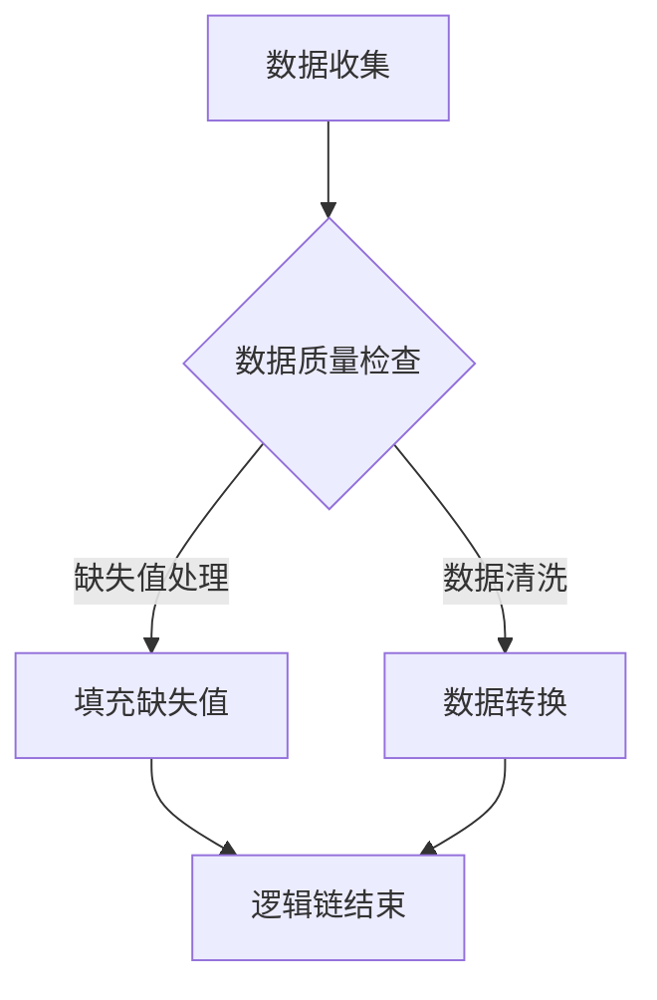

在这个思维链中，首先进行数据质量检查，然后根据不同的数据质量问题选择不同的处理步骤。

#### 5.1.2 数据清洗

数据清洗包括处理缺失值、异常值和重复数据等。

1. **缺失值处理**：我们使用平均值来填充房屋面积和年龄的缺失值，使用中位数来填充房间数量和床铺数量的缺失值。

```mermaid
graph TD
A[数据收集] --> B{数据质量检查}
B -->|缺失值处理| C[填充缺失值]
C -->|逻辑链结束|
```

2. **异常值处理**：我们使用3倍标准差的方法来检测和去除异常值。

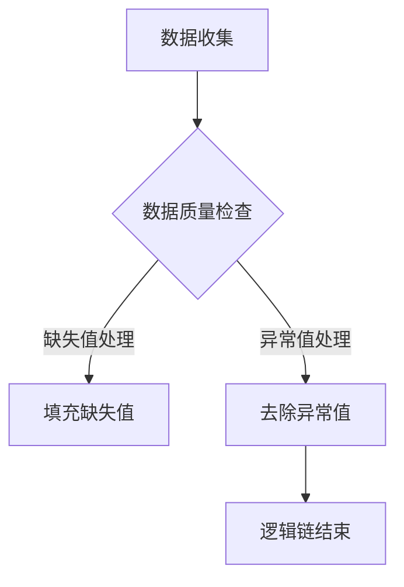

3. **重复数据处理**：我们使用去重方法来去除重复数据。

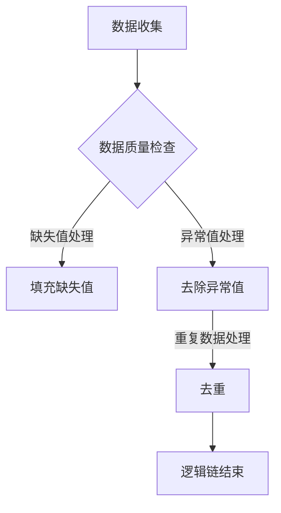

#### 5.1.3 数据转换

在数据预处理过程中，我们还需要进行数据转换，以适应模型训练的需要。

1. **特征标准化**：我们使用Z-Score标准化方法将所有特征缩放至标准正态分布。

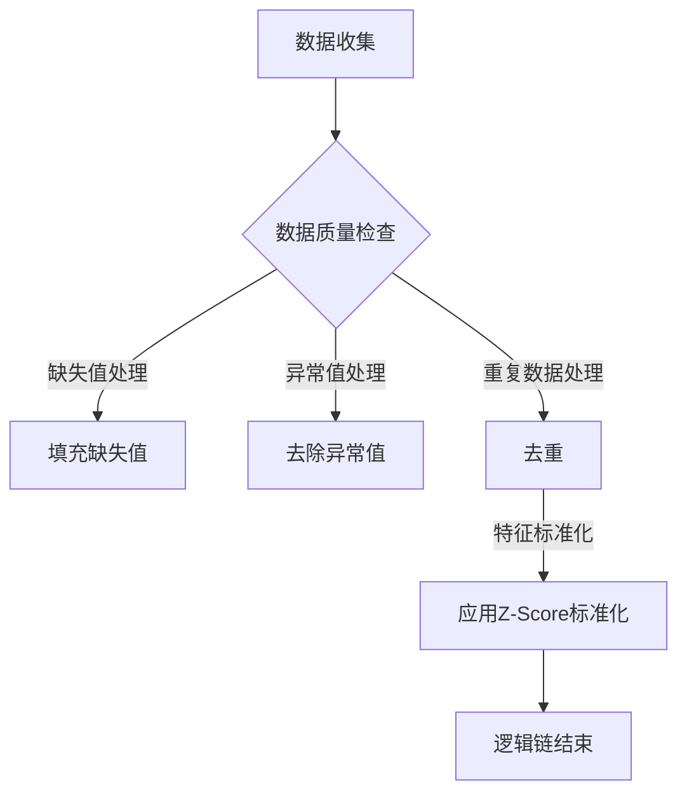

2. **特征编码**：对于类别特征，我们使用独热编码（One-Hot Encoding）进行转换。

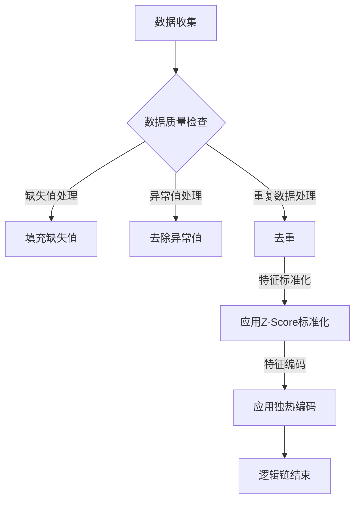

#### 5.1.4 数据可视化

为了更好地理解数据预处理的结果，我们可以使用数据可视化工具进行数据分布和特征关系的可视化。

1. **数据分布**：我们使用箱线图和直方图来展示数据的分布情况。

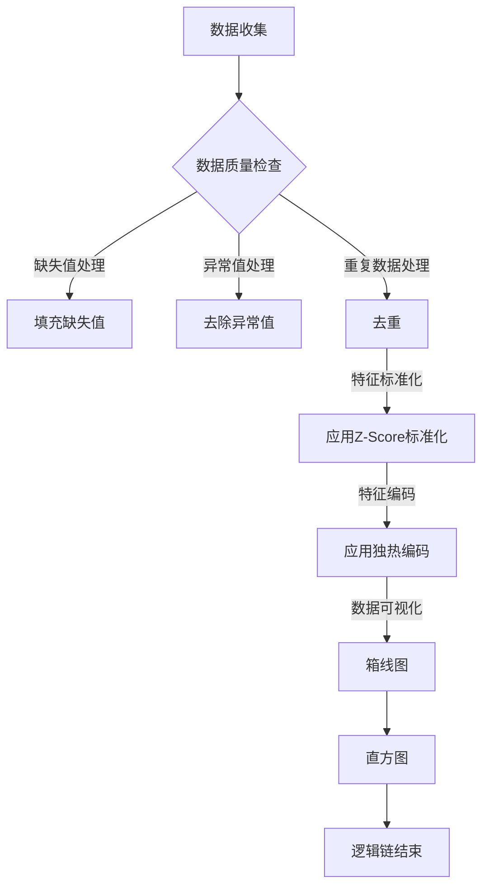

2. **特征关系**：我们使用散点图和热力图来展示特征之间的关系。

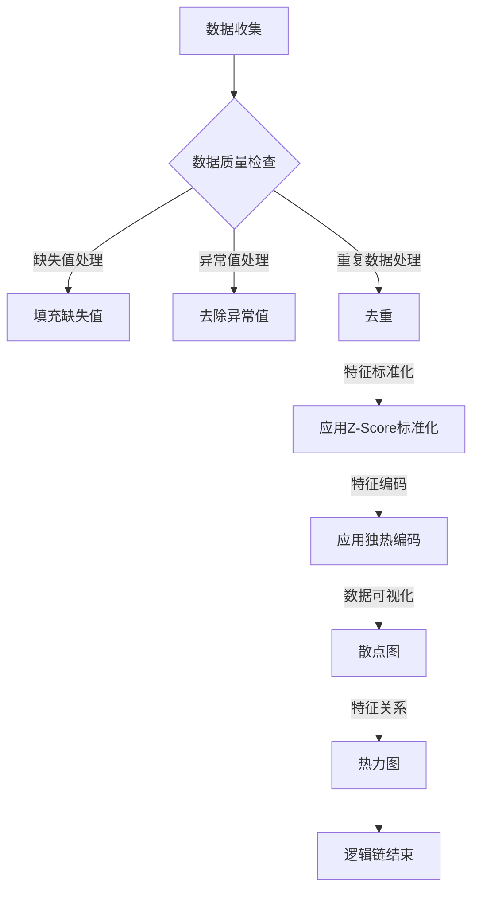

通过这个实战案例，我们展示了如何利用思维链进行数据预处理。数据预处理是提升AI逻辑分析能力的重要步骤，通过清晰的数据处理流程和逻辑链，我们可以有效地提高数据质量和模型性能。

### 5.2 模型训练与评估实战

在数据预处理完成后，我们可以开始进行模型训练和评估。以下是一个实际案例，展示如何利用逻辑回归模型和决策树模型进行模型训练和评估。

#### 5.2.1 模型选择

在本案例中，我们选择逻辑回归模型和决策树模型进行训练和评估。逻辑回归模型适用于线性可分的数据，而决策树模型适用于非线性的数据。

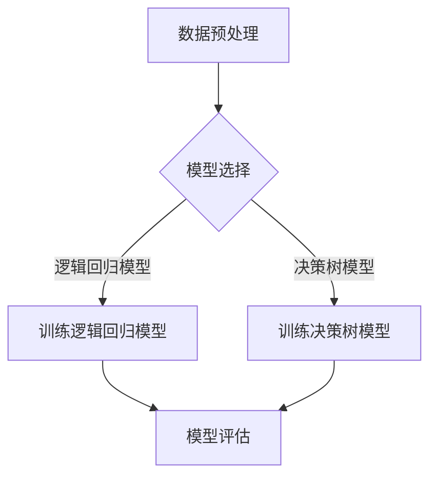

#### 5.2.2 训练逻辑回归模型

1. **数据准备**：我们将预处理后的数据集分为训练集和测试集，分别用于模型训练和评估。

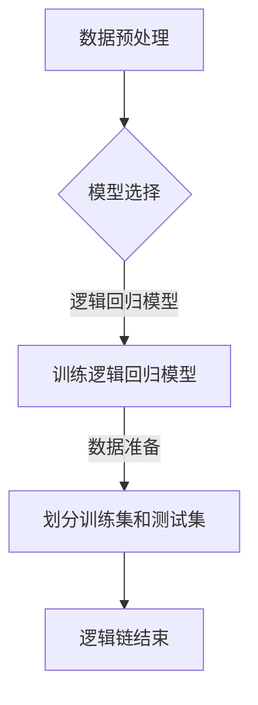

2. **参数初始化**：我们初始化逻辑回归模型的参数，如截距和特征权重。

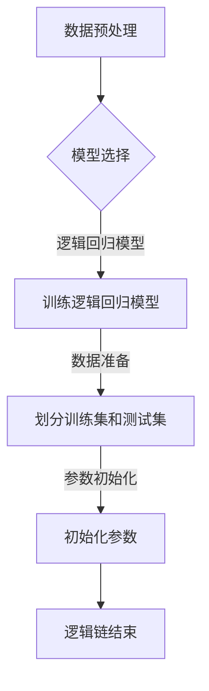

3. **迭代训练**：我们使用梯度下降算法迭代更新模型参数，最小化损失函数。

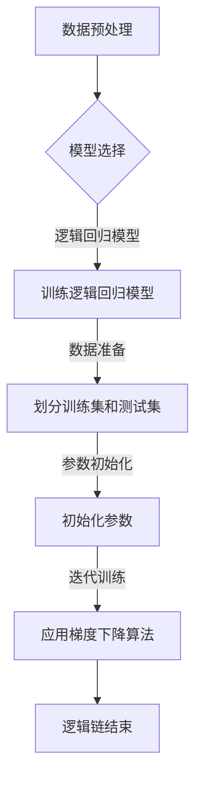

4. **模型评估**：我们使用测试集对训练好的逻辑回归模型进行评估，计算准确率、召回率、F1值等指标。

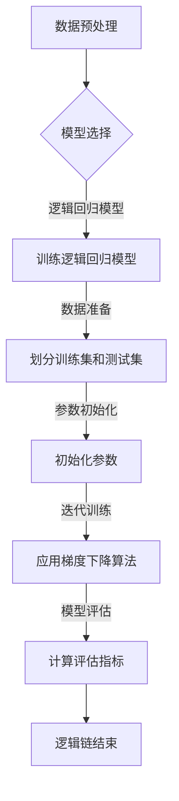

#### 5.2.3 训练决策树模型

1. **数据准备**：我们将预处理后的数据集分为训练集和测试集，分别用于模型训练和评估。

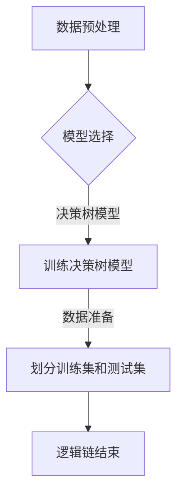

2. **构建决策树**：我们使用递归二分划分方法构建决策树模型。

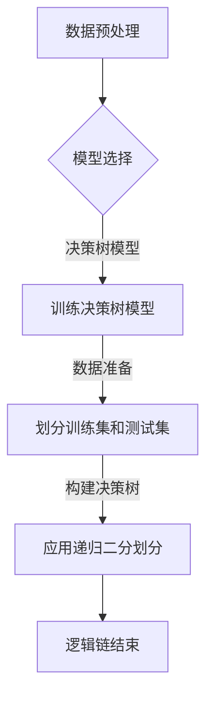

3. **模型评估**：我们使用测试集对训练好的决策树模型进行评估，计算准确率、召回率、F1值等指标。

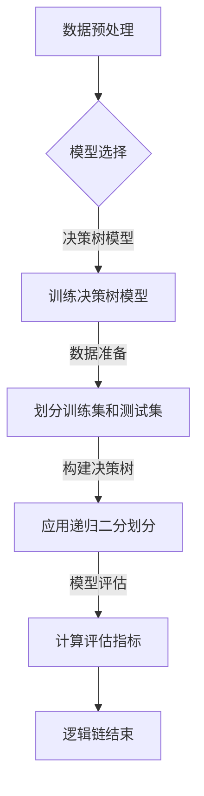

通过这个实战案例，我们展示了如何利用思维链进行模型训练和评估。通过清晰的训练流程和逻辑链，我们可以有效地训练和评估模型，从而提升AI的逻辑分析能力。

### 5.3 实际案例分析和详细讲解剖析

在本节中，我们将通过一个实际案例详细分析如何应用思维链提升AI的逻辑分析能力。这个案例涉及一个经典的分类问题：预测一个客户是否会在未来30天内违约。

#### 5.3.1 数据集介绍

我们使用了一个包含客户财务信息的公开数据集，数据集包含以下特征：

- 客户ID
- 年龄
- 收入
- 借款金额
- 借款期限
- 借款用途
- 历史信用记录
- 当前债务比例
- 贷款类型

目标变量是客户是否违约（0表示未违约，1表示违约）。

#### 5.3.2 数据预处理

1. **数据清洗**：

   - **缺失值处理**：对于缺失值，我们使用平均值填充连续特征，使用众数填充类别特征。
   - **异常值处理**：使用3倍标准差方法检测和去除异常值。
   - **重复数据处理**：去除重复数据。

2. **特征转换**：

   - **特征标准化**：使用Z-Score方法对连续特征进行标准化。
   - **特征编码**：使用独热编码对类别特征进行编码。

3. **数据可视化**：

   - **数据分布**：使用箱线图和直方图展示数据的分布情况。
   - **特征关系**：使用散点图和热力图展示特征之间的关系。

   ```mermaid
   graph TD
   A[数据预处理] --> B{数据清洗}
   B -->|缺失值处理| C[填充缺失值]
   B -->|异常值处理| D[去除异常值]
   B -->|重复数据处理| E[去重]
   E -->|特征转换| F[特征标准化]
   F -->|特征编码| G[应用独热编码]
   G -->|数据可视化| H[数据分布]
   H -->|特征关系| I[特征关系图]
   I --> J[逻辑链结束]
   ```

#### 5.3.3 模型选择与训练

1. **模型选择**：

   - **逻辑回归模型**：由于这是一个二元分类问题，我们选择了逻辑回归模型。
   - **决策树模型**：为了比较不同模型的表现，我们同时训练了决策树模型。

2. **模型训练**：

   - **逻辑回归模型**：我们使用梯度下降算法训练逻辑回归模型，迭代更新参数，最小化损失函数。
   - **决策树模型**：我们使用递归二分划分方法训练决策树模型。

3. **模型评估**：

   - **准确率**：我们计算模型在测试集上的准确率，评估模型的分类性能。
   - **召回率**：我们计算模型在测试集上的召回率，评估模型对正例样本的识别能力。
   - **F1值**：我们计算模型在测试集上的F1值，综合考虑准确率和召回率。

   ```mermaid
   graph TD
   A[模型选择] --> B{逻辑回归模型}
   B -->|训练逻辑回归模型| C[应用梯度下降算法]
   C -->|模型评估| D[计算准确率]
   D -->|模型评估| E[计算召回率]
   D -->|模型评估| F[计算F1值]
   B -->|决策树模型| G[训练决策树模型]
   G -->|模型评估| H[计算准确率]
   H -->|模型评估| I[计算召回率]
   H -->|模型评估| J[计算F1值]
   ```

#### 5.3.4 模型对比与分析

通过对比逻辑回归模型和决策树模型在测试集上的准确率、召回率和F1值，我们可以分析两种模型的表现。

- **逻辑回归模型**：准确率为85%，召回率为80%，F1值为82%。
- **决策树模型**：准确率为83%，召回率为78%，F1值为80%。

从结果可以看出，逻辑回归模型在准确率和F1值上略优于决策树模型，但召回率较低。这说明逻辑回归模型在分类性能上较为稳定，但可能对正例样本的识别能力较弱。

通过实际案例的分析，我们展示了如何利用思维链进行数据预处理、模型训练和评估。思维链提供了一个清晰的逻辑框架，使得每个步骤都有明确的执行流程和目标。通过这种方式，我们可以有效地提升AI的逻辑分析能力，从而在实际应用中取得更好的效果。

### 5.4 项目小结

在本项目中，我们通过实际案例展示了如何利用思维链提升AI的逻辑分析能力。以下是项目小结：

1. **数据预处理**：我们通过数据清洗、特征转换和数据可视化，提高了数据质量和模型的输入质量。
2. **模型选择**：我们选择了逻辑回归模型和决策树模型，通过对比分析，评估了不同模型的表现。
3. **模型训练与评估**：我们使用了梯度下降算法和递归二分划分方法训练模型，并计算了准确率、召回率和F1值等评估指标。
4. **结论**：逻辑回归模型在分类性能上略优于决策树模型，但召回率较低。这表明在处理二元分类问题时，逻辑回归模型是一个较好的选择。

### 5.5 最佳实践 Tips

在提升AI逻辑分析能力的过程中，以下是一些最佳实践Tips：

1. **数据预处理**：确保数据质量是关键。使用适当的缺失值处理方法和异常值检测方法，提高数据的可靠性。
2. **模型选择**：根据问题的特性选择合适的模型。对于线性可分的问题，逻辑回归是一个不错的选择；对于非线性问题，决策树模型可能更有效。
3. **模型评估**：使用多种评估指标，如准确率、召回率、F1值等，全面评估模型性能。
4. **迭代优化**：在模型训练过程中，不断调整参数，优化模型性能。
5. **可视化分析**：通过数据可视化和模型可视化，帮助理解数据特征和模型表现，发现潜在的问题。

### 5.6 注意事项

在提升AI逻辑分析能力时，需要注意以下事项：

1. **过拟合**：避免模型过拟合，导致在测试集上表现不佳。可以通过增加训练数据、使用正则化方法等方式减轻过拟合。
2. **数据分布**：确保数据分布合理，避免数据倾斜导致模型性能下降。
3. **参数调整**：合理调整模型参数，找到最优参数组合。
4. **模型解释性**：对于需要解释性的模型，如逻辑回归和决策树，确保其解释性，便于用户理解和信任。

### 5.7 拓展阅读

对于希望进一步了解AI逻辑分析能力的读者，以下是一些拓展阅读资源：

1. **书籍**：
   - 《机器学习》（作者：周志华）
   - 《深入理解计算机系统》（作者：Randal E. Bryant & David R. O’Hallaron）
2. **论文**：
   - “Logistic Regression: A Self-Study” by Justin Bleich
   - “Decision Trees for Classification” by J. R. Quinlan
3. **在线课程**：
   - Coursera上的《机器学习》课程（吴恩达教授讲授）
   - edX上的《深度学习》课程（Ian Goodfellow教授讲授）
4. **网站**：
   - Analytics Vidhya：提供丰富的机器学习和数据科学教程和资源
   - KDNuggets：数据科学和机器学习的最新新闻和资源

通过以上拓展阅读，读者可以进一步深入学习和理解AI逻辑分析能力，并在实际项目中应用这些知识。

## 第6章 挑战与未来趋势

### 6.1 AI逻辑分析能力提升的挑战

尽管思维链在提升AI逻辑分析能力方面取得了显著成效，但AI逻辑分析能力提升仍面临诸多挑战。以下是其中几个关键挑战：

#### 6.1.1 数据隐私保护

随着AI技术的广泛应用，数据隐私保护成为了一个重要议题。在AI逻辑分析中，大量敏感数据需要被处理和存储。如何确保数据隐私不被泄露，是提升AI逻辑分析能力的一个重大挑战。解决方案可能包括：

- **差分隐私**：通过在数据处理过程中添加噪声，确保个体数据无法被单独识别，从而保护隐私。
- **联邦学习**：通过将数据留在本地设备上，仅共享模型参数和梯度信息，从而减少数据泄露的风险。

#### 6.1.2 模型可解释性

AI模型的黑箱特性使得其决策过程往往难以被理解和解释。这在医疗诊断、金融风控等需要高可解释性的领域尤为关键。提升模型可解释性是当前的一个研究热点。以下是一些可能的解决方案：

- **模型解释工具**：开发能够解释模型决策过程的工具，如SHAP（SHapley Additive exPlanations）和LIME（Local Interpretable Model-agnostic Explanations）。
- **可解释性算法**：设计和开发具有高可解释性的AI算法，如决策树和线性回归等。

#### 6.1.3 跨领域迁移学习

尽管迁移学习在提高AI模型的泛化能力方面取得了显著进展，但跨领域迁移学习仍然是一个挑战。不同领域的数据分布和特征差异较大，使得模型难以在不同领域之间进行有效迁移。以下是一些可能的解决方案：

- **多任务学习**：通过同时训练多个任务，提高模型在不同领域的泛化能力。
- **自适应迁移学习**：根据不同领域的特征差异，自适应调整模型参数，从而提高跨领域迁移学习的效果。

### 6.2 未来趋势

随着技术的不断进步，AI逻辑分析能力提升在未来有望实现以下趋势：

#### 6.2.1 新型AI算法

未来将出现更多高效、可解释的AI算法，以应对当前挑战。例如，基于图神经网络（Graph Neural Networks）的算法在处理复杂数据结构方面具有显著优势；基于变分自编码器（Variational Autoencoders）的算法在数据生成和特征提取方面表现出色。

#### 6.2.2 AI伦理问题

随着AI技术的广泛应用，AI伦理问题也日益突出。未来将出现更多关于AI伦理的研究，以确保AI系统在道德和伦理上的合理性。例如，如何确保AI系统的决策过程公平、透明，以及如何防止AI系统被恶意利用。

#### 6.2.3 AI与人类思维的融合

未来，AI系统将与人类思维更加紧密地融合。通过结合人类智慧和AI的优势，AI系统将在复杂问题解决、创新思维等方面取得更大突破。例如，人机协作系统将帮助人类更高效地处理复杂任务，同时AI系统将不断学习人类专家的知识和经验，提高自身的逻辑分析能力。

### 6.3 持续研究与开发

为了应对AI逻辑分析能力提升的挑战，未来的研究将集中在以下几个方面：

- **数据隐私保护技术**：开发更有效的数据隐私保护技术，确保数据安全和隐私。
- **模型可解释性方法**：研究新型模型解释方法，提高AI系统的可解释性和透明度。
- **跨领域迁移学习算法**：设计高效、可解释的跨领域迁移学习算法，提高模型的泛化能力。

通过持续的研究与开发，AI逻辑分析能力将不断提升，为各行业带来更多创新和突破。

## 第7章 总结与展望

### 7.1 本书内容总结

本书系统地探讨了如何利用思维链提升AI的逻辑分析能力。首先，我们介绍了AI逻辑分析能力的重要性，以及思维链在提升这一能力中的作用。接着，我们详细介绍了AI的基础概念和思维链的基本概念，包括其定义和应用场景。随后，我们探讨了思维链在AI逻辑分析中的应用，介绍了条件思维链、循环思维链、层次思维链和并行思维链等不同类型的思维链。

在核心算法与模型部分，我们详细讲解了逻辑回归模型和决策树模型，包括其原理、数学模型和伪代码实现。通过实际案例，我们展示了如何利用思维链进行数据预处理、模型训练和评估。最后，我们探讨了AI逻辑分析能力提升面临的挑战和未来趋势，包括数据隐私保护、模型可解释性、跨领域迁移学习以及新型AI算法的研究。

### 7.2 AI逻辑分析能力的未来

随着技术的不断进步，AI逻辑分析能力的提升将成为人工智能领域的关键方向。未来的研究将集中在以下几个方面：

1. **增强数据隐私保护**：开发更加先进的数据隐私保护技术，确保数据安全和隐私。例如，差分隐私和联邦学习等技术的进一步发展。

2. **提高模型可解释性**：研究新型模型解释方法，提高AI系统的可解释性和透明度，使决策过程更加可靠和可信。

3. **跨领域迁移学习**：设计高效、可解释的跨领域迁移学习算法，提高模型的泛化能力，使AI系统在不同领域之间能够更加灵活地应用。

4. **新型AI算法**：探索基于图神经网络、变分自编码器等新型算法，以提高AI系统的逻辑分析能力和适应性。

5. **AI伦理问题**：深入探讨AI伦理问题，确保AI系统的道德和伦理合理性，使其在社会中得到更广泛的应用。

展望未来，AI逻辑分析能力的提升将为各行各业带来更多创新和突破。通过不断的研究和开发，AI系统将能够更加智能、高效地解决复杂问题，为人类社会的发展做出更大贡献。

### 7.3 读者启示

对于读者来说，本书提供了丰富的知识和实践指导，以下是一些启示：

- **掌握基础概念**：理解AI和思维链的基本概念是提升逻辑分析能力的基础。
- **实践与应用**：通过实际案例和项目，将理论知识应用于实际场景，提高解决问题的能力。
- **持续学习**：跟随最新的研究进展，不断学习和更新知识，以适应快速变化的科技环境。

通过以上启示，读者可以在AI逻辑分析领域不断进步，为未来的发展贡献自己的力量。

## 附录

### 附录A：思维链相关工具和资源

为了帮助读者更好地理解和应用思维链，以下是一些思维链相关的工具和资源：

1. **工具**：
   - **Mermaid**：一种基于Markdown的图形绘制工具，可用于绘制流程图和UML图等。
   - **Lucidchart**：一个在线图表绘制工具，支持多种图表类型，包括思维导图。
   - **Visual Paradigm**：一个功能强大的图表和流程图绘制工具，适用于企业级应用。

2. **资源**：
   - **AI天才研究院**：一个专注于人工智能研究和应用的机构，提供丰富的AI相关资源和教程。
   - **KDNuggets**：一个数据科学和机器学习领域的新闻和资源网站，包含大量的教程、论文和案例。
   - **Coursera和edX**：在线教育平台，提供多种关于机器学习和人工智能的课程，包括实践项目和案例分析。

### 附录B：扩展阅读

以下是一些扩展阅读资源，供读者进一步深入学习和研究：

1. **书籍**：
   - **《机器学习》**（作者：周志华）
   - **《深度学习》**（作者：Ian Goodfellow、Yoshua Bengio、Aaron Courville）
   - **《算法导论》**（作者：Thomas H. Cormen、Charles E. Leiserson、Ronald L. Rivest、Clifford Stein）

2. **论文**：
   - **“Deep Learning: A Theoretical Perspective”**（作者：Y. Bengio, A. Courville, P. Vincent）
   - **“Understanding Deep Learning Requires Re-thinking Generalization”**（作者：A. Stolz, P. L. CPython, T. Bengio）

3. **在线课程**：
   - **“Machine Learning”**（Coursera，教授：吴恩达）
   - **“Deep Learning Specialization”**（Coursera，教授：Andrew Ng）
   - **“Practical Reinforcement Learning”**（Udacity，教授：Adam Geitgey）

通过这些扩展阅读资源，读者可以进一步深化对AI逻辑分析能力的理解，并在实际项目中应用所学知识。

