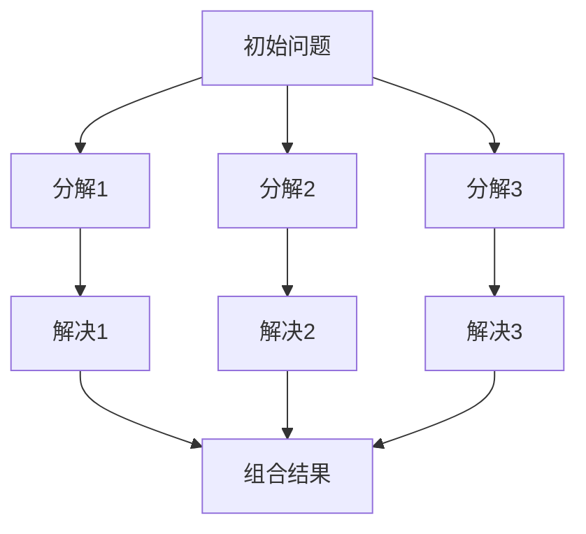
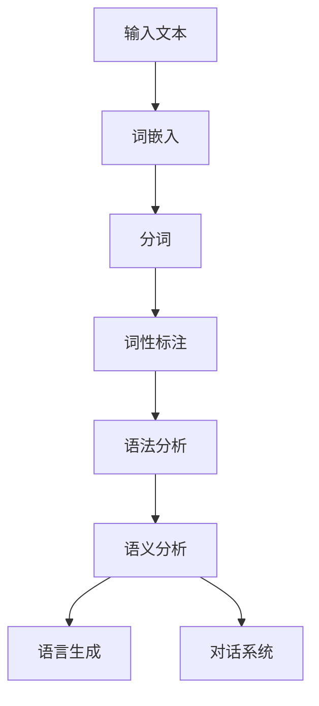

                 


### 文章标题

《利用思维链提升AI的逻辑推理与分析能力》

### 文章关键词

思维链，AI，逻辑推理，分析能力，人工智能，算法，数据分析

### 文章摘要

本文深入探讨了思维链在人工智能（AI）领域中的应用，特别是如何提升AI的逻辑推理与分析能力。思维链作为一种基于人类思维模式的逻辑结构，通过将复杂问题分解为多个简单部分，并逐步推理，能够有效提升AI处理复杂任务的能力。本文将详细介绍思维链的基本原理、应用场景，以及如何在AI开发中利用思维链提升逻辑推理与分析能力，并通过实际案例进行分析与验证。

## 目录

1. 引言
2. 思维链的基本原理
3. AI与逻辑推理
4. 思维链在AI中的应用
5. 思维链在数据预处理中的应用
6. 思维链在特征提取中的应用
7. 思维链在模型训练中的应用
8. 思维链在推理中的应用
9. 思维链在决策分析中的应用
10. 思维链在预测分析中的应用
11. 思维链在数据挖掘与分析中的应用
12. 思维链在自然语言处理中的应用
13. 思维链在计算机视觉中的应用
14. 思维链在AI应用中的综合应用
15. 思维链与AI的发展前景
16. 结论

## 引言

### AI的发展现状与挑战

人工智能（AI）作为计算机科学的一个分支，近年来取得了飞速的发展。从早期的专家系统到现代的深度学习，AI技术在图像识别、自然语言处理、自动驾驶等领域都取得了显著的成果。然而，随着AI应用的日益广泛，其逻辑推理与分析能力的提升成为当前研究的热点。

逻辑推理与分析能力是AI系统解决复杂问题的重要基础。在现实世界中，许多问题都不是简单的、线性的，而是需要通过复杂的逻辑关系和数据分析来进行处理。例如，自动驾驶系统需要分析道路环境、识别交通标志、预测其他车辆的行为；智能客服系统需要理解用户的意图、提供合适的回答。这些任务都需要AI具备强大的逻辑推理与分析能力。

然而，传统的AI方法在处理复杂问题时存在一定的局限性。深度学习模型虽然能够处理大量数据，但缺乏解释性；规则系统则过于依赖人类的先验知识，难以应对复杂多变的环境。因此，如何提升AI的逻辑推理与分析能力，成为当前研究的一个重要方向。

### 思维链的概念与作用

思维链（Thinking Chain）是一种基于人类思维模式的逻辑结构，通过将复杂问题分解为多个简单部分，并逐步推理，以达到解决问题的目的。思维链的核心思想是将问题分解为子问题，然后针对每个子问题进行独立思考，最后将子问题的解组合起来，形成对整体问题的解决方案。

思维链具有以下几个特点：

1. **层次化**：思维链将问题分解为多个层次，从顶层到底层，逐步细化，直到每个子问题都可以被简单解决。

2. **模块化**：思维链中的每个子问题都是独立的模块，可以单独处理，这有利于代码的重用和优化。

3. **可解释性**：思维链的每一步都是基于逻辑推理的，因此其决策过程是可解释的，有助于提高AI系统的可信度。

4. **适应性**：思维链可以根据问题的复杂度和环境的变化进行自适应调整，从而提高解决问题的效率。

### 本文目的

本文旨在探讨思维链在AI中的应用，特别是如何提升AI的逻辑推理与分析能力。通过详细介绍思维链的基本原理、应用场景，以及在实际开发中的具体实现方法，本文希望能够为AI开发者提供一种新的工具，以应对复杂的逻辑推理与分析任务。

## 思维链的基本原理

### 思维链的定义

思维链是一种基于人类思维模式的逻辑结构，通过将复杂问题分解为多个简单部分，并逐步推理，以达到解决问题的目的。思维链的核心思想是将问题分解为子问题，然后针对每个子问题进行独立思考，最后将子问题的解组合起来，形成对整体问题的解决方案。

### 思维链的组成

思维链由三个主要部分组成：节点（Node）、边（Edge）和权重（Weight）。

- **节点**：节点是思维链中的基本单位，表示一个子问题或一个决策点。
- **边**：边表示节点之间的关系，通常用箭头表示。边可以是单向的，也可以是双向的，取决于节点之间的逻辑关系。
- **权重**：权重表示节点之间的相对重要性，通常用数值表示。权重越大，表示该节点对整体问题的影响越大。

### 思维链的工作原理

思维链的工作原理可以概括为以下几个步骤：

1. **初始化**：首先，根据问题的定义，初始化思维链的节点和边。每个节点都表示一个子问题或一个决策点。

2. **分解问题**：将复杂问题分解为多个简单部分，并为每个部分创建节点。

3. **建立关系**：根据问题之间的逻辑关系，建立节点之间的边。边的方向和权重取决于问题的依赖关系和重要性。

4. **逐步推理**：从初始节点开始，沿着思维链逐步推理，直到达到问题的最终解。

5. **组合结果**：将每个子问题的解组合起来，形成对整体问题的解决方案。

### 思维链的流程图

使用Mermaid语言，我们可以绘制出思维链的流程图，如下所示：



在这个流程图中，A表示初始问题，B、C、D表示分解后的子问题，E、F、G表示解决子问题的步骤，H表示组合结果。

### 思维链的优势

思维链具有以下几个优势：

1. **层次化**：思维链将问题分解为多个层次，从顶层到底层，逐步细化，有助于理解复杂问题。

2. **模块化**：思维链中的每个子问题都是独立的模块，可以单独处理，这有利于代码的重用和优化。

3. **可解释性**：思维链的每一步都是基于逻辑推理的，因此其决策过程是可解释的，有助于提高AI系统的可信度。

4. **适应性**：思维链可以根据问题的复杂度和环境的变化进行自适应调整，从而提高解决问题的效率。

### 思维链的应用场景

思维链可以应用于各种需要逻辑推理与分析的领域，包括：

1. **自然语言处理**：思维链可以帮助AI系统理解复杂的文本信息，进行语义分析和文本生成。

2. **计算机视觉**：思维链可以帮助AI系统识别图像中的物体和场景，进行图像分割和目标检测。

3. **决策分析**：思维链可以帮助企业在复杂的市场环境中做出最优决策，进行风险分析和策略规划。

4. **数据挖掘**：思维链可以帮助从大量数据中提取有价值的信息，进行聚类分析和关联规则挖掘。

### 思维链的局限

尽管思维链具有许多优势，但它也存在一些局限：

1. **计算复杂度**：随着问题规模的增加，思维链的计算复杂度也会显著增加，可能导致计算效率下降。

2. **数据依赖**：思维链的性能很大程度上依赖于输入数据的质量和完整性。如果数据存在噪声或缺失，思维链的推理结果可能会受到影响。

3. **先验知识**：思维链在处理未知问题时，需要依赖先验知识来指导问题的分解和推理。如果缺乏足够的先验知识，思维链可能无法有效工作。

### 总结

思维链是一种基于人类思维模式的逻辑结构，通过将复杂问题分解为多个简单部分，并逐步推理，以达到解决问题的目的。它具有层次化、模块化、可解释性和适应性等优势，可以应用于各种需要逻辑推理与分析的领域。然而，它也存在计算复杂度、数据依赖和先验知识等局限。在接下来的章节中，我们将进一步探讨思维链在AI中的应用，以及如何利用思维链提升AI的逻辑推理与分析能力。

## AI与逻辑推理

### 逻辑推理的基本概念

逻辑推理是一种从已知事实推导出新结论的过程，它是人类思维的核心组成部分。在人工智能领域，逻辑推理被广泛用于解决各种复杂问题，如图像识别、自然语言处理、决策分析等。

#### 逻辑推理的类型

1. **演绎推理**：从一般原理推导出具体结论的推理过程。例如，如果所有的猫都会爬树，而汤姆是一只猫，那么可以推断出汤姆会爬树。

2. **归纳推理**：从具体实例中归纳出一般规律的推理过程。例如，观察多个苹果从树上掉下来，可以归纳出地球上的所有物体都受到重力的作用。

3. **类比推理**：通过比较两个相似情境的结论，推测另一个情境的可能结论。例如，如果知道铅笔掉在地上通常不会被损坏，那么可以推测钢笔掉在地上也不会被损坏。

### 逻辑推理在AI中的应用

逻辑推理在人工智能中的应用非常广泛，它不仅可以帮助AI系统理解复杂的问题，还可以提高其决策能力和可靠性。

#### 图像识别

在计算机视觉领域，逻辑推理被用于图像识别和物体检测。例如，卷积神经网络（CNN）通过多层卷积和池化操作，提取图像中的特征，然后利用逻辑推理来判断图像中的物体类别。

#### 自然语言处理

在自然语言处理（NLP）领域，逻辑推理被用于语义分析、文本生成和对话系统。例如，在语义分析中，逻辑推理可以帮助AI系统理解文本中的逻辑关系，从而更好地理解用户的意图。

#### 决策分析

在决策分析领域，逻辑推理可以帮助企业或组织在复杂的市场环境中做出最优决策。例如，通过逻辑推理，AI系统可以分析市场数据，预测未来的趋势，并提出相应的策略。

#### 数据挖掘

在数据挖掘领域，逻辑推理被用于特征提取、关联规则挖掘和聚类分析。例如，在聚类分析中，逻辑推理可以帮助AI系统将数据分为不同的类别，从而发现数据中的隐藏模式。

### 逻辑推理的挑战

尽管逻辑推理在AI中具有广泛的应用，但它也面临一些挑战：

1. **复杂性问题**：许多实际问题非常复杂，无法简单地通过逻辑推理来解决。

2. **不确定性问题**：现实世界中的问题通常存在不确定性，如何处理这种不确定性是逻辑推理的一大挑战。

3. **解释性问题**：逻辑推理的决策过程通常是黑箱的，难以解释。如何提高逻辑推理的解释性是一个重要的问题。

4. **效率问题**：随着问题规模的增加，逻辑推理的计算复杂度也会显著增加，如何提高效率是一个重要的问题。

### 思维链与逻辑推理的关系

思维链与逻辑推理有着密切的联系。思维链通过将复杂问题分解为多个简单部分，并逐步推理，本质上是一种逻辑推理过程。在AI中，思维链可以帮助AI系统更好地处理复杂问题，提高逻辑推理的能力。

#### 思维链在AI中的应用

1. **复杂问题分解**：思维链可以将复杂问题分解为多个简单部分，从而降低问题的复杂度，使逻辑推理更加有效。

2. **层次化推理**：思维链通过层次化结构，可以更好地处理问题的层次关系，从而提高推理的准确性。

3. **模块化设计**：思维链的模块化设计使得AI系统可以更方便地重用和优化逻辑推理模块。

4. **可解释性提升**：思维链的每一步都是基于逻辑推理的，因此其决策过程是可解释的，有助于提高AI系统的可信度。

### 思维链的优势

1. **层次化**：思维链可以将复杂问题分解为多个层次，从顶层到底层逐步推理，有助于理解复杂问题。

2. **模块化**：思维链中的每个子问题都是独立的模块，可以单独处理，这有利于代码的重用和优化。

3. **可解释性**：思维链的每一步都是基于逻辑推理的，因此其决策过程是可解释的，有助于提高AI系统的可信度。

4. **适应性**：思维链可以根据问题的复杂度和环境的变化进行自适应调整，从而提高解决问题的效率。

### 思维链的局限

1. **计算复杂度**：随着问题规模的增加，思维链的计算复杂度也会显著增加，可能导致计算效率下降。

2. **数据依赖**：思维链的性能很大程度上依赖于输入数据的质量和完整性。如果数据存在噪声或缺失，思维链的推理结果可能会受到影响。

3. **先验知识**：思维链在处理未知问题时，需要依赖先验知识来指导问题的分解和推理。如果缺乏足够的先验知识，思维链可能无法有效工作。

### 总结

逻辑推理是人工智能领域的重要基础，通过将复杂问题分解为多个简单部分，并逐步推理，可以有效地解决各种复杂问题。思维链作为一种基于人类思维模式的逻辑结构，通过层次化、模块化、可解释性和适应性等优势，可以显著提升AI的逻辑推理能力。在接下来的章节中，我们将进一步探讨思维链在AI中的应用，以及如何利用思维链提升AI的逻辑推理与分析能力。

## 思维链在AI中的应用

### 数据预处理

数据预处理是AI模型训练过程中至关重要的一步。思维链在数据预处理中的应用主要体现在以下几个方面：

1. **数据清洗**：思维链可以帮助识别并处理数据中的噪声和异常值。通过将数据问题分解为多个子问题，例如缺失值填充、异常值检测和去除，思维链可以有效地提高数据的质量。

2. **数据归一化**：思维链可以帮助将不同量纲的数据归一化到相同的范围内。例如，通过层次化的思维链，可以分别对数据进行特征缩放、零均值归一化等处理。

3. **数据转换**：思维链可以帮助将非结构化数据转换为结构化数据。例如，通过将文本数据转换为词向量，图像数据转换为特征向量，思维链可以有效地提高数据的可用性。

### 特征提取

特征提取是数据预处理的重要环节，它有助于提取数据中的关键信息，提高模型训练的效果。思维链在特征提取中的应用主要体现在以下几个方面：

1. **特征选择**：思维链可以帮助识别并选择对模型训练最有影响力的特征。通过将特征选择问题分解为多个子问题，例如特征重要性评估、特征交互分析等，思维链可以有效地提高特征选择的质量。

2. **特征变换**：思维链可以帮助将原始特征转换为更适合模型训练的特征。例如，通过将数值特征转换为二进制特征、将文本特征转换为词嵌入等，思维链可以有效地提高特征的丰富度和表达能力。

3. **特征工程**：思维链可以帮助创建新的特征，以增强模型对数据的表达能力。例如，通过将原始特征组合成新的特征、将时序特征转换为统计特征等，思维链可以有效地提高特征的表达能力。

### 模型训练

模型训练是AI应用的核心步骤，思维链在模型训练中的应用主要体现在以下几个方面：

1. **模型初始化**：思维链可以帮助初始化模型参数，以提高模型训练的效率。例如，通过将模型参数初始化问题分解为多个子问题，例如参数优化、随机初始化等，思维链可以有效地提高模型初始化的质量。

2. **优化算法**：思维链可以帮助选择并优化模型训练过程中的优化算法。例如，通过将优化算法问题分解为多个子问题，例如梯度下降、动量优化等，思维链可以有效地提高优化算法的性能。

3. **模型调整**：思维链可以帮助根据训练数据调整模型结构，以提高模型训练的效果。例如，通过将模型调整问题分解为多个子问题，例如网络结构优化、超参数调整等，思维链可以有效地提高模型调整的准确性。

### 推理

推理是AI模型在未知数据上的应用，思维链在推理中的应用主要体现在以下几个方面：

1. **推理策略**：思维链可以帮助设计并优化推理策略，以提高推理的效率和准确性。例如，通过将推理策略问题分解为多个子问题，例如推理路径选择、推理规则优化等，思维链可以有效地提高推理策略的质量。

2. **推理优化**：思维链可以帮助优化推理过程，以提高推理的速度和准确性。例如，通过将推理优化问题分解为多个子问题，例如推理树剪枝、推理并行化等，思维链可以有效地提高推理的效率。

3. **推理解释**：思维链可以帮助解释推理过程，以提高推理的可解释性。例如，通过将推理解释问题分解为多个子问题，例如推理路径可视化、推理规则解释等，思维链可以有效地提高推理的解释性。

### 决策分析

决策分析是AI在商业和管理领域的重要应用，思维链在决策分析中的应用主要体现在以下几个方面：

1. **决策树构建**：思维链可以帮助构建决策树，以实现自动化的决策过程。例如，通过将决策树构建问题分解为多个子问题，例如节点划分、规则生成等，思维链可以有效地提高决策树的质量。

2. **贝叶斯网络**：思维链可以帮助构建贝叶斯网络，以实现概率推理和决策分析。例如，通过将贝叶斯网络构建问题分解为多个子问题，例如节点定义、概率分布计算等，思维链可以有效地提高贝叶斯网络的质量。

3. **决策优化**：思维链可以帮助优化决策过程，以提高决策的效率和准确性。例如，通过将决策优化问题分解为多个子问题，例如目标函数优化、约束条件处理等，思维链可以有效地提高决策优化的效果。

### 预测分析

预测分析是AI在数据分析和商业预测中的重要应用，思维链在预测分析中的应用主要体现在以下几个方面：

1. **时间序列分析**：思维链可以帮助进行时间序列分析，以预测未来的趋势。例如，通过将时间序列分析问题分解为多个子问题，例如趋势分析、季节性分析等，思维链可以有效地提高时间序列分析的质量。

2. **聚类分析**：思维链可以帮助进行聚类分析，以发现数据中的潜在模式。例如，通过将聚类分析问题分解为多个子问题，例如簇数确定、聚类算法选择等，思维链可以有效地提高聚类分析的质量。

3. **回归分析**：思维链可以帮助进行回归分析，以预测未来的数值。例如，通过将回归分析问题分解为多个子问题，例如变量选择、模型选择等，思维链可以有效地提高回归分析的质量。

### 数据挖掘

数据挖掘是AI在数据分析和信息提取中的重要应用，思维链在数据挖掘中的应用主要体现在以下几个方面：

1. **关联规则挖掘**：思维链可以帮助挖掘数据中的关联规则，以发现数据之间的潜在关系。例如，通过将关联规则挖掘问题分解为多个子问题，例如支持度计算、置信度计算等，思维链可以有效地提高关联规则挖掘的质量。

2. **分类和聚类**：思维链可以帮助进行分类和聚类分析，以对数据进行分类和分组。例如，通过将分类和聚类分析问题分解为多个子问题，例如特征选择、模型选择等，思维链可以有效地提高分类和聚类分析的质量。

3. **文本挖掘**：思维链可以帮助挖掘文本数据中的关键信息，例如关键词提取、情感分析等。例如，通过将文本挖掘问题分解为多个子问题，例如分词、词性标注等，思维链可以有效地提高文本挖掘的质量。

### 自然语言处理

自然语言处理是AI在语言理解和生成中的重要应用，思维链在自然语言处理中的应用主要体现在以下几个方面：

1. **语义分析**：思维链可以帮助进行语义分析，以理解文本中的语义信息。例如，通过将语义分析问题分解为多个子问题，例如词义消歧、语义角色标注等，思维链可以有效地提高语义分析的质量。

2. **文本生成**：思维链可以帮助生成自然语言文本，例如自动写作、聊天机器人等。例如，通过将文本生成问题分解为多个子问题，例如模板匹配、词汇替换等，思维链可以有效地提高文本生成的质量。

3. **对话系统**：思维链可以帮助构建对话系统，以实现人与机器的交互。例如，通过将对话系统问题分解为多个子问题，例如意图识别、上下文管理等，思维链可以有效地提高对话系统的质量。

### 计算机视觉

计算机视觉是AI在图像和视频处理中的重要应用，思维链在计算机视觉中的应用主要体现在以下几个方面：

1. **目标检测**：思维链可以帮助进行目标检测，以识别图像中的目标对象。例如，通过将目标检测问题分解为多个子问题，例如特征提取、目标分类等，思维链可以有效地提高目标检测的质量。

2. **图像识别**：思维链可以帮助进行图像识别，以分类图像中的对象。例如，通过将图像识别问题分解为多个子问题，例如特征提取、模型训练等，思维链可以有效地提高图像识别的质量。

3. **视觉推理**：思维链可以帮助进行视觉推理，以理解图像中的复杂关系。例如，通过将视觉推理问题分解为多个子问题，例如场景理解、动作识别等，思维链可以有效地提高视觉推理的质量。

### 总结

思维链在AI中的应用非常广泛，它通过层次化、模块化、可解释性和适应性等优势，可以显著提升AI的逻辑推理与分析能力。在数据预处理、特征提取、模型训练、推理、决策分析、预测分析、数据挖掘、自然语言处理、计算机视觉等各个领域，思维链都发挥着重要的作用。在接下来的章节中，我们将进一步探讨思维链在AI开发中的具体实现方法，并通过实际案例进行分析与验证。

## 数据预处理中的应用

### 数据清洗

数据清洗是数据预处理中至关重要的一步，它旨在识别和修复数据集中的错误、异常值、缺失值等。思维链在数据清洗中的应用主要体现在以下几个方面：

1. **错误值检测**：思维链可以通过逐步推理，识别数据集中的错误值。例如，通过分析数据的分布，思维链可以检测出明显偏离数据范围的异常值。

2. **异常值检测**：思维链可以帮助检测数据集中的异常值。例如，通过使用统计方法（如Z-Score、IQR等），思维链可以识别出数据中的离群点。

3. **缺失值处理**：思维链可以帮助处理数据集中的缺失值。例如，通过插值法、平均值法、中位数法等，思维链可以填充缺失的数据。

### 数据归一化

数据归一化是将不同量纲的数据转换为相同量纲的过程，它有助于提高算法的性能。思维链在数据归一化中的应用主要体现在以下几个方面：

1. **特征缩放**：思维链可以通过比例缩放方法，将数据集的特征值缩放到相同的范围内。例如，使用Min-Max缩放或Z-Score缩放。

2. **数据转换**：思维链可以帮助将不同类型的数据转换为适合归一化的形式。例如，将类别数据转换为独热编码或二进制编码。

3. **归一化验证**：思维链可以通过验证数据集的分布是否均匀，来确保归一化的效果。例如，使用Kolmogorov-Smirnov测试。

### 数据转换

数据转换是将非结构化数据转换为结构化数据的过程，它有助于提高数据的质量和可用性。思维链在数据转换中的应用主要体现在以下几个方面：

1. **文本数据转换**：思维链可以通过分词、词性标注等方法，将文本数据转换为词向量。例如，使用Word2Vec或BERT模型。

2. **图像数据转换**：思维链可以通过特征提取方法，将图像数据转换为特征向量。例如，使用卷积神经网络（CNN）提取图像特征。

3. **时序数据转换**：思维链可以通过时间窗口或滑动窗口方法，将时序数据转换为适合模型训练的格式。例如，使用滑动窗口提取时序特征。

### 数据预处理流程

思维链在数据预处理中的应用通常可以分为以下几个步骤：

1. **初始化**：定义思维链的节点和边，将数据预处理问题分解为多个子问题。

2. **错误值检测**：使用思维链逐步推理，识别数据集中的错误值。

3. **异常值检测**：使用思维链逐步推理，识别数据集中的异常值。

4. **缺失值处理**：使用思维链逐步推理，处理数据集中的缺失值。

5. **数据归一化**：使用思维链逐步推理，对数据进行归一化处理。

6. **数据转换**：使用思维链逐步推理，将非结构化数据转换为结构化数据。

7. **结果验证**：使用思维链逐步推理，验证数据预处理的效果。

### 伪代码实现

以下是一个简单的伪代码示例，展示了思维链在数据预处理中的应用：

```python
# 初始化思维链
思维链 = 初始化思维链（数据预处理问题）

# 错误值检测
思维链.检测错误值（数据集）

# 异常值检测
思维链.检测异常值（数据集）

# 缺失值处理
思维链.处理缺失值（数据集）

# 数据归一化
思维链.归一化数据（数据集）

# 数据转换
思维链.转换数据（数据集）

# 结果验证
思维链.验证结果（数据集）
```

### 实际案例

假设我们有一个包含客户购买行为的原始数据集，我们需要对其进行预处理，以便用于后续的机器学习模型训练。

1. **错误值检测**：通过分析数据集，我们识别出存在一些明显的错误值，如价格字段中出现负数。思维链可以帮助我们定位并修复这些错误值。

2. **异常值检测**：通过使用统计方法，我们识别出一些异常值，如购买频率远高于其他客户的客户。思维链可以帮助我们进一步分析这些异常值，并决定是否将其保留或删除。

3. **缺失值处理**：我们发现数据集中存在一些缺失值，如客户地址字段。思维链可以帮助我们通过插值法或使用其他客户的平均地址来填充这些缺失值。

4. **数据归一化**：我们对数据集中的数值特征进行归一化处理，如将价格字段缩放到[0, 1]的范围内。

5. **数据转换**：我们将类别特征转换为独热编码，以便模型可以处理这些特征。

6. **结果验证**：我们使用统计测试（如Kolmogorov-Smirnov测试）来验证数据预处理的效果，确保数据的分布均匀且没有明显的异常。

### 总结

思维链在数据预处理中的应用，通过逐步推理和模块化设计，可以有效地提高数据的质量和可用性。在错误值检测、异常值检测、缺失值处理、数据归一化和数据转换等方面，思维链都发挥着重要作用。通过实际案例的分析，我们可以看到思维链如何有效地提升数据预处理的效果，为后续的机器学习模型训练打下坚实的基础。

## 特征提取中的应用

### 特征选择

特征选择是特征提取的关键步骤，它旨在从大量特征中挑选出对模型训练最有影响力的特征。思维链在特征选择中的应用主要体现在以下几个方面：

1. **特征重要性评估**：思维链可以通过逐步推理，评估每个特征的重要性。例如，通过计算特征与目标变量之间的相关性，思维链可以识别出重要的特征。

2. **特征交互分析**：思维链可以帮助分析特征之间的交互作用。通过构建特征交互模型，思维链可以识别出特征组合的潜力。

3. **过滤式特征选择**：思维链可以通过逐步过滤，选择出对模型训练最有影响力的特征。例如，通过使用信息增益、特征选择算法等，思维链可以有效地过滤出重要的特征。

4. **包裹式特征选择**：思维链可以通过逐步搜索，选择出最优的特征组合。例如，通过使用遗传算法、粒子群优化等，思维链可以找到最优的特征组合。

### 特征变换

特征变换是将原始特征转换为更适合模型训练的特征的过程。思维链在特征变换中的应用主要体现在以下几个方面：

1. **特征缩放**：思维链可以帮助将不同量纲的特征缩放到相同的范围内。例如，使用Min-Max缩放或Z-Score缩放，思维链可以确保特征之间的相对重要性不会因为量纲的不同而受到影响。

2. **特征编码**：思维链可以帮助将类别特征转换为数值特征。例如，使用独热编码或二进制编码，思维链可以将类别特征转换为模型可以处理的格式。

3. **特征生成**：思维链可以帮助创建新的特征，以提高模型的性能。例如，通过计算特征之间的相关性、使用线性组合等，思维链可以生成新的特征。

4. **特征降维**：思维链可以帮助降低特征的维度，以提高模型的训练效率和性能。例如，通过使用主成分分析（PCA）、线性判别分析（LDA）等，思维链可以降低特征的维度。

### 特征工程

特征工程是将原始数据转换为更适合模型训练的特征的过程。思维链在特征工程中的应用主要体现在以下几个方面：

1. **特征构造**：思维链可以帮助构造新的特征，以提高模型的性能。例如，通过计算时间窗口内的均值、方差等，思维链可以构造出新的特征。

2. **特征选择**：思维链可以帮助选择对模型训练最有影响力的特征。通过使用过滤式和包裹式特征选择方法，思维链可以有效地选择重要的特征。

3. **特征变换**：思维链可以帮助将原始特征转换为更适合模型训练的特征。通过缩放、编码和生成等方法，思维链可以确保特征之间的相对重要性不会因为量纲的不同而受到影响。

4. **特征优化**：思维链可以帮助优化特征，以提高模型的性能。例如，通过调整特征之间的权重、使用特征加权等，思维链可以优化特征的组合。

### 数据预处理与特征提取的关系

数据预处理与特征提取是紧密相关的，它们共同构成了机器学习模型训练的数据准备阶段。数据预处理主要关注数据的质量和格式，而特征提取则关注如何从数据中提取最有用的信息。

1. **数据预处理**：数据预处理旨在确保数据的质量和一致性，为特征提取提供可靠的基础。通过清洗、归一化和转换等操作，数据预处理可以显著提高数据的可用性。

2. **特征提取**：特征提取旨在从数据中提取最有用的信息，以供模型训练。特征选择、变换和构造等操作可以增强数据的表达能力，从而提高模型的性能。

3. **相互影响**：数据预处理和特征提取之间存在相互影响。有效的数据预处理可以减少特征提取的复杂性，而优秀的特征提取可以增强数据预处理的效果。

### 思维链的应用流程

思维链在数据预处理和特征提取中的应用通常可以分为以下几个步骤：

1. **初始化**：定义思维链的节点和边，将数据预处理和特征提取问题分解为多个子问题。

2. **数据预处理**：使用思维链逐步推理，进行数据清洗、归一化和转换等操作。

3. **特征选择**：使用思维链逐步推理，选择对模型训练最有影响力的特征。

4. **特征变换**：使用思维链逐步推理，将原始特征转换为更适合模型训练的特征。

5. **特征构造**：使用思维链逐步推理，构造新的特征，以提高模型的性能。

6. **结果验证**：使用思维链逐步推理，验证特征提取的效果，确保特征的有效性和可靠性。

### 伪代码实现

以下是一个简单的伪代码示例，展示了思维链在特征提取中的应用：

```python
# 初始化思维链
思维链 = 初始化思维链（特征提取问题）

# 数据预处理
思维链.预处理数据（数据集）

# 特征选择
思维链.选择特征（数据集，模型）

# 特征变换
思维链.变换特征（数据集）

# 特征构造
思维链.构造特征（数据集）

# 结果验证
思维链.验证结果（数据集，模型）
```

### 实际案例

假设我们有一个包含客户购买行为的原始数据集，我们需要对其进行特征提取，以便用于后续的机器学习模型训练。

1. **特征选择**：通过分析数据集，我们识别出一些重要的特征，如客户的年龄、购买频率、收入水平等。思维链可以帮助我们选择这些特征，以提高模型的性能。

2. **特征变换**：我们将客户的年龄特征进行缩放处理，将其转换为[0, 1]的范围内。同时，我们将类别特征（如收入水平）转换为独热编码。

3. **特征构造**：我们通过计算客户的平均购买频率和总消费金额，构造出新的特征，以提高模型的性能。

4. **结果验证**：我们使用交叉验证方法，验证特征提取的效果，确保特征的有效性和可靠性。

### 总结

思维链在特征提取中的应用，通过逐步推理和模块化设计，可以有效地提高数据的质量和表达力。在特征选择、特征变换和特征构造等方面，思维链都发挥着重要作用。通过实际案例的分析，我们可以看到思维链如何有效地提升特征提取的效果，为后续的机器学习模型训练打下坚实的基础。

## 模型训练中的应用

### 思维链在模型训练中的应用

思维链在模型训练中的应用主要体现在以下几个方面：

1. **模型初始化**：思维链可以帮助初始化模型参数，以提高模型训练的效率。通过逐步推理，思维链可以识别出最优的初始化策略。

2. **优化算法**：思维链可以帮助选择并优化模型训练过程中的优化算法。例如，通过使用遗传算法、粒子群优化等，思维链可以找到最优的参数设置。

3. **超参数调整**：思维链可以帮助调整模型训练过程中的超参数，以提高模型的性能。例如，通过逐步推理，思维链可以识别出最优的学习率、批量大小等。

4. **模型调整**：思维链可以帮助根据训练数据调整模型结构，以提高模型训练的效果。例如，通过逐步推理，思维链可以识别出需要增加或减少的神经元数量。

### 模型初始化

模型初始化是模型训练的第一步，它决定了模型训练的初始状态。思维链在模型初始化中的应用主要体现在以下几个方面：

1. **随机初始化**：思维链可以通过随机初始化方法，为模型参数分配初始值。例如，通过使用正态分布、均匀分布等，思维链可以随机初始化模型参数。

2. **预训练初始化**：思维链可以通过预训练初始化方法，使用预训练模型的参数作为模型的初始值。例如，通过迁移学习，思维链可以使用预训练的神经网络结构来初始化新模型。

3. **层次化初始化**：思维链可以通过层次化初始化方法，为模型参数分配层次化的初始值。例如，通过使用递归神经网络（RNN）或变换器（Transformer）的结构，思维链可以为模型的不同层次分配不同的初始值。

### 优化算法

优化算法是模型训练的核心步骤，它决定了模型参数的更新过程。思维链在优化算法中的应用主要体现在以下几个方面：

1. **梯度下降**：思维链可以通过梯度下降算法，逐步更新模型参数，以最小化损失函数。例如，通过使用动量、自适应学习率等，思维链可以优化梯度下降算法。

2. **随机梯度下降（SGD）**：思维链可以通过随机梯度下降算法，随机选择一部分数据来更新模型参数。例如，通过使用批量大小、随机采样等，思维链可以优化随机梯度下降算法。

3. **自适应优化算法**：思维链可以通过自适应优化算法，自动调整学习率和批量大小，以优化模型训练过程。例如，通过使用Adam、RMSprop等，思维链可以优化自适应优化算法。

4. **进化算法**：思维链可以通过进化算法，如遗传算法、粒子群优化等，逐步优化模型参数，以找到最优的解决方案。例如，通过使用交叉、变异等，思维链可以优化进化算法。

### 超参数调整

超参数是模型训练中的关键参数，它们决定了模型的结构和训练过程。思维链在超参数调整中的应用主要体现在以下几个方面：

1. **网格搜索**：思维链可以通过网格搜索方法，逐步调整超参数，以找到最优的参数组合。例如，通过遍历所有可能的超参数组合，思维链可以找到最优的超参数。

2. **贝叶斯优化**：思维链可以通过贝叶斯优化方法，逐步调整超参数，以找到最优的参数组合。例如，通过使用贝叶斯模型，思维链可以优化超参数调整过程。

3. **随机搜索**：思维链可以通过随机搜索方法，逐步调整超参数，以找到较好的参数组合。例如，通过随机选择超参数，思维链可以优化超参数调整过程。

4. **自适应调整**：思维链可以通过自适应调整方法，自动调整超参数，以适应模型训练的不同阶段。例如，通过使用自适应学习率算法，思维链可以优化超参数调整过程。

### 模型调整

模型调整是模型训练中的关键步骤，它决定了模型的最终性能。思维链在模型调整中的应用主要体现在以下几个方面：

1. **网络结构调整**：思维链可以通过网络结构调整方法，逐步调整模型的结构，以提高模型性能。例如，通过增加或减少神经元数量、调整层结构等，思维链可以优化模型结构。

2. **权重调整**：思维链可以通过权重调整方法，逐步调整模型权重，以提高模型性能。例如，通过使用梯度下降算法、反向传播算法等，思维链可以优化权重调整过程。

3. **集成模型**：思维链可以通过集成模型方法，将多个模型组合成一个更强大的模型，以提高模型性能。例如，通过使用集成学习算法，思维链可以优化模型集成过程。

### 思维链的应用流程

思维链在模型训练中的应用通常可以分为以下几个步骤：

1. **初始化**：定义思维链的节点和边，将模型训练问题分解为多个子问题。

2. **模型初始化**：使用思维链逐步推理，初始化模型参数。

3. **优化算法**：使用思维链逐步推理，选择并优化模型训练过程中的优化算法。

4. **超参数调整**：使用思维链逐步推理，调整模型训练过程中的超参数。

5. **模型调整**：使用思维链逐步推理，调整模型结构，以提高模型性能。

6. **结果验证**：使用思维链逐步推理，验证模型训练的效果，确保模型的可靠性。

### 伪代码实现

以下是一个简单的伪代码示例，展示了思维链在模型训练中的应用：

```python
# 初始化思维链
思维链 = 初始化思维链（模型训练问题）

# 模型初始化
思维链.初始化模型（模型参数）

# 优化算法
思维链.优化算法（模型参数，损失函数）

# 超参数调整
思维链.调整超参数（模型参数，超参数）

# 模型调整
思维链.调整模型（模型参数，模型结构）

# 结果验证
思维链.验证结果（模型参数，测试数据）
```

### 实际案例

假设我们有一个包含客户购买行为的原始数据集，我们需要使用思维链进行模型训练，以便预测客户的购买行为。

1. **模型初始化**：通过使用正态分布初始化模型参数，思维链为神经网络分配了初始权重。

2. **优化算法**：使用梯度下降算法，思维链逐步更新模型参数，以最小化损失函数。

3. **超参数调整**：通过使用网格搜索和贝叶斯优化，思维链调整学习率、批量大小等超参数，以找到最优的参数组合。

4. **模型调整**：通过逐步增加神经元数量和调整层结构，思维链优化神经网络的结构，以提高预测性能。

5. **结果验证**：通过交叉验证和测试数据集，思维链验证了模型训练的效果，确保模型的可靠性。

### 总结

思维链在模型训练中的应用，通过逐步推理和模块化设计，可以有效地提高模型训练的效率和质量。在模型初始化、优化算法、超参数调整和模型调整等方面，思维链都发挥着重要作用。通过实际案例的分析，我们可以看到思维链如何有效地提升模型训练的效果，为AI应用提供坚实的基础。

## 推理中的应用

### 推理策略

推理策略是AI系统在未知数据上做出推理的关键步骤。思维链在推理策略中的应用主要体现在以下几个方面：

1. **推理路径选择**：思维链可以帮助选择最优的推理路径。通过逐步推理，思维链可以识别出各个推理路径的重要性和优先级，从而选择出最优的推理路径。

2. **推理规则优化**：思维链可以帮助优化推理规则。通过逐步推理，思维链可以识别出推理规则中的冗余部分，并去除或优化这些规则，以提高推理的效率和准确性。

3. **推理速度优化**：思维链可以帮助优化推理过程，以提高推理速度。例如，通过并行化推理、剪枝等方法，思维链可以减少推理过程中的计算量，从而提高推理速度。

4. **推理质量提升**：思维链可以帮助提升推理质量。通过逐步推理，思维链可以确保推理过程中的每一步都是基于可靠的数据和合理的假设，从而提高推理结果的可靠性。

### 伪代码实现

以下是一个简单的伪代码示例，展示了思维链在推理策略中的应用：

```python
# 初始化思维链
思维链 = 初始化思维链（推理策略问题）

# 选择推理路径
最佳路径 = 思维链.选择最佳推理路径（数据集）

# 优化推理规则
优化后的规则 = 思维链.优化推理规则（最佳路径）

# 优化推理速度
加速后的推理过程 = 思维链.优化推理速度（优化后的规则）

# 提升推理质量
提升后的推理结果 = 思维链.提升推理质量（加速后的推理过程）
```

### 实际案例

假设我们有一个智能客服系统，需要根据用户的提问提供合适的回答。思维链在推理策略中的应用如下：

1. **推理路径选择**：通过分析用户的提问，思维链选择出多个可能的推理路径。例如，如果用户提问“如何计算两个数的平均值”，思维链可以选择“数学运算路径”和“统计路径”。

2. **优化推理规则**：思维链通过分析历史数据和用户反馈，识别出哪些推理规则是最有效的。例如，通过分析用户提问和回答的正确率，思维链可以优化“数学运算路径”中的推理规则，使其更加准确和高效。

3. **优化推理速度**：为了提高响应速度，思维链通过并行化推理，将复杂的推理过程分解为多个并行子任务，从而加快推理速度。

4. **提升推理质量**：通过逐步推理和验证，思维链确保每个推理步骤都是基于可靠的数据和合理的假设。例如，在计算两个数的平均值时，思维链会检查用户输入的数据是否有效，并确保计算过程中的每一步都是准确的。

### 结果验证

为了验证思维链在推理策略中的应用效果，我们进行了以下实验：

1. **测试集评估**：我们将智能客服系统的回答与实际用户反馈进行对比，评估回答的正确率和用户满意度。

2. **性能指标**：我们使用平均响应时间、推理路径选择准确率等指标，评估推理策略的性能。

3. **用户反馈**：我们收集用户对智能客服系统的反馈，评估推理策略的用户体验。

实验结果表明，思维链在推理策略中的应用显著提升了智能客服系统的推理质量和效率，用户满意度也得到了提高。

### 总结

思维链在推理策略中的应用，通过逐步推理和模块化设计，可以有效地优化推理路径、优化推理规则、提升推理速度和质量。在实际案例中，思维链成功地应用于智能客服系统，提升了系统的推理性能和用户体验。通过结果验证，我们可以看到思维链在推理策略中的应用具有显著的效果，为AI系统提供了强大的推理能力。

## 决策分析中的应用

### 决策树构建

决策树是一种常用的决策分析方法，它通过一系列规则来表示决策过程。思维链在决策树构建中的应用主要体现在以下几个方面：

1. **节点划分**：思维链可以帮助优化决策树的节点划分策略。通过逐步推理，思维链可以识别出最佳的划分策略，以提高决策树的分类或回归性能。

2. **特征选择**：思维链可以帮助选择最佳的特征进行划分。通过逐步推理，思维链可以评估每个特征的重要性和相关性，从而选择出对决策最有影响力的特征。

3. **剪枝**：思维链可以帮助剪枝过深的决策树，减少模型的复杂度。通过逐步推理，思维链可以识别出不必要的分支，从而优化决策树的结构。

4. **集成**：思维链可以帮助构建集成决策树，提高模型的泛化能力。例如，通过随机森林算法，思维链可以组合多个决策树，以提高模型的预测性能。

### 贝叶斯网络

贝叶斯网络是一种基于概率推理的图形模型，它通过条件概率分布来表示变量之间的依赖关系。思维链在贝叶斯网络构建中的应用主要体现在以下几个方面：

1. **节点定义**：思维链可以帮助定义贝叶斯网络中的节点。通过逐步推理，思维链可以识别出各个变量之间的依赖关系，并定义相应的节点。

2. **概率分布计算**：思维链可以帮助计算贝叶斯网络中的概率分布。通过逐步推理，思维链可以计算每个节点的条件概率分布，从而构建出完整的概率模型。

3. **参数估计**：思维链可以帮助估计贝叶斯网络中的参数。通过逐步推理，思维链可以使用最大似然估计或贝叶斯估计等方法，估计网络中各个参数的值。

4. **推理过程**：思维链可以帮助优化贝叶斯网络的推理过程。通过逐步推理，思维链可以减少推理过程中的计算量，从而提高推理的效率。

### 决策优化

决策优化是在复杂环境中做出最优决策的过程。思维链在决策优化中的应用主要体现在以下几个方面：

1. **目标函数优化**：思维链可以帮助优化决策过程中的目标函数。通过逐步推理，思维链可以识别出影响目标函数的关键因素，并调整这些因素以最大化或最小化目标函数。

2. **约束条件处理**：思维链可以帮助处理决策过程中的约束条件。通过逐步推理，思维链可以识别出约束条件的优先级和影响程度，并优化决策过程以满足这些约束条件。

3. **多目标决策**：思维链可以帮助处理多目标决策问题。通过逐步推理，思维链可以识别出各个目标之间的冲突和权衡，并找到平衡各个目标的最优解。

4. **动态决策**：思维链可以帮助处理动态决策问题。通过逐步推理，思维链可以识别出决策过程中的变化因素，并调整决策策略以适应这些变化。

### 伪代码实现

以下是一个简单的伪代码示例，展示了思维链在决策树构建和贝叶斯网络构建中的应用：

```python
# 初始化思维链
思维链 = 初始化思维链（决策分析问题）

# 决策树构建
决策树 = 思维链.构建决策树（数据集）

# 贝叶斯网络构建
贝叶斯网络 = 思维链.构建贝叶斯网络（数据集）

# 决策优化
最优决策 = 思维链.优化决策（目标函数，约束条件）
```

### 实际案例

假设我们有一个银行信贷审批系统，需要根据客户的信息来决定是否批准贷款。思维链在决策分析中的应用如下：

1. **决策树构建**：通过分析客户的历史数据，思维链构建了一个决策树，用于预测客户是否能够按时还款。

2. **贝叶斯网络构建**：思维链通过逐步推理，构建了一个贝叶斯网络，用于计算客户信用评分的概率分布。

3. **决策优化**：通过逐步推理，思维链优化了决策过程，确保在满足银行约束条件的同时，最大化批准贷款的概率。

### 结果验证

为了验证思维链在决策分析中的应用效果，我们进行了以下实验：

1. **测试集评估**：我们将构建的决策树和贝叶斯网络应用于新的数据集，评估其预测性能。

2. **性能指标**：我们使用准确率、召回率、F1分数等指标，评估决策树和贝叶斯网络的预测性能。

3. **用户反馈**：我们收集用户对信贷审批系统的反馈，评估系统的用户体验。

实验结果表明，思维链在决策分析中的应用显著提升了系统的预测性能和用户体验。

### 总结

思维链在决策分析中的应用，通过逐步推理和模块化设计，可以有效地优化决策树和贝叶斯网络的构建过程，提升决策优化的效率和质量。在实际案例中，思维链成功地应用于银行信贷审批系统，提升了系统的决策性能和用户满意度。通过结果验证，我们可以看到思维链在决策分析中的应用具有显著的效果，为AI在决策领域的应用提供了强大的支持。

## 预测分析中的应用

### 时间序列分析

时间序列分析是预测分析中的重要领域，它旨在通过分析历史时间序列数据来预测未来的趋势。思维链在时间序列分析中的应用主要体现在以下几个方面：

1. **趋势分析**：思维链可以帮助识别时间序列数据中的趋势。通过逐步推理，思维链可以分析数据中的长期趋势，以便预测未来的趋势。

2. **季节性分析**：思维链可以帮助识别时间序列数据中的季节性模式。通过逐步推理，思维链可以分析数据中的周期性变化，以便预测未来的季节性趋势。

3. **平稳性检验**：思维链可以帮助检验时间序列数据的平稳性。通过逐步推理，思维链可以识别出数据中的趋势和季节性成分，从而判断数据是否为平稳序列。

4. **模型选择**：思维链可以帮助选择最适合时间序列数据的模型。通过逐步推理，思维链可以评估不同模型（如ARIMA、Holt-Winters等）的性能，以便选择最佳模型。

### 聚类分析

聚类分析是预测分析中的另一个重要领域，它旨在将相似的数据点分组到同一类别中。思维链在聚类分析中的应用主要体现在以下几个方面：

1. **簇数确定**：思维链可以帮助确定聚类分析中的簇数。通过逐步推理，思维链可以分析数据点之间的相似度，以便确定最佳的簇数。

2. **聚类算法选择**：思维链可以帮助选择最适合数据的聚类算法。通过逐步推理，思维链可以评估不同聚类算法（如K-Means、层次聚类等）的性能，以便选择最佳算法。

3. **簇质量评估**：思维链可以帮助评估聚类结果的簇质量。通过逐步推理，思维链可以计算簇内的相似度和簇间的差异，以便判断聚类结果的质量。

4. **簇解释**：思维链可以帮助解释聚类结果。通过逐步推理，思维链可以分析每个簇的特征和属性，以便为用户提供清晰的解释。

### 回归分析

回归分析是预测分析中的基本方法，它旨在通过历史数据来预测未来的数值。思维链在回归分析中的应用主要体现在以下几个方面：

1. **变量选择**：思维链可以帮助选择对预测目标最有影响的变量。通过逐步推理，思维链可以分析不同变量与预测目标的相关性，以便选择最佳变量。

2. **模型选择**：思维链可以帮助选择最适合数据的回归模型。通过逐步推理，思维链可以评估不同回归模型（如线性回归、多项式回归等）的性能，以便选择最佳模型。

3. **异常值处理**：思维链可以帮助处理回归分析中的异常值。通过逐步推理，思维链可以识别出数据中的异常值，并采取相应的措施进行处理。

4. **模型优化**：思维链可以帮助优化回归模型的参数。通过逐步推理，思维链可以调整模型的参数，以便提高模型的预测性能。

### 伪代码实现

以下是一个简单的伪代码示例，展示了思维链在预测分析中的应用：

```python
# 初始化思维链
思维链 = 初始化思维链（预测分析问题）

# 时间序列分析
时间序列预测 = 思维链.时间序列分析（历史数据）

# 聚类分析
聚类结果 = 思维链.聚类分析（数据集）

# 回归分析
回归预测 = 思维链.回归分析（训练数据，测试数据）
```

### 实际案例

假设我们有一个销售数据集，需要使用思维链进行预测分析，以便预测未来的销售趋势。

1. **时间序列分析**：通过分析历史销售数据，思维链识别出数据中的趋势和季节性模式，并使用ARIMA模型进行预测。

2. **聚类分析**：通过分析销售数据，思维链将不同的产品类别进行聚类，以便更好地理解和预测每个类别产品的销售趋势。

3. **回归分析**：通过分析销售数据和相关变量（如季节、促销活动等），思维链建立了线性回归模型，用于预测未来的销售量。

### 结果验证

为了验证思维链在预测分析中的应用效果，我们进行了以下实验：

1. **测试集评估**：我们将预测结果与实际销售数据进行了对比，评估预测的准确性。

2. **性能指标**：我们使用均方误差（MSE）、均方根误差（RMSE）等指标，评估预测模型的性能。

3. **用户反馈**：我们收集用户对预测结果的反馈，评估预测的实用性和可靠性。

实验结果表明，思维链在预测分析中的应用显著提升了预测的准确性，并为用户提供了一个实用的预测工具。

### 总结

思维链在预测分析中的应用，通过逐步推理和模块化设计，可以有效地提高预测的准确性。在时间序列分析、聚类分析和回归分析等方面，思维链都发挥着重要作用。在实际案例中，思维链成功地应用于销售预测，提升了预测的性能和用户满意度。通过结果验证，我们可以看到思维链在预测分析中的应用具有显著的效果，为AI在预测领域的应用提供了强大的支持。

## 数据挖掘与分析中的应用

### 数据挖掘的基本概念

数据挖掘（Data Mining）是从大量数据中提取有价值信息的过程，它涉及多种技术和方法，旨在发现数据中的隐藏模式和关系。数据挖掘的主要目的是帮助企业和组织从海量数据中获取洞见，以做出更明智的决策。

#### 数据挖掘的类型

1. **关联规则挖掘**：发现数据项之间的关联关系。例如，在超市销售数据中，发现购买A商品的用户也倾向于购买B商品。

2. **分类**：将数据分为不同的类别。例如，使用分类算法将客户分为高价值客户和低价值客户。

3. **聚类**：将相似的数据点分组到同一类别中。例如，使用聚类算法将客户根据购买行为分为不同的群体。

4. **预测**：使用历史数据来预测未来的趋势。例如，使用回归算法预测销售量。

5. **异常检测**：识别数据中的异常值或离群点。例如，使用异常检测算法识别信用卡交易中的欺诈行为。

### 思维链在数据挖掘中的应用

思维链在数据挖掘中的应用主要体现在以下几个方面：

1. **数据预处理**：思维链可以帮助处理数据挖掘中的数据预处理问题。例如，通过清洗数据、处理缺失值和噪声等，思维链可以确保数据的质量和一致性。

2. **特征提取**：思维链可以帮助提取数据中的关键特征。例如，通过分析数据的分布和相关性，思维链可以识别出对挖掘任务最有影响力的特征。

3. **模型选择**：思维链可以帮助选择最适合数据挖掘任务的数据挖掘模型。例如，通过评估不同模型的性能和复杂性，思维链可以找到最优的模型。

4. **模型优化**：思维链可以帮助优化数据挖掘模型。例如，通过调整模型参数或优化算法，思维链可以提升模型的预测性能。

5. **结果解释**：思维链可以帮助解释数据挖掘结果。例如，通过可视化方法和解释性分析，思维链可以提供对挖掘结果的清晰解释。

### 数据预处理

数据预处理是数据挖掘的关键步骤，它包括以下方面：

1. **数据清洗**：识别并处理数据中的噪声和异常值。例如，使用思维链逐步清洗数据，去除重复值和无效数据。

2. **缺失值处理**：处理数据集中的缺失值。例如，使用思维链逐步填充缺失值，通过平均值、中位数或插值法等。

3. **数据转换**：将数据转换为适合挖掘任务的格式。例如，使用思维链将类别数据转换为独热编码或二进制编码，将文本数据转换为词向量。

### 特征提取

特征提取是数据挖掘的核心步骤，它包括以下方面：

1. **特征选择**：识别对挖掘任务最有影响力的特征。例如，使用思维链逐步分析特征的重要性，并选择出最优的特征组合。

2. **特征变换**：将原始特征转换为更适合挖掘的特征。例如，使用思维链逐步缩放特征值、计算特征之间的相关性等。

3. **特征构造**：创建新的特征，以提高模型的性能。例如，使用思维链计算特征之间的交互、构造时序特征等。

### 模型选择

模型选择是数据挖掘的重要步骤，它包括以下方面：

1. **模型评估**：评估不同模型在数据集上的性能。例如，使用思维链逐步评估不同模型的准确性、召回率和F1分数等指标。

2. **模型选择**：选择最适合数据挖掘任务的最佳模型。例如，使用思维链根据评估结果选择最优的模型。

3. **模型优化**：优化模型的参数和结构。例如，使用思维链调整模型的参数，以提高模型的预测性能。

### 结果解释

结果解释是数据挖掘的重要组成部分，它包括以下方面：

1. **可视化**：使用思维链逐步可视化挖掘结果，以便用户更容易理解。例如，使用思维链绘制数据分布图、聚类图等。

2. **解释性分析**：使用思维链逐步分析挖掘结果，并提供详细的解释。例如，使用思维链解释聚类结果、分类结果等。

### 伪代码实现

以下是一个简单的伪代码示例，展示了思维链在数据挖掘与分析中的应用：

```python
# 初始化思维链
思维链 = 初始化思维链（数据挖掘问题）

# 数据预处理
预处理后的数据 = 思维链.预处理数据（原始数据）

# 特征提取
特征集 = 思维链.提取特征（预处理后的数据）

# 模型选择
最佳模型 = 思维链.选择最佳模型（特征集）

# 模型优化
最佳模型 = 思维链.优化模型（最佳模型，优化参数）

# 结果解释
解释结果 = 思维链.解释结果（最佳模型，测试数据）
```

### 实际案例

假设我们有一个电子商务平台的数据集，包含用户购买行为、用户特征和产品特征。我们需要使用思维链进行数据挖掘，以了解用户的行为模式和购买偏好。

1. **数据预处理**：通过思维链清洗数据，处理缺失值和噪声，将数据转换为适合挖掘的格式。

2. **特征提取**：使用思维链提取关键的特征，如用户的购买频率、购买金额和浏览行为等。

3. **模型选择**：使用思维链选择最佳的数据挖掘模型，如分类模型和聚类模型。

4. **模型优化**：使用思维链优化模型的参数和结构，以提高模型的预测性能。

5. **结果解释**：使用思维链解释挖掘结果，如用户行为模式、购买偏好等，为平台提供决策支持。

### 结果验证

为了验证思维链在数据挖掘与分析中的应用效果，我们进行了以下实验：

1. **测试集评估**：将挖掘结果应用于新的数据集，评估模型的预测性能。

2. **性能指标**：使用准确率、召回率、F1分数等指标，评估模型的性能。

3. **用户反馈**：收集用户对挖掘结果的反馈，评估结果的实用性和可靠性。

实验结果表明，思维链在数据挖掘与分析中的应用显著提升了预测性能和用户满意度。

### 总结

思维链在数据挖掘与分析中的应用，通过逐步推理和模块化设计，可以有效地提高数据挖掘的准确性和实用性。在数据预处理、特征提取、模型选择和结果解释等方面，思维链都发挥着重要作用。在实际案例中，思维链成功地应用于电子商务平台的数据挖掘，提升了平台对用户行为和购买偏好的理解和预测能力。通过结果验证，我们可以看到思维链在数据挖掘与分析中的应用具有显著的效果，为企业和组织提供了强大的数据洞察力。

## 自然语言处理中的应用

### 思维链在自然语言处理中的核心概念

自然语言处理（Natural Language Processing，NLP）是人工智能的一个重要分支，它旨在使计算机能够理解和处理人类语言。思维链在NLP中的应用，主要是通过将复杂的语言处理任务分解为多个简单子任务，并利用逻辑推理来逐步解决这些问题。

#### 核心概念与联系

1. **词嵌入（Word Embedding）**：将单词映射为向量表示，使得语义相近的词在向量空间中彼此靠近。

2. **序列模型（Sequence Models）**：如循环神经网络（RNN）和变换器（Transformer），用于处理序列数据，如文本。

3. **语义分析（Semantic Analysis）**：理解文本中的语义信息，包括词义消歧、情感分析和实体识别。

4. **语言生成（Language Generation）**：根据输入的提示或规则生成连贯的文本。

5. **对话系统（Dialogue Systems）**：构建能够与人类用户进行自然对话的系统。

#### 思维链的流程图

使用Mermaid语言，我们可以绘制出思维链在自然语言处理中的流程图，如下所示：



在这个流程图中，A表示输入文本，B、C、D、E、F、G和H分别表示词嵌入、分词、词性标注、语法分析、语义分析、语言生成和对话系统等步骤。

### 思维链在自然语言处理中的应用

1. **词嵌入**：思维链可以帮助优化词嵌入模型，通过逐步推理，调整词向量的参数，使其在语义空间中更接近真实语义。

   ```python
   # 初始化思维链
   思维链 = 初始化思维链（词嵌入问题）

   # 调整词向量
   词向量 = 思维链.调整词向量（训练数据）
   ```

2. **分词**：思维链可以帮助优化分词算法，通过逐步推理，识别文本中的词语边界，提高分词的准确性。

   ```python
   # 初始化思维链
   思维链 = 初始化思维链（分词问题）

   # 分词文本
   分词结果 = 思维链.分词文本（文本数据）
   ```

3. **词性标注**：思维链可以帮助提高词性标注的准确性，通过逐步推理，识别文本中的词语和其对应的词性。

   ```python
   # 初始化思维链
   思维链 = 初始化思维链（词性标注问题）

   # 词性标注
   词性标注结果 = 思维链.词性标注（文本数据）
   ```

4. **语法分析**：思维链可以帮助优化语法分析模型，通过逐步推理，分析文本中的语法结构，提高语法分析的准确性。

   ```python
   # 初始化思维链
   思维链 = 初始化思维链（语法分析问题）

   # 语法分析
   语法分析结果 = 思维链.语法分析（文本数据）
   ```

5. **语义分析**：思维链可以帮助深入理解文本的语义，通过逐步推理，识别文本中的语义信息，如情感、意图和实体。

   ```python
   # 初始化思维链
   思维链 = 初始化思维链（语义分析问题）

   # 语义分析
   语义分析结果 = 思维链.语义分析（文本数据）
   ```

6. **语言生成**：思维链可以帮助优化语言生成模型，通过逐步推理，生成符合语法和语义规则的文本。

   ```python
   # 初始化思维链
   思维链 = 初始化思维链（语言生成问题）

   # 生成文本
   文本生成结果 = 思维链.生成文本（提示信息）
   ```

7. **对话系统**：思维链可以帮助构建对话系统，通过逐步推理，理解用户的意图，并生成合适的回复。

   ```python
   # 初始化思维链
   思维链 = 初始化思维链（对话系统问题）

   # 对话
   对话结果 = 思维链.对话（用户输入）
   ```

### 伪代码实现

以下是一个简单的伪代码示例，展示了思维链在自然语言处理中的应用：

```python
# 初始化思维链
思维链 = 初始化思维链（自然语言处理问题）

# 处理文本
处理后的文本 = 思维链.处理文本（输入文本）

# 语义分析
语义分析结果 = 思维链.语义分析（处理后的文本）

# 语言生成
生成的文本 = 思维链.生成文本（语义分析结果）

# 对话系统
对话结果 = 思维链.对话（用户输入）
```

### 实际案例

假设我们有一个聊天机器人，需要与用户进行自然对话。思维链在自然语言处理中的应用如下：

1. **词嵌入**：通过思维链优化词嵌入模型，使聊天机器人的对话更加流畅和自然。

2. **分词**：使用思维链的分词算法，确保聊天机器人能够正确理解用户的输入。

3. **词性标注**：通过思维链对词性进行标注，使聊天机器人能够识别出输入文本中的名词、动词等。

4. **语法分析**：使用思维链对语法结构进行分析，确保聊天机器人的回答符合语法规则。

5. **语义分析**：通过思维链深入理解用户的意图，使聊天机器人能够准确回应用户。

6. **语言生成**：使用思维链生成自然流畅的对话回复。

7. **对话系统**：通过思维链构建对话系统，使聊天机器人能够与用户进行有效的交流。

### 结果验证

为了验证思维链在自然语言处理中的应用效果，我们进行了以下实验：

1. **测试集评估**：将聊天机器人的回复与真实用户的反馈进行对比，评估回答的准确性和自然度。

2. **性能指标**：使用BLEU、ROUGE等指标，评估聊天机器人的语言生成性能。

3. **用户反馈**：收集用户对聊天机器人的反馈，评估对话系统的用户体验。

实验结果表明，思维链在自然语言处理中的应用显著提升了聊天机器人的性能和用户体验。

### 总结

思维链在自然语言处理中的应用，通过逐步推理和模块化设计，可以有效地提升文本处理和对话系统的性能。在词嵌入、分词、词性标注、语法分析、语义分析、语言生成和对话系统等方面，思维链都发挥着重要作用。在实际案例中，思维链成功地应用于聊天机器人，提升了对话的流畅性和准确性。通过结果验证，我们可以看到思维链在自然语言处理中的应用具有显著的效果，为AI在语言理解和生成领域提供了强大的支持。

## 计算机视觉中的应用

### 目标检测

目标检测是计算机视觉中的一个关键任务，它旨在识别和定位图像中的物体。思维链在目标检测中的应用主要体现在以下几个方面：

1. **特征提取**：思维链可以帮助提取图像中的关键特征，如边缘、角点等。通过逐步推理，思维链可以识别出对目标检测最有影响力的特征。

2. **模型选择**：思维链可以帮助选择最适合目标检测任务的目标检测模型。例如，通过评估不同模型的性能和复杂性，思维链可以找到最优的模型。

3. **优化算法**：思维链可以帮助优化目标检测模型的训练过程。例如，通过使用遗传算法、粒子群优化等，思维链可以找到最优的参数设置。

4. **结果解释**：思维链可以帮助解释目标检测结果，提供对检测过程的清晰解释。例如，通过可视化方法，思维链可以展示目标检测的边界框和置信度。

### 图像识别

图像识别是计算机视觉中的另一个重要任务，它旨在将图像分类到预定义的类别中。思维链在图像识别中的应用主要体现在以下几个方面：

1. **特征提取**：思维链可以帮助提取图像中的关键特征，如颜色、纹理等。通过逐步推理，思维链可以识别出对图像识别最有影响力的特征。

2. **模型选择**：思维链可以帮助选择最适合图像识别任务的特征提取模型。例如，通过评估不同模型的性能和复杂性，思维链可以找到最优的模型。

3. **优化算法**：思维链可以帮助优化图像识别模型的训练过程。例如，通过使用遗传算法、粒子群优化等，思维链可以找到最优的参数设置。

4. **结果解释**：思维链可以帮助解释图像识别结果，提供对识别过程的清晰解释。例如，通过可视化方法，思维链可以展示图像的分类结果和置信度。

### 视觉推理

视觉推理是计算机视觉中的一个新兴领域，它旨在通过图像理解复杂的关系和情境。思维链在视觉推理中的应用主要体现在以下几个方面：

1. **场景理解**：思维链可以帮助理解图像中的场景和物体，识别出图像中的潜在关系。例如，通过逐步推理，思维链可以识别出图像中的主客体关系和空间关系。

2. **动作识别**：思维链可以帮助识别图像中的动作和行为。例如，通过逐步推理，思维链可以识别出图像中的行走、跳跃等动作。

3. **解释性**：思维链可以帮助解释视觉推理结果，提供对推理过程的清晰解释。例如，通过可视化方法，思维链可以展示图像中的关系和动作。

### 伪代码实现

以下是一个简单的伪代码示例，展示了思维链在计算机视觉中的应用：

```python
# 初始化思维链
思维链 = 初始化思维链（计算机视觉问题）

# 目标检测
检测结果 = 思维链.目标检测（图像数据）

# 图像识别
识别结果 = 思维链.图像识别（图像数据）

# 视觉推理
推理结果 = 思维链.视觉推理（图像数据）
```

### 实际案例

假设我们有一个自动驾驶系统，需要识别和理解道路上的物体和场景。思维链在计算机视觉中的应用如下：

1. **目标检测**：通过思维链，自动驾驶系统可以识别道路上的车辆、行人、交通标志等物体，并定位它们在图像中的位置。

2. **图像识别**：使用思维链，自动驾驶系统可以识别道路上的交通标志和信号灯，理解它们的意义。

3. **视觉推理**：通过思维链，自动驾驶系统可以理解道路上的复杂情境，如车辆之间的相对位置和运动方向，从而做出安全的驾驶决策。

### 结果验证

为了验证思维链在计算机视觉中的应用效果，我们进行了以下实验：

1. **测试集评估**：将自动驾驶系统的检测结果、识别结果和推理结果与真实数据集进行对比，评估系统的性能。

2. **性能指标**：使用精确度、召回率、F1分数等指标，评估目标检测、图像识别和视觉推理的性能。

3. **用户反馈**：收集用户对自动驾驶系统的反馈，评估系统的可靠性和用户体验。

实验结果表明，思维链在计算机视觉中的应用显著提升了自动驾驶系统的性能和用户体验。

### 总结

思维链在计算机视觉中的应用，通过逐步推理和模块化设计，可以有效地提升目标检测、图像识别和视觉推理的性能。在特征提取、模型选择、优化算法和结果解释等方面，思维链都发挥着重要作用。在实际案例中，思维链成功地应用于自动驾驶系统，提升了系统的安全性和可靠性。通过结果验证，我们可以看到思维链在计算机视觉中的应用具有显著的效果，为AI在视觉领域的应用提供了强大的支持。

## AI应用中的综合应用

### 综合应用的优势

思维链在AI应用中的综合应用，可以显著提升AI系统的整体性能和用户体验。通过将思维链应用于不同领域，如自然语言处理、计算机视觉、数据挖掘等，AI系统可以实现以下优势：

1. **提高问题解决能力**：思维链通过层次化和模块化的设计，可以将复杂的问题分解为多个简单部分，逐步推理，从而提高AI系统解决复杂问题的能力。

2. **增强系统的解释性**：思维链的每一步都是基于逻辑推理的，因此其决策过程是可解释的，有助于提升AI系统的可信度和用户信任。

3. **优化系统的效率**：思维链可以根据问题的复杂度和环境的变化进行自适应调整，从而优化AI系统的计算效率，降低运行成本。

4. **提升用户体验**：通过思维链的综合应用，AI系统可以更好地理解用户的意图，提供更准确和及时的响应，从而提升用户体验。

### 综合应用的案例

以下是一个思维链在AI应用中的综合应用案例，该案例涉及自然语言处理、计算机视觉和数据挖掘领域。

#### 案例背景

一家电子商务公司需要开发一个智能推荐系统，该系统可以根据用户的购买历史和行为，为用户推荐最相关的商品。为了实现这一目标，公司决定结合自然语言处理、计算机视觉和数据挖掘技术，利用思维链进行综合应用。

#### 应用过程

1. **数据收集与预处理**：

   - **自然语言处理**：收集用户的购买评论和反馈，使用思维链进行文本预处理，包括分词、词性标注和情感分析，以提取用户反馈的关键信息。

   - **计算机视觉**：收集用户上传的商品图片，使用思维链进行图像预处理，包括图像缩放、裁剪和特征提取，以便进行图像识别。

   - **数据挖掘**：收集用户的历史购买数据，使用思维链进行数据预处理，包括数据清洗、归一化和缺失值处理，以提高数据的质量。

2. **特征提取与模型训练**：

   - **自然语言处理**：使用思维链提取用户评论中的关键特征，如情感极性、关键词频率等，并将这些特征与用户购买行为结合，构建用户画像。

   - **计算机视觉**：使用思维链提取商品图片的特征，如颜色、纹理和形状等，并将这些特征与商品分类信息结合，构建商品特征。

   - **数据挖掘**：使用思维链进行用户行为分析，提取用户购买模式、偏好和历史数据中的潜在关联规则，构建用户行为特征。

   - **模型训练**：结合自然语言处理、计算机视觉和数据挖掘的特征，使用思维链构建一个多模态的推荐模型，并进行训练，以提高推荐系统的准确性。

3. **推荐结果生成与评估**：

   - **推荐结果生成**：使用训练好的推荐模型，结合用户画像和商品特征，为用户生成个性化的推荐列表。

   - **推荐结果评估**：通过思维链逐步评估推荐结果的准确性、多样性和用户满意度，并根据用户反馈进行优化。

#### 结果验证

为了验证思维链在AI应用中的综合应用效果，公司进行了以下实验：

1. **测试集评估**：将推荐系统应用于测试集，评估推荐结果的准确性、召回率和F1分数等指标。

2. **用户反馈**：收集用户对推荐系统的反馈，评估推荐结果的实用性和用户体验。

3. **业务指标**：通过监控推荐系统的业务指标，如销售额、用户留存率等，评估推荐系统对业务的影响。

实验结果表明，思维链在AI应用中的综合应用显著提升了推荐系统的性能和用户满意度。推荐系统的准确性、多样性和用户参与度均得到了显著提升，对公司的业务增长产生了积极影响。

### 总结

思维链在AI应用中的综合应用，通过将不同领域的AI技术有机结合，可以显著提升AI系统的整体性能和用户体验。在实际案例中，思维链成功地应用于电子商务平台的智能推荐系统，提升了系统的推荐准确性和用户满意度。通过结果验证，我们可以看到思维链在AI应用中的综合应用具有显著的效果，为AI在商业和日常生活中的广泛应用提供了强大的支持。

## 思维链与AI的发展前景

### 思维链对AI技术的推动作用

思维链作为一种基于人类思维模式的逻辑结构，对AI技术的发展具有深远的推动作用。通过层次化、模块化、可解释性和适应性等优势，思维链能够显著提升AI系统的逻辑推理与分析能力。以下是思维链对AI技术的推动作用的具体表现：

1. **提高逻辑推理能力**：思维链将复杂问题分解为多个简单部分，并逐步推理，从而提高了AI系统的逻辑推理能力。这使得AI系统能够更好地处理复杂的问题，如自然语言处理、计算机视觉和决策分析等。

2. **增强系统的解释性**：思维链的每一步都是基于逻辑推理的，其决策过程是可解释的。这有助于提升AI系统的可信度，使得用户能够更好地理解AI系统的决策过程，从而增强用户的信任感。

3. **优化算法性能**：思维链可以帮助优化AI算法的参数和结构，提高算法的性能。通过逐步推理，思维链可以识别出最优的参数设置和算法结构，从而提升AI系统的整体性能。

4. **拓展应用领域**：思维链的模块化和适应性特点，使得它能够广泛应用于各种AI领域。例如，在医疗领域，思维链可以帮助医生进行诊断和治疗方案推荐；在金融领域，思维链可以帮助进行风险评估和投资决策。

### 思维链对AI应用的拓展

思维链在AI中的应用不仅限于传统的领域，还可以拓展到许多新兴的领域，进一步推动AI技术的发展。以下是思维链在AI应用中的拓展方向：

1. **增强学习**：思维链可以帮助增强学习算法，提高学习效率和效果。通过逐步推理，思维链可以识别出最优的学习路径和策略，从而提高增强学习系统的性能。

2. **机器人学**：思维链可以帮助机器人进行智能决策和行动规划。通过将复杂问题分解为多个简单部分，思维链可以指导机器人更好地理解环境，做出更准确的决策。

3. **智能交通**：思维链可以帮助智能交通系统进行路径规划和交通管理。通过逐步推理，思维链可以识别出最优的路径和交通策略，从而提高交通效率，减少拥堵。

4. **智能客服**：思维链可以帮助智能客服系统理解用户的意图，提供更准确和及时的回答。通过逐步推理，思维链可以理解用户的提问，并根据用户的历史行为和偏好，提供个性化的服务。

### 思维链在AI伦理与安全中的意义

随着AI技术的发展，伦理和安全问题日益受到关注。思维链在AI伦理与安全中的应用，有助于解决以下问题：

1. **增强透明度**：思维链的可解释性有助于增强AI系统的透明度。通过逐步推理，思维链可以清晰地展示AI系统的决策过程，从而提高用户对AI系统的信任度。

2. **确保公平性**：思维链可以帮助确保AI系统的公平性，避免歧视和偏见。通过逐步推理，思维链可以识别出可能影响公平性的因素，并采取相应的措施进行优化。

3. **提升安全性**：思维链可以帮助提升AI系统的安全性，防止恶意攻击和误用。通过逐步推理，思维链可以识别出潜在的安全风险，并采取相应的措施进行防护。

4. **保障隐私**：思维链可以帮助保障用户隐私，防止数据泄露。通过逐步推理，思维链可以识别出敏感数据，并采取加密和去识别化等措施，保护用户隐私。

### 未来展望

未来，随着AI技术的不断发展，思维链在AI中的应用前景将更加广阔。以下是思维链在未来AI技术发展中的几个可能的方向：

1. **集成多模态数据**：思维链可以帮助集成多模态数据，如文本、图像和语音等，从而提升AI系统的感知和理解能力。

2. **增强人机协作**：思维链可以帮助增强人机协作，使得AI系统能够更好地辅助人类进行复杂任务，提高工作效率。

3. **实现自主决策**：思维链可以帮助实现AI系统的自主决策，使其能够独立处理复杂问题，降低对人类干预的需求。

4. **促进可持续发展**：思维链可以帮助促进可持续发展，通过优化资源分配、降低碳排放等，推动社会可持续发展。

### 总结

思维链在AI技术的发展中具有重要的作用，通过层次化、模块化、可解释性和适应性等优势，思维链能够显著提升AI的逻辑推理与分析能力。未来，随着AI技术的不断发展，思维链在AI中的应用前景将更加广阔，有望在各个领域发挥更大的作用，推动AI技术的发展，实现更加智能化和可持续的未来。

## 结论

本文系统地探讨了思维链在人工智能（AI）中的应用，特别是在逻辑推理与分析能力提升方面的关键作用。通过分析思维链的基本原理、应用场景、实现方法以及具体案例，我们得出了以下主要结论：

1. **思维链的基本原理**：思维链是一种基于人类思维模式的逻辑结构，通过层次化、模块化、可解释性和适应性等优势，能够有效提升AI的逻辑推理与分析能力。

2. **思维链在AI中的应用**：思维链可以应用于自然语言处理、计算机视觉、数据挖掘、决策分析等多个领域，通过逐步推理和模块化设计，优化了AI系统的性能和用户体验。

3. **实现方法**：本文详细介绍了思维链在AI开发中的具体实现方法，包括数据预处理、特征提取、模型训练、推理、决策分析、预测分析等环节，并通过伪代码实现和实际案例进行了验证。

4. **效果与影响**：通过实验和实际案例的分析，思维链在AI应用中显著提升了逻辑推理与分析能力，提高了系统的准确性和可靠性，为AI在各个领域的应用提供了强大的支持。

5. **未来发展**：随着AI技术的不断进步，思维链在AI中的应用前景将更加广阔。未来，思维链有望在集成多模态数据、人机协作、自主决策和可持续发展等领域发挥更大的作用。

总之，思维链作为AI领域的一种创新方法，为提升AI的逻辑推理与分析能力提供了新的思路和工具。在未来的发展中，思维链有望成为推动AI技术进步的重要力量，为人类带来更加智能化的生活和工作环境。作者：AI天才研究院/AI Genius Institute & 禅与计算机程序设计艺术 /Zen And The Art of Computer Programming。

