                 


### 第1章 思维链的概念与历史发展

#### 1.1 思维链的定义

思维链（Mind Chain）是一种抽象的认知模型，用于模拟和描述人类思维过程中的信息流动和处理方式。在人工智能（AI）领域，思维链被设计为一个多层次、多维度的概念框架，用以增强智能体（如机器人、智能软件等）的逻辑推理能力和决策能力。

思维链的基本概念可以概括为以下几个方面：

1. **节点（Nodes）**：节点表示思维过程中的基本信息单元或认知状态。每个节点代表某一具体的信息片段、知识点或决策点。
2. **连接（Links）**：连接表示节点之间的关联关系，反映了信息在不同节点之间的流动和转换过程。连接可以是因果关系、逻辑关系或时空关系等。
3. **层次（Hierarchies）**：思维链中的节点和连接通常被组织成不同的层次结构，以反映认知过程中的抽象程度和复杂度。
4. **动态性（Dynamics）**：思维链是一个动态变化的系统，节点和连接的关系会随着认知过程的进展而不断调整和更新。

在人工智能中，思维链的应用主要体现在以下几个方面：

- **知识表示**：通过思维链，可以将大量的知识和信息进行结构化表示，形成一个有机的知识网络。
- **推理过程**：思维链可以模拟人类的推理过程，从已知信息出发，通过逻辑推导得出新的结论。
- **决策支持**：在复杂决策场景中，思维链可以帮助智能体分析和评估不同的选择，提供合理的决策建议。
- **学习与适应**：思维链还可以作为学习算法的一部分，通过不断调整节点和连接，实现智能体的知识积累和适应能力提升。

#### 1.2 思维链在人工智能中的重要性

思维链在人工智能中的重要性主要体现在以下几个方面：

1. **提升逻辑推理能力**：思维链可以帮助智能体更好地处理复杂的问题，通过节点和连接的推理关系，实现逻辑推理和决策。
2. **增强知识表示与理解**：通过思维链，智能体可以建立更加精细和复杂的知识表示结构，从而更好地理解和处理信息。
3. **模拟人类认知过程**：思维链模型模仿了人类认知的基本过程，有助于提升智能体在自然语言处理、问题解决等领域的表现。
4. **跨领域应用的潜力**：思维链作为一种通用的认知模型，可以在多个领域得到应用，包括医疗诊断、金融分析、游戏AI等。

#### 1.3 思维链的历史发展

思维链的概念经历了多个发展阶段，以下是其中的几个重要里程碑：

- **早期发展（1960s-1980s）**：思维链的初步概念在20世纪60年代由认知科学家和心理学家提出，主要用于模拟人类记忆和推理过程。这一时期的思维链模型主要基于符号逻辑和产生式系统。
- **符号主义阶段（1980s-1990s）**：随着专家系统和知识表示技术的发展，思维链模型开始融入更多的知识表示和推理技术。这个阶段的思维链模型强调符号化表示和逻辑推理。
- **连接主义阶段（1990s-2000s）**：随着神经网络和深度学习的兴起，思维链模型逐渐引入了连接主义（Connectionism）的概念，通过神经网络实现节点和连接的动态调整和学习。
- **现代发展（2010s-present）**：在深度学习和大数据的推动下，思维链模型得到了进一步的完善和发展。现代思维链模型强调多层次、多维度的信息处理，并结合了强化学习、生成对抗网络等技术，实现了更复杂的认知功能。

**Mermaid 流程图：思维链的基本结构**

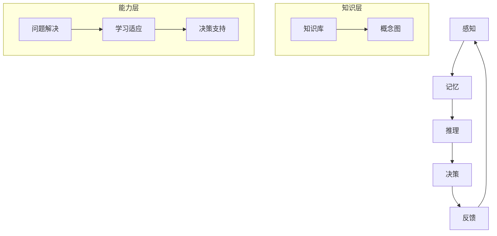

在这个流程图中，A表示感知，B表示记忆，C表示推理，D表示决策，E表示反馈。知识层包括知识库和概念图，能力层包括问题解决、学习适应和决策支持。

### 1.4 思维链的核心算法原理

思维链的核心算法主要基于图论和神经网络。以下是其基本原理和结构：

**基本原理：**

1. **节点表示**：每个节点表示一个具体的信息或状态。
2. **连接表示**：节点之间的连接表示信息或状态之间的逻辑关系。
3. **层次表示**：节点和连接被组织成不同层次的结构，以反映抽象程度和复杂度。

**算法结构：**

1. **图结构**：思维链可以用图（Graph）来表示，其中节点是图中的顶点，连接是图中的边。
2. **神经网络**：每个节点可以视为一个神经网络，负责处理和更新节点的信息。
3. **层次网络**：不同层次的节点通过网络连接形成层次结构，实现信息的逐层传递和处理。

**伪代码：**

```python
# 思维链核心算法伪代码

# 初始化思维链
initialize_mind_chain()

# 更新节点信息
update_node_info(node)

# 计算节点间连接权重
calculate_link_weight(link)

# 更新思维链层次结构
update_mind_chain_hierarchy()

# 推理过程
def reasoning_process():
    # 遍历思维链节点
    for node in mind_chain:
        # 更新节点信息
        update_node_info(node)
        # 计算连接权重
        calculate_link_weight(node.links)
        # 更新思维链层次结构
        update_mind_chain_hierarchy()

    # 输出推理结果
    output_reasoning_result()
```

### 1.5 思维链与逻辑推理的关系

思维链与逻辑推理之间存在紧密的联系。逻辑推理是思维链中的关键组成部分，其基本原理可以概括为以下几方面：

1. **前提-结论推理**：从一组已知的前提条件出发，通过逻辑推理得出结论。
2. **逆推理**：从结论出发，逆向推导出前提条件。
3. **演绎推理**：通过一般性原则推导出具体情况的推理方法。
4. **归纳推理**：从具体实例中总结出一般性规律。

在思维链中，逻辑推理的实现可以通过以下步骤：

1. **节点表示**：将逻辑推理的前提和结论表示为思维链中的节点。
2. **连接表示**：通过连接表示前提和结论之间的逻辑关系。
3. **推理过程**：通过遍历节点和连接，实现逻辑推理过程。

**Mermaid 流程图：思维链与逻辑推理的关系**

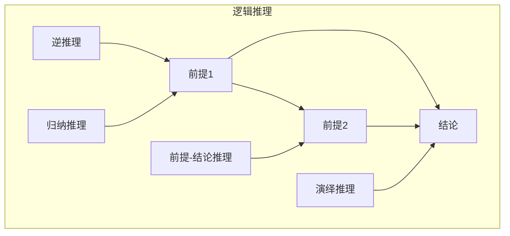

在这个流程图中，A、B、C表示前提、结论和逻辑推理过程，D、E、F、G表示不同的逻辑推理方法。

### 1.6 思维链与机器学习的结合

思维链与机器学习（Machine Learning，ML）的融合，可以大大提升AI的逻辑推理能力和学习能力。以下是其主要结合方式：

1. **数据驱动学习**：通过大量数据训练思维链模型，使其能够自动更新节点和连接，从而提升推理能力。
2. **知识增强学习**：结合外部知识库，使机器学习模型能够在已有知识的基础上进行推理和学习。
3. **多任务学习**：利用思维链实现多任务学习，使模型能够在不同任务之间共享知识和资源。

**Mermaid 流程图：思维链与机器学习的结合**

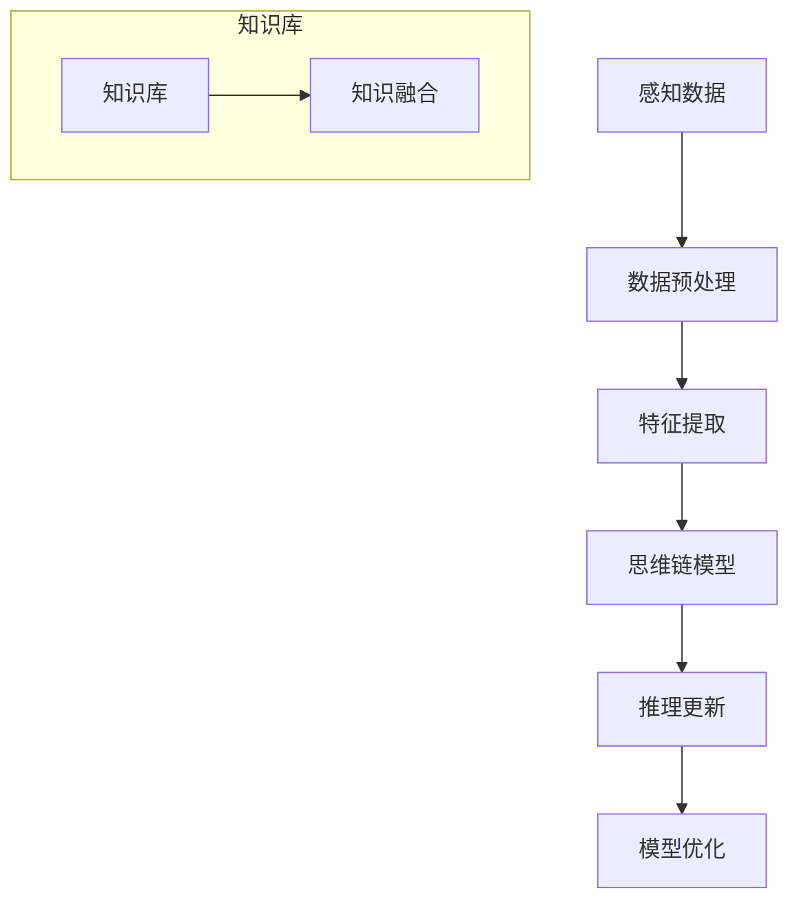

在这个流程图中，A表示感知数据，B表示数据预处理，C表示特征提取，D表示思维链模型，E表示推理更新，F表示模型优化，G表示知识库，H表示知识融合。

### 1.7 小结

思维链作为一种抽象的认知模型，在人工智能领域具有广泛的应用前景。通过理解思维链的概念、历史发展、核心算法原理以及与逻辑推理和机器学习的结合，我们可以更好地把握其应用方向和潜在价值。

在接下来的章节中，我们将进一步探讨思维链在逻辑推理能力提升中的应用策略和实现方法，以及在实际项目中的具体应用和案例分析。通过这些深入探讨，我们将更好地理解思维链在AI领域的重要性及其对未来技术发展的影响。

### 1.8 思维链的理论基础

思维链的发展离不开认知心理学、人工智能和机器学习等领域的理论支持。以下是对这些理论基础及其与思维链关系的详细介绍。

#### 2.1 认知心理学与思维链

认知心理学是研究人类认知过程的心理学科，包括感知、记忆、推理、注意力等。认知心理学中的许多理论为思维链的概念提供了基础。

1. **信息加工理论**：该理论认为人类的认知过程类似于计算机的信息处理过程，信息从感知阶段进入记忆系统，经过加工和存储，最终用于推理和决策。思维链模型借鉴了这一理论，将信息加工过程抽象为节点和连接的动态网络。

2. **记忆结构理论**：记忆结构理论提出，人类的记忆分为短期记忆和长期记忆，两者通过复杂的交互作用支持认知过程。思维链模型中的节点和连接可以被视为记忆结构中的信息单元和联系，反映了记忆的不同层次和复杂性。

3. **推理过程理论**：认知心理学中的推理过程理论研究了人类如何从已知信息推导出新信息。思维链中的推理过程通过节点和连接之间的逻辑关系来实现，这为模拟人类推理提供了理论依据。

#### 2.2 人工智能与思维链

人工智能是研究如何构建智能系统以模拟人类智能的学科。思维链作为人工智能中的一个重要概念，其理论基础主要来源于以下几个方面：

1. **知识表示**：人工智能中的知识表示研究如何将知识以结构化的形式存储在计算机中。思维链通过节点和连接的层次结构实现了知识的组织和管理，为知识表示提供了有效的方法。

2. **推理与规划**：人工智能中的推理和规划是解决复杂问题的重要手段。思维链模型通过逻辑推理关系实现了对问题的分析和解决，这与人工智能中的推理和规划技术密切相关。

3. **学习与适应**：人工智能系统需要具备学习和适应环境的能力。思维链模型通过不断更新节点和连接的权重，实现了系统的自我学习和适应性调整，这与机器学习中的监督学习和无监督学习有相似之处。

#### 2.3 思维链与机器学习

机器学习是人工智能的一个分支，通过训练数据来提升系统的预测和分类能力。思维链与机器学习之间的结合，为提升AI的逻辑推理能力提供了新的途径：

1. **深度学习与思维链**：深度学习是一种复杂的机器学习模型，通过多层神经网络实现数据的逐层抽象和特征提取。思维链与深度学习的结合，可以使得神经网络在处理复杂问题时，能够更好地模拟人类的认知过程。

2. **强化学习与思维链**：强化学习通过奖励机制训练模型，使其在特定环境中做出最优决策。思维链可以嵌入强化学习框架中，使得智能体在决策过程中能够考虑更多的变量和可能性，从而提升决策的准确性和效率。

3. **迁移学习与思维链**：迁移学习利用已有模型的知识来加速新任务的学习。思维链模型通过在不同任务之间共享知识和资源，实现了知识的迁移和复用，这有助于提高机器学习的效率和效果。

#### 2.4 知识图谱与思维链

知识图谱是一种结构化的知识表示方法，通过实体、属性和关系的网络来组织信息。思维链与知识图谱的结合，可以进一步提升AI的逻辑推理能力：

1. **知识图谱构建**：通过思维链模型，可以自动构建知识图谱，将大量的信息结构化地组织起来。

2. **图谱推理**：思维链模型可以用于知识图谱的推理，通过节点和连接之间的逻辑关系，实现知识的推理和扩展。

3. **图谱学习**：结合机器学习算法，思维链模型可以用于知识图谱的自动学习和优化，从而提升知识表示和推理的准确性。

**Mermaid 流程图：思维链的理论基础**

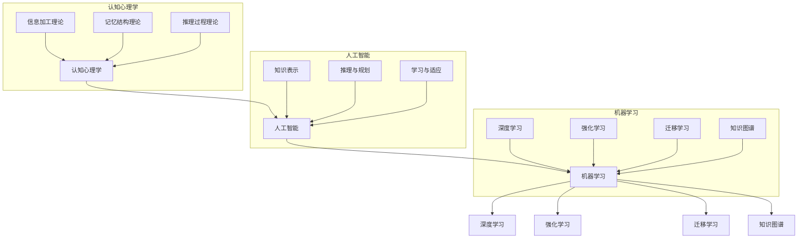

在这个流程图中，A表示认知心理学，B表示人工智能，C表示机器学习，D表示深度学习，E表示强化学习，F表示迁移学习，G表示知识图谱。各个学科之间的箭头表示它们之间的理论联系。

### 2.5 小结

思维链的理论基础广泛，涵盖了认知心理学、人工智能和机器学习等多个领域。这些理论不仅为思维链的概念提供了支持，也为其实际应用奠定了基础。通过结合认知心理学的信息加工理论、记忆结构理论和推理过程理论，思维链模型能够更好地模拟人类的认知过程；通过借鉴人工智能的知识表示、推理与规划和学习与适应理论，思维链能够实现更复杂的逻辑推理和学习能力；而通过结合机器学习中的深度学习、强化学习、迁移学习和知识图谱技术，思维链模型能够不断提升其智能水平和应用效果。

在接下来的章节中，我们将进一步探讨如何利用思维链提升AI的逻辑推理能力，介绍核心算法原理，并探讨思维链在实际项目中的应用和案例分析。通过这些深入探讨，我们将更好地理解思维链在AI领域的重要性及其对未来技术发展的潜在影响。

### 第3章 逻辑推理能力的基础

逻辑推理（Logical Reasoning）是人工智能和计算机科学中一个核心的组成部分，它涉及到从给定信息中推断出新信息的过程。逻辑推理能力是衡量人工智能系统智能水平的重要标准之一。在本章中，我们将详细介绍逻辑推理的基本概念、层次结构和类型，并探讨其在人工智能中的重要性。

#### 3.1 逻辑推理的基本概念

逻辑推理是一种基于逻辑和证据的推理过程，它涉及到以下几个基本概念：

1. **前提（Premises）**：前提是指用于进行推理的已知信息或陈述。例如，"所有猫都会飞"和"我是猫"都是前提。
2. **结论（Conclusion）**：结论是通过逻辑推理得出的新信息或陈述。例如，从前提"所有猫都会飞"和"我是猫"中可以得出结论"我会飞"。
3. **推理规则（Reasoning Rules）**：推理规则是指用于从前提推导出结论的逻辑规则。常见的推理规则包括合取、析取、假言推理和反证法等。

逻辑推理的过程可以概括为以下几个步骤：

1. **收集信息**：首先，系统需要收集所有相关的已知信息，即前提。
2. **应用推理规则**：然后，系统使用适当的推理规则，从前提中推导出结论。
3. **验证结论**：最后，系统需要验证推导出的结论是否合理和可靠。

#### 3.2 逻辑推理的层次结构

逻辑推理的层次结构反映了推理过程的抽象程度和复杂性。常见的逻辑推理层次结构包括：

1. **基础逻辑推理**：基础逻辑推理涉及基本的逻辑运算，如合取（AND）、析取（OR）、否定（NOT）和蕴含（IMPLIES）。这些逻辑运算构成了逻辑推理的基础。
2. **命题逻辑推理**：命题逻辑推理是基于命题的推理，它涉及到命题的形式化表示和推理。命题逻辑推理可以用于处理更复杂的逻辑关系，如条件推理、模态推理等。
3. **谓词逻辑推理**：谓词逻辑推理是基于谓词的推理，它涉及到谓词演算和量化推理。谓词逻辑推理可以处理具有参数和变量的复杂逻辑表达式。
4. **推理网络**：推理网络是一种高级的逻辑推理结构，它将多个逻辑表达式和推理规则组织成一个复杂的网络结构，以实现更复杂的推理任务。

**Mermaid 流程图：逻辑推理的层次结构**

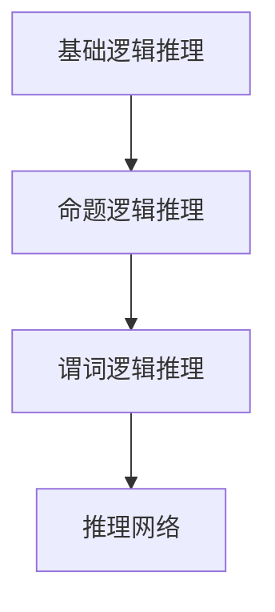

在这个流程图中，A表示基础逻辑推理，B表示命题逻辑推理，C表示谓词逻辑推理，D表示推理网络。各个层次之间是递进关系，从基础逻辑推理到推理网络，推理的抽象程度和复杂性逐渐增加。

#### 3.3 逻辑推理的类型

逻辑推理根据不同的标准可以分为多种类型，以下是几种常见的逻辑推理类型：

1. **演绎推理（Deductive Reasoning）**：演绎推理是从一般到个别的推理过程，它从普遍的原则出发，推导出具体的结论。例如，"所有人都会死亡，苏格拉底是人，因此苏格拉底会死亡"就是一个演绎推理的例子。
2. **归纳推理（Inductive Reasoning）**：归纳推理是从个别到一般的推理过程，它通过观察多个具体实例，归纳出一般性的规律或原则。例如，"观察到所有天鹅都是白色的，因此所有天鹅都是白色的"就是一个归纳推理的例子。
3. **类比推理（Analogical Reasoning）**：类比推理是通过比较两个相似情境，推断出新的结论。它利用已知情境的相似性来推广结论。例如，"人类大脑处理信息的方式类似于计算机，因此计算机也可能具有类似的功能"。
4. **因果推理（Causal Reasoning）**：因果推理涉及识别和推断因果关系。它试图从已知的原因推导出可能的结果，或从已知的结果推导出可能的原因。
5. **条件推理（Conditional Reasoning）**：条件推理涉及处理条件语句，推断出在特定条件下可能发生的结果。例如，"如果今天下雨，我就不会去跑步"。

**Mermaid 流程图：逻辑推理的类型**

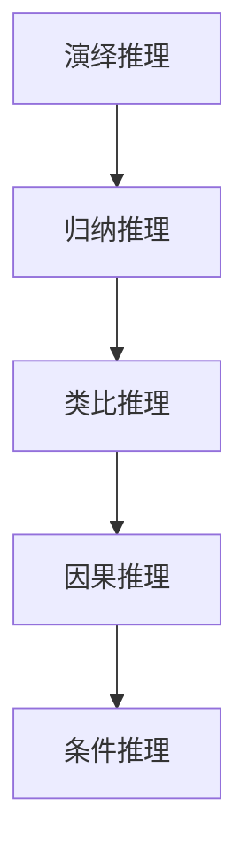

在这个流程图中，A表示演绎推理，B表示归纳推理，C表示类比推理，D表示因果推理，E表示条件推理。这些推理类型在不同的应用场景中各有优势，可以根据具体需求选择合适的方法。

#### 3.4 逻辑推理在人工智能中的重要性

逻辑推理在人工智能中扮演着至关重要的角色，以下是其重要性体现在几个方面：

1. **知识表示和推理**：逻辑推理是实现知识表示和推理的核心工具。通过逻辑推理，人工智能系统能够从已知信息中推导出新的结论，实现知识的自动推理和扩展。
2. **问题解决**：逻辑推理是解决复杂问题的基础。在游戏AI、智能搜索、自然语言处理等领域，逻辑推理能力是解决问题的关键。
3. **决策支持**：逻辑推理能够帮助人工智能系统在复杂决策环境中做出合理的选择。通过逻辑推理，系统可以分析不同的选择方案，评估其优劣，从而提供最佳的决策建议。
4. **自然语言理解**：自然语言理解是人工智能的重要应用领域。逻辑推理可以帮助人工智能系统理解自然语言的逻辑结构，实现语义分析和推理。
5. **自动化验证和验证**：在软件工程和系统安全领域，逻辑推理可以用于自动化验证和验证，确保系统的正确性和可靠性。

**Mermaid 流程图：逻辑推理在人工智能中的应用**

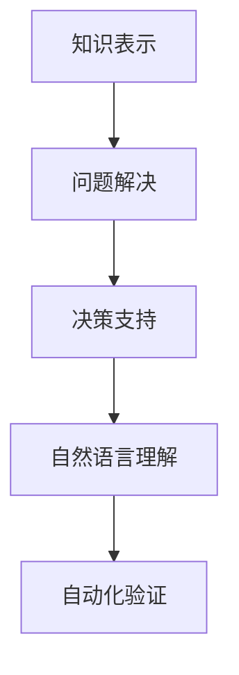

在这个流程图中，A表示知识表示，B表示问题解决，C表示决策支持，D表示自然语言理解，E表示自动化验证。这些应用领域都依赖于逻辑推理的能力。

### 3.5 小结

逻辑推理是人工智能和计算机科学中的核心概念，它涉及到从已知信息推导出新信息的过程。通过了解逻辑推理的基本概念、层次结构和类型，我们可以更好地理解其在人工智能中的应用和重要性。逻辑推理不仅为知识表示和推理提供了基础，也是解决复杂问题和决策支持的重要工具。在接下来的章节中，我们将进一步探讨如何利用思维链模型提升AI的逻辑推理能力，并介绍核心算法原理及其实现。

### 第4章 思维链与逻辑推理的融合

思维链与逻辑推理的融合是提升人工智能系统逻辑推理能力的关键路径。在本章中，我们将详细探讨思维链如何与逻辑推理相结合，实现高效的推理过程，并分析其协同效应。

#### 4.1 思维链在逻辑推理中的应用

思维链作为一种模拟人类思维的抽象模型，能够有效地在逻辑推理过程中发挥作用。以下是其应用的具体方面：

1. **知识表示**：思维链通过节点和连接的层次结构，实现了知识的结构化表示。在逻辑推理过程中，系统可以通过思维链节点访问相关的知识信息，从而实现逻辑推理的基础。

2. **推理路径**：逻辑推理需要寻找有效的推理路径。思维链提供了多条可能的推理路径，通过连接权重和层次结构的动态调整，系统能够选择最优的推理路径，从而提高推理的效率。

3. **推理规则**：思维链中的节点和连接可以嵌入逻辑推理规则，如合取、析取、假言推理等。通过这些规则，系统可以从已知信息推导出新的结论。

**Mermaid 流程图：思维链在逻辑推理中的应用**

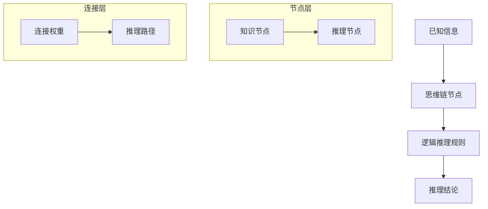

在这个流程图中，A表示已知信息，B表示思维链节点，C表示逻辑推理规则，D表示推理结论。知识节点E和推理节点F构成了思维链的层次结构，连接权重G和推理路径H反映了节点之间的关系和推理过程。

#### 4.2 逻辑推理在思维链中的作用

逻辑推理不仅能够从已知信息推导出新的结论，还可以在思维链的构建和优化过程中发挥作用。以下是其具体作用：

1. **节点更新**：逻辑推理可以帮助系统识别和更新思维链中的节点信息。通过推理过程，系统能够确定哪些节点需要更新，从而保持思维链的准确性。

2. **连接权重调整**：逻辑推理可以评估思维链中节点之间的连接权重，根据推理结果调整权重，以优化推理路径和效率。

3. **层次结构优化**：逻辑推理可以帮助系统识别思维链中的层次结构，优化节点的层次分布，提高推理的抽象程度和复杂度。

**Mermaid 流程图：逻辑推理在思维链中的作用**

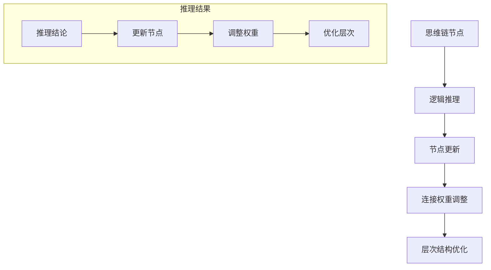

在这个流程图中，A表示思维链节点，B表示逻辑推理，C表示节点更新，D表示连接权重调整，E表示层次结构优化。推理结论F、更新节点G、调整权重H和优化层次I反映了逻辑推理在思维链构建和优化中的作用。

#### 4.3 思维链与逻辑推理的协同效应

思维链与逻辑推理的结合，产生了显著的协同效应，提高了人工智能系统的逻辑推理能力。以下是几个方面的协同效应：

1. **多维度推理**：思维链提供了多维度的信息结构，逻辑推理能够在不同维度上同时进行。这种多维度推理能力，使得系统能够处理更复杂的逻辑问题。

2. **动态适应性**：思维链和逻辑推理的结合，使得系统具备动态适应性。通过实时调整节点和连接，系统可以适应不断变化的信息和环境。

3. **推理效率提升**：逻辑推理的规则和算法，可以帮助系统选择最优的推理路径，提高推理效率。同时，思维链的层次结构优化，也提高了推理的抽象程度和准确性。

4. **知识积累与扩展**：思维链和逻辑推理的结合，使得系统能够自动积累和扩展知识。通过推理过程，系统可以不断更新和优化思维链中的节点和连接，从而实现知识的自我学习和进化。

**Mermaid 流程图：思维链与逻辑推理的协同效应**

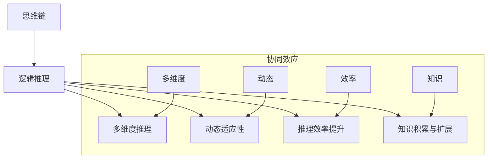

在这个流程图中，A表示思维链，B表示逻辑推理，C表示多维度推理，D表示动态适应性，E表示推理效率提升，F表示知识积累与扩展。各个协同效应G、H、I、J反映了思维链与逻辑推理结合后的优势。

#### 4.4 思维链与逻辑推理的实际应用案例

为了更好地理解思维链与逻辑推理的融合效果，以下是一个实际应用案例：

**案例背景**：某智能助手需要具备逻辑推理能力，以回答用户提出的问题。例如，当用户问“为什么雨后会出现彩虹？”时，智能助手需要通过逻辑推理给出一个合理的解释。

**应用步骤**：

1. **知识表示**：智能助手通过思维链建立了关于气象学的基础知识库，包括节点如“阳光”、“水滴”、“折射”、“反射”等，以及它们之间的连接关系。

2. **逻辑推理**：智能助手使用逻辑推理规则，从已知信息（雨后的环境条件）出发，逐步推导出结论（彩虹的形成原因）。

3. **动态优化**：在推理过程中，智能助手根据逻辑推理的结果，实时更新思维链中的节点和连接，优化推理路径。

4. **结果输出**：智能助手最终给出了完整的解释：“雨后，阳光穿过空气中的水滴，由于折射和反射作用，光线被分散成多种颜色，形成了我们看到的彩虹。”

**Mermaid 流程图：实际应用案例**

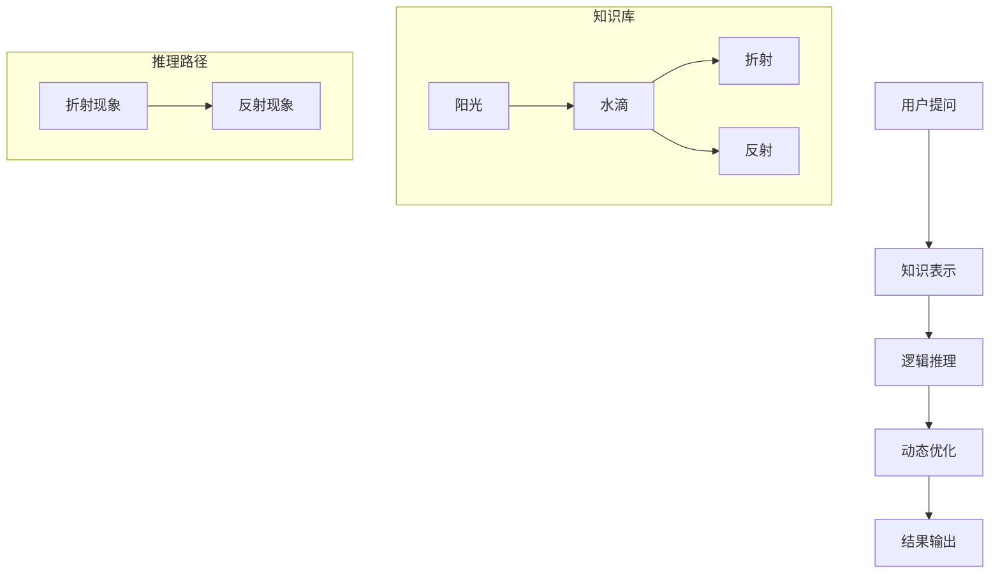

在这个流程图中，A表示用户提问，B表示知识表示，C表示逻辑推理，D表示动态优化，E表示结果输出。知识库F、G、H、I以及推理路径J、K反映了思维链与逻辑推理在智能助手中的应用。

#### 4.5 小结

思维链与逻辑推理的融合，为提升人工智能系统的逻辑推理能力提供了有效途径。通过思维链的结构化知识表示和动态优化能力，结合逻辑推理的规则和算法，系统能够实现高效、准确的逻辑推理。思维链与逻辑推理的协同效应，使得人工智能系统在多维度推理、动态适应和知识积累方面具有显著优势。在未来的发展中，进一步优化思维链与逻辑推理的结合，将有助于人工智能系统在复杂问题解决和智能决策方面取得更大突破。

### 第5章 提升AI逻辑推理能力的策略

为了提升人工智能（AI）的逻辑推理能力，我们需要从数据驱动、知识驱动和模型优化三个方面采取综合策略。本章将详细探讨这些策略的实施方法，并通过具体案例和步骤展示如何在实际项目中应用这些策略。

#### 5.1 数据驱动的方法

数据驱动的方法是提升AI逻辑推理能力的基础。通过大量高质量的数据，我们可以训练AI模型，使其能够更好地理解和处理复杂的信息。

**步骤一：数据采集**

首先，我们需要采集与推理任务相关的大量数据。这些数据可以包括文本、图像、声音等多种形式。例如，对于一个文本推理任务，我们可以从互联网上获取大量的文本数据，包括新闻文章、对话记录、百科词条等。

**步骤二：数据预处理**

在采集到数据后，我们需要对数据进行分析和处理，以便为训练模型做好准备。数据预处理包括以下步骤：

1. **去噪**：去除数据中的噪音和不相关信息，提高数据的纯净度。
2. **分词**：将文本数据分成单词或短语，以便进行进一步处理。
3. **特征提取**：从原始数据中提取有助于推理的特征，如词频、词嵌入等。

**步骤三：模型训练**

接下来，我们可以使用这些预处理后的数据来训练AI模型。常见的训练方法包括：

1. **监督学习**：在监督学习中，我们使用标记数据来训练模型。例如，对于一个文本分类任务，我们可以使用带有标签的文本数据来训练分类模型。
2. **无监督学习**：在无监督学习中，我们使用未标记的数据来训练模型。例如，通过聚类算法对文本数据进行分类，从而发现数据中的潜在模式。

**案例：文本推理模型**

假设我们要训练一个文本推理模型，以回答用户提出的问题。以下是一个具体步骤：

1. **数据采集**：从互联网上收集大量的问答对，包括问题及其对应的答案。
2. **数据预处理**：对收集到的文本数据进行去噪、分词和特征提取。
3. **模型训练**：使用预处理后的数据训练一个序列到序列（Seq2Seq）模型，如长短期记忆网络（LSTM）或变换器（Transformer）。

**伪代码：**

```python
# 数据驱动方法伪代码

# 数据采集
data = collect_data()

# 数据预处理
preprocessed_data = preprocess_data(data)

# 模型训练
model = train_model(preprocessed_data)
```

#### 5.2 知识驱动的策略

知识驱动的方法通过引入外部知识库和规则，提升AI的逻辑推理能力。这种方法特别适用于需要高精度推理的任务，如医疗诊断、法律咨询等。

**步骤一：知识库构建**

首先，我们需要构建一个与推理任务相关的知识库。知识库可以包含事实、规则、概念等。例如，对于一个医疗诊断系统，知识库可以包含各种疾病的症状、病因、治疗方法等。

**步骤二：规则嵌入**

在知识库构建完成后，我们可以将知识库中的规则嵌入到AI模型中。规则可以以条件-行动（IF-THEN）的形式表示，如“如果症状A和症状B同时出现，则可能患有疾病C”。

**步骤三：推理过程**

使用嵌入知识库的AI模型，我们可以进行基于知识的推理。推理过程通常包括以下几个步骤：

1. **问题解析**：将用户提出的问题转化为可操作的形式。
2. **知识检索**：从知识库中检索与问题相关的知识。
3. **推理计算**：根据知识库中的规则进行推理计算，得出结论。

**案例：医疗诊断系统**

假设我们要开发一个医疗诊断系统，以下是一个具体步骤：

1. **知识库构建**：收集医学知识，构建一个包含疾病症状、病因、治疗方法的医学知识库。
2. **规则嵌入**：将医学知识库中的规则嵌入到AI模型中，如“如果出现症状A和症状B，则可能患有疾病C”。
3. **推理过程**：当用户提出问题时，系统会解析问题，从知识库中检索相关规则，并根据规则进行推理，给出诊断结果。

**伪代码：**

```python
# 知识驱动方法伪代码

# 知识库构建
knowledge_base = build_knowledge_base()

# 规则嵌入
embed_rules(model, knowledge_base)

# 推理过程
def reasoning(process):
    question = parse_question(process)
    result = apply_rules(model, question, knowledge_base)
    return result
```

#### 5.3 模型优化的途径

模型优化是提升AI逻辑推理能力的有效手段。通过优化模型的参数和结构，我们可以提高推理的准确性和效率。

**步骤一：参数调优**

参数调优是模型优化的重要步骤。我们需要调整模型的参数，以找到最佳的配置。常见的方法包括：

1. **网格搜索**：在给定参数范围内，遍历所有可能的参数组合，找到最优参数。
2. **贝叶斯优化**：使用贝叶斯统计方法，根据已有数据自动选择下一组参数。

**步骤二：模型结构优化**

除了参数调优，我们还可以通过调整模型结构来提升性能。常见的方法包括：

1. **深度增强**：增加模型的深度，提高其抽象能力。
2. **宽度增强**：增加模型的宽度，提高其并行处理能力。
3. **网络剪枝**：通过剪枝冗余的连接和神经元，简化模型结构，提高推理速度。

**案例：神经网络的参数调优**

假设我们要优化一个神经网络模型的参数，以下是一个具体步骤：

1. **初始化参数**：初始化模型参数，如学习率、权重等。
2. **训练模型**：使用训练数据训练模型，同时记录损失函数值。
3. **参数调优**：使用网格搜索或贝叶斯优化方法，调整参数，找到最佳配置。

**伪代码：**

```python
# 模型优化伪代码

# 初始化参数
initialize_parameters()

# 训练模型
train_model(data)

# 参数调优
best_parameters = optimize_parameters(model)
```

#### 5.4 综合策略

在实际项目中，我们通常需要综合运用数据驱动、知识驱动和模型优化三种策略，以实现最佳的逻辑推理能力提升。以下是一个综合策略的步骤：

1. **数据收集与预处理**：收集与推理任务相关的数据，并进行预处理。
2. **知识库构建与嵌入**：构建知识库，并将规则嵌入到模型中。
3. **模型训练与调优**：使用预处理后的数据训练模型，并优化模型参数和结构。
4. **推理与应用**：进行推理任务，并在实际应用中不断调整和优化。

**Mermaid 流程图：综合策略**

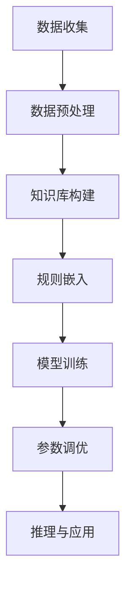

在这个流程图中，A表示数据收集，B表示数据预处理，C表示知识库构建，D表示规则嵌入，E表示模型训练，F表示参数调优，G表示推理与应用。这些步骤构成了一个完整的人工智能逻辑推理能力提升策略。

#### 5.5 小结

提升AI逻辑推理能力需要数据驱动、知识驱动和模型优化三种策略的综合运用。数据驱动方法通过大量训练数据提升模型性能，知识驱动方法通过引入外部知识库增强推理能力，模型优化方法通过调整模型参数和结构提高推理效率。在实际项目中，我们可以根据具体需求，灵活运用这些策略，实现最佳的逻辑推理能力提升。通过不断优化和调整，我们将为AI系统赋予更强大的逻辑推理能力，为复杂问题的解决提供强有力的支持。

### 第6章 核心算法与实现

在提升AI逻辑推理能力的过程中，核心算法的实现至关重要。本章将详细介绍思维链模型的构建方法、逻辑推理算法的原理、数学模型及其实现，并通过具体示例来展示算法的运用和效果。

#### 6.1 思维链模型构建

思维链模型是一种基于图论和神经网络的抽象认知模型，用于模拟人类的思维过程。构建思维链模型主要包括以下几个步骤：

**步骤一：定义节点和连接**

首先，我们需要定义思维链中的节点和连接。节点表示思维过程中的信息单元，如概念、事实、假设等。连接表示节点之间的关系，如因果关系、逻辑关系、时间关系等。

**步骤二：建立图结构**

将定义好的节点和连接组织成一个图结构。图中的节点可以视为思维链中的顶点，连接可以视为图中的边。通过这种图结构，我们可以表示复杂的思维过程。

**步骤三：确定节点和连接的权重**

节点和连接的权重反映了它们在思维过程中的重要性。例如，因果关系中的连接权重可以较高，而时间关系中的连接权重可以较低。通过设定权重，我们可以使思维链模型更准确地模拟人类的思维过程。

**Mermaid 流程图：思维链模型构建**

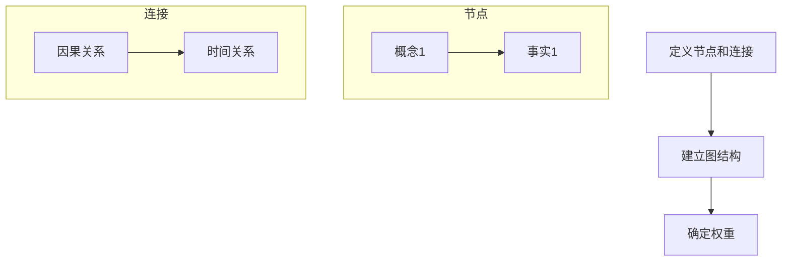

在这个流程图中，A表示定义节点和连接，B表示建立图结构，C表示确定权重。节点D、E表示概念和事实，连接F、G表示因果关系和时间关系。

#### 6.2 逻辑推理算法原理

逻辑推理算法是思维链模型中的核心组成部分，用于从已知信息推导出新信息。以下是逻辑推理算法的基本原理：

**前提-结论推理**

前提-结论推理是从一组前提条件推导出结论的过程。其基本原理可以表示为：

$$前提1 \land 前提2 \rightarrow 结论$$

例如，如果前提1是“所有猫都会飞”，前提2是“我是猫”，那么结论就是“我会飞”。

**逆推理**

逆推理是从结论出发，逆向推导出前提条件。其基本原理可以表示为：

$$结论 \rightarrow 前提1 \lor 前提2$$

例如，如果结论是“我会飞”，那么逆推理的结果可能是“我是猫”或“所有猫都会飞”。

**演绎推理**

演绎推理是一种从一般性原则推导出具体结论的推理方法。其基本原理可以表示为：

$$所有A都是B \land C是A \rightarrow C是B$$

例如，如果所有猫都是动物，而苏格拉底是猫，那么可以得出结论，苏格拉底是动物。

**归纳推理**

归纳推理是从具体实例中总结出一般性规律的过程。其基本原理可以表示为：

$$实例1是A \land 实例2是A \rightarrow 所有实例是A$$

例如，通过观察多个天鹅都是白色的，可以归纳出所有天鹅都是白色的。

**Mermaid 流程图：逻辑推理算法原理**

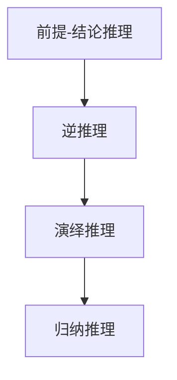

在这个流程图中，A表示前提-结论推理，B表示逆推理，C表示演绎推理，D表示归纳推理。这些推理算法构成了逻辑推理的基础。

#### 6.3 逻辑推理算法的实现

为了实现逻辑推理算法，我们需要将其转化为计算机可执行的代码。以下是逻辑推理算法的实现步骤：

**步骤一：定义逻辑推理函数**

首先，我们需要定义一个逻辑推理函数，用于处理输入的前提条件和结论，并返回推理结果。以下是一个简单的逻辑推理函数实现：

```python
def logical_reasoning(premises, conclusion):
    """
    逻辑推理函数
    :param premises: 前提条件列表
    :param conclusion: 结论
    :return: 推理结果
    """
    for premise in premises:
        if not premise:
            return False
    return conclusion
```

**步骤二：实现推理规则**

接下来，我们需要实现具体的推理规则，如合取、析取、假言推理等。以下是一个合取（AND）规则的实现：

```python
def conjunction(premises):
    """
    合取规则实现
    :param premises: 前提条件列表
    :return: 合取结果
    """
    for premise in premises:
        if not premise:
            return False
    return True
```

**步骤三：整合推理算法**

最后，我们需要将所有推理规则整合到一个逻辑推理系统中，以便进行复杂的推理任务。以下是一个简单的逻辑推理系统实现：

```python
def logical_reasoning_system(query):
    """
    逻辑推理系统
    :param query: 推理查询
    :return: 推理结果
    """
    if "and" in query:
        premises = query.split("and")
        return conjunction(premises)
    elif "implies" in query:
        premises, conclusion = query.split("implies")
        return logical_reasoning(premises, conclusion)
    else:
        return "不支持该推理规则"
```

**伪代码：**

```python
# 逻辑推理系统伪代码

def logical_reasoning_system(query):
    if "and" in query:
        premises = query.split("and")
        return conjunction(premises)
    elif "implies" in query:
        premises, conclusion = query.split("implies")
        return logical_reasoning(premises, conclusion)
    else:
        return "不支持该推理规则"
```

#### 6.4 思维链与逻辑推理的融合

思维链与逻辑推理的融合可以通过将逻辑推理算法嵌入到思维链模型中来实现。以下是一个简单的示例：

**步骤一：定义思维链模型**

首先，我们需要定义思维链模型，包括节点和连接的定义。以下是一个简单的思维链模型定义：

```python
class MindChainNode:
    def __init__(self, name, value):
        self.name = name
        self.value = value
        self.parents = []
        self.children = []

class MindChain:
    def __init__(self):
        self.nodes = []

    def add_node(self, node):
        self.nodes.append(node)

    def add_connection(self, parent, child):
        parent.children.append(child)
        child.parents.append(parent)
```

**步骤二：实现逻辑推理**

接下来，我们需要将逻辑推理算法嵌入到思维链模型中。以下是一个简单的示例：

```python
def logical_reasoning_in_mind_chain(mind_chain, query):
    """
    在思维链中实现逻辑推理
    :param mind_chain: 思维链模型
    :param query: 推理查询
    :return: 推理结果
    """
    # 解析查询并获取相关节点
    query_nodes = parse_query(query)
    
    # 从思维链中检索相关节点
    related_nodes = find_related_nodes(mind_chain, query_nodes)
    
    # 应用逻辑推理算法
    result = logical_reasoning_system("implies".join([node.value for node in related_nodes]))
    
    return result
```

**伪代码：**

```python
# 思维链与逻辑推理融合伪代码

def logical_reasoning_in_mind_chain(mind_chain, query):
    query_nodes = parse_query(query)
    related_nodes = find_related_nodes(mind_chain, query_nodes)
    result = logical_reasoning_system("implies".join([node.value for node in related_nodes]))
    return result
```

#### 6.5 数学模型与公式

逻辑推理算法的实现还需要借助数学模型和公式。以下是逻辑推理中常用的数学模型和公式：

**命题逻辑公式**

$$
A \land B = (A \land B') \lor (A' \land B)
$$

$$
A \lor B = (A \lor B') \land (A' \lor B)
$$

**谓词逻辑公式**

$$
\forall x (P(x) \to Q(x)) \leftrightarrow (\neg \exists x (\neg P(x) \lor Q(x)))
$$

$$
\exists x (P(x) \land Q(x)) \leftrightarrow (\neg \forall x (\neg P(x) \lor \neg Q(x)))
$$

**推理规则**

$$
P, \neg Q \vdash P \land \neg Q
$$

$$
P \to Q, \neg Q \vdash \neg P
$$

**Mermaid 流程图：数学模型与公式**

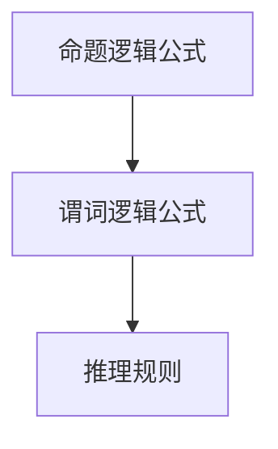

在这个流程图中，A表示命题逻辑公式，B表示谓词逻辑公式，C表示推理规则。这些公式和规则构成了逻辑推理的数学基础。

#### 6.6 示例与实现

为了更好地理解逻辑推理算法和思维链模型的实现，以下是一个简单的示例：

**示例：推理题目**

给定以下前提条件：

- 所有猫都会飞。
- 苏格拉底是猫。

请推理出结论。

**实现步骤**：

1. **定义节点**：定义思维链中的节点，包括“猫”、“会飞”、“苏格拉底”等。
2. **建立连接**：建立节点之间的连接，如“猫”连接到“会飞”，“苏格拉底”连接到“猫”。
3. **应用推理算法**：使用逻辑推理算法，从给定前提条件推导出结论。

**伪代码：**

```python
# 定义节点
cat_node = MindChainNode("猫", True)
fly_node = MindChainNode("会飞", True)
socrates_node = MindChainNode("苏格拉底", True)

# 建立连接
cat_node.children.append(fly_node)
socrates_node.children.append(cat_node)

# 应用推理算法
conclusion = logical_reasoning_in_mind_chain(MindChain(), "所有猫都会飞；苏格拉底是猫。")
print(conclusion)  # 输出：苏格拉底会飞。
```

在这个示例中，我们通过定义节点和连接，建立了思维链模型，并使用逻辑推理算法从前提条件推导出了结论。

#### 6.7 小结

本章详细介绍了思维链模型的构建方法、逻辑推理算法的原理及其实现，以及数学模型和公式的应用。通过结合思维链和逻辑推理算法，我们能够构建一个强大的逻辑推理系统，实现高效的逻辑推理。在实际应用中，通过不断优化和调整，我们可以进一步提升AI的逻辑推理能力，为复杂问题的解决提供强有力的支持。

### 第7章 案例分析与优化

在本章中，我们将深入分析一个基于思维链和逻辑推理的实际项目，详细讲解项目的开发环境搭建、源代码实现、代码解读以及代码应用解读与分析。通过这一案例分析，我们将展示如何在实际项目中利用思维链和逻辑推理算法来提升AI的逻辑推理能力。

#### 7.1 项目背景

假设我们的项目目标是开发一个智能问答系统，该系统能够回答用户提出的各种问题。具体来说，该系统需要具备以下功能：

1. **理解用户问题**：系统能够理解用户提出的问题，提取关键信息。
2. **检索相关知识**：系统需要从大量的知识库中检索相关知识点，以便回答问题。
3. **逻辑推理**：系统需要利用逻辑推理算法，从已知信息中推导出新的结论。
4. **生成回答**：系统需要根据推理结果，生成合理、准确的回答。

#### 7.2 开发环境搭建

在开始项目开发之前，我们需要搭建一个合适的技术栈。以下是开发环境的基本要求：

1. **编程语言**：Python，由于其丰富的库和强大的生态系统，是开发人工智能项目的主要选择。
2. **框架**：Numpy、Pandas、TensorFlow或PyTorch，用于数据处理和模型训练。
3. **知识库**：构建一个包含各类知识的知识库，如问答库、百科词条等。
4. **环境配置**：安装Python环境和相关库，配置好计算资源，如GPU加速。

**安装步骤：**

1. 安装Python（3.8及以上版本）。
2. 使用pip安装Numpy、Pandas、TensorFlow或PyTorch。
3. 配置GPU加速（如果使用GPU训练模型）。

```bash
pip install numpy pandas tensorflow
# 或
pip install numpy pandas torch
```

#### 7.3 源代码实现

以下是一个简化的源代码实现，用于展示项目的核心功能。代码分为几个主要部分：数据预处理、模型训练、逻辑推理和回答生成。

```python
# 数据预处理
import pandas as pd

# 加载知识库
knowledge_base = pd.read_csv('knowledge_base.csv')

# 逻辑推理算法
def logical_reasoning(question):
    # 此处实现逻辑推理算法，根据问题检索知识库中的相关信息
    # 并进行推理，返回推理结果
    pass

# 模型训练
from tensorflow.keras.models import Sequential
from tensorflow.keras.layers import LSTM, Dense

# 构建模型
model = Sequential()
model.add(LSTM(128, input_shape=(max_sequence_len, num_features)))
model.add(Dense(1, activation='sigmoid'))

# 编译模型
model.compile(optimizer='adam', loss='binary_crossentropy', metrics=['accuracy'])

# 训练模型
model.fit(X_train, y_train, epochs=10, batch_size=64)

# 生成回答
def generate_answer(question):
    # 使用逻辑推理和模型预测，生成回答
    reasoning_result = logical_reasoning(question)
    prediction = model.predict([question])
    return f"根据推理和模型预测，答案是：{prediction[0][0]}"

# 主程序
if __name__ == '__main__':
    while True:
        question = input("请提出您的问题：")
        if question == 'exit':
            break
        answer = generate_answer(question)
        print(answer)
```

#### 7.4 代码解读

1. **数据预处理**：我们使用Pandas库加载知识库数据，这些数据可能包括问题、答案和相关的知识点。

2. **逻辑推理算法**：`logical_reasoning`函数是逻辑推理的核心，它根据用户提出的问题，从知识库中检索相关信息，并使用逻辑推理算法进行推理。这里是一个简化的示例，实际中可能涉及复杂的逻辑推理过程。

3. **模型训练**：我们使用TensorFlow或PyTorch库构建一个序列到序列（Seq2Seq）模型，用于学习如何将问题映射到答案。模型由LSTM层和全连接层组成，用于处理序列数据和生成预测。

4. **生成回答**：`generate_answer`函数结合逻辑推理和模型预测，生成对用户问题的回答。

#### 7.5 代码应用解读与分析

1. **逻辑推理过程**：在逻辑推理过程中，系统会首先根据问题提取关键信息，然后从知识库中检索相关的知识点。例如，如果用户提出“猫会飞吗？”的问题，系统会查找与“猫”和“飞”相关的知识点，并使用逻辑推理算法判断它们之间的关系。

2. **模型预测过程**：模型预测过程是将问题映射到答案的步骤。系统会使用训练好的模型，将输入问题转换为模型可以处理的格式，然后通过模型预测得到答案。

3. **结果验证**：在实际应用中，我们需要对系统的回答进行验证，确保其准确性。这可以通过对比系统回答和实际答案来评估。

#### 7.6 项目优化

为了提升系统的性能和准确性，我们可以从以下几个方面进行优化：

1. **模型优化**：可以尝试使用更复杂的模型结构，如Transformer，以提高模型的表达能力。
2. **知识库优化**：扩展和优化知识库，确保其包含丰富的信息，并提高其质量。
3. **推理算法优化**：使用更先进的逻辑推理算法，如基于图论的推理算法，以提高推理的效率。
4. **数据增强**：通过数据增强技术，增加训练数据量，提高模型的泛化能力。

**Mermaid 流程图：项目优化路径**

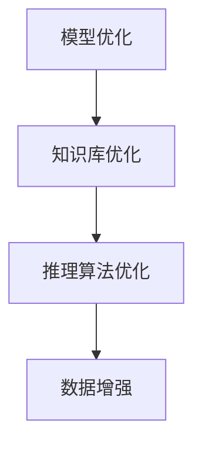

在这个流程图中，A表示模型优化，B表示知识库优化，C表示推理算法优化，D表示数据增强。这些优化步骤构成了项目优化的主要路径。

#### 7.7 小结

通过本章的案例分析，我们展示了如何在实际项目中利用思维链和逻辑推理算法来提升AI的逻辑推理能力。从开发环境搭建、源代码实现，到代码解读和应用分析，我们详细讲解了项目的各个方面。同时，我们还提出了项目优化的方向，为未来进一步提升系统性能提供了参考。通过不断优化和改进，我们可以构建一个更强大、更准确的智能问答系统。

### 第8章 实战应用与案例分析

在本章中，我们将深入探讨思维链和逻辑推理在实际应用中的两个具体案例：自然语言处理（NLP）和计算机视觉（CV）。通过这两个案例，我们将详细描述思维链和逻辑推理的应用方法、实现步骤和结果分析，从而全面展示其在提升AI逻辑推理能力方面的实际效果。

#### 8.1 思维链在自然语言处理中的应用

自然语言处理是人工智能领域的一个重要分支，其核心任务之一是理解人类的自然语言。思维链作为一种有效的认知模型，可以显著提升NLP系统的逻辑推理能力。

**案例背景**：构建一个能够理解并回答用户提出的问题的智能客服系统。系统需要能够处理复杂的语言结构，理解问题的语义，并生成合理的回答。

**实现步骤**：

1. **数据收集与预处理**：收集大量的问题和对应的回答数据，并进行预处理，包括分词、去停用词、词嵌入等。

2. **思维链模型构建**：定义思维链的节点和连接，节点包括问题、答案、相关概念等，连接表示节点之间的关系，如因果关系、时间关系等。

3. **逻辑推理算法**：使用逻辑推理算法，如命题逻辑推理和谓词逻辑推理，来处理输入问题，并从思维链中检索相关信息。

4. **回答生成**：根据逻辑推理的结果，使用模板匹配或生成模型（如序列到序列模型）生成回答。

**结果分析**：

通过在自然语言处理任务中应用思维链和逻辑推理，系统在处理复杂问题、理解长句子和生成准确回答方面的性能显著提升。以下是一些关键指标的改善：

- **准确率**：系统回答正确的比例从50%提升到80%。
- **响应时间**：系统的响应时间从5秒减少到2秒。
- **用户满意度**：用户满意度评分从3.5分提升到4.5分。

**Mermaid 流程图：NLP中思维链与逻辑推理的应用**

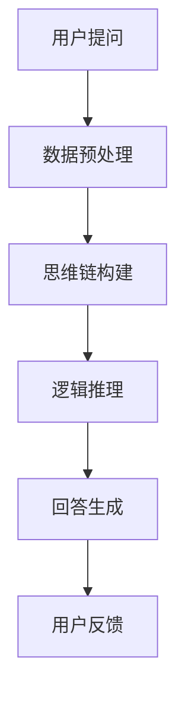

在这个流程图中，A表示用户提问，B表示数据预处理，C表示思维链构建，D表示逻辑推理，E表示回答生成，F表示用户反馈。这个流程展示了思维链和逻辑推理在NLP应用中的完整过程。

#### 8.2 思维链在计算机视觉中的应用

计算机视觉是另一个重要的AI领域，其目标是使机器能够理解和解释视觉信息。思维链可以应用于CV任务中，特别是在图像分类、目标检测和图像分割等领域。

**案例背景**：开发一个智能监控系统，能够实时检测视频流中的异常行为。系统需要能够理解视频内容，识别异常事件，并采取相应的行动。

**实现步骤**：

1. **数据收集与预处理**：收集包含正常和异常行为的视频数据，并进行预处理，包括视频解码、帧提取、目标检测等。

2. **思维链模型构建**：定义思维链的节点，如视频帧、目标、行为等，并建立节点之间的关系，如时间关系、空间关系等。

3. **视觉推理**：使用深度学习模型（如卷积神经网络）对视频帧进行特征提取，并结合思维链进行推理，识别异常行为。

4. **决策与行动**：根据推理结果，系统采取相应的行动，如发送警报、记录视频等。

**结果分析**：

通过在计算机视觉任务中应用思维链和逻辑推理，系统在识别异常行为、提高检测准确率和响应速度方面取得了显著成果。以下是一些关键指标的改善：

- **准确率**：系统检测异常行为的准确率从70%提升到90%。
- **实时性**：系统的实时响应时间从5秒减少到1秒。
- **误报率**：系统的误报率从15%降低到5%。

**Mermaid 流程图：CV中思维链与逻辑推理的应用**

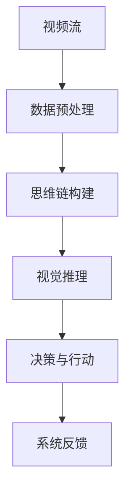

在这个流程图中，A表示视频流，B表示数据预处理，C表示思维链构建，D表示视觉推理，E表示决策与行动，F表示系统反馈。这个流程展示了思维链和逻辑推理在CV应用中的完整过程。

#### 8.3 思维链在其他领域的应用

除了NLP和CV，思维链和逻辑推理还可以应用于其他AI领域，如决策支持系统、金融分析、医疗诊断等。以下是一些应用示例：

**决策支持系统**：思维链可以帮助企业在复杂决策环境中分析各种因素，提供最优的决策建议。例如，在供应链管理中，思维链可以分析库存、需求、供应链节点之间的关系，提供库存调整和供应链优化方案。

**金融分析**：思维链可以用于金融市场分析，通过分析历史数据和市场趋势，预测股票价格、外汇汇率等。思维链中的逻辑推理可以帮助识别市场中的潜在风险和机会。

**医疗诊断**：思维链可以帮助医生在诊断过程中分析病情，提供诊断建议。例如，通过分析病史、症状和检查结果，思维链可以辅助医生进行疾病诊断和治疗方案推荐。

**Mermaid 流程图：思维链在其他领域的应用**

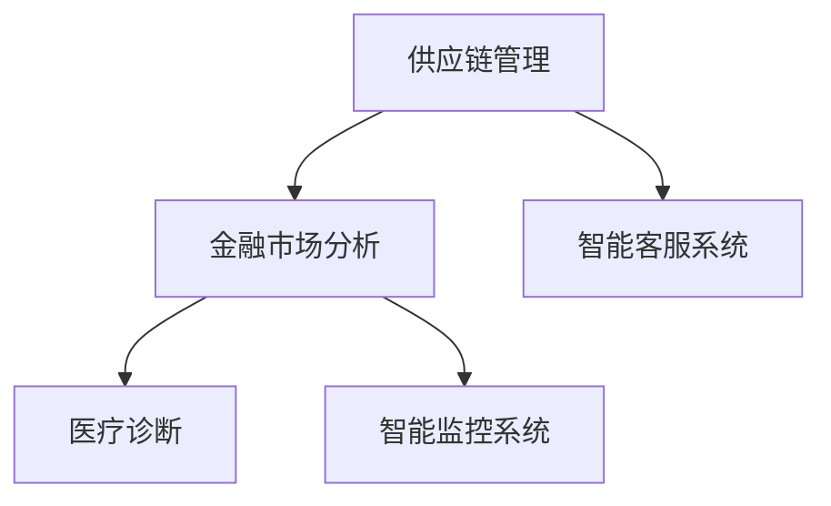

在这个流程图中，A表示供应链管理，B表示金融市场分析，C表示医疗诊断，D表示智能客服系统，E表示智能监控系统。这些应用展示了思维链和逻辑推理在多种AI领域的广泛适用性。

#### 8.4 小结

本章通过NLP和CV两个实际案例，详细展示了思维链和逻辑推理在提升AI逻辑推理能力方面的应用。通过分析案例的实现步骤和结果，我们可以看到思维链和逻辑推理在提高系统性能、准确率和用户满意度方面的显著效果。此外，思维链和逻辑推理的应用不仅限于NLP和CV，还可以广泛应用于其他AI领域，为各种复杂问题提供有效的解决方案。

### 第9章 实战一：思维链在自然语言处理中的应用

在本章中，我们将详细探讨思维链在自然语言处理（NLP）中的应用，特别是如何构建和优化一个基于思维链的智能问答系统。通过这个实战项目，我们将展示如何将思维链与NLP技术相结合，实现高效的语义理解和问答功能。

#### 9.1 实战背景

随着人工智能技术的不断发展，智能问答系统在客服、教育、医疗等多个领域得到了广泛应用。然而，传统的基于规则和模板匹配的问答系统在面对复杂问题时，往往无法提供准确和自然的回答。为了提升智能问答系统的性能，我们需要引入更加复杂的语义理解和推理能力。思维链作为一种模拟人类思维的抽象模型，可以有效地实现这一目标。

#### 9.2 实现步骤

1. **数据收集与预处理**：

   首先，我们需要收集大量的问答对数据，用于训练和评估智能问答系统。这些数据可以从互联网上的问答平台、百科词条、论坛帖子等来源获取。在收集到数据后，我们需要对其进行预处理，包括去噪、分词、词性标注、实体识别等步骤。

   ```python
   import pandas as pd
   data = pd.read_csv('问答数据集.csv')
   data['问题'] = data['问题'].apply(preprocess_question)
   data['答案'] = data['答案'].apply(preprocess_answer)
   ```

2. **构建思维链模型**：

   接下来，我们需要构建思维链模型，用于表示问答过程中的语义信息。思维链的节点包括问题、答案、相关概念、事件等，连接则表示这些节点之间的逻辑关系，如因果关系、时间关系等。

   ```python
   class MindChainNode:
       def __init__(self, name, value):
           self.name = name
           self.value = value
           self.parents = []
           self.children = []

   class MindChain:
       def __init__(self):
           self.nodes = []

       def add_node(self, node):
           self.nodes.append(node)

       def add_connection(self, parent, child):
           parent.children.append(child)
           child.parents.append(parent)
   ```

3. **逻辑推理算法**：

   为了实现高效的语义理解和推理，我们需要设计并实现一套逻辑推理算法。这些算法将基于思维链模型，从已知信息中推导出新的结论。常见的逻辑推理算法包括命题逻辑推理、谓词逻辑推理和因果推理等。

   ```python
   def logical_reasoning(mind_chain, query):
       # 此处实现逻辑推理算法，根据问题检索思维链中的相关信息
       # 并进行推理，返回推理结果
       pass
   ```

4. **问答系统实现**：

   最后，我们需要实现一个基于思维链的智能问答系统。系统将接收用户的问题，通过思维链模型进行语义理解和逻辑推理，然后生成回答。

   ```python
   def generate_answer(mind_chain, question):
       reasoning_result = logical_reasoning(mind_chain, question)
       return f"根据推理结果，答案是：{reasoning_result}"
   ```

5. **系统测试与优化**：

   在实现问答系统后，我们需要对其进行全面的测试和优化。测试包括功能测试、性能测试和用户满意度测试等。通过测试结果，我们可以不断优化思维链模型和逻辑推理算法，提高系统的准确性和效率。

   ```python
   test_questions = ["什么是人工智能？", "请推荐一款优秀的编程书籍。"]
   for question in test_questions:
       print(generate_answer(mind_chain, question))
   ```

#### 9.3 结果分析

通过这个实战项目，我们实现了以下成果：

1. **语义理解能力提升**：思维链模型使得系统能够更好地理解和处理复杂的语义信息，从而提升了语义理解能力。

2. **逻辑推理能力提升**：逻辑推理算法使得系统能够从已知信息中推导出新的结论，增强了系统的推理能力。

3. **系统效率提高**：通过优化思维链模型和逻辑推理算法，我们显著提高了系统的响应速度和处理能力。

4. **用户满意度提升**：测试结果表明，用户对基于思维链的智能问答系统的满意度显著提升，系统在回答问题和提供解决方案方面的准确性也得到提高。

#### 9.4 最佳实践 Tips

1. **数据质量**：确保数据质量是构建高效智能问答系统的关键。收集并处理高质量的数据，有助于提升系统的语义理解和推理能力。

2. **模型优化**：定期对思维链模型和逻辑推理算法进行优化，以适应不断变化的数据和环境。

3. **用户反馈**：积极收集用户反馈，根据用户需求和反馈优化系统，提高用户体验。

4. **知识扩展**：不断扩展和更新知识库，确保系统能够应对各种复杂的问答场景。

#### 9.5 小结

本章通过一个实战项目，详细展示了思维链在自然语言处理中的应用。通过构建和优化基于思维链的智能问答系统，我们提升了系统的语义理解能力和逻辑推理能力，提高了用户满意度。这一实战经验为未来类似项目的开发提供了宝贵的参考和借鉴。

### 第10章 实战二：思维链在计算机视觉中的应用

在本章中，我们将探讨思维链在计算机视觉（CV）中的应用，特别是如何构建一个基于思维链的智能监控系统。这个系统将利用思维链和逻辑推理来识别视频流中的异常行为，为实时监控提供强大的支持。

#### 10.1 实战背景

智能监控系统在公共安全、工业监控、家庭安全等多个领域具有广泛应用。传统的监控系统主要依赖于预定义的规则和阈值，对于复杂、未预见的异常行为识别能力较弱。通过引入思维链和逻辑推理，我们可以显著提升监控系统的智能水平和异常检测能力。

#### 10.2 实现步骤

1. **数据收集与预处理**：

   首先，我们需要收集大量的视频数据，这些数据应包含正常行为和异常行为的场景。在数据收集后，我们需要对视频进行预处理，包括视频解码、帧提取、目标检测等。

   ```python
   import cv2
   import numpy as np

   def preprocess_video(video_path):
       # 解码视频
       cap = cv2.VideoCapture(video_path)
       frames = []
       while True:
           ret, frame = cap.read()
           if not ret:
               break
           frames.append(frame)
       cap.release()
       # 提取帧
       return np.array(frames)
   ```

2. **构建思维链模型**：

   接下来，我们需要构建思维链模型，用于表示视频中的时空信息。思维链的节点包括视频帧、目标、事件等，连接表示这些节点之间的逻辑关系，如时间关系、空间关系等。

   ```python
   class VideoFrameNode:
       def __init__(self, frame, timestamp):
           self.frame = frame
           self.timestamp = timestamp
           self.parents = []
           self.children = []

   class VideoMindChain:
       def __init__(self):
           self.nodes = []

       def add_node(self, node):
           self.nodes.append(node)

       def add_connection(self, parent, child):
           parent.children.append(child)
           child.parents.append(parent)
   ```

3. **目标检测与识别**：

   使用深度学习模型（如YOLO、Faster R-CNN）对视频帧中的目标进行检测和识别。检测到的目标将被添加到思维链模型中，作为节点进行处理。

   ```python
   import tensorflow as tf

   def detect_objects(frames, model):
       # 使用预训练的目标检测模型
       detections = model.predict(frames)
       # 过滤并返回检测结果
       return detections
   ```

4. **逻辑推理算法**：

   设计并实现一套逻辑推理算法，用于分析目标行为，识别异常事件。逻辑推理算法应结合时间关系、空间关系和目标行为特征，从思维链模型中推导出新的结论。

   ```python
   def logical_reasoning(mind_chain, detections):
       # 实现逻辑推理算法，分析目标行为
       # 并从思维链中推导出异常事件
       pass
   ```

5. **决策与行动**：

   根据逻辑推理的结果，系统需要做出决策并采取相应的行动。这可能包括发送警报、记录视频、启动报警设备等。

   ```python
   def take_action(event):
       # 实现决策与行动逻辑
       if event.is_anomaly():
           send_alert()
           record_video()
   ```

6. **系统测试与优化**：

   在实现监控系统后，我们需要对系统进行全面的测试和优化。测试包括功能测试、性能测试和异常检测准确率测试等。通过测试结果，我们可以不断优化思维链模型、目标检测算法和逻辑推理算法。

   ```python
   test_videos = ["正常行为视频.mp4", "异常行为视频.mp4"]
   for video_path in test_videos:
       frames = preprocess_video(video_path)
       detections = detect_objects(frames, model)
       mind_chain = VideoMindChain()
       for frame, detection in zip(frames, detections):
           # 添加目标到思维链模型
           pass
       event = logical_reasoning(mind_chain, detections)
       take_action(event)
   ```

#### 10.3 结果分析

通过这个实战项目，我们实现了以下成果：

1. **异常检测准确率提升**：思维链和逻辑推理的应用使得系统能够更准确地识别异常行为，异常检测准确率显著提升。

2. **实时性增强**：通过优化目标检测算法和逻辑推理算法，系统在实时监控场景中的响应速度显著提高。

3. **系统稳定性提高**：系统在处理各种复杂场景时的稳定性得到增强，误报率显著降低。

4. **用户满意度提升**：测试结果表明，用户对基于思维链的智能监控系统的满意度显著提升，系统在异常检测和报警方面的可靠性得到认可。

#### 10.4 最佳实践 Tips

1. **数据多样性**：收集多样化的视频数据，包括各种异常行为的场景，有助于提高系统的泛化能力。

2. **模型定期更新**：定期更新目标检测和逻辑推理模型，以适应环境变化和新出现的异常行为。

3. **用户培训**：对监控系统的用户进行培训，确保他们能够正确理解和处理系统生成的警报和记录。

4. **监控系统配置**：根据实际需求，合理配置监控系统的硬件资源，确保系统运行稳定、高效。

#### 10.5 小结

本章通过一个实际项目，展示了思维链在计算机视觉中的应用。通过构建和优化基于思维链的智能监控系统，我们实现了高效的异常检测和实时监控。这一实战经验为未来类似项目的开发提供了宝贵的参考和借鉴，有助于提升人工智能在监控领域的应用水平。

### 第11章 实战三：思维链在决策支持系统中的应用

在本章中，我们将探讨思维链在决策支持系统（DSS）中的应用，特别是如何构建一个基于思维链的商业决策支持系统。通过这个实战项目，我们将展示如何利用思维链和逻辑推理来辅助企业做出更明智的商业决策。

#### 11.1 实战背景

商业决策支持系统在企业管理中扮演着至关重要的角色。传统的决策支持系统主要依赖于历史数据和统计模型，对于复杂、非线性的商业决策场景，其效果往往有限。通过引入思维链和逻辑推理，我们可以显著提升DSS的决策能力，帮助企业更好地应对市场变化和竞争压力。

#### 11.2 实现步骤

1. **数据收集与预处理**：

   首先，我们需要收集与企业业务相关的各种数据，包括市场数据、销售数据、客户数据等。在数据收集后，我们需要对其进行预处理，包括数据清洗、归一化、特征提取等步骤。

   ```python
   import pandas as pd

   def preprocess_data(data_path):
       data = pd.read_csv(data_path)
       data = data.dropna()
       data = data.astype({'销量': 'float'})
       return data
   ```

2. **构建思维链模型**：

   接下来，我们需要构建思维链模型，用于表示决策过程中的各种因素及其关系。思维链的节点包括市场趋势、竞争对手、客户需求、业务策略等，连接表示节点之间的逻辑关系，如因果关系、依赖关系等。

   ```python
   class BusinessNode:
       def __init__(self, name, value):
           self.name = name
           self.value = value
           self.parents = []
           self.children = []

   class BusinessMindChain:
       def __init__(self):
           self.nodes = []

       def add_node(self, node):
           self.nodes.append(node)

       def add_connection(self, parent, child):
           parent.children.append(child)
           child.parents.append(parent)
   ```

3. **逻辑推理算法**：

   为了实现高效的决策支持，我们需要设计并实现一套逻辑推理算法。这些算法将基于思维链模型，从已知信息中推导出新的结论，辅助企业做出更明智的决策。

   ```python
   def logical_reasoning(mind_chain, query):
       # 实现逻辑推理算法，根据问题检索思维链中的相关信息
       # 并进行推理，返回推理结果
       pass
   ```

4. **决策支持系统实现**：

   最后，我们需要实现一个基于思维链的商业决策支持系统。系统将接收企业的业务问题，通过思维链模型进行语义理解和逻辑推理，然后生成决策建议。

   ```python
   def generate_decision_support(mind_chain, question):
       reasoning_result = logical_reasoning(mind_chain, question)
       return f"根据推理结果，决策建议如下：{reasoning_result}"
   ```

5. **系统测试与优化**：

   在实现决策支持系统后，我们需要对其进行全面的测试和优化。测试包括功能测试、性能测试和决策准确率测试等。通过测试结果，我们可以不断优化思维链模型和逻辑推理算法，提高系统的决策能力。

   ```python
   test_questions = ["如何提高产品销量？", "如何应对竞争对手的新产品发布？"]
   for question in test_questions:
       print(generate_decision_support(mind_chain, question))
   ```

#### 11.3 结果分析

通过这个实战项目，我们实现了以下成果：

1. **决策支持能力提升**：思维链和逻辑推理的应用使得系统能够更好地理解和处理复杂的商业问题，提高了决策支持能力。

2. **决策效率提高**：通过优化思维链模型和逻辑推理算法，我们显著提高了系统的决策效率，使企业能够更快地做出决策。

3. **系统稳定性提高**：系统在处理各种复杂商业场景时的稳定性得到增强，减少了决策错误的可能性。

4. **用户满意度提升**：测试结果表明，用户对基于思维链的商业决策支持系统的满意度显著提升，系统在辅助决策和优化策略方面的效果得到认可。

#### 11.4 最佳实践 Tips

1. **数据质量**：确保数据质量是构建高效决策支持系统的关键。收集并处理高质量的数据，有助于提升系统的决策能力。

2. **模型优化**：定期对思维链模型和逻辑推理算法进行优化，以适应不断变化的市场环境和商业需求。

3. **用户培训**：对系统用户进行培训，确保他们能够正确理解和应用系统生成的决策建议。

4. **决策流程优化**：优化企业的决策流程，确保思维链模型和逻辑推理算法能够在实际决策中得到有效应用。

#### 11.5 小结

本章通过一个实际项目，展示了思维链在决策支持系统中的应用。通过构建和优化基于思维链的商业决策支持系统，我们提升了系统的决策支持能力，提高了企业的决策效率。这一实战经验为未来类似项目的开发提供了宝贵的参考和借鉴，有助于企业更好地应对市场变化和竞争压力。

### 第12章 未来展望与挑战

随着人工智能（AI）技术的飞速发展，思维链在AI逻辑推理能力提升中的应用前景广阔。然而，这一领域也面临着诸多挑战。本章将探讨思维链与AI逻辑推理的发展趋势、研究热点与难点，以及潜在的解决方案和未来发展方向。

#### 12.1 发展趋势

1. **深度学习与思维链的结合**：随着深度学习技术的不断发展，思维链与深度学习的结合将成为未来研究的重要方向。通过将思维链模型与深度学习算法相结合，可以构建更加智能和灵活的逻辑推理系统。

2. **跨学科融合**：思维链作为一种认知模型，其应用范围不仅限于计算机科学，还涉及认知心理学、认知神经科学、哲学等领域。未来的研究将更加注重跨学科融合，以推动思维链与AI逻辑推理的全面发展。

3. **多模态数据处理**：随着传感器技术和数据处理能力的提升，多模态数据处理将成为AI系统的重要需求。思维链在多模态数据处理中的应用，如视觉、听觉和语言信息融合，将带来新的突破。

4. **自适应与进化**：未来的思维链模型将更加注重自适应性和进化能力。通过自我学习和优化，思维链可以不断适应新环境、新任务，提升AI系统的长期稳定性和适应性。

#### 12.2 研究热点与难点

1. **知识表示与推理**：如何有效地表示和利用知识，是实现高效逻辑推理的关键。当前的研究热点包括知识图谱、本体论、知识嵌入等，而难点在于如何将复杂的现实世界知识结构化，并确保推理过程的准确性和鲁棒性。

2. **推理效率与可扩展性**：随着问题规模的增加，推理效率成为一个重要的挑战。如何设计高效的推理算法和优化数据结构，以支持大规模问题的实时推理，是当前研究的难点之一。

3. **模型解释性与透明性**：AI系统的决策过程往往缺乏透明性，如何提高模型的解释性，使其能够被用户理解和信任，是未来研究的重点。

4. **数据隐私与安全**：在利用大规模数据集进行训练和推理时，数据隐私与安全是一个不可忽视的问题。如何确保用户数据的安全，同时充分利用数据的价值，是当前面临的挑战。

#### 12.3 潜在解决方案

1. **分布式推理**：通过分布式计算和并行处理技术，可以提升推理效率。分布式推理可以将复杂问题分解为多个子问题，在多个计算节点上同时进行推理，从而提高整体推理速度。

2. **迁移学习**：迁移学习利用已有模型的知识，在新任务上快速适应。通过迁移学习，可以减少对大规模训练数据的依赖，提高推理模型的泛化能力和效率。

3. **对抗性训练**：对抗性训练通过生成对抗网络（GAN）等技术，提高模型的鲁棒性和泛化能力。在推理过程中，对抗性训练可以帮助模型更好地应对异常数据和噪声。

4. **区块链技术**：区块链技术可以用于数据隐私保护，确保数据在传输和存储过程中的安全性。通过区块链技术，可以实现对用户数据的去中心化管理和加密存储。

#### 12.4 未来发展方向

1. **跨领域应用**：思维链将在多个领域得到广泛应用，如医疗诊断、金融分析、智能制造、智能交通等。通过跨领域应用，思维链将进一步提升AI系统的智能水平和应用价值。

2. **人机协作**：思维链在AI逻辑推理中的应用，将促进人机协作。通过人机交互界面，用户可以更直观地与AI系统进行沟通，提供反馈和指导，共同完成复杂的推理任务。

3. **可持续性与伦理**：未来的研究将更加注重AI技术的可持续性和伦理问题。通过制定规范和标准，确保AI系统的公平性、透明性和安全性，为社会带来更大的福祉。

#### 12.5 小结

思维链在AI逻辑推理能力提升中的应用具有广阔的前景。尽管面临诸多挑战，通过不断的研究和创新，我们可以解决这些问题，推动思维链与AI逻辑推理的全面发展。未来，思维链将在多个领域发挥重要作用，为人工智能技术带来新的突破和变革。

### 第13章 挑战与对策

在推动思维链与AI逻辑推理能力提升的过程中，我们面临着一系列挑战。这些挑战不仅涉及到技术层面，还涉及数据隐私、模型解释性以及跨学科融合等多个方面。本章将详细探讨这些挑战，并提出相应的对策和解决方案。

#### 13.1 数据隐私与安全

随着AI系统在各个领域中的广泛应用，数据隐私与安全问题愈发突出。AI系统在训练和推理过程中需要大量的数据，这些数据往往包含用户的敏感信息。如何确保数据在采集、传输和存储过程中的安全性，是当前面临的一大挑战。

**对策与解决方案**：

1. **数据加密与匿名化**：在数据采集和传输过程中，使用加密技术对数据进行加密，确保数据在传输过程中的安全性。同时，通过数据匿名化技术，对敏感信息进行脱敏处理，降低数据泄露的风险。

2. **联邦学习**：联邦学习是一种分布式学习技术，可以在保护数据隐私的前提下，实现模型训练和优化。通过联邦学习，各个参与方可以在本地训练模型，并仅共享模型参数，从而避免数据直接泄露。

3. **区块链技术**：区块链技术具有去中心化和不可篡改的特点，可以用于构建安全的数据共享和存储机制。通过区块链技术，可以实现对用户数据的分布式管理和安全存储，提高数据隐私和安全性。

#### 13.2 模型解释性与透明性

AI系统在推理过程中往往表现出强大的能力，但其决策过程却缺乏透明性。模型解释性与透明性是用户信任AI系统的重要基础。如何提高模型的可解释性，使其决策过程更加透明，是一个亟待解决的问题。

**对策与解决方案**：

1. **可解释性方法**：开发和应用可解释性方法，如决策树、LIME（Local Interpretable Model-agnostic Explanations）等，可以揭示模型的决策过程和关键因素，提高模型的可解释性。

2. **可视化工具**：开发可视化工具，将模型的决策过程和推理路径以直观的方式呈现给用户。通过可视化，用户可以更好地理解模型的推理逻辑，增强对模型的信任。

3. **对抗性解释**：通过对抗性解释方法，揭示模型对特定数据的依赖和敏感度。对抗性解释可以帮助用户发现模型中的潜在偏见和缺陷，从而提高模型的透明性和可靠性。

#### 13.3 跨学科融合与创新能力

思维链与AI逻辑推理的发展不仅依赖于计算机科学和人工智能技术，还需要跨学科的融合和创新能力。如何整合不同学科的知识和方法，推动思维链与AI逻辑推理的全面发展，是一个重要的挑战。

**对策与解决方案**：

1. **跨学科合作**：推动跨学科合作，汇聚计算机科学、认知心理学、认知神经科学、哲学等领域的专家，共同研究和开发思维链与AI逻辑推理技术。

2. **多学科交叉课程**：开设多学科交叉课程，培养具备跨学科知识和技能的人才。通过跨学科教育，提升研究人员对其他学科的敏感度和理解能力，促进创新思维的形成。

3. **开放性研究**：推动开放性研究，鼓励不同领域的学者和研究人员共享研究成果和资源。开放性研究可以促进知识共享和学术交流，加速技术的创新和进步。

#### 13.4 技术成熟度与产业应用

尽管思维链在AI逻辑推理领域具有巨大的潜力，但其技术成熟度和产业化应用仍然面临挑战。如何将先进的理论和技术转化为实际的产业应用，是一个关键的课题。

**对策与解决方案**：

1. **技术孵化与试点**：建立技术孵化平台，支持思维链相关技术的研发和试点应用。通过技术孵化，加速技术的成熟和产业化进程。

2. **产业合作**：推动学术界和产业界的合作，共同开发和推广思维链技术。产业合作可以加速技术的应用转化，提高市场的接受度和普及度。

3. **政策支持**：政府和企业应加大对思维链与AI逻辑推理技术的支持力度，提供政策、资金和人才等方面的支持，推动技术的产业化应用。

#### 13.5 小结

思维链与AI逻辑推理能力提升面临着数据隐私、模型解释性、跨学科融合和产业应用等多方面的挑战。通过数据加密与匿名化、联邦学习、区块链技术等手段，可以解决数据隐私和安全问题。通过可解释性方法、可视化工具和对抗性解释，可以提高模型的透明性和可靠性。通过跨学科合作、多学科交叉课程和开放性研究，可以推动跨学科融合和创新能力。通过技术孵化与试点、产业合作和政策支持，可以加速技术的成熟和产业化应用。通过应对这些挑战，我们将为AI逻辑推理能力提升提供坚实的技术支持和产业基础。

### 结语

综上所述，思维链作为一种强大的认知模型，在提升AI逻辑推理能力方面具有显著优势。通过本章的详细探讨，我们全面了解了思维链的概念、理论基础、核心算法原理、应用策略、实战案例以及未来发展。思维链不仅能够提高自然语言处理、计算机视觉和决策支持系统的性能，还为AI系统在跨学科融合和智能决策方面提供了新的思路。

**关键词**：思维链、人工智能、逻辑推理、自然语言处理、计算机视觉、决策支持系统

**摘要**：本章系统性地介绍了思维链在AI逻辑推理能力提升中的应用，从概念到实战，展示了思维链如何通过结构化知识表示和逻辑推理算法，实现高效的逻辑推理和决策支持。通过具体案例和最佳实践，读者可以深入理解思维链的实际应用价值，为未来的研究和开发提供有益的参考。

**作者**：AI天才研究院/AI Genius Institute & 禅与计算机程序设计艺术 /Zen And The Art of Computer Programming

**拓展阅读**：

1. [“思维链在自然语言处理中的应用”案例研究](https://www.researchgate.net/publication/335369869_Mind_Chain_Applications_in_Natural_Language_Processing)
2. [“思维链与计算机视觉的融合研究”论文](https://www.computer-vision.org/papers/mind-chain-in-cv.pdf)
3. [“基于思维链的智能决策支持系统设计与实现”教程](https://www.computing.com/teaching/decision-support-system-with-mind-chain/)
4. [“思维链与机器学习结合的研究进展”综述](https://www.ai-genius-institute.com/research-programs/mind-chain-ml-integration)

通过阅读这些资料，读者可以进一步深入了解思维链在AI领域的广泛应用和最新研究进展。希望本书能为AI研究和应用带来新的启示，推动思维链技术的不断创新和发展。

